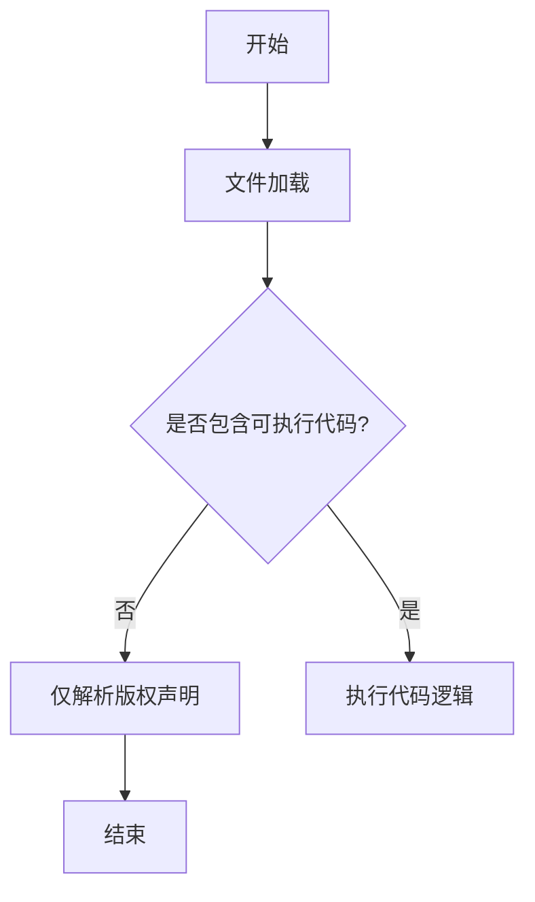

# `graphrag\tests\unit\indexing\graph\__init__.py` 详细设计文档

该文件仅包含版权声明和MIT许可证信息，没有实际的代码实现。文件是一个空壳或起始模板，用于声明代码的版权归属和开源许可。

## 整体流程



## 类结构

```

```

## 全局变量及字段


    

## 全局函数及方法


## 关键组件


### 源代码分析结果

提供的源代码仅包含版权声明和MIT许可证信息，没有实际的可执行代码可供分析。因此无法识别张量索引与惰性加载、反量化支持、量化策略等关键组件。

由于代码中不存在类定义、全局变量、函数实现或任何功能逻辑，以下文档项均无法提供：

- 类的详细信息（字段、方法）
- 全局变量和全局函数
- 执行流程
- 技术债务或优化建议
- 数据流与状态机设计

如需进行完整的设计文档分析，请提供包含实际业务逻辑的源代码。


## 问题及建议


### 已知问题

-   代码仅包含版权声明和许可证头部，缺乏实际实现代码，无法进行有意义的技术债务或优化分析

### 优化建议

-   请提供完整的源代码文件以进行详细的技术分析
-   当前仅有文件头，无法识别具体的类、结构、函数或业务逻辑
-   建议补充完整的代码实现后重新提交分析请求


## 其它


### 设计目标与约束

由于本代码文件仅包含版权声明和MIT许可证声明，无实际功能代码实现，因此无法确定具体的设计目标与约束。在实际的代码文件中，设计目标通常包括：性能要求（如响应时间、吞吐量）、可扩展性需求、安全性要求、兼容性要求等。约束条件可能包括技术栈限制、依赖项要求、代码规范、知识产权限制等。

### 错误处理与异常设计

当前文件不包含任何可执行的代码逻辑，因此不存在错误处理与异常设计的需求。在实际的系统设计中，错误处理与异常设计应包括：异常分类体系（如业务异常、系统异常、第三方异常）、异常传播机制、错误码定义规范、错误消息国际化策略、降级处理策略、重试机制设计等内容。

### 数据流与状态机

由于代码文件不包含任何业务逻辑实现，因此无法分析具体的数据流与状态机设计。在典型的应用程序中，数据流设计应描述数据从输入到输出的完整处理路径，包括数据来源、数据格式转换、数据处理逻辑、数据存储、数据输出等环节。状态机设计应定义系统或组件的所有可能状态、状态转换条件、触发事件、状态持久化策略等。

### 外部依赖与接口契约

当前文件无实际代码实现，不存在外部依赖关系。在实际的软件项目中，外部依赖与接口契约应包括：第三方库依赖及其版本要求、API接口定义（如RESTful API、GraphQL、gRPC等）、消息队列主题和消息格式定义、数据库表结构定义、缓存策略、认证授权机制、版本兼容性策略等内容。

### 安全性设计

由于代码文件仅包含许可证声明，无具体实现，因此无法进行安全性设计分析。在实际项目中，安全性设计应包括：身份认证机制（如OAuth2、JWT、API Key等）、授权控制策略（如RBAC、ABAC）、数据加密方案（传输加密、存储加密）、输入验证与过滤、安全审计日志、防护措施（如CSRF、XSS、SQL注入防护）等内容。

### 性能与监控设计

当前文件不包含任何可执行代码，因此不涉及性能与监控设计。在实际系统中，性能与监控设计应包括：性能指标定义（如响应时间P99、吞吐量QPS、错误率）、监控告警阈值、指标采集方案（如Prometheus、Datadog）、日志采集方案、链路追踪设计、性能优化策略（如缓存、异步处理、负载均衡）等内容。

### 部署与运维设计

由于本文件仅为一个简单的许可声明文件，不涉及部署与运维相关内容。在实际项目中，部署与运维设计应包括：部署架构（如容器化、Kubernetes、Serverless）、环境配置管理（如开发、测试、预发布、生产环境）、CI/CD流水线设计、备份与恢复策略、容灾方案、配置管理方案等内容。

### 测试策略

当前文件不包含可测试的代码，因此无测试策略可言。在实际项目中，测试策略应包括：单元测试覆盖率要求、集成测试策略、端到端测试策略、性能测试策略、安全测试策略、测试数据管理、测试环境管理、测试自动化方案等内容。


    