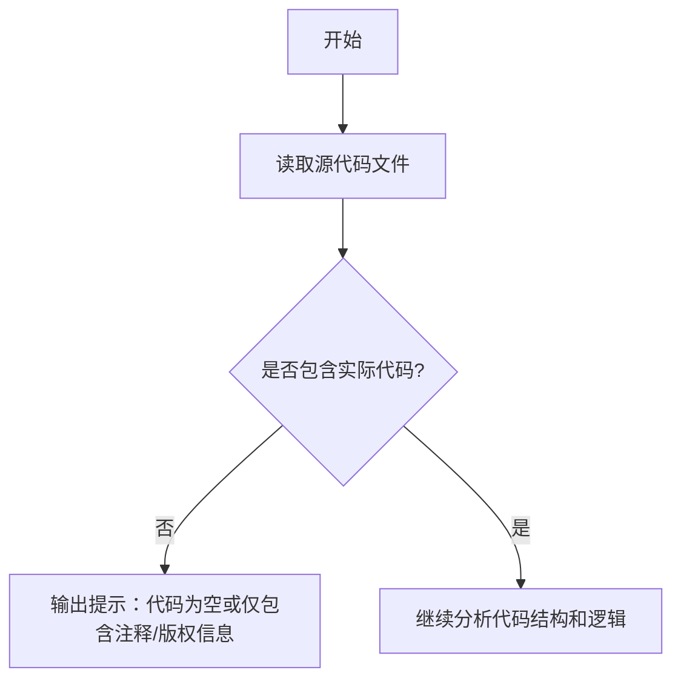

# `graphrag\tests\unit\indexing\graph\extractors\community_reports\__init__.py` 详细设计文档

该代码文件仅包含版权声明和MIT许可证信息，没有实际的代码实现内容，无法提取功能描述、类结构、方法或流程信息。

## 整体流程



## 类结构

```
该文件不包含任何类定义
```

## 全局变量及字段


    

## 全局函数及方法


## 关键组件


## 一段话描述

该代码文件仅包含版权声明头部，未包含任何实际的实现代码，因此无法提取功能描述、运行流程、类信息或关键组件。

## 文件的整体运行流程

由于源代码为空文件，仅包含版权声明，该文件不执行任何操作，不涉及运行流程。

## 类的详细信息

无类定义。

## 关键组件信息

### 无关键组件

当前代码中不包含任何可识别的关键组件，如张量索引、惰性加载、反量化支持或量化策略等功能模块。

## 潜在的技术债务或优化空间

由于无实际代码，无法评估技术债务或优化空间。

## 其它项目

- 设计目标与约束：未定义
- 错误处理与异常设计：无代码实现
- 数据流与状态机：无代码实现
- 外部依赖与接口契约：无代码实现


## 问题及建议


### 已知问题

-   代码仅包含版权声明，无实际实现代码，无法进行深入的技术债务或优化分析

### 优化建议

-   由于缺乏实际代码实现，暂无具体的优化建议可供提供


## 其它


### 设计目标与约束

设计目标：基于提供的代码片段（仅包含MIT许可证版权声明），无法确定具体的设计目标。通常设计目标应包括：性能指标（如响应时间、吞吐量）、可扩展性要求、兼容性需求等。

约束条件：代码受MIT许可证约束，需遵守开源许可协议的相关规定。

### 错误处理与异常设计

由于代码仅包含版权和许可声明，无实际功能实现，因此无错误处理与异常设计相关内容。在实际项目中，应定义异常类型、错误码体系、异常传播机制、降级策略等。

### 数据流与状态机

无数据流与状态机相关信息。详细设计应包含数据流向图、状态转换图、状态定义（开始、中间、结束状态）、触发条件等。

### 外部依赖与接口契约

无外部依赖信息。接口契约应包含：API接口定义、输入输出参数规范、返回格式、错误响应结构、版本管理策略等。

### 配置与参数说明

无配置项。设计文档应包含所有可配置参数、默认值、取值范围、配置加载方式、环境变量映射等。

### 性能考量与基准

无性能要求。文档应包含性能目标（延迟、吞吐量、资源占用）、性能测试场景、基准数据、性能优化策略等。

### 安全考虑

无安全实现。设计应包含认证授权机制、数据加密方案、输入验证、审计日志、安全合规性（如GDPR、HIPAA）等。

### 部署与运维指南

无部署相关配置。文档应包含部署环境要求、依赖安装步骤、配置文件路径、健康检查接口、监控指标、日志规范等。

### 测试策略

无测试实现。设计应包含单元测试、集成测试、系统测试策略，测试覆盖率目标，测试环境搭建，mock服务方案等。

### 版本兼容性

无版本信息。建议包含当前版本号、与前版本的兼容性说明（破坏性变更列表）、升级指南、长期支持版本计划等。

### 参考文档与资源

- Microsoft开源项目参考：https://opensource.microsoft.com/
- MIT License参考：https://opensource.org/licenses/MIT


    