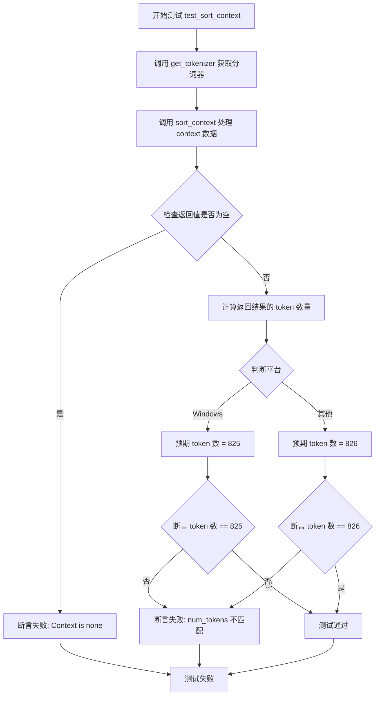
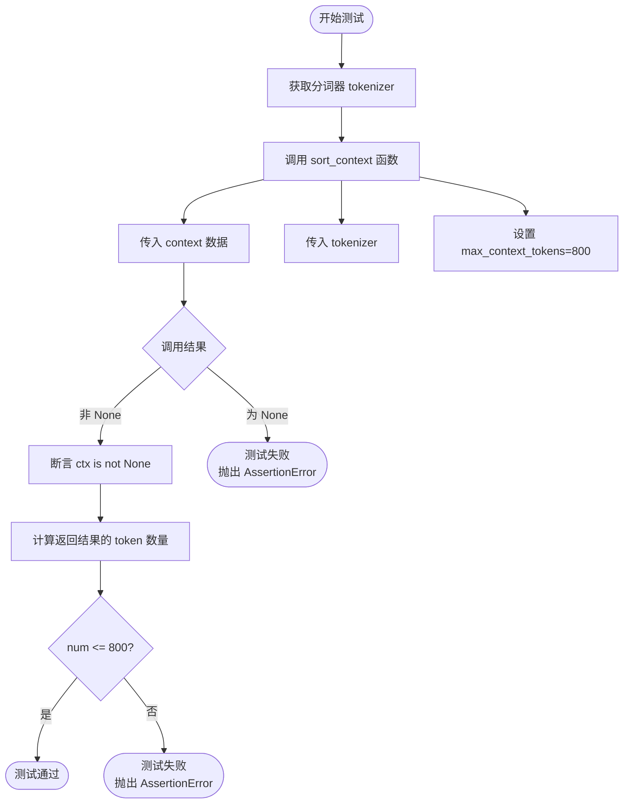

# `graphrag\tests\unit\indexing\graph\extractors\community_reports\test_sort_context.py` 详细设计文档

这是一个测试模块，用于验证图检索上下文的排序功能。代码定义了一个包含多个实体（如人物、地点等）及其关联边的上下文数据，并测试了 sort_context 函数在处理该上下文时的正确性，包括 token 数量计算和最大 token 限制。

## 整体流程

```mermaid
graph TD
    A[开始] --> B[定义全局变量 context 和 nan]
B --> C{执行测试函数}
C --> D[test_sort_context]
C --> E[test_sort_context_max_tokens]
D --> F[调用 get_tokenizer 获取分词器]
F --> G[调用 sort_context 处理 context]
G --> H{验证返回上下文非空}
H --> I[计算 token 数量]
I --> J{根据平台验证 token 数量}
J --> K[Windows: 825, 其他: 826]
E --> L[调用 get_tokenizer 获取分词器]
L --> M[调用 sort_context 处理 context 并设置 max_context_tokens=800]
M --> N{验证返回上下文非空}
N --> O[计算 token 数量]
O --> P{验证 token 数量 <= 800}]
```

## 类结构

```
无类层次结构（该文件为测试模块，仅包含全局变量和测试函数）
```

## 全局变量及字段


### `context`
    
包含多个实体及其关联边和声明的上下文数据

类型：`list[dict]`
    


### `nan`
    
数学上的非数字值，用于表示空数据

类型：`float`
    


    

## 全局函数及方法


### `test_sort_context`

该测试函数用于验证 sort_context 函数的基本功能，通过传入预定义的上下文数据（包含多个实体及其详细信息）并使用分词器进行处理，然后断言返回结果非空，并根据不同平台（Windows 与其他系统）验证输出的 token 数量是否符合预期（Windows 为 825，其他系统为 826）。

参数：此函数无参数。

返回值：`None`，测试函数不返回任何值，仅通过断言进行验证。

#### 流程图



#### 带注释源码

```python
def test_sort_context():
    """
    测试 sort_context 函数的基本功能
    
    该测试函数执行以下步骤：
    1. 获取分词器（tokenizer）
    2. 调用 sort_context 对预定义的 context 数据进行排序处理
    3. 验证返回结果不为 None
    4. 验证不同平台下的 token 数量是否符合预期
    
    Windows 平台预期 token 数为 825，其他平台为 826
    """
    # 获取分词器实例，用于计算文本的 token 数量
    tokenizer = get_tokenizer()
    
    # 调用 sort_context 函数处理上下文数据
    # 传入预定义的 context 列表和 tokenizer
    ctx = sort_context(context, tokenizer=tokenizer)
    
    # 断言返回结果不为空
    assert ctx is not None, "Context is none"
    
    # 计算处理后结果的 token 数量
    num = tokenizer.num_tokens(ctx)
    
    # 根据平台验证 token 数量
    # Windows 平台为 825，其他平台为 826
    # 这可能是由于不同平台的 token 化规则略有差异
    assert num == 825 if platform.system() == "Windows" else 826, (
        f"num_tokens is not matched for platform (win = 825, else 826): {num}"
    )
```


### `test_sort_context_max_tokens`

该函数用于测试 `sort_context` 函数在限制最大 token 数量时的行为，验证当设置 `max_context_tokens=800` 时，返回的上下文内容的 token 数量是否被正确限制在 800 以内。

参数： 无

返回值： `None`，该函数为测试函数，不返回任何值，通过断言验证功能正确性

#### 流程图



#### 带注释源码

```python
def test_sort_context_max_tokens():
    """
    测试 sort_context 函数在限制最大 token 数量时的行为
    
    该测试函数验证当设置 max_context_tokens=800 时，
    sort_context 函数能够正确地将返回的上下文内容限制在指定的 token 数量以内
    """
    # 获取分词器实例，用于对文本进行 token 计数
    tokenizer = get_tokenizer()
    
    # 调用 sort_context 函数，传入测试用的 context 数据
    # 并设置 max_context_tokens=800 来限制返回的 token 数量
    ctx = sort_context(context, tokenizer=tokenizer, max_context_tokens=800)
    
    # 断言返回的上下文不为 None，确保函数正常执行
    assert ctx is not None, "Context is none"
    
    # 使用分词器计算返回上下文的 token 数量
    num = tokenizer.num_tokens(ctx)
    
    # 断言 token 数量不超过 800，验证限制功能正常工作
    assert num <= 800, f"num_tokens is not less than or equal to 800: {num}"
```

## 关键组件


### sort_context 函数

核心排序函数，负责根据 token 限制对图社区上下文进行排序，支持最大 token 数约束，返回排序后的上下文列表。

### get_tokenizer 函数

外部依赖的 tokenization 工具，用于获取文本分词器实例，支持计算上下文中的 token 数量。

### context 数据结构

图社区上下文数据容器，以列表形式存储实体信息，包含标题、度数、节点详情、边详情和声明详情，节点详情包含 human_readable_id、title、description 和 degree，边详情包含 human_readable_id、source、target、description 和 combined_degree。

### test_sort_context 测试函数

验证 sort_context 基本功能，断言返回上下文非空且 token 数量符合平台预期（Windows 为 825，其他为 826）。

### test_sort_context_max_tokens 测试函数

验证 max_context_tokens 参数约束功能，断言返回上下文 token 数不超过指定上限 800。


## 问题及建议


### 已知问题

- **硬编码的测试数据**: `context` 变量被硬编码在文件中，数据量随实体增加会导致文件体积膨胀，维护成本升高
- **平台相关的断言逻辑**: 使用 `platform.system() == "Windows"` 判断 token 数量（825 vs 826），这种实现暴露了底层 tokenizer 或排序逻辑的跨平台不一致性，属于潜在的环境依赖问题
- **魔法数字缺乏文档**: 825 和 826 这两个 token 阈值没有任何注释说明其来源或业务含义，后续维护者难以理解为何以此为基准
- **NaN 值处理风险**: 数据中多处使用 `math.nan`（如 `edge_details` 和 `claim_details` 首元素），Python 3 中 NaN 与任何值比较均返回 False，可能导致排序结果不可预期
- **测试边界覆盖不足**: 仅验证了正常流程和单一阈值场景，缺少对空列表、单元素、重复 title、max_context_tokens 极端值（如 0 或负数）等边界条件的测试
- **导入路径耦合**: 依赖相对路径导入 `sort_context`，模块重构时容易触发导入失败，缺乏灵活性

### 优化建议

- 将测试数据分离至独立的 JSON/YAML 文件或使用数据工厂模式生成，减少主文件体积
- 抽取平台相关配置至独立配置文件，统一管理不同环境的预期值；对 token 数量差异进行根因分析，从根本上消除跨平台不一致
- 为关键阈值（如 800、825、826）添加常量定义和业务注释，说明其设计依据
- 考虑在数据预处理阶段显式处理 NaN 值，或在测试中增加对 NaN 排序行为的明确断言
- 补充边界值测试用例：空 context、单节点、max_context_tokens=0/负数/超大数据、title 重复场景
- 使用绝对导入或通过配置注入依赖，提升模块重构容忍度

## 其它


### 设计目标与约束

本模块的设计目标是验证 `sort_context` 函数能够正确对图谱社区上下文进行排序和分词，确保输出结果符合预期的 token 数量限制。主要约束包括：必须使用指定的 tokenizer、处理 `nan` 值、兼容 Windows 和非 Windows 平台的 token 计数差异、上下文列表中的每个元素必须包含 title、degree、node_details、edge_details、claim_details 字段。

### 错误处理与异常设计

错误处理采用 Python 断言机制（assert），当上下文为 None 时抛出 AssertionError 并附带明确错误信息。token 数量不匹配时同样通过断言失败并显示实际值与预期值的差异。当前设计缺少自定义异常类，对于生产环境建议引入自定义异常如 `ContextProcessingError`，并添加更细粒度的异常捕获，如处理 tokenizer 为 None、context 格式错误等情况。

### 数据流与状态机

数据流从外部导入的 `context` 全局变量开始，该变量是一个包含多个实体字典的列表。每个字典代表一个图谱节点及其关联的边和声明信息。数据流经过 `sort_context` 函数处理后，返回重新排序的上下文列表，然后通过 tokenizer 计算 token 数量进行验证。没有复杂的状态机设计，属于简单的线性处理流程。

### 外部依赖与接口契约

主要外部依赖包括：`graphrag.index.operations.summarize_communities.graph_context.sort_context.sort_context` 函数（被测试的核心函数）、`graphrag.tokenizer.get_tokenizer.get_tokenizer` 获取分词器实例、`math` 模块的 nan 值定义、`platform` 模块用于平台检测。接口契约方面：`sort_context` 接收 context 列表和 tokenizer 参数，可选参数 max_context_tokens 返回重新排序的上下文列表；`get_tokenizer` 无参数返回分词器实例。

### 性能考虑与优化空间

当前测试在 token 数量验证上存在平台差异判断（Windows 825 vs 其他 826），建议统一为单一标准值以提高可维护性。context 数据包含大量重复的 combined_degree=32 字段，可考虑优化数据结构。测试未覆盖空列表输入、单个元素、极大列表等边界情况。建议添加性能基准测试，测量不同规模 context 的处理时间。

### 测试策略与覆盖率

现有测试覆盖两个场景：默认排序验证和 max_context_tokens 限制验证。测试数据包含 9 个实体，涵盖不同类型的图谱节点（人物、节日、抽象概念）。建议补充的测试用例包括：空 context 列表、None tokenizer 处理、max_context_tokens 为 0 或负数、max_context_tokens 超过实际需求、节点字段缺失的异常情况、tokenizer 异常情况。

### 配置管理与环境要求

依赖 Python 3.x 环境，需要安装 graphrag 包。tokenizer 的获取依赖全局配置，测试通过 `get_tokenizer()` 动态获取。平台差异通过 `platform.system()` 检测实现，当前代码硬编码了 Windows 和非 Windows 的预期值，建议提取为配置文件或环境变量。

### 代码质量与可维护性

代码整体结构清晰，但存在重复代码模式（两次测试中都获取 tokenizer）。建议抽取公共的 tokenizer 获取逻辑到 fixture 或辅助函数。context 测试数据可以抽取为常量或外部 JSON 文件，提高可读性和可维护性。缺乏文档注释和类型注解，建议为测试函数添加详细的 docstring 说明测试目的和预期行为。

### 安全性考虑

当前代码无用户输入处理，主要为内部测试用途，安全性风险较低。潜在风险点包括：依赖第三方包的版本兼容性、tokenizer 可能处理敏感数据。建议在生产环境中对 tokenizer 输入进行验证，确保不处理恶意构造的数据。

### 监控与日志

当前实现没有任何日志输出，建议添加关键操作日志：sort_context 调用日志、token 计数超限警告、测试结果摘要日志。生产环境建议集成标准日志框架（如 logging 模块），设置不同日志级别便于问题排查。

    