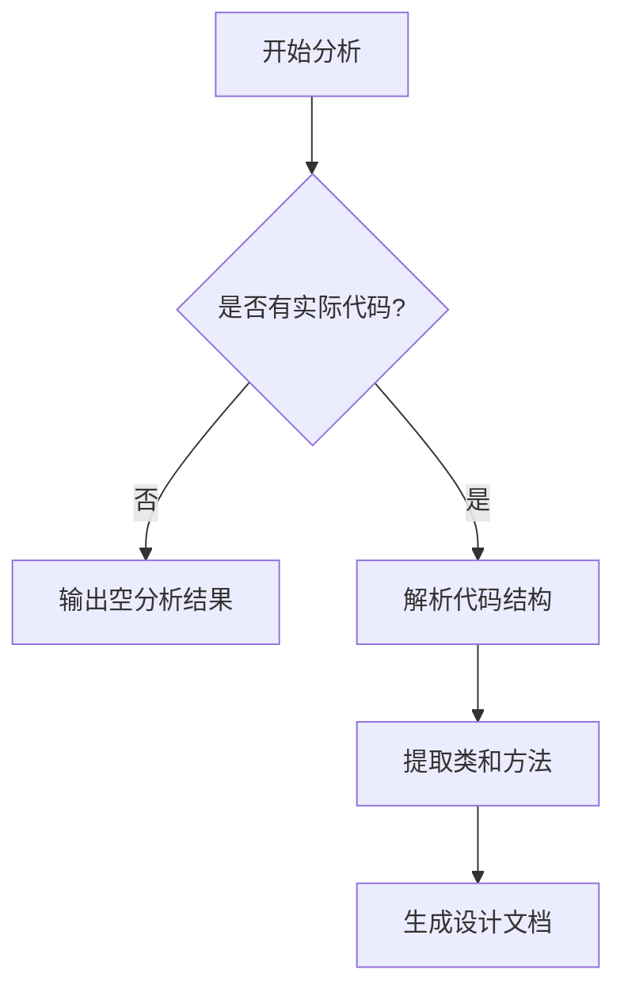

# `graphrag\tests\unit\indexing\graph\utils\__init__.py` 详细设计文档

该文件仅包含MIT许可证的版权声明头，不包含任何可执行的代码逻辑。因此无法提取类、方法、变量等设计元素进行详细分析。

## 整体流程



## 类结构

```
该代码文件不包含任何类定义
```

## 全局变量及字段


    

## 全局函数及方法


## 关键组件


## 概述

由于提供的源代码仅包含版权声明头，无实际代码实现，因此无法识别任何功能性组件。

## 关键组件

无（代码中未包含任何实现逻辑）

## 技术债务与优化空间

无（无代码实现）

## 其它

由于源代码仅包含版权声明，无法进行进一步的逻辑分析、流程图绘制或详细的架构设计。若需要完整的详细设计文档，请提供包含实际业务逻辑的源代码。


## 问题及建议


### 已知问题

-   代码文件仅包含版权声明信息，缺少实际的实现代码，无法进行功能层面的技术债务分析
-   文件内容为空，不包含任何类、函数或业务逻辑实现

### 优化建议

-   补充完整的源代码后再进行技术债务评估和优化建议的生成
-   建议提供包含实际业务逻辑的代码文件，以便进行架构设计文档的编写
-   当前状态仅能确认版权和许可证信息符合 MIT 协议要求


## 其它


### 一段话描述

该代码文件目前仅包含版权声明和MIT许可证声明，无实际功能实现代码，属于项目框架或占位文件。

### 文件的整体运行流程

由于该文件不包含任何可执行代码，因此不存在运行流程。该文件作为项目的版权和许可证声明文件存在。

### 类的详细信息

由于该文件不包含任何类定义，因此不存在类信息。

### 类字段和全局变量

由于该文件不包含任何变量定义，因此不存在类字段或全局变量信息。

### 类方法和全局函数

由于该文件不包含任何方法或函数定义，因此不存在类方法或全局函数信息。

### 关键组件信息

由于该文件不包含任何功能组件，因此不存在关键组件信息。

### 潜在的技术债务或优化空间

由于该文件仅为版权声明文件，不存在技术债务。如后续添加实际功能代码，建议遵循以下优化原则：
- 单一职责原则：每个模块或类只负责一项功能
- 保持代码简洁性和可读性
- 添加充分的单元测试覆盖
- 遵循项目既定的代码规范和风格指南

### 设计目标与约束

- **设计目标**：由于文件暂无功能代码，无法确定具体设计目标
- **约束条件**：如后续开发，需遵循MIT许可证的开源约束

### 错误处理与异常设计

- **错误处理**：由于文件暂无功能代码，不存在错误处理机制
- **异常设计**：由于文件暂无功能代码，不存在异常设计

### 数据流与状态机

- **数据流**：由于文件暂无功能代码，不存在数据流设计
- **状态机**：由于文件暂无功能代码，不存在状态机设计

### 外部依赖与接口契约

- **外部依赖**：由于文件暂无功能代码，不存在外部依赖
- **接口契约**：由于文件暂无功能代码，不存在接口契约定义

### 代码结构与模块划分

由于该文件仅包含版权声明，不涉及代码结构和模块划分。建议后续添加功能代码时，按照功能模块化组织代码结构。

### 测试策略

由于该文件暂无功能代码，无法制定测试策略。建议后续添加功能代码时：
- 编写单元测试确保核心功能正确性
- 编写集成测试验证模块间协作
- 保持测试覆盖率在合理水平


    