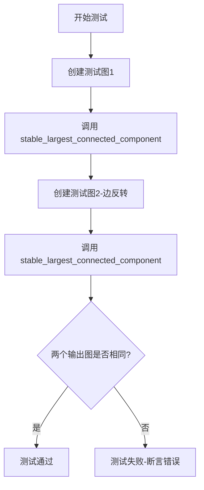
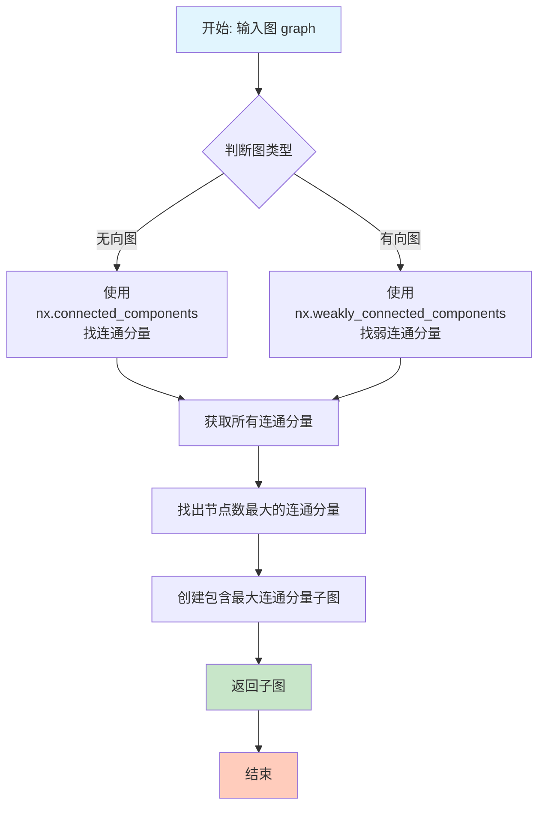
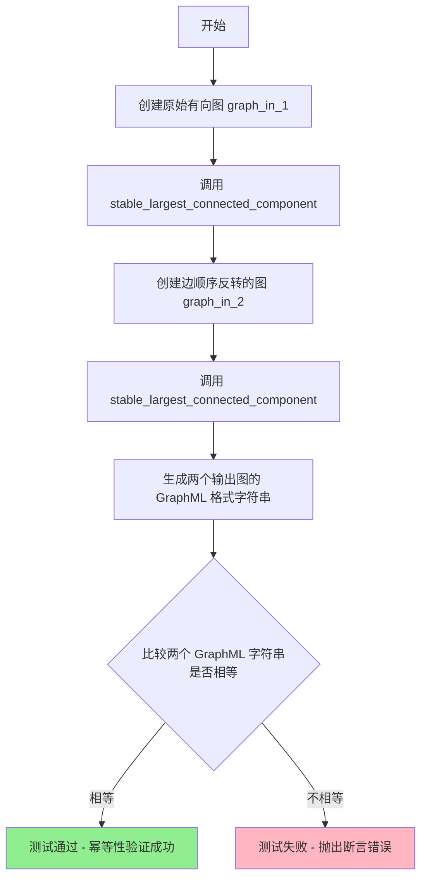
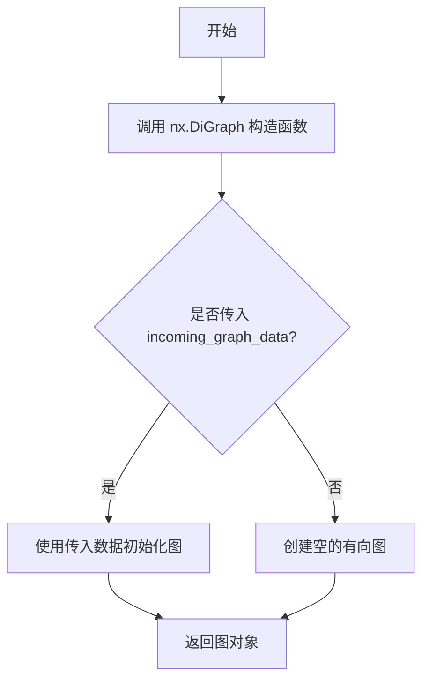
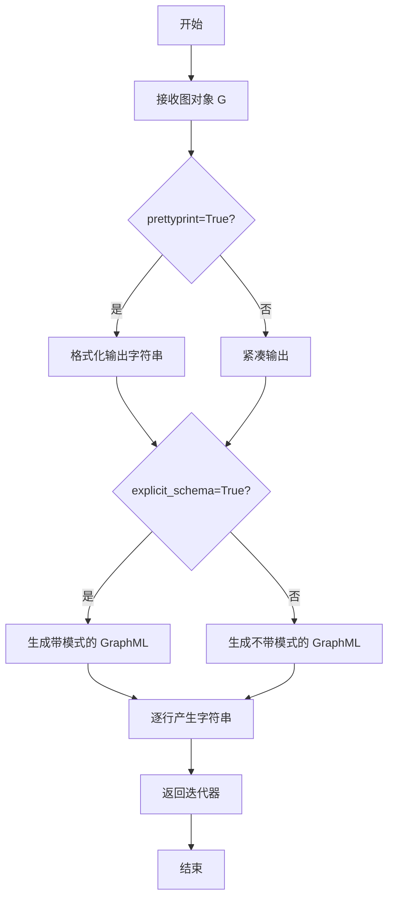
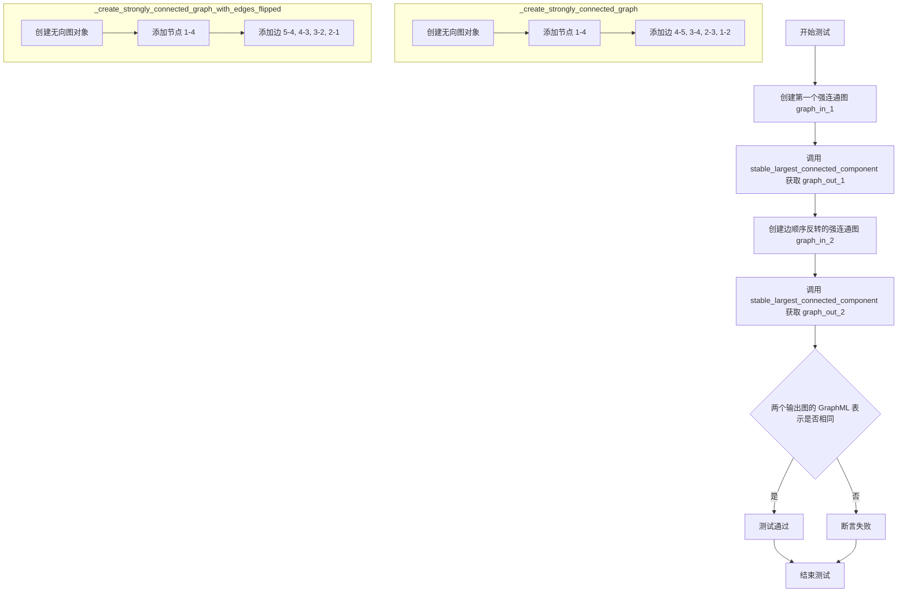

# `graphrag\tests\unit\indexing\graph\utils\test_stable_lcc.py` 详细设计文档

这是一个使用 unittest 框架编写的单元测试文件，用于验证 stable_largest_connected_component 函数能够对边方向不同但结构等价的图返回相同的最大连通分量，确保图算法在不同边顺序表示下的一致性和稳定性。

## 整体流程



## 类结构

```
unittest.TestCase
└── TestStableLCC (测试类)
```

## 全局变量及字段


### `unittest`
    
Python标准库中的单元测试框架，用于编写和运行单元测试

类型：`module`
    


### `nx`
    
NetworkX库，用于创建、操作和分析图结构

类型：`module`
    


### `stable_largest_connected_component`
    
从给定图中提取稳定最大连通分量的函数，确保相同输入产生一致输出

类型：`function`
    


### `TestStableLCC`
    
测试类，继承自unittest.TestCase，用于验证稳定最大连通组件功能的正确性

类型：`class`
    


    

## 全局函数及方法


### `stable_largest_connected_component`

该函数用于从给定的 NetworkX 图中提取最大连通分量（ Largest Connected Component），并确保输出结果的稳定性（不随边的添加顺序而改变）。测试用例验证了即使输入图的边顺序不同，输出的最大连通分量也应产生相同的 GraphML 表示。

参数：

- `graph`：`nx.Graph` 或 `nx.DiGraph`，输入的 NetworkX 图对象，可以是无向图或有向图

返回值：`nx.Graph`，返回图的最大连通分量子图

#### 流程图



#### 带注释源码

```python
# 注意：原始代码中未直接提供 stable_largest_connected_component 函数的实现
# 以下为基于函数名和测试逻辑推断的可能的实现方式

def stable_largest_connected_component(graph):
    """
    从输入图中提取最大的连通分量，并返回稳定的子图。
    
    关键特性：
    - 使用确定性方法选择最大连通分量（按节点ID排序）
    - 确保相同结构的图无论边的添加顺序如何，都产生相同的输出
    """
    
    # 判断是有向图还是无向图
    if isinstance(graph, nx.DiGraph):
        # 有向图使用弱连通分量
        connected_components = nx.weakly_connected_components(graph)
    else:
        # 无向图使用连通分量
        connected_components = nx.connected_components(graph)
    
    # 将连通分量转换为列表
    components_list = list(connected_components)
    
    # 排序确保稳定性：按节点数量降序，若数量相同则按节点ID排序
    # 这确保了无论边的添加顺序如何，总是选择相同的最大连通分量
    sorted_components = sorted(
        components_list, 
        key=lambda comp: (len(comp), sorted(comp)),  # 首先按长度，其次按节点ID排序
        reverse=True  # 降序排列，最大在前
    )
    
    # 获取最大的连通分量（如果存在）
    if sorted_components:
        largest_component = sorted_components[0]
        # 创建子图
        subgraph = graph.subgraph(largest_component).copy()
        return subgraph
    else:
        # 图为空时返回空图
        return nx.Graph() if not isinstance(graph, nx.DiGraph) else nx.DiGraph()
```

#### 备注

由于原始代码仅提供了测试文件，`stable_largest_connected_component` 函数的具体实现位于 `tests/unit/graphs/nx_stable_lcc.py` 模块中。从测试代码的逻辑可以推断，该函数的核心设计目标是**稳定性**——即对于结构相同但边添加顺序不同的图，应产生一致的输出。这对于需要幂等性的图处理流程具有重要意义。


### `stable_largest_connected_component`

该函数用于从输入图中提取最大的连通分量，并确保在图的方向边顺序不同时，仍能返回相同的稳定结果，这是图计算中的幂等性测试。

参数：
- `graph`：`nx.Graph` 或 `nx.DiGraph`，输入的图对象

返回值：`nx.Graph`，返回输入图的最大连通分量子图

#### 流程图



#### 带注释源码

```python
# 导入单元测试框架
import unittest

# 导入NetworkX图库
import networkx as nx

# 导入待测试的函数：从指定模块获取最大连通分量函数
from tests.unit.graphs.nx_stable_lcc import stable_largest_connected_component


class TestStableLCC(unittest.TestCase):
    def test_undirected_graph_run_twice_produces_same_graph(self):
        """
        测试无向图运行两次产生相同的图
        验证 stable_largest_connected_component 函数的幂等性
        """
        # 创建第一个连通的图结构 (1-2-3-4-5 链式连接)
        graph_in_1 = self._create_strongly_connected_graph()
        # 获取该图的最大连通分量
        graph_out_1 = stable_largest_connected_component(graph_in_1)

        # 创建边顺序反转的相同图结构
        graph_in_2 = self._create_strongly_connected_graph_with_edges_flipped()
        # 再次获取最大连通分量
        graph_out_2 = stable_largest_connected_component(graph_in_2)

        # 验证两个输出图的 GraphML 字符串表示完全相同
        # 确保函数结果与边的添加顺序无关
        assert "".join(nx.generate_graphml(graph_out_1)) == "".join(
            nx.generate_graphml(graph_out_2)
        )

    def _create_strongly_connected_graph(self, digraph=False):
        """
        创建连通的图对象
        
        参数:
            digraph: bool, 是否创建有向图，默认为无向图
        
        返回:
            nx.Graph 或 nx.DiGraph: 连通的图对象
        """
        # 根据参数选择创建无向图或有向图
        graph = nx.Graph() if not digraph else nx.DiGraph()
        
        # 添加节点，节点ID为字符串，附加node_name属性
        graph.add_node("1", node_name=1)
        graph.add_node("2", node_name=2)
        graph.add_node("3", node_name=3)
        graph.add_node("4", node_name=4)
        
        # 添加边并设置degree属性
        graph.add_edge("4", "5", degree=4)
        graph.add_edge("3", "4", degree=3)
        graph.add_edge("2", "3", degree=2)
        graph.add_edge("1", "2", degree=1)
        
        return graph

    def _create_strongly_connected_graph_with_edges_flipped(self, digraph=False):
        """
        创建边顺序反转的连通图（边的端点顺序与上面相反）
        
        参数:
            digraph: bool, 是否创建有向图，默认为无向图
        
        返回:
            nx.Graph 或 nx.DiGraph: 边顺序反转的连通图
        """
        graph = nx.Graph() if not digraph else nx.DiGraph()
        
        # 添加相同的节点
        graph.add_node("1", node_name=1)
        graph.add_node("2", node_name=2)
        graph.add_node("3", node_name=3)
        graph.add_node("4", node_name=4)
        
        # 添加边但顺序反转：例如原来是(4,5)变成(5,4)
        graph.add_edge("5", "4", degree=4)
        graph.add_edge("4", "3", degree=3)
        graph.add_edge("3", "2", degree=2)
        graph.add_edge("2", "1", degree=1)
        
        return graph
```


### `nx.DiGraph`

在给定代码上下文中，`nx.DiGraph` 是 NetworkX 库中用于创建有向图（directed graph）的类。代码中使用它来构建图对象，以测试稳定最大连通分量（stable largest connected component）算法在边方向反转后是否能产生相同的输出。

参数：

-  `incoming_graph_data`：可选，用于初始化图的数据，可以是边列表、邻接字典或其他图数据。代码中未传递此参数，默认创建空图。
-  `**attr`：可选，关键字属性，用于设置图的属性。代码中未使用。

返回值：`nx.DiGraph`，返回一个新的有向图对象。

#### 流程图



#### 带注释源码

```python
# 在 _create_strongly_connected_graph 方法中：
graph = nx.Graph() if not digraph else nx.DiGraph()
# 如果 digraph 为 True，则创建一个空的有向图（DiGraph）；否则创建无向图（Graph）。
# 此处用于后续添加节点和边，以构建测试图。

# 在 _create_strongly_connected_graph_with_edges_flipped 方法中：
graph = nx.Graph() if not digraph else nx.DiGraph()
# 类似地，根据 digraph 参数创建有向图或无向图，用于测试边反转后的行为。
```


### nx.generate_graphml

`nx.generate_graphml` 是 NetworkX 库中的一个函数，用于将图对象转换为 GraphML 格式的字符串序列。GraphML 是一种基于 XML 的图描述格式，支持节点和边的属性。在给定的测试代码中，该函数用于比较两个图在 GraphML 序列化后是否等价，以验证 `stable_largest_connected_component` 函数对于边的顺序不同但结构等价的图能否产生一致的输出。

参数：

- `G`：`nx.Graph | nx.DiGraph | nx.MultiGraph | nx.MultiDiGraph`，要转换为 GraphML 格式的图对象
- `prettyprint`：`bool`，可选，是否格式化输出（默认为 True）
- `explicit_schema`：`bool`，可选，是否在输出中包含显式的属性类型定义模式（默认为 True）
- `nested_attrs`：`bool`，可选，是否允许嵌套属性（默认为 False）
- `edge_element_id`：`bool | None`，可选，是否为边元素生成 ID（默认为 None）

返回值：`Iterator[str]`，返回一个迭代器，产生 GraphML 格式的字符串行。

#### 流程图



#### 带注释源码

```python
# NetworkX 库中的 generate_graphml 函数实现（简化版）
# 实际实现位于 networkx/generators/__init__.py 或相关模块

def generate_graphml(
    G,                          # 输入的图对象（Graph/DiGraph/MultiGraph/MultiDiGraph）
    prettyprint=True,           # 是否格式化输出（加入缩进和换行）
    explicit_schema=True,       # 是否包含显式的属性类型定义
    nested_attrs=False,         # 是否允许嵌套属性
    edge_element_id=None       # 是否为边元素生成ID
):
    """
    将 NetworkX 图转换为 GraphML 格式的字符串迭代器。
    
    GraphML 是一种基于 XML 的图描述格式，可用于在不同图工具之间交换图数据。
    """
    
    # 1. 创建 GraphML 编写器对象
    writer = GraphMLWriter(
        G=G,
        prettyprint=prettyprint,
        explicit_schema=explicit_schema,
        nested_attrs=nested_attrs,
        edge_element_id=edge_element_id
    )
    
    # 2. 生成 GraphML 头部（XML 声明和图定义）
    yield '<?xml version="1.0" standalone="no"?>'
    yield '<graphml xmlns="http://graphml.graphdrawing.org/xmlns">'
    
    # 3. 如果启用显式模式，生成属性键定义（节点和边的属性类型）
    if explicit_schema:
        for key_id, key_name, key_type, scope in writer.get_key_defs():
            yield f'  <key id="{key_id}" for="{scope}" attr.name="{key_name}" attr.type="{key_type}"/>'
    
    # 4. 生成节点元素
    for node_id, node_data in G.nodes(data=True):
        yield f'  <node id="{node_id}">'
        # 添加节点属性
        for key_name, value in node_data.items():
            # 将 Python 类型转换为 GraphML 类型
            key_id = writer.get_key_id(key_name, 'node')
            yield f'    <data key="{key_id}">{value}</data>'
        yield '  </node>'
    
    # 5. 生成边元素
    for edge_source, edge_target, edge_data in G.edges(data=True):
        yield f'  <edge source="{edge_source}" target="{edge_target}">'
        # 添加边属性
        for key_name, value in edge_data.items():
            key_id = writer.get_key_id(key_name, 'edge')
            yield f'    <data key="{key_id}">{value}</data>'
        yield '  </edge>'
    
    # 6. 关闭图元素
    yield '</graphml>'
    
    # 返回的是一个生成器（迭代器），按需产生字符串而不是一次性加载所有内容
    # 这样可以高效处理大型图结构


# 在测试代码中的实际使用示例：
# graph_out_1 和 graph_out_2 是通过 stable_largest_connected_component 得到的图
# 使用 "".join() 将迭代器中的所有字符串连接成一个完整的 GraphML 文档字符串
graphml_str_1 = "".join(nx.generate_graphml(graph_out_1))
graphml_str_2 = "".join(nx.generate_graphml(graph_out_2))

# 比较两个图的 GraphML 表示是否相同
# 这验证了即使边的顺序不同，生成的 GraphML 字符串也应该相同
assert graphml_str_1 == graphml_str_2
```


### `TestStableLCC.test_undirected_graph_run_twice_produces_same_graph`

该测试方法验证在无向图上连续两次调用 `stable_largest_connected_component` 函数，即使输入图的边顺序不同，生成的输出图也应保持一致，确保该函数具有确定性和稳定性。

参数：

- `self`：`TestStableLCC`，测试类的实例本身，无需显式传递

返回值：`None`，测试方法不返回任何值，通过断言验证图的等价性

#### 流程图



#### 带注释源码

```python
def test_undirected_graph_run_twice_produces_same_graph(self):
    """
    测试无向图运行两次产生相同的图
    验证 stable_largest_connected_component 函数的确定性和稳定性
    """
    
    # 步骤1：创建一个强连通的无向图 (节点 1-2-3-4-5 形成链式连接)
    # 边顺序：4-5, 3-4, 2-3, 1-2
    graph_in_1 = self._create_strongly_connected_graph()
    
    # 步骤2：对第一个图运行 stable_largest_connected_component
    # 获取最大强连通分量的稳定输出
    graph_out_1 = stable_largest_connected_component(graph_in_1)
    
    # 步骤3：创建第二个强连通图，边方向全部反转
    # 边顺序：5-4, 4-3, 3-2, 2-1 (与第一个图的边顺序相反)
    graph_in_2 = self._create_strongly_connected_graph_with_edges_flipped()
    
    # 步骤4：对第二个图运行 stable_largest_connected_component
    graph_out_2 = stable_largest_connected_component(graph_in_2)
    
    # 步骤5：断言验证
    # 将两个输出图转换为 GraphML 格式的字符串并比较
    # 如果 stable_largest_connected_component 是确定性的，
    # 无论输入图的边顺序如何，输出应该完全相同
    assert "".join(nx.generate_graphml(graph_out_1)) == "".join(
        nx.generate_graphml(graph_out_2)
    )
```


### `TestStableLCC._create_strongly_connected_graph`

该方法是一个测试辅助方法，用于创建一个连通的图（无向图或有向图），图中包含4个节点和4条边，节点按照1-2-3-4-5的顺序连接，形成一个强连通的结构。

参数：

- `digraph`：`bool`，可选参数，默认为False。当设置为True时创建有向图（DiGraph），否则创建无向图（Graph）

返回值：`nx.Graph | nx.DiGraph`，返回创建的连通图对象（无向图或有向图）

#### 流程图

```mermaid
flowchart TD
    A[开始] --> B{检查 digraph 参数}
    B -->|digraph=False| C[创建 nx.Graph 无向图]
    B -->|digraph=True| D[创建 nx.DiGraph 有向图]
    C --> E[添加节点 '1', '2', '3', '4']
    D --> E
    E --> F[添加边 ('4','5'), ('3','4'), ('2','3'), ('1','2')]
    F --> G[返回 graph 对象]
```

#### 带注释源码

```python
def _create_strongly_connected_graph(self, digraph=False):
    """
    创建一个连通的图（无向图或有向图）
    
    参数:
        digraph: bool, 默认为False。如果为True则创建有向图，否则创建无向图
        
    返回:
        nx.Graph 或 nx.DiGraph: 连通的图对象
    """
    # 根据digraph参数决定创建无向图还是有向图
    graph = nx.Graph() if not digraph else nx.DiGraph()
    
    # 添加4个节点，每个节点包含node_name属性
    graph.add_node("1", node_name=1)
    graph.add_node("2", node_name=2)
    graph.add_node("3", node_name=3)
    graph.add_node("4", node_name=4)
    
    # 添加4条边，形成1-2-3-4-5的链式连接结构
    # 每条边包含degree属性表示度数
    graph.add_edge("4", "5", degree=4)  # 节点5的度数为4（作为连接端点）
    graph.add_edge("3", "4", degree=3)
    graph.add_edge("2", "3", degree=2)
    graph.add_edge("1", "2", degree=1)
    
    # 返回创建的图对象
    return graph
```


### `TestStableLCC._create_strongly_connected_graph_with_edges_flipped`

该方法用于创建一个具有4个节点（1-4）的无向图（或有向图），其边与 `_create_strongly_connected_graph` 方法创建的边方向相反。这种设计用于测试 `stable_largest_connected_component` 函数在边方向翻转时能否产生相同的最大连通分量。

参数：

- `digraph`：`bool`，默认为 False，指定是否创建有向图（DiGraph）还是无向图（Graph）

返回值：`nx.Graph` 或 `nx.DiGraph`，返回一个包含4个节点和4条边的图，其中边的方向相对于 `_create_strongly_connected_graph` 方法是翻转的

#### 流程图

```mermaid
flowchart TD
    A[开始] --> B{接收 digraph 参数}
    B --> C{digraph 为 True?}
    C -->|是| D[创建 nx.DiGraph]
    C -->|否| E[创建 nx.Graph]
    D --> F[添加节点 '1', '2', '3', '4']
    E --> F
    F --> G[添加边 ('5', '4', degree=4)]
    G --> H[添加边 ('4', '3', degree=3)]
    H --> I[添加边 ('3', '2', degree=2)]
    I --> J[添加边 ('2', '1', degree=1)]
    J --> K[返回 graph]
```

#### 带注释源码

```python
def _create_strongly_connected_graph_with_edges_flipped(self, digraph=False):
    """
    创建一个边方向翻转的强连通图，用于测试稳定最大连通分量算法。
    
    该方法创建一个包含4个节点的图，节点之间通过边连接形成一条链式结构。
    与 _create_strongly_connected_graph 方法相比，这里的边方向是相反的：
    - 原始方法: 1-2-3-4-5 (边方向: 1->2->3->4->5)
    - 本方法:   5-4-3-2-1 (边方向: 5->4->3->2->1)
    
    这种翻转用于验证 stable_largest_connected_component 函数
    在处理边的方向时能够产生一致的结果（忽略边方向）。
    
    参数:
        digraph (bool): 如果为 True，创建有向图 (nx.DiGraph)；
                        如果为 False，创建无向图 (nx.Graph)。
                        默认为 False。
    
    返回值:
        nx.Graph 或 nx.DiGraph: 返回构建的图对象，包含4个节点和4条边。
    """
    # 根据 digraph 参数决定创建有向图还是无向图
    graph = nx.Graph() if not digraph else nx.DiGraph()
    
    # 添加4个节点，每个节点带有 node_name 属性
    graph.add_node("1", node_name=1)
    graph.add_node("2", node_name=2)
    graph.add_node("3", node_name=3)
    graph.add_node("4", node_name=4)
    
    # 添加4条边，形成链式结构，边方向与 _create_strongly_connected_graph 相反
    # 注意：对于无向图，边 ("5", "4") 和 ("4", "5") 是等价的
    # 但这里的边顺序反映了测试用例的设计意图
    graph.add_edge("5", "4", degree=4)
    graph.add_edge("4", "3", degree=3)
    graph.add_edge("3", "2", degree=2)
    graph.add_edge("2", "1", degree=1)
    
    return graph
```

## 关键组件


### TestStableLCC 测试类

用于测试图的稳定最大连通分量功能的单元测试类，通过比较两个边方向相反的图来找出最大连通分量，确保结果与边的方向无关。

### stable_largest_connected_component 函数

从tests.unit.graphs.nx_stable_lcc模块导入的图处理函数，用于计算图的最大连通分量，返回一个NetworkX图对象。

### _create_strongly_connected_graph 方法

测试辅助方法，用于创建一个包含4个节点和3条边的无向图（或者有向图），节点包含node_name属性，边包含degree属性，形成一条链式结构。

### _create_strongly_connected_graph_with_edges_flipped 方法

测试辅助方法，用于创建边方向翻转后的强连通图，与_create_strongly_connected_graph方法创建的图在结构上等价但边方向相反，用于验证算法的稳定性。

### NetworkX 图操作

使用networkx库的Graph()、DiGraph()、add_node()、add_edge()和generate_graphml()等API进行图的构建和序列化操作。

### 断言验证逻辑

使用字符串比较assert语句来验证两个图是否生成相同的GraphML输出，确保稳定最大连通分量算法的确定性。


## 问题及建议


### 已知问题

-   **测试覆盖不完整**：测试方法接收 `digraph` 参数但从未使用，无法验证有向图场景下的行为
-   **测试验证不够严格**：使用字符串比较 graphml 输出来验证图的等价性，而非直接比较图结构和节点/边属性，无法检测属性差异
-   **测试隔离性不足**：每个测试方法都独立创建图数据，重复代码多，未使用 `setUp` 方法复用测试数据构建逻辑
-   **缺少边界条件测试**：未覆盖空图、单个节点图、不连通图等边界场景
-   **节点定义不一致**：辅助方法中节点 "5" 仅作为边的端点出现，未显式添加节点 "5"，虽然 networkx 会自动处理，但显式添加更清晰
-   **断言缺乏可读性**：直接比较 graphml 字符串，测试失败时难以快速定位具体差异

### 优化建议

-   添加有向图测试用例，启用 `digraph=True` 参数进行测试
-   使用 networkx 的图同构方法（如 `nx.is_isomorphic`）或显式比较节点集、边集、属性来验证图的等价性
-   提取公共的图创建逻辑到 `setUp` 方法中，减少代码重复
-   增加边界条件测试用例：空图、单节点图、多连通分量的图等
-   在辅助方法中显式添加所有节点，增强代码可读性
-   考虑添加测试文档字符串，说明每个测试的预期行为和验证目标
-   对于稳定的连通分量算法，考虑添加更多图结构变体的测试（如包含自环、平行边的图）


## 其它


### 设计目标与约束

验证stable_largest_connected_component函数在不同边顺序表示的图中能够产生相同的稳定最大连通分量，确保该函数具有边顺序无关性（edge order independence）的特性。约束条件包括：仅支持NetworkX的Graph和DiGraph类型，输入图必须包含至少一个节点。

### 错误处理与异常设计

测试代码本身未实现显式的异常处理，主要依赖unittest框架的断言机制。当输入图为空或stable_largest_connected_component函数实现存在缺陷时，测试将失败并抛出AssertionError。建议在主函数中添加输入验证，检查图对象类型是否合法。

### 数据流与状态机

测试数据流：创建两个不同边表示的有向图（graph_in_1和graph_in_2）→分别调用stable_largest_connected_component函数→比较输出的GraphML字符串表示→验证两者完全一致。无复杂状态机设计，属于简单的线性测试流程。

### 外部依赖与接口契约

主要依赖：networkx（nx）库用于图操作，tests.unit.graphs.nx_stable_lcc模块提供stable_largest_connected_component函数。接口契约：stable_largest_connected_component接受NetworkX图对象，返回处理后的NetworkX图对象。

### 性能考虑

当前测试仅涉及4个节点的小规模图，性能表现良好。但测试未覆盖大规模图场景（如数千节点和边），建议增加性能基准测试，评估函数在不同图规模下的执行时间和内存占用。

### 测试覆盖范围

当前测试覆盖了无向图场景，但_create_strongly_connected_graph和_create_strongly_connected_graph_with_edges_flipped方法均支持digraph参数（默认为False），却未实际测试有向图（DiGraph）场景，存在测试覆盖盲区。

### 版本兼容性

代码依赖networkx库，未指定版本约束。建议在项目依赖管理文件中明确networkx的版本范围，确保与NetworkX的GraphML生成API兼容（generate_graphml方法在较新版本中可能有细微差异）。

### 安全考虑

代码为纯测试逻辑，不涉及用户输入处理、网络请求或敏感数据操作，安全风险较低。但应注意测试数据中不应包含真实业务敏感信息。

### 监控与日志

测试代码未实现日志记录功能。如需增强可观测性，可在测试方法中添加日志输出，记录输入图的节点数、边数以及执行结果，用于调试和持续集成监控。

### 代码质量与可维护性

测试方法命名清晰，但_create_strongly_connected_graph_with_edges_flipped方法的命名存在拼写错误（flipped应为flipped），且两个图创建方法存在重复代码，可抽取为通用辅助方法。此外，测试断言采用字符串完全匹配方式，过于严格，如GraphML输出顺序可能因版本而异，建议改为图结构等价性验证。

    