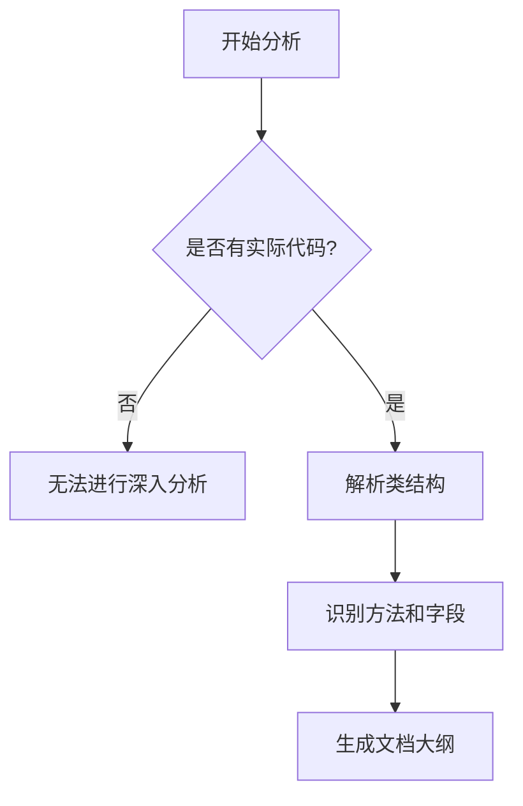

# `graphrag\tests\unit\indexing\input\__init__.py` 详细设计文档

该代码文件仅包含版权声明头，未提供实际实现代码用于分析。

## 整体流程



## 类结构

```
无可用类结构 - 代码仅包含版权声明
```

## 全局变量及字段


    

## 全局函数及方法


## 关键组件


## 问题及建议


### 已知问题

-   **代码缺失**: 当前代码文件仅包含版权声明，无任何实际功能实现代码，无法进行有效的技术债务或优化分析。

### 优化建议

-   **补充功能代码**: 需要提供完整的源代码文件，包括实际的类、函数和业务逻辑，才能进行详细的技术分析和优化建议。
-   **代码规范检查**: 待代码补充完成后，建议进行代码规范审查，确保遵循最佳实践。
-   **依赖管理**: 若代码涉及外部依赖，建议明确声明依赖项及版本要求。
-   **测试覆盖**: 建议在代码补充后添加相应的单元测试和集成测试，确保代码质量。


## 其它


### 设计目标与约束

由于代码文件仅包含版权声明，无实际实现代码，设计目标待定。约束条件：需遵循MIT License开源协议，需使用兼容的编程语言和框架版本（具体版本根据实际代码实现确定）。

### 错误处理与异常设计

由于代码文件仅包含版权声明，无实际实现代码，异常分类、错误码体系、重试机制等内容待实际代码实现后确定。

### 数据流与状态机

由于代码文件仅包含版权声明，无实际实现代码，数据流转路径、状态定义、状态转换等内容待实际代码实现后确定。

### 外部依赖与接口契约

由于代码文件仅包含版权声明，无实际实现代码，外部依赖项、接口定义、调用约定等内容待实际代码实现后确定。

### 安全性考虑

由于代码文件仅包含版权声明，无实际实现代码，认证授权、数据加密、输入验证等安全策略待实际代码实现后确定。

### 性能要求

由于代码文件仅包含版权声明，无实际实现代码，响应时间、吞吐量、资源限制等性能指标待实际代码实现后确定。

### 可扩展性设计

由于代码文件仅包含版权声明，无实际实现代码，水平扩展、垂直扩展、模块化设计等扩展性策略待实际代码实现后确定。

### 配置管理

由于代码文件仅包含版权声明，无实际实现代码，配置项、配置来源、配置验证规则等内容待实际代码实现后确定。

### 部署架构

由于代码文件仅包含版权声明，无实际实现代码，部署环境、部署流程、容器化方案等内容待实际代码实现后确定。

### 测试策略

由于代码文件仅包含版权声明，无实际实现代码，单元测试、集成测试、端到端测试等测试策略待实际代码实现后确定。

### 版本兼容性

由于代码文件仅包含版权声明，无实际实现代码，API版本管理、数据迁移、向后兼容策略等内容待实际代码实现后确定。

### 监控和日志

由于代码文件仅包含版权声明，无实际实现代码，监控指标、日志规范、告警规则等内容待实际代码实现后确定。

### 国际化/本地化

由于代码文件仅包含版权声明，无实际实现代码，语言支持、字符编码、本地化资源管理等内容待实际代码实现后确定。

### 许可证和法律合规

本代码采用MIT License开源许可证。MIT License是一种 permissive 许可证，允许被授权人免费使用、复制、修改、合并、发布、分发、再授权和/或销售本软件副本。需遵守MIT License的相关条款，包括保留版权声明和许可证声明。

### 维护和支持计划

由于代码文件仅包含版权声明，无实际实现代码，维护周期、技术支持渠道、文档更新策略等内容待实际代码实现后确定。

    