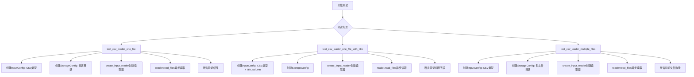
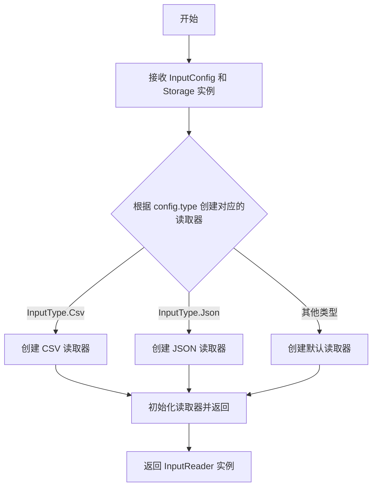
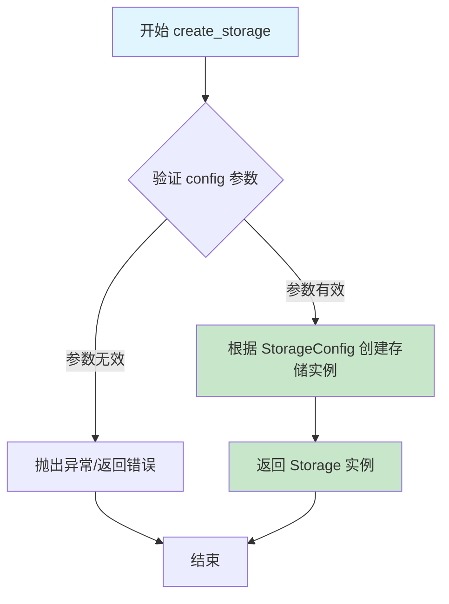
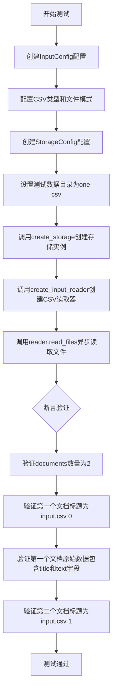
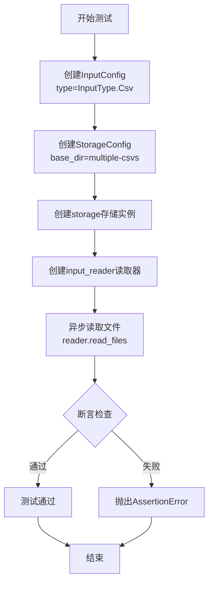

# `graphrag\tests\unit\indexing\input\test_csv_loader.py` 详细设计文档

这是一个CSV文件加载器的测试套件，用于验证graphrag_input模块的CSV读取功能是否正确工作，包括单文件加载、多文件加载以及自定义标题列等场景。

## 整体流程



## 类结构

```
测试模块 (test_csv_loader.py)
├── test_csv_loader_one_file (单文件测试)
├── test_csv_loader_one_file_with_title (带标题列测试)
└── test_csv_loader_multiple_files (多文件测试)

依赖模块 (外部)
├── graphrag_input
│   ├── InputConfig (配置类)
│   ├── InputType (枚举类型)
│   └── create_input_reader (工厂函数)
└── graphrag_storage
    ├── StorageConfig (配置类)
    └── create_storage (工厂函数)
```

## 全局变量及字段


### `config`
    
输入配置实例，用于配置CSV文件加载的参数

类型：`InputConfig`
    


### `storage`
    
存储配置实例，用于配置数据存储的基础目录

类型：`StorageConfig`
    


### `reader`
    
输入读取器实例，负责读取配置好的CSV文件并返回文档列表

类型：`InputReader`
    


### `documents`
    
读取的文档列表，包含从CSV文件中解析出的文档对象

类型：`List[Document]`
    


### `InputConfig.type`
    
输入文件类型配置，指定要读取的文件格式类型

类型：`InputType`
    


### `InputConfig.file_pattern`
    
文件匹配正则表达式，用于过滤符合模式的文件

类型：`str`
    


### `InputConfig.title_column`
    
CSV标题列名称，指定用于文档标题的CSV列名

类型：`str`
    


### `InputType.Csv`
    
CSV文件类型，表示输入文件格式为CSV

类型：`枚举成员`
    


### `StorageConfig.base_dir`
    
基础目录路径，指定存储或读取文件的根目录

类型：`str`
    
    

## 全局函数及方法


### `create_input_reader`

该函数是 GraphRAG 输入模块的工厂函数，用于根据提供的输入配置和存储实例创建相应的输入读取器，支持不同类型（如 CSV）的数据源读取。

参数：

- `config`：`InputConfig`，输入配置文件，包含输入类型、文件模式等配置信息
- `storage`：`Storage`，存储实例，提供对文件系统的访问能力

返回值：`InputReader`，返回配置后的输入读取器对象，用于读取指定的数据源文件

#### 流程图



#### 带注释源码

```python
# 从 graphrag_input 模块导入所需的配置和工厂函数
from graphrag_input import InputConfig, InputType, create_input_reader
# 从 graphrag_storage 模块导入存储配置和存储工厂函数
from graphrag_storage import StorageConfig, create_storage


# 测试函数：验证 CSV 加载器读取单个文件
async def test_csv_loader_one_file():
    # 创建输入配置，指定类型为 CSV，文件匹配模式为 .csv 结尾
    config = InputConfig(
        type=InputType.Csv,
        file_pattern=".*\\.csv$",
    )
    # 创建存储配置，指定基础目录
    storage = create_storage(
        StorageConfig(
            base_dir="tests/unit/indexing/input/data/one-csv",
        )
    )
    # 使用工厂函数创建输入读取器
    reader = create_input_reader(config, storage)
    # 异步读取文件，返回文档列表
    documents = await reader.read_files()
    # 断言验证读取结果
    assert len(documents) == 2
    assert documents[0].title == "input.csv (0)"
    assert documents[0].raw_data == {
        "title": "Hello",
        "text": "Hi how are you today?",
    }
    assert documents[1].title == "input.csv (1)"


# 测试函数：验证 CSV 加载器支持自定义标题列
async def test_csv_loader_one_file_with_title():
    # 创建输入配置，指定标题列名称
    config = InputConfig(
        type=InputType.Csv,
        title_column="title",
    )
    # 创建存储配置
    storage = create_storage(
        StorageConfig(
            base_dir="tests/unit/indexing/input/data/one-csv",
        )
    )
    # 创建读取器并读取文件
    reader = create_input_reader(config, storage)
    documents = await reader.read_files()
    # 验证自定义标题列生效
    assert len(documents) == 2
    assert documents[0].title == "Hello"


# 测试函数：验证 CSV 加载器读取多个文件
async def test_csv_loader_multiple_files():
    # 创建基础输入配置
    config = InputConfig(
        type=InputType.Csv,
    )
    # 创建存储配置，指向包含多个 CSV 文件的目录
    storage = create_storage(
        StorageConfig(
            base_dir="tests/unit/indexing/input/data/multiple-csvs",
        )
    )
    # 创建读取器
    reader = create_input_reader(config, storage)
    # 读取所有文件
    documents = await reader.read_files()
    # 验证读取的文档数量
    assert len(documents) == 4
```


### `create_storage`

`create_storage` 是一个工厂函数，用于根据提供的配置创建一个存储实例（Storage）。该函数接收存储配置对象，并返回对应的存储实现，用于后续的文件读取和数据处理。

参数：

- `config`：`StorageConfig`，存储配置对象，包含存储实例所需的配置参数（如 base_dir 等）

返回值：`Storage`，返回创建的存储实例，用于数据读写操作

#### 流程图



#### 带注释源码

```python
# 从 graphrag_storage 模块导入 StorageConfig 和 create_storage
from graphrag_storage import StorageConfig, create_storage

# 示例调用：创建存储实例
storage = create_storage(
    StorageConfig(
        base_dir="tests/unit/indexing/input/data/one-csv",  # 指定存储的基础目录
    )
)

# create_storage 函数原型（推断）
"""
async def create_storage(config: StorageConfig) -> Storage:
    '''
    工厂函数，创建存储实例
    
    参数:
        config: StorageConfig 对象，包含存储配置信息
        
    返回:
        Storage: 存储实例，用于文件读写操作
    '''
    # 根据 config 创建具体的存储实现
    # 可能支持多种存储后端（本地文件、Azure Blob 等）
    pass
"""

# 使用示例
# 创建 CSV 加载器的配置
config = InputConfig(
    type=InputType.Csv,
    file_pattern=".*\\.csv$",
)

# 创建存储实例
storage = create_storage(
    StorageConfig(
        base_dir="tests/unit/indexing/input/data/one-csv",
    )
)

# 创建输入读取器并读取文件
reader = create_input_reader(config, storage)
documents = await reader.read_files()
```


### `test_csv_loader_one_file`

这是一个异步测试函数，用于验证CSV加载器能够正确读取单个CSV文件（包含两行数据）并将其转换为文档对象，同时检查文档的标题和原始数据是否符合预期。

参数： 无

返回值：`None`，该函数为异步测试函数，通过assert断言进行验证，不返回具体值

#### 流程图



#### 带注释源码

```python
# 导入所需的配置类和工厂函数
# InputConfig: 输入配置类，用于配置数据源类型和文件模式
# InputType: 枚举类型，定义支持的输入类型（如CSV、JSON等）
# create_input_reader: 工厂函数，根据配置创建相应的输入读取器
from graphrag_input import InputConfig, InputType, create_input_reader

# 导入存储相关的配置类和工厂函数
# StorageConfig: 存储配置类，用于配置数据存储位置和参数
# create_storage: 工厂函数，根据配置创建相应的存储实例
from graphrag_storage import StorageConfig, create_storage


async def test_csv_loader_one_file():
    """
    异步测试函数：验证单文件CSV加载功能
    
    测试场景：
    - 测试数据目录：tests/unit/indexing/input/data/one-csv
    - 预期结果：加载2个文档对象
    """
    
    # 步骤1：创建输入配置，指定CSV类型和文件匹配模式
    # file_pattern=".*\\.csv$" 表示匹配所有以.csv结尾的文件
    config = InputConfig(
        type=InputType.Csv,  # 指定输入类型为CSV
        file_pattern=".*\\.csv$",  # 正则表达式：匹配.csv文件
    )
    
    # 步骤2：创建存储配置，指定测试数据所在目录
    # base_dir指向包含测试CSV文件的目录
    storage = create_storage(
        StorageConfig(
            base_dir="tests/unit/indexing/input/data/one-csv",  # 测试数据目录路径
        )
    )
    
    # 步骤3：创建输入读取器
    # 根据config和storage创建能够读取CSV文件的reader实例
    reader = create_input_reader(config, storage)
    
    # 步骤4：异步读取文件
    # 调用read_files方法读取配置目录下所有匹配的CSV文件
    documents = await reader.read_files()
    
    # 步骤5：断言验证结果
    
    # 验证1：确认成功读取了2个文档
    # CSV文件包含2行数据，每行数据被转换为一个文档对象
    assert len(documents) == 2
    
    # 验证2：检查第一个文档的标题格式
    # 标题格式为"文件名 (行索引)"，第一行索引为0
    assert documents[0].title == "input.csv (0)"
    
    # 验证3：检查第一个文档的原始数据内容
    # CSV的第一行数据包含title和text两个字段
    assert documents[0].raw_data == {
        "title": "Hello",
        "text": "Hi how are you today?",
    }
    
    # 验证4：检查第二个文档的标题格式
    # 第二行的索引为1
    assert documents[1].title == "input.csv (1)"
```


### `test_csv_loader_one_file_with_title`

该异步测试函数用于验证CSV加载器在指定标题列（title_column="title"）时，能够正确读取CSV文件并将第一列的值设置为文档标题。

参数：
- 该函数无参数

返回值：`None`，通过assert断言进行验证，若失败则抛出AssertionError

#### 流程图

```mermaid
flowchart TD
    A[开始] --> B[创建InputConfig<br/>type=InputType.Csv<br/>title_column='title']
    B --> C[创建StorageConfig<br/>base_dir='tests/unit/indexing/input/data/one-csv']
    C --> D[create_storage创建存储实例]
    D --> E[create_input_reader创建CSV读取器]
    E --> F[await reader.read_files异步读取文件]
    F --> G{验证documents长度=2}
    G -->|是| H{验证documents[0].title='Hello'}
    H -->|是| I[测试通过]
    H -->|否| J[AssertionError]
    G -->|否| J
```

#### 带注释源码

```python
async def test_csv_loader_one_file_with_title():
    # 创建CSV输入配置，指定type为Csv类型，并设置title_column为"title"
    # 这告诉加载器将CSV中名为"title"的列作为文档标题
    config = InputConfig(
        type=InputType.Csv,
        title_column="title",
    )
    
    # 创建存储配置，指定测试数据目录路径
    storage = create_storage(
        StorageConfig(
            base_dir="tests/unit/indexing/input/data/one-csv",
        )
    )
    
    # 根据配置和存储创建输入读取器
    reader = create_input_reader(config, storage)
    
    # 异步读取所有文件，返回文档列表
    documents = await reader.read_files()
    
    # 断言：验证读取到2个文档
    assert len(documents) == 2
    
    # 断言：验证第一个文档的标题为"Hello"
    # 这是因为title_column="title"，所以取CSV中title列的值作为文档标题
    assert documents[0].title == "Hello"
```


### `test_csv_loader_multiple_files`

该函数是一个异步测试函数，用于验证从多个CSV文件加载数据的功能是否正常工作。它通过创建输入配置和存储配置，初始化CSV读取器，然后读取所有文档并断言加载的文档数量是否符合预期（应为4个文档）。

参数：此函数没有参数。

返回值：`None`，因为这是一个测试函数，使用断言来验证结果而非返回值。

#### 流程图



#### 带注释源码

```python
# 异步测试函数：验证多文件CSV加载功能
async def test_csv_loader_multiple_files():
    # 步骤1：创建CSV类型的输入配置
    # 指定输入类型为CSV，file_pattern使用默认模式匹配所有.csv文件
    config = InputConfig(
        type=InputType.Csv,
    )
    
    # 步骤2：创建存储配置
    # 指定基础目录为tests/unit/indexing/input/data/multiple-csvs
    # 该目录下应包含多个CSV文件
    storage = create_storage(
        StorageConfig(
            base_dir="tests/unit/indexing/input/data/multiple-csvs",
        )
    )
    
    # 步骤3：使用配置创建输入读取器
    # 根据config和storage创建相应的reader实例
    reader = create_input_reader(config, storage)
    
    # 步骤4：异步读取所有文件
    # 从multiple-csvs目录读取所有匹配的CSV文件
    # 返回文档列表
    documents = await reader.read_files()
    
    # 步骤5：断言验证
    # 验证从multiple-csvs目录加载的文档数量为4
    # 如果数量不匹配，测试将失败并抛出AssertionError
    assert len(documents) == 4
```

## 关键组件


## 问题及建议


### 已知问题

- 缺少异步测试标记：测试函数使用 `async def` 但未使用 `@pytest.mark.asyncio` 装饰器，可能导致测试无法正确执行或出现警告
- 代码重复：三个测试函数中存在大量重复的 storage 和 config 创建逻辑，未使用 pytest fixtures 进行复用
- 资源未清理：创建了 storage 实例但测试完成后未进行显式清理，可能导致资源泄漏
- 硬编码路径：文件路径直接硬编码在测试代码中，降低了测试的可移植性
- 缺少错误场景测试：未覆盖文件不存在、CSV 格式错误、编码问题等异常情况的测试
- 缺少边界条件测试：未测试空文件、单行文件、特殊字符等边界情况
- 断言信息不够详细：断言失败时仅使用默认错误信息，缺乏自定义的错误提示
- 测试隔离性不足：多个测试使用相同的 base_dir，可能存在状态污染风险

### 优化建议

- 使用 `@pytest.mark.asyncio` 装饰器标记异步测试函数，确保正确的异步执行
- 提取公共的 storage 和 config 创建逻辑为 pytest fixtures，如 `@pytest.fixture` 装饰器创建 `storage` 和 `reader` fixture
- 考虑使用 `pytest.mark.parametrize` 参数化测试，减少重复代码并提高测试覆盖率
- 为关键操作添加 try-finally 块或使用 pytest fixture 的 teardown 机制确保资源释放
- 将硬编码路径提取为常量或环境变量配置，提高测试的可维护性
- 增加异常情况测试用例：文件不存在、CSV 解析错误、空文件、编码错误等
- 增加边界条件测试：空 CSV、单行 CSV、包含特殊字符的数据等
- 使用更具描述性的断言信息，如 `assert len(documents) == 2, f"Expected 2 documents, got {len(documents)}"`
- 考虑为每个测试使用独立的临时目录，确保测试之间的完全隔离

## 其它


### 设计目标与约束

本模块旨在实现一个灵活的CSV文件加载器，支持从指定目录读取CSV文件并将其转换为文档对象。设计目标包括：支持单文件和多文件加载、支持自定义标题列、确保文件路径模式匹配正确工作。约束条件包括：仅支持CSV格式、依赖graphrag_input和graphrag_storage模块、异步执行环境。

### 错误处理与异常设计

代码中使用assert语句进行基本断言验证，缺乏完善的异常处理机制。潜在的错误场景包括：文件不存在时抛出FileNotFoundError、CSV格式错误时抛出解析异常、存储目录权限问题时抛出PermissionError。建议添加具体的异常类定义，如CsvLoaderException、StorageAccessException等，并使用try-except块捕获并处理各类异常，提供有意义的错误信息。

### 数据流与状态机

数据流遵循以下路径：InputConfig定义输入配置 → StorageConfig指定存储路径 → create_storage创建存储实例 → create_input_reader创建读取器 → reader.read_files()执行读取 → 返回documents列表。状态机包含：初始化状态（配置创建）→ 就绪状态（reader创建）→ 运行状态（读取中）→ 完成状态（返回结果）或错误状态（异常发生）。

### 外部依赖与接口契约

主要依赖包括：graphrag_input模块（InputConfig、InputType、create_input_reader）、graphrag_storage模块（StorageConfig、create_storage）。接口契约方面：create_input_reader接受InputConfig和StorageConfig对象，返回支持read_files()方法的读取器对象；read_files()方法返回文档列表，每个文档包含title和raw_data属性。

### 配置文件格式

InputConfig接受type（InputType枚举）、file_pattern（正则表达式字符串）、title_column（可选字符串）参数。StorageConfig接受base_dir（字符串路径）参数。配置可通过代码直接实例化，也可考虑支持JSON/YAML配置文件加载。

### 性能考虑

当前实现每次调用read_files()都会遍历整个目录。建议优化方向：添加缓存机制避免重复读取、实现增量更新只处理新增或修改的文件、考虑大文件的流式处理避免内存溢出。

### 安全性考虑

当前代码未对file_pattern和base_dir进行安全验证，存在路径遍历攻击风险。建议：验证base_dir路径为绝对路径且在允许范围内、file_pattern仅允许合法的正则表达式模式、对读取的文件内容进行大小限制防止DoS攻击。

### 测试策略

现有测试覆盖三种场景：单文件加载、带标题列加载、多文件加载。建议补充测试用例：无效配置测试、文件不存在测试、CSV格式错误测试、大文件性能测试、并发读取测试。

### 部署注意事项

本模块为库代码，不作为独立服务部署。部署时需确保：Python异步环境支持（asyncio）、依赖包版本兼容（graphrag_input、graphrag_storage）、文件系统读写权限配置正确。

    