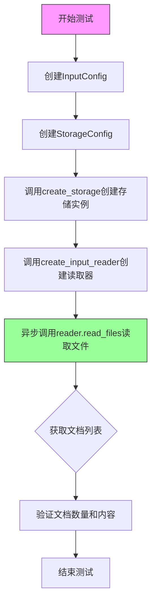
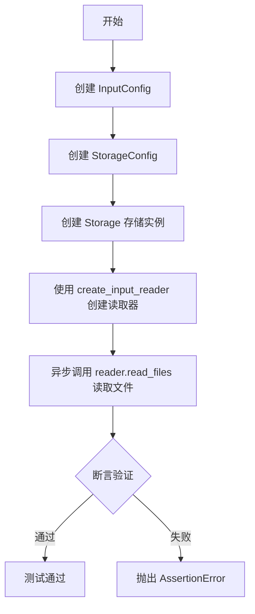
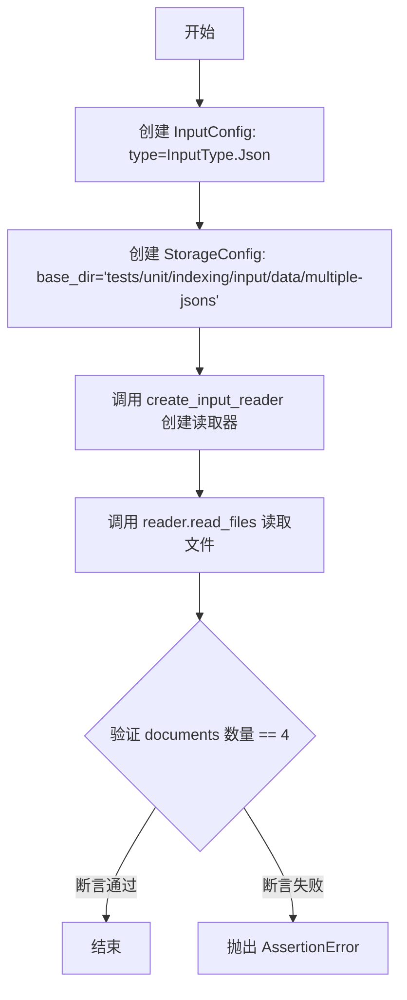
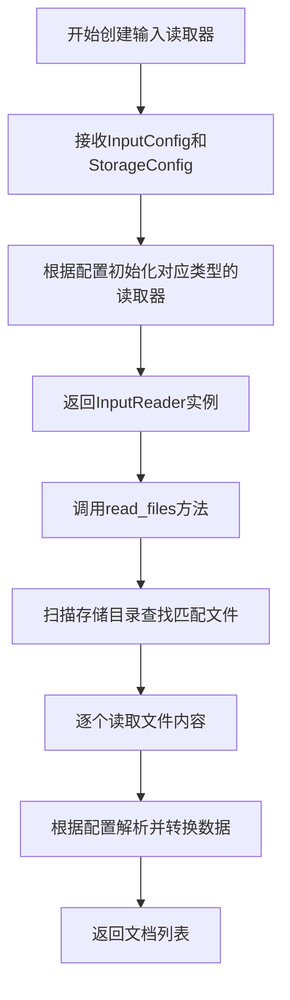
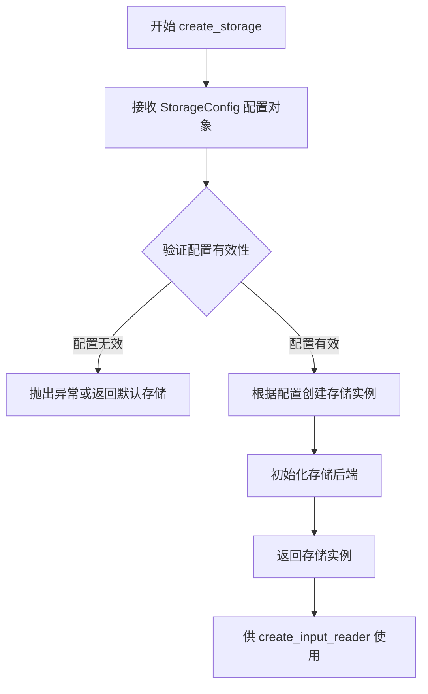

# `graphrag\tests\unit\indexing\input\test_json_loader.py` 详细设计文档

这是一个测试GraphRAG输入系统的JSON加载功能的测试文件，通过四个异步测试用例验证了JSON文件读取器在不同场景下的行为，包括单文件单对象、单文件多对象、带标题列的JSON以及多文件场景的加载和解析能力。

## 整体流程



## 类结构

```
测试模块 (test_json_loader.py)
├── InputConfig (配置类 - 来自graphrag_input)
├── StorageConfig (配置类 - 来自graphrag_input)
├── InputType (枚举 - 来自graphrag_input)
├── create_input_reader (工厂函数 - 来自graphrag_input)
└── create_storage (工厂函数 - 来自graphrag_storage)
```

## 全局变量及字段


### `config`
    
Configuration object for input reader specifying input type, file pattern, and title column

类型：`InputConfig`
    


### `storage`
    
Storage instance configured with base directory for file operations

类型：`Storage`
    


### `reader`
    
Input reader instance created from config and storage to read documents

类型：`InputReader`
    


### `documents`
    
List of documents read from storage via the input reader

类型：`List[Document]`
    


### `InputConfig.type`
    
The type of input to read (e.g., Json, CSV, etc.)

类型：`InputType`
    


### `InputConfig.file_pattern`
    
Regex pattern to match input files for reading

类型：`str`
    


### `InputConfig.title_column`
    
Column name to use as document title when reading structured data

类型：`str`
    


### `StorageConfig.base_dir`
    
Base directory path for storage operations

类型：`str`
    
    

## 全局函数及方法


### `test_json_loader_one_file_one_object`

这是一个异步测试函数，用于验证 JSON 加载器能够正确读取包含单个 JSON 对象的文件，并将文件内容转换为文档对象，同时检查文档的标题和原始数据是否符合预期。

参数：

- 该函数没有参数

返回值：`None`，该函数为测试函数，不返回任何值，仅通过断言验证功能

#### 流程图



#### 带注释源码

```python
# 异步测试函数：验证 JSON 加载器读取单个文件单个对象的场景
async def test_json_loader_one_file_one_object():
    # 创建输入配置，指定类型为 JSON，文件匹配模式为正则表达式匹配 .json 结尾的文件
    config = InputConfig(
        type=InputType.Json,
        file_pattern=".*\\.json$",
    )
    
    # 创建存储配置，指定基础目录为测试数据目录
    # 该目录下应包含一个名为 input.json 的文件，内容为单个 JSON 对象
    storage = create_storage(
        StorageConfig(
            base_dir="tests/unit/indexing/input/data/one-json-one-object",
        )
    )
    
    # 根据配置和存储后端创建输入读取器
    reader = create_input_reader(config, storage)
    
    # 异步读取文件，返回文档列表
    documents = await reader.read_files()
    
    # 断言验证：确保只读取到 1 个文档
    assert len(documents) == 1
    
    # 断言验证：确保文档标题正确（使用文件名作为标题）
    assert documents[0].title == "input.json"
    
    # 断言验证：确保文档的原始数据与文件内容一致
    assert documents[0].raw_data == {
        "title": "Hello",
        "text": "Hi how are you today?",
    }
```


### `test_json_loader_one_file_multiple_objects`

该函数是一个异步测试用例，用于验证JSON加载器能够正确读取包含多个JSON对象的单个文件，并将每个对象作为独立的文档返回。

参数： 无

返回值：`None`，该函数为异步测试函数，不返回任何值，仅通过断言验证功能正确性。

#### 流程图

```mermaid
flowchart TD
    A[开始] --> B[创建InputConfig<br/>type=InputType.Json]
    B --> C[创建StorageConfig<br/>base_dir=one-json-multiple-objects]
    C --> D[调用create_storage创建存储实例]
    D --> E[调用create_input_reader创建读取器]
    E --> F[调用reader.read_files读取文件]
    F --> G[断言documents数量为3]
    G --> H[断言documents[0].title为'input.json (0)']
    H --> I[断言documents[1].title为'input.json (1)']
    I --> J[结束]
```

#### 带注释源码

```python
# 异步测试函数：验证JSON加载器处理单文件多对象场景
async def test_json_loader_one_file_multiple_objects():
    # 步骤1：创建输入配置，指定JSON类型
    # file_pattern使用正则表达式匹配.json文件（默认从InputConfig继承）
    config = InputConfig(
        type=InputType.Json,
    )
    
    # 步骤2：创建存储配置，指定测试数据目录
    # 该目录应包含一个JSON文件，文件内有多个JSON对象
    storage = create_storage(
        StorageConfig(
            base_dir="tests/unit/indexing/input/data/one-json-multiple-objects",
        )
    )
    
    # 步骤3：根据配置创建输入读取器
    reader = create_input_reader(config, storage)
    
    # 步骤4：异步读取文件，获取文档列表
    documents = await reader.read_files()
    
    # 步骤5：断言验证
    # 验证1：确认读取到3个文档（JSON文件中的每个对象对应一个文档）
    assert len(documents) == 3
    
    # 验证2：确认第一个文档标题格式为"input.json (0)"
    assert documents[0].title == "input.json (0)"
    
    # 验证3：确认第二个文档标题格式为"input.json (1)"
    assert documents[1].title == "input.json (1)"
```


### `test_json_loader_one_file_with_title`

该函数是一个异步单元测试，用于验证 JSON 加载器能够正确读取包含单个对象的 JSON 文件，并根据指定的 `title_column` 参数从数据中提取文档标题。

参数：该函数无参数

返回值：`None`，作为测试函数无返回值

#### 流程图

```mermaid
flowchart TD
    A[开始] --> B[创建InputConfig<br/>type=InputType.Json<br/>title_column='title']
    B --> C[创建StorageConfig<br/>base_dir='tests/unit/indexing/input/data/one-json-one-object']
    C --> D[使用create_input_reader创建读取器]
    D --> E[调用reader.read_files异步读取文件]
    E --> F{断言验证}
    F --> G[assert len(documents) == 1]
    G --> H[assert documents[0].title == 'Hello']
    H --> I[结束]
```

#### 带注释源码

```python
async def test_json_loader_one_file_with_title():
    """
    测试JSON加载器能否正确处理带title_column参数的JSON文件读取
    """
    # 创建输入配置，指定类型为JSON，并设置title_column为"title"
    # title_column用于指定从JSON数据的哪个字段提取文档标题
    config = InputConfig(
        type=InputType.Json,
        title_column="title",
    )
    
    # 创建存储配置，指定测试数据目录路径
    # 该目录应包含一个JSON文件，文件内容包含title和text字段
    storage = create_storage(
        StorageConfig(
            base_dir="tests/unit/indexing/input/data/one-json-one-object",
        )
    )
    
    # 根据配置和存储创建输入读取器
    reader = create_input_reader(config, storage)
    
    # 异步读取文件，返回文档列表
    documents = await reader.read_files()
    
    # 断言：验证读取到的文档数量为1
    assert len(documents) == 1
    
    # 断言：验证文档标题正确提取了JSON数据中title字段的值"Hello"
    assert documents[0].title == "Hello"
```


### `test_json_loader_multiple_files`

该函数是一个异步单元测试，用于验证 JSON 文件加载器能够正确读取多个 JSON 文件，并将所有对象合并为一个文档列表。

参数：此函数无参数。

返回值：`None`，函数执行完成后返回 `None`（通过断言验证文档数量）。

#### 流程图



#### 带注释源码

```python
async def test_json_loader_multiple_files():
    """
    异步测试函数：验证 JSON 加载器能够正确处理多个 JSON 文件。
    测试数据目录: tests/unit/indexing/input/data/multiple-jsons
    预期结果: 读取 4 个文档对象
    """
    # 创建输入配置，指定类型为 JSON
    config = InputConfig(
        type=InputType.Json,
    )
    # 创建存储配置，指定测试数据目录路径
    storage = create_storage(
        StorageConfig(
            base_dir="tests/unit/indexing/input/data/multiple-jsons",
        )
    )
    # 根据配置和存储创建输入读取器
    reader = create_input_reader(config, storage)
    # 异步读取所有文件，返回文档列表
    documents = await reader.read_files()
    # 断言验证读取的文档数量为 4
    assert len(documents) == 4
```


### `create_input_reader`

该函数用于根据输入配置和存储配置创建一个输入读取器（InputReader），用于从指定存储中读取符合配置条件的文件，并将其转换为文档列表。

参数：

- `config`：`InputConfig`，输入配置文件，包含输入类型、文件模式、标题列等配置信息
- `storage`：`StorageConfig`，存储配置文件，指定要读取文件的基础目录

返回值：`InputReader`，返回一个输入读取器对象，该对象具有 `read_files()` 异步方法用于读取文件并返回文档列表

#### 流程图



#### 带注释源码

```python
# 从graphrag_input模块导入的函数
# 以下为调用方代码展示其使用方式

# 导入声明
from graphrag_input import InputConfig, InputType, create_input_reader
from graphrag_storage import StorageConfig, create_storage

# 使用示例1: 读取单个JSON文件
config = InputConfig(
    type=InputType.Json,          # 指定输入类型为JSON
    file_pattern=".*\\.json$",    # 文件匹配模式
)
storage = create_storage(
    StorageConfig(
        base_dir="tests/unit/indexing/input/data/one-json-one-object",  # 数据目录
    )
)
# 创建输入读取器
reader = create_input_reader(config, storage)
# 异步读取文件返回文档列表
documents = await reader.read_files()

# 使用示例2: 读取多个JSON文件
config = InputConfig(
    type=InputType.Json,  # 指定输入类型为JSON
)
# ... 省略storage创建 ...
reader = create_input_reader(config, storage)
documents = await reader.read_files()

# 使用示例3: 指定标题列
config = InputConfig(
    type=InputType.Json,
    title_column="title",  # 从JSON中提取title字段作为文档标题
)
# ... 省略storage创建 ...
reader = create_input_reader(config, storage)
documents = await reader.read_files()
```


### `create_storage`

该函数是 GraphRAG 存储层的工厂函数，根据提供的 `StorageConfig` 配置对象创建并返回一个存储实例，用于后续的文件读取操作。

参数：

-  `config`：`StorageConfig`，存储配置对象，包含存储的基本配置信息（如 base_dir 等）

返回值：`Storage`（存储实例类型），返回配置后的存储对象，供输入读取器使用

#### 流程图



#### 带注释源码

```python
# 从 graphrag_storage 模块导入创建存储的函数和配置类
from graphrag_storage import StorageConfig, create_storage

# 定义测试用例：加载单个 JSON 文件的单个对象
async def test_json_loader_one_file_one_object():
    # 创建输入配置，指定类型为 JSON，文件匹配模式
    config = InputConfig(
        type=InputType.Json,
        file_pattern=".*\\.json$",
    )
    # 调用 create_storage 函数，传入存储配置
    # 参数 config: StorageConfig 对象，包含 base_dir 指定测试数据目录
    # 返回值 storage: 存储实例，用于后续文件读取
    storage = create_storage(
        StorageConfig(
            base_dir="tests/unit/indexing/input/data/one-json-one-object",
        )
    )
    # 创建输入读取器，传入配置和存储实例
    reader = create_input_reader(config, storage)
    # 异步读取文件
    documents = await reader.read_files()
    # 断言验证读取结果
    assert len(documents) == 1
    assert documents[0].title == "input.json"
    assert documents[0].raw_data == {
        "title": "Hello",
        "text": "Hi how are you today?",
    }
```

---

### 关键组件信息

| 组件名称 | 描述 |
|---------|------|
| `StorageConfig` | 存储配置数据类，包含存储后端所需的配置参数（如 base_dir） |
| `create_storage` | 存储工厂函数，根据配置创建相应的存储后端实例 |
| `InputConfig` | 输入配置类，定义输入源类型和解析规则 |
| `create_input_reader` | 输入读取器工厂函数，创建适合指定输入类型的读取器 |

---

### 潜在的技术债务或优化空间

1. **类型注解不完整**：代码中未显示 `create_storage` 的具体返回类型注解，应添加明确的返回类型声明以增强代码可读性和类型安全。
2. **配置验证缺失**：未在示例代码中看到对 `StorageConfig` 的显式验证逻辑，应考虑添加配置预验证防止无效配置导致运行时错误。
3. **错误处理不明确**：缺少对存储创建失败情况的异常处理机制，应定义清晰的异常层次结构。

---

### 其它项目

#### 设计目标与约束

- **目标**：解耦存储后端实现与业务逻辑，通过配置驱动存储创建
- **约束**：依赖 `graphrag_storage` 模块的具体实现，返回对象需兼容 `create_input_reader` 的接口要求

#### 错误处理与异常设计

- 存储配置无效时可能抛出配置验证异常
- 存储后端初始化失败时应传播具体错误信息

#### 数据流与状态机

```
StorageConfig → create_storage() → Storage Instance → create_input_reader() → Reader → read_files() → Documents
```

#### 外部依赖与接口契约

- **输入**：接受 `StorageConfig` 对象作为唯一参数
- **输出**：返回满足存储接口规范的实例
- **依赖模块**：`graphrag_storage`（提供 `StorageConfig` 和 `create_storage` 实现）

## 关键组件


### InputConfig

用于配置输入源的类型和文件模式的类。

### InputType

枚举类型，定义支持的输入数据类型（如Json）。

### create_input_reader

工厂函数，根据配置创建相应的输入读取器实例。

### StorageConfig

用于配置存储后端的类，包含基础目录等参数。

### create_storage

工厂函数，根据存储配置创建存储实例。

### InputReader

负责从存储中读取文件并转换为文档的接口。

### Document

表示从输入文件中提取的文档对象，包含标题和原始数据。


## 问题及建议


### 已知问题

-   **测试代码重复**：四个测试函数中存在大量重复的配置创建代码（InputConfig、StorageConfig、create_input_reader），未能利用 pytest fixtures 进行复用，增加维护成本
-   **硬编码路径问题**：所有测试用例的 base_dir 路径均以字符串形式硬编码，降低了测试的可移植性和可维护性
-   **缺乏测试文档**：测试函数缺少 docstring 文档说明，未明确阐述各测试用例的业务场景和预期行为
-   **断言信息不足**：断言语句仅包含条件判断，失败时缺乏有意义的错误信息描述，不利于问题定位
-   **魔法字符串无解释**：如 "input.json (0)"、"input.json (1)" 等输出格式的命名规则未在代码中说明，其他开发者难以理解
-   **配置参数不一致**：test_json_loader_one_file_one_object 显式设置了 file_pattern=".*\\.json$"，而其他测试用例未设置，导致测试行为不一致
-   **缺失边界条件测试**：未覆盖空 JSON 文件、嵌套 JSON 结构、超大文件、编码错误等异常场景
-   **无错误处理验证**：所有测试均假设正常执行流程，缺少对异常输入（如文件不存在、权限不足、格式错误）的测试验证
-   **未使用参数化测试**：相同模式的测试逻辑可以通过 pytest.mark.parametrize 合并，减少代码冗余

### 优化建议

-   使用 pytest fixtures 提取公共的 config 和 storage 创建逻辑，将重复代码抽象为可复用的测试辅助函数
-   引入 pytest.mark.parametrize 对相似测试场景进行参数化，减少函数数量并提高测试覆盖率
-   为测试函数添加详细的 docstring，说明测试目的、输入数据和预期输出
-   在断言中使用自定义错误信息，如 assert condition, "expected X but got Y"
-   将硬编码路径提取为常量或环境变量配置，提高测试的可配置性
-   补充边界条件和异常场景的测试用例，确保模块的健壮性
-   统一配置参数设置，对于默认行为保持一致性
-   考虑添加性能测试用例，验证大数据量场景下的加载效率

## 其它


### 设计目标与约束

该代码旨在验证JSON输入加载器的核心功能，确保能够正确处理不同场景下的JSON文件读取。设计约束包括：仅支持JSON格式、使用异步IO操作、依赖外部graphrag_input和graphrag_storage模块、测试数据位于tests/unit/indexing/input/data/目录下。

### 错误处理与异常设计

测试代码主要通过assert语句进行基本的断言验证，未显式定义异常处理机制。潜在异常包括：文件不存在(FileNotFoundError)、JSON解析错误(json.JSONDecodeError)、存储初始化失败(ValueError)、正则表达式匹配失败(re.error)。建议在生产环境中添加try-except捕获、输入验证、文件路径规范化、空值检查等错误处理逻辑。

### 数据流与状态机

数据流为：StorageConfig创建存储 → InputConfig配置输入参数 → create_input_reader创建读取器 → reader.read_files()异步读取文件 → 返回Document列表。状态机包含：初始化(创建配置) → 创建资源(存储和读取器) → 执行读取 → 验证结果 → 资源释放。

### 外部依赖与接口契约

核心依赖包括：(1)graphrag_input模块：提供InputConfig类(InputConfig配置参数)、InputType枚举(InputType.Json定义JSON类型)、create_input_reader函数(签名：create_input_reader(config: InputConfig, storage) -> InputReader)；(2)graphrag_storage模块：提供StorageConfig类(StorageConfig配置存储参数)、create_storage函数(签名：create_storage(config: StorageConfig) -> Storage)。返回的Document对象应包含title(str类型，文档标题)和raw_data(dict类型，原始JSON数据)属性。

### 性能考量与优化空间

当前测试未涉及性能测试。潜在优化点：(1)大文件处理：可考虑流式读取而非一次性加载；(2)并发读取：多个文件可并行读取提升性能；(3)缓存机制：对已读取文件进行缓存避免重复IO；(4)内存管理：大数据集需关注内存占用，建议使用生成器模式。

### 安全性考虑

文件路径使用base_dir相对路径，存在路径遍历风险；正则表达式file_pattern未做严格校验；建议增加路径规范化、输入白名单校验、正则表达式超时保护等安全措施。

### 测试覆盖范围

当前测试覆盖：单文件单对象、单文件多对象、title_column配置、多文件场景。缺失测试：空JSON文件、嵌套JSON结构、特殊字符处理、超大文件性能、并发读取、错误文件格式、存储权限问题等。

    