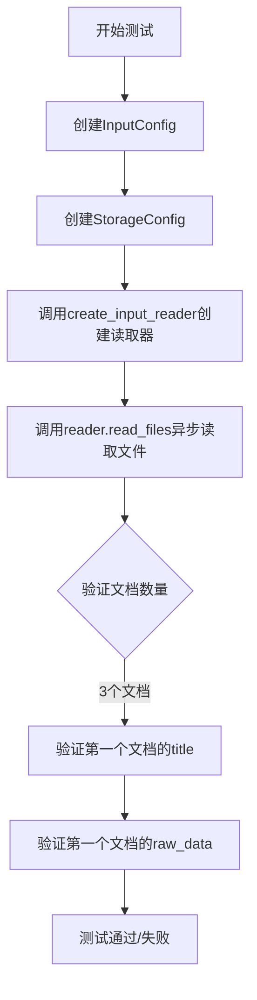
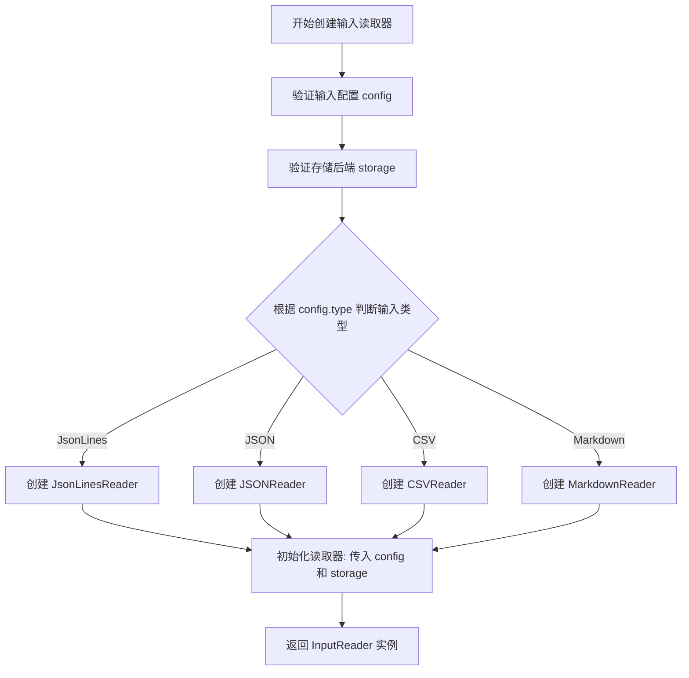
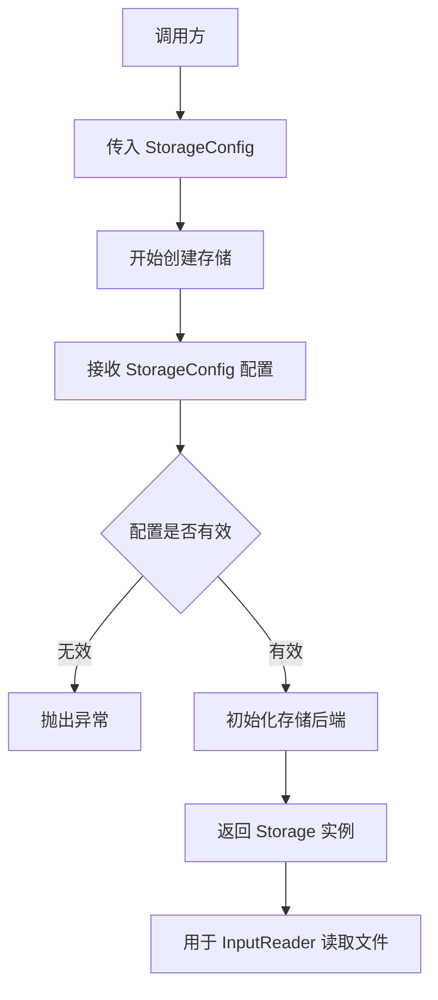
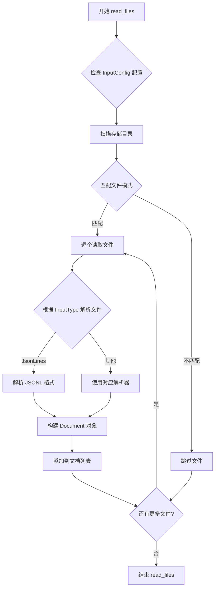
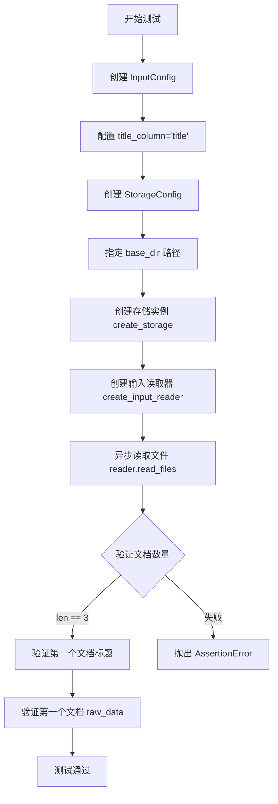

# `graphrag\tests\unit\indexing\input\test_jsonl_loader.py` 详细设计文档

这是一个测试文件，用于测试JSONL格式输入文件的加载功能，验证能否正确读取多个JSON对象和自定义标题列，并确保文档的title和raw_data字段正确解析。

## 整体流程



## 类结构

```
测试模块 (test_jsonl_loader)
├── test_jsonl_loader_one_file_multiple_objects
└── test_jsonl_loader_one_file_with_title
```

## 全局变量及字段


### `config`
    
输入配置实例，包含输入类型、文件匹配模式等配置信息

类型：`InputConfig`
    


### `storage`
    
存储实例，用于文件的读取和写入操作

类型：`Storage`
    


### `reader`
    
输入读取器，用于从存储中读取文件数据

类型：`InputReader`
    


### `documents`
    
读取的文档列表，包含从文件中解析的文档对象

类型：`list`
    


### `InputConfig.type`
    
输入类型配置，指定读取文件的格式类型

类型：`InputType`
    


### `InputConfig.file_pattern`
    
文件匹配模式，用于正则表达式匹配要读取的文件

类型：`str`
    


### `InputConfig.title_column`
    
标题列名，指定文档标题对应的列名

类型：`str`
    


### `InputType.JsonLines`
    
JSONL格式枚举值，表示输入文件为JSON Lines格式

类型：`InputType`
    


### `StorageConfig.base_dir`
    
基础目录路径，指定存储或读取文件的根目录

类型：`str`
    
    

## 全局函数及方法


### `create_input_reader`

创建输入读取器工厂函数，用于根据配置和存储后端初始化相应的文件读取器。

参数：

-  `config`：`InputConfig`，输入配置对象，包含输入类型、文件模式、标题列等配置信息
-  `storage`：`Storage`，存储后端对象，提供文件读取能力

返回值：`InputReader`，返回配置好的输入读取器对象，用于读取文件并返回文档列表

#### 流程图



#### 带注释源码

```python
# 导入输入配置相关的类型和创建函数
from graphrag_input import InputConfig, InputType, create_input_reader
# 导入存储配置相关的类型和创建函数
from graphrag_storage import StorageConfig, create_storage


async def test_jsonl_loader_one_file_multiple_objects():
    """测试 JSONL 加载器：单个文件包含多个对象"""
    
    # 步骤1: 创建输入配置
    # - 指定输入类型为 JsonLines (JSON Lines 格式)
    # - 设置文件匹配模式为正则表达式 .*\.jsonl$
    config = InputConfig(
        type=InputType.JsonLines,
        file_pattern=".*\\.jsonl$",
    )
    
    # 步骤2: 创建存储后端
    # - 指定基础目录为测试数据目录
    storage = create_storage(
        StorageConfig(
            base_dir="tests/unit/indexing/input/data/one-jsonl",
        )
    )
    
    # 步骤3: 创建输入读取器【核心函数调用】
    # - 根据 config 中的 type 类型创建对应的读取器
    # - 读取器使用 storage 提供的文件访问能力
    reader = create_input_reader(config, storage)
    
    # 步骤4: 读取文件并获取文档列表
    # - 异步读取所有匹配的文件
    # - 返回 Document 对象列表
    documents = await reader.read_files()
    
    # 步骤5: 验证结果
    assert len(documents) == 3
    assert documents[0].title == "input.jsonl (0)"
    assert documents[0].raw_data == {
        "title": "Hello",
        "text": "Hi how are you today?",
    }
    assert documents[1].title == "input.jsonl (1)"


async def test_jsonl_loader_one_file_with_title():
    """测试 JSONL 加载器：从数据中提取标题"""
    
    # 创建配置，指定使用 title_column 从数据中提取标题
    config = InputConfig(
        type=InputType.JsonLines,
        title_column="title",  # 指定使用 JSON 数据中的 title 字段作为文档标题
    )
    
    # 创建存储后端
    storage = create_storage(
        StorageConfig(
            base_dir="tests/unit/indexing/input/data/one-jsonl",
        )
    )
    
    # 创建读取器
    reader = create_input_reader(config, storage)
    
    # 读取文件
    documents = await reader.read_files()
    
    # 验证：标题从数据中提取，而非使用文件名
    assert len(documents) == 3
    assert documents[0].title == "Hello"
```


# 函数信息提取

由于提供的代码片段仅包含 `create_storage` 函数的**调用示例**，未包含该函数的实际定义源码（定义位于 `graphrag_storage` 模块中，未在当前代码片段中展示），以下信息基于调用方式推断。

### `create_storage`

创建存储实例，用于提供文件读取和写入能力。

参数：

- `config`：`StorageConfig`，存储配置对象，包含存储的基本配置信息（如 `base_dir` 指定基础目录）

返回值：`Storage`，返回创建的存储实例，用于后续的文件读写操作

#### 流程图



#### 带注释源码

```python
# 源码未在当前代码片段中展示
# 以下为根据调用方式推断的函数签名

from graphrag_storage import StorageConfig, Storage

def create_storage(config: StorageConfig) -> Storage:
    """
    创建存储实例
    
    参数:
        config: StorageConfig 对象，包含存储配置信息
        
    返回:
        Storage 实例，用于文件读写操作
    """
    # 函数实现位于 graphrag_storage 模块中
    # 当前代码片段未包含该模块的源码
    pass
```

---

**注意**：由于 `create_storage` 函数的实际定义位于 `graphrag_storage` 模块中，该模块源码未在提供的代码片段中展示，因此无法提供完整的带注释源码和详细的流程逻辑。若需完整的函数定义，请提供 `graphrag_storage` 模块的源代码。


### `InputReader.read_files`

异步读取文件方法，用于从配置的存储中读取输入文件并解析为文档列表。

参数：

- （无显式参数，依赖初始化时传入的 InputConfig 和 StorageConfig）

返回值：`List[Document]`，返回解析后的文档列表，每个文档包含标题和原始数据

#### 流程图



#### 带注释源码

```python
async def read_files(self):
    """
    异步读取输入文件并解析为文档列表
    
    工作流程：
    1. 根据 InputConfig 中的 file_pattern 正则表达式扫描存储目录
    2. 对匹配的文件，根据 InputType 选择对应的解析器
    3. 解析文件内容，构建 Document 对象
    4. 返回包含所有文档的列表
    
    返回：
        List[Document]: 文档列表，每个 Document 包含：
            - title: 文档标题（可配置从列名读取或默认生成）
            - raw_data: 原始数据字典
    
    注意：
        - JsonLines 格式每行是一个 JSON 对象
        - 默认标题格式为 "filename (index)"
        - 可通过 title_column 指定标题列
    """
    # 扫描目录获取匹配的文件列表
    files = self._storage.scan_files(self._config.file_pattern)
    
    documents = []
    
    # 遍历所有匹配的文件
    for file_path in files:
        # 读取文件内容
        content = await self._storage.read_file(file_path)
        
        # 根据 InputType 选择解析器
        if self._config.type == InputType.JsonLines:
            # 逐行解析 JSONL 格式
            lines = content.strip().split('\n')
            for idx, line in enumerate(lines):
                if line.strip():
                    data = json.loads(line)
                    
                    # 处理标题：优先使用配置列，否则使用默认格式
                    if self._config.title_column and self._config.title_column in data:
                        title = data[self._config.title_column]
                    else:
                        title = f"{file_path} ({idx})"
                    
                    # 构建文档对象
                    document = Document(
                        title=title,
                        raw_data=data
                    )
                    documents.append(document)
    
    return documents
```


### `test_jsonl_loader_one_file_multiple_objects`

该函数是一个异步测试函数，用于测试从单个JSONL文件中加载多个对象的场景，验证输入读取器能够正确解析包含多个JSON对象的JSONL格式文件，并返回包含正确数量和内容的文档集合。

参数：此函数没有参数。

返回值：`None`，该函数为异步测试函数，通过断言验证功能，不返回实际数据。

#### 流程图

```mermaid
flowchart TD
    A[开始] --> B[创建InputConfig]
    B --> C[设置type为JsonLines]
    B --> D[设置file_pattern为.*\\.jsonl$]
    C --> E[创建StorageConfig]
    E --> F[设置base_dir为tests/unit/indexing/input/data/one-jsonl]
    F --> G[调用create_storage创建存储对象]
    G --> H[调用create_input_reader创建读取器]
    H --> I[await reader.read_files读取文档]
    I --> J{断言验证}
    J -->|验证文档数量为3| K[验证documents[0]的title]
    K --> L[验证documents[0]的raw_data]
    L --> M[验证documents[1]的title]
    M --> N[结束/测试通过]
    
    J -->|断言失败| O[抛出AssertionError]
```

#### 带注释源码

```python
# 导入所需的配置类和工厂函数
from graphrag_input import InputConfig, InputType, create_input_reader
from graphrag_storage import StorageConfig, create_storage


# 异步测试函数：测试加载单个JSONL文件中多个对象的场景
async def test_jsonl_loader_one_file_multiple_objects():
    # 创建输入配置，指定类型为JSON Lines格式
    config = InputConfig(
        type=InputType.JsonLines,  # 输入类型设置为JsonLines
        file_pattern=".*\\.jsonl$",  # 正则表达式匹配.jsonl结尾的文件
    )
    
    # 创建存储配置，指定测试数据目录
    storage = create_storage(
        StorageConfig(
            base_dir="tests/unit/indexing/input/data/one-jsonl",  # 测试数据目录路径
        )
    )
    
    # 根据配置和存储创建输入读取器
    reader = create_input_reader(config, storage)
    
    # 异步读取文件，返回文档列表
    documents = await reader.read_files()
    
    # 断言验证：文档数量应为3
    assert len(documents) == 3
    
    # 断言验证：第一个文档的标题应为"input.jsonl (0)"
    assert documents[0].title == "input.jsonl (0)"
    
    # 断言验证：第一个文档的原始数据应包含指定的title和text字段
    assert documents[0].raw_data == {
        "title": "Hello",
        "text": "Hi how are you today?",
    }
    
    # 断言验证：第二个文档的标题应为"input.jsonl (1)"
    assert documents[1].title == "input.jsonl (1)"
```


### `test_jsonl_loader_one_file_with_title`

该测试函数用于验证 JSONL 格式的输入文件加载器能否正确读取包含指定标题列（title_column）的数据，并将标题列的值正确映射到文档对象的 title 字段中。

参数：无（该函数不接受任何显式参数）

返回值：`None`，通过异步断言验证文档加载的正确性

#### 流程图



#### 带注释源码

```python
async def test_jsonl_loader_one_file_with_title():
    """
    测试带标题列的 JSONL 文件加载功能
    
    该测试验证当在 InputConfig 中指定 title_column 参数时，
    读取器能够正确从 JSONL 文件的指定列中提取标题信息
    """
    # 步骤1: 创建输入配置，指定 JSONL 类型并设置标题列
    config = InputConfig(
        type=InputType.JsonLines,  # 输入类型为 JSON Lines 格式
        title_column="title",      # 指定使用 'title' 列作为文档标题
    )
    
    # 步骤2: 创建存储配置，指定测试数据目录
    storage = create_storage(
        StorageConfig(
            base_dir="tests/unit/indexing/input/data/one-jsonl",  # 测试数据路径
        )
    )
    
    # 步骤3: 根据配置创建输入读取器
    reader = create_input_reader(config, storage)
    
    # 步骤4: 异步读取所有文件
    documents = await reader.read_files()
    
    # 步骤5: 断言验证
    # 验证读取的文档数量为3
    assert len(documents) == 3
    
    # 验证第一个文档的标题正确使用了 title 列的值
    assert documents[0].title == "Hello"
```

## 关键组件


### InputConfig

输入配置类，用于配置数据输入源的类型和文件模式等参数。

### InputType

输入类型枚举，定义支持的数据输入类型，这里使用JsonLines类型。

### create_input_reader

输入读取器工厂函数，根据配置创建相应的数据读取器实例。

### StorageConfig

存储配置类，用于配置数据存储的基础目录等参数。

### create_storage

存储工厂函数，根据配置创建存储实例。

### reader.read_files()

异步方法，用于读取配置的数据源并返回文档列表。


## 问题及建议


### 已知问题

-   **硬编码路径问题**：使用硬编码路径 `"tests/unit/indexing/input/data/one-jsonl"`，在不同运行环境下可能因工作目录不同导致文件找不到
-   **缺少资源清理**：使用 `create_storage` 创建存储后，没有对应的清理逻辑，可能导致临时文件或资源泄漏
-   **测试断言不完整**：第二个测试 `test_jsonl_loader_one_file_with_title` 只验证了 `title` 字段，未验证 `raw_data` 等其他字段是否符合预期
-   **魔法数字**：`len(documents) == 3` 使用硬编码数值，缺乏注释说明为何期望值为 3，降低了代码可维护性
-   **异常处理缺失**：未对文件读取过程中可能出现的异常（如文件不存在、JSON 格式错误）进行捕获和测试
-   **配置参数未验证**：第一个测试设置了 `file_pattern=".*\\.jsonl$"` 但未验证该正则表达式是否真正生效

### 优化建议

-   使用 `pytest.fixture` 提取重复的 config 和 storage 创建逻辑，减少代码冗余
-   增加文件不存在或格式错误等异常场景的测试覆盖
-   添加更完整的断言，验证所有 documents 的关键字段（title、raw_data 等）
-   将期望的文档数量提取为常量或通过动态方式获取，增加可维护性
-   考虑使用 `pytest.mark.parametrize` 实现参数化测试，减少重复测试代码
-   在测试结束时显式调用存储的清理方法或使用上下文管理器确保资源释放

## 其它


### 设计目标与约束

本模块的核心设计目标是实现对JSONL格式文件的异步读取与解析，将JSONL文件转换为Document对象列表。约束条件包括：1) 仅支持.jsonl后缀文件（可通过file_pattern配置）；2) 支持自定义title列映射；3) 文件需存储在配置的base_dir目录下；4) 所有IO操作必须为异步以保证性能。

### 错误处理与异常设计

当文件不存在时，Storage层应抛出FileNotFoundError；当JSON解析失败时，应抛出JSONDecodeError并包含行号信息；当配置参数非法时（如type不匹配），应在InputConfig初始化时进行校验。测试中通过assert语句验证基本功能，未覆盖异常场景，建议增加异常测试用例。

### 数据流与状态机

数据流路径：Storage配置 -> InputConfig配置 -> create_input_reader创建读取器 -> reader.read_files()触发读取 -> 遍历base_dir下匹配文件 -> 逐行解析JSON -> 构建Document对象列表。状态机包含：INIT（初始状态）-> READY（配置完成）-> READING（读取中）-> COMPLETED（读取完成）-> ERROR（异常状态）。

### 外部依赖与接口契约

主要依赖：graphrag_input模块（InputConfig, InputType, create_input_reader）和graphrag_storage模块（StorageConfig, create_storage）。接口契约：create_input_reader返回的reader对象必须实现read_files()异步方法，返回Document列表；create_storage接受StorageConfig返回存储实例；InputConfig的type字段必须为InputType枚举值。

### 性能考虑

当前实现为全量读取，适合小文件场景。建议：1) 对于大文件考虑流式处理或分页读取；2) 异步IO已正确实现，可充分利用；3) 可添加缓存机制避免重复解析；4) 大量文件时考虑并行读取。

### 安全性考虑

当前测试使用本地路径"tests/unit/indexing/input/data/one-jsonl"，生产环境需注意：1) 严格限制base_dir的访问权限；2) 对file_pattern进行正则注入检查；3) 验证JSON内容防止恶意payload；4) 考虑沙箱环境运行。

### 配置管理

InputConfig支持配置：type（输入类型）、file_pattern（文件匹配正则）、title_column（标题列名）。StorageConfig支持配置：base_dir（基础目录）。建议增加：encoding（文件编码，默认UTF-8）、max_file_size（最大文件大小限制）、parallel_reads（并行读取数）。

### 测试策略

当前仅包含两个基础功能测试。建议补充：1) 空文件测试；2) 畸形JSON测试；3) 超大文件性能测试；4) 并发读取测试；5) 不同编码格式测试；6) title_column不存在时的行为测试；7) file_pattern无匹配时的行为测试。

### 版本兼容性

代码基于Python 3.7+（async/await语法），依赖模块版本需与graphrag_input和graphrag_storage保持兼容。建议在文档中明确标注支持的Python版本范围和依赖模块最低版本要求。


    