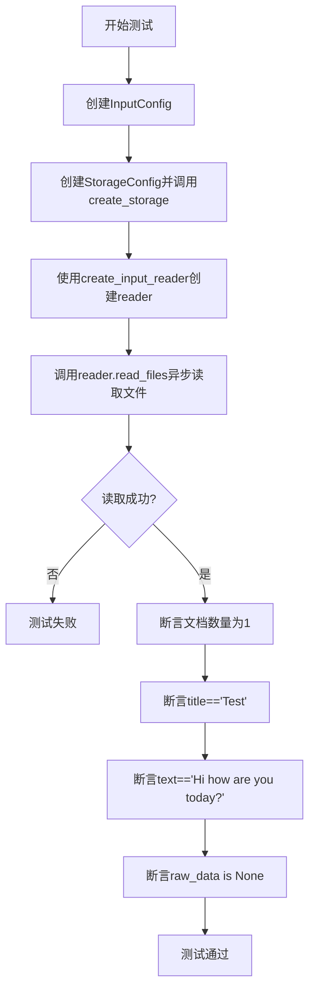
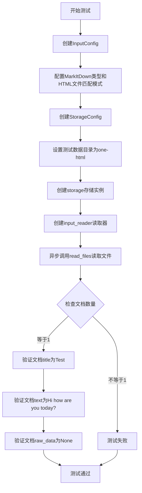
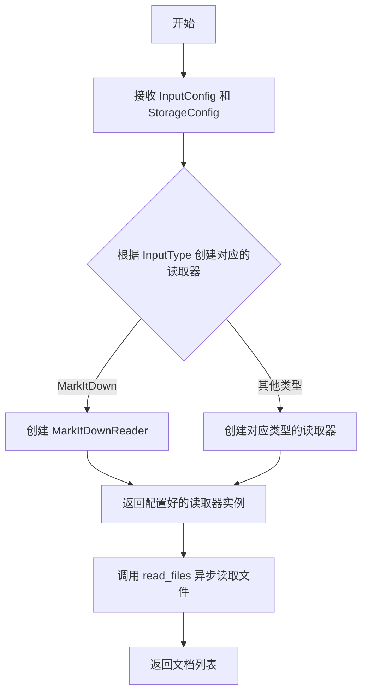
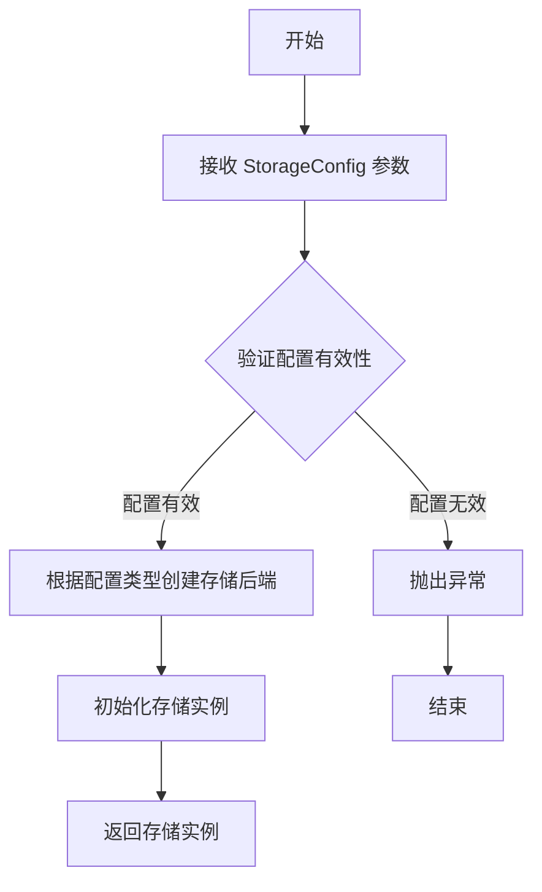

# `graphrag\tests\unit\indexing\input\test_markitdown_loader.py` 详细设计文档

这是一个异步单元测试文件，用于验证MarkItDown加载器能够正确读取HTML文件，并从中提取标题和正文内容，同时确保原始数据被正确清理。

## 整体流程



## 类结构

```
测试文件 (无类结构)
└── test_markitdown_loader_one_file (异步测试函数)
```

## 全局变量及字段


### `config`
    
配置输入类型为MarkItDown和文件匹配模式的输入配置实例

类型：`InputConfig`
    


### `storage`
    
配置基础目录为测试数据路径的存储实例

类型：`Storage`
    


### `reader`
    
用于读取输入文件的输入读取器实例

类型：`InputReader`
    


### `documents`
    
从输入文件中读取到的文档列表

类型：`List[Document]`
    


### `InputConfig.type`
    
输入配置的类型，指定使用MarkItDown作为输入处理器

类型：`InputType`
    


### `InputConfig.file_pattern`
    
用于匹配输入文件的正则表达式模式，此处为匹配.html文件

类型：`str`
    


### `StorageConfig.base_dir`
    
存储配置的基础目录路径，指向测试数据所在目录

类型：`str`
    
    

## 全局函数及方法


### `test_markitdown_loader_one_file`

异步测试函数，用于验证MarkItDown加载器能够正确加载HTML文件并提取标题和正文内容。该测试通过创建InputConfig和StorageConfig，初始化输入读取器，异步读取文件，并断言返回的文档包含正确的标题、正文和空的原始数据。

参数：此函数无参数。

返回值：`None`，作为异步测试函数无显式返回值，测试结果通过assert断言验证。

#### 流程图



#### 带注释源码

```
# 异步测试函数：验证MarkItDown加载器功能
# 导入所需模块：输入配置、输入类型、输入读取器、存储配置、存储工厂
async def test_markitdown_loader_one_file():
    # 创建输入配置，指定使用MarkItDown加载器
    # file_pattern设置为匹配HTML文件的正则表达式
    config = InputConfig(
        type=InputType.MarkItDown,
        file_pattern=".*\\.html$",
    )
    
    # 创建存储配置，指定测试数据目录路径
    # 该目录包含一个用于测试的HTML文件
    storage = create_storage(
        StorageConfig(
            base_dir="tests/unit/indexing/input/data/one-html",
        )
    )
    
    # 使用配置和存储创建输入读取器
    reader = create_input_reader(config, storage)
    
    # 异步读取文件，返回文档列表
    documents = await reader.read_files()
    
    # 断言：验证只读取到1个文档
    assert len(documents) == 1
    
    # 断言：验证MarkItDown正确提取了HTML的标题
    # markitdown会从HTML的title标签提取标题
    assert documents[0].title == "Test"
    
    # 断言：验证MarkItDown正确提取了HTML的正文内容
    # markitdown会从HTML的body标签提取正文
    assert documents[0].text == "Hi how are you today?"
    
    # 断言：验证原始数据被清空（MarkItDown会清理原始数据）
    assert documents[0].raw_data is None
```


### `create_input_reader`

创建输入读取器的工厂函数，根据提供的输入配置和存储配置创建相应的文档读取器，用于异步读取指定类型的文件。

参数：

- `config`：`InputConfig`，输入配置对象，包含输入类型（InputType）和文件匹配模式（file_pattern）
- `storage`：`StorageConfig` 或存储对象，用于配置存储基础目录和存储层

返回值：`InputReader`，返回一个新的输入读取器实例，该实例具有异步方法 `read_files()` 用于读取文件并返回文档列表

#### 流程图



#### 带注释源码

```python
# 从 graphrag_input 模块导入输入配置和类型
from graphrag_input import InputConfig, InputType, create_input_reader
from graphrag_storage import StorageConfig, create_storage

# 创建输入配置，指定使用 MarkItDown 加载器
# file_pattern 使用正则表达式匹配 .html 结尾的文件
config = InputConfig(
    type=InputType.MarkItDown,
    file_pattern=".*\\.html$",
)

# 创建存储配置，指定文件所在的基础目录
storage = create_storage(
    StorageConfig(
        base_dir="tests/unit/indexing/input/data/one-html",
    )
)

# 创建输入读取器工厂函数调用
# 传入配置和存储对象，返回一个读取器实例
reader = create_input_reader(config, storage)

# 异步调用读取器的方法读取文件
# 返回 Document 对象列表
documents = await reader.read_files()

# 验证读取结果
assert len(documents) == 1
# 验证文档标题和内容
assert documents[0].title == "Test"
assert documents[0].text == "Hi how are you today?"
# raw_data 为 None 表示数据已被处理
assert documents[0].raw_data is None
```


### `create_storage`

创建存储配置的工厂函数，用于根据提供的存储配置创建一个可用的存储实例。

参数：

- `config`：`StorageConfig`，存储配置对象，包含存储的基本配置信息（如 base_dir 等）

返回值：`Storage`，返回创建的存储实例，用于文件的读取和写入操作

#### 流程图



#### 带注释源码

```python
# 从 graphrag_storage 模块导入 StorageConfig 和 create_storage
# StorageConfig: 存储配置数据类，包含存储相关的配置参数
# create_storage: 工厂函数，根据配置创建存储实例

from graphrag_storage import StorageConfig, create_storage

# 创建存储配置，指定基础目录
storage = create_storage(
    StorageConfig(
        base_dir="tests/unit/indexing/input/data/one-html",  # 存储基础目录路径
    )
)
# 返回的 storage 对象可用于后续的文件读写操作
```

---

**备注**：由于提供的代码片段仅展示了 `create_storage` 函数的调用方式，未包含其具体实现源码，因此上述流程图和带注释源码为基于调用方式的合理推断。实际的 `create_storage` 函数实现位于 `graphrag_storage` 模块中，建议查阅该模块获取完整的实现细节。

## 关键组件


### InputConfig

用于配置输入读取器的配置类，包含输入类型和文件匹配模式。

### InputType

输入类型枚举，定义了可用的输入处理器类型，其中 MarkItDown 是用于解析多种文件格式的处理器。

### create_input_reader

工厂函数，根据配置和存储实例创建相应的输入读取器。

### StorageConfig

存储配置类，包含基础目录路径等存储相关配置。

### create_storage

工厂函数，根据存储配置创建存储实例。

### MarkItDown Loader

使用 MarkItDown 库从 HTML 文件中提取标题和正文内容的输入处理器，支持无需额外依赖的文件解析。

### reader.read_files()

异步方法，执行实际的文件读取操作，返回文档列表。


## 问题及建议


### 已知问题

-   **硬编码配置**：文件路径 `tests/unit/indexing/input/data/one-html` 和文件匹配模式 `.*\.html$` 硬编码在代码中，缺乏灵活性，测试数据路径应通过配置或fixture注入
-   **缺少错误处理**：未对文件读取失败、目录不存在等异常情况进行捕获和处理，测试执行可能在无有用错误信息的情况下直接失败
-   **资源未显式释放**：`storage` 对象创建后未显式调用关闭/清理方法，可能导致资源泄漏（尤其是在批量测试场景中）
-   **断言覆盖不足**：仅验证了 title、text 和 raw_data，未覆盖文档的元数据（如 source、timestamp 等其他可能字段），也未验证文件内容的边界情况
-   **测试数据耦合**：期望的 title "Test" 和 text "Hi how are you today?" 硬编码在断言中，与测试数据文件强耦合，测试数据变化会导致测试失败
-   **缺少日志记录**：无任何日志输出，测试失败时难以追踪问题根因
-   **异步资源管理**：使用 `async def` 但未使用 `async with` 或 `finally` 块确保资源正确释放

### 优化建议

-   **引入 pytest fixtures**：将配置、storage、reader 等对象通过 fixture 管理，实现自动初始化和清理
-   **添加异常断言**：使用 `pytest.raises` 验证错误场景，或在主流程中添加 try-except 并提供清晰的错误信息
-   **参数化测试**：使用 `@pytest.mark.parametrize` 允许外部配置测试数据和期望值，提高测试复用性
-   **完善断言信息**：为每个断言添加自定义错误消息，例如 `assert documents[0].title == "Test", f"Expected title 'Test', got '{documents[0].title}'"`
-   **日志集成**：在关键步骤添加 logging 记录，便于调试和追踪执行流程
-   **异步上下文管理**：使用 `async with` 或在 `finally` 中显式关闭 storage，确保资源释放
-   **扩展测试覆盖**：添加空文件、特殊字符、缺失字段等边界条件的测试用例

## 其它


### 设计目标与约束

本测试模块旨在验证GraphRAG输入系统中MarkItDown加载器对HTML文件的解析能力。设计目标包括：确认MarkItDown能够正确加载符合正则表达式".*\.html$"的HTML文件；验证其能从HTML中提取title和text字段；确保raw_data字段在处理后为None。约束条件包括：测试数据限于tests/unit/indexing/input/data/one-html目录下的HTML文件；依赖MarkItDown库的HTML解析功能；不涉及其他文件格式的测试。

### 错误处理与异常设计

本测试代码采用assert语句进行基本的断言验证，未包含复杂的异常处理机制。主要验证点包括：文件数量断言(len(documents) == 1)、title字段匹配("Test")、text字段匹配("Hi how are you today?")、raw_data字段为空(None)。若加载器或存储配置出现问题，测试将直接抛出异常并失败。生产环境中，InputConfig和StorageConfig的验证应在create_input_reader和create_storage函数内部完成。

### 数据流与状态机

测试数据流如下：InputConfig(type=InputType.MarkItDown) → create_input_reader()创建读取器 → StorageConfig指定数据目录 → reader.read_files()异步读取 → 返回Document列表 → assert验证文档内容。状态机较为简单，主要包含：初始化状态(配置创建) → 就绪状态(读取器创建) → 执行状态(异步读取) → 完成状态(断言验证)。

### 外部依赖与接口契约

核心依赖包括：graphrag_input模块提供InputConfig、InputType枚举和create_input_reader函数；graphrag_storage模块提供StorageConfig和create_storage函数；MarkItDown库负责实际HTML解析。接口契约方面：create_input_reader接受InputConfig和StorageConfig参数，返回实现read_files()方法的读取器对象；read_files()方法为异步函数，返回Document列表；Document对象应包含title、text、raw_data三个属性。

### 性能考量

当前测试为单元测试，性能不是主要关注点。测试覆盖单文件场景，未测试大规模文件批量处理能力。MarkItDown加载器的性能取决于其底层HTML解析库的实现。异步读取设计(await reader.read_files())支持潜在的并发处理场景。

### 配置管理

配置通过InputConfig和StorageConfig两个数据类传递。InputConfig.type指定加载器类型(InputType.MarkItDown)；InputConfig.file_pattern定义文件过滤正则表达式；StorageConfig.base_dir指定数据基础目录。当前配置硬编码于测试函数内部，未来可考虑外部化配置文件或环境变量注入。

### 测试覆盖与边界条件

当前测试覆盖基本正向流程。缺失的边界条件测试包括：空HTML文件处理、无title/body标签的HTML文件、多HTML文件批量读取、超大HTML文件性能、文件读取权限错误等。建议补充边界条件和异常场景测试用例。

    