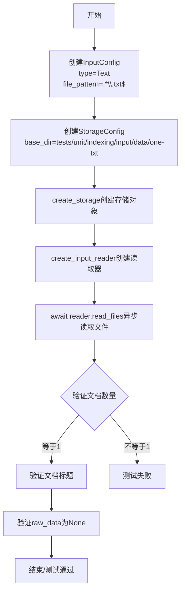
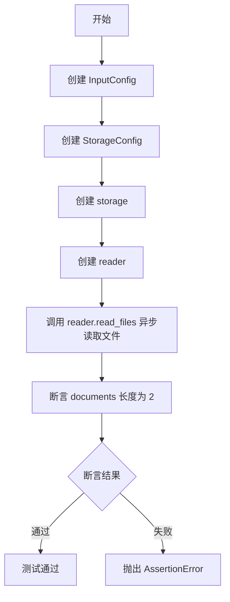

# `graphrag\tests\unit\indexing\input\test_text_loader.py` 详细设计文档

这是一个用于测试 GraphRAG 输入模块文本加载功能的测试文件，通过创建 InputConfig 和 StorageConfig 配置，调用 create_input_reader 创建读取器，验证是否能正确读取单个和多个文本文件，并检查返回的文档对象属性是否正确。

## 整体流程

```mermaid
graph TD
    A[开始测试] --> B[创建 InputConfig]
    B --> C[创建 StorageConfig]
    C --> D[调用 create_storage 创建存储实例]
    D --> E[调用 create_input_reader 创建读取器]
    E --> F[异步调用 reader.read_files 读取文件]
    F --> G{测试单个文件还是多个文件}
    G -- 单个文件 --> H[断言 documents 长度为 1]
    H --> I[断言 documents[0].title 为 input.txt]
    I --> J[断言 documents[0].raw_data 为 None]
    G -- 多个文件 --> K[断言 documents 长度为 2]
    K --> L[测试结束]
```

## 类结构

```
测试模块 (无类定义)
├── test_text_loader_one_file (测试函数)
└── test_text_loader_multiple_files (测试函数)
```

## 全局变量及字段


### `config`
    
输入配置对象，用于指定输入类型和文件匹配模式

类型：`InputConfig`
    


### `storage`
    
存储对象，用于访问指定目录下的文件

类型：`Storage`
    


### `reader`
    
输入读取器，负责从存储中读取文件并转换为文档对象

类型：`InputReader`
    


### `documents`
    
读取到的文档列表，包含文件的标题和原始数据

类型：`List[Document]`
    


    

## 全局函数及方法


### `test_text_loader_one_file`

这是一个异步测试函数，用于验证文本加载器能否正确读取单个文本文件，并检查返回的文档对象是否包含预期的元数据（标题为"input.txt"，无原始数据）。

参数：

- 无参数

返回值：`None`，该函数为异步测试函数，不返回具体数据，结果通过断言验证

#### 流程图



#### 带注释源码

```python
# 异步测试函数：验证文本加载器加载单个文件的功能
async def test_text_loader_one_file():
    # 第一步：创建输入配置，指定类型为文本文件
    # file_pattern正则表达式指定只匹配.txt结尾的文件
    config = InputConfig(
        type=InputType.Text,
        file_pattern=".*\\.txt$",
    )
    
    # 第二步：创建存储配置，指定测试数据目录路径
    # 该目录下应包含一个名为input.txt的文件
    storage = create_storage(
        StorageConfig(
            base_dir="tests/unit/indexing/input/data/one-txt",
        )
    )
    
    # 第三步：根据配置创建输入读取器
    # 输入读取器负责根据配置读取相应类型的文件
    reader = create_input_reader(config, storage)
    
    # 第四步：异步读取文件，返回文档列表
    documents = await reader.read_files()
    
    # 第五步：断言验证
    # 验证点1：文档数量应为1
    assert len(documents) == 1
    # 验证点2：第一个文档的标题应为"input.txt"
    assert documents[0].title == "input.txt"
    # 验证点3：原始数据应为None（文本加载器可能不保留原始数据）
    assert documents[0].raw_data is None
```


### `test_text_loader_multiple_files`

这是一个异步测试函数，用于验证文本加载器能够正确读取多个 txt 文件并返回正确数量的文档对象。

#### 参数

无参数。

#### 返回值

无返回值（`None`），该函数通过断言进行测试验证。

#### 流程图



#### 带注释源码

```python
# 异步测试函数：测试文本加载器加载多个文件的功能
async def test_text_loader_multiple_files():
    # 1. 创建输入配置，指定输入类型为 Text
    config = InputConfig(
        type=InputType.Text,
    )
    # 2. 创建存储配置，指定测试数据目录路径
    storage = create_storage(
        StorageConfig(
            base_dir="tests/unit/indexing/input/data/multiple-txts",
        )
    )
    # 3. 根据配置创建输入读取器
    reader = create_input_reader(config, storage)
    # 4. 异步读取所有匹配的文件，返回文档列表
    documents = await reader.read_files()
    # 5. 断言验证：确认成功读取了 2 个文档
    assert len(documents) == 2
```

#### 关键组件信息

| 组件名称 | 一句话描述 |
|---------|-----------|
| `InputConfig` | 输入配置类，用于配置数据源类型和文件匹配模式 |
| `InputType.Text` | 枚举值，表示输入类型为文本文件 |
| `StorageConfig` | 存储配置类，用于配置存储基础目录 |
| `create_storage` | 工厂函数，根据配置创建存储实例 |
| `create_input_reader` | 工厂函数，根据配置创建输入读取器 |
| `reader.read_files` | 异步方法，执行实际的文件读取操作 |

#### 潜在的技术债务或优化空间

1. **缺少返回值验证**：函数仅验证了文档数量，未验证文档内容、标题等属性完整性，建议增加更全面的断言
2. **硬编码路径**：测试数据路径直接硬编码，建议使用相对路径或环境变量增强可移植性
3. **错误处理缺失**：未测试文件读取失败、目录不存在等异常场景
4. **测试隔离性**：测试依赖外部文件系统状态，可能因环境差异导致测试不稳定

#### 其它项目

**设计目标与约束**：
- 验证 `create_input_reader` 工厂函数能正确创建支持多文件读取的 Text 类型读取器
- 确认读取器能扫描指定目录并返回所有匹配的文件

**错误处理与异常设计**：
- 使用 `assert` 进行基本验证，失败时抛出 `AssertionError`
- 未捕获文件不存在或读取错误等异常

**数据流与状态机**：
- 配置 → 存储初始化 → 读取器创建 → 文件扫描 → 文档列表返回

**外部依赖与接口契约**：
- 依赖 `graphrag_input` 模块的 `InputConfig`、`InputType`、`create_input_reader`
- 依赖 `graphrag_storage` 模块的 `StorageConfig`、`create_storage`
- 预期 `tests/unit/indexing/input/data/multiple-txts` 目录包含恰好 2 个 .txt 文件

## 关键组件


### InputConfig 类

用于配置输入读取器的参数，包含输入类型(InputType)和文件匹配模式(file_pattern)。该配置决定从何种数据源读取数据以及如何筛选文件。

### InputType 枚举

定义可处理的输入类型，当前支持 Text 类型。用于在创建输入读取器时指定数据格式。

### StorageConfig 类

用于配置存储层的参数，包含基础目录(base_dir)路径。该配置指定数据文件的存储位置。

### create_input_reader 工厂函数

根据输入配置和存储配置创建相应的输入读取器实例。返回的读取器支持异步读取文件操作。

### create_storage 工厂函数

根据存储配置创建存储实例。该存储对象用于访问底层文件系统或存储系统。

### InputReader.read_files 异步方法

异步读取配置目录下所有匹配的文件，返回文档列表。每个文档包含标题(title)和原始数据(raw_data)字段。

### 文档对象模型

表示读取到的文档内容，包含 title（文件标题）和 raw_data（原始数据）字段。测试用例验证文档数量和属性值。

### 异步测试流程

使用 async/await 语法实现异步测试，通过 assert 语句验证读取结果是否符合预期，包括文档数量和内容属性。


## 问题及建议


### 已知问题

-   **硬编码路径**：测试文件路径 `tests/unit/indexing/input/data/one-txt` 和 `tests/unit/indexing/input/data/multiple-txts` 硬编码在代码中，降低了测试的可移植性
-   **重复代码**：两个测试函数存在大量重复的创建 `InputConfig`、`StorageConfig` 和 `reader` 的代码，未进行抽象复用
-   **缺乏错误处理**：没有 try-except 块处理文件不存在、读取失败等异常情况，测试失败时缺乏明确的错误信息
-   **文件模式不一致**：第一个测试显式指定了 `file_pattern=".*\\.txt$"`，第二个测试未指定，可能导致行为不一致
-   **资源未显式释放**：未看到 reader 或 storage 的资源清理代码，可能存在资源泄漏风险
-   **断言粒度不足**：仅验证了文档数量和标题，未验证文档的其他属性（如内容、编码格式等），覆盖度有限
-   **魔法数字**：预期文档数量 `1` 和 `2` 直接写在代码中，未定义为常量
-   **测试数据依赖不明确**：未检查测试数据目录是否存在，测试失败时难以快速定位问题

### 优化建议

-   **抽取测试fixture**：使用 pytest fixture 复用 config、storage 和 reader 的创建逻辑
-   **添加路径常量**：将测试数据路径提取为模块级常量或配置
-   **增强断言**：添加更多属性验证，如文档内容、编码、原始数据类型的检查
-   **添加异常处理**：使用 pytest.raises 或 try-except 包装可能失败的代码
-   **统一配置**：确保两个测试使用一致的文件模式配置
-   **添加前置检查**：在测试开始前验证测试数据目录是否存在，提供友好的错误提示
-   **考虑资源管理**：如 reader 实现了上下文管理器协议，考虑使用 async with 语法

## 其它


### 设计目标与约束

该代码的主要设计目标是验证graphrag_input模块的文本文件读取功能是否正常工作。具体包括：验证能够正确读取单个文本文件、验证文件元数据（标题）是否正确、验证能够正确处理多个文本文件、验证文件模式匹配功能。约束条件包括：仅支持.txt文件、文件必须位于配置的base_dir目录下、使用异步IO操作。

### 错误处理与异常设计

代码主要依赖pytest的断言进行错误验证。对于文件读取失败的情况，由create_input_reader和read_files()方法内部处理并抛出异常。可能的异常包括：文件未找到异常、文件读取权限异常、存储配置错误异常、输入配置无效异常。当前测试代码没有显式的异常捕获机制，假设文件操作应该成功，如果失败测试将直接报错。

### 数据流与状态机

数据流如下：InputConfig和StorageConfig作为配置对象传入create_input_reader()创建读取器 → 读取器调用read_files()方法 → 遍历存储目录中的文件 → 根据file_pattern过滤匹配的文件 → 读取文件内容 → 返回Document对象列表。状态机相对简单，主要处于"就绪"和"已完成"两种状态，没有复杂的状态转换。

### 外部依赖与接口契约

主要依赖两个外部模块：graphrag_input模块提供InputConfig、InputType、create_input_reader函数；graphrag_storage模块提供StorageConfig、create_storage函数。create_input_reader(config, storage)接受InputConfig和storage对象，返回实现了read_files()方法的读取器对象。read_files()方法返回Document对象列表，每个Document包含title和raw_data属性。

### 性能考量与资源管理

测试代码未包含性能测试，主要关注功能正确性。资源管理方面，storage对象应该在使用后释放，但由于测试环境生命周期较短，未显式处理。读取文件时采用异步IO，有利于提高并发性能。文件内容存储在内存中，对于大文件场景可能需要考虑流式处理或分块读取。

### 测试覆盖率与验证策略

当前测试覆盖了两种场景：单文件读取和多文件读取。验证点包括：文件数量、文档标题、原始数据。建议补充的测试场景包括：空目录测试、嵌套目录测试、非法文件格式测试、超大文件测试、文件编码问题测试、并发读取测试、错误配置场景测试。

### 配置管理与环境要求

配置通过InputConfig和StorageConfig对象传递，支持运行时配置。InputConfig.type指定输入类型，file_pattern指定文件匹配正则表达式。StorageConfig.base_dir指定基础目录路径。环境要求：Python异步支持、graphrag_input和graphrag_storage模块正确安装、测试数据目录存在且包含预期文件。

### 并发与异步设计

代码使用async/await语法进行异步编程，read_files()方法是异步方法。设计支持并发读取多个文件，但当前实现为顺序读取。如需提升性能，可考虑使用asyncio.gather()并发读取多个文件，或使用线程池/进程池处理IO密集型操作。

### 安全性考量

当前代码主要关注功能实现，安全性考虑较少。潜在的安全问题包括：目录遍历攻击（base_dir未做严格校验）、文件类型绕过（仅依赖file_pattern正则匹配）、大文件DoS攻击（无文件大小限制）、敏感文件读取（未排除系统文件）。建议增加输入校验、文件大小限制、排除模式等安全措施。

### 可维护性与扩展性

代码结构清晰，使用配置对象便于修改。扩展方向包括：支持更多输入类型（CSV、JSON、XML等）、支持流式处理、支持自定义文件过滤器、支持元数据提取。模块化设计（输入模块、存储模块分离）有利于后续维护和扩展。

    