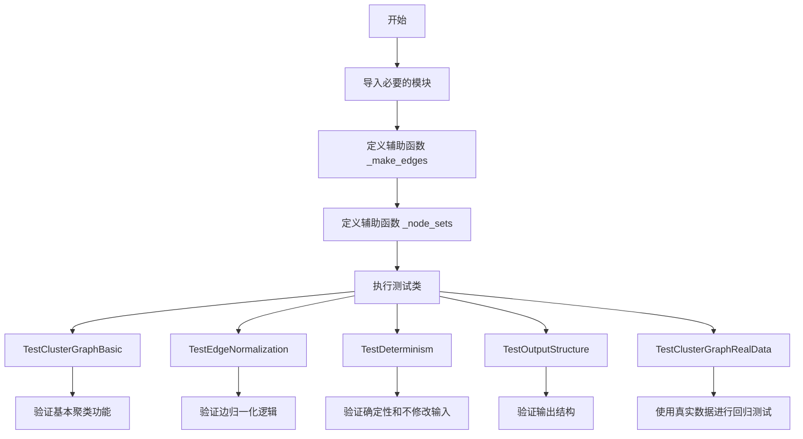
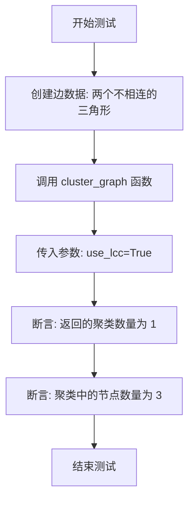
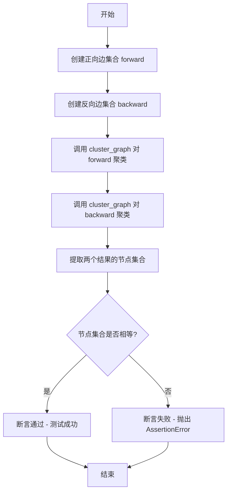
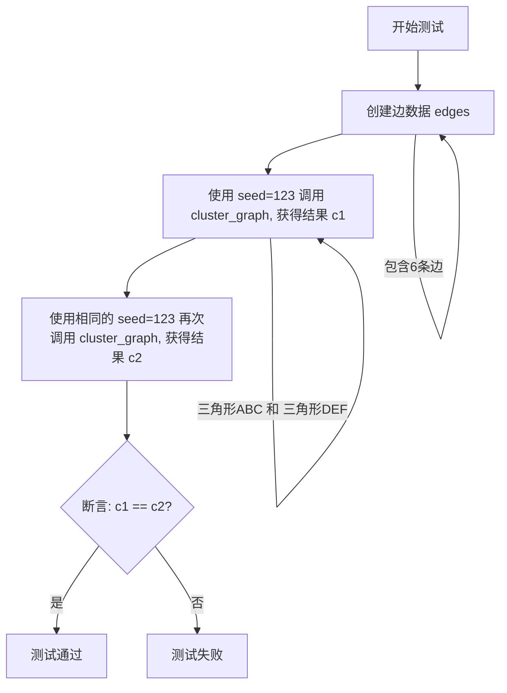
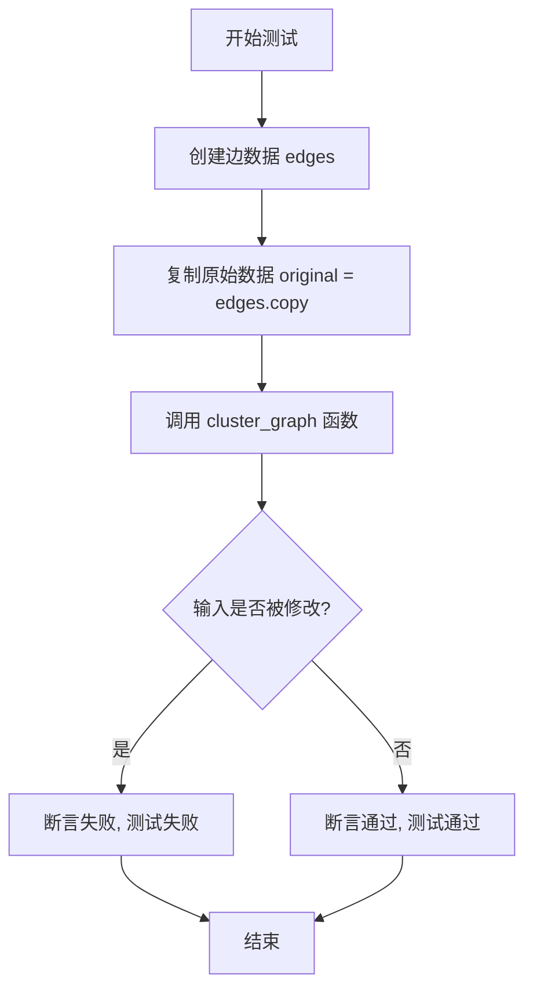
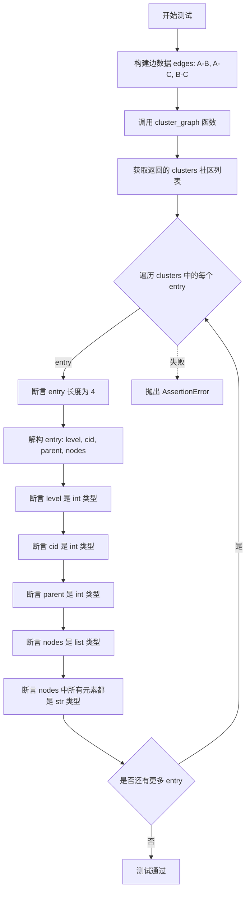
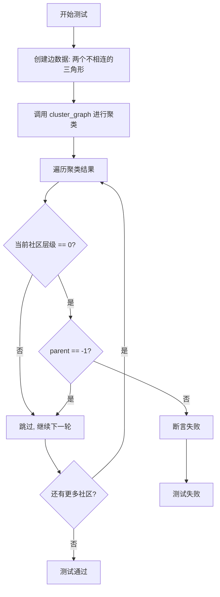
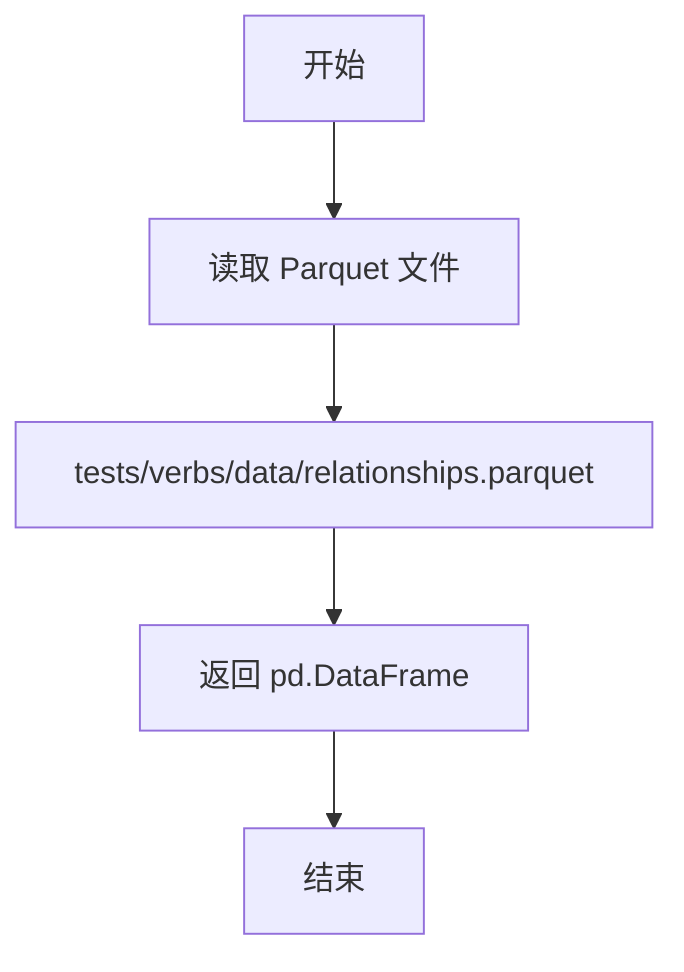
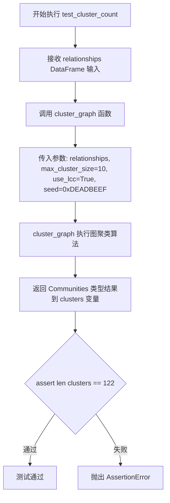
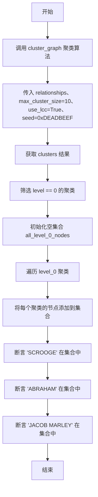

# `graphrag\tests\unit\indexing\test_cluster_graph.py` 详细设计文档

这是一个测试文件，用于验证 graphrag 索引操作中的 cluster_graph 函数的正确性。cluster_graph 函数使用 Leiden 算法对输入的边关系数据进行社区发现（聚类），支持最大聚类大小、随机种子、最大连通分量等参数，并返回分层级的社区结构。

## 整体流程



## 类结构

```
全局函数
├── _make_edges (构建边 DataFrame)
└── _node_sets (提取节点集)

测试类
├── TestClusterGraphBasic (基本聚类测试)
│   ├── test_single_triangle
│   ├── test_two_disconnected_cliques
│   └── test_lcc_filters_to_largest_component
├── TestEdgeNormalization (边归一化测试)
│   ├── test_reversed_edges_produce_same_result
│   ├── test_duplicate_edges_are_deduped
│   └── test_missing_weight_defaults_to_one
├── TestDeterminism (确定性测试)
│   ├── test_same_seed_same_result
│   └── test_does_not_mutate_input
├── TestOutputStructure (输出结构测试)
│   ├── test_output_tuple_structure
│   ├── test_level_zero_has_parent_minus_one
│   └── test_all_nodes_covered_at_each_level
└── TestClusterGraphRealData (真实数据回归测试)
    ├── relationships (fixture)
    ├── test_cluster_count
    ├── test_level_distribution
    └── test_level_zero_nodes_sample
```

## 全局变量及字段


### `edges`
    
包含source, target, weight列的边数据DataFrame，用于聚类输入

类型：`pd.DataFrame`
    


### `clusters`
    
图聚类结果列表，每个元素为(level, community_id, parent, nodes)元组

类型：`Communities`
    


### `forward`
    
正向方向的边数据DataFrame（A->B格式）

类型：`pd.DataFrame`
    


### `backward`
    
反向方向的边数据DataFrame（B->A格式）

类型：`pd.DataFrame`
    


### `clusters_fwd`
    
正向边数据的聚类结果

类型：`Communities`
    


### `clusters_bwd`
    
反向边数据的聚类结果

类型：`Communities`
    


### `original`
    
输入边数据的原始副本，用于验证函数不修改输入

类型：`pd.DataFrame`
    


### `relationships`
    
从parquet文件加载的测试关系数据fixture

类型：`pd.DataFrame`
    


### `level_counts`
    
统计每个层级的聚类数量

类型：`Counter`
    


### `level_0`
    
所有层级为0的聚类条目列表

类型：`list[Communities]`
    


### `all_level_0_nodes`
    
包含所有层级0聚类中的节点集合

类型：`set[str]`
    


### `levels`
    
按层级组织的节点集合字典，键为层级号，值为该层级的节点集合

类型：`dict[int, set[str]]`
    


    

## 全局函数及方法


### `_make_edges`

该函数是一个测试辅助函数，用于将简单的边元组列表转换为符合 `cluster_graph` 函数输入要求的 Pandas DataFrame 格式，包含 source、target 和 weight 三列。

**参数：**

- `rows`：`list[tuple[str, str, float]]`，输入的边列表，每个元素为 (source, target, weight) 元组

**返回值：** `pd.DataFrame`，包含 source、target、weight 三列的关系数据框

#### 流程图

```mermaid
flowchart TD
    A[开始] --> B[输入: rows 列表<br/>e.g. [('X','Y',1.0), ('X','Z',1.0)]]
    B --> C{遍历 rows 中的每个元组}
    C -->|对于每个 (s, t, w)| D[创建字典<br/>{source: s, target: t, weight: w}]
    D --> C
    C -->|完成遍历| E[调用 pd.DataFrame 构造器<br/>将字典列表转换为 DataFrame]
    E --> F[返回 DataFrame]
```

#### 带注释源码

```python
def _make_edges(
    rows: list[tuple[str, str, float]],
) -> pd.DataFrame:
    """Build a minimal relationships DataFrame from (source, target, weight)."""
    # 将 (source, target, weight) 元组列表转换为字典列表
    # 每个字典代表一行数据，包含 'source', 'target', 'weight' 三个键
    return pd.DataFrame([{"source": s, "target": t, "weight": w} for s, t, w in rows])
```


### `_node_sets`

这是一个辅助函数，用于从聚类输出中提取节点集合列表。它接收聚类结果作为输入，通过列表推导式将每个聚类条目的节点部分转换为集合，最终返回一个包含所有节点集合的列表。

参数：

- `clusters`：`Communities`，聚类输出，即 `cluster_graph` 函数返回的社区列表

返回值：`list[set[str]]`，从聚类输出中提取的按级别排序的节点集合列表

#### 流程图

```mermaid
flowchart TD
    A[输入: clusters Communities] --> B{遍历 clusters}
    B --> C[提取每个元素的第4项 nodes]
    C --> D[将 nodes 转换为 set]
    D --> E[收集到列表中]
    E --> F[返回: list[set[str]]]
```

#### 带注释源码

```python
def _node_sets(clusters: Communities) -> list[set[str]]:
    """Extract sorted-by-level list of node sets from cluster output.
    
    Args:
        clusters: 聚类输出，即 cluster_graph 函数返回的 Communities 类型数据。
                 每个元素是一个元组 (level, community_id, parent, nodes)。
    
    Returns:
        一个列表，其中每个元素是对应聚类中节点的集合。
        由于 clusters 通常按 level 排序，因此返回的列表也是按级别排序的。
    """
    # 使用列表推导式遍历 clusters，提取每个元组的第4个元素（nodes）
    # 并将其转换为集合后添加到列表中
    # clusters 中的每个元素格式为: (level, community_id, parent, nodes)
    # 这里使用 _ 忽略前三个元素，只取 nodes
    return [set(nodes) for _, _, _, nodes in clusters]
```


### `TestClusterGraphBasic.test_single_triangle`

该测试方法验证 `cluster_graph` 函数对于单个三角形图（三个节点 X、Y、Z 完全相连）能够正确产生一个层级为 0、父节点为 -1、包含全部三个节点的社区。

参数：

- `self`：隐式参数，`TestClusterGraphBasic` 类的实例，无需额外描述

返回值：无（`None`），测试函数通过断言验证预期行为，不返回任何值

#### 流程图

```mermaid
flowchart TD
    A[开始测试] --> B[构建边数据: _make_edges]
    B --> C[调用 cluster_graph 函数]
    C --> D[断言: 社区数量为 1]
    D --> E[断言: 层级 level == 0]
    E --> F[断言: 父节点 parent == -1]
    F --> G[断言: 节点集合 == {X, Y, Z}]
    G --> H[测试结束]
```

#### 带注释源码

```python
def test_single_triangle(self):
    """A single triangle should produce one community at level 0."""
    # 使用测试辅助函数构建边 DataFrame，包含三角形的三条边 (X-Y, X-Z, Y-Z)
    edges = _make_edges([("X", "Y", 1.0), ("X", "Z", 1.0), ("Y", "Z", 1.0)])
    
    # 调用 cluster_graph 进行聚类
    # 参数: max_cluster_size=10 最大聚类大小
    #       use_lcc=False 不使用最大连通分量过滤
    #       seed=42 固定随机种子确保可重复性
    clusters = cluster_graph(edges, max_cluster_size=10, use_lcc=False, seed=42)

    # 断言1: 验证返回的社区数量为 1（单一连通图应产生一个社区）
    assert len(clusters) == 1
    
    # 解构社区元组: (level, community_id, parent, nodes)
    level, _cid, parent, nodes = clusters[0]
    
    # 断言2: 验证层级为 0（最底层社区）
    assert level == 0
    
    # 断言3: 验证父节点为 -1（根节点无父节点）
    assert parent == -1
    
    # 断言4: 验证社区包含三角形的所有三个节点
    assert set(nodes) == {"X", "Y", "Z"}
```


### `TestClusterGraphBasic.test_two_disconnected_cliques`

该测试方法用于验证 cluster_graph 函数能够正确识别两个不相连的三角形子图（即两个独立的完全图），并将它们分别识别为两个独立的社区。

参数：

- `self`：测试类实例，无需显式传递

返回值：`None`，测试方法无返回值，通过断言验证行为

#### 流程图

```mermaid
flowchart TD
    A[开始测试] --> B[构建边数据: 两个不相连的三角形]
    B --> C[调用 cluster_graph 函数进行聚类]
    C --> D{断言: 社区数量 = 2}
    D -->|是| E[提取节点集合]
    E --> F{断言: 节点集合包含 {A,B,C}}
    F --> G{断言: 节点集合包含 {D,E,F}}
    G --> H{断言: 所有社区层级 = 0}
    H --> I{断言: 所有社区父节点 = -1}
    I --> J[测试通过]
    D -->|否| K[测试失败]
    F -->|否| K
    G -->|否| K
    H -->|否| K
    I -->|否| K
```

#### 带注释源码

```python
def test_two_disconnected_cliques(self):
    """Two disconnected triangles should produce two communities."""
    # 第一步：构建边数据
    # 创建两个不相连的三角形：ABC 和 DEF
    # 三角形1: A-B, A-C, B-C
    # 三角形2: D-E, D-F, E-F
    edges = _make_edges([
        ("A", "B", 1.0),
        ("A", "C", 1.0),
        ("B", "C", 1.0),
        ("D", "E", 1.0),
        ("D", "F", 1.0),
        ("E", "F", 1.0),
    ])
    
    # 第二步：调用 cluster_graph 进行聚类
    # max_cluster_size=10: 最大簇大小为10
    # use_lcc=False: 不只使用最大连通分量
    # seed=42: 使用固定随机种子保证可重复性
    clusters = cluster_graph(edges, max_cluster_size=10, use_lcc=False, seed=42)

    # 第三步：验证结果
    # 断言1: 应该有2个社区（每个三角形一个）
    assert len(clusters) == 2
    
    # 提取所有社区的节点集合
    node_sets = _node_sets(clusters)
    
    # 断言2: 节点集合应包含第一个三角形 {A,B,C}
    assert {"A", "B", "C"} in node_sets
    
    # 断言3: 节点集合应包含第二个三角形 {D,E,F}
    assert {"D", "E", "F"} in node_sets
    
    # 断言4: 所有社区都应该在第0层级
    for level, _, parent, _ in clusters:
        assert level == 0
        # 断言5: 所有社区的父节点都应该是-1（根节点）
        assert parent == -1
```


### `TestClusterGraphBasic.test_lcc_filters_to_largest_component`

验证当 `use_lcc=True` 时，`cluster_graph` 函数仅保留图中最大的连通分量，过滤掉其他较小的连通分量。

参数：

- 无显式参数（测试内部通过 `_make_edges` 创建 `edges` DataFrame，并通过闭包调用 `cluster_graph`）

返回值：`None`，该方法为测试用例，使用断言验证行为，不返回任何值。

#### 流程图



#### 带注释源码

```python
def test_lcc_filters_to_largest_component(self):
    """With use_lcc=True, only the largest connected component is kept."""
    # 创建包含两个不相连三角形的边数据
    # 三角形1: A-B, A-C, B-C
    # 三角形2: D-E, D-F, E-F
    edges = _make_edges([
        ("A", "B", 1.0),
        ("A", "C", 1.0),
        ("B", "C", 1.0),
        ("D", "E", 1.0),
        ("D", "F", 1.0),
        ("E", "F", 1.0),
    ])
    
    # 调用 cluster_graph，启用 LCC (Largest Connected Component) 过滤
    # use_lcc=True 表示只保留最大的连通分量
    clusters = cluster_graph(edges, max_cluster_size=10, use_lcc=True, seed=42)

    # 断言1: 由于启用了 LCC 过滤，应该只返回一个聚类
    assert len(clusters) == 1
    
    # 断言2: 获取聚类中的所有节点，验证其数量为 3
    # 即只保留了一个三角形（最大的连通分量）
    all_nodes = set(clusters[0][3])
    assert len(all_nodes) == 3
```


### `TestEdgeNormalization.test_reversed_edges_produce_same_result`

该测试方法验证在图聚类操作中，将所有边的方向反转后应产生相同的聚类结果，确保`cluster_graph`函数对边方向不敏感（无向图处理）。

参数：

- `self`：隐式参数，`TestEdgeNormalization`类的实例，无需显式传递

返回值：无返回值（`None`），通过断言验证正向和反向边的聚类结果一致

#### 流程图



#### 带注释源码

```python
def test_reversed_edges_produce_same_result(self):
    """Reversing all edge directions should yield identical clusters."""
    # 构建正向边集合: A->B, A->C, B->C, D->E, D->F, E->F
    forward = _make_edges([
        ("A", "B", 1.0),
        ("A", "C", 1.0),
        ("B", "C", 1.0),
        ("D", "E", 1.0),
        ("D", "F", 1.0),
        ("E", "F", 1.0),
    ])
    # 构建反向边集合: B->A, C->A, C->B, E->D, F->D, F->E
    backward = _make_edges([
        ("B", "A", 1.0),
        ("C", "A", 1.0),
        ("C", "B", 1.0),
        ("E", "D", 1.0),
        ("F", "D", 1.0),
        ("F", "E", 1.0),
    ])
    # 使用正向边进行聚类，使用 max_cluster_size=10, use_lcc=False, seed=42
    clusters_fwd = cluster_graph(
        forward, max_cluster_size=10, use_lcc=False, seed=42
    )
    # 使用反向边进行聚类，使用相同的参数确保可复现性
    clusters_bwd = cluster_graph(
        backward, max_cluster_size=10, use_lcc=False, seed=42
    )

    # 断言：正向和反向边的聚类结果（节点集合）应完全相同
    assert _node_sets(clusters_fwd) == _node_sets(clusters_bwd)
```


### TestEdgeNormalization.test_duplicate_edges_are_deduped

该测试方法验证了在图聚类操作中，重复边（如 A→B 和 B→A）能够被正确去重和归一化处理，最终形成单一社区。

参数：

- `self`：`TestEdgeNormalization`，测试类的实例，隐式参数，用于访问类属性和方法

返回值：`None`，该方法为测试方法，无返回值，通过 pytest 断言验证功能正确性

#### 流程图

```mermaid
flowchart TD
    A[开始测试] --> B[创建边数据: A→B, B→A, A→C, B→C]
    B --> C[调用 cluster_graph 进行聚类]
    C --> D{断言聚类结果}
    D -->|通过| E[测试通过]
    D -->|失败| F[测试失败]
    
    subgraph 验证细节
    C1[验证社区数量 == 1] 
    C2[验证节点集合 == {A, B, C}]
    end
    
    C --> C1 --> C2 --> D
```

#### 带注释源码

```python
def test_duplicate_edges_are_deduped(self):
    """A→B and B→A should be treated as one edge after normalization."""
    # 构建包含重复边的关系数据：包括 A→B, B→A, A→C, B→C
    # 其中 A→B 和 B→A 是互为反向的重复边，应该在归一化后合并为一条边
    edges = _make_edges([
        ("A", "B", 1.0),  # 边 A→B，权重 1.0
        ("B", "A", 2.0),  # 边 B→A，权重 2.0（与上一条边重复，应被去重）
        ("A", "C", 1.0),  # 边 A→C，权重 1.0
        ("B", "C", 1.0),  # 边 B→C，权重 1.0
    ])
    
    # 调用 cluster_graph 函数进行图聚类
    # 参数说明：
    #   - max_cluster_size=10: 最大聚类规模
    #   - use_lcc=False: 不限制为最大连通分量
    #   - seed=42: 随机种子，确保结果可复现
    clusters = cluster_graph(edges, max_cluster_size=10, use_lcc=False, seed=42)

    # 断言验证：应该只产生一个社区
    # 验证去重逻辑正确：重复边 A→B 和 B→A 合并后，只有单一连通分量
    assert len(clusters) == 1
    
    # 断言验证：社区应包含所有三个节点 A, B, C
    # clusters[0] 的结构为 (level, community_id, parent, nodes)
    # 其中 nodes 是该社区的节点列表
    assert set(clusters[0][3]) == {"A", "B", "C"}
```


### `TestEdgeNormalization.test_missing_weight_defaults_to_one`

该测试方法用于验证当输入的边数据缺少 `weight` 列时，系统能够正确地将缺失的权重默认值设为 1.0，确保图聚类算法能够正常处理无边权重的边数据。

参数： 无（除 `self` 隐式参数外）

返回值：`None`，该方法为测试方法，通过断言验证功能，不返回具体数据

#### 流程图

```mermaid
flowchart TD
    A[开始测试] --> B[创建无weight列的edges DataFrame]
    B --> C[调用cluster_graph函数]
    C --> D{断言聚类结果数量为1}
    D -->|通过| E[断言节点集合为{A, B, C}]
    E --> F[测试通过]
    D -->|失败| G[测试失败]
    
    style A fill:#f9f,color:#000
    style F fill:#9f9,color:#000
    style G fill:#f99,color:#000
```

#### 带注释源码

```python
def test_missing_weight_defaults_to_one(self):
    """Edges without a weight column should default to weight 1.0."""
    # 创建一个不包含weight列的边DataFrame
    # 包含三条边: A->B, A->C, B->C
    edges = pd.DataFrame({
        "source": ["A", "A", "B"],
        "target": ["B", "C", "C"],
    })
    
    # 调用cluster_graph函数进行聚类
    # 传入参数: edges-边数据, max_cluster_size=10-最大聚类大小, 
    # use_lcc=False-不使用最大连通分量, seed=42-随机种子
    clusters = cluster_graph(edges, max_cluster_size=10, use_lcc=False, seed=42)

    # 断言: 应该产生1个聚类
    assert len(clusters) == 1
    
    # 断言: 聚类中的节点集合应包含A, B, C
    # 这验证了即使没有weight列，所有节点仍被正确聚类在一起
    assert set(clusters[0][3]) == {"A", "B", "C"}
```


### `TestDeterminism.test_same_seed_same_result`

该测试方法验证了使用相同种子（seed）调用 `cluster_graph` 函数时，能够产生完全相同的输出结果，从而确保聚类算法的确定性行为。

参数：

- `self`：`TestDeterminism`，测试类的实例对象，隐式参数

返回值：`None`，测试方法无显式返回值，通过断言验证结果

#### 流程图



#### 带注释源码

```python
def test_same_seed_same_result(self):
    """Identical seed should yield identical output."""
    # 构建测试用的边数据，包含两个不相连的三角形
    # 三角形1: A-B, A-C, B-C
    # 三角形2: D-E, D-F, E-F
    edges = _make_edges([
        ("A", "B", 1.0),
        ("A", "C", 1.0),
        ("B", "C", 1.0),
        ("D", "E", 1.0),
        ("D", "F", 1.0),
        ("E", "F", 1.0),
    ])
    # 第一次调用 cluster_graph，使用 seed=123
    c1 = cluster_graph(edges, max_cluster_size=10, use_lcc=False, seed=123)
    # 第二次调用 cluster_graph，使用相同的 seed=123
    c2 = cluster_graph(edges, max_cluster_size=10, use_lcc=False, seed=123)

    # 断言两次调用的结果完全相等，验证确定性
    assert c1 == c2
```


### `TestDeterminism.test_does_not_mutate_input`

验证 `cluster_graph` 函数不会修改输入的 DataFrame，确保函数的纯函数特性。

参数：

-  `self`：`TestDeterminism`，测试类的实例，隐式参数

返回值：`None`，无显式返回值（通过 `pd.testing.assert_frame_equal` 断言验证）

#### 流程图



#### 带注释源码

```python
def test_does_not_mutate_input(self):
    """cluster_graph should not modify the input DataFrame."""
    # 步骤1: 创建一个包含三条边的测试数据 (A-B, A-C, B-C)
    edges = _make_edges([
        ("A", "B", 1.0),
        ("A", "C", 1.0),
        ("B", "C", 1.0),
    ])
    # 步骤2: 在调用 cluster_graph 之前复制原始 DataFrame
    # 用于后续验证输入是否被修改
    original = edges.copy()
    
    # 步骤3: 调用被测试的 cluster_graph 函数
    # 传入 edges 作为输入，同时设置 max_cluster_size=10, use_lcc=False, seed=42
    cluster_graph(edges, max_cluster_size=10, use_lcc=False, seed=42)

    # 步骤4: 断言验证 edges 在调用 cluster_graph 后与原始数据一致
    # 如果 cluster_graph 修改了输入 DataFrame，此断言将失败
    pd.testing.assert_frame_equal(edges, original)
```


### `TestOutputStructure.test_output_tuple_structure`

该测试方法验证 `cluster_graph` 函数返回的社区（Communities）数据结构是否符合预期，即每个条目应为包含 4 个元素的元组 `(level, community_id, parent, node_list)`，其中 level、community_id、parent 为整数类型，node_list 为字符串列表类型。

参数：
- `self`：隐式参数，TestOutputStructure 类的实例

返回值：无（测试方法，使用 assert 断言进行验证）

#### 流程图



#### 带注释源码

```python
def test_output_tuple_structure(self):
    """Each entry should be (level, community_id, parent, node_list)."""
    # 构建测试用的边数据，包含三个节点 A, B, C，形成一个三角形
    edges = _make_edges([("A", "B", 1.0), ("A", "C", 1.0), ("B", "C", 1.0)])
    
    # 调用 cluster_graph 函数进行聚类
    # 参数: max_cluster_size=10, use_lcc=False, seed=42
    clusters = cluster_graph(edges, max_cluster_size=10, use_lcc=False, seed=42)

    # 遍历返回的每个社区条目进行验证
    for entry in clusters:
        # 验证条目是长度为 4 的元组/列表
        assert len(entry) == 4
        
        # 解构社区条目的四个元素
        level, cid, parent, nodes = entry
        
        # 验证 level 是整数类型 - 表示社区层级
        assert isinstance(level, int)
        
        # 验证 community_id 是整数类型 - 表示社区唯一标识
        assert isinstance(cid, int)
        
        # 验证 parent 是整数类型 - 表示父社区标识
        assert isinstance(parent, int)
        
        # 验证 nodes 是列表类型 - 表示该社区包含的节点
        assert isinstance(nodes, list)
        
        # 验证节点列表中的所有元素都是字符串类型
        assert all(isinstance(n, str) for n in nodes)
```


### `TestOutputStructure.test_level_zero_has_parent_minus_one`

验证在聚类结果中，所有层级（level）为 0 的社区（community）的父节点（parent）值均为 -1，确保最底层社区没有父节点。

参数：

- `self`：`TestOutputStructure`，测试类实例本身，用于访问类属性和方法

返回值：`None`，该方法为测试函数，使用 assert 断言验证逻辑，不返回具体值

#### 流程图



#### 带注释源码

```python
def test_level_zero_has_parent_minus_one(self):
    """All level-0 clusters should have parent == -1."""
    # 创建包含两个不相连三角形的边数据
    # 三角形1: A-B, A-C, B-C
    # 三角形2: D-E, D-F, E-F
    edges = _make_edges([
        ("A", "B", 1.0),
        ("A", "C", 1.0),
        ("B", "C", 1.0),
        ("D", "E", 1.0),
        ("D", "F", 1.0),
        ("E", "F", 1.0),
    ])
    # 调用 cluster_graph 函数进行社区聚类
    # max_cluster_size=10: 最大社区规模为10
    # use_lcc=False: 不限于最大连通分量
    # seed=42: 随机种子，保证结果可复现
    clusters = cluster_graph(edges, max_cluster_size=10, use_lcc=False, seed=42)

    # 遍历所有聚类结果
    # 每个 entry 格式为 (level, community_id, parent, nodes)
    for level, _, parent, _ in clusters:
        # 仅检查层级为0的社区
        if level == 0:
            # 断言：层级0的社区其父节点必须为-1（表示根节点，无父节点）
            assert parent == -1
```


### `TestOutputStructure.test_all_nodes_covered_at_each_level`

该测试方法用于验证在多层级聚类结果中，每个层级的所有社区节点集合应恰好等于该图中所有节点的集合，确保聚类算法在每个层级都完整覆盖了所有节点。

参数：

- `self`：隐式参数，`TestOutputStructure` 类的实例本身，无需显式传递

返回值：`None`，该方法为测试方法，不返回任何值，仅通过断言验证数据正确性

#### 流程图

```mermaid
flowchart TD
    A[开始] --> B[创建边数据 edges: 两个不相连的三角形 A-B-C 和 D-E-F]
    B --> C[调用 cluster_graph 函数进行图聚类]
    C --> D[初始化空字典 levels: dict[int, set[str]]]
    D --> E{遍历 clusters 中的每个条目}
    E -->|对于每个条目| F[提取 level 和 nodes]
    F --> G[更新 levels[level] 集合, 合并 nodes]
    G --> E
    E -->|遍历完成| H[定义 all_nodes = {'A', 'B', 'C', 'D', 'E', 'F'}]
    H --> I{遍历 levels 中的每个层级}
    I -->|对于每个 level| J[断言 covered_nodes == all_nodes]
    J --> K{断言是否通过}
    K -->|通过| L[测试通过]
    K -->|失败| M[抛出 AssertionError, 显示期望值与实际值]
    I -->|遍历完成| N[结束]
```

#### 带注释源码

```python
def test_all_nodes_covered_at_each_level(self):
    """At any given level, the union of all community nodes should
    equal exactly the set of all nodes in the graph for that level."""
    # 创建一个包含两个不相连三角形的边数据集
    # 三角形1: A-B, A-C, B-C
    # 三角形2: D-E, D-F, E-F
    edges = _make_edges([
        ("A", "B", 1.0),
        ("A", "C", 1.0),
        ("B", "C", 1.0),
        ("D", "E", 1.0),
        ("D", "F", 1.0),
        ("E", "F", 1.0),
    ])
    
    # 调用 cluster_graph 函数进行图聚类
    # 参数: max_cluster_size=10, use_lcc=False, seed=42
    clusters = cluster_graph(edges, max_cluster_size=10, use_lcc=False, seed=42)

    # 初始化一个字典，用于按层级存储节点的集合
    # 键为层级号 (int), 值为该层级所有社区的节点集合 (set[str])
    levels: dict[int, set[str]] = {}
    
    # 遍历聚类结果，收集每个层级的节点
    # clusters 格式: [(level, community_id, parent, nodes), ...]
    for level, _, _, nodes in clusters:
        # 使用 setdefault 确保每个层级初始化一个空集合
        # 然后更新该集合，合并当前社区的节点
        levels.setdefault(level, set()).update(nodes)

    # 定义图中所有节点的预期集合
    all_nodes = {"A", "B", "C", "D", "E", "F"}
    
    # 遍历每个层级，验证该层级的节点覆盖是否完整
    for level, covered_nodes in levels.items():
        # 断言: 每个层级的节点集合应等于所有节点
        # 如果不匹配，抛出详细的 AssertionError
        assert covered_nodes == all_nodes, (
            f"Level {level}: expected {all_nodes}, got {covered_nodes}"
        )
```


### `TestClusterGraphRealData.relationships`

该 fixture 方法用于加载测试关系数据（relationships）的 Parquet 文件，并将其作为 pandas DataFrame 返回，供测试类中的其他测试方法使用。

参数： 无

返回值：`pd.DataFrame`，从 Parquet 文件加载的测试关系数据，包含 source、target 和 weight 列

#### 流程图



#### 带注释源码

```python
@pytest.fixture
def relationships(self) -> pd.DataFrame:
    """Load the test relationships fixture."""
    return pd.read_parquet("tests/verbs/data/relationships.parquet")
```

- `self`：隐式参数，类方法上下文
- 返回值：`pd.DataFrame`，包含从 Parquet 文件加载的关系数据，文件路径为 `"tests/verbs/data/relationships.parquet"`


### `TestClusterGraphRealData.test_cluster_count`

该测试方法用于验证从真实测试数据（relationships.parquet 文件）中聚类后产生的社区数量是否符合预期的 122 个。

参数：

- `self`：`TestClusterGraphRealData`，测试类的实例自身
- `relationships`：`pd.DataFrame`，从 parquet 文件加载的关系数据，包含 source、target 和 weight 列

返回值：`None`，该方法为测试用例，通过 `assert` 语句进行断言验证，不返回具体值

#### 流程图



#### 带注释源码

```python
def test_cluster_count(self, relationships: pd.DataFrame):
    """Pin the expected number of clusters from the fixture data."""
    # 调用 cluster_graph 函数对关系数据进行聚类分析
    # 参数说明:
    #   - relationships: 输入的边关系数据 DataFrame
    #   - max_cluster_size=10: 单个社区最大节点数
    #   - use_lcc=True: 仅保留最大连通分量
    #   - seed=0xDEADBEEF: 随机种子确保结果可复现
    clusters = cluster_graph(
        relationships,
        max_cluster_size=10,
        use_lcc=True,
        seed=0xDEADBEEF,
    )
    # 断言验证聚类结果的数量是否为预期的 122 个社区
    assert len(clusters) == 122
```


### `TestClusterGraphRealData.test_level_distribution`

Pin the expected number of clusters per level using real test fixture data.

参数：

-  `self`：测试类实例本身
-  `relationships`：`pd.DataFrame`，从测试 fixture 加载的关系数据，用于聚类分析

返回值：`None`，该方法为 pytest 测试方法，不返回任何值，仅通过断言验证聚类结果的层级分布是否符合预期

#### 流程图

```mermaid
flowchart TD
    A[开始 test_level_distribution] --> B[接收 relationships DataFrame]
    B --> C[调用 cluster_graph 函数]
    C --> D[设置参数: max_cluster_size=10, use_lcc=True, seed=0xDEADBEEF]
    D --> E[获取返回的 clusters 社区列表]
    E --> F[从 clusters 中提取每个社区的层级 level]
    F --> G[使用 Counter 统计各层级的社区数量]
    G --> H{断言 level_counts == {0: 23, 1: 65, 2: 32, 3: 2}}
    H -->|通过| I[测试通过]
    H -->|失败| J[抛出 AssertionError]
```

#### 带注释源码

```python
def test_level_distribution(self, relationships: pd.DataFrame):
    """Pin the expected number of clusters per level."""
    # 调用 cluster_graph 函数对关系数据进行社区聚类
    clusters = cluster_graph(
        relationships,
        max_cluster_size=10,  # 最大社区规模限制
        use_lcc=True,         # 仅使用最大连通分量
        seed=0xDEADBEEF,     # 随机种子确保可复现性
    )
    # 导入 Counter 用于统计层级分布
    from collections import Counter

    # 统计每个层级(level)的社区数量
    # clusters 格式为 [(level, community_id, parent, nodes), ...]
    level_counts = Counter(c[0] for c in clusters)
    # 断言层级分布符合预期：层级0有23个社区，层级1有65个，层级2有32个，层级3有2个
    assert level_counts == {0: 23, 1: 65, 2: 32, 3: 2}
```


### `TestClusterGraphRealData.test_level_zero_nodes_sample`

该测试方法用于验证在真实数据集的水平 0（level-0）聚类结果中，是否包含特定的关键节点（如 "SCROOGE"、"ABRAHAM"、"JACOB MARLEY"），以确保聚类算法正确识别了这些节点所在的社区。

参数：

- `self`：`TestClusterGraphRealData`，测试类的实例，隐式参数
- `relationships`：`pd.DataFrame`，从 parquet 文件加载的关系数据（边），包含 source、target、weight 列

返回值：`None`，该方法为测试方法，通过断言验证结果，不返回任何值

#### 流程图



#### 带注释源码

```python
def test_level_zero_nodes_sample(self, relationships: pd.DataFrame):
    """Spot-check a few known nodes in level-0 clusters."""
    # 调用 cluster_graph 函数对关系数据进行聚类
    # 参数: relationships-输入的边数据, max_cluster_size-最大聚类大小,
    #       use_lcc-是否仅使用最大连通分量, seed-随机种子保证可复现性
    clusters = cluster_graph(
        relationships,
        max_cluster_size=10,
        use_lcc=True,
        seed=0xDEADBEEF,
    )
    # 从所有聚类结果中筛选出 level == 0 的聚类
    # clusters 格式: [(level, community_id, parent, nodes), ...]
    level_0 = [c for c in clusters if c[0] == 0]
    # 初始化一个集合用于收集所有 level-0 聚类中的节点
    all_level_0_nodes = set()
    # 遍历每个 level-0 聚类，将节点添加到集合中
    for _, _, _, nodes in level_0:
        all_level_0_nodes.update(nodes)

    # 断言验证特定的已知节点是否存在于 level-0 聚类中
    assert "SCROOGE" in all_level_0_nodes
    assert "ABRAHAM" in all_level_0_nodes
    assert "JACOB MARLEY" in all_level_0_nodes
```

## 关键组件


### cluster_graph

主聚类函数，接收边关系DataFrame并返回基于Leiden算法的社区聚类结果。支持最大社区规模限制、最大连通分量过滤和随机种子控制。

### Communities

返回的社区数据结构类型，是一个列表，每个元素为(level, community_id, parent, nodes)四元组，其中level表示层级，community_id为社区ID，parent为父社区ID（根节点为-1），nodes为该社区包含的节点列表。

### _make_edges

测试辅助函数，将(source, target, weight)元组列表转换为标准的pd.DataFrame格式，用于构建测试用图数据。

### _node_sets

测试辅助函数，从cluster_graph的输出中提取所有社区的节点集合列表，用于结果验证和比对。

### 边归一化

处理无向图边方向归一化和重复边去重的逻辑，确保A→B和B→A被视为同一条边，避免重复计算。

### LCC过滤

use_lcc参数控制的最大连通分量过滤功能，当启用时仅保留图中最大的连通分量作为聚类输入。

### 权重处理

边的权重管理逻辑，支持缺失weight列时默认值为1.0，以及多权重边的处理策略。

### 确定性保证

通过seed参数实现的确定性聚类，确保相同输入和种子产生相同的聚类结果，且不修改输入DataFrame。

## 问题及建议


### 已知问题

- **测试数据重复定义**：多个测试类中重复定义相同的边数据（如 `("A","B",1.0), ("A","C",1.0), ("B","C",1.0)`），未使用 pytest fixture 共享测试数据，导致代码冗余。
- **辅助函数重复**：`_node_sets` 转换函数在多个测试类中重复定义，未作为共享工具函数提取。
- **魔数散落**：`seed=42`、`seed=123`、`seed=0xDEADBEEF` 和 `max_cluster_size=10` 等硬编码值分散在各处，缺乏统一配置。
- **外部依赖无容错**：`TestClusterGraphRealData` 直接读取外部 parquet 文件 `"tests/verbs/data/relationships.parquet"`，文件不存在时测试会直接失败，缺少文件存在性检查和友好的错误提示。
- **断言信息不足**：大量断言如 `assert len(clusters) == 1` 缺少自定义错误消息，测试失败时难以快速定位问题。
- **边界情况覆盖缺失**：未测试空图、单节点图、负权重或零权重边、max_cluster_size 边界值等极端场景。
- **类型注解不够精确**：部分函数返回值类型注解可更明确，如 `_node_sets` 的返回类型。

### 优化建议

- **使用 pytest fixture**：将常用的边数据、seed 值、max_cluster_size 等提取为模块级或类级 fixture，如 `@pytest.fixture def triangle_edges(): ...`，减少重复定义。
- **提取共享工具函数**：将 `_node_sets` 等通用转换函数移至模块级别，供所有测试类复用。
- **集中配置常量**：在模块顶部定义常量类或配置对象，如 `DEFAULT_SEED = 42`、`DEFAULT_MAX_CLUSTER_SIZE = 10`，提高可维护性。
- **增强断言消息**：为关键断言添加自定义错误消息，如 `assert len(clusters) == 1, f"Expected 1 cluster, got {len(clusters)}"`，便于调试。
- **添加边界测试**：补充空图、单节点、负权重边、max_cluster_size=1 等边界情况的测试用例，提高测试覆盖率。
- **添加文件检查**：在加载外部 parquet 文件前检查文件是否存在，不存在时 skip 测试或提供清晰错误信息。

## 其它


### 设计目标与约束

**核心目标**：通过Leiden算法对图数据进行社区发现，支持层次化聚类输出，并确保结果的可重复性和边的规范化处理。

**主要约束**：
- 输入必须为包含source、target列的DataFrame，weight列可选（默认1.0）
- 支持的最大聚类数量受max_cluster_size参数控制
- 使用LCC（最大连通分量）时仅保留最大连通子图
- 确定性约束：相同seed必须产生相同结果

### 错误处理与异常设计

**输入验证**：
- 缺少source或target列时抛出KeyError
- source/target列存在None值时的行为未定义
- 负数weight值未做校验，可能导致算法异常

**边界条件处理**：
- 空DataFrame输入：返回空列表
- 单节点无边的图：返回单节点社区
- seed为None时：行为依赖于底层leidenalg库

### 数据流与状态机

**主流程状态机**：
1. **输入规范化状态**：规范化边的方向（无向图处理），去重重复边
2. **图构建状态**：使用NetworkX构建图对象
3. **LCC过滤状态**（可选）：提取最大连通分量
4. **社区检测状态**：调用Leiden算法进行层次聚类
5. **结果转换状态**：将igraph结果转换为Communities元组列表

### 外部依赖与接口契约

**直接依赖**：
- `pandas`：DataFrame处理
- `igraph`：底层图算法（通过leidenalg）
- `leidenalg`：Leiden社区检测算法实现
- `networkx`：图构建辅助

**接口契约**：
- 输入：pd.DataFrame，列必须包含source和target
- 输出：Communities类型，即List[Tuple[int, int, int, List[str]]]，分别表示(层级, 社区ID, 父社区ID, 节点列表)
- 种子参数：seed为int或None，影响算法随机性

### 性能考虑与基准测试

**已知性能特征**：
- 图节点数量影响显著，Leiden算法复杂度约O(n log n)
- 大规模图（>10万节点）可能需要较长时间
- 当前测试使用seed=0xDEADBEEF的真实数据产生122个社区

**优化方向**：
- 可考虑使用向量化操作替代iterrows
- 减少不必要的DataFrame拷贝
- 并行化多层级聚类计算

### 安全考虑

- 当前实现无用户输入校验机制
- 依赖外部算法库，需关注依赖安全漏洞
- 无敏感数据处理场景

### 配置参数说明

| 参数名 | 类型 | 默认值 | 描述 |
|--------|------|--------|------|
| edges | pd.DataFrame | 必填 | 输入边数据表 |
| max_cluster_size | int | 必填 | 单个社区最大节点数 |
| use_lcc | bool | 必填 | 是否仅保留最大连通分量 |
| seed | int | 必填 | 随机种子，确保可重复性 |

### 使用示例

```python
import pandas as pd
from graphrag.index.operations.cluster_graph import cluster_graph

# 简单示例
edges = pd.DataFrame({
    "source": ["A", "B", "C"],
    "target": ["B", "C", "A"],
    "weight": [1.0, 1.0, 1.0]
})

clusters = cluster_graph(edges, max_cluster_size=10, use_lcc=False, seed=42)
# clusters: [(0, 0, -1, ['A', 'B', 'C']), ...]
```

### 版本历史与变更记录

| 版本 | 日期 | 变更说明 |
|------|------|----------|
| 1.0.0 | 2026 | 初始版本，测试框架搭建 |
| - | - | 包含基本聚类、边规范化、确定性测试 |
| - | - | 添加真实数据回归测试 |
    