# `graphrag\tests\unit\indexing\test_create_communities.py` 详细设计文档

这是一个测试文件，用于验证 create_communities 函数的各种行为，包括输出schema、元数据字段、实体聚合、关系聚合、父子树结构、LCC过滤以及行数据清理等。该测试通过模拟 Table 接口来实现对核心逻辑的独立测试。

## 整体流程

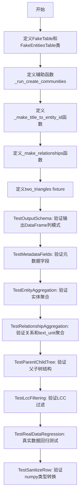

## 类结构

```
测试模块
├── FakeTable (继承CSVTable, 实现异步write)
├── FakeEntitiesTable (继承Table, 实现异步迭代)
├── _run_create_communities (辅助异步函数)
├── _make_title_to_entity_id (辅助函数)
├── _make_relationships (辅助函数)
├── two_triangles (pytest fixture)
└── 测试类集合
    ├── TestOutputSchema
    ├── TestMetadataFields
    ├── TestEntityAggregation
    ├── TestRelationshipAggregation
    ├── TestParentChildTree
    ├── TestLccFiltering
    ├── TestRealDataRegression
    └── TestSanitizeRow
```

## 全局变量及字段


### `uuid`
    
Python uuid module for generating UUIDs

类型：`module`
    


### `Any`
    
Type hint for any type

类型：`typing.Any`
    


### `np`
    
NumPy library for numerical operations

类型：`module`
    


### `pd`
    
Pandas library for data manipulation

类型：`module`
    


### `pytest`
    
Pytest testing framework

类型：`module`
    


### `COMMUNITIES_FINAL_COLUMNS`
    
Schema constant defining expected columns for communities output

类型：`list[str]`
    


### `create_communities`
    
Function to create communities from entities and relationships

类型：`Callable`
    


### `_sanitize_row`
    
Helper function to convert numpy types to native Python types

类型：`Callable`
    


### `CSVTable`
    
Base class for CSV table storage implementation

类型：`class`
    


### `Table`
    
Abstract base class for table storage

类型：`class`
    


### `title_to_entity_id`
    
Mapping from entity title to entity ID

类型：`dict[str, str]`
    


### `relationships`
    
DataFrame containing relationship data with source, target, weight, text_unit_ids

类型：`pd.DataFrame`
    


### `communities_table`
    
In-memory table for collecting community rows during testing

类型：`FakeTable`
    


### `entity_rows`
    
List of entity records with id and title fields

类型：`list[dict[str, Any]]`
    


### `entities_table`
    
In-memory read-only table for entity data in tests

类型：`FakeEntitiesTable`
    


### `result`
    
Output DataFrame from create_communities containing community data

类型：`pd.DataFrame`
    


### `two_triangles`
    
Test fixture providing two disconnected triangle graphs

类型：`tuple[dict[str, str], pd.DataFrame]`
    


### `entity_ids`
    
List of entity IDs belonging to a community (DataFrame column)

类型：`list[str]`
    


### `relationship_ids`
    
List of intra-community relationship IDs (DataFrame column)

类型：`list[str]`
    


### `text_unit_ids`
    
Deduplicated text unit IDs from community relationships (DataFrame column)

类型：`list[str]`
    


### `FakeTable.rows`
    
In-memory storage for rows written to the table during tests

类型：`list[dict[str, Any]]`
    


### `FakeEntitiesTable._rows`
    
Internal storage for entity rows in the fake table

类型：`list[dict[str, Any]]`
    


### `FakeEntitiesTable._index`
    
Current position index for async iteration over rows

类型：`int`
    
    

## 全局函数及方法


### `_run_create_communities`

该函数是一个测试辅助函数，用于使用模拟的表对象运行 `create_communities` 工作流函数，并将所有写入的行作为 pandas DataFrame 返回，以便进行测试断言。

参数：

- `title_to_entity_id`：`dict[str, str]`，标题到实体ID的映射字典，用于构建实体表
- `relationships`：`pd.DataFrame`，包含边的关系数据框，包含 id、source、target、weight、text_unit_ids 等列
- `**kwargs`：`Any`，传递给 `create_communities` 函数的可选关键字参数（如 max_cluster_size、use_lcc、seed 等）

返回值：`pd.DataFrame`，包含所有写入社区表的行数据

#### 流程图

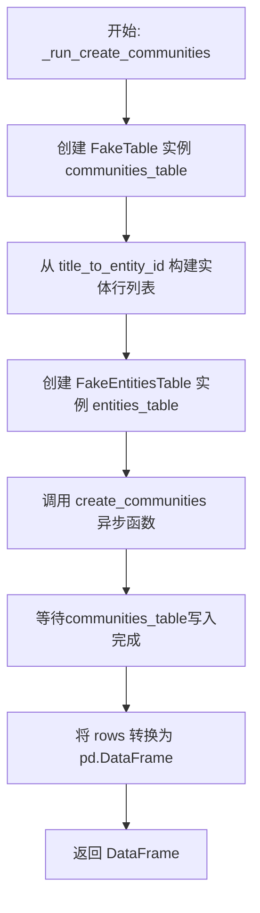

#### 带注释源码

```python
async def _run_create_communities(
    title_to_entity_id: dict[str, str],
    relationships: pd.DataFrame,
    **kwargs: Any,
) -> pd.DataFrame:
    """Helper that runs create_communities with fake tables and returns all rows as a DataFrame.
    
    这是一个测试辅助函数，用于在隔离环境中测试 create_communities 的功能。
    它创建内存中的模拟表（FakeTable 和 FakeEntitiesTable），然后调用真正的
    create_communities 函数，最后将结果转换为 DataFrame 供测试断言使用。
    
    Args:
        title_to_entity_id: 实体标题到ID的映射字典
        relationships: 包含关系边的 DataFrame
        **kwargs: 传递给 create_communities 的额外参数（如 max_cluster_size, use_lcc, seed）
    
    Returns:
        包含所有社区数据的 DataFrame
    """
    # 创建内存中的社区表，用于收集写入的行
    communities_table = FakeTable()
    
    # 从映射构建实体行列表，每个实体包含 id 和 title
    entity_rows = [
        {"id": eid, "title": title} for title, eid in title_to_entity_id.items()
    ]
    
    # 创建内存中的只读实体表，支持异步迭代
    entities_table = FakeEntitiesTable(entity_rows)
    
    # 调用真正的 create_communities 函数，执行社区发现逻辑
    await create_communities(communities_table, entities_table, relationships, **kwargs)
    
    # 将收集到的行数据转换为 pandas DataFrame 并返回
    return pd.DataFrame(communities_table.rows)
```


### `_make_title_to_entity_id`

从 (id, title) 元组列表构建 title 到 entity-id 的映射字典的辅助函数。

参数：

- `rows`：`list[tuple[str, str]]`，包含 (entity_id, title) 元组的列表

返回值：`dict[str, str]`从 title 到 entity_id 的映射字典

#### 流程图

```mermaid
flowchart TD
    A[开始: 输入 rows: list[tuple[str, str]]] --> B[遍历 rows 中的每个 (eid, title) 元组]
    B --> C[构建映射: title -> eid]
    C --> D{是否还有更多元组?}
    D -->|是| B
    D -->|否| E[返回 dict[str, str]]
```

#### 带注释源码

```python
def _make_title_to_entity_id(
    rows: list[tuple[str, str]],
) -> dict[str, str]:
    """Build a title-to-entity-id mapping from (id, title) pairs."""
    # 使用字典推导式从 (eid, title) 元组列表创建 title -> eid 的映射
    # 输入: [("e1", "A"), ("e2", "B")]
    # 输出: {"A": "e1", "B": "e2"}
    return {title: eid for eid, title in rows}
```


### `_make_relationships`

该函数是一个测试辅助函数，用于根据给定的元组列表构建一个包含关系数据的 Pandas DataFrame。每个元组包含关系 ID、源实体 ID、目标实体 ID、权重和文本单元 ID 列表，函数将其转换为标准格式的关系表，并添加从 0 开始递增的 `human_readable_id` 字段。

参数：

-  `rows`：`list[tuple[str, str, str, float, list[str]]]`，待转换的关系数据元组列表，每个元组包含 (id, source, target, weight, text_unit_ids)

返回值：`pd.DataFrame`，包含标准化关系数据的 DataFrame，具有 id、source、target、weight、text_unit_ids 和 human_readable_id 列

#### 流程图

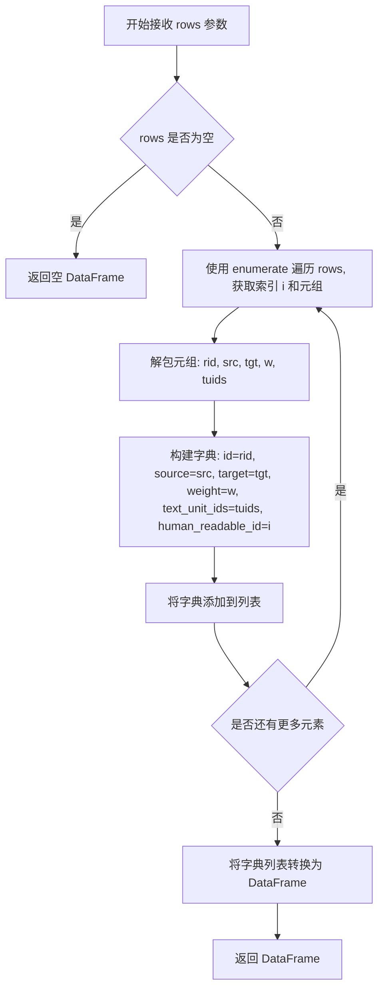

#### 带注释源码

```python
def _make_relationships(
    rows: list[tuple[str, str, str, float, list[str]]],
) -> pd.DataFrame:
    """Build a minimal relationships DataFrame.

    Each row is (id, source, target, weight, text_unit_ids).
    
    Args:
        rows: A list of tuples where each tuple contains:
            - rid: Relationship ID (str)
            - src: Source entity ID (str)
            - tgt: Target entity ID (str)
            - w: Weight value (float)
            - tuids: List of text unit IDs (list[str])
    
    Returns:
        pd.DataFrame: A DataFrame with columns:
            - id: Relationship ID
            - source: Source entity ID
            - target: Target entity ID
            - weight: Relationship weight
            - text_unit_ids: List of associated text unit IDs
            - human_readable_id: Auto-incremented integer index (0-based)
    """
    # 使用列表推导式遍历 rows，为每个元组创建字典并添加 human_readable_id
    return pd.DataFrame([
        {
            "id": rid,           # 关系ID
            "source": src,       # 源实体ID
            "target": tgt,       # 目标实体ID
            "weight": w,         # 权重值
            "text_unit_ids": tuids,  # 文本单元ID列表
            "human_readable_id": i,  # 从0开始递增的易读ID
        }
        for i, (rid, src, tgt, w, tuids) in enumerate(rows)  # enumerate提供索引
    ])
```


### `FakeTable.__init__`

该方法是 `FakeTable` 类的构造函数，用于初始化一个用于测试断言的内存表，创建一个空列表来存储写入的行。

参数：

- `self`：隐含参数，表示类的实例本身，无需显式传递

返回值：`None`，该方法仅进行对象状态初始化，不返回任何值

#### 流程图

```mermaid
flowchart TD
    A[开始 __init__] --> B[创建 self.rows 列表]
    B --> C[初始化为空列表 list[dict[str, Any]]]
    C --> D[结束]
```

#### 带注释源码

```python
def __init__(self) -> None:
    """Initialize the FakeTable with an empty row storage."""
    # 初始化一个列表用于存储写入的行
    # 类型注解表明这是一个字典列表，每个字典代表一行数据
    self.rows: list[dict[str, Any]] = []
```


### `FakeTable.write`

将一行数据追加到内存存储中，用于测试断言。

参数：

-  `row`：`dict[str, Any]`，要写入的记录，包含键值对形式的数据

返回值：`None`，无返回值（异步方法）

#### 流程图

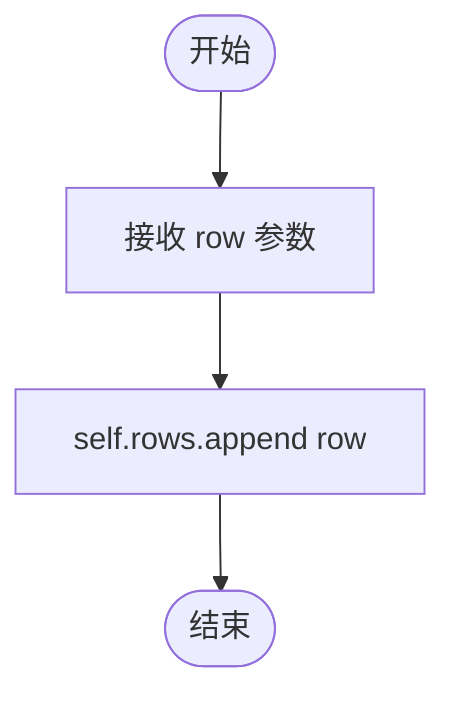

#### 带注释源码

```python
async def write(self, row: dict[str, Any]) -> None:
    """Append a row to the in-memory store."""
    self.rows.append(row)
```

**详细说明**：

- **方法类型**：异步实例方法
- **功能**：模拟表写入操作，将传入的行数据存储到内存列表中，供后续测试验证使用
- **继承关系**：继承自 `CSVTable` 类，覆盖了其 `write` 方法
- **线程安全性**：非线程安全，仅用于单线程测试环境


### `FakeEntitiesTable.__init__`

初始化一个内存中的只读表，用于存储实体数据并支持异步迭代操作。

参数：

- `rows`：`list[dict[str, Any]]`，要存储的行数据列表，每个字典代表一行实体数据

返回值：`None`，构造函数不返回任何值

#### 流程图

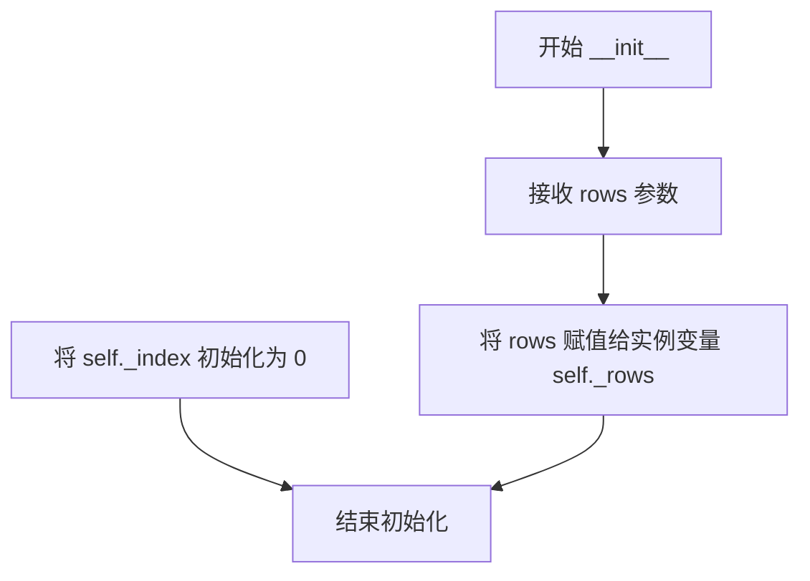

#### 带注释源码

```python
def __init__(self, rows: list[dict[str, Any]]) -> None:
    """初始化 FakeEntitiesTable 实例。

    Args:
        rows: 要存储的行数据列表，每个元素是一个字典，
              包含实体的键值对数据（如 id, title 等）

    Returns:
        None
    """
    self._rows = rows  # 存储传入的行数据
    self._index = 0    # 初始化异步迭代器的索引位置
```


### `FakeEntitiesTable.__aiter__`

实现异步迭代器协议的方法，返回对象本身作为异步迭代器，用于支持 `async for` 循环遍历表中的行。

参数： 无

返回值：`Self`，返回自身作为异步迭代器，以便通过 `__anext__` 方法逐行迭代数据。

#### 流程图

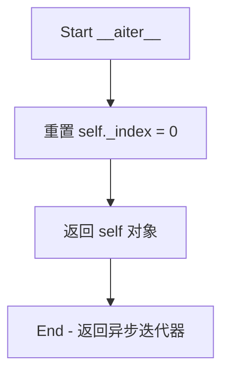

#### 带注释源码

```python
def __aiter__(self):
    """Return an async iterator over the rows."""
    # 每次开始新的迭代时，将索引重置为 0
    # 确保每次 async for 循环都从头开始遍历
    self._index = 0
    # 返回 self，使得该对象可以被用作异步迭代器
    # 配合 __anext__ 方法实现异步迭代协议
    return self
```


### `FakeEntitiesTable.__anext__`

返回表中的下一行作为异步迭代器的下一个元素，当没有更多行时抛出 StopAsyncIteration 异常以结束迭代。

参数：此方法无显式参数（隐式 self 不计）

返回值：`dict[str, Any]`，返回表中当前索引位置的行数据（字典形式），并递增内部索引以供下次调用。

#### 流程图

```mermaid
flowchart TD
    A[开始 __anext__] --> B{检查 _index >= len(_rows)?}
    B -->|是| C[raise StopAsyncIteration]
    B -->|否| D[获取 _rows[_index] 的副本]
    E[递增 _index += 1] --> F[返回 row]
    
    style C fill:#ffcccc
    style F fill:#ccffcc
```

#### 带注释源码

```python
async def __anext__(self) -> dict[str, Any]:
    """Yield the next row or stop."""
    # 检查是否还有未遍历的行
    if self._index >= len(self._rows):
        # 没有更多行，抛出 StopAsyncIteration 结束异步迭代
        raise StopAsyncIteration
    
    # 获取当前索引位置的行（返回副本以避免外部修改影响内部状态）
    row = self._rows[self._index]
    
    # 递增索引，为下一次迭代做准备
    self._index += 1
    
    # 返回当前行的字典数据
    return row
```


### `FakeEntitiesTable.length`

返回表中的行数，用于获取实体表的总行数。

参数：无需参数

返回值：`int`，返回表中的行数

#### 流程图

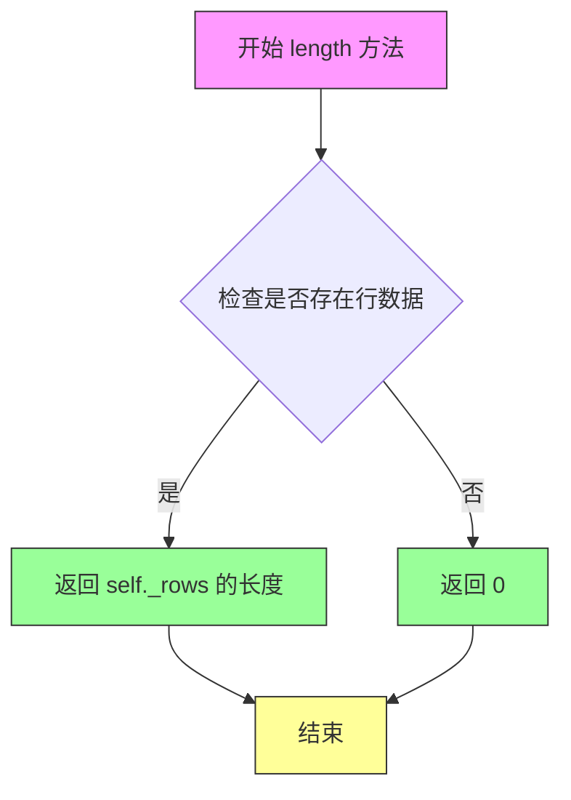

#### 带注释源码

```python
async def length(self) -> int:
    """Return number of rows."""
    return len(self._rows)
```

#### 详细说明

| 属性 | 详情 |
|------|------|
| 方法名称 | `FakeEntitiesTable.length` |
| 所属类 | `FakeEntitiesTable` |
| 方法类型 | 异步方法 (`async`) |
| 访问级别 | 公开 |
| 功能描述 | 返回当前表实例中所存储的行数 |
| 内部变量依赖 | `self._rows`: 存储所有行的列表 |
| 异常处理 | 无异常可能，该方法仅返回列表长度 |

#### 使用场景

该方法在测试环境中模拟 `Table` 接口的 `length` 方法，用于验证 `create_communities` 工作流在处理实体数据时的行为，特别是当需要预先获取实体总数以进行分批处理或进度跟踪时。


### `FakeEntitiesTable.has`

检查内存只读表中是否存在指定ID的行。

参数：

-  `row_id`：`str`，要检查的行ID

返回值：`bool`，如果存在与给定ID匹配的行则返回 `True`，否则返回 `False`

#### 流程图

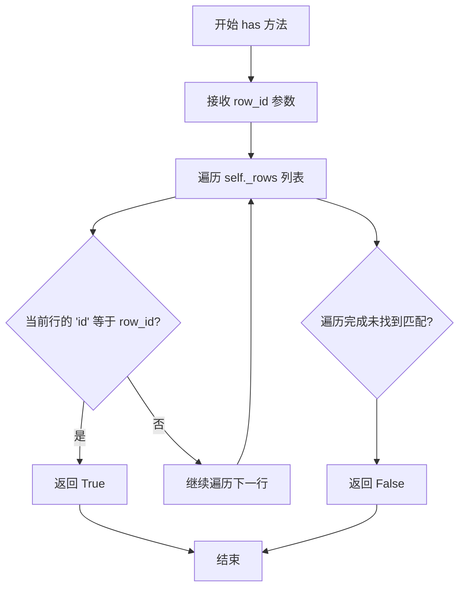

#### 带注释源码

```python
async def has(self, row_id: str) -> bool:
    """Check if a row with the given ID exists.
    
    异步方法，用于检查 FakeEntitiesTable 中是否存在指定 ID 的行。
    该方法实现了 Table 接口的 has 方法，用于支持实体表的存在性检查。
    
    参数:
        row_id: str - 要查找的行的唯一标识符
        
    返回:
        bool - 如果存在匹配的行返回 True，否则返回 False
    """
    # 使用 any() 函数配合生成器表达式遍历所有行
    # 检查每一行的 'id' 字段是否与传入的 row_id 相等
    # 这种实现方式会在找到第一个匹配项时立即返回 True，具有短路求值优势
    return any(r.get("id") == row_id for r in self._rows)
```


### `FakeEntitiesTable.write`

该方法用于向只读表中写入数据，但由于 FakeEntitiesTable 是内存中的只读表实现，不支持写入操作，因此该方法直接抛出 `NotImplementedError` 异常。

参数：

- `row`：`dict[str, Any]`，要写入表的行数据（字典形式）

返回值：`None`，无返回值

#### 流程图

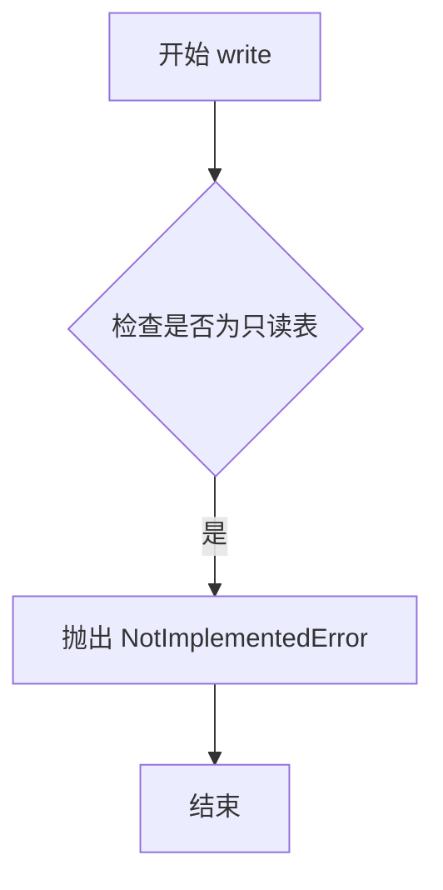

#### 带注释源码

```python
async def write(self, row: dict[str, Any]) -> None:
    """Not supported for read-only table."""
    raise NotImplementedError
```


### `FakeEntitiesTable.close`

该方法是一个异步关闭方法，用于关闭 FakeEntitiesTable 实例。由于 FakeEntitiesTable 是内存中的模拟表，不涉及实际资源，因此该方法为空操作（no-op）。

参数：
- 无参数

返回值：`None`，无返回值

#### 流程图

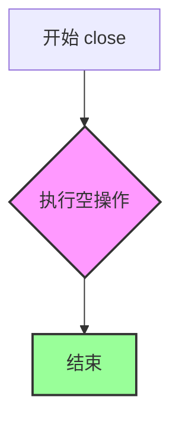

#### 带注释源码

```python
async def close(self) -> None:
    """No-op."""
    # FakeEntitiesTable 是一个内存中的只读表模拟类
    # 不持有任何需要释放的资源（如文件句柄、数据库连接等）
    # 因此 close 方法为空操作，不执行任何清理工作
    pass
```


### `TestOutputSchema.test_has_all_final_columns`

该测试方法验证 `create_communities` 函数生成的 DataFrame 的列模式是否与预期的 `COMMUNITIES_FINAL_COLUMNS` 完全匹配，确保输出数据的结构符合预定义的模式规范。

参数：

- `self`：`TestOutputSchema`，测试类实例本身
- `two_triangles`：`<fixture>`，pytest fixture，提供两个不相连的三角形图结构（节点 A,B,C 和 D,E,F），用于测试社区发现算法

返回值：`None`，该方法无返回值，通过 assert 语句进行断言验证

#### 流程图

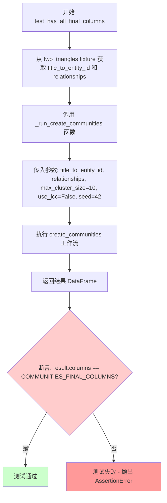

#### 带注释源码

```python
async def test_has_all_final_columns(self, two_triangles):
    """Output must have exactly the COMMUNITIES_FINAL_COLUMNS."""
    # 从 two_triangles fixture 解构出图关系数据
    # two_triangles 包含:
    # - title_to_entity_id: 实体标题到ID的映射字典
    # - relationships: 包含 A-B, A-C, B-C 和 D-E, D-F, E-F 边的 DataFrame
    title_to_entity_id, relationships = two_triangles
    
    # 调用辅助函数运行 create_communities 工作流
    # 参数说明:
    # - max_cluster_size=10: 最大聚类规模
    # - use_lcc=False: 不使用最大连通分量过滤
    # - seed=42: 随机种子确保可重复性
    result = await _run_create_communities(
        title_to_entity_id,
        relationships,
        max_cluster_size=10,
        use_lcc=False,
        seed=42,
    )
    
    # 核心断言: 验证输出 DataFrame 的列名列表
    # 是否与 COMMUNITIES_FINAL_COLUMNS 完全一致
    # 这确保了输出结构与预定义模式匹配
    assert list(result.columns) == COMMUNITIES_FINAL_COLUMNS
```


### `TestOutputSchema.test_column_order_matches_schema`

验证输出 DataFrame 的列顺序与预定义的模式常量 `COMMUNITIES_FINAL_COLUMNS` 完全匹配。

参数：

- `self`：`TestOutputSchema`，测试类的实例（隐式参数）
- `two_triangles`：`tuple[dict[str, str], pd.DataFrame]`，pytest fixture，提供两个不相连的三角形图结构用于测试，包含实体ID映射和关系数据框

返回值：`None`，该方法为异步测试函数，通过断言验证列顺序，不返回任何值

#### 流程图

```mermaid
flowchart TD
    A[开始] --> B[从 two_triangles fixture 获取 title_to_entity_id 和 relationships]
    B --> C[调用 _run_create_communities 创建社区]
    C --> D[遍历 COMMUNITIES_FINAL_COLUMNS 枚举索引]
    D --> E{还有更多列?}
    E -->|是| F[断言 result.columns[i] == col_name]
    F --> G[i 递增]
    G --> E
    E -->|否| H[测试通过]
```

#### 带注释源码

```python
async def test_column_order_matches_schema(self, two_triangles):
    """Column order must match the schema constant exactly."""
    # 从 fixture 解构出实体ID映射和关系数据
    title_to_entity_id, relationships = two_triangles
    
    # 调用辅助函数运行 create_communities 逻辑
    # 返回包含所有社区行的 DataFrame
    result = await _run_create_communities(
        title_to_entity_id,
        relationships,
        max_cluster_size=10,
        use_lcc=False,
        seed=42,
    )
    
    # 遍历预定义的列顺序常量
    for i, col_name in enumerate(COMMUNITIES_FINAL_COLUMNS):
        # 断言 DataFrame 的第 i 列与模式常量中的第 i 列完全匹配
        assert result.columns[i] == col_name
```


### `TestMetadataFields.test_uuid_ids`

验证社区 ID 是符合 UUID4 标准的有效 UUID。

参数：

- `self`：隐式参数，测试类实例
- `two_triangles`：一个 pytest fixture，提供两个不相连的三角形网络（{A,B,C} 和 {D,E,F}）作为测试数据，包含 `title_to_entity_id`（标题到实体 ID 的映射字典）和 `relationships`（关系 DataFrame）

返回值：`None`，通过 pytest 断言验证结果；如果所有断言通过则测试通过，否则抛出 `AssertionError`

#### 流程图

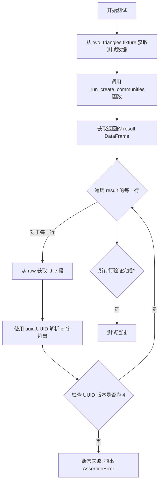

#### 带注释源码

```python
async def test_uuid_ids(self, two_triangles):
    """Each community id should be a valid UUID4."""
    # 从 fixture 获取测试数据：两个不相连的三角形网络
    title_to_entity_id, relationships = two_triangles
    
    # 调用辅助函数运行 create_communities 工作流
    # 参数: 最大簇大小=10, 不使用LCC过滤, 随机种子=42
    result = await _run_create_communities(
        title_to_entity_id,
        relationships,
        max_cluster_size=10,
        use_lcc=False,
        seed=42,
    )
    
    # 遍历结果 DataFrame 的每一行
    for _, row in result.iterrows():
        # 使用 uuid.UUID 解析 id 字段字符串
        parsed = uuid.UUID(row["id"])
        
        # 断言解析后的 UUID 版本为 4
        # 如果 id 不是有效的 UUID4，这里会抛出异常
        assert parsed.version == 4
```


### `TestMetadataFields.test_title_format`

验证社区标题格式是否符合预期，即标题应为"Community N"格式，其中N为社区ID（community字段的值）。

参数：

- `self`：`TestMetadataFields`，测试类实例（隐式参数）
- `two_triangles`：`pytest.fixture`，提供两个不相连的三角形社区（{A,B,C}和{D,E,F}）的测试数据，包含title_to_entity_id映射和relationships数据框

返回值：`None`，该方法为异步测试函数，通过断言验证数据，无显式返回值

#### 流程图

```mermaid
flowchart TD
    A[开始测试 test_title_format] --> B[获取测试数据 two_triangles]
    B --> C[解包: title_to_entity_id, relationships]
    D[调用 _run_create_communities<br/>参数: title_to_entity_id, relationships<br/>max_cluster_size=10, use_lcc=False, seed=42]
    C --> D
    D --> E[获取返回的 result DataFrame]
    E --> F[遍历 result 的每一行]
    F --> G{还有更多行?}
    G -->|是| H[获取当前行的 title 和 community]
    H --> I[断言: title == f'Community {community}']
    I --> J{断言通过?}
    J -->|是| F
    J -->|否| K[测试失败 - 抛出 AssertionError]
    G -->|否| L[测试通过]
    K --> M[结束 - 测试失败]
    L --> M
    
    style K fill:#ffcccc
    style L fill:#ccffcc
```

#### 带注释源码

```python
async def test_title_format(self, two_triangles):
    """Title should be 'Community N' where N is the community id."""
    # 从 pytest fixture 获取测试数据：两个不相连的三角形社区
    title_to_entity_id, relationships = two_triangles
    
    # 调用辅助函数运行 create_communities 工作流
    # 参数说明：
    # - title_to_entity_id: 实体标题到ID的映射字典
    # - relationships: 包含实体间关系的 pandas DataFrame
    # - max_cluster_size=10: 最大聚类大小
    # - use_lcc=False: 不使用最大连通分量过滤
    # - seed=42: 随机种子确保可重复性
    result = await _run_create_communities(
        title_to_entity_id,
        relationships,
        max_cluster_size=10,
        use_lcc=False,
        seed=42,
    )
    
    # 遍历结果 DataFrame 的每一行
    # 验证每行的 title 字段是否符合 "Community {community}" 格式
    for _, row in result.iterrows():
        # 断言：title 应该等于 "Community " 拼接上 community 字段的值
        # 例如：如果 community=0，则 title 应该是 "Community 0"
        assert row["title"] == f"Community {row['community']}"
```


### `TestMetadataFields.test_human_readable_id_equals_community`

该测试方法验证 `create_communities` 函数输出的 DataFrame 中，`human_readable_id` 列的值与 `community` 列的整数值完全相等，确保元数据字段的一致性。

参数：

- `self`：`TestMetadataFields`，测试类的实例，包含测试状态和配置
- `two_triangles`：`pytest.fixture`，类型为 `tuple[dict[str, str], pd.DataFrame]`，包含两个断开连接的三角形图结构（{A,B,C} 和 {D,E,F}）的实体ID映射和关系数据，其中 dict 是标题到实体ID的映射，pd.DataFrame 是关系数据

返回值：无（`None`），该方法为异步测试函数，通过 `assert` 断言验证数据正确性，若断言失败则抛出 `AssertionError`

#### 流程图

```mermaid
flowchart TD
    A[开始测试] --> B[从 two_triangles fixture 解包数据]
    B --> C{调用 _run_create_communities}
    C --> D[执行 create_communities 流程]
    D --> E[返回结果 DataFrame]
    E --> F[断言: result['human_readable_id'] == result['community'] 全部为真]
    F -->|是| G[测试通过]
    F -->|否| H[抛出 AssertionError]
```

#### 带注释源码

```python
async def test_human_readable_id_equals_community(self, two_triangles):
    """human_readable_id should equal the community integer id."""
    # 从 fixture 解包测试数据：实体ID映射和关系DataFrame
    title_to_entity_id, relationships = two_triangles
    # 调用辅助函数执行 create_communities 流程，返回结果DataFrame
    result = await _run_create_communities(
        title_to_entity_id,
        relationships,
        max_cluster_size=10,  # 最大聚类大小
        use_lcc=False,        # 不使用最大连通分量过滤
        seed=42,              # 随机种子确保可重复性
    )
    # 断言：human_readable_id 列的所有值必须等于 community 列的整数值
    assert (result["human_readable_id"] == result["community"]).all()
```


### `TestMetadataFields.test_size_equals_entity_count`

该测试函数验证社区的 `size` 字段是否等于其 `entity_ids` 列表的长度，确保数据聚合过程中实体数量统计的一致性。

参数：

- `self`：`TestMetadataFields`，测试类实例本身
- `two_triangles`：`pytest.fixture`，提供测试数据，返回值为 `tuple[dict[str, str], pd.DataFrame]`。其中 `title_to_entity_id` 是实体标题到ID的映射字典，`relationships` 是包含边关系的数据框

返回值：`None`（异步测试函数，执行断言验证）

#### 流程图

```mermaid
flowchart TD
    A[开始测试] --> B[从 two_triangles 获取测试数据]
    B --> C[解包: title_to_entity_id, relationships]
    C --> D[调用 _run_create_communities]
    D --> E[创建 FakeTable 和 FakeEntitiesTable]
    E --> F[执行 create_communities 核心逻辑]
    F --> G[返回包含 communities 的 DataFrame]
    G --> H[遍历 DataFrame 每行]
    H --> I{还有更多行?}
    I -->|是| J[获取当前行的 size 和 entity_ids]
    J --> K[断言: size == len(entity_ids)]
    K --> I
    I -->|否| L[测试通过]
```

#### 带注释源码

```python
async def test_size_equals_entity_count(self, two_triangles):
    """size should equal the length of entity_ids.
    
    该测试验证社区元数据中 size 字段的准确性。
    size 表示社区包含的实体数量，应与 entity_ids 列表长度一致。
    """
    # 从 fixture 获取测试数据：两个不相连的三角形社区
    title_to_entity_id, relationships = two_triangles
    
    # 执行 create_communities 工作流，返回结果 DataFrame
    result = await _run_create_communities(
        title_to_entity_id,
        relationships,
        max_cluster_size=10,  # 最大聚类大小
        use_lcc=False,        # 不使用最大连通分量过滤
        seed=42,              # 随机种子确保确定性
    )
    
    # 遍历结果中的每一行，验证 size 字段的正确性
    for _, row in result.iterrows():
        # 断言：社区的 size 字段应等于 entity_ids 列表的长度
        assert row["size"] == len(row["entity_ids"])
```


### `TestMetadataFields.test_period_is_iso_date`

验证社区输出的 `period` 字段是否为有效的 ISO 8601 日期字符串。

参数：

- `self`：`TestMetadataFields`，测试类实例
- `two_triangles`：`pytest.fixture`，提供两个不相连的三角形图测试数据（包含 title_to_entity_id 映射和 relationships DataFrame）

返回值：`None`（测试方法无返回值，通过断言验证数据有效性）

#### 流程图

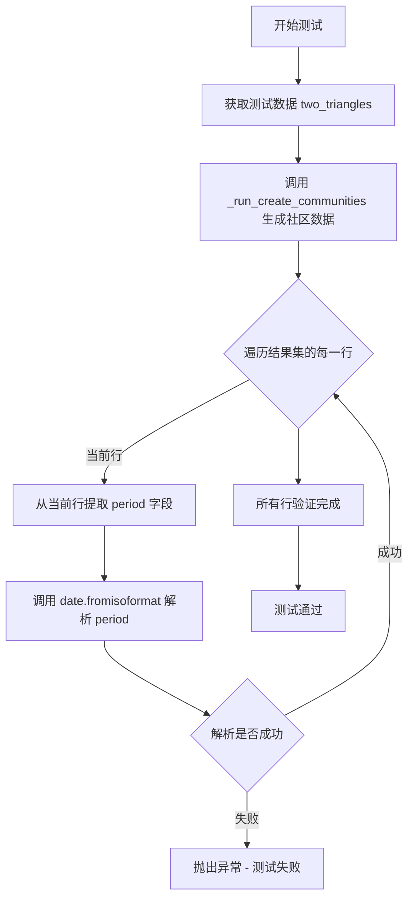

#### 带注释源码

```python
async def test_period_is_iso_date(self, two_triangles):
    """period should be a valid ISO date string."""
    # 解包测试夹具提供的图数据：实体ID映射和关系DataFrame
    title_to_entity_id, relationships = two_triangles
    
    # 调用辅助函数执行 create_communities 工作流，返回结果DataFrame
    result = await _run_create_communities(
        title_to_entity_id,
        relationships,
        max_cluster_size=10,
        use_lcc=False,
        seed=42,
    )
    
    # 导入 date 类用于ISO格式验证
    from datetime import date

    # 遍历结果集中的每一行，验证 period 字段格式
    for _, row in result.iterrows():
        # 尝试将 period 字符串解析为 date 对象
        # 若格式无效（如非ISO格式），fromisoformat 会抛出 ValueError
        date.fromisoformat(row["period"])
```


### `TestEntityAggregation.test_entity_ids_per_community`

验证每个社区包含的实体ID与其聚类节点完全匹配，确保社区划分正确。

参数：

- `self`：`TestEntityAggregation`，测试类实例本身
- `two_triangles`：`pytest.fixture`，提供两个不相连的三角形实体和关系数据（{A,B,C} 和 {D,E,F}）

返回值：`None`，该方法为异步测试函数，通过 assert 断言验证结果，若失败则抛出 AssertionError

#### 流程图

```mermaid
flowchart TD
    A[开始测试] --> B[从 two_triangles fixture 获取 title_to_entity_id 和 relationships]
    B --> C[调用 _run_create_communities 创建社区]
    C --> D[提取 community=0 的社区行]
    D --> E[提取 community=1 的社区行]
    E --> F{断言验证}
    F --> G[assert sorted comm_0 entity_ids == e1,e2,e3]
    G --> H[assert sorted comm_1 entity_ids == e4,e5,e6]
    H --> I[测试通过]
    
    style G fill:#90EE90
    style H fill:#90EE90
    style I fill:#90EE90
```

#### 带注释源码

```python
async def test_entity_ids_per_community(self, two_triangles):
    """Each community should contain exactly the entities matching
    its cluster nodes."""
    # 从 fixture 解构获取实体映射和关系数据
    title_to_entity_id, relationships = two_triangles
    
    # 调用辅助函数运行 create_communities 工作流
    # 参数: 最大聚类大小=10, 不使用最大连通分量, 随机种子=42
    result = await _run_create_communities(
        title_to_entity_id,
        relationships,
        max_cluster_size=10,
        use_lcc=False,
        seed=42,
    )
    
    # 获取社区ID为0的第一行（第一个三角形社区）
    comm_0 = result[result["community"] == 0].iloc[0]
    
    # 获取社区ID为1的第一行（第二个三角形社区）
    comm_1 = result[result["community"] == 1].iloc[0]

    # 断言：社区0应包含实体 e1, e2, e3（即A、B、C）
    assert sorted(comm_0["entity_ids"]) == ["e1", "e2", "e3"]
    
    # 断言：社区1应包含实体 e4, e5, e6（即D、E、F）
    assert sorted(comm_1["entity_ids"]) == ["e4", "e5", "e6"]
```


### `TestEntityAggregation.test_entity_ids_are_lists`

验证 `entity_ids` 字段返回的是 Python 原生 `list` 类型，而非 `numpy` 数组。该测试确保数据序列化时不会意外产生 numpy 类型。

参数：

-  `self`：无
-  `two_triangles`：pytest fixture，提供两个互不相连的三角形实体图（`title_to_entity_id` 和 `relationships`）

返回值：`None`（此为测试方法，断言失败则抛出异常）

#### 流程图

```mermaid
flowchart TD
    A[开始测试 test_entity_ids_are_lists] --> B[获取 two_triangles fixture 数据]
    B --> C[调用 _run_create_communities 创建社区]
    C --> D{遍历 result 中的每行}
    D -->|当前行| E{检查 entity_ids 类型}
    E -->|是 list| F[断言通过，继续下一行]
    E -->|非 list| G[断言失败，抛出 AssertionError]
    F --> D
    D --> H[所有行检查完成，测试通过]
    G --> H
```

#### 带注释源码

```python
async def test_entity_ids_are_lists(self, two_triangles):
    """entity_ids should be Python lists, not numpy arrays."""
    # 解包 fixture 提供的测试数据：实体映射和关系
    title_to_entity_id, relationships = two_triangles
    # 调用辅助函数运行 create_communities 逻辑，返回结果 DataFrame
    result = await _run_create_communities(
        title_to_entity_id,
        relationships,
        max_cluster_size=10,
        use_lcc=False,
        seed=42,
    )
    # 遍历结果中的每一行，验证 entity_ids 字段的类型
    for _, row in result.iterrows():
        # 断言 entity_ids 是 Python 原生 list，而非 numpy.ndarray
        assert isinstance(row["entity_ids"], list)
```


### `TestRelationshipAggregation.test_relationship_ids_per_community`

该测试方法验证每个社区（community）仅包含端点都在同一社区内的关系（relationship），即跨社区的关系应被排除。

参数：

- `self`：隐式参数，测试类实例
- `two_triangles`：`pytest.fixture`，返回二元组 `(title_to_entity_id: dict[str, str], relationships: pd.DataFrame)`，表示两个不相连的三角形图结构（{A,B,C} 和 {D,E,F}）

返回值：无（该方法为测试用例，仅执行断言无显式返回值）

#### 流程图

```mermaid
flowchart TD
    A[开始] --> B[接收 two_triangles fixture]
    B --> C[解包: title_to_entity_id, relationships]
    C --> D[调用 _run_create_communities 创建社区]
    D --> E[获取 community=0 的社区行]
    E --> F[获取 community=1 的社区行]
    F --> G{断言: comm_0.relationship_ids == ['r1','r2','r3']}
    G --> H{断言: comm_1.relationship_ids == ['r4','r5','r6']}
    H --> I[结束]
```

#### 带注释源码

```python
async def test_relationship_ids_per_community(self, two_triangles):
    """Each community should only include relationships where both
    endpoints are in the same community."""
    # 解包 fixture 提供的测试数据：实体ID映射和关系数据
    title_to_entity_id, relationships = two_triangles
    # 调用辅助函数执行 create_communities 逻辑，返回结果 DataFrame
    result = await _run_create_communities(
        title_to_entity_id,
        relationships,
        max_cluster_size=10,  # 最大聚类大小
        use_lcc=False,         # 不使用最大连通分量过滤
        seed=42,               # 随机种子确保确定性
    )
    # 提取 community 标识为 0 的社区行（对应三角形 {A,B,C}）
    comm_0 = result[result["community"] == 0].iloc[0]
    # 提取 community 标识为 1 的社区行（对应三角形 {D,E,F}）
    comm_1 = result[result["community"] == 1].iloc[0]

    # 断言：community 0 应包含其内部所有关系 r1,r2,r3
    assert sorted(comm_0["relationship_ids"]) == ["r1", "r2", "r3"]
    # 断言：community 1 应包含其内部所有关系 r4,r5,r6
    assert sorted(comm_1["relationship_ids"]) == ["r4", "r5", "r6"]
```


### `TestRelationshipAggregation.test_text_unit_ids_per_community`

该测试方法验证 `create_communities` 函数能够正确地将每个社区内（intra-community）关系所涉及的 text_unit_ids 进行聚合、去重和排序。测试使用两个互不连通的三角形（A,B,C 和 D,E,F）作为输入，确保跨社区的关系被正确排除。

参数：

- `self`：测试类实例本身（TestRelationshipAggregation）
- `two_triangles`：pytest fixture，提供两个互不连通的三角形图结构的测试数据（包含 title_to_entity_id 映射和 relationships DataFrame）

返回值：无返回值（通过 assert 断言进行验证）

#### 流程图

```mermaid
flowchart TD
    A[开始测试] --> B[从 two_triangles fixture 获取测试数据]
    B --> C[调用 _run_create_communities 运行 create_communities 函数]
    C --> D[从结果中提取 community=0 的行]
    D --> E[从结果中提取 community=1 的行]
    E --> F[断言 comm_0 的 text_unit_ids 排序后等于 ['t1', 't2']]
    F --> G[断言 comm_1 的 text_unit_ids 排序后等于 ['t3', 't4']]
    G --> H[测试通过]
```

#### 带注释源码

```python
async def test_text_unit_ids_per_community(self, two_triangles):
    """text_unit_ids should be the deduplicated union of text units
    from the community's intra-community relationships."""
    # 从 fixture 获取测试数据：两个互不连通的三角形
    # 三角形1: A-B, A-C, B-C (对应实体 e1, e2, e3)
    # 三角形2: D-E, D-F, E-F (对应实体 e4, e5, e6)
    title_to_entity_id, relationships = two_triangles
    
    # 调用辅助函数执行 create_communities 逻辑
    # 参数：max_cluster_size=10, use_lcc=False, seed=42
    result = await _run_create_communities(
        title_to_entity_id,
        relationships,
        max_cluster_size=10,
        use_lcc=False,
        seed=42,
    )
    
    # 提取社区0的数据（三角形1对应的社区）
    comm_0 = result[result["community"] == 0].iloc[0]
    
    # 提取社区1的数据（三角形2对应的社区）
    comm_1 = result[result["community"] == 1].iloc[0]

    # 验证社区0的text_unit_ids：来自关系 r1, r2, r3
    # r1: A-B, text_unit_ids=['t1']
    # r2: A-C, text_unit_ids=['t1', 't2']
    # r3: B-C, text_unit_ids=['t2']
    # 并集去重后: ['t1', 't2']
    assert sorted(comm_0["text_unit_ids"]) == ["t1", "t2"]
    
    # 验证社区1的text_unit_ids：来自关系 r4, r5, r6
    # r4: D-E, text_unit_ids=['t3']
    # r5: D-F, text_unit_ids=['t3', 't4']
    # r6: E-F, text_unit_ids=['t4']
    # 并集去重后: ['t3', 't4']
    assert sorted(comm_1["text_unit_ids"]) == ["t3", "t4"]
```


### `TestRelationshipAggregation.test_lists_are_sorted_and_deduplicated`

该测试方法验证社区数据中的 `relationship_ids` 和 `text_unit_ids` 列表是否已按字母顺序排序且不包含重复项。通过对比列表与排序后的去重集合是否相等来断言数据的正确性。

参数：

- `self`：`TestRelationshipAggregation`，测试类实例，隐式参数
- `two_triangles`：`pytest.fixture`，提供两个不相连的三角形图结构作为测试数据，包含实体映射和关系数据

返回值：`None`，该方法为异步测试函数，无返回值，通过断言验证数据正确性

#### 流程图

```mermaid
flowchart TD
    A[开始测试] --> B[获取测试数据 two_triangles]
    B --> C[解包: title_to_entity_id, relationships]
    C --> D[调用 _run_create_communities]
    D --> E[执行 create_communities 流程]
    E --> F[返回结果 DataFrame]
    F --> G[遍历结果每一行]
    G --> H{还有更多行?}
    H -->|是| I[获取当前行的 relationship_ids]
    I --> J[断言: relationship_ids == sorted(set relationship_ids)]
    J --> K[获取当前行的 text_unit_ids]
    K --> L[断言: text_unit_ids == sorted(set text_unit_ids)]
    L --> G
    H -->|否| M[测试通过]
    
    style J fill:#ffcccc
    style L fill:#ffcccc
```

#### 带注释源码

```python
async def test_lists_are_sorted_and_deduplicated(self, two_triangles):
    """relationship_ids and text_unit_ids should be sorted with
    no duplicates."""
    # 从 fixture 获取测试数据：两个不相连的三角形结构
    title_to_entity_id, relationships = two_triangles
    # 调用辅助函数执行 create_communities 流程
    # 参数: 最大簇大小=10, 不使用LCC过滤, 随机种子=42
    result = await _run_create_communities(
        title_to_entity_id,
        relationships,
        max_cluster_size=10,
        use_lcc=False,
        seed=42,
    )
    # 遍历结果中的每一行（每个社区）
    for _, row in result.iterrows():
        # 断言 relationship_ids 已排序且无重复
        # 比较原列表与 sorted(set()) 去重排序后的结果
        assert row["relationship_ids"] == sorted(set(row["relationship_ids"]))
        # 断言 text_unit_ids 已排序且无重复
        # 比较原列表与 sorted(set()) 去重排序后的结果
        assert row["text_unit_ids"] == sorted(set(row["text_unit_ids"]))
```


### `TestRelationshipAggregation.test_cross_community_relationships_excluded`

该测试方法验证了跨社区的关系（即连接不同社区中实体的关系）不会被包含在任何社区的 relationship_ids 中，确保社区只聚合其内部的关系。

参数：

- `self`：TestRelationshipAggregation 类实例，pytest 测试类的隐式参数

返回值：`None`，该方法为异步测试方法，使用 assert 语句进行断言验证

#### 流程图

```mermaid
flowchart TD
    A[开始测试] --> B[构建实体映射<br/>title_to_entity_id<br/>包含6个实体 A-F]
    B --> C[构建关系数据集<br/>relationships<br/>包括3个内部关系和1个跨社区关系]
    C --> D[调用 _run_create_communities<br/>执行 create_communities 函数<br/>max_cluster_size=10<br/>use_lcc=False<br/>seed=42]
    D --> E[遍历结果 DataFrame<br/>收集所有 relationship_ids]
    E --> F{断言检查}
    F --> G1[断言 r_cross 不在<br/>all_rel_ids 中]
    F --> G2[断言 t_cross 不在<br/>任何 text_unit_ids 中]
    G1 --> H[测试通过]
    G2 --> H
```

#### 带注释源码

```python
async def test_cross_community_relationships_excluded(self):
    """A relationship spanning two communities must not appear in
    either community's relationship_ids."""
    # 构建包含6个实体的 title 到 entity id 的映射
    # 实体 A, B, C 形成第一个社区
    # 实体 D, E, F 形成第二个社区
    title_to_entity_id = _make_title_to_entity_id([
        ("e1", "A"),
        ("e2", "B"),
        ("e3", "C"),
        ("e4", "D"),
        ("e5", "E"),
        ("e6", "F"),
    ])
    
    # 构建关系数据集，包含：
    # - r1, r2, r3: 社区0 (A,B,C) 内部关系
    # - r_cross: 跨社区关系 (C -> D，权重0.1较低)
    # - r4, r5, r6: 社区1 (D,E,F) 内部关系
    relationships = _make_relationships([
        ("r1", "A", "B", 1.0, ["t1"]),
        ("r2", "A", "C", 1.0, ["t1"]),
        ("r3", "B", "C", 1.0, ["t1"]),
        ("r_cross", "C", "D", 0.1, ["t_cross"]),
        ("r4", "D", "E", 1.0, ["t2"]),
        ("r5", "D", "F", 1.0, ["t2"]),
        ("r6", "E", "F", 1.0, ["t2"]),
    ])
    
    # 运行 create_communities 函数，生成社区结果
    # use_lcc=False: 不使用最大连通分量过滤
    # seed=42: 固定随机种子确保结果可复现
    result = await _run_create_communities(
        title_to_entity_id,
        relationships,
        max_cluster_size=10,
        use_lcc=False,
        seed=42,
    )
    
    # 收集所有社区中的 relationship_ids
    all_rel_ids = []
    for _, row in result.iterrows():
        all_rel_ids.extend(row["relationship_ids"])
    
    # 断言1: 跨社区关系 r_cross 不应出现在任何社区的 relationship_ids 中
    # 这是核心测试目标：确保跨社区关系被正确排除
    assert "r_cross" not in all_rel_ids
    
    # 断言2: 跨社区关系关联的 text_unit t_cross 也不应出现在任何社区中
    # 进一步验证关系相关联的资源也被正确过滤
    assert "t_cross" not in [
        tid for _, row in result.iterrows() for tid in row["text_unit_ids"]
    ]
```


### `TestParentChildTree.test_level_zero_parent_is_minus_one`

验证所有 level-0 的社区的 parent 字段都被正确设置为 -1，这是社区层级结构中的根节点标识。

参数：

- `self`：测试类实例
- `two_triangles`：pytest fixture，提供两个不相连的三角形图结构（包含 entity_id 到 title 的映射和关系数据）

返回值：`None`，该方法为异步测试函数，执行断言验证而非返回值

#### 流程图

```mermaid
flowchart TD
    A[开始测试] --> B[从 two_triangles fixture 获取 title_to_entity_id 和 relationships]
    B --> C[调用 _run_create_communities 创建社区数据]
    C --> D[筛选 level == 0 的社区行: lvl0 = result[result['level'] == 0]]
    D --> E[断言: 所有 lvl0 行的 parent 字段等于 -1]
    E --> F{断言结果}
    F -->|通过| G[测试通过]
    F -->|失败| H[抛出 AssertionError]
```

#### 带注释源码

```python
async def test_level_zero_parent_is_minus_one(self, two_triangles):
    """All level-0 communities should have parent == -1."""
    # 从 fixture 解构获取图数据：实体映射和关系数据
    title_to_entity_id, relationships = two_triangles
    # 执行社区创建流程，返回包含所有社区的 DataFrame
    result = await _run_create_communities(
        title_to_entity_id,
        relationships,
        max_cluster_size=10,
        use_lcc=False,
        seed=42,
    )
    # 筛选出所有层级为 0 的社区（根社区）
    lvl0 = result[result["level"] == 0]
    # 验证根社区的 parent 字段统一设置为 -1，表示无父节点
    assert (lvl0["parent"] == -1).all()
```


### `TestParentChildTree.test_leaf_communities_have_empty_children`

验证叶节点社区（没有子社区的社区）的 `children` 字段应为空列表，确保父子关系一致性。

参数：

- `self`：`TestParentChildTree`，测试类实例本身
- `two_triangles`：`pytest.fixture`，提供两个不相连的三角形社区数据（包含 `title_to_entity_id` 映射和 `relationships` 数据框）

返回值：`None`，该方法为异步测试函数，通过断言验证数据正确性，无显式返回值。

#### 流程图

```mermaid
flowchart TD
    A[开始测试] --> B[从 two_triangles fixture 获取 title_to_entity_id 和 relationships]
    B --> C[调用 _run_create_communities 生成社区结果 DataFrame]
    C --> D[遍历结果中的每一行]
    D --> E{children 是否为空列表?}
    E -->|是| F[查找 parent 等于当前 community 的行]
    F --> G{找到子社区?}
    E -->|否| H[继续下一行]
    G -->|否| I[断言通过: 该社区确实是叶节点]
    G -->|是| J[断言失败: 存在子社区但 children 为空]
    H --> D
    I --> K{是否还有更多行?}
    J --> L[测试失败]
    K -->|是| H
    K -->|否| M[测试通过]
```

#### 带注释源码

```python
async def test_leaf_communities_have_empty_children(self, two_triangles):
    """Communities that are nobody's parent should have children=[]."""
    # 从 fixture 提取测试数据：实体ID映射和关系数据
    title_to_entity_id, relationships = two_triangles
    
    # 执行社区创建流程，返回包含所有社区信息的 DataFrame
    result = await _run_create_communities(
        title_to_entity_id,
        relationships,
        max_cluster_size=10,
        use_lcc=False,
        seed=42,
    )
    
    # 遍历 DataFrame 的每一行
    for _, row in result.iterrows():
        # 获取当前社区的 children 字段
        children = row["children"]
        
        # 判断 children 是否为空列表
        if isinstance(children, list) and len(children) == 0:
            # 在结果中查找 parent 字段等于当前社区 ID 的记录
            child_rows = result[result["parent"] == row["community"]]
            
            # 断言：空列表意味着没有子社区，所以查找结果应为空
            assert len(child_rows) == 0
```


### TestParentChildTree.test_parent_child_bidirectional_consistency_real_data

该测试方法用于验证父子社区树的双向一致性。具体来说，它检查如果社区 X 将社区 Y 列为子社区（children），那么社区 Y 的父社区（parent）字段必须指向社区 X。这是确保社区层级关系数据完整性和一致性的关键测试。

参数：

- `self`：`TestParentChildTree`，隐式的测试类实例引用，代表当前测试类本身

返回值：`None`，无返回值（测试方法）

#### 流程图

```mermaid
flowchart TD
    A[开始: test_parent_child_bidirectional_consistency_real_data] --> B[读取实体数据<br/>pd.read_parquet tests/verbs/data/entities.parquet]
    B --> C[构建 title_to_entity_id 映射<br/>title → entity_id]
    C --> D[读取关系数据<br/>pd.read_parquet tests/verbs/data/relationships.parquet]
    D --> E[调用 _run_create_communities<br/>生成社区结果 DataFrame]
    E --> F[遍历 result 的每一行]
    F --> G{当前行有 children 且长度 > 0?}
    G -->|否| H[继续下一行]
    G -->|是| I[遍历每个 child_id]
    I --> J[在 result 中查找 child_id 对应的社区行]
    J --> K{找到且唯一?}
    K -->|否| L[断言失败: 子社区未找到或重复]
    K -->|是| M[断言: child_row.parent == row.community]
    M --> N[继续检查下一个 child]
    N --> O{还有更多 children?}
    O -->|是| I
    O -->|否| H
    H --> P{还有更多行?}
    P -->|是| F
    P -->|否| Q[结束: 所有断言通过]
```

#### 带注释源码

```python
async def test_parent_child_bidirectional_consistency_real_data(self):
    """For real test data: if community X lists Y as child,
    then Y's parent must be X."""
    # 从 Parquet 文件读取实体数据（真实测试数据）
    entities_df = pd.read_parquet("tests/verbs/data/entities.parquet")
    # 构建 title 到 entity_id 的映射字典
    title_to_entity_id = dict(
        zip(entities_df["title"], entities_df["id"], strict=False)
    )
    # 从 Parquet 文件读取关系数据
    relationships = pd.read_parquet("tests/verbs/data/relationships.parquet")
    # 运行 create_communities 函数，生成社区结果
    # 参数: max_cluster_size=10, use_lcc=True 使用最大连通分量, seed=0xDEADBEEF
    result = await _run_create_communities(
        title_to_entity_id,
        relationships,
        max_cluster_size=10,
        use_lcc=True,
        seed=0xDEADBEEF,
    )
    # 遍历结果 DataFrame 的每一行
    for _, row in result.iterrows():
        # 获取当前社区的 children 字段（子社区列表）
        children = row["children"]
        # 检查 children 是否有长度属性且长度大于 0
        if hasattr(children, "__len__") and len(children) > 0:
            # 遍历每个子社区的 ID
            for child_id in children:
                # 在结果中查找该子社区对应的行
                child_row = result[result["community"] == child_id]
                # 断言子社区存在且唯一（不能重复或不存在）
                assert len(child_row) == 1, (
                    f"Child {child_id} not found or duplicated"
                )
                # 核心断言：子社区的 parent 字段必须等于当前社区的 community ID
                # 这是双向一致性检查的关键
                assert child_row.iloc[0]["parent"] == row["community"]
```


### `TestLccFiltering.test_lcc_reduces_community_count`

该测试方法验证了在启用 LCC（最大连通分量）过滤功能时，对于包含两个不相连连通分量的图，只有较大连通分量的社区会被保留，从而导致生成的社区总数减少。

参数：

- `self`：测试类实例，无需显式传递

返回值：`None`，该方法为异步测试函数，通过 `assert` 语句验证逻辑，不返回任何值

#### 流程图

```mermaid
flowchart TD
    A[开始测试] --> B[构建实体映射 title_to_entity_id<br/>包含6个实体: A-F]
    B --> C[构建关系数据 relationships<br/>两个不相连三角形: ABC 和 DEF]
    C --> D[调用 _run_create_communities<br/>use_lcc=False, seed=42]
    D --> E[调用 _run_create_communities<br/>use_lcc=True, seed=42]
    E --> F{检查结果}
    F -->|断言1| G[len result_lcc < len result_no_lcc<br/>LCC过滤后社区数减少]
    F -->|断言2| H[len result_lcc == 1<br/>只保留最大连通分量的社区]
    G --> I[测试通过]
    H --> I
```

#### 带注释源码

```python
async def test_lcc_reduces_community_count(self):
    """With use_lcc=True and two disconnected components, only the
    larger component's communities should appear."""
    # 构建测试数据：6个实体（A-F）
    title_to_entity_id = _make_title_to_entity_id([
        ("e1", "A"),
        ("e2", "B"),
        ("e3", "C"),
        ("e4", "D"),
        ("e5", "E"),
        ("e6", "F"),
    ])
    # 构建关系数据：两个不相连的三角形
    # 三角形1: A-B-C (通过 r1, r2, r3 连接)
    # 三角形2: D-E-F (通过 r4, r5, r6 连接)
    relationships = _make_relationships([
        ("r1", "A", "B", 1.0, ["t1"]),
        ("r2", "A", "C", 1.0, ["t1"]),
        ("r3", "B", "C", 1.0, ["t1"]),
        ("r4", "D", "E", 1.0, ["t2"]),
        ("r5", "D", "F", 1.0, ["t2"]),
        ("r6", "E", "F", 1.0, ["t2"]),
    ])
    # 不使用LCC过滤运行，应生成2个社区（两个三角形各一个）
    result_no_lcc = await _run_create_communities(
        title_to_entity_id,
        relationships,
        max_cluster_size=10,
        use_lcc=False,
        seed=42,
    )
    # 使用LCC过滤运行，应只保留1个社区（较大的分量）
    result_lcc = await _run_create_communities(
        title_to_entity_id,
        relationships,
        max_cluster_size=10,
        use_lcc=True,
        seed=42,
    )
    # 验证LCC过滤确实减少了社区数量
    assert len(result_lcc) < len(result_no_lcc)
    # 验证只保留了1个社区（假设两个分量大小相同，取第一个）
    assert len(result_lcc) == 1
```


### `TestRealDataRegression.test_row_count`

验证在真实测试数据上生成的社区数量是否与预期值匹配，确保在重构过程中社区生成的总数保持一致。

参数：

- `self`：`TestRealDataRegression`，测试类实例本身，用于访问测试类的属性和方法
- `real_result`：`pd.DataFrame`，包含通过 `create_communities` 函数在真实测试数据上生成的社区结果数据

返回值：`None`，通过断言 `len(real_result) == 122` 验证生成的社区数量是否为预期的 122 个

#### 流程图

```mermaid
flowchart TD
    A[开始] --> B[接收 real_result DataFrame]
    B --> C[获取 DataFrame 行数: lenreal_result]
    C --> D{行数 == 122?}
    D -->|是| E[断言通过 - 测试成功]
    D -->|否| F[断言失败 - 抛出 AssertionError]
    E --> G[结束]
    F --> G
```

#### 带注释源码

```python
async def test_row_count(self, real_result: pd.DataFrame):
    """Pin the expected number of communities."""
    # 验证社区总数是否为预期的 122 个
    # 这个测试用例用于回归测试，确保在重构 create_communities 函数后
    # 生成的社区数量保持不变，从而捕获任何意外的行为变化
    assert len(real_result) == 122
```


### `TestRealDataRegression.test_level_distribution`

验证社区按层级分布的数量是否符合预期的回归测试方法。该测试使用真实测试数据 fixture，统计 DataFrame 中 level 列的分布情况，确保重构过程中社区层级分布保持不变。

参数：

- `self`：测试类的实例对象
- `real_result`：`pd.DataFrame`，通过 `real_result` fixture 异步获取的社区创建结果数据

返回值：`None`，无返回值（测试方法通过 assert 语句进行断言验证）

#### 流程图

```mermaid
flowchart TD
    A[Start test_level_distribution] --> B[Extract level column from real_result DataFrame]
    B --> C[Convert level column to list using .tolist]
    D[Import Counter from collections] --> E[Count occurrences of each level]
    C --> E
    E --> F[Assert counts equals {0: 23, 1: 65, 2: 32, 3: 2}]
    F --> G{Assertion Pass?}
    G -->|Yes| H[End - Test Passed]
    G -->|No| I[Raise AssertionError]
    I --> J[End - Test Failed]
```

#### 带注释源码

```python
async def test_level_distribution(self, real_result: pd.DataFrame):
    """Pin the expected number of communities per level."""
    # 导入 Counter 用于统计层级分布
    from collections import Counter

    # 从结果 DataFrame 中提取 level 列，转换为列表
    # 例如: [0, 0, 0, 1, 1, 2, ...]
    counts = Counter(real_result["level"].tolist())
    
    # 断言各层级的社区数量符合预期
    # Level 0: 23 个社区
    # Level 1: 65 个社区
    # Level 2: 32 个社区
    # Level 3: 2 个社区
    assert counts == {0: 23, 1: 65, 2: 32, 3: 2}
```


### `TestRealDataRegression.test_values_match_golden_file`

这是一个测试方法，用于验证 `create_communities` 函数的输出是否与预先存储的"golden"Parquet文件完全匹配，以确保在重构过程中行为不会发生变化。

参数：

- `real_result`：`pd.DataFrame`，通过 `real_result` fixture 生成的社区数据结果

返回值：`None`，该方法为测试方法，通过断言验证数据匹配性，不返回任何值

#### 流程图

```mermaid
flowchart TD
    A[开始] --> B[读取 golden Parquet 文件]
    B --> C{检查行数是否相等}
    C -->|是| D[定义跳过的列: id, period, children]
    C -->|否| E[断言失败: 行数不匹配]
    D --> F{遍历 COMMUNITIES_FINAL_COLUMNS}
    F --> G{当前列在跳过列中?}
    G -->|是| H[继续下一列]
    G -->|否| I[使用 pd.testing.assert_series_equal 比较列]
    I --> J{比较是否通过?}
    J -->|是| H
    J -->|否| K[断言失败: 列数据不匹配]
    H --> L{还有更多列?}
    L -->|是| F
    L -->|否| M[遍历每一行比较 children 列]
    M --> N{所有 children 都匹配?}
    N -->|是| O[测试通过]
    N -->|否| P[断言失败: children 不匹配]
```

#### 带注释源码

```python
async def test_values_match_golden_file(self, real_result: pd.DataFrame):
    """The output should match the golden Parquet file for all
    columns except id (UUID) and period (date-dependent)."""
    # 读取预先存储的 golden Parquet 文件作为期望值
    expected = pd.read_parquet("tests/verbs/data/communities.parquet")

    # 首先验证行数是否相等
    assert len(real_result) == len(expected)

    # 定义需要跳过的列：
    # - id: UUID 每次运行可能不同
    # - period: 日期相关，可能随时间变化
    # - children: 需要特殊处理（numpy数组 vs 列表）
    skip_columns = {"id", "period", "children"}
    
    # 遍历所有最终的社区列
    for col in COMMUNTIIES_FINAL_COLUMNS:
        # 跳过特殊处理的列
        if col in skip_columns:
            continue
        # 使用 pandas 测试工具比较列数据
        # check_dtype=False: 忽略数据类型差异（如 numpy vs Python 类型）
        # check_index=False: 忽略索引差异
        # check_names=False: 忽略列名检查
        pd.testing.assert_series_equal(
            real_result[col],
            expected[col],
            check_dtype=False,
            check_index=False,
            check_names=False,
            obj=f"Column '{col}'",
        )

    # children 列需要特殊处理：
    # golden 文件可能存储 numpy 数组，函数可能返回列表或数组
    for i in range(len(real_result)):
        # 将 actual 和 expected 都转换为列表进行对比
        actual_children = list(real_result.iloc[i]["children"])
        expected_children = list(expected.iloc[i]["children"])
        assert actual_children == expected_children, (
            f"Row {i} children mismatch: {actual_children} != {expected_children}"
        )
```


### `TestRealDataRegression.test_communities_with_children`

验证在真实测试数据上，具有子节点的社区数量是否符合预期（24个）。

参数：

- `self`：无参数，类方法隐式参数
- `real_result`：`pd.DataFrame`，通过 `real_result` fixture 获取的 `create_communities` 函数执行结果，包含所有社区数据

返回值：`None`，该方法为测试方法，无返回值，通过 `assert` 语句进行断言验证

#### 流程图

```mermaid
flowchart TD
    A[开始测试] --> B[接收 real_result DataFrame]
    B --> C[检查 children 列]
    C --> D{children 是否有长度且长度 > 0}
    D -->|是| E[标记为 has_children]
    D -->|否| F[标记为无子节点]
    E --> G[统计 has_children 总和]
    F --> G
    G --> H{总和是否等于 24}
    H -->|是| I[测试通过]
    H -->|否| J[测试失败]
    I --> K[结束]
    J --> K
```

#### 带注释源码

```python
async def test_communities_with_children(self, real_result: pd.DataFrame):
    """Pin the expected number of communities that have children."""
    # 使用 apply 方法遍历 children 列
    # lambda 检查每个 children 值是否有 __len__ 属性且长度大于 0
    has_children = real_result["children"].apply(
        lambda x: hasattr(x, "__len__") and len(x) > 0
    )
    # 断言具有子节点的社区总数为 24
    # 这个测试用例用于在重构过程中确保社区树结构不被破坏
    assert has_children.sum() == 24
```


### `TestSanitizeRow.test_ndarray_to_list`

验证 numpy 数组（np.ndarray）类型的值被正确转换为 Python 原生列表类型，确保数据序列化时能正确处理 numpy 数组。

参数：

-  `self`：`TestSanitizeRow`，测试类实例本身，无需显式描述

返回值：`None`，该方法为测试函数，通过断言验证转换结果，不返回具体值

#### 流程图

```mermaid
flowchart TD
    A[开始测试] --> B[创建测试数据 row: children = np.array1<br/>2<br/>3]
    B --> C[调用 _sanitize_row 函数转换 row]
    C --> D{断言: result['children'] == [1, 2, 3]}
    D -->|通过| E{断言: isinstanceresult['children']<br/>list}
    D -->|失败| F[测试失败]
    E -->|通过| G[测试通过]
    E -->|失败| F
```

#### 带注释源码

```python
def test_ndarray_to_list(self):
    """np.ndarray values should become plain lists."""
    # 创建一个包含 numpy 数组的测试行数据
    # numpy 数组在数据处理流程中需要被转换为 Python 原生列表
    row = {"children": np.array([1, 2, 3])}
    
    # 调用被测试的 _sanitize_row 函数进行类型转换
    # 该函数应将 numpy 数组转换为 Python 列表
    result = _sanitize_row(row)
    
    # 断言转换后的值与预期列表相等
    assert result["children"] == [1, 2, 3]
    
    # 断言转换后的类型是 Python 原生 list 类型
    # 这是为了确保后续序列化（如 JSON）能正常处理
    assert isinstance(result["children"], list)
```

---

**补充说明**：该测试方法验证了 `_sanitize_row` 函数的核心功能之一——将 numpy 数组类型转换为 Python 原生列表。这对于确保数据在不同组件间传递时的兼容性至关重要，尤其是在涉及 JSON 序列化或跨语言数据交换的场景中。


### TestSanitizeRow.test_empty_ndarray_to_empty_list

验证当行数据中的numpy数组为空时，_sanitize_row函数能将其正确转换为Python空列表。

参数：
- `self`：`TestSanitizeRow`，测试类实例本身

返回值：`None`，测试方法不返回任何值，通过断言验证转换结果

#### 流程图

```mermaid
graph TD
    A[开始] --> B[创建包含空numpy数组的row字典]
    B --> C[调用_sanitize_row函数处理row]
    C --> D[获取处理后的children字段]
    D --> E{children是否为空列表?}
    E -->|是| F[断言通过，测试结束]
    E -->|否| G[断言失败，抛出异常]
```

#### 带注释源码

```python
def test_empty_ndarray_to_empty_list(self):
    """An empty np.ndarray should become an empty list."""
    # 构建测试数据：包含空numpy数组的字典
    row = {"children": np.array([])}
    # 验证_sanitize_row函数将空numpy数组转换为Python空列表
    assert _sanitize_row(row)["children"] == []
```


### `TestSanitizeRow.test_np_integer_to_int`

该测试方法验证了 `_sanitize_row` 函数能够将 NumPy 整数类型（`np.integer`）正确转换为原生 Python `int` 类型，确保输出数据中的整数值为标准 Python 整数类型而非 NumPy 类型。

参数：

-  `self`：`TestSanitizeRow`，测试类实例本身，用于访问类的属性和方法

返回值：`None`，测试方法通过断言验证结果，不返回具体数值

#### 流程图

```mermaid
graph TD
    A[开始测试 test_np_integer_to_int] --> B[创建测试数据: row = {&#34;community&#34;: np.int64(42)}]
    B --> C[调用 _sanitize_row 函数处理 row]
    C --> D{断言: result[&#34;community&#34;] == 42}
    D -->|通过| E{断言: type(result[&#34;community&#34;]) is int}
    D -->|失败| F[测试失败 - 值不匹配]
    E -->|通过| G[测试通过]
    E -->|失败| H[测试失败 - 类型不正确]
    
    style G fill:#90EE90
    style F fill:#FFB6C1
    style H fill:#FFB6C1
```

#### 带注释源码

```python
def test_np_integer_to_int(self):
    """np.integer values should become native int."""
    # 步骤1: 创建包含 np.int64 类型值的测试字典
    # np.int64 是 NumPy 的整数类型，需要被转换为原生 Python int
    row = {"community": np.int64(42)}
    
    # 步骤2: 调用 _sanitize_row 函数进行类型转换
    # 该函数应将 NumPy 类型转换为 Python 原生类型
    result = _sanitize_row(row)
    
    # 步骤3: 断言验证转换后的值正确
    # 验证数值从 42 保持不变
    assert result["community"] == 42
    
    # 步骤4: 断言验证转换后的类型正确
    # 关键断言：确认类型从 np.int64 变为 Python 原生 int
    assert type(result["community"]) is int
```


### `TestSanitizeRow.test_np_floating_to_float`

测试方法，用于验证 `_sanitize_row` 函数能够将 numpy 浮点数类型（`np.floating`）正确转换为 Python 原生 `float` 类型。

参数：
- `self`：`TestSanitizeRow`，测试类实例，隐式参数（测试方法的标准参数）

返回值：`None`，测试方法不返回任何值，仅通过断言验证

#### 流程图

```mermaid
flowchart TD
    Start([开始]) --> CreateInput[创建输入数据: row = {'weight': np.float64(3.14)}]
    CreateInput --> CallSanitize[调用 _sanitize_row 函数]
    CallSanitize --> AssertValue{断言: result['weight'] ≈ 3.14}
    AssertValue -->|通过| AssertType{断言: type(result['weight']) is float}
    AssertType -->|通过| End([结束])
    AssertValue -->|失败| Fail[测试失败]
    AssertType -->|失败| Fail
```

#### 带注释源码

```python
def test_np_floating_to_float(self):
    """np.floating values should become native float."""
    # 步骤1: 创建测试输入数据，包含 numpy 浮点数类型 np.float64
    row = {"weight": np.float64(3.14)}
    
    # 步骤2: 调用被测试的 _sanitize_row 函数，传入包含 numpy 类型的字典
    result = _sanitize_row(row)
    
    # 步骤3: 断言转换后的值近似等于原始值（使用 pytest.approx 处理浮点数比较）
    assert result["weight"] == pytest.approx(3.14)
    
    # 步骤4: 断言转换后的类型是 Python 原生 float 类型（不是 numpy 浮点数类型）
    assert type(result["weight"]) is float
```


### `TestSanitizeRow.test_native_types_pass_through`

验证原生 Python 类型（字符串、整数、列表等）在行数据清洗过程中保持不变。

参数：

- `self`：`TestSanitizeRow`，测试类的实例本身，无需额外描述

返回值：`None`，该方法为测试方法，通过断言验证行为，无显式返回值

#### 流程图

```mermaid
flowchart TD
    A[开始: 测试方法] --> B[构建测试行数据: row = {'id': 'abc', 'size': 5, 'tags': ['a', 'b']}]
    B --> C[调用 _sanitize_row 函数]
    C --> D{验证结果是否与原行数据相等}
    D -->|是| E[断言通过 - 测试成功]
    D -->|否| F[断言失败 - 抛出 AssertionError]
    E --> G[结束]
    F --> G
```

#### 带注释源码

```python
def test_native_types_pass_through(self):
    """Native Python types should pass through unchanged.
    
    该测试方法验证 _sanitize_row 函数对原生 Python 类型
    （如 str, int, list）的处理行为：这些类型应该直接通过，
    不进行任何转换。
    """
    # 构建包含原生 Python 类型的测试行数据
    # - id: str 类型
    # - size: int 类型  
    # - tags: list 类型
    row = {"id": "abc", "size": 5, "tags": ["a", "b"]}
    
    # 调用 _sanitize_row 函数处理该行数据
    # 预期结果：返回的字典与输入字典完全相等
    # 即原生 Python 类型应保持不变
    assert _sanitize_row(row) == row
```


### `TestSanitizeRow.test_mixed_row`

该测试方法用于验证 `_sanitize_row` 函数能够正确处理包含混合 numpy 类型和原生 Python 类型的行数据，将 numpy 类型转换为原生 Python 类型。

参数：
- 该方法没有显式参数

返回值：`None`，该方法为测试方法，无返回值，主要执行断言验证 `_sanitize_row` 函数的转换结果

#### 流程图

```mermaid
flowchart TD
    A[开始测试] --> B[创建混合类型行数据: community=np.int64 7, children=np.array [1,2], title='Community 7', weight=np.float64 0.5]
    B --> C[调用 _sanitize_row 函数转换行数据]
    C --> D{验证转换结果}
    D --> |community| E[断言 community == 7 且类型为 int]
    D --> |children| F[断言 children == [1, 2] 且类型为 list]
    D --> |title| G[断言 title == 'Community 7']
    D --> |weight| H[断言 weight ≈ 0.5 且类型为 float]
    E --> I[所有断言通过则测试通过]
    F --> I
    G --> I
    H --> I
    I --> J[结束测试]
```

#### 带注释源码

```python
def test_mixed_row(self):
    """A row with a mix of numpy and native types."""
    # 构造包含混合类型的测试数据：numpy标量、numpy数组和原生Python类型
    row = {
        "community": np.int64(7),       # numpy 64位整数
        "children": np.array([1, 2]),    # numpy 数组
        "title": "Community 7",          # 原生字符串
        "weight": np.float64(0.5),       # numpy 64位浮点数
    }
    # 调用被测试的 _sanitize_row 函数进行类型转换
    result = _sanitize_row(row)
    # 验证转换后的值是否符合预期
    assert result == {
        "community": 7,                  # numpy int64 → Python int
        "children": [1, 2],              # np.array → Python list
        "title": "Community 7",          # 保持不变
        "weight": pytest.approx(0.5),    # numpy float64 → Python float
    }
    # 验证各字段的类型是否正确转换
    assert type(result["community"]) is int          # 确认转换为int类型
    assert type(result["children"]) is list          # 确认转换为list类型
    assert type(result["weight"]) is float           # 确认转换为float类型
```

## 关键组件


### FakeTable

内存表实现，用于在测试中收集写入的行，以便进行断言验证。继承自CSVTable并重写了write方法，将行追加到内部列表中。

### FakeEntitiesTable

内存只读表实现，支持异步迭代。继承自Table，通过异步迭代器协议提供对实体行的访问，包含length、has、write和close方法。

### _run_create_communities

异步辅助函数，使用假表运行create_communities并返回所有行组成的DataFrame。接收title_to_entity_id映射、relationships DataFrame和额外参数，构建FakeTable和FakeEntitiesTable后调用create_communities。

### _make_title_to_entity_id

从(id, title)元组列表构建标题到实体ID映射的字典。接收列表返回字典，用于测试数据准备。

### _make_relationships

构建最小化关系DataFrame的辅助函数。每个行包含id、source、target、weight、text_unit_ids和human_readable_id字段。

### TestOutputSchema

验证输出DataFrame具有预期列模式的测试类，包含对COMMUNITIES_FINAL_COLUMNS完全匹配和列顺序的测试。

### TestMetadataFields

验证计算元数据字段的测试类，包括UUID格式、标题格式、human_readable_id与community相等性、size与entity_ids长度匹配、period为ISO日期格式。

### TestEntityAggregation

验证每个社区正确聚合对应集群节点的实体ID，测试entity_ids为Python列表而非numpy数组。

### TestRelationshipAggregation

验证关系ID和text_unit_id正确聚合（仅限社区内）并去重，测试跨社区关系被排除。

### TestParentChildTree

验证父子树结构一致性，包括0级社区的parent为-1、叶社区的children为空、父子双向一致性。

### TestLccFiltering

验证LCC（最大连通分量）过滤与create_communities的交互，测试use_lcc=True时仅保留较大分量。

### TestRealDataRegression

使用真实测试fixture数据的回归测试，验证行数、层级分布、值与golden文件匹配、有子节点的社区数量。

### TestSanitizeRow

验证numpy类型转换为原生Python类型的测试类，测试ndarray转list、np.integer转int、np.floating转float、以及混合类型行。

### _sanitize_row

行清洗函数，将numpy类型（ndarray、np.integer、np.floating）转换为原生Python类型，使输出与JSON/Parquet兼容。

## 问题及建议


### 已知问题

-   **`FakeEntitiesTable.__aiter__` 实现缺陷**：返回 `self` 而不是新创建的迭代器实例，这可能导致迭代状态在多次遍历时被污染
-   **硬编码的文件路径**：测试直接使用 `"tests/verbs/data/entities.parquet"` 等硬编码路径，缺乏灵活性，当项目结构变化时会破坏测试
-   **过度使用 `iterrows()`**：多处使用 `for _, row in result.iterrows()` 进行遍历，这是 pandas 中性能较低的操作方式
-   **`test_period_is_iso_date` 缺少验证**：使用 `date.fromisoformat()` 但没有 assert 其结果，测试不会失败
-   **`test_leaf_communities_have_empty_children` 逻辑复杂**：先检查 children 是否为空，再查询数据库验证，逻辑冗余且容易出错
-   **测试隔离性不足**：`TestRealDataRegression` 中的 `real_result` fixture 读取外部文件，文件不存在或损坏时所有相关测试会同时失败
-   **类型转换测试覆盖不全**：`_sanitize_row` 测试未覆盖 `np.bool_`、`np.datetime64` 等其他常见 numpy 类型
-   **缺少异步资源清理**：测试中创建了 `FakeTable` 和 `FakeEntitiesTable`，但没有显式的 async 上下文管理器支持

### 优化建议

-   修复 `FakeEntitiesTable.__aiter__` 使其返回新迭代器实例，或实现 `__iter__` 方法支持同步迭代
-   将硬编码路径改为通过 `pytest fixtures` 或环境变量注入，提高测试可移植性
-   优先使用向量化操作替代 `iterrows()`，或使用 `itertuples()` 提升性能
-   为 `test_period_is_iso_date` 添加断言：`assert date.fromisoformat(row["period"]) is not None`
-   简化 `test_leaf_communities_have_empty_children` 的逻辑，直接通过 DataFrame 操作验证父子关系一致性
-   为外部文件依赖添加 `pytest.mark.skipif` 或明确的错误提示，确保测试失败信息清晰
-   扩展 `_sanitize_row` 测试覆盖 `np.bool_`、`np.datetime64`、`np.object_` 等类型
-   实现 `FakeTable` 和 `FakeEntitiesTable` 的 `__aenter__` 和 `__aexit__` 方法，支持异步上下文管理器语法

## 其它


### 设计目标与约束

本测试套件的设计目标是确保 `create_communities` 函数在各种场景下的正确性和稳定性，包括：验证输出模式符合预定义的列规范、确保元数据字段计算正确、验证实体和关系的正确聚合、确保父子树结构的一致性、测试LCC（最大连通分量）过滤功能、以及通过真实数据回归测试确保行为一致性。约束条件包括：测试必须在隔离环境中运行，使用模拟的表实现而非真实存储，确保测试的可重复性，并遵循pytest异步测试规范。

### 错误处理与异常设计

测试代码通过 `FakeEntitiesTable` 类模拟只读表的错误场景，例如在 `write` 方法中抛出 `NotImplementedError` 以确保只读表不支持写入操作。测试还验证了跨社区关系被正确排除的情况，确保函数在处理边界条件时的健壮性。对于真实数据回归测试，代码捕获可能的异常情况并提供清晰的错误信息，如"Child {child_id} not found or duplicated"。

### 数据流与状态机

数据流从输入的实体映射和关系DataFrame开始，经过社区发现算法（可能使用LCC过滤），生成层次化的社区结构。状态机涉及：输入验证阶段（检查实体和关系数据）、社区聚类阶段（根据max_cluster_size参数进行层次聚类）、聚合阶段（汇总每个社区的实体ID、关系ID、文本单元ID）、父子关系构建阶段（建立社区树结构）、最后是输出格式化阶段（确保所有numpy类型转换为原生Python类型）。测试通过 `two_triangles` fixture提供了两个不相连的三角形社区作为基本测试状态。

### 外部依赖与接口契约

主要依赖包括：`uuid` 模块用于生成UUID4格式的社区ID；`numpy` 和 `pandas` 用于数值处理和数据框操作；`pytest` 用于测试框架；`graphrag.data_model.schemas` 中的 `COMMUNITIES_FINAL_COLUMNS` 定义了输出列规范；`graphrag.index.workflows.create_communities` 中的 `create_communities` 和 `_sanitize_row` 是被测函数；`graphrag_storage.tables.csv_table` 和 `graphrag_storage.tables.table` 提供了表接口抽象。接口契约要求 `create_communities` 接收communities_table（写入表）、entities_table（可迭代只读表）、relationships（DataFrame）以及可选参数max_cluster_size、use_lcc、seed，并返回填充好的communities_table。

### 性能要求与基准

测试代码通过 `TestRealDataRegression` 类使用真实测试数据（entities.parquet和relationships.parquet）建立了性能基准，包括预期社区数量（122个）、层级分布（0级23个、1级65个、2级32个、3级2个）、有子节点的社区数量（24个）。这些基准用于在重构（如向量化、流式读写）时检测性能回归。

### 配置参数说明

`create_communities` 函数接受以下参数：communities_table（必须，实现write和close方法）、entities_table（必须，支持async迭代和length/has方法）、relationships（必须，包含id/source/target/weight/text_unit_ids/human_readable_id列的DataFrame）、max_cluster_size（可选，默认为10，控制聚类大小）、use_lcc（可选，控制是否仅使用最大连通分量）、seed（可选，用于随机数生成确保可重复性）。

### 测试覆盖率与边界条件

测试覆盖了以下边界条件：空社区情况（通过 `test_leaf_communities_have_empty_children` 验证）、跨社区关系排除（`test_cross_community_relationships_excluded`）、LCC过滤效果对比（`test_lcc_reduces_community_count`）、numpy类型转换（`TestSanitizeRow` 测试类）、UUID版本验证（确保为UUID4）。测试还通过 `_sanitize_row` 函数确保输出数据类型的一致性，将numpy数组转换为列表、numpy整数转换为int、numpy浮点数转换为float。
    