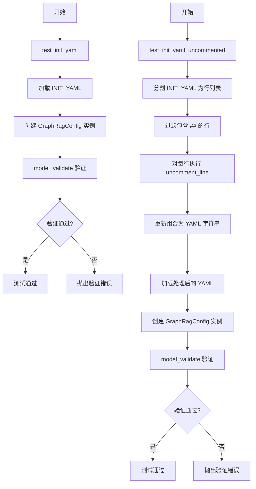
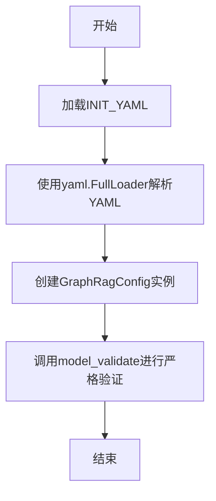
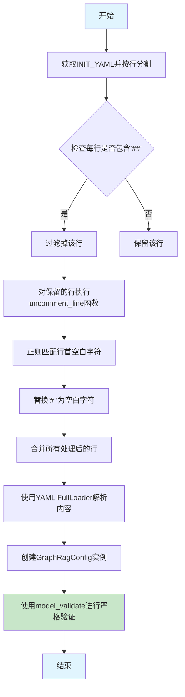

# `graphrag\tests\unit\indexing\test_init_content.py` 详细设计文档

这是一个测试文件，用于验证 GraphRagConfig 配置类的初始化和 YAML 配置验证功能，包括对注释和非注释配置的处理

## 整体流程



## 类结构

```
测试模块 (无类定义)
└── 函数级别的测试脚本
```

## 全局变量及字段


### `INIT_YAML`
    
从 graphrag.config.init_content 模块导入的全局常量，包含 GraphRagConfig 的默认 YAML 配置模板字符串

类型：`str`
    


    

## 全局函数及方法


### `test_init_yaml`

这是一个测试函数，用于验证带注释的默认 YAML 配置是否能正确初始化为 `GraphRagConfig` 对象，并通过严格模式下的模型验证。

参数：
- （无参数）

返回值：`None`，无返回值（该函数为测试函数，不返回任何值）

#### 流程图



#### 带注释源码

```python
# 导入yaml库用于解析YAML格式的配置文件
import yaml

# 从graphrag.config.init_content模块导入初始YAML配置常量
from graphrag.config.init_content import INIT_YAML

# 导入GraphRagConfig配置模型类
from graphrag.config.models.graph_rag_config import GraphRagConfig


def test_init_yaml():
    """
    测试函数：验证带注释的默认YAML配置
    
    该函数执行以下步骤：
    1. 使用yaml.load加载INIT_YAML（带注释的默认配置）
    2. 将加载的字典数据传给GraphRagConfig构造器创建配置对象
    3. 使用model_validate进行严格的pydantic模型验证
    """
    # 使用FullLoader加载INIT_YAML常量（包含注释的默认配置）
    data = yaml.load(INIT_YAML, Loader=yaml.FullLoader)
    
    # 将解析后的字典解包传递给GraphRagConfig构造函数，创建配置对象
    config = GraphRagConfig(**data)
    
    # 使用strict=True进行严格模式验证，确保配置完全符合模型定义
    GraphRagConfig.model_validate(config, strict=True)
```


### `test_init_yaml_uncommented`

验证移除注释后的 YAML 配置能否正确加载和验证。该测试函数通过过滤包含 `##` 的行，并使用正则表达式将 `# ` 前缀替换为空格，从而将注释形式的配置转换为有效配置，然后使用 `GraphRagConfig` 进行验证。

参数：
- 该函数无参数

返回值：`None`，该函数不返回任何值，仅执行配置验证

#### 流程图



#### 带注释源码

```python
def test_init_yaml_uncommented():
    """
    验证移除注释后的 YAML 配置能否正确加载和验证。
    
    该测试函数模拟了从注释形式的配置文件中提取有效配置的过程：
    1. 过滤掉包含 '##' 的行（通常为注释段落）
    2. 将以 '# ' 开头的行转换为有效配置行
    3. 解析 YAML 并验证配置模型
    """
    # 步骤1: 获取INIT_YAML并按行分割
    lines = INIT_YAML.splitlines()
    
    # 步骤2: 过滤掉包含 '##' 的行（通常为注释段落或说明）
    lines = [line for line in lines if "##" not in line]

    # 定义内部函数：移除单行注释前缀
    def uncomment_line(line: str) -> str:
        """
        将以 '# ' 开头的配置行转换为有效配置行。
        
        参数:
            line: 原始配置行，可能以 '# ' 开头
            
        返回:
            转换后的配置行，去掉了 '# ' 前缀但保留缩进
        """
        # 使用正则表达式匹配行首的空白字符（缩进）
        leading_whitespace = cast("Any", re.search(r"^(\s*)", line)).group(1)
        # 将 '# ' 替换为对应的空白字符（保持缩进结构）
        return re.sub(r"^\s*# ", leading_whitespace, line, count=1)

    # 步骤3: 对每一行执行 uncomment_line 处理
    content = "\n".join([uncomment_line(line) for line in lines])
    
    # 步骤4: 使用 YAML FullLoader 解析处理后的内容
    data = yaml.load(content, Loader=yaml.FullLoader)
    
    # 步骤5: 使用解析出的数据创建 GraphRagConfig 实例
    config = GraphRagConfig(**data)
    
    # 步骤6: 使用 model_validate 进行严格的配置验证
    # strict=True 表示严格验证所有字段类型和值
    GraphRagConfig.model_validate(config, strict=True)
```


### `uncomment_line`

移除行首的注释符号 `#`，保留前导空白字符，将带注释的行转换为无注释形式。

参数：

- `line`：`str`，需要处理的 YAML 行

返回值：`str`，移除注释符号后的行

#### 流程图

```mermaid
flowchart TD
    A[开始: 输入 line] --> B[使用正则表达式^(\s\*)提取前导空白]
    B --> C[使用正则表达式替换: 替换^\\s\*# 为leading_whitespace]
    C --> D[返回处理后的行]
```

#### 带注释源码

```python
def uncomment_line(line: str) -> str:
    # 使用正则表达式提取行首的空白字符（前导空格或制表符）
    # 例如："    # example" -> leading_whitespace = "    "
    leading_whitespace = cast("Any", re.search(r"^(\s*)", line)).group(1)
    
    # 替换行首的 "# "（可选的空白字符 + # + 空格）为前导空白字符
    # count=1 表示只替换第一次出现
    # 例如："    # example" -> "    example"
    return re.sub(r"^\s*# ", leading_whitespace, line, count=1)
```

## 关键组件


### YAML配置加载器

负责将INIT_YAML字符串解析为Python数据结构的组件，使用yaml.FullLoader进行加载

### 配置验证器

使用GraphRagConfig的model_validate方法进行严格模式(strict=True)的配置验证，确保配置符合预期的数据模型

### 注释处理器

通过正则表达式去除YAML中以"##"开头的注释行，并将"# "开头的注释转换为有效YAML内容的工具函数

### 配置数据模型

GraphRagConfig类，作为配置的数据模型结构，定义了配置项的类型和验证规则

### 行处理管道

将YAML内容按行分割、过滤注释行、并对每行执行注释去除的完整处理流程


## 问题及建议


### 已知问题

-   **安全风险**：使用 `yaml.load(..., Loader=yaml.FullLoader)` 存在潜在的安全隐患，FullLoader 可以执行任意 Python 对象，建议使用 `yaml.safe_load` 或 `SafeLoader`
-   **类型转换绕过**：`cast("Any", re.search(r"^(\s*)", line))` 使用 cast 绕过了类型检查，当 `line` 为空字符串时 `re.search` 返回 `None`，后续调用 `.group(1)` 会导致 `AttributeError`
-   **验证逻辑错误**：`GraphRagConfig.model_validate(config, strict=True)` 传入的是已构建的 `config` 对象，而不是原始数据字典 `data`，这可能不是预期的验证方式，通常应该验证原始数据
-   **缺少异常处理**：YAML 解析和配置验证失败时没有明确的错误信息，测试会直接抛出异常，难以定位问题
-   **测试覆盖不完整**：没有验证解析后的配置值是否符合预期，仅验证了不抛出异常

### 优化建议

-   将 `yaml.FullLoader` 替换为 `yaml.SafeLoader` 或使用 `yaml.safe_load`
-   在调用 `re.search` 后添加空值检查：`match = re.search(r"^(\s*)", line); if match is None: return line`
-   修改验证逻辑为 `GraphRagConfig.model_validate(data, strict=True)` 以验证原始配置数据
-   添加 `try-except` 块捕获 `yaml.YAMLError` 和 `ValidationError`，提供更友好的错误信息
-   增加断言验证配置对象的属性值，如 `assert config.root_dir is not None` 等
-   使用 `re.compile` 预编译正则表达式以提升性能，尤其当处理大量行时

## 其它


### 设计目标与约束

本代码的设计目标是验证 GraphRagConfig 配置类能够正确解析和验证初始化 YAML 配置。约束条件包括：使用 PyYAML 进行 YAML 解析，使用 Pydantic v2 的 model_validate 进行配置验证，要求 strict=True 严格模式验证。

### 错误处理与异常设计

代码中错误处理主要包括两部分：YAML 解析错误和 Pydantic 验证错误。当 yaml.load() 无法解析 YAML 格式时，会抛出 yaml.YAMLError；当配置数据不符合 GraphRagConfig 模型定义时，model_validate 会抛出 ValidationError。当前代码未显式捕获这些异常，异常会直接向上传播给测试框架。

### 数据流与状态机

数据流分为两条路径：
1. 完整 YAML 流：INIT_YAML → yaml.load() → 字典数据 → GraphRagConfig(**data) → model_validate() → 验证通过/失败
2. 去注释 YAML 流：INIT_YAML → splitlines() → 过滤注释行 → uncomment_line() 处理 → yaml.load() → 字典数据 → GraphRagConfig(**data) → model_validate() → 验证通过/失败

### 外部依赖与接口契约

主要外部依赖包括：
- yaml: Python 标准库，用于 YAML 解析
- re: Python 标准库，用于正则表达式处理注释行
- graphrag.config.init_content: 提供 INIT_YAML 常量
- graphrag.config.models.graph_rag_config: 提供 GraphRagConfig 配置模型类

接口契约：
- INIT_YAML: 全局字符串常量，包含默认配置模板
- GraphRagConfig: Pydantic BaseModel 子类，接受字典构造参数
- model_validate(): 类方法，执行配置验证，strict 参数控制严格模式

### 测试覆盖范围

测试覆盖了两个核心场景：完整 YAML 配置验证和去除注释后 YAML 配置验证。测试重点在于确保 GraphRagConfig 能够正确处理默认配置模板，并能通过 Pydantic 的严格验证模式。

### 配置验证策略

采用双重验证策略：首先通过 Pydantic 构造器进行类型转换和基本验证，然后通过 model_validate 的 strict=True 参数进行严格模式验证，确保没有额外字段或类型不匹配的字段被忽略。

    