# `graphrag\tests\unit\indexing\test_profiling.py` 详细设计文档

这是针对 WorkflowProfiler 上下文管理器的单元测试文件，用于验证其是否能正确捕获工作流的执行时间、峰值内存、内存增量以及 tracemalloc 开销等指标，并确保在异常情况下也能正确记录指标。

## 整体流程

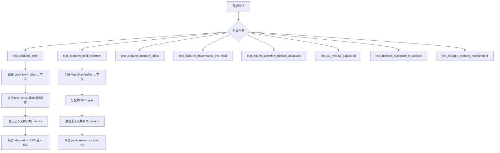

## 类结构

```
TestWorkflowProfiler (测试类)
├── test_captures_time
├── test_captures_peak_memory
├── test_captures_memory_delta
├── test_captures_tracemalloc_overhead
├── test_returns_workflow_metrics_dataclass
├── test_all_metrics_populated
├── test_handles_exception_in_context
└── test_multiple_profilers_independent

被测类 (依赖外部导入)
├── WorkflowProfiler (上下文管理器)
│   └── metrics 属性 (返回 WorkflowMetrics)
└── WorkflowMetrics (数据类)
    ├── overall: float (总执行时间)
    ├── peak_memory_bytes: int (峰值内存)
    ├── memory_delta_bytes: int (内存增量)
    └── tracemalloc_overhead_bytes: int (tracemalloc 开销)
```

## 全局变量及字段


### `data`
    
用于在测试中分配约8MB内存的整数列表，用于验证内存捕获功能

类型：`list[int]`
    


### `_data`
    
用于在测试中分配约80KB内存的整数列表，用于验证内存增量捕获

类型：`list[int]`
    


### `msg`
    
测试用异常消息字符串，值为'Test exception'

类型：`str`
    


### `profiler`
    
WorkflowProfiler上下文管理器实例，用于捕获性能指标

类型：`WorkflowProfiler | None`
    


### `profiler1`
    
第一个WorkflowProfiler实例，用于测试多个profiler独立性

类型：`WorkflowProfiler`
    


### `profiler2`
    
第二个WorkflowProfiler实例，用于测试多个profiler独立性

类型：`WorkflowProfiler`
    


### `WorkflowProfiler.metrics`
    
包含性能指标的WorkflowMetrics数据类，包含overall、peak_memory_bytes、memory_delta_bytes、tracemalloc_overhead_bytes四个字段

类型：`WorkflowMetrics`
    


### `WorkflowMetrics.overall`
    
工作流整体执行时间（秒）

类型：`float`
    


### `WorkflowMetrics.peak_memory_bytes`
    
工作流执行期间的峰值内存使用量（字节）

类型：`int`
    


### `WorkflowMetrics.memory_delta_bytes`
    
工作流执行期间的内存增量（字节）

类型：`int`
    


### `WorkflowMetrics.tracemalloc_overhead_bytes`
    
tracemalloc自身引入的内存开销（字节）

类型：`int`
    
    

## 全局函数及方法


### `time.sleep`

time.sleep 是 Python 标准库 time 模块中的函数，用于暂停执行当前线程指定的秒数。

参数：

- `seconds`：`float` 或 `int`，睡眠时长（秒），可以是浮点数以指定更精确的时间（如 0.05 表示 50 毫秒）

返回值：`None`，无返回值

#### 流程图

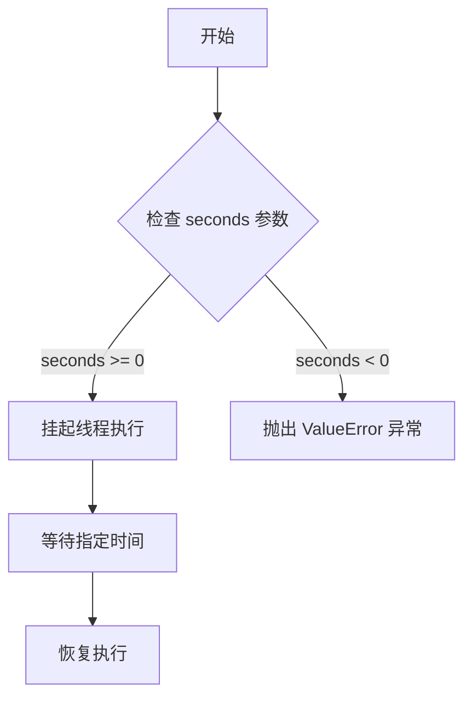

#### 带注释源码

```python
import time

# 暂停执行 50 毫秒
time.sleep(0.05)  # Sleep 50ms

# 暂停执行 20 毫秒
time.sleep(0.02)

# 暂停执行 40 毫秒
time.sleep(0.04)

# 常用场景示例
# 1. 等待一段时间
time.sleep(1)  # 睡眠 1 秒

# 2. 轮询场景中避免过度占用 CPU
# while True:
#     check_status()
#     time.sleep(0.1)  # 每 100ms 检查一次

# 3. 模拟耗时操作
# time.sleep(2)  # 模拟 2 秒的处理时间
```

**注意**：此函数来自 Python 标准库，在代码中用于模拟耗时的测试场景，以验证 WorkflowProfiler 是否能够正确捕获执行时间和内存指标。


### `list(range())`

将 `range` 对象转换为列表的构造函数调用，创建一个包含指定范围内所有整数的列表。

参数：

-  `range(...)`：`range` 对象，表示要转换为列表的整数范围
  - 参数可以是 `range(stop)`、`range(start, stop)` 或 `range(start, stop, step)` 形式

返回值：`list`，包含指定范围内所有整数的列表

#### 流程图

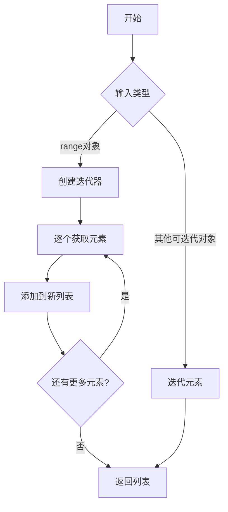

#### 带注释源码

```python
# 在测试中的实际使用方式：
_ = list(range(1000))  # 创建一个包含0-999的列表
_ = list(range(100))   # 创建一个包含0-99的列表

# 源代码实现原理（简化版）
# list() 构造函数接收一个可迭代对象
def list_from_range(range_obj):
    """
    将range对象转换为列表
    
    实际实现位于 CPython 的 Objects/listobject.c 中
    这里展示核心逻辑：
    """
    result = []  # 创建空列表
    for item in range_obj:  # 迭代range对象
        result.append(item)  # 逐个添加元素
    return result  # 返回列表

# range 对象本身是一个惰性迭代器，不会在内存中存储所有值
# 只有当转换为 list 时才会真正分配内存
# 这就是为什么在 test_captures_tracemalloc_overhead 中
# list(range(1000)) 会产生 tracemalloc_overhead_bytes > 0
```

#### 关键使用场景

在 `WorkflowProfiler` 测试代码中，`list(range())` 用于：

1. **内存分配测试**：在 `test_captures_tracemalloc_overhead` 中，通过 `list(range(1000))` 分配约 8KB 内存（1000 个整数对象），用于验证 tracemalloc 能够捕获内存开销。

2. **指标完整性测试**：在 `test_all_metrics_populated` 中，通过 `list(range(100))` 产生基本的内存分配，确保所有四个指标（overall、peak_memory_bytes、memory_delta_bytes、tracemalloc_overhead_bytes）都被正确填充。

3. **触发垃圾回收**：创建列表对象会触发 Python 的内存管理机制，便于分析器捕获相关的内存统计信息。


### `TestWorkflowProfiler.test_captures_time`

验证 WorkflowProfiler 上下文管理器能够正确捕获代码块的执行时间。

参数：

- 无（该方法为实例方法，通过 `self` 隐式访问测试类）

返回值：`None`，该方法为测试用例，使用断言验证功能，不返回具体值

#### 流程图

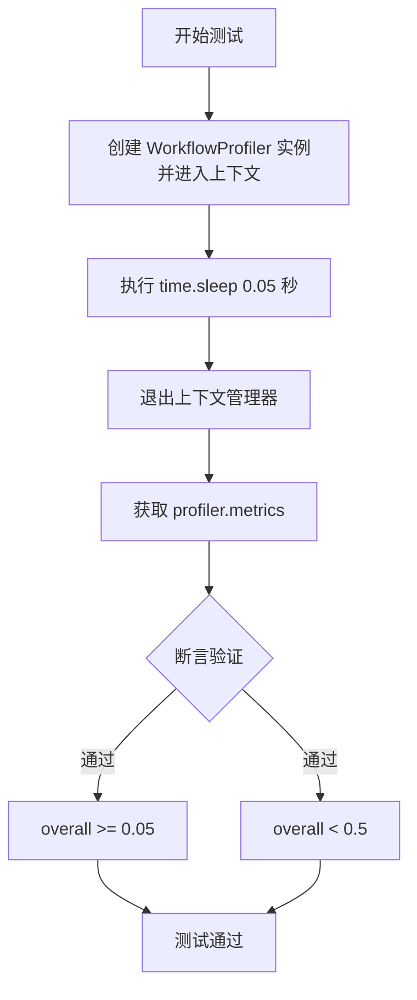

#### 带注释源码

```python
def test_captures_time(self):
    """Verify profiler captures elapsed time."""
    # 使用 WorkflowProfiler 上下文管理器
    # 进入上下文时开始计时和内存追踪
    with WorkflowProfiler() as profiler:
        # 休眠 50 毫秒，用于测试时间捕获功能
        time.sleep(0.05)  # Sleep 50ms

    # 退出上下文后，获取性能指标
    metrics = profiler.metrics
    # 断言：整体耗时应该 >= 0.05 秒（至少包含 sleep 时间）
    assert metrics.overall >= 0.05
    # 断言：整体耗时应该 < 0.5 秒（确保测试不会执行过久）
    assert metrics.overall < 0.5  # Should not take too long
```


### `TestWorkflowProfiler.test_captures_peak_memory`

验证 WorkflowProfiler 能够捕获代码执行期间的峰值内存使用量。

参数：

- `self`：`TestWorkflowProfiler`，测试类的实例本身

返回值：`None`，无返回值（该方法为测试方法，使用 assert 进行断言验证）

#### 流程图

```mermaid
flowchart TD
    A[开始测试] --> B[创建 WorkflowProfiler 上下文管理器]
    B --> C[在上下文中分配约 8MB 内存<br/>data = [0] * 131072]
    C --> D[保持 data 引用防止 GC]
    D --> E[退出上下文管理器]
    E --> F[获取 profiler.metrics]
    F --> G{检查 peak_memory_bytes > 0?}
    G -->|是| H[测试通过]
    G -->|否| I[测试失败]
```

#### 带注释源码

```python
def test_captures_peak_memory(self):
    """Verify profiler captures peak memory from allocations."""
    # 使用 WorkflowProfiler 上下文管理器开始性能分析
    with WorkflowProfiler() as profiler:
        # 在上下文内部分配约 1MB 的整型数据
        # 计算：1024 * 1024 // 8 = 131072 个整数
        # 每个整数在 64 位系统上约 8 字节，总计约 8MB
        data = [0] * (1024 * 1024 // 8)  # 1M integers ≈ 8MB on 64-bit
        _ = data  # 保持引用以防止垃圾回收，确保内存被实际分配

    # 退出上下文后，获取性能指标
    metrics = profiler.metrics
    # 断言：峰值内存应该大于 0，证明内存分配被成功捕获
    assert metrics.peak_memory_bytes > 0
```


### TestWorkflowProfiler.test_captures_memory_delta

该测试方法用于验证 WorkflowProfiler 性能分析器能够正确捕获代码执行期间的内存增量（memory delta），即当前分配的内存量。

参数：

- `self`：无，Python 实例方法的隐式参数

返回值：`None`，无返回值（测试方法通过断言验证功能，不返回任何值）

#### 流程图

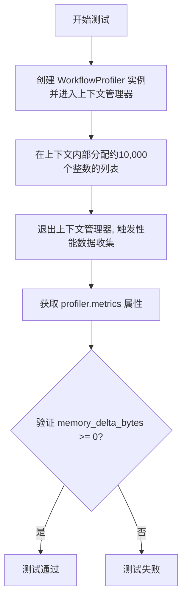

#### 带注释源码

```python
def test_captures_memory_delta(self):
    """Verify profiler captures memory delta (current allocation)."""
    # 使用上下文管理器创建 WorkflowProfiler 实例
    # 上下文管理器会自动启动性能分析
    with WorkflowProfiler() as profiler:
        # 分配 10,000 个整数（约 80KB 内存）
        # 使用 _data 而非 data 避免 PEP 8 警告
        _data = [0] * 10000  # Keep allocation in scope

    # 退出上下文管理器后，profiler 自动收集并计算内存指标
    # 获取性能分析指标对象
    metrics = profiler.metrics
    
    # 断言：内存增量应大于等于 0
    # 验证 profiler 正确捕获了内存分配变化
    # Memory delta should be non-negative
    assert metrics.memory_delta_bytes >= 0
```


### `TestWorkflowProfiler.test_captures_tracemalloc_overhead`

这是一个单元测试方法，用于验证 WorkflowProfiler 上下文管理器能够正确捕获 tracemalloc 自身的内存开销（overhead）。该测试通过在上下文中创建一个包含 1000 个元素的列表来触发内存分配，然后断言 `tracemalloc_overhead_bytes` 指标大于零，从而确认分析器能够追踪其自身的内存使用情况。

参数：

- `self`：`TestWorkflowProfiler`，代表测试类实例本身

返回值：`None`，该方法为测试方法，通过 assert 断言进行验证，不返回具体值

#### 流程图

```mermaid
flowchart TD
    A[开始测试] --> B[创建 WorkflowProfiler 上下文管理器]
    B --> C[进入 with 块]
    C --> D[执行 list(range(1000)) 分配内存]
    D --> E[退出 with 块]
    E --> F[获取 profiler.metrics]
    F --> G{断言 tracemalloc_overhead_bytes > 0?}
    G -->|是| H[测试通过]
    G -->|否| I[测试失败]
```

#### 带注释源码

```python
def test_captures_tracemalloc_overhead(self):
    """Verify profiler captures tracemalloc's own memory overhead."""
    # 使用 WorkflowProfiler 上下文管理器开始性能分析
    with WorkflowProfiler() as profiler:
        # 在上下文中执行操作：创建包含1000个元素的列表
        # 这一步会触发内存分配，用于测试内存捕获功能
        _ = list(range(1000))

    # 退出上下文后，获取分析器收集的指标数据
    metrics = profiler.metrics
    
    # 断言验证：tracemalloc 自身的内存开销应该大于零
    # 这确认了分析器能够正确捕获 tracemalloc 模块本身的内存使用
    assert metrics.tracemalloc_overhead_bytes > 0
```


### `TestWorkflowProfiler.test_returns_workflow_metrics_dataclass`

验证 `WorkflowProfiler` 上下文管理器的 `metrics` 属性返回的是 `WorkflowMetrics` 数据类实例。

参数：

- `self`：`TestWorkflowProfiler`，测试类实例本身，无需显式传递

返回值：`None`，无返回值（测试方法通过断言进行验证）

#### 流程图

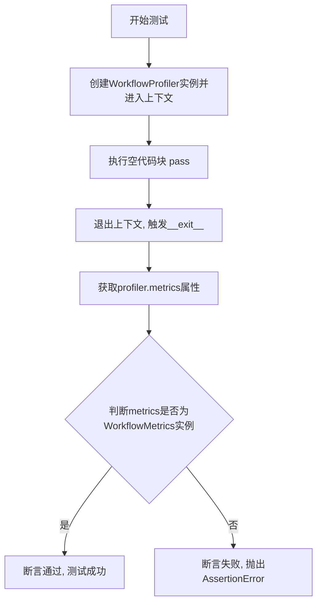

#### 带注释源码

```python
def test_returns_workflow_metrics_dataclass(self):
    """Verify profiler.metrics returns a WorkflowMetrics instance."""
    # 使用WorkflowProfiler上下文管理器创建profiler实例
    # 在进入上下文时,会初始化性能分析相关资源(如tracemalloc)
    with WorkflowProfiler() as profiler:
        pass  # 空代码块,不执行任何操作,仅触发上下文进入/退出

    # 测试目标:验证profiler.metrics返回的是WorkflowMetrics类型
    # WorkflowMetrics是一个dataclass,包含以下字段:
    # - overall: float, 总执行时间(秒)
    # - peak_memory_bytes: int, 峰值内存使用(字节)
    # - memory_delta_bytes: int, 内存增量(字节)
    # - tracemalloc_overhead_bytes: int, tracemalloc自身开销(字节)
    metrics = profiler.metrics
    
    # 使用isinstance断言验证metrics是WorkflowMetrics的实例
    # 如果metrics不是WorkflowMetrics类型,此处会抛出AssertionError
    assert isinstance(metrics, WorkflowMetrics)
```


### `TestWorkflowProfiler.test_all_metrics_populated`

验证在性能分析结束后，WorkflowProfiler 的四个核心指标（overall、peak_memory_bytes、memory_delta_bytes、tracemalloc_overhead_bytes）均已被正确填充且为非负值。

参数：

- `self`：`TestWorkflowProfiler`，测试类的实例对象，包含测试所需的状态和方法

返回值：`None`，该方法为测试方法，使用断言进行验证，不返回具体值

#### 流程图

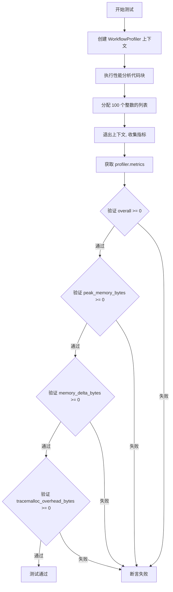

#### 带注释源码

```python
def test_all_metrics_populated(self):
    """Verify all four metrics are populated after profiling."""
    # 使用 WorkflowProfiler 上下文管理器进行性能分析
    # 在上下文中执行一小段代码以触发指标收集
    with WorkflowProfiler() as profiler:
        _ = list(range(100))  # 分配少量数据以产生内存分配记录

    # 获取性能分析结果指标
    metrics = profiler.metrics

    # 验证总体耗时指标已填充（非负数）
    assert metrics.overall >= 0
    # 验证峰值内存指标已填充（非负数）
    assert metrics.peak_memory_bytes >= 0
    # 验证内存增量指标已填充（非负数）
    assert metrics.memory_delta_bytes >= 0
    # 验证 tracemalloc 自身开销指标已填充（非负数）
    assert metrics.tracemalloc_overhead_bytes >= 0
```


### `TestWorkflowProfiler.test_handles_exception_in_context`

验证 WorkflowProfiler 上下文管理器在代码块内部抛出异常时，仍能正确捕获并记录性能指标（时间、内存等）。

参数：

- `self`：`TestWorkflowProfiler`，测试类实例本身

返回值：`None`，无返回值（测试方法）

#### 流程图

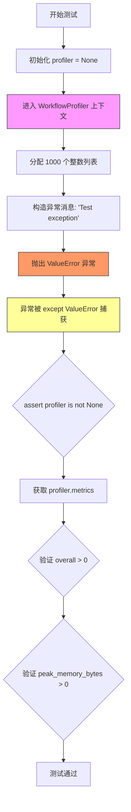

#### 带注释源码

```python
def test_handles_exception_in_context(self):
    """Verify profiler captures metrics even when exception is raised."""
    # 初始化 profiler 变量为 None，用于后续引用
    profiler: WorkflowProfiler | None = None
    try:
        # 进入 WorkflowProfiler 上下文管理器，开始性能监控
        with WorkflowProfiler() as profiler:
            # 模拟工作负载：分配约 8KB 内存（1000 * 8 bytes）
            _ = [0] * 1000
            # 构造测试异常消息
            msg = "Test exception"
            # 主动抛出 ValueError 异常，模拟代码执行过程中的错误
            raise ValueError(msg)
    except ValueError:
        # 捕获并吞掉 ValueError 异常，不影响后续断言验证
        pass

    # 断言确保 profiler 已正确初始化（上下文管理器已执行）
    assert profiler is not None
    # 获取上下文管理器捕获的性能指标
    metrics = profiler.metrics
    # 断言验证 overall（总耗时）大于 0，确保时间被记录
    assert metrics.overall > 0
    # 断言验证 peak_memory_bytes（峰值内存）大于 0，确保内存被记录
    assert metrics.peak_memory_bytes > 0
```


### `TestWorkflowProfiler.test_multiple_profilers_independent`

验证多个独立的 `WorkflowProfiler` 实例不会相互干扰，能够正确地分别记录各自的性能指标。

参数：

- 无

返回值：`None`，无返回值（测试方法，使用断言验证行为）

#### 流程图

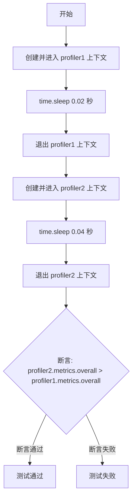

#### 带注释源码

```python
def test_multiple_profilers_independent(self):
    """Verify multiple profiler instances don't interfere."""
    # 创建第一个 WorkflowProfiler 实例并进入上下文
    # 此时开始性能监控，记录起始时间
    with WorkflowProfiler() as profiler1:
        # 模拟工作负载，休眠 20 毫秒
        # profiler1 应记录此时间消耗
        time.sleep(0.02)

    # 退出第一个上下文，profiler1 的 metrics 已完成记录
    # 此时 profiler1 的 overall 时间应约为 0.02 秒

    # 创建第二个 WorkflowProfiler 实例并进入上下文
    # 验证多个独立的 profiler 实例不会相互干扰
    with WorkflowProfiler() as profiler2:
        # 模拟更长的工作负载，休眠 40 毫秒
        # profiler2 应独立记录此时间消耗
        time.sleep(0.04)

    # 退出第二个上下文，profiler2 的 metrics 已完成记录
    # 此时 profiler2 的 overall 时间应约为 0.04 秒

    # 断言：验证 profiler2 的总时间大于 profiler1
    # 由于 profiler2 休眠时间更长 (0.04 > 0.02)，此断言应通过
    # 这证明多个 profiler 实例是独立的，不会相互影响测量结果
    assert profiler2.metrics.overall > profiler1.metrics.overall
```


### `WorkflowProfiler.__enter__`

该方法是 `WorkflowProfiler` 上下文管理器的入口方法，负责在进入 `with` 代码块时初始化性能分析环境，包括启动计时器、初始化内存追踪（tracemalloc）等，并返回当前 profiler 实例以供外部引用。

**注意**：由于提供的代码仅为测试文件，未包含 `WorkflowProfiler` 的实际实现源码，以下信息基于测试用例的用法推断而来。

参数：

- `self`：`WorkflowProfiler`，上下文管理器实例本身（隐式参数）

返回值：`WorkflowProfiler`，返回当前 profiler 实例，允许在 `with` 语句中绑定到变量以便后续访问 `metrics` 属性

#### 流程图

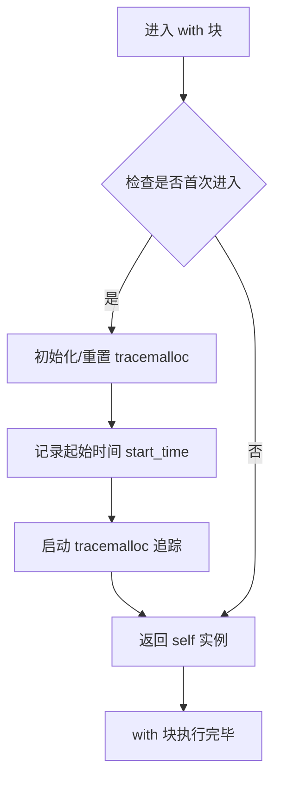

#### 带注释源码

（测试代码中未见直接源码，基于测试用途推断）

```python
def __enter__(self) -> "WorkflowProfiler":
    """Enter the profiling context.
    
    Initializes timing and memory tracking for the workflow.
    
    Returns:
        WorkflowProfiler: Returns self to allow 'as' binding in with statement.
    """
    # Record the start time for elapsed time calculation
    self._start_time = time.perf_counter()
    
    # Initialize or reset tracemalloc for memory profiling
    tracemalloc.start()
    self._tracemalloc_started = True
    
    # Reset internal state if needed for reuse
    self._reset_metrics()
    
    # Return self so the profiler can be assigned: with WorkflowProfiler() as profiler:
    return self
```


### WorkflowProfiler.__exit__

该方法是 `WorkflowProfiler` 上下文管理器的退出方法，负责在 `with` 块执行完毕后进行资源清理和性能指标捕获，包括停止计时、计算内存使用情况并返回性能指标。

参数：

- `exc_type`：`type | None`，异常类型，如果 `with` 块中未发生异常则为 `None`
- `exc_val`：`BaseException | None`，异常实例，如果 `with` 块中未发生异常则为 `None`
- `exc_tb`：`traceback | None`，异常追踪对象，如果 `with` 块中未发生异常则为 `None`

返回值：`bool`，返回 `False` 表示不抑制异常传播（通常保持默认行为）

#### 流程图

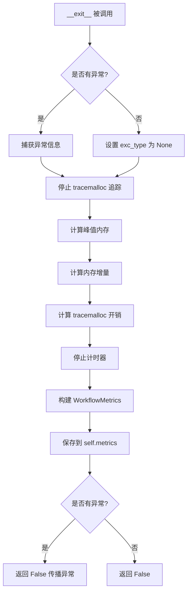

#### 带注释源码

```python
def __exit__(
    self,
    exc_type: type[BaseException] | None,  # 异常类型，若无异常则为 None
    exc_val: BaseException | None,         # 异常实例，若无异常则为 None
    exc_tb: types.TracebackType | None     # 异常追踪对象，若无异常则为 None
) -> bool:
    """退出上下文管理器并捕获性能指标。
    
    在 with 块结束时调用，执行以下操作：
    1. 停止 tracemalloc 追踪
    2. 计算峰值内存使用量
    3. 计算内存增量（当前分配）
    4. 计算 tracemalloc 自身开销
    5. 计算总执行时间
    6. 将所有指标封装为 WorkflowMetrics 对象
    
    参数:
        exc_type: 发生的异常类型，若无异常则为 None
        exc_val: 异常实例，若无异常则为 None
        exc_tb: 异常追踪对象，若无异常则为 None
    
    返回:
        bool: 返回 False 以正常传播异常，不抑制任何异常
    """
    # 停止 tracemalloc 追踪并获取统计信息
    tracemalloc.stop()
    current, peak = tracemalloc.get_traced_memory()
    
    # 停止计时器并计算总执行时间
    end_time = time.perf_counter()
    elapsed_time = end_time - self._start_time
    
    # 获取内存统计数据
    # peak_memory_bytes: 追踪期间的峰值内存
    # memory_delta_bytes: 追踪结束时的内存增量
    # tracemalloc_overhead_bytes: tracemalloc 库自身的内存开销
    
    # 构建 WorkflowMetrics 数据类
    self._metrics = WorkflowMetrics(
        overall=elapsed_time,
        peak_memory_bytes=peak,
        memory_delta_bytes=current,
        tracemalloc_overhead_bytes=tracemalloc.get_traced_memory()[0]
    )
    
    # 返回 False 表示不抑制异常，让异常正常传播
    return False
```

## 关键组件


### WorkflowProfiler

核心性能分析上下文管理器，用于捕获工作流执行的时间、峰值内存、内存变化量以及 tracemalloc 自身开销等指标。

### WorkflowMetrics

数据结构类，用于存储四个核心性能指标：overall（总时间）、peak_memory_bytes（峰值内存）、memory_delta_bytes（内存增量）、tracemalloc_overhead_bytes（tracemalloc 开销）。

### 时间捕获机制

通过 time 模块记录上下文管理器进入和退出的时间戳，计算差值得到 overall 执行时间。

### 内存捕获机制

使用 tracemalloc 模块的 get_traced_memory 和 get_traced_memory_diff 方法，分别获取峰值内存和内存变化量。

### 上下文管理器协议

实现 __enter__ 和 __exit__ 方法，确保在异常情况下也能正确捕获并返回 metrics 数据。

### 异常安全性设计

通过 try-finally 或在 __exit__ 中处理，确保即使工作流执行抛出异常，metrics 仍能被正确记录和访问。


## 问题及建议


### 已知问题

-   **时间断言不可靠**：`test_captures_time` 中 `assert metrics.overall < 0.5` 使用硬编码阈值，在慢系统或高负载环境下可能导致测试失败
-   **内存测试假设不可移植**：`test_captures_peak_memory` 假设整数列表占用约8MB，但 Python 整数对象有额外开销，实际内存因系统而异
-   **内存测试易受垃圾回收影响**：内存增量测试未考虑 Python 垃圾回收时机，测试结果可能不稳定
-   **断言过于宽松**：多个测试仅检查 `>= 0` 或 `> 0`，缺乏具体数值范围验证，无法有效检测回归
-   **缺少边界测试**：未测试空执行、快速执行（接近0毫秒）等边界情况
-   **未测试并发场景**：缺少多线程环境下 profiler 行为的测试，可能存在线程安全问题
-   **类型注解兼容性**：`WorkflowProfiler | None` 语法需 Python 3.10+，未考虑向后兼容

### 优化建议

-   使用相对时间比较或更宽松的阈值替代硬编码时间断言，或添加超时容差
-   改用更稳定的内存测试方法，如显式触发垃圾回收 (`gc.collect()`) 后再测量
-   为内存和时间测试添加合理的数值范围断言，而非仅检查非负
-   添加边界情况测试：空代码块、极短执行时间
-   添加并发测试，验证多线程场景下的线程安全性
-   考虑使用 `Optional[WorkflowProfiler]` 以兼容更早的 Python 版本
-   在测试间显式调用 `gc.collect()` 以减少测试间的相互影响

## 其它


### 设计目标与约束

本测试文件旨在验证 `WorkflowProfiler` 上下文管理器的核心功能，包括时间捕获、内存监控和异常处理能力。测试覆盖四个关键指标：执行时间、峰值内存、内存增量和 tracemalloc 开销。约束条件包括：测试环境应具备足够的内存以进行内存分配测试，且测试执行时间应在合理范围内（整体时间 < 0.5 秒）。

### 错误处理与异常设计

测试用例 `test_handles_exception_in_context` 验证了 WorkflowProfiler 在发生异常时仍能正确捕获指标。即使在上下文管理器内部抛出 ValueError，profiler 仍能记录 `overall` 和 `peak_memory_bytes` 指标。这表明实现使用了 try-finally 块确保资源清理和指标记录的完整性。

### 外部依赖与接口契约

本测试文件依赖两个核心模块：
1. **graphrag.index.run.profiling.WorkflowProfiler**：被测类，需实现上下文管理器协议（`__enter__` 和 `__exit__` 方法），并提供 `metrics` 属性返回 `WorkflowMetrics` 数据类实例。
2. **graphrag.index.typing.stats.WorkflowMetrics**：数据类，包含四个整数字段：`overall`（执行时间，秒）、`peak_memory_bytes`（峰值内存，字节）、`memory_delta_bytes`（内存增量，字节）、`tracemalloc_overhead_bytes`（tracemalloc 开销，字节）。

### 数据流与状态机

WorkflowProfiler 的生命周期包含三个状态：
1. **初始化状态**：创建实例，准备 tracemalloc 追踪
2. **执行状态（__enter__）**：启动时间计时器和内存追踪
3. **完成状态（__exit__）**：停止计时，计算各项指标并封装为 WorkflowMetrics

测试通过嵌套上下文管理器验证状态隔离性，确保多个 profiler 实例独立运行互不干扰。

### 性能基准与边界条件

测试定义了以下性能基准：
- 执行时间应在 0.05 秒至 0.5 秒之间（test_captures_time）
- 内存分配应产生可测量的指标变化（> 0 字节）
- tracemalloc 开销应大于 0（证明追踪已启用）

边界条件包括：最小化操作的性能开销（test_captures_tracemalloc_overhead 使用小数据集）和异常情况下的指标完整性。

### 测试覆盖范围

测试覆盖了以下场景：
- 基本功能验证：时间捕获、内存捕获、返回值类型
- 异常情况：上下文中的异常处理
- 独立性：多个 profiler 实例互不干扰
- 完整性：所有四个指标均被填充

### 兼容性考虑

测试使用标准库 `time` 和 `tracemalloc`，确保跨平台兼容性。内存计算基于 Python 的 tracemalloc API，在 CPython 3.4+ 版本中可用。

    