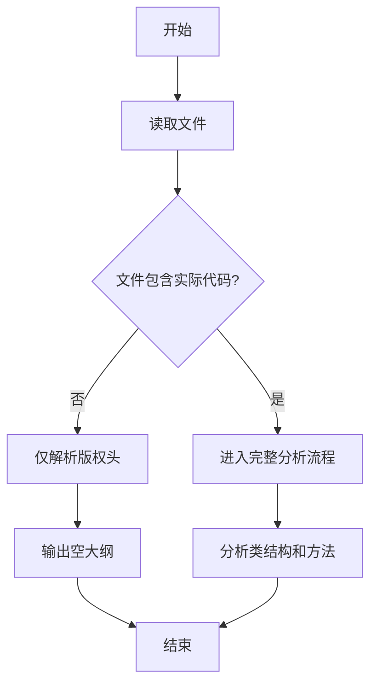

# `graphrag\tests\unit\indexing\verbs\__init__.py` 详细设计文档

该文件仅包含版权声明和MIT许可证信息，无实际代码实现。

## 整体流程



## 类结构

```
无类结构（代码中未定义任何类）
```

## 全局变量及字段


    

## 全局函数及方法


## 关键组件


### 文件概述

该代码文件仅包含版权声明和MIT许可证声明，不包含任何实际的功能实现代码。

### 文件运行流程

该文件为纯声明性文件，不包含任何可执行代码，无运行流程。

### 关键组件

无关键组件可供描述。

### 技术债务与优化空间

由于该文件仅为版权头文件，不存在技术债务。如需扩展功能，可在此基础上添加相应的模块实现。

### 其他项目

- **设计目标与约束**：仅作为版权声明文件
- **错误处理与异常设计**：无
- **数据流与状态机**：无
- **外部依赖与接口契约**：无
- **类详细信息**：无类定义
- **全局变量与函数**：无全局变量或函数定义


## 问题及建议


### 已知问题

-   **代码缺失**：该文件仅包含版权声明和许可证头，缺少实际的代码实现，无法提供任何功能
-   **功能缺失**：没有定义任何类、函数或模块，不存在运行流程可言
-   **文档缺失**：缺少项目说明文档、API文档和使用指南
-   **测试缺失**：没有任何测试代码或测试框架配置
-   **配置缺失**：缺少项目配置文件（如setup.py、pyproject.toml、requirements.txt等）
-   **依赖不明**：未定义项目依赖关系

### 优化建议

-   **实现核心功能**：根据项目名称"Microsoft Corporation"相关，推测可能是某个Microsoft项目，需要添加实际的业务逻辑代码
-   **添加模块化设计**：创建合理的模块划分，设计类和函数的结构
-   **完善文档体系**：添加README.md、API文档、架构文档等
-   **构建测试体系**：使用pytest或unittest编写单元测试和集成测试
-   **配置构建系统**：添加pyproject.toml或setup.py配置项目元数据和依赖
-   **添加类型注解**：使用Python类型提示提高代码可维护性


## 其它


### 设计目标与约束

由于代码仅包含版权声明，无法确定具体的设计目标。该项目应遵循MIT许可证的开源要求，代码结构应模块化、易于扩展，并保持轻量级依赖。

### 错误处理与异常设计

代码中未包含任何实现逻辑，无法评估错误处理机制。建议在实际代码中采用统一的异常处理策略，区分可恢复错误与不可恢复错误，并提供有意义的错误信息。

### 数据流与状态机

当前代码无实际功能，无法描述数据流或状态机。

### 外部依赖与接口契约

当前代码无实际实现，无外部依赖。建议在未来代码中明确声明所有第三方依赖，优先使用成熟稳定的开源库，并记录API接口契约。

### 安全性考虑

代码中未包含安全相关的实现。建议在后续开发中遵循安全编码规范，处理用户输入时进行验证和清理，避免常见安全漏洞。

### 性能要求

当前代码无实现内容，无法评估性能需求。

### 可用性与可维护性

代码结构应清晰，遵循单一职责原则，类和方法应保持简洁，代码注释应充分，变量命名应具有描述性。

### 测试策略

建议为每个模块编写单元测试，使用集成测试验证组件间交互，保持测试覆盖率在合理水平。

### 部署配置

当前无部署相关内容。建议提供清晰的部署文档，包括环境要求、配置参数和部署步骤。

### 版本管理

遵循语义化版本号规范（SemVer），在代码变更时更新版本号并维护CHANGELOG。

### 许可证和法律合规

代码已声明使用MIT许可证，应在项目中保留版权和许可证声明。

### 贡献指南

建议建立CONTRIBUTING.md文件，说明如何提交代码、代码规范、审查流程等。

### 关键组件信息

无实际组件，当前仅为版权声明文件。

### 潜在的技术债务或优化空间

由于无实际代码，无法评估技术债务。后续开发中应注意代码质量，避免硬编码，保持低耦合高内聚。


    