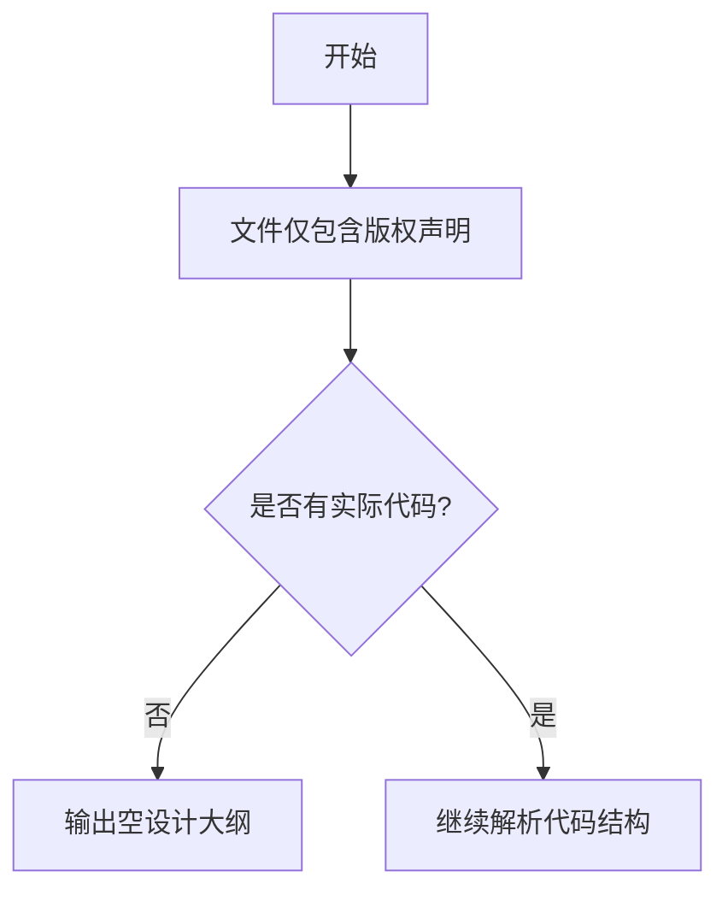

# `graphrag\tests\unit\indexing\verbs\entities\extraction\__init__.py` 详细设计文档

该文件仅包含版权声明和许可证信息，未包含任何实际功能代码，因此无法提取类的层次结构、方法、变量或函数等设计元素。

## 整体流程



## 类结构

```

```

## 全局变量及字段


    

## 全局函数及方法


## 关键组件


## 问题及建议


### 已知问题

-   代码文件仅包含版权和许可证声明，没有任何实际的业务逻辑或功能实现
-   缺少代码实现部分，无法进行详细的类、方法、流程分析
-   文件内容不完整，无法评估架构设计、技术债务或优化空间

### 优化建议

-   提供完整的代码实现以便进行架构分析和文档生成
-   补充具体的功能模块代码，包括业务逻辑、数据处理、接口定义等
-   如该文件为占位符或模板，建议明确标记并提供完整的示例代码


## 其它


### 核心功能概述

该代码文件仅包含版权声明和MIT许可证声明，不包含任何实际功能实现代码，因此无法从中提取核心功能描述。

### 文件整体运行流程

由于该文件仅包含许可证头文件，无实际可执行代码，因此不存在运行流程。

### 类结构与详细信息

由于该文件不包含任何类定义，此项不适用。

### 全局变量与全局函数

由于该文件不包含任何全局变量或全局函数定义，此项不适用。

### 关键组件信息

由于该文件不包含任何实际功能代码，因此无关键组件可供描述。

### 潜在技术债务与优化空间

由于该文件仅包含许可证声明，不涉及任何技术实现，因此不存在技术债务或优化空间。

### 设计目标与约束

由于缺乏实际代码，设计目标与约束无法从该文件中提取。

### 错误处理与异常设计

由于该文件不包含任何可执行的逻辑代码，因此无错误处理与异常设计相关内容。

### 数据流与状态机

由于该文件不包含任何数据处理逻辑，因此不涉及数据流或状态机设计。

### 外部依赖与接口契约

由于该文件仅包含许可证声明，无接口定义，因此无外部依赖与接口契约可供描述。

### 安全性考虑

由于缺乏实际代码，安全性分析无法进行。

### 性能特性

由于该文件不包含任何可执行代码，性能特性不适用。

### 测试覆盖范围

由于缺乏实际代码实现，测试覆盖范围无法确定。

### 版本兼容性信息

该许可证声明（MIT License）表明代码可以与任何版本的代码兼容，只要符合MIT许可证条款。

### 配置与可扩展性

由于该文件不包含任何配置逻辑或可扩展性设计，此项不适用。

### 备注

提供的代码片段仅包含版权和许可证声明，不足以进行完整的详细设计文档分析。建议提供包含实际业务逻辑的完整源代码以便进行全面的架构设计文档编写。


    