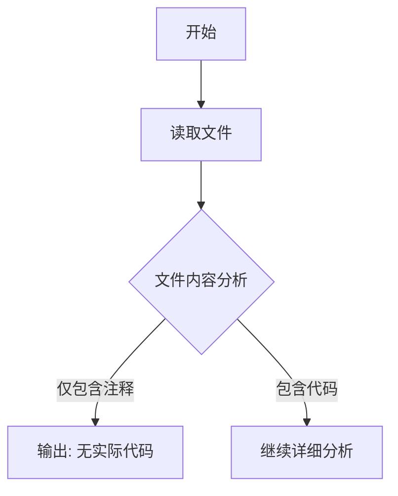

# `graphrag\tests\unit\indexing\verbs\entities\extraction\strategies\__init__.py` 详细设计文档

该代码文件仅包含版权声明和MIT许可证声明，没有实际的功能代码实现，因此无法进行架构设计分析。

## 整体流程



## 类结构

```
该文件没有类结构
```

## 全局变量及字段


    

## 全局函数及方法


## 关键组件


## 问题及建议


### 已知问题

-   代码文件仅包含版权声明头，缺少实际实现代码，无法进行详细的技术债务和优化分析。

### 优化建议

-   请提供完整的源代码文件，以便进行全面的架构分析和优化建议。
-   当前文件仅作为占位符存在，建议补充具体的业务逻辑实现代码。
-   在后续代码实现中，建议遵循单一职责原则，保持类和方法的功能单一性。
-   建议在代码中添加适当的错误处理机制和日志记录。


## 其它


### 项目概述

该文件仅包含版权声明和MIT许可证声明，不包含任何实际的功能代码实现。

### 设计目标与约束

不适用 - 该文件仅为许可证声明文件，无功能代码。

### 文件整体运行流程

该文件不包含任何可执行代码，无运行流程。文件仅作为元数据声明使用。

### 类详细信息

无类定义

### 类字段

无类字段

### 类方法

无类方法

### 全局变量

无全局变量

### 全局函数

无全局函数

### 关键组件信息

无关键组件

### 错误处理与异常设计

不适用 - 该文件不包含错误处理逻辑

### 数据流与状态机

不适用 - 该文件不包含数据流或状态机逻辑

### 外部依赖与接口契约

无外部依赖

### 潜在的技术债务或优化空间

无技术债务 - 该文件仅为许可证声明文件

### 性能考虑

不适用

### 安全性考虑

该文件包含的许可证声明符合MIT许可协议的安全要求

### 可维护性分析

该文件结构简单，无需维护

### 测试相关

无需测试 - 该文件仅包含许可证声明

    