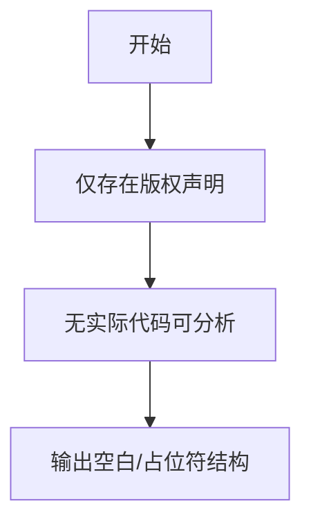

# `graphrag\tests\unit\indexing\verbs\entities\extraction\strategies\graph_intelligence\__init__.py` 详细设计文档

未提供实际源代码，仅包含版权声明和MIT许可证头部，无法进行代码功能分析。

## 整体流程



## 类结构

```
无法识别类层次结构（代码为空或仅包含注释）
```

## 全局变量及字段


    

## 全局函数及方法


## 关键组件


## 问题及建议


### 已知问题

-   代码片段仅包含版权声明和 MIT 许可证声明，未提供任何可分析的源代码实现

### 优化建议

-   由于提供的代码仅包含文件头注释，无法进行详细的技术债务分析和优化建议；建议提供完整的源代码以进行深入分析
-   建议在后续提交中包含完整的实现代码，以便进行全面的架构审查和优化建议


## 其它


### 一段话描述

该代码文件仅为一个版权头文件，包含MIT许可证的版权声明，不包含任何实际的功能实现代码。

### 文件的整体运行流程

该文件不包含任何可执行代码，仅作为版权和许可证声明使用，不参与程序的实际运行流程。

### 类的详细信息

该文件中不存在任何类定义。

### 类字段和全局变量

该文件中不存在任何类字段或全局变量。

### 类方法和全局函数

该文件中不存在任何类方法或全局函数。

### 关键组件信息

由于代码中不包含任何功能组件，因此无关键组件信息。

### 潜在的技术债务或优化空间

由于该文件仅为版权声明文件，不存在技术债务。如需改进，可考虑添加项目元数据文件（如package.json、pyproject.toml等）以提供更完整的项目信息。

### 设计目标与约束

**设计目标**：声明开源许可证和版权信息
**设计约束**：遵循MIT许可证要求，包含年份和版权持有者信息

### 错误处理与异常设计

由于该文件不包含任何可执行代码，不涉及错误处理与异常设计。

### 数据流与状态机

该文件不涉及任何数据流或状态机设计。

### 外部依赖与接口契约

该文件不定义任何外部依赖或接口契约。

### 版本历史与变更记录

- 2024: 初始版本，添加MIT许可证版权声明

### 法律与合规信息

该文件声明使用MIT许可证，允许在商业和非商业项目中免费使用、修改和分发代码。

### 构建与部署说明

该文件无需构建或部署流程。

### 测试覆盖说明

由于该文件仅包含版权声明，不涉及任何可测试代码，因此无测试覆盖要求。


    