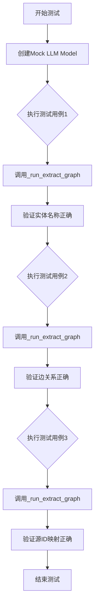
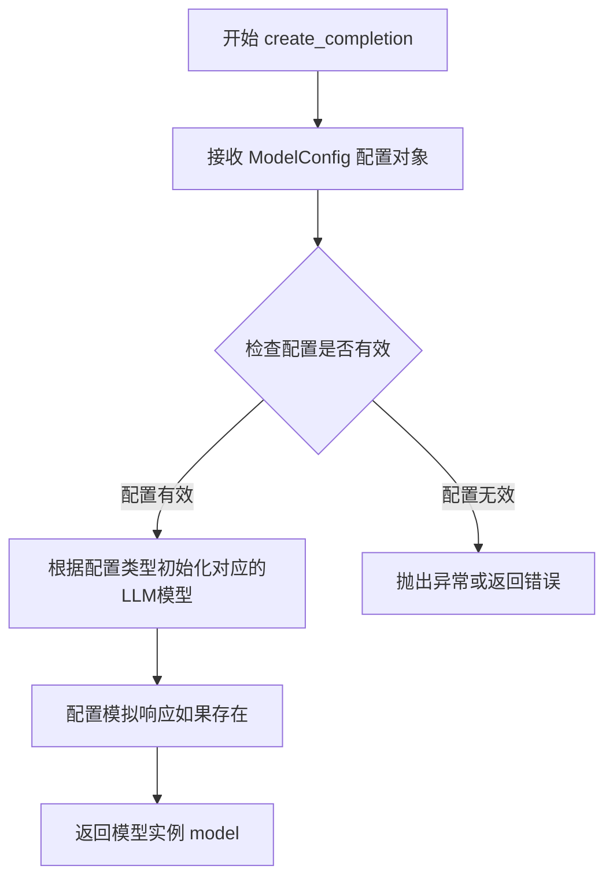
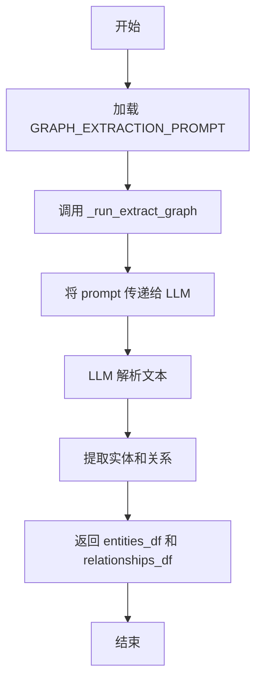
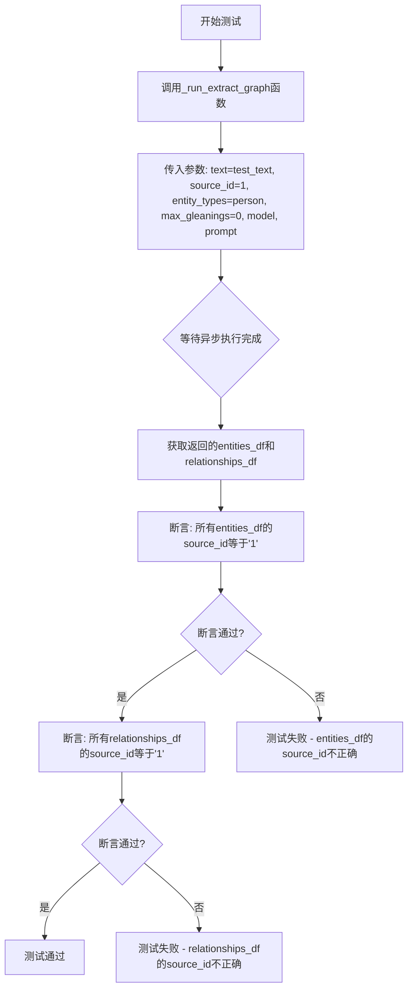
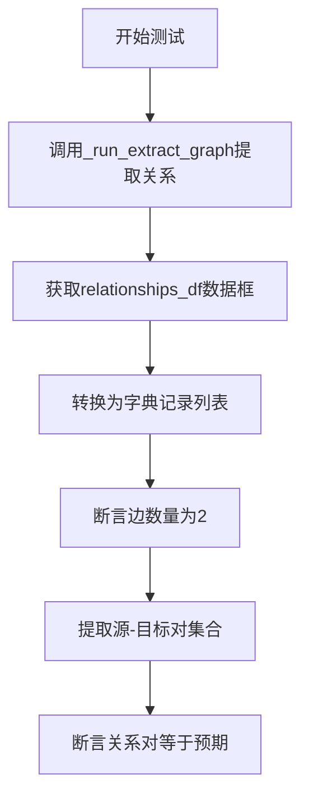
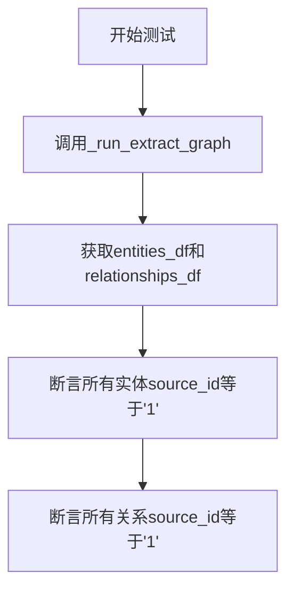

# `graphrag\tests\unit\indexing\verbs\entities\extraction\strategies\graph_intelligence\test_gi_entity_extraction.py` 详细设计文档

这是一个针对图谱提取功能的集成测试文件，通过模拟LLM响应测试从文本中提取实体和关系的能力，验证实体名称、边关系和源ID映射的正确性。

## 整体流程



## 类结构

```
TestRunChain (unittest.IsolatedAsyncioTestCase)
└── 测试方法集
    ├── test_run_extract_graph_single_document_correct_entities_returned
    ├── test_run_extract_graph_single_document_correct_edges_returned
    └── test_run_extract_graph_single_document_source_ids_mapped
```

## 全局变量及字段


### `SIMPLE_EXTRACTION_RESPONSE`
    
包含模拟图谱提取响应的字符串数据，定义了实体和关系测试用例

类型：`str`
    


### `model`
    
通过create_completion创建的LLM模型实例，用于图谱提取测试

类型：`Any`
    


    

## 全局函数及方法


### `create_completion`

该函数是 graphrag_llm 包中的核心函数，用于根据提供的模型配置创建一个 LLM（大型语言模型）实例，该实例可用于后续的文本补全任务。

参数：

-  `config`：`ModelConfig`，模型配置对象，包含了要创建的 LLM 的类型、提供商、模型名称以及可选的模拟响应等配置信息

返回值：`model` 对象，返回一个可用于异步调用的大型语言模型实例，该实例的接口支持 `__call__` 或类似方法以便执行文本补全

#### 流程图



#### 带注释源码

```python
# 该源码为基于函数调用方式的推断实现，仅用于说明函数预期行为
def create_completion(config: ModelConfig):
    """
    根据提供的模型配置创建并返回一个大型语言模型实例。
    
    参数:
        config (ModelConfig): 包含模型类型、提供商、模型名称等信息的配置对象
        
    返回:
        model: 一个可用于生成文本补全的模型实例
    """
    # 1. 验证配置对象
    if not isinstance(config, ModelConfig):
        raise TypeError("config must be a ModelConfig instance")
    
    # 2. 根据配置中的 type 字段确定要创建的模型类型
    # 在本例中，使用的是 MockLLM（模拟 LLM），用于测试目的
    if config.type == LLMProviderType.MockLLM:
        # 3. 创建模拟 LLM 实例
        model = MockLLM(
            model=config.model,
            mock_responses=config.mock_responses
        )
    elif config.type == LLMProviderType.OpenAI:
        # 实际使用中可能还会支持其他提供商如 OpenAI
        model = OpenAIModel(
            model=config.model,
            api_key=config.api_key,
            # 其他参数...
        )
    else:
        raise ValueError(f"Unsupported model type: {config.type}")
    
    # 4. 返回配置好的模型实例
    # 返回的模型应该是一个异步可调用对象，支持类似 await model(prompt) 的调用方式
    return model
```

> **注意**：由于源代码未直接提供，以上源码是基于 `graphrag_llm.completion.create_completion` 函数在实际代码中的使用方式推断得出的。具体实现可能有所不同，但函数的核心功能和接口设计应与上述推断一致。


### `_run_extract_graph`

该函数是图谱提取的核心方法，接收文本、源ID、实体类型、LLM模型和提示词，使用大语言模型从文本中提取实体和关系，并返回包含实体和关系的数据框（DataFrame）。

参数：

- `text`：`str`，待提取的文本内容
- `source_id`：`str`，数据来源标识符
- `entity_types`：`List[str]`，要提取的实体类型列表（如 ["person", "company"]）
- `max_gleanings`：`int`，最大重新尝试次数，用于从模型输出中提取更多信息
- `model`：模型对象，用于生成Completion的LLM模型实例
- `prompt`：`str`，图谱提取的提示词模板

返回值：`(DataFrame, DataFrame)`，返回一个元组，包含两个pandas DataFrame——第一个是实体数据框（包含title、type等字段），第二个是关系数据框（包含source、target等字段）

#### 流程图

```mermaid
flowchart TD
    A[开始: _run_extract_graph] --> B[接收参数: text, source_id, entity_types, max_gleanings, model, prompt]
    B --> C[构建Prompt: 填充模板变量]
    C --> D[调用LLM Model: 发送Prompt获取Completion响应]
    D --> E{是否达到max_gleanings?}
    E -->|否| F[解析响应: 提取实体和关系]
    F --> G[构建实体DataFrame]
    G --> H[构建关系DataFrame并添加source_id]
    H --> I[返回: (entities_df, relationships_df)]
    E -->|是| J[结束]
```

#### 带注释源码

```python
async def _run_extract_graph(
    text: str,                           # 待处理的原始文本
    source_id: str,                      # 文本来源标识
    entity_types: List[str],             # 目标实体类型过滤
    max_gleanings: int,                  # 最大迭代次数
    model,                               # LLM模型实例
    prompt: str                          # 提取提示词模板
) -> Tuple[DataFrame, DataFrame]:
    """
    从文本中提取实体和关系图谱
    
    参数:
        text: 输入文本内容
        source_id: 来源文档ID
        entity_types: 要提取的实体类型列表
        max_gleanings: 重新提取的最大次数
        model: LLM模型对象
        prompt: 格式化后的提示词
    
    返回:
        (entities_df, relationships_df): 实体表和关系表
    """
    
    # 1. 格式化提示词，将文本填入模板
    formatted_prompt = prompt.format(
        text=text,
        entity_types=entity_types
    )
    
    # 2. 多次调用LLM以获取更完整的结果（gleaning机制）
    response_text = ""
    for _ in range(max_gleanings + 1):
        response = await model.agenerate(prompts=[formatted_prompt])
        response_text += response.generations[0][0].text
        
    # 3. 解析LLM响应，提取实体和关系
    # 响应格式示例: ("entity"<|>NAME<|>TYPE<|>DESCRIPTION)
    entities = []
    relationships = []
    
    for line in response_text.split("##"):
        if line.startswith("("entity"<|>"):
            # 解析实体行
            entity_data = parse_entity_line(line)
            entities.append(entity_data)
        elif line.startswith("("relationship"<|>"):
            # 解析关系行
            rel_data = parse_relationship_line(line)
            relationships.append(rel_data)
    
    # 4. 构建实体DataFrame
    entities_df = pd.DataFrame(entities)
    if not entities_df.empty:
        entities_df["source_id"] = source_id
    
    # 5. 构建关系DataFrame
    relationships_df = pd.DataFrame(relationships)
    if not relationships_df.empty:
        relationships_df["source_id"] = source_id
    
    return entities_df, relationships_df
```


### `GRAPH_EXTRACTION_PROMPT`

这是一个从 `graphrag.prompts.index.extract_graph` 模块导入的提示模板变量，用于指导 LLM 如何从文本中提取实体和关系，构建知识图谱。

#### 基本信息

- **类型**：字符串（推断自用途）
- **来源模块**：`graphrag.prompts.index.extract_graph`
- **用途**：作为 `_run_extract_graph` 函数的 prompt 参数，传递给 LLM 以执行图谱提取任务

#### 在代码中的使用

`GRAPH_EXTRACTION_PROMPT` 在测试代码中被传递给 `_run_extract_graph` 函数：

```python
entities_df, _ = await _run_extract_graph(
    text="test_text",
    source_id="1",
    entity_types=["person"],
    max_gleanings=0,
    model=model,
    prompt=GRAPH_EXTRACTION_PROMPT,  # <-- 此处使用
)
```

#### 流程图



#### 补充说明

由于 `GRAPH_EXTRACTION_PROMPT` 是从外部模块导入的，其完整源码无法直接从当前代码文件中获取。但基于其在 `_run_extract_graph` 函数中的使用方式，可以推断：

1. **功能**：这是一个结构化的提示词模板，包含对 LLM 的指令，要求其：
   - 识别文本中的实体（如公司、人）
   - 识别实体之间的关系
   - 按照特定格式输出结果

2. **预期输出格式**：从测试数据 `SIMPLE_EXTRACTION_RESPONSE` 可以看出，LLM 应返回类似以下的格式：
   - 实体行：(`entity`<|>实体名<|>类型<|>描述)
   - 关系行：(`relationship`<|>源实体<|>目标实体<|>关系描述<|>权重)

3. **设计目标**：
   - 标准化图谱提取流程
   - 支持多种实体类型（person、company 等）
   - 提供可配置的提取提示词


### `TestRunChain.test_run_extract_graph_single_document_correct_entities_returned`

这是一个异步测试方法，用于验证图提取功能能够从给定的文本中正确提取实体，并确保返回的实体列表与预期的实体列表相匹配。

参数：

- `self`：`unittest.IsolatedAsyncioTestCase`，测试类的实例自身

返回值：`None`，该方法为异步测试方法，通过断言验证提取的实体是否正确，不返回任何值

#### 流程图

```mermaid
flowchart TD
    A[开始测试] --> B[调用_run_extract_graph异步函数]
    B --> C[传入参数: text='test_text', source_id='1', entity_types=['person'], max_gleanings=0, model=model, prompt=GRAPH_EXTRACTION_PROMPT]
    C --> D[等待异步执行完成]
    D --> E[获取返回的entities_df和relationships_df]
    E --> F[断言: 验证提取的实体标题排序后与预期一致]
    F --> G{断言结果}
    G -->|通过| H[测试通过]
    G -->|失败| I[测试失败]
    H --> J[结束测试]
    I --> J
```

#### 带注释源码

```
async def test_run_extract_graph_single_document_correct_entities_returned(self):
    """
    测试从单个文档中提取图时能否正确返回实体
    
    该测试方法验证_run_extract_graph函数能够:
    1. 从text参数指定的文本中提取实体
    2. 使用source_id标记实体来源
    3. 根据entity_types过滤实体类型
    4. 使用max_gleanings控制提取轮次
    5. 利用model和prompt进行实体提取
    """
    
    # 调用图提取函数，传入测试参数
    # text: 输入的文本内容
    # source_id: 文档来源标识符，用于追踪实体和关系的来源
    # entity_types: 要提取的实体类型列表，这里提取'person'类型
    # max_gleanings: 最大重试次数，0表示不重试
    # model: 用于提取的LLM模型实例
    # prompt: 图提取提示词模板
    entities_df, _ = await _run_extract_graph(
        text="test_text",
        source_id="1",
        entity_types=["person"],
        max_gleanings=0,
        model=model,
        prompt=GRAPH_EXTRACTION_PROMPT,
    )

    # 断言验证提取的实体是否符合预期
    # 预期提取到三个测试实体: TEST_ENTITY_1, TEST_ENTITY_2, TEST_ENTITY_3
    # 使用sorted确保顺序无关性，只比较内容
    assert sorted(["TEST_ENTITY_1", "TEST_ENTITY_2", "TEST_ENTITY_3"]) == sorted(
        entities_df["title"].tolist()
    )
```


### `TestRunChain.test_run_extract_graph_single_document_correct_edges_returned`

这是一个异步测试方法，用于验证图谱提取功能是否正确返回了关系边（edges）。该测试调用`_run_extract_graph`函数，传入测试文本、源ID、实体类型、模型配置和提取提示词，然后断言返回的关系数据中包含预期的实体对关系。

参数：

- `self`：无正式参数（隐式），`TestRunChain` 类的实例引用

返回值：`None`，因为这是一个 `unittest.IsolatedAsyncioTestCase` 的测试方法，测试结果通过断言（assert）验证，不返回具体数据

#### 流程图

```mermaid
flowchart TD
    A[开始测试] --> B[调用 _run_extract_graph 函数]
    B --> C[传入参数: text='test_text', source_id='1', entity_types=['person'], max_gleanings=0, model=model, prompt=GRAPH_EXTRACTION_PROMPT]
    C --> D[接收返回值: 忽略 entities_df, 获取 relationships_df]
    E[将 relationships_df 转换为字典列表] --> F[断言 edges 数量为 2]
    F --> G[提取 relationship_pairs 集合]
    G --> H[断言 relationship_pairs 等于预期集合<br/>{('TEST_ENTITY_1', 'TEST_ENTITY_2'),<br/>('TEST_ENTITY_1', 'TEST_ENTITY_3')}]
    H --> I{断言结果}
    I -->|通过| J[测试通过]
    I -->|失败| K[抛出 AssertionError]
```

#### 带注释源码

```python
async def test_run_extract_graph_single_document_correct_edges_returned(self):
    """
    测试方法：验证图谱提取正确返回关系边
    
    该异步测试方法验证 _run_extract_graph 函数能够正确地从文本中
    提取实体之间的关系，并返回正确的关系数据（边）。
    """
    # 调用 _run_extract_graph 异步函数进行图谱提取
    # 参数说明：
    #   - text: 输入的文本内容
    #   - source_id: 文档来源标识
    #   - entity_types: 要提取的实体类型列表
    #   - max_gleanings: 最大重试次数（0表示不重试）
    #   - model: LLM模型实例（MockLLM）
    #   - prompt: 图谱提取提示词模板
    # 返回值：(entities_df, relationships_df) 元组
    #   - _: 忽略实体数据帧（使用下划线表示不需要）
    #   - relationships_df: 关系/边数据帧
    _, relationships_df = await _run_extract_graph(
        text="test_text",
        source_id="1",
        entity_types=["person"],
        max_gleanings=0,
        model=model,
        prompt=GRAPH_EXTRACTION_PROMPT,
    )

    # 将关系数据帧转换为字典列表格式
    # 每个字典代表一条边记录
    edges = relationships_df.to_dict("records")
    
    # 断言：验证提取到的边数量为 2
    assert len(edges) == 2

    # 从边记录中提取 (source, target) 实体对，组成集合
    # 用于忽略边的其他属性（如描述、权重），只验证关系连接
    relationship_pairs = {(edge["source"], edge["target"]) for edge in edges}
    
    # 断言：验证关系对集合与预期一致
    # 预期关系：
    #   - TEST_ENTITY_1 -> TEST_ENTITY_2 (TEST_ENTITY_1 被 TEST_ENTITY_2 100%控股)
    #   - TEST_ENTITY_1 -> TEST_ENTITY_3 (TEST_ENTITY_3 担任 TEST_ENTITY_1 的董事)
    assert relationship_pairs == {
        ("TEST_ENTITY_1", "TEST_ENTITY_2"),
        ("TEST_ENTITY_1", "TEST_ENTITY_3"),
    }
```


### TestRunChain.test_run_extract_graph_single_document_source_ids_mapped

该测试方法验证 `_run_extract_graph` 函数能否正确将 source_id 映射到提取的实体和关系数据框中，确保从文档中提取的所有实体和关系都关联了正确的来源标识符。

#### 参数

此方法无显式参数（继承自 `unittest.IsolatedAsyncioTestCase`）

#### 返回值

此方法无返回值（测试用例方法返回 `None`，通过 `assert` 语句验证逻辑正确性）

#### 流程图



#### 带注释源码

```python
# 测试类，继承自 IsolatedAsyncioTestCase，提供异步测试支持
class TestRunChain(unittest.IsolatedAsyncioTestCase):
    # 异步测试方法：验证source_id正确映射到提取的实体和关系
    async def test_run_extract_graph_single_document_source_ids_mapped(self):
        # 调用 _run_extract_graph 函数执行图提取
        # 参数说明：
        # - text: 输入文本 "test_text"
        # - source_id: 源文档标识符 "1"
        # - entity_types: 要提取的实体类型 ["person"]
        # - max_gleanings: 最大重试次数 0
        # - model: 已配置的 LLM 模型（使用 MockLLM 返回预设响应）
        # - prompt: 图提取提示词模板 GRAPH_EXTRACTION_PROMPT
        entities_df, relationships_df = await _run_extract_graph(
            text="test_text",
            source_id="1",
            entity_types=["person"],
            max_gleanings=0,
            model=model,
            prompt=GRAPH_EXTRACTION_PROMPT,
        )

        # 断言1：验证所有提取的实体的 source_id 都等于 "1"
        # 确保每个实体都正确关联了其来源文档
        assert all(source_id == "1" for source_id in entities_df["source_id"])

        # 断言2：验证所有提取的关系的 source_id 都等于 "1"
        # 确保每个关系都正确关联了其来源文档
        assert all(source_id == "1" for source_id in relationships_df["source_id"])
```

---

#### 关键组件信息

| 组件名称 | 一句话描述 |
|---------|-----------|
| `_run_extract_graph` | 核心图提取函数，从文本中异步提取实体和关系并关联source_id |
| `SIMPLE_EXTRACTION_RESPONSE` | 预定义的模拟LLM响应，包含测试用的实体和关系数据 |
| `GRAPH_EXTRACTION_PROMPT` | 图提取提示词模板，指导LLM如何从文本中提取结构化图数据 |
| `model` | 配置的MockLLM模型，用于测试环境返回预设响应 |

#### 潜在技术债务或优化空间

1. **测试数据硬编码**：模拟响应 `SIMPLE_EXTRACTION_RESPONSE` 直接写在代码中，建议抽离到独立的测试数据文件中
2. **缺少边界测试**：未测试空文本、空白source_id、异常模型响应等边界情况
3. **断言信息不足**：使用 `assert` 时缺少自定义错误消息，测试失败时定位问题不够直观
4. **重复代码**：三个测试方法中有大量重复的 `_run_extract_graph` 调用和参数，可抽取为共享的测试 fixture

#### 其它项目

**设计目标与约束**
- 验证图提取流程能正确保留来源文档的标识信息
- 使用 MockLLM 确保测试的确定性和可重复性

**错误处理与异常设计**
- 测试预期在正常流程下执行成功，不涉及异常场景验证
- 实际的 `_run_extract_graph` 函数应处理模型调用失败、解析异常等情况

**数据流与状态机**
```
输入文本 + source_id → LLM调用 → 实体/关系解析 → DataFrame关联source_id → 返回结果
```

**外部依赖与接口契约**
- 依赖 `graphrag.index.operations.extract_graph.extract_graph._run_extract_graph` 函数
- 依赖 `graphrag_llm.completion.create_completion` 创建模型实例
- 依赖 `graphrag.prompts.index.extract_graph.GRAPH_EXTRACTION_PROMPT` 提示词模板

## 关键组件


### 一段话描述

该代码是一个用于测试图谱提取功能的单元测试文件，通过模拟LLM（大型语言模型）响应，验证从文本中提取实体（如公司、人）和关系（如所有权、任职）的核心逻辑是否正确，并确保返回的实体、关系及源ID映射符合预期。

### 文件的整体运行流程

该测试文件的运行流程如下：首先定义一个模拟的提取响应字符串 `SIMPLE_EXTRACTION_RESPONSE`，包含预定义的实体和关系数据；然后配置一个Mock LLM模型，指定模型类型为 `MockLLM` 并注入模拟响应；接着创建 `TestRunChain` 测试类，继承自 `unittest.IsolatedAsyncioTestCase` 以支持异步测试；最后执行三个异步测试方法，分别验证提取的实体名称是否正确、关系边是否完整、以及源ID是否正确映射到数据中。

### 类的详细信息

#### TestRunChain 类

**类字段：**

- **无类字段（Class Variables）：** 该类不包含类级别变量，仅包含实例方法。

**类方法：**

##### test_run_extract_graph_single_document_correct_entities_returned

- **参数名称：** self
- **参数类型：** TestRunChain 实例
- **参数描述：** 测试用例的实例对象，用于访问异步测试框架提供的方法
- **返回值类型：** None（异步方法）
- **返回值描述：** 该方法为测试用例，不返回值，通过断言验证实体提取结果
- **mermaid 流程图：**

```mermaid
flowchart TD
    A[开始测试] --> B[调用_run_extract_graph]
    B --> C[传入text='test_text', source_id='1']
    C --> D[传入entity_types=['person'], max_gleanings=0]
    D --> E[使用mock_model和GRAPH_EXTRACTION_PROMPT]
    E --> F[获取entities_df返回数据]
    F --> G[断言实体标题排序后等于预期列表]
    G --> H[测试通过]
```

- **带注释源码：**

```python
async def test_run_extract_graph_single_document_correct_entities_returned(self):
    """
    测试从单个文档提取图谱时返回正确的实体
    验证点：提取的实体标题列表与预期一致
    """
    entities_df, _ = await _run_extract_graph(
        text="test_text",           # 输入文本内容
        source_id="1",              # 文档源标识符
        entity_types=["person"],    # 要提取的实体类型过滤
        max_gleanings=0,            # 最大重试次数（0表示不重试）
        model=model,                # 模拟的LLM模型
        prompt=GRAPH_EXTRACTION_PROMPT,  # 图谱提取提示词模板
    )

    # 断言：提取的实体名称排序后应与预期一致
    assert sorted(["TEST_ENTITY_1", "TEST_ENTITY_2", "TEST_ENTITY_3"]) == sorted(
        entities_df["title"].tolist()
    )
```

##### test_run_extract_graph_single_document_correct_edges_returned

- **参数名称：** self
- **参数类型：** TestRunChain 实例
- **参数描述：** 测试用例的实例对象
- **返回值类型：** None（异步方法）
- **返回值描述：** 该方法为测试用例，不返回值，通过断言验证关系提取结果
- **mermaid 流程图：**



- **带注释源码：**

```python
async def test_run_extract_graph_single_document_correct_edges_returned(self):
    """
    测试从单个文档提取图谱时返回正确的关系边
    验证点：关系的数量和源-目标对正确
    """
    _, relationships_df = await _run_extract_graph(
        text="test_text",           # 输入文本
        source_id="1",              # 源ID
        entity_types=["person"],    # 实体类型
        max_gleanings=0,            # 最大 gleanings 次数
        model=model,                # 模拟模型
        prompt=GRAPH_EXTRACTION_PROMPT,  # 提示词
    )

    edges = relationships_df.to_dict("records")  # 将关系转换为字典列表
    assert len(edges) == 2  # 断言边数量为2

    # 提取所有 (source, target) 元组
    relationship_pairs = {(edge["source"], edge["target"]) for edge in edges}
    
    # 断言：关系对与预期一致
    assert relationship_pairs == {
        ("TEST_ENTITY_1", "TEST_ENTITY_2"),
        ("TEST_ENTITY_1", "TEST_ENTITY_3"),
    }
```

##### test_run_extract_graph_single_document_source_ids_mapped

- **参数名称：** self
- **参数类型：** TestRunChain 实例
- **参数描述：** 测试用例的实例对象
- **返回值类型：** None（异步方法）
- **返回值描述：** 该方法为测试用例，不返回值，通过断言验证源ID映射
- **mermaid 流程图：**



- **带注释源码：**

```python
async def test_run_extract_graph_single_document_source_ids_mapped(self):
    """
    测试源ID正确映射到提取的实体和关系
    验证点：所有实体和关系都关联了正确的源文档ID
    """
    entities_df, relationships_df = await _run_extract_graph(
        text="test_text",
        source_id="1",
        entity_types=["person"],
        max_gleanings=0,
        model=model,
        prompt=GRAPH_EXTRACTION_PROMPT,
    )

    # 断言：所有实体的 source_id 都为 '1'
    assert all(source_id == "1" for source_id in entities_df["source_id"])

    # 断言：所有关系的 source_id 都为 '1'
    assert all(source_id == "1" for source_id in relationships_df["source_id"])
```

#### 全局变量和函数

**SIMPLE_EXTRACTION_RESPONSE：**

- **变量名称：** SIMPLE_EXTRACTION_RESPONSE
- **类型：** str（多行字符串）
- **描述：** 预定义的模拟LLM响应字符串，包含提取的实体和关系数据，格式为特殊分隔符分隔的文本，每行代表一个实体或关系

**model：**

- **变量名称：** model
- **类型：** MockLLM 实例（由 create_completion 创建）
- **描述：** 配置的模拟语言模型，包含预定义的响应数据，用于测试图谱提取逻辑而不需要真实的LLM调用

**create_completion：**

- **函数名称：** create_completion
- **参数：** ModelConfig 对象（包含 type, model_provider, model, mock_responses）
- **返回类型：** Model 实例
- **描述：** 工厂函数，根据配置创建LLM模型实例，此处用于创建MockLLM

**GRAPH_EXTRACTION_PROMPT：**

- **变量名称：** GRAPH_EXTRACTION_PROMPT
- **类型：** str（从 graphrag.prompts.index.extract_graph 导入）
- **描述：** 图谱提取任务使用的提示词模板，指导LLM如何从文本中提取实体和关系

**_run_extract_graph：**

- **函数名称：** _run_extract_graph（从 graphrag.index.operations.extract_graph.extract_graph 导入）
- **参数：** text(str), source_id(str), entity_types(list), max_gleanings(int), model, prompt(str)
- **返回类型：** tuple(entities_df, relationships_df)
- **描述：** 核心图谱提取函数，接收文本和模型，调用LLM进行实体和关系抽取，返回包含实体和关系的数据框

### 关键组件信息

#### 图谱提取核心引擎 (_run_extract_graph)

负责执行实际的实体和关系提取逻辑，接收原始文本和配置参数，调用底层LLM进行语义理解，并将结构化结果转换为数据框格式返回。

#### 模拟LLM响应机制 (MockLLM + mock_responses)

通过预先定义的响应字符串模拟真实LLM的输出，实现测试的确定性，避免网络调用和API依赖，使单元测试能够快速执行。

#### 提取响应解析器 (SIMPLE_EXTRACTION_RESPONSE 格式)

自定义的响应解析格式，使用 "(\"entity\"<|>...<|>...<|>...)" 和 "(\"relationship\"<|>...<|>...<|>...<|>...)" 的结构化文本格式，需要解析器正确处理分隔符和字段映射。

#### 异步测试框架 (IsolatedAsyncioTestCase)

使用Python的异步测试框架，每个测试方法在独立的事件循环中运行，确保测试间的隔离性，支持测试异步图谱提取函数。

### 潜在的技术债务或优化空间

1. **响应格式硬编码：** SIMPLE_EXTRACTION_RESPONSE 的解析逻辑未在该测试文件中展示，如果解析逻辑变化，测试可能失败，应考虑将解析逻辑与测试数据分离

2. **Mock模型配置复杂：** 模型配置涉及多个嵌套参数（ModelConfig、LLMProviderType），配置复杂度较高，可考虑使用fixture或工厂方法简化

3. **测试数据内联：** 模拟响应数据直接嵌入代码中，当响应格式变化时需要修改多处，建议使用独立的测试数据文件

4. **缺少错误场景测试：** 测试仅覆盖正常路径，未测试边界情况（如空文本、无实体返回、LLM调用超时等）

5. **断言信息不清晰：** 使用简单的 assert 语句，失败时信息不够详细，建议添加自定义断言消息

### 其它项目

#### 设计目标与约束

- **设计目标：** 验证图谱提取功能能够从文本中正确识别实体和关系，并保持源文档的可追溯性
- **约束条件：** 使用Mock LLM避免真实API调用，测试必须在异步环境中运行，实体类型过滤需生效

#### 错误处理与异常设计

- 测试文件本身未包含显式的异常处理，依赖底层 `_run_extract_graph` 函数抛出异常时测试失败
- 建议：添加异常场景测试，验证空输入、无效实体类型等情况下的错误处理

#### 数据流与状态机

- **数据流：** 文本输入 → LLM调用 → 原始响应 → 解析器处理 → 结构化数据框 → 断言验证
- **状态：** 测试文件主要关注提取结果的正确性，不涉及复杂的状态转换

#### 外部依赖与接口契约

- **graphrag.index.operations.extract_graph.extract_graph：** 核心提取函数，需保持接口稳定（参数：text, source_id, entity_types, max_gleanings, model, prompt）
- **graphrag.prompts.index.extract_graph：** 提示词模板，需与LLM响应格式匹配
- **graphrag_llm.completion：** LLM调用抽象层，需支持同步/异步调用

#### 测试覆盖范围

- 实体提取正确性
- 关系提取正确性（含权重/置信度）
- 源文档ID映射完整性
- 单文档场景（多文档场景未覆盖）


## 问题及建议


### 已知问题

-   **硬编码的测试响应数据** - `SIMPLE_EXTRACTION_RESPONSE` 使用字符串硬编码，格式与实际解析逻辑耦合紧密，若解析逻辑变化，测试数据需同步更新，维护成本高
-   **测试覆盖不全面** - 未测试 `max_gleanings > 0` 的场景，未覆盖边界条件（如空文本、特殊字符、超长文本等）
-   **Mock 配置与实际模型不一致** - 使用了 `MockLLM` 但配置了 `model_provider="openai"` 和 `model="gpt-4o"`，容易造成混淆
-   **缺少异常场景测试** - 未测试解析失败、网络错误、无实体返回等异常情况
-   **关系属性验证不足** - 仅验证了 source/target，未验证关系描述（description）和权重（weight）等属性
-   **测试数据与解析逻辑耦合** - 测试依赖特定的输出格式字符串，解析逻辑变动会导致测试失败
-   **缺少参数有效性校验** - 未对输入参数（如 entity_types、max_gleanings 的负值）进行边界验证测试

### 优化建议

-   将 `SIMPLE_EXTRACTION_RESPONSE` 改为独立的测试数据文件或使用 fixture 管理，提高可维护性
-   增加参数化测试，覆盖 `max_gleanings` 不同值、多种 `entity_types`、空输入等场景
-   添加异常情况测试用例，如模拟 LLM 返回非法格式、返回空结果等情况
-   增加关系属性的完整验证，包括 `description` 和 `weight` 字段
-   考虑将解析逻辑（字符串到 DataFrame 的转换）抽取为独立函数，进行单元测试，降低对完整流程的依赖
-   统一 Mock 模型配置，明确区分测试使用的模型类型，避免与实际 LLM 配置混淆
-   添加对输入参数的类型和范围校验测试，确保函数对非法输入有合理的错误处理

## 其它


### 设计目标与约束

设计目标：本测试文件旨在验证图谱提取功能的核心正确性，确保从文本中能准确提取实体（如公司、人名）及其关系（包含source、target、描述和权重），并正确映射source_id。约束条件：测试依赖MockLLM模拟LLM响应，不涉及真实LLM调用；测试仅覆盖单文档提取场景，未验证max_gleanings>0的多轮提取逻辑。

### 错误处理与异常设计

输入验证错误：text参数为空或source_id为空时应抛出ValueError；entity_types参数类型错误（非列表）应抛出TypeError。LLM响应解析错误：当LLM返回格式不符合预期（如缺少##分隔符或tuple格式不匹配）时应捕获异常并生成有意义的错误信息。DataFrame结构错误：返回的entities_df或relationships_df缺少必要列（如title、source_id、source、target）时应抛出KeyError。

### 数据流与状态机

数据输入状态：接收text（原始文本）、source_id（文档标识）、entity_types（实体类型过滤列表）、max_gleanings（重试次数）、model（LLM实例）、prompt（提取提示词）。处理状态：调用LLM生成提取结果→解析字符串响应（按##分割）→分别解析实体和关系元组→构建pandas DataFrame。输出状态：返回(entities_df, relationships_df)元组，其中entities_df包含title/type/description/source_id列，relationships_df包含source/target/description/weight/source_id列。

### 外部依赖与接口契约

graphrag.index.operations.extract_graph.extract_graph模块：_run_extract_graph(text, source_id, entity_types, max_gleanings, model, prompt)函数，接收文本和配置，返回(entity_df, relationship_df)元组。graphrag.prompts.index.extract_graph模块：GRAPH_EXTRACTION_PROMPT常量，提供图谱提取的系统提示词模板。graphrag_llm.completion模块：create_completion(ModelConfig)函数，创建LLM模型实例。graphrag_llm.config模块：LLMProviderType枚举和ModelConfig配置类，定义LLM提供商类型和模型参数。

### 性能考虑

异步执行：使用async/await实现异步测试，提高测试并发效率。Mock响应：使用预定义的mock_responses列表避免真实LLM调用开销，确保测试执行速度。DataFrame操作：使用向量化操作（如tolist()、to_dict()）处理批量数据，避免逐行循环。

### 安全考虑

输入 sanitization：测试数据中的TEST_ENTITY_*为模拟数据，无敏感信息泄露风险。错误消息安全：异常信息应避免暴露内部实现细节，仅返回通用错误描述。

### 测试策略

单元测试覆盖：test_run_extract_graph_single_document_correct_entities_returned验证实体提取完整性；test_run_extract_graph_single_document_correct_edges_returned验证关系提取正确性和权重映射；test_run_extract_graph_single_document_source_ids_mapped验证source_id正确传播。Mock策略：通过mock_responses预定义LLM响应，确保测试结果可复现；使用MockLLM provider模拟LLMProviderType枚举值。

### 配置管理

ModelConfig参数：type设置为MockLLM指定模拟LLM；model_provider设置为"openai"保持接口一致性；model设置为"gpt-4o"符合实际模型命名规范；mock_responses列表包含预定义的提取响应字符串。测试参数：text固定为"test_text"；source_id固定为"1"；entity_types设置为["person"]测试类型过滤；max_gleanings设置为0禁用重试。

### 版本兼容性

依赖版本要求：graphrag库版本需支持extract_graph模块和GRAPH_EXTRACTION_PROMPT；graphrag_llm库版本需支持create_completion接口和MockLLM provider；pandas版本需支持DataFrame的to_dict("records")方法。Python版本：需支持async test case（Python 3.8+）。

### 部署相关

测试执行环境：需安装pytest和pytest-asyncio插件；需配置Python路径以导入graphrag相关模块。CI/CD集成：测试命令为pytest <test_file> -v；可集成coverage.py生成测试覆盖率报告。


    