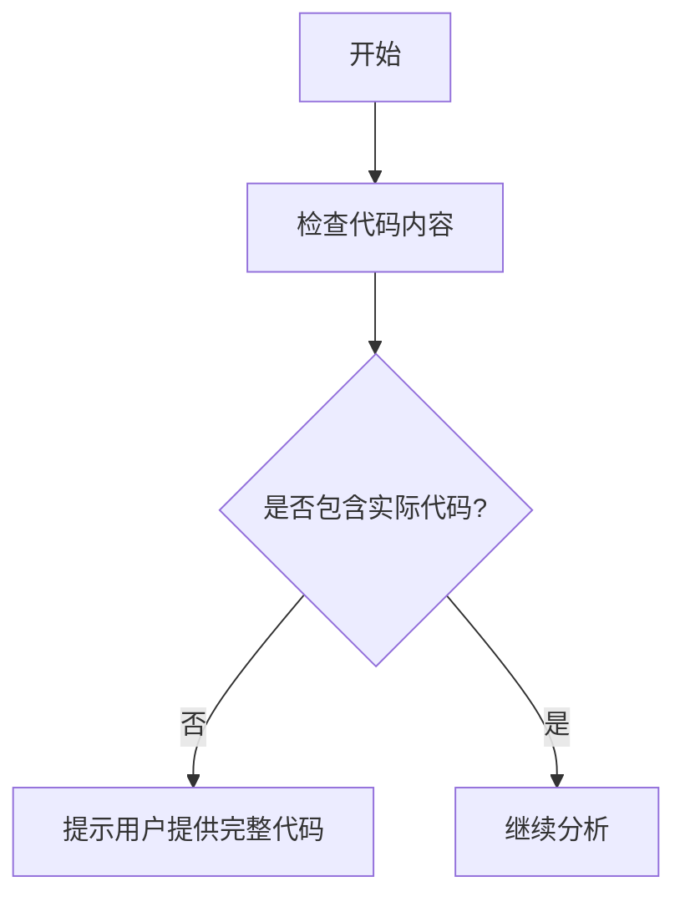

# `graphrag\tests\unit\load_config\__init__.py` 详细设计文档

提供的源代码仅包含版权声明头（Copyright (c) 2024 Microsoft Corporation.），未包含任何实际的代码实现。因此无法进行完整的设计文档分析。

## 整体流程



## 类结构

```
无类层次结构（代码为空）
```

## 全局变量及字段


    

## 全局函数及方法


## 关键组件


由于提供的源代码仅包含版权声明，未包含实际的代码实现，因此无法识别出具体的组件、类、方法或功能逻辑。

### 一段话描述

无（代码中仅包含版权声明，无实际功能代码）

### 文件的整体运行流程

无（代码中仅包含版权声明，无实际功能代码）

### 类的详细信息

无（代码中仅包含版权声明，无实际功能代码）

### 关键组件信息

无（代码中仅包含版权声明，无实际功能代码）

### 潜在的技术债务或优化空间

无（代码中仅包含版权声明，无实际功能代码）

### 其它项目

无（代码中仅包含版权声明，无实际功能代码）


## 问题及建议


### 已知问题

-   **代码缺失**：提供的代码仅包含版权声明和 MIT 许可证声明，未包含任何实际功能代码或模块实现，无法进行完整的技术债务分析。

### 优化建议

-   **提供完整代码**：请提供完整的源代码文件（如 `__init__.py`、`main.py` 或其他业务逻辑文件），以便进行全面的架构分析和设计文档生成。
-   **补充项目结构信息**：建议同时提供项目的目录结构、依赖配置文件（如 `requirements.txt`、`pyproject.toml`），以及任何相关的配置文件或模块说明。
-   **明确功能需求**：在提供代码后，请补充该模块的核心功能描述、预期使用场景和集成方式，以便生成更精准的设计文档。


## 其它


### 设计目标与约束

由于提供的代码仅包含版权声明（MIT License），未包含任何功能实现代码，因此无法确定具体的设计目标和约束。通常设计目标应包含性能要求（如响应时间、吞吐量）、可扩展性目标、安全性要求、兼容性要求等。约束条件应包含技术约束（如编程语言版本、依赖库版本）、资源约束（如内存限制、存储限制）、业务约束（如合规性要求）等。

### 错误处理与异常设计

由于代码中未包含任何功能实现，无法提供具体的异常类型定义、错误码体系、异常处理策略等信息。通常应包含异常继承体系、错误码定义、全局异常处理器、错误日志规范等内容。

### 数据流与状态机

代码中未包含任何数据处理逻辑，因此无法提供数据流图或状态机定义。通常应包含数据输入来源、数据处理流程、数据输出目标、状态转换条件、状态机定义等内容。

### 外部依赖与接口契约

代码中未包含任何外部依赖引用或接口定义。通常应包含第三方库依赖、API接口定义、接口版本管理、依赖版本兼容矩阵等内容。

### 安全性设计

由于代码中未包含任何功能实现，无法评估安全性相关设计。通常应包含身份认证机制、授权策略、数据加密方案、输入验证规则、安全审计日志等内容。

### 性能与监控

代码中未包含任何性能相关的实现。通常应包含性能指标定义、监控点设置、日志记录规范、告警阈值定义、性能优化策略等内容。

### 部署与配置

代码中未包含任何部署或配置相关的内容。通常应包含部署架构、配置文件定义、环境变量要求、容器化方案、CI/CD流程等内容。

### 测试策略

代码中未包含任何测试代码。通常应包含单元测试覆盖率要求、集成测试策略、端到端测试场景、性能测试计划、测试数据管理等内容。

### 版本演进与兼容性

代码中未包含任何功能实现，无法提供版本演进计划。通常应包含版本号规则、API版本管理、向后兼容性策略、升级迁移方案等内容。

### 总结说明

提供的代码文件仅包含MIT许可证的版权声明，不包含任何功能性代码实现。因此，无法按照标准详细设计文档模板填充具体的技术细节、类结构、方法定义、数据流程等信息。如需生成完整的详细设计文档，请提供包含实际功能实现的代码文件。


    