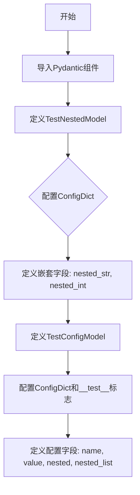

# `graphrag\tests\unit\load_config\config.py` 详细设计文档

该文件定义了用于load_config单元测试的Pydantic配置模型，包含嵌套模型和配置字段，用于测试配置加载功能。

## 整体流程



## 类结构

```
BaseModel (Pydantic基类)
├── TestNestedModel (嵌套测试模型)
└── TestConfigModel (配置测试模型)
```

## 全局变量及字段


### `__test__`
    
测试标志，用于标识此类是否为测试类，设置为False表示非测试类

类型：`bool`
    


### `TestNestedModel.nested_str`
    
嵌套字符串字段

类型：`str`
    


### `TestNestedModel.nested_int`
    
嵌套整数字段

类型：`int`
    


### `TestConfigModel.name`
    
名称字段

类型：`str`
    


### `TestConfigModel.value`
    
值字段

类型：`int`
    


### `TestConfigModel.nested`
    
嵌套模型字段

类型：`TestNestedModel`
    


### `TestConfigModel.nested_list`
    
嵌套模型列表字段

类型：`list[TestNestedModel]`
    
    

## 全局函数及方法


## 关键组件


### TestNestedModel

一个嵌套的 Pydantic 测试模型，用于测试配置加载功能，包含字符串和整数两个字段，并配置为禁止额外字段。

### TestConfigModel

主测试配置模型，包含名称、值、嵌套模型和嵌套模型列表字段，使用 Pydantic 的 ConfigDict 配置禁止额外字段，并设置了 __test__ = False 标志。

### model_config 配置

使用 ConfigDict(extra="forbid") 配置 Pydantic 模型，禁止接受定义以外的额外字段，确保配置严格性。

### Field 描述

使用 Pydantic Field 为每个字段提供描述信息，用于文档化和测试验证目的。


## 问题及建议


### 已知问题

-   `__test__ = False` 属性放置位置不规范：该类属性直接定义在类体内，容易与实例属性或方法混淆，且这种用法不是Python标准约定，可能导致代码阅读者困惑
-   字段缺少默认值导致灵活性不足：所有字段均为必填字段，缺乏默认值设置，在测试场景中需要显式填充所有字段，增加了测试代码的编写负担
-   验证规则过于简单：虽然使用了 `extra="forbid"` 防止额外字段，但缺少对字段值的具体约束（如字符串长度、整数范围、列表长度等），无法有效验证数据的合法性
-   重复的模型配置：两个类都定义了相同的 `ConfigDict(extra="forbid")`，存在代码重复，如需修改配置需要在多处更新

### 优化建议

-   将 `__test__` 属性改为类方法或移动到测试文件层面定义，避免污染业务模型类
-   为可选字段添加默认值或使用 `Optional` 类型标注，提高模型灵活性，例如：`name: str = Field(default="default_name", description="Name field.")`
-   增加字段验证规则，如 `Field(min_length=1, max_length=100)` 或自定义 validator，提升数据合法性保障
-   抽取公共配置到基类或 mixin 中，例如创建 `BaseConfigModel` 类继承 `BaseModel`，统一管理 `model_config`，减少代码重复
-   考虑添加 `populate_by_name` 配置以支持别名兼容，或添加 `serde_json` 相关的序列化配置以满足不同场景需求

## 其它


### 设计目标与约束

本代码的设计目标是创建用于 `load_config` 单元测试的配置模型，验证配置加载功能对 Pydantic 模型的解析和验证能力。约束条件包括：使用 Pydantic v2 的 `ConfigDict` 配置，强制禁止额外字段（`extra="forbid"`），确保配置模型在测试场景下的严格验证。

### 错误处理与异常设计

代码本身不包含显式的错误处理逻辑，主要依赖 Pydantic 内置的验证机制。当提供无效数据时，Pydantic 会抛出 `ValidationError`，包含字段级别错误信息。测试代码应捕获该异常并验证错误消息的准确性。

### 外部依赖与接口契约

主要依赖 `pydantic` 库（v2+），具体包括 `BaseModel`、`ConfigDict`、`Field` 三个核心组件。接口契约方面，`TestConfigModel` 和 `TestNestedModel` 均继承自 `BaseModel`，支持标准的 Pydantic 模型操作（实例化、字典转换、JSON 序列化等）。

### 配置验证规则

- `TestNestedModel`：包含 `nested_str`（字符串）和 `nested_int`（整数）两个必填字段
- `TestConfigModel`：包含 `name`（字符串）、`value`（整数）、`nested`（嵌套模型）、`nested_list`（嵌套模型列表）四个必填字段
- 全局配置：`extra="forbid"` 禁止任何未声明字段传入

### 序列化与反序列化

模型支持完整的序列化能力，可通过 `.model_dump()` 转换为字典，`.model_dump_json()` 转换为 JSON 字符串。嵌套模型和列表字段会自动递归处理。

### 扩展性考虑

当前设计为测试用途，扩展性有限。如需扩展，可考虑：1）添加更多字段类型（如 datetime、UUID）；2）增加嵌套层级；3）添加自定义验证器（`validator`/`field_validator`）；4）支持默认值配置。

### 测试策略建议

建议测试用例包括：1）正常情况下的模型实例化；2）缺少必填字段时的 ValidationError；3）传入额外字段时的 ValidationError；4）类型错误时的 ValidationError；5）序列化/反序列化正确性；6）嵌套模型和列表的处理。

    