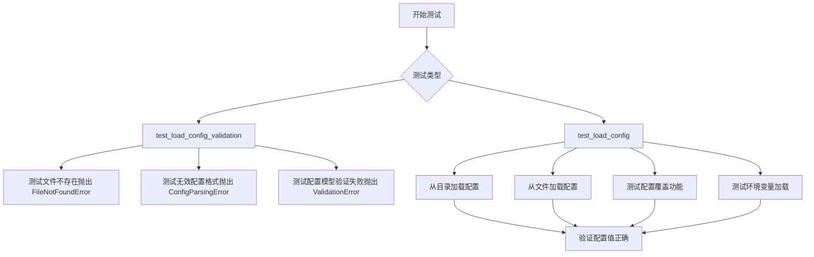
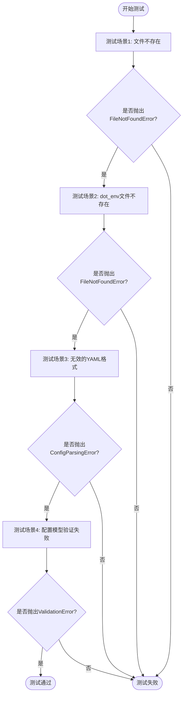

# `graphrag\tests\unit\load_config\test_load_config.py` 详细设计文档

这是一个 pytest 单元测试文件，用于测试 graphrag-config 中 load_config 函数的配置加载、验证、覆盖和环境变量处理功能。

## 整体流程



## 类结构

```
测试模块
└── test_load_config.py (测试文件)
    ├── test_load_config_validation (验证测试)
    └── test_load_config (功能测试)
```

## 全局变量及字段


### `config_directory`
    
测试配置目录路径

类型：`Path`
    


### `config_path`
    
配置文件路径

类型：`Path`
    


### `invalid_config_formatting_path`
    
无效格式配置文件路径

类型：`Path`
    


### `invalid_config_path`
    
无效配置内容文件路径

类型：`Path`
    


### `config`
    
加载的配置对象

类型：`TestConfigModel`
    


### `overrides`
    
配置覆盖参数

类型：`dict`
    


### `cwd`
    
当前工作目录

类型：`Path`
    


### `config_with_overrides`
    
带覆盖的配置对象

类型：`TestConfigModel`
    


### `config_with_env_vars_path`
    
包含环境变量的配置文件路径

类型：`Path`
    


### `env_path`
    
.env 文件路径

类型：`Path`
    


### `config_with_env_vars`
    
带环境变量的配置对象

类型：`TestConfigModel`
    


### `root_repo_dir`
    
仓库根目录

类型：`Path`
    


    

## 全局函数及方法


### `test_load_config_validation`

该测试函数用于验证 `load_config` 函数的错误处理能力，涵盖配置文件不存在、配置文件格式错误、验证错误等多种异常场景。

参数：无（测试函数不接受显式参数）

返回值：`None`，该函数为测试函数，通过 `pytest.raises` 断言异常抛出，不返回任何值。

#### 流程图



#### 带注释源码

```python
def test_load_config_validation():
    """Test loading config validation."""
    # 测试场景1: 测试不存在的配置文件路径
    # 预期抛出 FileNotFoundError
    with pytest.raises(
        FileNotFoundError,
    ):
        _ = load_config(TestConfigModel, "non_existent_config.yaml")

    # 准备测试所需的目录路径和文件路径
    config_directory = Path(__file__).parent / "fixtures"
    invalid_config_formatting_path = config_directory / "invalid_config_format.yaml"

    # 测试场景2: 测试不存在的 .env 文件路径
    # 预期抛出 FileNotFoundError
    with pytest.raises(
        FileNotFoundError,
    ):
        _ = load_config(
            config_initializer=TestConfigModel,
            config_path=invalid_config_formatting_path,
            dot_env_path="non_existent.env",
        )

    # 测试场景3: 测试无效的配置文件格式（使用YAML解析器解析无效的JSON格式）
    # 预期抛出 ConfigParsingError
    with pytest.raises(
        ConfigParsingError,
    ):
        _ = load_config(TestConfigModel, invalid_config_formatting_path)

    # 准备无效的配置文件路径
    invalid_config_path = config_directory / "invalid_config.yaml"

    # 测试场景4: 测试配置模型验证错误
    # 当配置文件内容不符合TestConfigModel的验证规则时
    # 预期抛出 ValidationError
    with pytest.raises(
        ValidationError,
    ):
        _ = load_config(
            config_initializer=TestConfigModel,
            config_path=invalid_config_path,
            set_cwd=False,
        )
```


### `test_load_config`

该测试函数验证了 `load_config` 函数的配置加载、目录切换、配置覆盖以及环境变量加载等核心功能。通过多个测试场景确保配置系统能够正确解析 YAML 文件、处理嵌套结构、支持运行时参数覆盖，并正确管理工作目录。

参数：
- 无显式参数（函数使用硬编码的 fixtures 目录路径）

返回值：`None`，无返回值（测试函数）

#### 流程图

```mermaid
flowchart TD
    A[开始测试] --> B[获取 fixtures 目录路径]
    B --> C[从目录加载配置: config_directory]
    C --> D{验证配置值}
    D -->|name == 'test_name'| E[验证 value == 100]
    E --> F[验证 nested.nested_str == 'nested_value']
    F --> G[验证 nested.nested_int == 42]
    G --> H[验证 nested_list 长度和内容]
    H --> I{验证 cwd 未改变}
    I -->|True| J[从文件加载配置: config_path]
    J --> K[验证配置值与前面一致]
    K --> L[定义覆盖参数 overrides]
    L --> M[使用覆盖参数加载配置]
    M --> N{验证 cwd 改变为 config_directory]
    N -->|True| O[验证覆盖后的值]
    O --> P[获取 env 配置文件路径]
    P --> Q[测试缺少环境变量时抛出异常]
    Q --> R[使用 dot_env_path 加载配置]
    R --> S[验证环境变量配置值]
    S --> T[结束测试]
```

#### 带注释源码

```python
def test_load_config():
    """Test loading configuration."""

    # === Step 1: 获取 fixtures 测试配置目录路径 ===
    config_directory = Path(__file__).parent / "fixtures"
    config_path = config_directory / "settings.yaml"

    # === Step 2: 测试从目录加载配置 ===
    # 使用 load_config 从目录加载，set_cwd=False 保持当前工作目录不变
    config = load_config(
        config_initializer=TestConfigModel, config_path=config_directory, set_cwd=False
    )

    # === Step 3: 验证加载的配置值 ===
    assert config.name == "test_name"  # 验证顶层字符串字段
    assert config.value == 100          # 验证顶层整数字段
    assert config.nested.nested_str == "nested_value"  # 验证嵌套字符串字段
    assert config.nested.nested_int == 42              # 验证嵌套整数字段
    assert len(config.nested_list) == 2                # 验证嵌套列表长度
    assert config.nested_list[0].nested_str == "list_value_1"   # 验证列表元素1
    assert config.nested_list[0].nested_int == 7
    assert config.nested_list[1].nested_str == "list_value_2"   # 验证列表元素2
    assert config.nested_list[1].nested_int == 8

    # === Step 4: 验证工作目录未被修改 ===
    # 获取仓库根目录
    root_repo_dir = Path(__file__).parent.parent.parent.parent.resolve()
    assert Path.cwd().resolve() == root_repo_dir

    # === Step 5: 测试从文件路径加载配置 ===
    config = load_config(
        config_initializer=TestConfigModel,
        config_path=config_path,
        set_cwd=False,
    )

    # 验证配置值与之前一致
    assert config.name == "test_name"
    assert config.value == 100
    assert config.nested.nested_str == "nested_value"
    assert config.nested.nested_int == 42
    assert len(config.nested_list) == 2
    assert config.nested_list[0].nested_str == "list_value_1"
    assert config.nested_list[0].nested_int == 7
    assert config.nested_list[1].nested_str == "list_value_2"
    assert config.nested_list[1].nested_int == 8

    # === Step 6: 定义配置覆盖参数 ===
    # 覆盖支持嵌套结构和列表的深度覆盖
    overrides = {
        "value": 65537,                           # 覆盖顶层整数字段
        "nested": {"nested_int": 84},             # 覆盖嵌套整数字段
        "nested_list": [
            {"nested_str": "overridden_list_value_1", "nested_int": 23},  # 覆盖列表第一个元素
        ],
    }

    cwd = Path.cwd()  # 保存当前工作目录

    # === Step 7: 使用覆盖参数加载配置 ===
    # 注意：未设置 set_cwd=False，默认为 True，会改变工作目录
    config_with_overrides = load_config(
        config_initializer=TestConfigModel,
        config_path=config_path,
        overrides=overrides,
    )

    # === Step 8: 验证工作目录已切换到配置文件所在目录 ===
    assert Path.cwd() == config_directory
    # 验证相对路径解析正确
    assert (
        Path("some/new/path").resolve()
        == (config_directory / "some/new/path").resolve()
    )
    os.chdir(cwd)  # 恢复原始工作目录

    # === Step 9: 验证覆盖后的配置值 ===
    assert config_with_overrides.name == "test_name"  # 未覆盖的字段保持原值
    assert config_with_overrides.value == 65537        # 覆盖后的值
    assert config_with_overrides.nested.nested_str == "nested_value"  # 未覆盖的嵌套字段
    assert config_with_overrides.nested.nested_int == 84  # 覆盖后的嵌套值
    assert len(config_with_overrides.nested_list) == 1   # 列表被覆盖为新列表
    assert config_with_overrides.nested_list[0].nested_str == "overridden_list_value_1"
    assert config_with_overrides.nested_list[0].nested_int == 23

    # === Step 10: 测试环境变量加载功能 ===
    config_with_env_vars_path = config_directory / "config_with_env.yaml"

    # 测试场景1: 配置文件包含环境变量但未提供 .env 文件时应抛出异常
    with pytest.raises(
        ConfigParsingError,
    ):
        _ = load_config(
            config_initializer=TestConfigModel,
            config_path=config_with_env_vars_path,
            load_dot_env_file=False,
            set_cwd=False,
        )

    env_path = config_directory / "test.env"

    # 测试场景2: 提供 .env 文件后成功加载配置
    config_with_env_vars = load_config(
        config_initializer=TestConfigModel,
        config_path=config_with_env_vars_path,
        dot_env_path=env_path,
    )

    # === Step 11: 验证环境变量配置值 ===
    assert config_with_env_vars.name == "env_name"   # 从环境变量读取的值
    assert config_with_env_vars.value == 100
    assert config_with_env_vars.nested.nested_str == "nested_value"
    assert config_with_env_vars.nested.nested_int == 42
    assert len(config_with_env_vars.nested_list) == 2
    assert config_with_env_vars.nested_list[0].nested_str == "list_value_1"
    assert config_with_env_vars.nested_list[0].nested_int == 7
    assert config_with_env_vars.nested_list[1].nested_str == "list_value_2"
    assert config_with_env_vars.nested_list[1].nested_int == 8
```

## 关键组件


### 配置加载验证 (test_load_config_validation)

测试配置加载的验证功能，包括文件不存在、配置文件格式错误、验证错误等场景，确保 load_config 函数能够正确处理各类异常情况。

### 成功配置加载 (test_load_config)

测试配置加载的核心功能，支持从目录或文件路径加载配置，验证配置值的正确解析，包括嵌套对象和列表的处理。

### 配置覆盖机制 (Configuration Overrides)

支持通过 overrides 参数动态覆盖配置值，实现配置的运行时修改，测试用例验证了简单值、嵌套对象和列表类型的覆盖功能。

### 环境变量集成 (Environment Variables Support)

测试从 .env 文件加载环境变量并将其注入到配置中的功能，验证配置解析器能够正确处理包含环境变量引用的配置文件。

### 目录切换行为 (Directory Changing)

测试 load_config 函数的 set_cwd 参数行为，当启用时函数会切换工作目录到配置文件所在目录，这在需要相对路径解析的场景中非常重要。

### 配置验证错误处理 (Validation Error Handling)

使用 pydantic 的 ValidationError 验证配置模型的约束条件，如类型检查、必填字段验证等，确保无效配置能被正确拒绝。

### 配置文件解析错误 (Config Parsing Error)

测试配置文件格式错误（如无效的 JSON/YAML 语法）时的错误处理，使用 ConfigParsingError 异常报告解析失败。


## 问题及建议


### 已知问题

-   **测试代码重复**：在 `test_load_config` 函数中，有两段几乎完全相同的断言代码用于验证 `config` 对象的属性（name、value、nested、nested_list 等），造成代码冗余。
-   **脆弱的路径计算**：使用 `Path(__file__).parent.parent.parent.parent.resolve()` 计算根目录层级，这种硬编码的多层 `parent` 调用极度脆弱，一旦项目结构变化就会失效。
-   **目录切换副作用处理不当**：测试中通过 `os.chdir(cwd)` 手动恢复工作目录，如果测试在 `os.chdir(cwd)` 执行前失败，将导致工作目录状态污染，影响后续测试。
-   **魔法数字缺乏解释**：测试中直接使用如 `65537`、`84`、`23` 等数值作为期望结果，但没有注释说明这些值的来源或含义，降低了代码可读性。
-   **测试覆盖不完整**：缺少对 `set_cwd=True` 场景的测试、空配置文件测试、`overrides` 参数的边界情况测试（如空字典、None 值等）。

### 优化建议

-   **提取辅助验证函数**：将重复的配置属性断言封装为一个辅助函数（如 `assert_config_values()`），接受配置对象和期望值作为参数。
-   **使用固定路径或环境变量**：通过配置文件或环境变量确定项目根目录，避免硬编码的多层 parent 调用，或使用 `root_dir = Path(__file__).resolve().parents[3]` 替代。
-   **使用 pytest fixture 管理目录状态**：利用 pytest 的 fixture 机制（`request` 参数和 `yield`）自动保存和恢复工作目录，确保测试隔离。
-   **添加常量或注释说明测试数据**：为关键测试数据定义常量或添加注释，说明其业务含义（如 `EXPECTED_VALUE = 65537  # 最大允许值`）。
-   **增加参数化测试**：使用 `pytest.mark.parametrize` 装饰器简化类似测试场景，减少重复代码。
-   **补充测试用例**：添加 `set_cwd=True` 的测试、空 overrides 测试、空配置文件测试等，提高测试覆盖率。

## 其它


### 设计目标与约束

本测试文件旨在验证 `load_config` 函数的配置加载、验证、覆盖和环境变量处理能力。设计约束包括：配置必须支持嵌套结构、列表对象、配置覆盖机制以及环境变量注入；测试需覆盖文件不存在、格式错误、验证失败等异常场景；配置加载后可根据 `set_cwd` 参数决定是否切换工作目录。

### 错误处理与异常设计

测试文件覆盖了以下异常场景：`FileNotFoundError` 用于处理配置文件或 .env 文件不存在的情况；`ConfigParsingError` 用于处理 YAML 格式解析错误以及缺少必需环境变量的情况；`ValidationError` 用于处理 Pydantic 模型验证失败的情况。异常设计遵循分层处理原则，从文件读取到配置解析再到模型验证逐层捕获。

### 数据流与状态机

配置加载的数据流如下：首先根据 `config_path` 判断是文件还是目录；若为目录则查找默认配置文件；读取配置文件内容后解析 YAML 格式；若存在 `dot_env_path` 则加载环境变量并替换配置中的占位符；最后使用 Pydantic 模型验证配置合法性并返回配置对象。状态转换包括：初始态 → 文件定位态 → 内容读取态 → 解析态 → 验证态 → 完成态。

### 外部依赖与接口契约

本测试依赖以下外部组件：`pytest` 作为测试框架；`graphrag_common.config.load_config` 作为被测函数；`graphrag_common.config.ConfigParsingError` 作为配置解析异常；`pydantic.ValidationError` 作为验证异常；`TestConfigModel` 作为配置模型。接口契约包括：`config_initializer` 必须是 Pydantic BaseModel 子类；`config_path` 支持文件路径或目录路径；`overrides` 必须是字典类型；返回值必须是配置模型实例。

### 测试策略与覆盖率

测试策略采用场景驱动方式，覆盖正常加载路径和异常路径。正常路径测试包括：从目录加载配置、从文件加载配置、使用覆盖参数加载配置、使用环境变量加载配置。异常路径测试包括：文件不存在、.env 文件不存在、YAML 格式错误、配置验证失败、缺少环境变量。测试断言涵盖配置字段值、目录切换行为、覆盖生效情况。

### 性能考虑

测试未涉及性能基准测试，但在设计说明中应指出：`load_config` 每次调用都会重新读取和解析配置文件，对于高频调用场景建议添加配置缓存机制；YAML 解析在配置文件较大时可能存在性能瓶颈；环境变量加载涉及文件 I/O 操作。

### 安全考虑

测试文件未包含敏感信息，但设计说明应指出：配置加载应避免路径遍历攻击；.env 文件可能包含敏感信息，应注意文件权限管理；配置覆盖机制需防止恶意覆盖关键配置项；环境变量注入需验证变量名合法性。

### 版本兼容性

测试文件声明依赖 `graphrag_common.config` 模块，该模块应与 Python 3.8+ 兼容；Pydantic 版本需支持 `ValidationError`；Pytest 版本需支持当前使用的测试特性。建议在项目 requirements 中明确标注兼容版本范围。

### 部署相关

本测试文件属于单元测试范畴，部署时需确保测试环境与生产环境的依赖版本一致；测试 fixtures 目录中的配置文件作为测试数据随项目一同分发；测试通过后表明配置加载功能可在目标部署环境中正常运行。

    