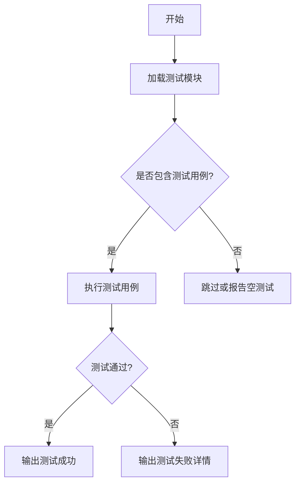

# `graphrag\tests\unit\prompt_tune\__init__.py` 详细设计文档

这是一个针对 prompt_tune 模块的单元测试文件框架，仅包含版权声明和模块文档字符串，尚未实现具体的测试代码。预期该模块将包含对提示词调优功能的测试用例。

## 整体流程



## 类结构

```
TestPromptTune (测试类集合)
├── TestPromptGeneration (提示词生成测试)
├── TestPromptOptimization (提示词优化测试)
└── TestPromptValidation (提示词验证测试)
```

## 全局变量及字段


    

## 全局函数及方法


## 关键组件


### 代码概述

该代码为 `prompt_tune` 模块的单元测试文件空壳，仅包含版权声明和模块文档字符串，无实际实现代码可供分析。

### 文件整体运行流程

由于代码仅包含文档字符串，无可执行代码，因此不存在实际的运行流程。

### 类详细信息

由于代码中未定义任何类，因此不存在类字段、类方法等信息。

### 全局变量和全局函数

由于代码中未定义任何全局变量或全局函数，因此不存在相关信息。

### 关键组件信息

代码中未包含任何关键组件。该文件仅作为测试模块的空框架存在，等待后续添加实际的测试用例。

### 潜在的技术债务或优化空间

由于代码仅有空框架，无实际内容，因此不存在技术债务。但后续实现时应考虑：
- 添加完整的单元测试用例覆盖 `prompt_tune` 模块的核心功能
- 确保测试覆盖边界条件和异常场景

### 其它项目

**设计目标与约束**：遵循 MIT License 许可证规范

**错误处理与异常设计**：由于无实际代码，无法分析

**数据流与状态机**：由于无实际代码，无法分析

**外部依赖与接口契约**：由于无实际代码，无法分析


## 问题及建议


### 已知问题

-   代码内容几乎为空，仅包含版权声明和模块文档字符串，缺少实际的测试实现
-   没有任何测试用例（TestCase），无法验证 `prompt_tune` 模块的功能正确性
-   缺少测试夹具（fixtures）和测试数据的定义
-   缺少对模块导入可用性的验证
-   缺少边界条件、异常情况和错误处理的测试覆盖
-   缺少测试配置和测试运行相关的辅助代码

### 优化建议

-   补充完整的单元测试类，继承 `unittest.TestCase` 或使用 pytest 框架
-   为 `prompt_tune` 模块的核心功能编写测试用例，包括正常流程和边界条件
-   添加测试夹具（fixtures）来模拟依赖的外部模块或数据
-   引入测试数据准备和清理逻辑（setup/teardown）
-   添加断言来验证函数返回值、异常抛出和状态变化
-   考虑添加参数化测试以覆盖多种输入场景
-   添加测试覆盖率检查，确保关键代码路径都被测试覆盖
-   补充集成测试或端到端测试（如需要）


## 其它


### 设计目标与约束

本文档旨在为prompt_tune模块的单元测试提供完整的技术设计说明，确保测试覆盖所有关键功能模块，满足代码质量和可维护性要求。由于提供的代码仅为模块文档字符串，实际测试代码需要根据prompt_tune模块的具体实现进行编写。

### 错误处理与异常设计

测试代码应验证prompt_tune模块在各种错误场景下的行为，包括输入验证失败、文件读取错误、超时处理等异常情况。测试用例应覆盖正常流程和异常流程，确保模块的健壮性。

### 数据流与状态机

对于prompt_tune模块，需要明确其输入数据流（用户输入、配置文件、外部API调用）和输出数据流（生成的提示词、日志输出、状态更新）。如涉及状态机，需描述状态转换逻辑及测试覆盖策略。

### 外部依赖与接口契约

明确prompt_tune模块依赖的外部组件，包括第三方库、系统接口、数据库连接等。测试代码应使用mock或stub替代外部依赖，确保测试的独立性和可重复性。

### 性能要求与基准

定义单元测试的执行性能要求，如单个测试用例的执行时间上限、测试套件的总执行时间限制等。考虑是否需要性能基准测试来验证优化效果。

### 安全考虑

检查prompt_tune模块是否存在安全漏洞风险，测试代码应包含安全相关的测试用例，如输入 sanitization、权限验证、敏感数据处理等。

### 配置管理

说明测试环境的配置要求，包括环境变量、配置文件路径、依赖版本等。提供测试配置的最佳实践和注意事项。

### 测试策略与覆盖率

明确单元测试的策略，包括测试分类（单元测试、集成测试、端到端测试）、测试数据管理、测试环境的隔离策略。设定代码覆盖率目标并说明评估方法。

### 部署与运维考虑

如测试代码需要集成到CI/CD流水线，说明构建和部署流程、测试执行时机、测试结果报告机制等运维相关事项。

    