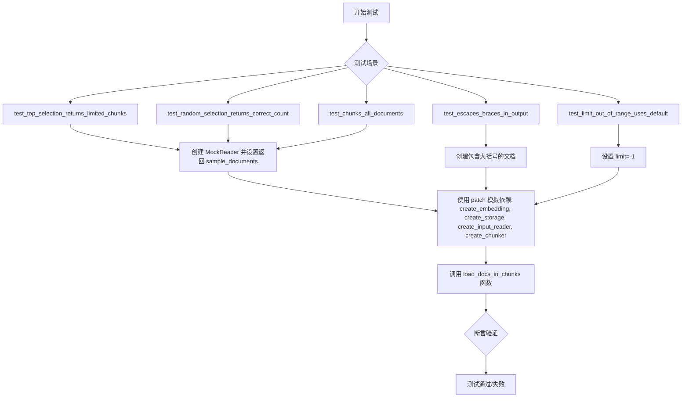
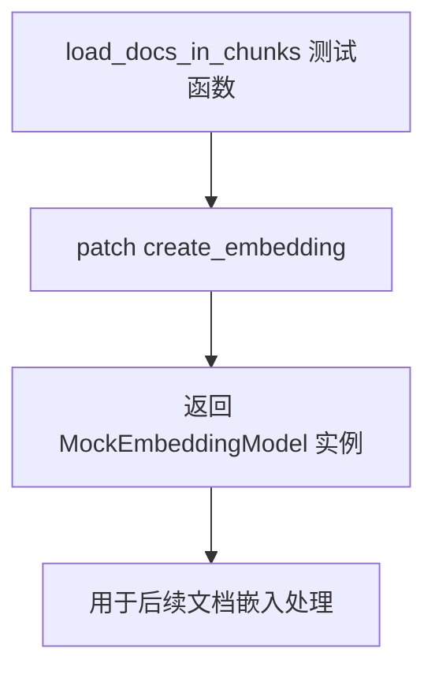
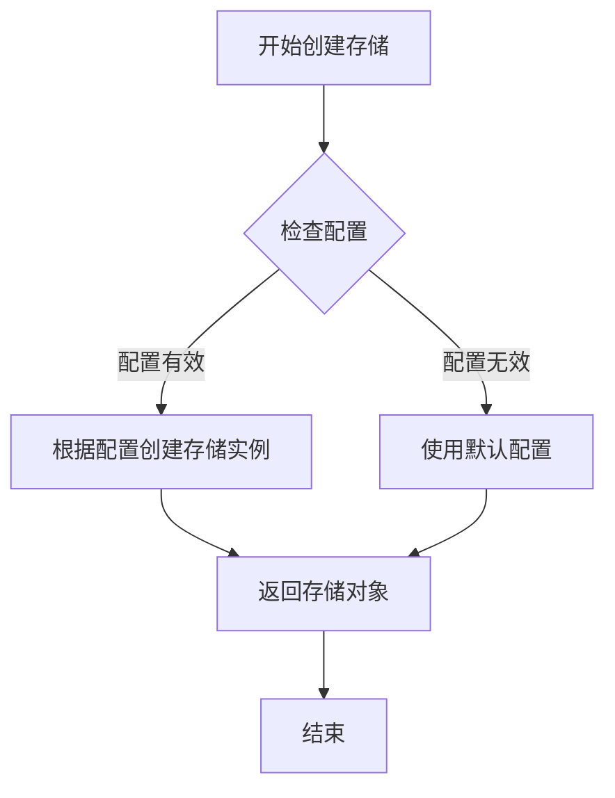
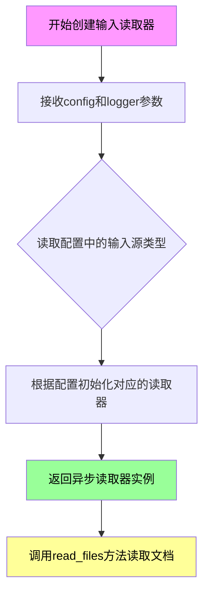
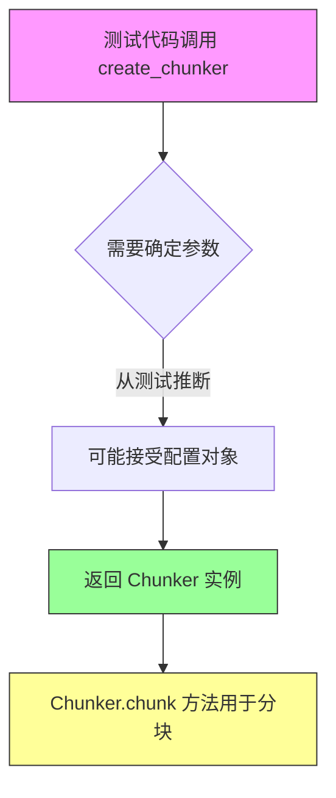
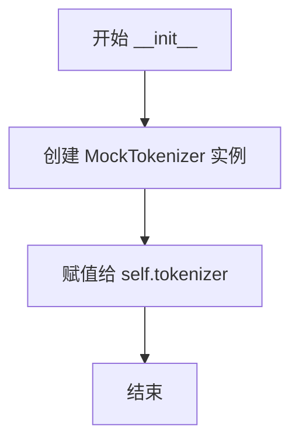
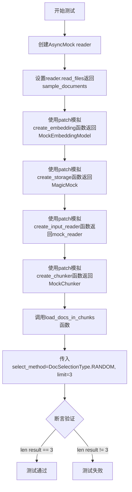
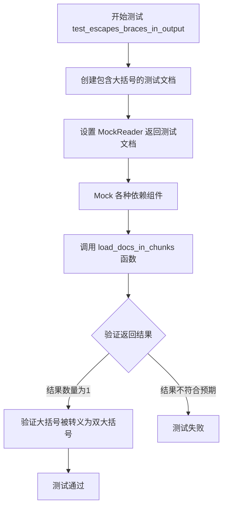
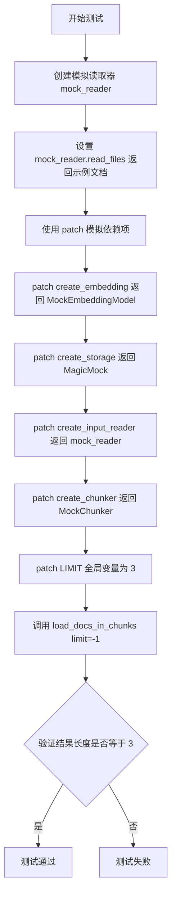
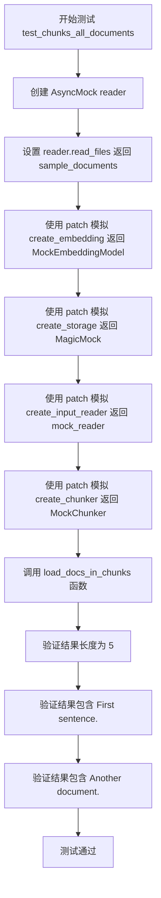

# `graphrag\tests\unit\prompt_tune\test_load_docs_in_chunks.py` 详细设计文档

这是 graphrag 项目中 load_docs_in_chunks 函数的单元测试文件，测试了文档加载、分块和选择功能，包括 TOP 和 RANDOM 两种选择方法、大括号转义处理、限制范围处理以及多文档分块等场景。

## 整体流程



## 类结构

```
测试文件结构 (扁平式，无继承关系)
├── MockTextDocument (数据类 - 模拟文档)
├── MockTokenizer (类 - 模拟分词器)
├── MockChunk (数据类 - 模拟块)
├── MockChunker (类 - 模拟分块器)
├── MockEmbeddingModel (类 - 模拟嵌入模型)
└── TestLoadDocsInChunks (测试类)
    ├── test_top_selection_returns_limited_chunks
    ├── test_random_selection_returns_correct_count
    ├── test_escapes_braces_in_output
    ├── test_limit_out_of_range_uses_default
    └── test_chunks_all_documents
```

## 全局变量及字段


### `logging`
    
Python 标准日志模块，提供日志记录功能

类型：`module`
    


### `Any`
    
typing 中的任意类型，用于类型提示

类型：`typing.Any`
    


### `AsyncMock`
    
异步模拟对象，用于模拟异步函数和方法

类型：`unittest.mock.AsyncMock`
    


### `MagicMock`
    
魔法模拟对象，用于模拟任意属性和方法

类型：`unittest.mock.MagicMock`
    


### `patch`
    
上下文管理器用于模拟函数或类的行为

类型：`unittest.mock.patch`
    


### `pytest`
    
Python 测试框架，用于编写和运行单元测试

类型：`module`
    


### `DocSelectionType`
    
文档选择类型枚举，定义文档选择的策略（如 TOP、RANDOM 等）

类型：`Enum`
    


### `MockTextDocument.id`
    
文档唯一标识

类型：`str`
    


### `MockTextDocument.text`
    
文档文本内容

类型：`str`
    


### `MockTextDocument.title`
    
文档标题

类型：`str`
    


### `MockTextDocument.creation_date`
    
创建日期

类型：`str`
    


### `MockTextDocument.raw_data`
    
原始数据(可选)

类型：`dict[str, Any] | None`
    


### `MockChunk.text`
    
块文本内容

类型：`str`
    


### `MockEmbeddingModel.tokenizer`
    
分词器实例

类型：`MockTokenizer`
    
    

## 全局函数及方法


### `load_docs_in_chunks`

该函数是GraphRAG提示调优模块的文档加载核心函数，负责从输入文档中按指定选择方法（TOP或RANDOM）加载指定数量的文本块，并确保输出内容与Python字符串格式化兼容。

参数：

-  `config`：`Any`（GraphRagConfig类型），包含嵌入模型配置、批处理设置等
-  `select_method`：`DocSelectionType`，文档选择方法（TOP：取前N个块；RANDOM：随机选择）
-  `limit`：`int`，要返回的块数量
-  `logger`：`logging.Logger`，日志记录器

返回值：`list[str]`，返回处理后的文本块列表

#### 流程图

```mermaid
flowchart TD
    A[开始 load_docs_in_chunks] --> B{验证 limit 参数}
    B -->|limit <= 0| C[使用默认 LIMIT 值]
    B -->|limit > 0| D[使用传入的 limit 值]
    C --> E[创建输入读取器]
    D --> E
    E --> F[读取文档: reader.read_files]
    F --> G[创建文本分块器]
    G --> H[对每篇文档进行分块]
    H --> I{select_method 类型}
    I -->|TOP| J[选择前 limit 个块]
    I -->|RANDOM| K[随机选择 limit 个块]
    J --> L[转义花括号: { → {{, } → }}]
    K --> L
    L --> M[返回字符串列表]
```

#### 带注释源码

```python
# 以下为测试代码中对该函数的调用方式，实际实现需参考 graphrag/prompt_tune/loader/input.py

# 调用示例 1: TOP 选择方法，限制返回2个块
result = await load_docs_in_chunks(
    config=mock_config,
    select_method=DocSelectionType.TOP,
    limit=2,
    logger=mock_logger,
)

# 调用示例 2: RANDOM 选择方法，限制返回3个块
result = await load_docs_in_chunks(
    config=mock_config,
    select_method=DocSelectionType.RANDOM,
    limit=3,
    logger=mock_logger,
)

# 调用示例 3: 处理包含花括号的文档内容（测试转义功能）
result = await load_docs_in_chunks(
    config=mock_config,
    select_method=DocSelectionType.TOP,
    limit=1,
    logger=mock_logger,
)

# 调用示例 4: limit为负数时使用默认值
result = await load_docs_in_chunks(
    config=mock_config,
    select_method=DocSelectionType.TOP,
    limit=-1,  # 负数会触发默认LIMIT
    logger=mock_logger,
)
```

---

### 补充说明

**注意**：上述内容基于测试代码推断得出，原型实现代码`graphrag/prompt_tune/loader/input.py`未在本次任务中提供。从测试用例可推断的核心行为包括：

1. **输入处理**：读取配置指定路径的文档
2. **分块策略**：使用chunker将文档分割为句子级块
3. **选择策略**：支持TOP（顺序）和RANDOM（随机）两种选择模式
4. **输出格式化**：对花括号进行双重复制转义（`{` → `{{`, `}` → `}}`）以兼容`str.format()`方法
5. **边界处理**：负数limit会回退到默认常量`LIMIT`的值


### `create_embedding`

从给定的测试代码中，`create_embedding` 函数是从 `graphrag.prompt_tune.loader.input` 模块导入的被测函数。在测试代码中，它通过 `unittest.mock.patch` 进行模拟。

需要注意的是，**该代码文件是测试文件**，并未包含 `create_embedding` 的实际实现源码。该函数在实际的项目源码中有实现，但在此测试文件中仅被 mock。

基于测试中的使用方式，可以推断该函数：

参数：

- `config`：从测试中 `mock_config` 的使用方式推断，应为 `GraphRagConfig` 类型，包含嵌入模型的配置信息（如 `embed_text.embedding_model_id`、`embed_text.batch_size` 等）

返回值：从 `MockEmbeddingModel()` 的实例化和使用方式推断，应返回一个嵌入模型对象，该对象应包含 `tokenizer` 属性

#### 流程图

由于 `create_embedding` 的实现在当前代码中不可见，仅提供其在测试中的调用流程：



#### 带注释源码

**注意**：以下为测试代码中对 `create_embedding` 的调用方式，该函数本身源码未在此文件中提供：

```python
# 测试中的 patch 方式
with patch(
    "graphrag.prompt_tune.loader.input.create_embedding",
    return_value=MockEmbeddingModel(),  # 返回模拟的嵌入模型实例
):
    result = await load_docs_in_chunks(
        config=mock_config,
        select_method=DocSelectionType.TOP,
        limit=2,
        logger=mock_logger,
    )
```

---

## 补充说明

由于提供的代码是**测试文件**，而非 `create_embedding` 函数的实际实现文件，无法提供该函数的完整源码。如需获取 `create_embedding` 的实际实现代码，请查阅 `graphrag/prompt_tune/loader/input.py` 源文件。


### create_storage

`create_storage` 是一个用于创建存储对象的工厂函数，通常在 GraphRAG 的 prompt tune 模块中用于初始化数据存储基础设施。该函数接受配置对象作为主要参数，返回一个可用于数据持久化的存储实例。

参数：

-  `config`：类型：`Any`（GraphRagConfig 或类似配置对象），用于配置存储的类型、连接参数和其他存储相关设置

返回值：`Any`，返回一个存储对象实例（Mock 或真实存储实例），用于后续的数据读写操作

#### 流程图



#### 带注释源码

```python
# 从测试代码中提取的 create_storage 函数调用方式
# 注意：这是基于测试上下文的推断，实际实现可能在 graphrag.prompt_tune.loader.input 模块中

# 测试中的调用方式：
patch(
    "graphrag.prompt_tune.loader.input.create_storage",
    return_value=MagicMock(),
),

# 推断的函数签名和实现逻辑
def create_storage(config: Any) -> Any:
    """
    创建存储实例的工厂函数。
    
    Args:
        config: 包含存储配置的配置对象，可能包括存储类型、路径、连接字符串等参数
        
    Returns:
        返回一个存储对象实例，用于数据的持久化或临时存储
    """
    # 实际实现可能包含：
    # 1. 解析 config 中的存储相关配置
    # 2. 根据配置选择合适的存储类型（内存存储、文件存储、向量存储等）
    # 3. 初始化并返回存储实例
    pass
```

**注意**：由于提供的代码是测试文件，未包含 `create_storage` 函数的具体实现。上述信息是基于测试中对该函数的调用方式（`patch("graphrag.prompt_tune.loader.input.create_storage", return_value=MagicMock())`）以及 GraphRAG 架构的常见模式推断得出的。如需获取准确的函数签名和实现细节，建议查看 `graphrag.prompt_tune.loader.input` 模块的实际源代码。


### `create_input_reader`

从测试代码中提取的 `create_input_reader` 函数信息。这是一个被测试代码mock的工厂函数，用于创建输入文档读取器。

**描述**：
`create_input_reader` 是一个异步工厂函数，用于根据配置创建输入文档读取器实例。该读取器负责从存储中读取原始文档数据，是文档加载流程的关键组件。在测试中通过mock方式模拟其行为，返回一个支持 `read_files` 方法的异步读取器对象。

参数：

-  `config`：`GraphRagConfig`（mock的MagicMock对象），包含嵌入模型配置、批处理设置等参数
-  `logger`：`logging.Logger`，用于记录函数执行过程中的日志信息

返回值：`InputReader`，返回一个异步输入读取器对象，该对象需实现 `read_files` 方法以返回文档列表

#### 流程图



#### 带注释源码

```python
# 测试代码中的mock使用方式
# 由于实际源码未提供，以下为从测试代码推断的函数签名和用途

from typing import Any
from graphrag.prompt_tune.loader.input import create_input_reader

# 函数签名（推测）
async def create_input_reader(
    config: Any,      # GraphRagConfig配置对象
    logger: logging.Logger  # 日志记录器
) -> Any:             # 返回输入读取器实例
    """
    创建输入文档读取器的工厂函数。
    
    根据config中的配置信息，创建对应的文档读取器实例。
    读取器负责从文件系统或存储中读取原始文档数据。
    
    Args:
        config: 包含输入源配置、存储配置等信息的配置对象
        logger: 用于记录读取器创建和读取过程日志的 logger 实例
    
    Returns:
        返回一个异步输入读取器对象，该对象需实现:
        - read_files() -> List[TextDocument]: 异步读取文件并返回文档列表
    """
    pass  # 实际实现位于 graphrag/prompt_tune/loader/input.py

# 测试中的调用示例
mock_reader = AsyncMock()
mock_reader.read_files.return_value = sample_documents

with patch(
    "graphrag.prompt_tune.loader.input.create_input_reader",
    return_value=mock_reader,
):
    result = await load_docs_in_chunks(...)
```

---

**注意**：由于提供的代码是测试文件，`create_input_reader` 的实际实现源码未包含在给定的代码片段中。以上信息是从测试代码中的mock使用方式推断得出。如需获取完整的函数实现，请参考 `graphrag/prompt_tune/loader/input.py` 源文件。


### `create_chunker`

从测试代码中提取的 `create_chunker` 函数信息。该函数是被测试模块导入并用于创建分块器的工厂函数，在测试中通过 mock 的方式模拟。

参数：

- 无法从测试代码中确定具体参数（实现不在本测试文件中）

返回值：`Chunker`，返回分块器对象，该对象需具备 `chunk(text: str, transform: Any = None) -> list[Chunk]` 方法

#### 流程图



#### 带注释源码

```python
# 从测试代码中提取的 create_chunker 使用方式
# 以下为测试中对该函数的 mock 配置方式

# patch 导入路径
with patch(
    "graphrag.prompt_tune.loader.input.create_chunker",
    return_value=MockChunker(),  # 返回 MockChunker 实例
):
    # 调用 load_docs_in_chunks 时会使用被 patch 的 create_chunker
    result = await load_docs_in_chunks(
        config=mock_config,
        select_method=DocSelectionType.TOP,
        limit=2,
        logger=mock_logger,
    )

# MockChunker 类定义（测试中的模拟实现）
class MockChunker:
    """Mock chunker for testing."""

    def chunk(self, text: str, transform: Any = None) -> list[MockChunk]:
        """Split text into sentence-like chunks."""
        # 按句号分割文本，去除空白
        sentences = [s.strip() for s in text.split(".") if s.strip()]
        # 为每个句子添加句号后缀并包装为 MockChunk 对象
        return [MockChunk(text=s + ".") for s in sentences]


@dataclass
class MockChunk:
    """Mock chunk result."""
    text: str


# 实际 create_chunker 的预期接口（基于测试推断）
# def create_chunker(config: GraphRagConfig) -> Chunker:
#     """根据配置创建分块器"""
#     ...
#     return chunker_instance
```


### `MockTokenizer.encode`

将文本字符串转换为对应的令牌（token）列表，基于字符的简单编码实现。

参数：

-  `text`：`str`，待编码的文本字符串

返回值：`list[int]`，返回文本中每个字符对应的 ASCII/Unicode 码点列表

#### 流程图

```mermaid
flowchart TD
    A[开始 encode] --> B[接收输入 text: str]
    B --> C[遍历字符串中的每个字符]
    C --> D[对每个字符调用 ord 函数获取码点]
    D --> E[将所有码点收集到列表]
    E --> F[返回 list[int]]
```

#### 带注释源码

```python
class MockTokenizer:
    """Mock tokenizer for testing."""

    def encode(self, text: str) -> list[int]:
        """Encode text to tokens (simple char-based).
        
        将输入的文本字符串转换为整数列表，每个字符对应其 Unicode 码点值。
        这是一种简单的基于字符的编码方式，仅用于测试目的。
        
        Args:
            text: 待编码的文本字符串
            
        Returns:
            list[int]: 字符对应的 Unicode 码点列表
        """
        return [ord(c) for c in text]
```

---

#### 补充说明

| 项目 | 说明 |
|------|------|
| **设计目标** | 提供一个轻量级的 Mock Tokenizer 实现，用于单元测试场景，避免依赖真实的外部 tokenizer |
| **编码方式** | 基于 Python 内置 `ord()` 函数，将每个字符转换为其 Unicode 码点值 |
| **使用场景** | 仅用于测试目的，`decode` 方法可逆还原原始文本 |
| **潜在限制** | 1. 仅支持单字符编码，不适用于真实 NLP 任务中的子词（subword）编码<br>2. 对于多字节字符（如中文），每个字符会返回较大的整数，与真实 tokenization 行为不同 |
| **优化建议** | 若需更真实的测试行为，可考虑引入 `tiktoken` 或 `transformers` 的 `PreTrainedTokenizer` 作为真实 Tokenizer |


### `MockTokenizer.decode`

将令牌列表（整数类型）解码为对应的文本字符串，通过将每个整数转换为其对应的字符并拼接实现。

参数：

- `tokens`：`list[int]`，要解码的整数令牌列表，每个整数代表一个字符的 Unicode 码点

返回值：`str`，解码后的文本字符串

#### 流程图

```mermaid
flowchart TD
    A[开始] --> B[输入: tokens list[int]]
    B --> C{遍历 tokens}
    C -->|对于每个 token| D[chr(token) 转换为字符]
    D --> E[拼接所有字符]
    E --> F[输出: str]
    
    style A fill:#f9f,stroke:#333
    style F fill:#9f9,stroke:#333
```

#### 带注释源码

```python
def decode(self, tokens: list[int]) -> str:
    """Decode tokens to text.
    
    将整数令牌列表转换回字符串。
    这是一个简单的字符编解码实现，每个字符的 Unicode 码点
    被存储为整数，解码时通过 chr() 函数恢复为字符。
    
    Args:
        tokens: 整数列表，每个整数代表一个字符的 Unicode 码点
        
    Returns:
        解码后的字符串文本
    """
    # 使用列表推导式将每个整数令牌转换为对应的字符
    # ord() 将字符转换为整数（编码时的逆操作）
    # chr() 将整数转换回字符
    return "".join(chr(t) for t in tokens)
```


### `MockChunker.chunk`

将文本按句号分割为句子块，返回由句子组成的 MockChunk 列表。

参数：

- `text`：`str`，待分割的文本内容
- `transform`：`Any`，可选的文本转换函数，默认为 None

返回值：`list[MockChunk]`，包含分割后句子的 MockChunk 对象列表

#### 流程图

```mermaid
flowchart TD
    A[输入 text] --> B{检查 text 是否为空}
    B -->|否| C[按 '.' 分割文本]
    B -->|是| F[返回空列表]
    C --> D[过滤空字符串并去除首尾空白]
    D --> E[为每个句子添加 '.']
    E --> G[创建 MockChunk 对象列表]
    G --> H[返回 list[MockChunk]]
```

#### 带注释源码

```python
class MockChunker:
    """Mock chunker for testing."""

    def chunk(self, text: str, transform: Any = None) -> list[MockChunk]:
        """Split text into sentence-like chunks."""
        # 按句号分割文本，去除每个句子首尾空白，过滤空字符串
        sentences = [s.strip() for s in text.split(".") if s.strip()]
        # 为每个句子重新添加句号，并包装为 MockChunk 对象返回
        return [MockChunk(text=s + ".") for s in sentences]
```


### `MockEmbeddingModel.__init__`

初始化模拟嵌入模型，创建一个 MockTokenizer 实例作为分词器，用于测试环境。

参数：

- `self`：`MockEmbeddingModel`，隐式参数，表示类的实例本身

返回值：`None`，无返回值（`__init__` 方法）

#### 流程图



#### 带注释源码

```python
class MockEmbeddingModel:
    """Mock embedding model for testing."""

    def __init__(self):
        """Initialize with mock tokenizer."""
        # 创建一个 MockTokenizer 实例并赋值给实例属性 tokenizer
        # 用于在测试中模拟文本编码/解码功能
        self.tokenizer = MockTokenizer()
```


### `TestLoadDocsInChunks.test_top_selection_returns_limited_chunks`

测试 TOP 选择方法返回前 N 个块，验证 `load_docs_in_chunks` 函数在 `DocSelectionType.TOP` 模式下能够正确返回指定数量的前导块。

参数：

- `self`：隐藏的 `TestLoadDocsInChunks` 类实例引用
- `mock_config`：`MagicMock`，测试夹具，提供模拟的 GraphRagConfig 对象，包含 embed_text.embedding_model_id、batch_size、batch_max_tokens 等配置
- `mock_logger`：`logging.Logger`，测试夹具，提供模拟的日志记录器
- `sample_documents`：`list[MockTextDocuments]`，测试夹具，提供模拟的文档列表，包含两个 MockTextDocument 实例

返回值：`None`（测试函数无返回值，通过 assert 断言验证结果）

#### 流程图

```mermaid
flowchart TD
    A[开始测试 test_top_selection_returns_limited_chunks] --> B[创建 AsyncMock reader 对象]
    B --> C[设置 mock_reader.read_files 返回 sample_documents]
    C --> D[使用 patch 模拟多个依赖组件]
    D --> E[create_embedding 返回 MockEmbeddingModel]
    D --> F[create_storage 返回 MagicMock]
    D --> G[create_input_reader 返回 mock_reader]
    D --> H[create_chunker 返回 MockChunker]
    E --> I[调用 load_docs_in_chunks 函数]
    F --> I
    G --> I
    H --> I
    I --> J[传入参数: config=mock_config, select_method=DocSelectionType.TOP, limit=2, logger=mock_logger]
    J --> K{执行异步函数}
    K --> L[断言 len result == 2]
    K --> M[断言 result[0] == First sentence.]
    K --> N[断言 result[1] == Second sentence.]
    L --> O[测试通过]
    M --> O
    N --> O
```

#### 带注释源码

```python
@pytest.mark.asyncio
async def test_top_selection_returns_limited_chunks(
    self, mock_config, mock_logger, sample_documents
):
    """Test TOP selection method returns the first N chunks."""
    # 步骤 1: 创建异步 Mock reader 对象
    mock_reader = AsyncMock()
    # 步骤 2: 配置 mock_reader.read_files 返回预设的示例文档
    mock_reader.read_files.return_value = sample_documents

    # 步骤 3: 使用 patch 上下文管理器模拟所有外部依赖
    with (
        # 模拟 create_embedding 函数，返回 MockEmbeddingModel 实例
        patch(
            "graphrag.prompt_tune.loader.input.create_embedding",
            return_value=MockEmbeddingModel(),
        ),
        # 模拟 create_storage 函数，返回 MagicMock 存储对象
        patch(
            "graphrag.prompt_tune.loader.input.create_storage",
            return_value=MagicMock(),
        ),
        # 模拟 create_input_reader 函数，返回我们配置的 mock_reader
        patch(
            "graphrag.prompt_tune.loader.input.create_input_reader",
            return_value=mock_reader,
        ),
        # 模拟 create_chunker 函数，返回 MockChunker 实例用于分块
        patch(
            "graphrag.prompt_tune.loader.input.create_chunker",
            return_value=MockChunker(),
        ),
    ):
        # 步骤 4: 调用被测试的 load_docs_in_chunks 函数
        # 参数说明:
        # - config: 模拟的配置对象
        # - select_method: DocSelectionType.TOP 表示选择前 N 个块
        # - limit: 2 表示限制返回 2 个块
        # - logger: 模拟的日志记录器
        result = await load_docs_in_chunks(
            config=mock_config,
            select_method=DocSelectionType.TOP,
            limit=2,
            logger=mock_logger,
        )

    # 步骤 5: 验证测试结果
    # 断言 1: 确认返回的块数量为 2
    assert len(result) == 2
    # 断言 2: 确认第一个块是 "First sentence."
    assert result[0] == "First sentence."
    # 断言 3: 确认第二个块是 "Second sentence."
    assert result[1] == "Second sentence."
```


### `TestLoadDocsInChunks.test_random_selection_returns_correct_count`

测试 RANDOM 选择方法能否返回正确数量的文档块（chunks）

参数：

- `self`：`TestLoadDocsInChunks`，测试类实例本身
- `mock_config`：`MagicMock`，模拟的 GraphRagConfig 配置对象，包含 embed_text、concurrent_requests 等配置
- `mock_logger`：`logging.Logger`，模拟的日志记录器，用于记录测试过程中的日志
- `sample_documents`：`list[MockTextDocument]`，包含两个模拟文档的列表，用于测试文档加载和分块

返回值：`None`，该方法为测试方法，无返回值，通过断言验证功能正确性

#### 流程图



#### 带注释源码

```python
@pytest.mark.asyncio
async def test_random_selection_returns_correct_count(
    self, mock_config, mock_logger, sample_documents
):
    """Test RANDOM selection method returns the correct number of chunks."""
    # 创建一个异步 Mock 对象作为 reader，用于模拟文件读取
    mock_reader = AsyncMock()
    # 设置 mock_reader 的 read_files 方法返回 sample_documents
    mock_reader.read_files.return_value = sample_documents

    # 使用 patch 上下文管理器模拟多个依赖项
    with (
        # 模拟 create_embedding 函数，返回 MockEmbeddingModel 实例
        patch(
            "graphrag.prompt_tune.loader.input.create_embedding",
            return_value=MockEmbeddingModel(),
        ),
        # 模拟 create_storage 函数，返回空的 MagicMock
        patch(
            "graphrag.prompt_tune.loader.input.create_storage",
            return_value=MagicMock(),
        ),
        # 模拟 create_input_reader 函数，返回前面创建的 mock_reader
        patch(
            "graphrag.prompt_tune.loader.input.create_input_reader",
            return_value=mock_reader,
        ),
        # 模拟 create_chunker 函数，返回 MockChunker 实例
        patch(
            "graphrag.prompt_tune.loader.input.create_chunker",
            return_value=MockChunker(),
        ),
    ):
        # 调用 load_docs_in_chunks 函数，使用 RANDOM 选择方法，限制返回3个chunks
        result = await load_docs_in_chunks(
            config=mock_config,
            select_method=DocSelectionType.RANDOM,
            limit=3,
            logger=mock_logger,
        )

    # 断言验证返回结果的数量是否为3
    assert len(result) == 3
```


### `TestLoadDocsInChunks.test_escapes_braces_in_output`

该测试方法验证 `load_docs_in_chunks` 函数在处理包含大括号的文档时，能够正确将大括号转义为双大括号，以满足 `str.format()` 的兼容性要求。

参数：

- `self`：`TestLoadDocsInChunks`，测试类实例
- `mock_config`：`MagicMock`，模拟的 GraphRagConfig 配置对象
- `mock_logger`：`logging.Logger`，模拟的日志记录器

返回值：无（使用 pytest 的 assert 语句进行验证）

#### 流程图



#### 带注释源码

```python
@pytest.mark.asyncio
async def test_escapes_braces_in_output(self, mock_config, mock_logger):
    """Test that curly braces are escaped for str.format() compatibility."""
    # 创建包含大括号的测试文档，模拟需要转义的 LaTeX 内容
    docs_with_braces = [
        MockTextDocument(
            id="doc1",
            text="Some {latex} content.",
            title="Doc 1",
            creation_date="2025-01-01",
        ),
    ]

    # 创建异步 Mock Reader，并配置其返回包含大括号的文档
    mock_reader = AsyncMock()
    mock_reader.read_files.return_value = docs_with_braces

    # 使用 patch 模拟所有依赖组件：嵌入模型、存储、读取器、分块器
    with (
        patch(
            "graphrag.prompt_tune.loader.input.create_embedding",
            return_value=MockEmbeddingModel(),
        ),
        patch(
            "graphrag.prompt_tune.loader.input.create_storage",
            return_value=MagicMock(),
        ),
        patch(
            "graphrag.prompt_tune.loader.input.create_input_reader",
            return_value=mock_reader,
        ),
        patch(
            "graphrag.prompt_tune.loader.input.create_chunker",
            return_value=MockChunker(),
        ),
    ):
        # 调用被测试的 load_docs_in_chunks 函数，使用 TOP 选择方法，限制返回1条
        result = await load_docs_in_chunks(
            config=mock_config,
            select_method=DocSelectionType.TOP,
            limit=1,
            logger=mock_logger,
        )

    # 断言：验证返回结果数量为1
    assert len(result) == 1
    # 断言：验证大括号被正确转义为双大括号 {{latex}}，避免 str.format() 格式化错误
    assert "{{latex}}" in result[0]
```


### `TestLoadDocsInChunks.test_limit_out_of_range_uses_default`

该测试方法验证当传入无效的 limit 值（如负数）时，`load_docs_in_chunks` 函数会回退到使用默认的 LIMIT 值。

参数：

- `self`：`TestLoadDocsInChunks`（隐式参数），测试类实例本身
- `mock_config`：`MagicMock`，模拟的 GraphRagConfig 对象，提供配置信息
- `mock_logger`：`logging.Logger`，模拟的日志记录器
- `sample_documents`：`list[MockTextDocument]`，用于测试的示例文档列表

返回值：`None`，测试方法无返回值，通过断言验证行为

#### 流程图



#### 带注释源码

```python
@pytest.mark.asyncio
async def test_limit_out_of_range_uses_default(
    self, mock_config, mock_logger, sample_documents
):
    """Test that invalid limit falls back to default LIMIT."""
    # 创建模拟读取器，用于返回示例文档
    mock_reader = AsyncMock()
    mock_reader.read_files.return_value = sample_documents

    # 使用 patch 模拟所有依赖项和全局变量
    with (
        # 模拟 embedding 模型创建
        patch(
            "graphrag.prompt_tune.loader.input.create_embedding",
            return_value=MockEmbeddingModel(),
        ),
        # 模拟存储创建
        patch(
            "graphrag.prompt_tune.loader.input.create_storage",
            return_value=MagicMock(),
        ),
        # 模拟输入读取器，使用上面创建的 mock_reader
        patch(
            "graphrag.prompt_tune.loader.input.create_input_reader",
            return_value=mock_reader,
        ),
        # 模拟文本分块器
        patch(
            "graphrag.prompt_tune.loader.input.create_chunker",
            return_value=MockChunker(),
        ),
        # 关键：将 LIMIT 全局变量 patch 为 3（默认值）
        patch(
            "graphrag.prompt_tune.loader.input.LIMIT",
            3,
        ),
    ):
        # 调用 load_docs_in_chunks，传入负数 limit
        # 预期行为：使用默认 LIMIT 值 3
        result = await load_docs_in_chunks(
            config=mock_config,
            select_method=DocSelectionType.TOP,
            limit=-1,  # 无效的 limit 值
            logger=mock_logger,
        )

    # 断言：验证返回的结果数量等于默认 LIMIT 值（3）
    # 即验证无效 limit 被正确处理为默认值
    assert len(result) == 3
```


### `TestLoadDocsInChunks.test_chunks_all_documents`

验证当选择方法为 TOP 且限制为 5 时，函数能够正确对所有文档进行分块，并返回包含所有文档内容的分块结果。

参数：

- `self`：`TestLoadDocsInChunks`，测试类实例
- `mock_config`：`MagicMock`，模拟的 GraphRagConfig 配置对象，包含 embed_text、concurrent_requests 等配置
- `mock_logger`：`logging.Logger`，模拟的日志记录器
- `sample_documents`：`list[MockTextDocument]`，包含两个测试文档的列表，每个文档有 id、text、title、creation_date 字段

返回值：`list[str]`，分块后的文本列表，包含所有文档的分块结果

#### 流程图



#### 带注释源码

```python
@pytest.mark.asyncio
async def test_chunks_all_documents(
    self, mock_config, mock_logger, sample_documents
):
    """Test that all documents are chunked correctly."""
    # 创建一个异步 Mock reader 用于模拟文件读取
    mock_reader = AsyncMock()
    # 设置 mock_reader 的 read_files 方法返回 sample_documents
    mock_reader.read_files.return_value = sample_documents

    # 使用 patch 上下文管理器模拟多个依赖项
    with (
        # 模拟 create_embedding 函数返回 MockEmbeddingModel 实例
        patch(
            "graphrag.prompt_tune.loader.input.create_embedding",
            return_value=MockEmbeddingModel(),
        ),
        # 模拟 create_storage 函数返回 MagicMock 实例
        patch(
            "graphrag.prompt_tune.loader.input.create_storage",
            return_value=MagicMock(),
        ),
        # 模拟 create_input_reader 函数返回 mock_reader
        patch(
            "graphrag.prompt_tune.loader.input.create_input_reader",
            return_value=mock_reader,
        ),
        # 模拟 create_chunker 函数返回 MockChunker 实例
        patch(
            "graphrag.prompt_tune.loader.input.create_chunker",
            return_value=MockChunker(),
        ),
    ):
        # 调用 load_docs_in_chunks 函数，使用 TOP 选择方法，限制为 5
        result = await load_docs_in_chunks(
            config=mock_config,
            select_method=DocSelectionType.TOP,
            limit=5,
            logger=mock_logger,
        )

    # 断言：验证返回的分块数量为 5
    assert len(result) == 5
    # 断言：验证第一个文档的分块 "First sentence." 在结果中
    assert "First sentence." in result
    # 断言：验证第二个文档的分块 "Another document." 在结果中
    assert "Another document." in result
```

## 关键组件


### load_docs_in_chunks

核心被测函数，负责从文档中加载和分块文本，支持TOP和RANDOM两种选择方法，并处理限制参数和花括号转义。

### MockTextDocument

模拟文本文档数据类，用于测试，包含id、text、title、creation_date和raw_data字段。

### MockTokenizer

模拟分词器，实现encode和decode方法，将文本转换为token列表（基于字符的简单实现）。

### MockChunk

模拟分块结果数据类，包含text字段表示分块后的文本内容。

### MockChunker

模拟分块器，实现chunk方法，按句号分割文本为句子级别的分块。

### MockEmbeddingModel

模拟嵌入模型，包含MockTokenizer用于文本编码。

### DocSelectionType

文档选择类型枚举，定义TOP和RANDOM两种选择方法。

### mock_config fixture

模拟GraphRagConfig配置对象，包含embed_text和concurrent_requests相关配置。

### mock_logger fixture

创建测试用日志记录器。

### sample_documents fixture

提供测试用示例文档列表，包含两个MockTextDocument实例。

### TestLoadDocsInChunks

测试类，包含五个异步测试用例：test_top_selection_returns_limited_chunks、test_random_selection_returns_correct_count、test_escapes_braces_in_output、test_limit_out_of_range_uses_default、test_chunks_all_documents。


## 问题及建议


### 已知问题

- **MockTokenizer 实现缺陷**：`MockTokenizer.encode()` 返回字符的 ASCII 码，但 `decode()` 使用 `chr()` 无法正确处理大于 127 的值，非 ASCII 文本会导致测试失败
- **MockChunker 过于简化**：仅按句号分割，无法模拟真实分块器的行为（如重叠、长度限制等），可能遗漏边界情况测试
- **全局变量 patch 方式错误**：`test_limit_out_of_range_uses_default` 中直接 patch `LIMIT` 为整数值无效，应 patch 模块属性或使用可变容器
- **MagicMock 过度使用**：`mock_config` 使用大量 MagicMock 创建嵌套对象，掩盖配置接口变化，且未验证关键配置是否被正确传递
- **边界情况覆盖不足**：缺少空文档列表、None 文档、空字符串文档、文档仅有空白字符等边界测试
- **字段验证不完整**：未测试 `title`、`creation_date`、`raw_data` 字段是否被正确处理和使用
- **选择方法覆盖不全**：仅测试 `TOP` 和 `RANDOM`，未覆盖 `SIMILAR` 等其他 `DocSelectionType` 可能的行为
- **断言过于宽松**：部分测试仅验证数量（如 `assert len(result) == 3`），未验证返回内容的正确性和顺序

### 优化建议

- 修复 `MockTokenizer` 实现，使用更可靠的编解码逻辑或直接返回 token ID 列表
- 增强 `MockChunker` 支持参数（如 chunk_size、overlap），或使用真实分块器的轻量 mock
- 修正全局变量 patch 方式，确保 LIMIT 测试正确验证默认值回退逻辑
- 减少 MagicMock 使用，定义具体的数据类或使用 `spec=` 限制 mock 范围
- 添加边界情况测试用例：空列表、None 值、空字符串、limit=0 等
- 完善字段级验证，确保文档元数据被正确传递和处理
- 扩展 `DocSelectionType` 各类型的测试覆盖
- 加强断言，验证返回内容的具体值、顺序及相关元数据

## 其它


### 设计目标与约束

本模块的设计目标是为GraphRag系统的prompt tuning功能提供文档加载和分块能力，支持多种文档选择策略（TOP、RANDOM），并确保输出符合str.format()兼容性要求。核心约束包括：必须通过配置文件管理嵌入模型和分块参数，文档选择受限于预定义的DocSelectionType枚举值，limit参数需进行边界校验并支持默认值回退。

### 错误处理与异常设计

测试用例体现了以下错误处理场景：当limit参数为负数时，系统会回退到默认常量LIMIT的值；花括号字符在输出前会被转义为双花括号形式以兼容str.format()；文档读取、嵌入模型创建、存储初始化等外部依赖均通过Mock对象隔离，测试环境不依赖真实外部服务。生产环境应考虑为read_files返回空列表、create_embedding/create_storage/create_chunker创建失败、config参数缺失等场景设计具体异常类型。

### 数据流与状态机

数据流从配置文件开始，依次经过create_input_reader读取原始文档、create_chunker执行文本分块、create_embedding生成向量表示（TOP模式用于排序）、create_storage持久化中间结果，最终按select_method策略筛选limit数量的chunk返回。状态转换包括：文档加载状态→分块状态→向量化状态→选择状态→返回状态。TOP选择依赖嵌入向量相似度排序，RANDOM选择使用随机采样算法。

### 外部依赖与接口契约

主要外部依赖包括：graphrag.prompt_tune.loader.input模块的load_docs_in_chunks函数（待实现）、graphrag.prompt_tune.types模块的DocSelectionType枚举、graphrag.prompt_tune.loader.input模块的create_embedding/create_storage/create_input_reader/create_chunker工厂函数。接口契约方面：load_docs_in_chunks接收config(MagicMock)、select_method(DocSelectionType枚举)、limit(int正数)、logger(logging.Logger)，返回list[str]；create_embedding返回支持encode/decode方法的对象；create_input_reader.read_files返回AsyncIterator或List[TextDocument]；create_chunker.chunk返回list[Chunk]。

### 关键组件信息

MockTextDocument：模拟文档数据结构，包含id、text、title、creation_date和raw_data字段，用于测试环境替代真实文档对象。MockTokenizer：模拟分词器，实现encode/decode接口将文本与token列表相互转换，测试中采用字符ASCII码作为简单实现。MockChunker：模拟分块器，将文本按句号分割生成MockChunk列表，验证分块逻辑不依赖真实NLP库。MockEmbeddingModel：模拟嵌入模型包装器，提供tokenizer属性供配置查询，测试中不执行真实向量计算。TestLoadDocsInChunks：测试类，聚合所有单元测试用例，覆盖TOP选择、RANDOM选择、花括号转义、limit边界处理、全文档分块等场景。

### 潜在技术债务与优化空间

当前测试完全使用Mock对象，未包含集成测试或端到端测试覆盖；MockChunker仅按句号分割，未模拟真实的语义分块策略（如滑窗、重叠等）；未测试大规模文档集的性能表现和内存占用；LIMIT常量通过patch修改的方式不够规范，应通过config参数或环境变量传递；缺少对select_method无效枚举值的异常测试；日志记录功能未被充分验证（仅传入logger参数但未检查日志输出）。

### 测试覆盖范围与边界条件

测试覆盖了正常流程（TOP选择返回前N个、RANDOM选择返回指定数量）、边界条件（limit为负数回退到默认值、limit超过实际chunks数量）、特殊字符处理（花括号转义）以及多文档场景。缺失的边界条件测试包括：limit为零时的行为、select_method为None时的处理、documents列表为空时的返回结果、text字段为空字符串或仅含空白字符的文档、create_*工厂函数抛出异常时的错误传播。
    