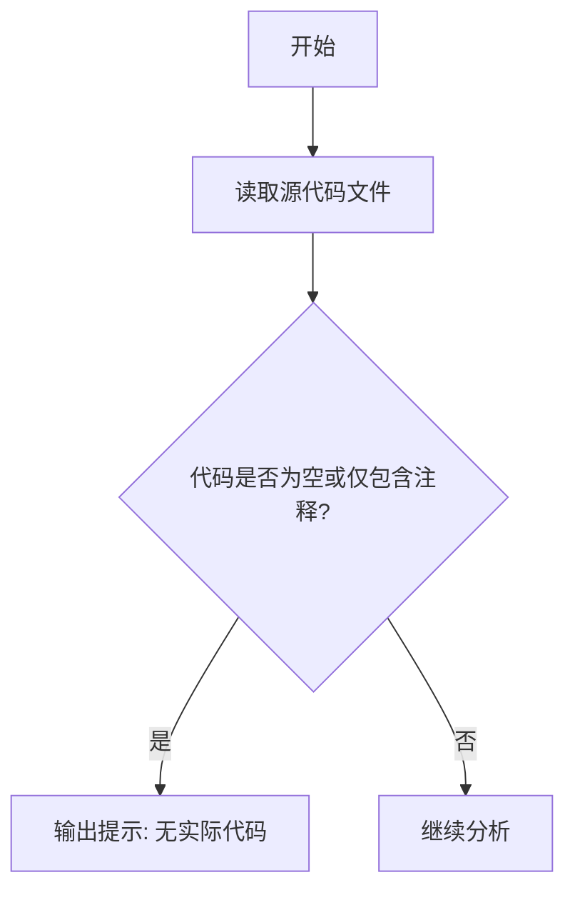

# `graphrag\tests\unit\query\__init__.py` 详细设计文档

该代码文件仅包含版权声明头部信息，无实际功能实现代码，无法进行完整的功能分析和设计文档生成。

## 整体流程



## 类结构

```
该代码文件不包含任何类定义
```

## 全局变量及字段


    

## 全局函数及方法


## 关键组件


### 代码概览

该代码仅包含版权声明和MIT许可证头部信息，不包含任何功能性实现代码，因此无法提取关键组件、类、方法或设计文档所需的完整信息。

### 潜在问题

由于提供的源代码仅包含许可证头部（License Header），缺少实际的实现代码，因此无法进行以下分析：
- 核心功能描述
- 文件运行流程
- 类详细信息（字段、方法）
- 全局变量和全局函数
- Mermaid流程图
- 带注释的源码
- 关键组件识别（如张量索引、惰性加载、反量化、量化策略等）
- 技术债务或优化空间

### 建议

如需生成完整的详细设计文档，请提供包含实际功能实现的源代码文件。


## 问题及建议


### 已知问题

-   该文件仅包含版权声明和许可证信息，没有任何实际的功能代码或模块实现，无法进行有效的架构分析和设计
-   缺少代码文件的基础结构（如模块文档字符串、导入语句、函数或类定义）
-   无法从该文件中提取类、方法、全局变量或任何业务逻辑进行技术债务分析

### 优化建议

-   在添加实际业务代码之前，建议先建立基础的代码骨架，包括模块级文档字符串（docstring）来说明该模块的目的和功能
-   如果这是一个入口文件或初始化文件，建议明确其职责范围并添加相应的功能实现
-   考虑在此文件中添加版本信息或构建元数据，方便后续的版本管理和追踪


## 其它


### 设计目标与约束

（由于提供的代码仅包含版权声明，无实际功能代码，暂无法提供具体的设计目标与约束信息）

### 错误处理与异常设计

（由于提供的代码仅包含版权声明，无实际功能代码，暂无法提供具体的错误处理与异常设计信息）

### 数据流与状态机

（由于提供的代码仅包含版权声明，无实际功能代码，暂无法提供具体的数据流与状态机信息）

### 外部依赖与接口契约

（由于提供的代码仅包含版权声明，无实际功能代码，暂无法提供具体的外部依赖与接口契约信息）

### 安全性考虑

（由于提供的代码仅包含版权声明，无实际功能代码，暂无法提供具体的安全性考虑信息）

### 性能要求与基准

（由于提供的代码仅包含版权声明，无实际功能代码，暂无法提供具体的性能要求与基准信息）

### 兼容性设计

（由于提供的代码仅包含版权声明，无实际功能代码，暂无法提供具体的兼容性设计信息）

### 配置与扩展性

（由于提供的代码仅包含版权声明，无实际功能代码，暂无法提供具体的配置与扩展性信息）

### 测试策略

（由于提供的代码仅包含版权声明，无实际功能代码，暂无法提供具体的测试策略信息）

### 部署与运维注意事项

（由于提供的代码仅包含版权声明，无实际功能代码，暂无法提供具体的部署与运维注意事项信息）


    