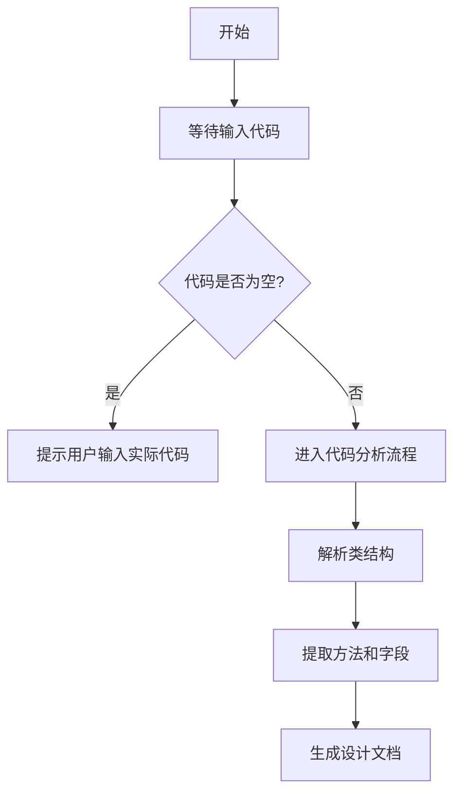

# `graphrag\tests\unit\query\context_builder\__init__.py` 详细设计文档

无法生成有效分析：提供的源代码仅包含版权声明（# Copyright (c) 2024 Microsoft Corporation. # Licensed under the MIT License），缺少实际的代码实现。请提供完整的源代码以便进行详细设计文档的生成。

## 整体流程



## 类结构

```
等待代码输入后进行类结构分析...
```

## 全局变量及字段


    

## 全局函数及方法


## 关键组件


## 一段话描述

该代码文件仅包含 MIT 许可证头部声明，无实际功能实现代码，无法进行进一步的架构分析。

## 文件的整体运行流程

由于源代码仅包含版权声明和许可证信息，该文件不包含任何可执行的业务逻辑代码，因此不存在运行流程。

## 类的详细信息

由于源代码中不存在任何类定义，无法提供类的详细信息。

## 关键组件信息

由于源代码中不包含实际实现代码，无法识别具体的组件（如张量索引、惰性加载、反量化支持、量化策略等）。

## 潜在的技术债务或优化空间

由于缺乏源代码实现，无法评估技术债务或优化空间。

## 其它项目

### 设计目标与约束

未知（缺乏源代码）

### 错误处理与异常设计

未知（缺乏源代码）

### 数据流与状态机

未知（缺乏源代码）

### 外部依赖与接口契约

未知（缺乏源代码）


## 问题及建议


### 已知问题

-   代码文件仅包含版权声明和许可证信息，没有任何实际的功能实现代码
-   无法进行类分析、方法分析、流程分析等技术文档的编写
-   缺少具体的业务逻辑实现，无法评估技术债务和优化空间

### 优化建议

-   提供完整的代码实现文件，以便进行详细的技术分析和文档编写
-   确保代码包含实际的业务逻辑、类定义、函数实现等内容
-   补充代码后，可基于实际实现进行架构设计文档、性能优化建议等技术输出


## 其它


### 一段话描述

该代码文件目前仅包含版权声明和MIT许可证声明，无实际功能实现。根据文件头部信息（Copyright (c) 2024 Microsoft Corporation），该文件属于微软公司2024年度开源项目，可能是某个大型项目（如Azure相关、开发者工具或AI/ML框架）的组成部分之一。

### 文件的整体运行流程

由于代码中不包含任何可执行语句或函数定义，该文件本身不参与任何运行流程。该文件作为源代码仓库的一部分存在，主要起到法律声明和许可证授权的作用。

### 类结构

由于代码中未定义任何类，无法提供类的详细信息。

### 类字段

由于代码中未定义任何类，无法提供类字段信息。

### 类方法

由于代码中未定义任何类，无法提供类方法信息。

### 全局变量

由于代码中未定义任何全局变量，无法提供全局变量信息。

### 全局函数

由于代码中未定义任何全局函数，无法提供全局函数信息。

### 关键组件信息

由于代码中不包含任何功能实现，无法识别关键组件。

### 潜在的技术债务或优化空间

由于代码中无实际功能，无法评估技术债务。然而，基于该文件的现状，建议：

1. **缺失功能实现**：需要确认该文件是否应为占位文件（placeholder），或者功能实现已被错误删除
2. **文档不完整**：建议添加README文件说明项目背景和该文件的作用
3. **版本控制**：建议添加.gitignore和其他版本控制配置文件

### 设计目标与约束

由于缺乏代码实现细节，无法确定具体的设计目标。基于MIT许可证和Microsoft版权信息，可以推断：

- **许可证约束**：必须遵循MIT许可证条款进行分发和使用
- **兼容性目标**：可能需要兼容Windows、Linux、macOS等多平台
- **依赖管理**：需要明确项目的依赖项和版本要求

### 错误处理与异常设计

由于代码中无任何异常处理逻辑，无法提供相关信息。建议在后续实现中加入：

- 异常捕获和日志记录机制
- 用户友好的错误提示
- 异常状态码定义

### 数据流与状态机

由于代码中无数据处理逻辑，无法提供数据流或状态机信息。

### 外部依赖与接口契约

由于代码中无依赖引入，无法提供外部依赖信息。

### 测试覆盖

由于代码中无功能实现，无法提供测试覆盖率信息。建议在后续开发中添加：

- 单元测试
- 集成测试
- 端到端测试

### 构建与部署

由于缺乏构建配置信息，无法提供构建和部署相关文档。建议包含：

- requirements.txt或pyproject.toml
- Dockerfile（如果适用）
- CI/CD配置文件（如GitHub Actions）

### 性能要求

由于缺乏性能相关的代码实现，无法提供性能指标。

### 安全性考虑

基于MIT许可证和Microsoft背景，建议在后续实现中考虑：

- 输入验证
- 权限控制
- 敏感数据保护


    