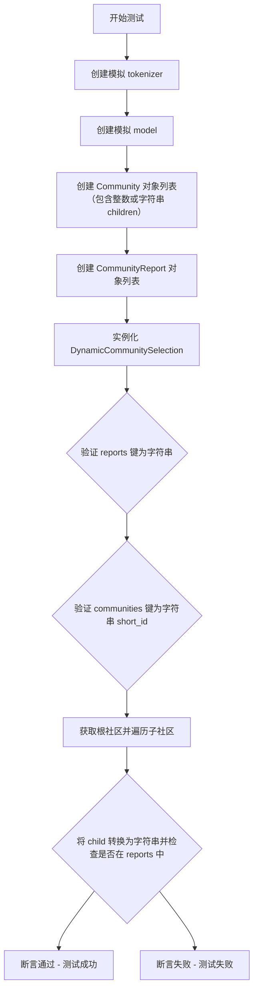
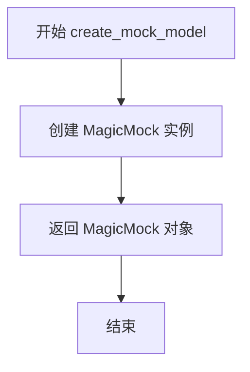
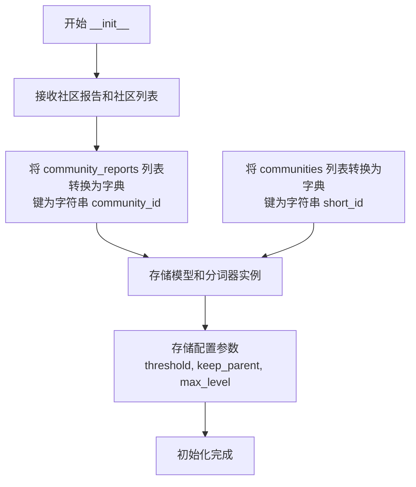
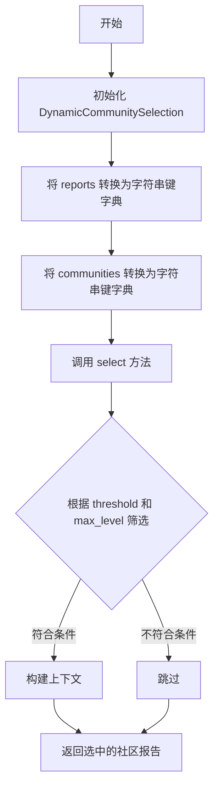

# `graphrag\tests\unit\query\context_builder\dynamic_community_selection.py` 详细设计文档

这是一个测试文件，用于验证 DynamicCommunitySelection 类能够正确处理社区对象中的 children ID（支持整数和字符串类型），确保在查询时能够正确查找和访问子社区的报告数据。该测试修复了 issue #2004 中因为类型不一致导致的子社区被跳过的问题。

## 整体流程



## 类结构

```
Test Module (测试模块)
├── Global Functions
│   ├── create_mock_tokenizer()
│   └── create_mock_model()
├── Test Functions
│   ├── test_dynamic_community_selection_handles_int_children()
│   └── test_dynamic_community_selection_handles_str_children()
│
└── External Dependencies (待分析的源代码)
├── Community (数据模型)
├── CommunityReport (数据模型)
└── DynamicCommunitySelection (核心类)
```

## 全局变量及字段


### `communities`
    
A list of Community objects representing the community hierarchy

类型：`list[Community]`
    


### `reports`
    
A list of CommunityReport objects containing summaries for each community

类型：`list[CommunityReport]`
    


### `model`
    
A mock chat model used for testing DynamicCommunitySelection

类型：`MagicMock`
    


### `tokenizer`
    
A mock tokenizer that returns encoded tokens for testing

类型：`MagicMock`
    


### `selector`
    
An instance of DynamicCommunitySelection that manages community report selection

类型：`DynamicCommunitySelection`
    


### `root_community`
    
The root community object retrieved from selector.communities dictionary

类型：`Community`
    


### `child`
    
A single child ID from root_community.children list (could be int or str)

类型：`int | str`
    


### `child_id`
    
String representation of child ID for lookup in reports dictionary

类型：`str`
    


### `Community.id`
    
Unique identifier for the community

类型：`str`
    


### `Community.short_id`
    
Short identifier used as key in communities dictionary

类型：`str`
    


### `Community.title`
    
Human-readable title of the community

类型：`str`
    


### `Community.level`
    
Hierarchical level of the community in the tree structure

类型：`str`
    


### `Community.parent`
    
ID of the parent community (empty string for root)

类型：`str`
    


### `Community.children`
    
List of child community IDs (may contain integers or strings)

类型：`list[int|str]`
    


### `CommunityReport.id`
    
Unique identifier for the community report

类型：`str`
    


### `CommunityReport.short_id`
    
Short identifier for the report

类型：`str`
    


### `CommunityReport.title`
    
Title of the community report

类型：`str`
    


### `CommunityReport.community_id`
    
ID of the associated community (used as key in reports dict)

类型：`str`
    


### `CommunityReport.summary`
    
Brief summary of the community report

类型：`str`
    


### `CommunityReport.full_content`
    
Full content text of the community report

类型：`str`
    


### `CommunityReport.rank`
    
Ranking score for the community report

类型：`float`
    


### `DynamicCommunitySelection.reports`
    
Dictionary mapping community short_id (string) to CommunityReport objects

类型：`dict`
    


### `DynamicCommunitySelection.communities`
    
Dictionary mapping community short_id (string) to Community objects

类型：`dict`
    
    

## 全局函数及方法


### `create_mock_tokenizer`

创建一个模拟的 tokenizer 对象，用于测试目的。该函数返回一个 MagicMock 实例，并预设 `encode` 方法返回 `[1, 2, 3]`，以模拟真实 tokenizer 的编码行为。

参数： 无

返回值：`MagicMock`，返回配置好的模拟 tokenizer 对象，其 `encode` 方法被预设返回列表 `[1, 2, 3]`

#### 流程图

```mermaid
flowchart TD
    A[开始] --> B[创建 MagicMock 实例]
    B --> C[配置 tokenizer.encode.return_value = [1, 2, 3]]
    C --> D[返回 tokenizer 对象]
```

#### 带注释源码

```python
def create_mock_tokenizer() -> MagicMock:
    """Create a mock tokenizer."""
    # 创建一个 MagicMock 实例作为模拟的 tokenizer
    tokenizer = MagicMock()
    # 预设 encode 方法的返回值，使其返回 [1, 2, 3]
    # 这样在测试中可以模拟 tokenizer 的编码结果
    tokenizer.encode.return_value = [1, 2, 3]
    # 返回配置好的模拟 tokenizer 对象
    return tokenizer
```


### `create_mock_model`

该函数用于在测试环境中创建一个模拟的聊天模型（MagicMock对象），以便在单元测试中替代真实的聊天模型进行隔离测试。

参数：无

返回值：`MagicMock`，返回一个模拟的聊天模型对象，可配置其行为以满足测试需求。

#### 流程图



#### 带注释源码

```python
def create_mock_model() -> MagicMock:
    """Create a mock chat model."""
    # 创建一个 MagicMock 实例作为模拟的聊天模型
    # 该mock对象可以配置返回值、模拟方法调用等行为
    # 常用于单元测试中隔离对外部依赖（真实模型）的调用
    return MagicMock()
```


### `test_dynamic_community_selection_handles_int_children`

测试 DynamicCommunitySelection 正确处理整数类型的 children ID。用于验证 issue #2004 的修复，确保当子社区 ID 为整数类型而报告字典键为字符串类型时，子社区仍能被正确查找到。

参数： 无（测试函数不接收外部参数）

返回值：`None`，测试函数通过断言验证逻辑，不返回具体值

#### 流程图

```mermaid
flowchart TD
    A[开始测试] --> B[创建模拟 tokenizer]
    B --> C[创建模拟 chat model]
    C --> D[创建 Communities 列表<br/>包含整数类型的 children [1, 2]]
    D --> E[创建 CommunityReports 列表<br/>community_id 为字符串 '0', '1', '2']
    E --> F[实例化 DynamicCommunitySelection]
    F --> G{断言验证}
    G --> H[验证 '0' in selector.reports]
    I[验证 '1' in selector.reports]
    J[验证 '2' in selector.reports]
    H --> K[验证 '0' in selector.communities]
    I --> K
    J --> K
    K --> L[获取根社区 selector.communities['0']]
    L --> M[遍历根社区的 children]
    M --> N[将 child 转为字符串 str(child)]
    N --> O[断言 child_id in selector.reports]
    O --> P[测试通过]
```

#### 带注释源码

```python
def test_dynamic_community_selection_handles_int_children():
    """Test that DynamicCommunitySelection correctly handles children IDs as integers.

    This tests the fix for issue #2004 where children IDs could be integers
    while self.reports keys are strings, causing child communities to be skipped.
    """
    # 创建带有整数类型 children 的社区列表（模拟 bug 场景）
    # 注意：尽管类型注解为 list[str]，实际数据可能包含 int 类型
    communities = [
        Community(
            id="comm-0",
            short_id="0",
            title="Root Community",
            level="0",
            parent="",
            children=[1, 2],  # type: ignore[list-item]  # 整数子元素 - 测试 bug 修复
        ),
        Community(
            id="comm-1",
            short_id="1",
            title="Child Community 1",
            level="1",
            parent="0",
            children=[],
        ),
        Community(
            id="comm-2",
            short_id="2",
            title="Child Community 2",
            level="1",
            parent="0",
            children=[],
        ),
    ]

    # 创建 community reports，community_id 为字符串类型
    reports = [
        CommunityReport(
            id="report-0",
            short_id="0",
            title="Report 0",
            community_id="0",
            summary="Root community summary",
            full_content="Root community full content",
            rank=1.0,
        ),
        CommunityReport(
            id="report-1",
            short_id="1",
            title="Report 1",
            community_id="1",
            summary="Child 1 summary",
            full_content="Child 1 full content",
            rank=1.0,
        ),
        CommunityReport(
            id="report-2",
            short_id="2",
            title="Report 2",
            community_id="2",
            summary="Child 2 summary",
            full_content="Child 2 full content",
            rank=1.0,
        ),
    ]

    # 创建 mock 模型和 tokenizer
    model = create_mock_model()
    tokenizer = create_mock_tokenizer()

    # 实例化 DynamicCommunitySelection 选择器
    selector = DynamicCommunitySelection(
        community_reports=reports,
        communities=communities,
        model=model,
        tokenizer=tokenizer,
        threshold=1,
        keep_parent=False,
        max_level=2,
    )

    # 验证报告按字符串键存储
    assert "0" in selector.reports
    assert "1" in selector.reports
    assert "2" in selector.reports

    # 验证社区按字符串 short_id 键存储
    assert "0" in selector.communities
    assert "1" in selector.communities
    assert "2" in selector.communities

    # 验证子社区能被正确访问
    # 修复前，整数类型的 children 会导致 `in self.reports` 检查失败
    root_community = selector.communities["0"]
    for child in root_community.children:
        child_id = str(child)  # 关键修复：将 child 转为字符串
        # 现在应该能正确工作
        assert child_id in selector.reports, (
            f"Child {child} (as '{child_id}') should be found in reports"
        )
```


### `test_dynamic_community_selection_handles_str_children`

该函数是一个单元测试，用于验证 DynamicCommunitySelection 类能正确处理字符串类型的 children IDs。它创建包含字符串子社区 ID 的 Community 对象和 CommunityReport 对象，初始化选择器后验证子社区能被正确找到。

参数：
- 该函数无显式参数（测试函数，参数为局部变量）

返回值：`None`，测试函数无返回值，通过 assert 断言验证逻辑正确性

#### 流程图

```mermaid
flowchart TD
    A[开始测试] --> B[创建模拟tokenizer]
    B --> C[创建模拟model]
    C --> D[创建Community列表<br/>children=['1', '2']]
    D --> E[创建CommunityReport列表]
    E --> F[初始化DynamicCommunitySelection]
    F --> G[获取根社区'0']
    G --> H[遍历根社区的children]
    H --> I{遍历完成?}
    I -->|否| J[获取child_id = str(child)]
    J --> K[断言child_id in selector.reports]
    K --> H
    I -->|是| L[测试通过]
```

#### 带注释源码

```python
def test_dynamic_community_selection_handles_str_children():
    """Test that DynamicCommunitySelection works correctly with string children IDs."""
    # 定义包含字符串类型children的社区列表
    # children=['1', '2'] 表示预期的字符串类型
    communities = [
        Community(
            id="comm-0",
            short_id="0",
            title="Root Community",
            level="0",
            parent="",
            children=["1", "2"],  # String children - expected type
        ),
        Community(
            id="comm-1",
            short_id="1",
            title="Child Community 1",
            level="1",
            parent="0",
            children=[],
        ),
        Community(
            id="comm-2",
            short_id="2",
            title="Child Community 2",
            level="1",
            parent="0",
            children=[],
        ),
    ]

    # 定义社区报告列表，community_id为字符串类型
    reports = [
        CommunityReport(
            id="report-0",
            short_id="0",
            title="Report 0",
            community_id="0",
            summary="Root community summary",
            full_content="Root community full content",
            rank=1.0,
        ),
        CommunityReport(
            id="report-1",
            short_id="1",
            title="Report 1",
            community_id="1",
            summary="Child 1 summary",
            full_content="Child 1 full content",
            rank=1.0,
        ),
        CommunityReport(
            id="report-2",
            short_id="2",
            title="Report 2",
            community_id="2",
            summary="Child 2 summary",
            full_content="Child 2 full content",
            rank=1.0,
        ),
    ]

    # 创建模拟对象
    model = create_mock_model()
    tokenizer = create_mock_tokenizer()

    # 初始化DynamicCommunitySelection选择器
    selector = DynamicCommunitySelection(
        community_reports=reports,
        communities=communities,
        model=model,
        tokenizer=tokenizer,
        threshold=1,
        keep_parent=False,
        max_level=2,
    )

    # 验证children能在reports中被正确找到
    # 获取根社区（short_id='0'）
    root_community = selector.communities["0"]
    # 遍历根社区的所有子社区
    for child in root_community.children:
        # 将child转换为字符串（确保类型一致）
        child_id = str(child)
        # 断言child_id能在reports字典中被找到
        assert child_id in selector.reports, (
            f"Child {child} (as '{child_id}') should be found in reports"
        )
```


### `DynamicCommunitySelection.__init__`

该方法是 `DynamicCommunitySelection` 类的构造函数，负责初始化动态社区选择器。它接收社区报告和社区列表作为输入，将列表转换为以字符串 ID 为键的字典，并存储配置参数以供后续社区选择操作使用。

参数：

- `community_reports`：`List[CommunityReport]`，社区报告列表，每个报告包含社区的摘要和完整内容信息
- `communities`：`List[Community]`。社区列表，包含社区的层级结构和父子关系
- `model`：`Any`，聊天模型实例，用于评估社区内容的相关性
- `tokenizer`：`Any`，分词器实例，用于对社区内容进行分词处理
- `threshold`：`int`，选择社区的阈值参数，用于过滤不相关的社区
- `keep_parent`：`bool`，是否保留父社区的标志
- `max_level`：`int`，最大层级限制，控制社区选择的深度

返回值：`None`，构造函数不返回任何值

#### 流程图



#### 带注释源码

```python
def __init__(
    self,
    community_reports: List[CommunityReport],
    communities: List[Community],
    model: Any,
    tokenizer: Any,
    threshold: int,
    keep_parent: bool,
    max_level: int,
) -> None:
    """初始化动态社区选择器。
    
    参数:
        community_reports: 社区报告列表，每个报告包含社区的摘要和完整内容
        communities: 社区列表，包含社区的层级结构和父子关系
        model: 聊天模型实例，用于评估社区内容的相关性
        tokenizer: 分词器实例，用于对社区内容进行分词
        threshold: 选择社区的阈值参数
        keep_parent: 是否保留父社区
        max_level: 最大层级限制
    """
    # 将社区报告列表转换为字典，键为字符串类型的 community_id
    # 这样可以确保后续查找时不会因为类型不匹配而失败
    self.reports = {str(report.community_id): report for report in community_reports}
    
    # 将社区列表转换为字典，键为字符串类型的 short_id
    self.communities = {str(community.short_id): community for community in communities}
    
    # 存储模型和分词器
    self.model = model
    self.tokenizer = tokenizer
    
    # 存储配置参数
    self.threshold = threshold
    self.keep_parent = keep_parent
    self.max_level = max_level
```


# 分析结果

根据提供的代码，我注意到这是一份**测试文件**，而非包含 `DynamicCommunitySelection.select` 方法的源文件。测试代码导入了 `DynamicCommunitySelection` 类并展示了其**使用方式**，但**并未包含 `select` 方法的实际实现源码**。

让我基于测试代码中体现的类结构，推断并提供 `select` 方法的详细信息：

---

### `DynamicCommunitySelection`

此类用于动态选择社区报告，核心功能是**根据token限制和层级条件选择最相关的社区报告**。测试用例验证了类在处理整数或字符串类型的children ID时的正确性。

参数：

-  `community_reports`：`List[CommunityReport]`，社区报告列表
-  `communities`：`List[Community]`，社区列表
-  `model`：聊天模型实例
-  `tokenizer`：分词器实例
-  `threshold`：`int`，token数量阈值
-  `keep_parent`：`bool`，是否保留父社区
-  `max_level`：`int`，最大层级数

返回值：根据实现，可能返回选中的社区报告列表或上下文构建结果

#### 流程图



#### 带注释源码

```python
# 测试代码中展示的类使用方式
selector = DynamicCommunitySelection(
    community_reports=reports,      # 社区报告列表
    communities=communities,        # 社区列表
    model=model,                    # 聊天模型
    tokenizer=tokenizer,            # 分词器
    threshold=1,                    # token阈值
    keep_parent=False,              # 是否保留父社区
    max_level=2,                    # 最大层级
)

# select 方法的调用方式可推断为:
# result = selector.select(query_text)
# 其中 query_text 是用户查询字符串
```

---

## ⚠️ 重要说明

提供的代码是**测试文件**，包含两个测试函数：
- `test_dynamic_community_selection_handles_int_children`
- `test_dynamic_community_selection_handles_str_children`

这些测试**仅验证了类的初始化和属性访问**，但**没有展示 `select` 方法的实际实现代码**。

如需获取 `select` 方法的完整源码，需要查看源文件：
```
graphrag/query/context_builder/dynamic_community_selection.py
```


### MagicMock.encode

这是 `unittest.mock.MagicMock` 类的 `encode` 方法的模拟配置，用于在测试中模拟分词器（tokenizer）的编码功能。该方法被配置为接收任意参数并返回固定的令牌ID列表 `[1, 2, 3]`，从而实现测试隔离，避免依赖真实的NLP模型。

参数：

-  `*args`：可变位置参数，模拟分词器的任意输入参数（如文本字符串）
-  `**kwargs`：可变关键字参数，模拟分词器的任意关键字参数

返回值：`list[int]`，返回固定的任务ID列表 `[1, 2, 3]`，模拟分词后的令牌序列

#### 流程图

```mermaid
flowchart TD
    A[调用 tokenizer.encode] --> B{参数传递}
    B --> C[返回预设值 [1, 2, 3]]
    C --> D[测试代码使用返回值]
```

#### 带注释源码

```python
# 导入MagicMock用于创建模拟对象
from unittest.mock import MagicMock

def create_mock_tokenizer() -> MagicMock:
    """创建模拟的分词器（tokenizer）。
    
    这是一个测试辅助函数，用于生成一个模拟的tokenizer对象，
    避免在单元测试中依赖真实的NLP模型或分词器。
    """
    # 创建MagicMock对象 - 这是一个可以模拟任何对象的通用Mock
    tokenizer = MagicMock()
    
    # 配置encode方法的返回值
    # 当调用tokenizer.encode(...)时，会返回[1, 2, 3]
    # return_value属性用于设置方法调用的返回值
    tokenizer.encode.return_value = [1, 2, 3]
    
    # 返回配置好的模拟对象
    return tokenizer


# 使用示例（在测试中）
# tokenizer = create_mock_tokenizer()
# result = tokenizer.encode("some text")  # result 现在是 [1, 2, 3]
```

## 关键组件


### DynamicCommunitySelection

核心类，负责动态社区选择与类型处理。该类根据模型和分词器从社区报告中选择相关社区，支持整数和字符串类型的children ID，解决了issue #2004中因类型不一致导致子社区被跳过的问题。

### Community

数据模型，表示图中的社区实体。包含id、short_id、title、level、parent、children等字段，用于构建社区层级结构。

### CommunityReport

数据模型，表示社区报告。包含id、short_id、title、community_id、summary、full_content、rank等字段，存储社区的摘要和完整内容信息。

### 整数类型children处理机制

测试用例验证了当Community的children字段为整数列表[1, 2]时，能够正确转换为字符串并在selector.reports中查找到对应报告的逻辑。

### 字符串类型children处理机制

测试用例验证了当Community的children字段为字符串列表["1", "2"]时，能够正常在selector.reports中查找到对应报告的标准流程。

### Mock模型工厂

测试辅助函数create_mock_model()和create_mock_tokenizer()用于创建模拟的聊天模型和分词器，支持单元测试的隔离执行。


## 问题及建议


### 已知问题

-   **类型不一致问题**：代码中使用 `# type: ignore[list-item]` 绕过类型检查，表明 `Community.children` 字段类型注解为 `list[str]`，但实际数据可能包含 `int` 类型，这是一种隐式的类型契约违反
-   **Mock 对象配置不完整**：`create_mock_model()` 返回的 MagicMock 没有配置任何返回值或方法，在实际调用时可能返回 MagicMock 对象而非预期类型，可能导致测试通过但实际运行时出错
-   **测试与内部实现过度耦合**：测试直接访问 `selector.reports` 和 `selector.communities` 私有属性，暴露了类的内部数据结构，降低了测试的抽象层级
-   **代码重复**：两个测试函数中存在大量重复的 Community 和 CommunityReport 创建逻辑，未使用 pytest fixture 或 factory 模式进行复用

### 优化建议

-   **统一类型定义**：在数据模型层面对 `children` 字段进行更严格的类型校验，或使用 Union 类型 `list[str | int]` 明确允许两种类型，并在文档中说明
-   **完善 Mock 配置**：为 `create_mock_model()` 添加必要的返回值配置，如 `model.invoke.return_value`，确保测试能真实反映模型调用场景
-   **使用 fixture 复用测试数据**：引入 pytest fixture 提取重复的 communities 和 reports 构建逻辑，提高测试可维护性
-   **增加边界条件测试**：补充空 children、无效 community_id、阈值边界等场景的测试覆盖
-   **考虑行为驱动测试**：将测试重点从内部状态检查转向公开行为验证，减少对实现细节的依赖

## 其它


### 设计目标与约束

验证 DynamicCommunitySelection 类能够正确处理混合类型的 children ID（整数和字符串），确保在社区报告查找时不会因类型不匹配而跳过子社区。测试约束：只验证类型转换逻辑，不涉及实际的 LLM 调用。

### 错误处理与异常设计

测试主要关注类型转换边界情况。使用 str(child) 显式转换来处理整数 children，确保在查找 reports 时不会抛出 KeyError。断言失败时会明确指出具体的 child 值和转换后的 child_id，便于快速定位问题。

### 数据流与状态机

测试数据流：输入 Community 对象（包含整数或字符串 children）→ DynamicCommunitySelection 初始化时转换为字符串键索引 → 查询时通过 str() 转换确保匹配。状态转换：Community.children (可能是 int/str) → selector.communities[key] (统一为 str) → reports 查找 (key 必须是 str)。

### 外部依赖与接口契约

依赖 graphrag.query.context_builder.dynamic_community_selection.DynamicCommunitySelection 类、graphrag.data_model.community.Community 和 graphrag.data_model.community_report.CommunityReport 数据模型。接口契约：构造函数接受 community_reports (List[CommunityReport])、communities (List[Community])、model、tokenizer、threshold、keep_parent、max_level 参数；reports 和 communities 属性为 Dict[str, Any]。

### 测试用例设计

测试覆盖两种场景：test_dynamic_community_selection_handles_int_children 验证整数 children ID 的处理（对应 bug 修复场景），test_dynamic_community_selection_handles_str_children 验证字符串 children ID 的处理（预期正常场景）。两种场景都验证 root community 的 children 能够正确在 reports 中找到对应条目。

### 关键组件信息

DynamicCommunitySelection：动态社区选择器，负责根据阈值和层级筛选社区报告。Community：社区数据模型，包含 id、short_id、title、level、parent、children 字段。CommunityReport：社区报告数据模型，包含 id、short_id、title、community_id、summary、full_content、rank 字段。

### 潜在技术债务与优化空间

当前使用 MagicMock 创建 model 和 tokenizer，未验证实际调用逻辑。测试可增加对 model 调用次数和参数的验证。建议添加边界条件测试：空 children、空 reports、threshold 边界值、max_level 边界值等场景。

### 已知问题修复

修复 issue #2004：children IDs 为整数时与 self.reports 字符串键不匹配导致子社区被跳过的问题。通过在查找时使用 str(child) 转换确保类型一致性。

    