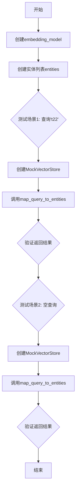
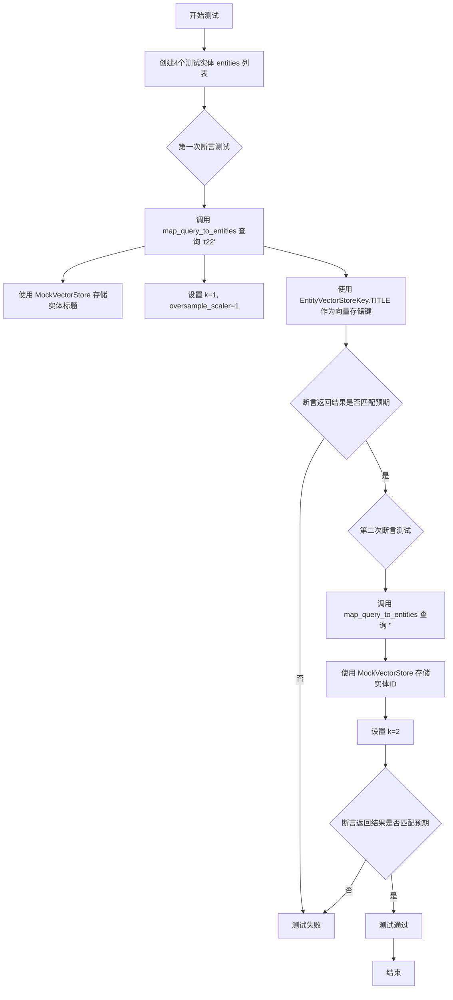
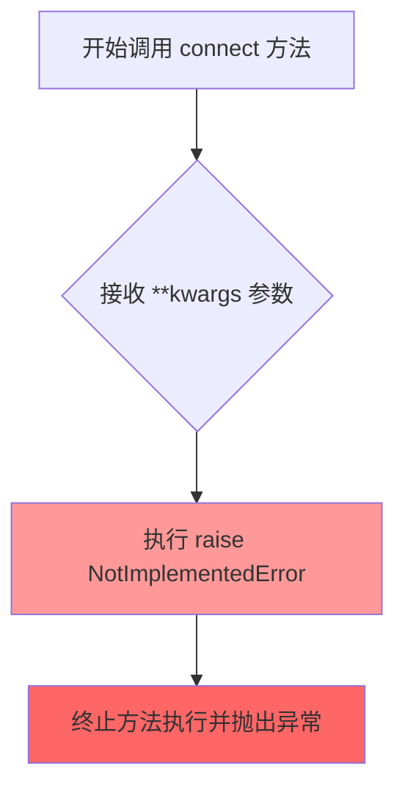
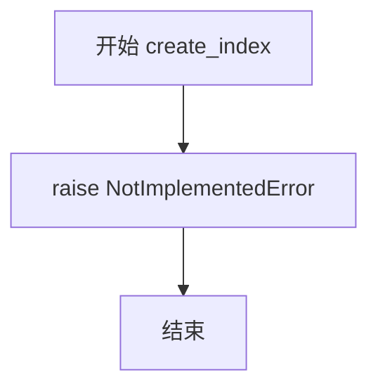
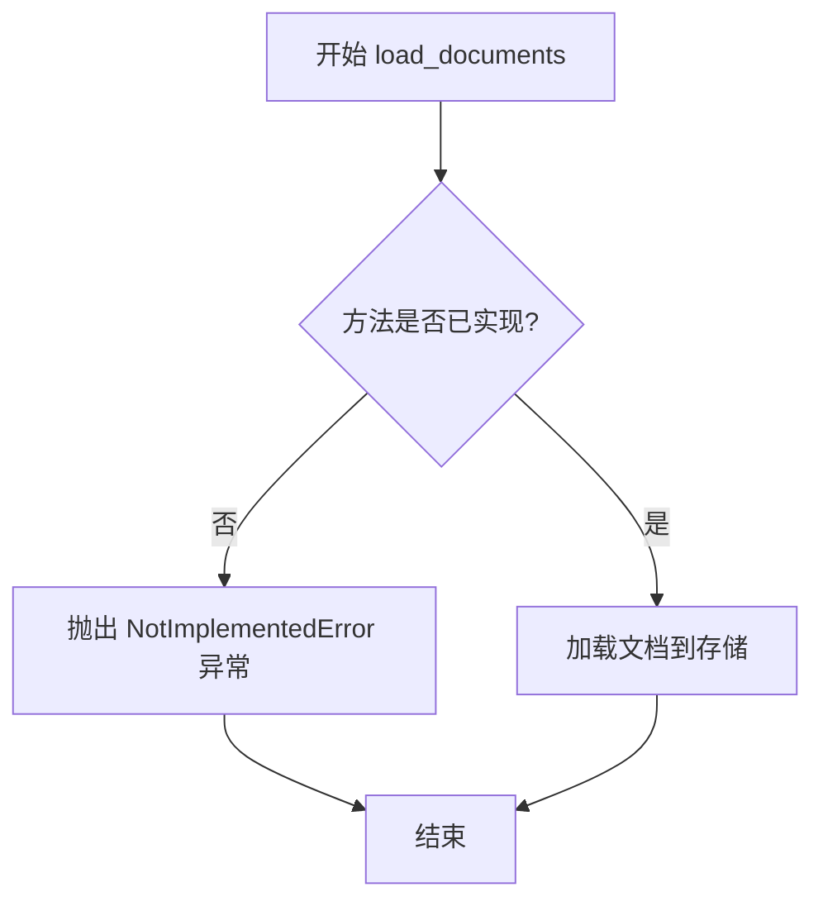
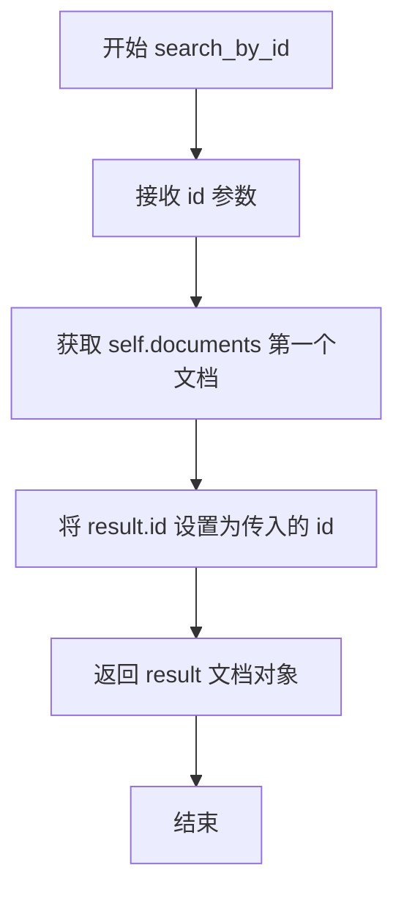

# `graphrag\tests\unit\query\context_builder\test_entity_extraction.py` 详细设计文档

该文件实现了一个测试模块，用于验证实体查询映射功能。通过创建模拟的向量存储和嵌入模型，测试map_query_to_entities函数在不同查询场景下（如精确匹配、模糊匹配、空查询等）能否正确返回最相似的实体。

## 整体流程



## 类结构

```
VectorStore (抽象基类)
└── MockVectorStore (测试用模拟实现)
    ├── __init__
    ├── connect
    ├── create_index
    ├── load_documents
    ├── similarity_search_by_vector
    ├── similarity_search_by_text
    └── search_by_id
```

## 全局变量及字段


### `embedding_model`
    
用于生成文本嵌入向量的模拟嵌入模型，通过create_embedding函数创建并配置为MockLLM提供程序

类型：`TextEmbedder`
    


### `MockVectorStore.documents`
    
存储在模拟向量存储中的文档列表，用于执行相似性搜索和查询操作

类型：`list[VectorStoreDocument]`
    
    

## 全局函数及方法


### `test_map_query_to_entities`

这是一个单元测试函数，用于验证 `map_query_to_entities` 函数在查询实体时的正确性，包括基于文本相似度搜索和空查询时的排序逻辑。

参数：此函数无参数。

返回值：`None`，该函数为测试函数，使用断言验证预期结果，不返回任何值。

#### 流程图



#### 带注释源码

```python
def test_map_query_to_entities():
    """
    测试 map_query_to_entities 函数的各种查询场景
    """
    # ========== 准备测试数据 ==========
    # 创建4个测试用实体对象，包含不同的 id, short_id, title 和 rank
    entities = [
        Entity(
            id="2da37c7a-50a8-44d4-aa2c-fd401e19976c",  # 实体唯一标识符
            short_id="sid1",                              # 短标识符
            title="t1",                                   # 标题/名称
            rank=2,                                       # 排名/权重值
        ),
        Entity(
            id="c4f93564-4507-4ee4-b102-98add401a965",
            short_id="sid2",
            title="t22",
            rank=4,
        ),
        Entity(
            id="7c6f2bc9-47c9-4453-93a3-d2e174a02cd9",
            short_id="sid3",
            title="t333",
            rank=1,
        ),
        Entity(
            id="8fd6d72a-8e9d-4183-8a97-c38bcc971c83",
            short_id="sid4",
            title="t4444",
            rank=3,
        ),
    ]

    # ========== 测试场景1: 精确查询匹配 ==========
    # 验证当查询 "t22" 时，能正确返回匹配的实体
    assert map_query_to_entities(
        query="t22",                                      # 查询字符串
        text_embedding_vectorstore=MockVectorStore([     # 向量存储，使用实体标题作为文档ID
            VectorStoreDocument(id=entity.title, vector=None) for entity in entities
        ]),
        text_embedder=embedding_model,                   # 文本嵌入器
        all_entities_dict={entity.id: entity for entity in entities},  # 所有实体字典映射
        embedding_vectorstore_key=EntityVectorStoreKey.TITLE,  # 使用标题作为向量键
        k=1,                                              # 返回1个结果
        oversample_scaler=1,                              # 过采样比例
    ) == [
        # 预期返回 title="t22" 的实体
        Entity(
            id="c4f93564-4507-4ee4-b102-98add401a965",
            short_id="sid2",
            title="t22",
            rank=4,
        )
    ]

    # ========== 测试场景2: 空查询与排序 ==========
    # 验证当查询为空字符串时，返回按排名排序的实体
    assert map_query_to_entities(
        query="",                                         # 空查询字符串
        text_embedding_vectorstore=MockVectorStore([     # 向量存储，使用实体ID作为文档ID
            VectorStoreDocument(id=entity.id, vector=None) for entity in entities
        ]),
        text_embedder=embedding_model,
        all_entities_dict={entity.id: entity for entity in entities},
        embedding_vectorstore_key=EntityVectorStoreKey.TITLE,
        k=2,                                              # 返回2个结果
    ) == [
        # 预期返回排名最高的两个实体 (rank=4 和 rank=3)
        Entity(
            id="c4f93564-4507-4ee4-b102-98add401a965",
            short_id="sid2",
            title="t22",
            rank=4,
        ),
        Entity(
            id="8fd6d72a-8e9d-4183-8a97-c38bcc971c83",
            short_id="sid4",
            title="t4444",
            rank=3,
        ),
    ]
```


### `MockVectorStore.__init__`

这是 MockVectorStore 类的构造函数，用于初始化一个模拟的向量存储实例。该方法接收文档列表，调用父类 VectorStore 的构造函数设置索引名称为 "mock"，并将传入的文档存储在实例属性中。

参数：

- `self`：隐式参数，MockVectorStore 的实例对象
- `documents`：`list[VectorStoreDocument]`，要存储在模拟向量存储中的文档列表

返回值：`None`，构造函数不返回值，仅初始化对象状态

#### 流程图

```mermaid
flowchart TD
    A[开始 __init__] --> B[调用 super().__init__<br/>index_name='mock']
    B --> C[将 documents 赋值给<br/>self.documents]
    C --> D[结束 __init__]
```

#### 带注释源码

```python
def __init__(self, documents: list[VectorStoreDocument]) -> None:
    """
    初始化 MockVectorStore 实例
    
    参数:
        documents: 要存储的文档列表，这些文档将用于模拟向量搜索操作
    """
    # 调用父类 VectorStore 的构造函数，传入索引名称 "mock"
    # 这会初始化父类中与索引相关的基础属性
    super().__init__(index_name="mock")
    
    # 将传入的文档列表存储在实例属性中，供后续搜索方法使用
    self.documents = documents
```


### `MockVectorStore.connect`

该方法是 `MockVectorStore` 类的连接方法，用于建立与向量存储的连接。然而，当前实现中该方法直接抛出 `NotImplementedError` 异常，表示该功能为待实现状态，无法正常执行连接操作。

参数：

- `**kwargs`：`Any`，可变关键字参数，用于传递连接向量存储时所需的任意配置参数（如主机地址、认证信息等）

返回值：`None`，该方法不返回任何有效值

#### 流程图



#### 带注释源码

```python
def connect(self, **kwargs: Any) -> None:
    """
    建立与向量存储的连接。
    
    注意：当前版本为占位实现，调用此方法将抛出 NotImplementedError 异常。
    实际使用时需要由子类重写此方法以实现真正的连接逻辑。
    
    参数:
        **kwargs: Any - 可变关键字参数，用于传递连接配置信息
                  (例如: host, port, credentials 等)
    
    返回:
        None - 不返回任何值
    
    异常:
        NotImplementedError - 永远抛出，表示方法未实现
    """
    raise NotImplementedError
```


### `MockVectorStore.create_index`

该方法用于在向量存储中创建索引，但在 MockVectorStore 实现中未实际实现，仅抛出 NotImplementedError 异常。

参数：
- 无显式参数（除隐式 `self` 参数）

返回值：`None`，无返回值描述

#### 流程图



#### 带注释源码

```python
def create_index(self) -> None:
    """
    在向量存储中创建索引。
    
    注意：此为 Mock 实现，未实际创建索引，
    仅抛出 NotImplementedError 异常以表示功能未实现。
    """
    raise NotImplementedError
```


### `MockVectorStore.load_documents`

该方法用于将文档列表加载到向量存储中，但在 MockVectorStore 类中尚未实现，目前会抛出 NotImplementedError 异常。

参数：

- `documents`：`list[VectorStoreDocument]`，要加载到向量存储中的文档列表

返回值：`None`，无返回值

#### 流程图



#### 带注释源码

```python
def load_documents(self, documents: list[VectorStoreDocument]) -> None:
    """
    将文档列表加载到向量存储中。
    
    注意：此方法在 MockVectorStore 中尚未实现，
    当前会抛出 NotImplementedError 异常。
    
    参数:
        documents: VectorStoreDocument 对象列表，要加载的文档
        
    返回值:
        None
        
    异常:
        NotImplementedError: 方法未实现时抛出
    """
    raise NotImplementedError
```


### MockVectorStore.similarity_search_by_vector

这是一个用于模拟向量存储的相似度搜索方法，它接收一个查询向量嵌入和可选的返回结果数量参数k，然后返回与该查询向量最相似的文档列表。在当前Mock实现中，该方法简单地返回前k个文档，并将每个文档的相似度分数硬编码为1，表示完全匹配。

参数：

- `self`：隐式参数，MockVectorStore类的实例自身
- `query_embedding`：`list[float]`，用于进行相似度搜索的查询向量嵌入
- `k`：`int = 10`，指定返回的搜索结果数量，默认为10
- `**kwargs`：`Any`，接收任意额外的关键字参数，目前未被使用

返回值：`list[VectorStoreSearchResult]`，返回与查询向量相似的文档搜索结果列表，每个结果包含文档对象及其相似度分数

#### 流程图

```mermaid
flowchart TD
    A[开始 similarity_search_by_vector] --> B[接收 query_embedding 和 k 参数]
    B --> C{检查 documents 长度}
    C -->|documents 长度 >= k| D[取 self.documents[:k] 前k个文档]
    C -->|documents 长度 < k| E[取全部 self.documents]
    D --> F[为每个文档创建 VectorStoreSearchResult, score=1]
    E --> F
    F --> G[返回结果列表]
```

#### 带注释源码

```python
def similarity_search_by_vector(
    self, query_embedding: list[float], k: int = 10, **kwargs: Any
) -> list[VectorStoreSearchResult]:
    """
    根据查询向量执行相似度搜索的Mock实现。
    
    该方法是VectorStore抽象类的具体实现，用于在MockVectorStore中
    根据给定的查询向量嵌入返回相似的文档。在当前实现中，这是一个
    简化版本，总是返回前k个文档且分数为1。
    
    参数:
        query_embedding: list[float], 用于搜索的查询向量嵌入。
                        在当前Mock实现中未被实际用于计算相似度。
        k: int, 要返回的搜索结果数量，默认为10。
        **kwargs: Any, 额外的关键字参数，当前未被使用。
        
    返回:
        list[VectorStoreSearchResult]: 包含VectorStoreSearchResult对象的列表，
        每个对象包含document和score属性。score在此实现中固定为1。
    """
    # 使用列表推导式创建搜索结果列表
    # 取前k个文档（如果文档数量不足k，则取全部文档）
    # 每个文档的相似度分数被硬编码为1
    return [
        VectorStoreSearchResult(document=document, score=1)
        for document in self.documents[:k]
    ]
```


### `MockVectorStore.similarity_search_by_text`

该方法用于在模拟向量存储中根据文本进行相似度搜索，通过计算输入文本长度与文档ID长度的差值作为相似度分数，然后对结果进行排序并返回最匹配的Top-K文档。

参数：

- `self`：`MockVectorStore`，类实例本身，表示调用该方法的向量存储对象
- `text`：`str`，用于搜索的文本字符串
- `text_embedder`：`TextEmbedder`，文本嵌入器，用于将文本转换为向量（在此模拟实现中未被实际使用）
- `k`：`int = 10`，返回结果的数量限制，默认为10
- `**kwargs`：`Any`，其他可选参数，用于扩展功能

返回值：`list[VectorStoreSearchResult]`，返回按相似度分数排序的文档搜索结果列表

#### 流程图

```mermaid
flowchart TD
    A[开始 similarity_search_by_text] --> B[接收参数 text, text_embedder, k]
    B --> C{遍历 self.documents}
    C -->|对每个document| D[计算相似度分数: abs(len(text) - len(str(document.id)或\"\"))]
    D --> E[创建 VectorStoreSearchResult]
    E --> C
    C -->|遍历完成| F[按 score 字段升序排序]
    F --> G[取排序结果的前 k 个元素]
    G --> H[返回结果列表]
    H --> I[结束]
```

#### 带注释源码

```python
def similarity_search_by_text(
    self, text: str, text_embedder: TextEmbedder, k: int = 10, **kwargs: Any
) -> list[VectorStoreSearchResult]:
    """
    根据文本在模拟向量存储中执行相似度搜索
    
    参数:
        text: str - 用户输入的查询文本
        text_embedder: TextEmbedder - 文本嵌入器（此模拟实现中未使用）
        k: int - 返回结果的最大数量，默认为10
        **kwargs: Any - 其他可选参数
    
    返回:
        list[VectorStoreSearchResult] - 包含文档和相似度分数的结果列表
    """
    # 使用列表推导式遍历所有文档，为每个文档计算相似度分数
    # 分数计算方式：查询文本长度与文档ID字符串长度的绝对差值
    # 差值越小表示越相似（模拟实现中的简化逻辑）
    return sorted(
        [
            VectorStoreSearchResult(
                document=document,  # 当前文档
                # 相似度分数：文本长度与文档ID长度的差值绝对值
                score=abs(len(text) - len(str(document.id) or "")),
            )
            for document in self.documents  # 遍历所有存储的文档
        ],
        key=lambda x: x.score,  # 按分数升序排序（分数越小越相似）
    )[:k]  # 取排序后的前k个结果返回
```


### `MockVectorStore.search_by_id`

根据给定的 ID 在 Mock 向量存储中搜索文档并返回。由于是 Mock 实现，该方法始终返回列表中的第一个文档，并将其 ID 设置为传入的搜索 ID。

参数：

- `self`：隐式参数，`MockVectorStore` 实例，代表当前向量存储对象
- `id`：`str`，要搜索的文档 ID

返回值：`VectorStoreDocument`，返回设置好 ID 的文档对象

#### 流程图



#### 带注释源码

```python
def search_by_id(self, id: str) -> VectorStoreDocument:
    """
    根据 ID 搜索向量存储中的文档。
    
    注意：这是一个 Mock 实现，始终返回第一个文档，
    并将其 ID 设置为传入的搜索 ID。
    
    参数:
        id: str - 要搜索的文档 ID
        
    返回:
        VectorStoreDocument - 设置好 ID 的文档对象
    """
    # 获取文档列表中的第一个文档（Mock 实现总是返回第一个）
    result = self.documents[0]
    
    # 将返回文档的 ID 设置为传入的搜索 ID
    result.id = id
    
    # 返回设置好的文档
    return result
```

## 关键组件


### MockVectorStore

模拟的向量存储实现类，继承自VectorStore基类，用于测试环境。该类实现了向量相似度搜索和按ID搜索功能，但不包含真实的索引逻辑，仅返回预设的文档数据。

### embedding_model

基于MockLLM的嵌入模型实例，使用text-embedding-3-small模型配置，生成长度为3的模拟嵌入向量[1.0, 1.0, 1.0]，用于文本向量化处理。

### test_map_query_to_entities

核心测试函数，验证map_query_to_entities函数的正确性。包含两个测试用例：第一个验证根据查询文本"t22"能否正确返回对应实体；第二个验证空查询时能否按rank顺序返回top-k实体。

### EntityVectorStoreKey

枚举类型，定义向量存储中实体向量的键类型（如TITLE、ID等），用于指定查询时使用的向量字段。

### map_query_to_entities

从graphrag.query.context_builder.entity_extraction导入的核心函数，负责将用户查询文本映射到最相关的实体列表。支持按嵌入向量相似度搜索，并可通过oversample_scaler参数控制过采样比例。


## 问题及建议


### 已知问题

-   **MockVectorStore 方法未完全实现**：connect、create_index、load_documents 方法直接 raise NotImplementedError，可能导致在实际测试或集成时出现意外崩溃
-   **相似度计算逻辑异常**：similarity_search_by_text 使用 `abs(len(text) - len(str(document.id) or ""))` 计算分数，将文本长度与文档ID长度做差值作为相似度，这完全不符合语义相似度的常规逻辑，测试结果可能无法反映真实场景
-   **search_by_id 实现错误**：该方法总是返回 self.documents[0] 并仅修改其 id，不是真正的按ID搜索实现
- **测试覆盖不足**：仅覆盖两个测试用例，未测试边界情况如 k 值大于文档数量、空查询、空 entities 字典、oversample_scaler 不同值等
- **硬编码配置问题**：embedding model 使用 MockLLM 但配置了真实模型名 "text-embedding-3-small"，mock_responses 为固定值 [1.0, 1.0, 1.0]，可能导致与真实 Embedding 行为不一致
- **VectorStoreDocument 参数问题**：vector 参数传入 None，可能在需要向量计算的场景下导致问题

### 优化建议

-   完善 MockVectorStore 的所有方法实现，或使用第三方 Mock 框架（如 unittest.mock）进行更真实的模拟
-   修正 similarity_search_by_text 的相似度计算逻辑，使用基于文本内容的真实相似度算法或保持与真实 VectorStore 一致的行为
-   修复 search_by_id 方法，正确实现按 ID 查找文档的逻辑
-   增加更多测试用例覆盖边界条件和不同参数组合
-   将硬编码的配置值提取为测试 fixture 或常量，提高测试可维护性
-   为 VectorStoreDocument 提供有效的 vector 数据，使 Mock 更接近真实使用场景
-   考虑添加参数化测试，对不同的 k 值、oversample_scaler 值进行批量测试

## 其它


### 设计目标与约束

本代码的设计目标是测试 `map_query_to_entities` 函数在查询映射场景下的正确性，验证其能够根据查询文本从向量存储中检索相关实体。约束条件包括：使用 Mock 向量存储和 Mock LLM 提供程序避免外部依赖，仅支持本地测试环境运行。

### 错误处理与异常设计

代码中 MockVectorStore 的 `connect`、`create_index`、`load_documents` 方法均抛出 `NotImplementedError`，表明这些方法仅为占位实现，不支持实际调用。测试函数本身未进行显式的异常处理，假设输入参数均为合法值。

### 外部依赖与接口契约

代码依赖以下外部模块：`graphrag.data_model.entity` 中的 `Entity` 类、`graphrag.query.context_builder.entity_extraction` 中的 `EntityVectorStoreKey` 和 `map_query_to_entities` 函数、`graphrag_llm` 包提供的配置和 embedding 创建功能、`graphrag_vectors` 包中的向量存储相关类。接口契约要求传入的 `text_embedding_vectorstore` 必须实现 VectorStore 接口，`text_embedder` 必须实现 TextEmbedder 接口，`all_entities_dict` 必须为包含实体 ID 到实体对象映射的字典。

### 性能考虑

当前实现使用简单的列表切片和排序操作，在文档数量较大时可能存在性能瓶颈。`similarity_search_by_text` 方法采用长度差作为相似度计算方式，并非真正的语义相似度计算，适用于测试场景但不适合生产环境。

### 测试覆盖范围

测试覆盖了两个主要场景：查询非空字符串时的实体映射以及空查询时的实体映射。测试验证了返回实体的数量、排序正确性和 ID 匹配性。尚需补充的测试场景包括：向量为空时的行为、k 值超出文档数量时的处理、embedding_vectorstore_key 不同枚举值的处理。

### 配置与参数说明

关键配置参数包括：`k` 控制返回的实体数量、`oversample_scaler` 控制过采样比例、`embedding_vectorstore_key` 指定向量存储键类型（TITLE 或 FULL_TEXT）。这些参数在测试中使用了不同的取值组合进行验证。

    