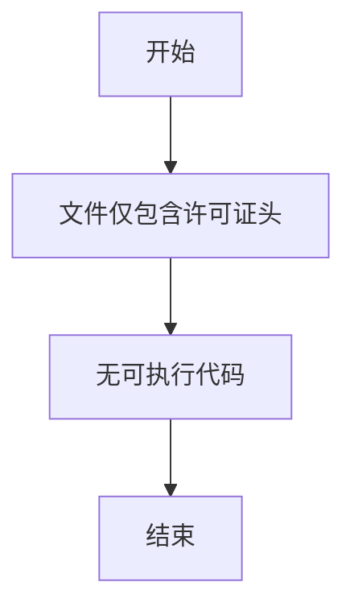

# `graphrag\tests\unit\query\input\__init__.py` 详细设计文档

该代码文件仅包含版权声明和MIT许可证信息，没有实际的代码实现或功能逻辑。

## 整体流程



## 类结构

```
无类结构 - 代码中未定义任何类
```

## 全局变量及字段


    

## 全局函数及方法


## 关键组件


### 概述

由于提供的源代码仅包含版权声明和MIT许可证信息（无实际功能代码），无法提取关键组件、张量索引、反量化支持或量化策略等技术要素。

### 关键组件信息

无

### 潜在的技术债务或优化空间

无

### 其它项目

**设计目标与约束**：无（代码为空）

**错误处理与异常设计**：无（代码为空）

**数据流与状态机**：无（代码为空）

**外部依赖与接口契约**：无（代码为空）


## 问题及建议


### 已知问题

-   代码仅包含版权声明和 MIT 许可证头文件，没有任何实际实现代码可供分析
-   缺少功能代码，无法进行架构、逻辑或技术债务方面的分析

### 优化建议

-   提供完整的源代码文件以进行详细的技术分析和文档生成
-   如果这是模板文件，建议补充基础代码框架（如类结构、接口定义等）


## 其它


### 1. 一段话描述

{该代码文件为微软2024年项目的基础版权声明文件，仅包含MIT许可证的版权信息，无实际功能实现。}

### 2. 文件的整体运行流程

{该文件为纯版权声明文件，不包含任何可执行代码，不存在运行流程。}

### 3. 类的详细信息

{该文件中不包含任何类定义。}

### 4. 类字段和全局变量信息

{该文件中不包含任何类字段或全局变量。}

### 5. 类方法和全局函数信息

{该文件中不包含任何类方法或全局函数。}

### 6. 关键组件信息

{该文件中不包含任何关键组件。}

### 7. 潜在的技术债务或优化空间

{该文件为版权声明文件，不存在技术债务或优化空间。}

### 8. 其它项目

#### 8.1 设计目标与约束

{该文件仅为版权声明文件，不涉及任何功能设计目标与约束。}

#### 8.2 错误处理与异常设计

{该文件不包含任何错误处理或异常设计。}

#### 8.3 数据流与状态机

{该文件不包含任何数据流或状态机实现。}

#### 8.4 外部依赖与接口契约

{该文件不依赖任何外部模块，不提供任何接口。}

#### 8.5 版本兼容性信息

{该文件声明使用MIT许可证，适用于任何年份和项目。}

#### 8.6 安全与权限要求

{该文件仅包含许可证声明，不涉及安全或权限相关代码。}

#### 8.7 性能考量

{该文件不涉及任何性能相关实现。}

#### 8.8 测试覆盖率

{该文件为版权声明文件，无需测试。}


    