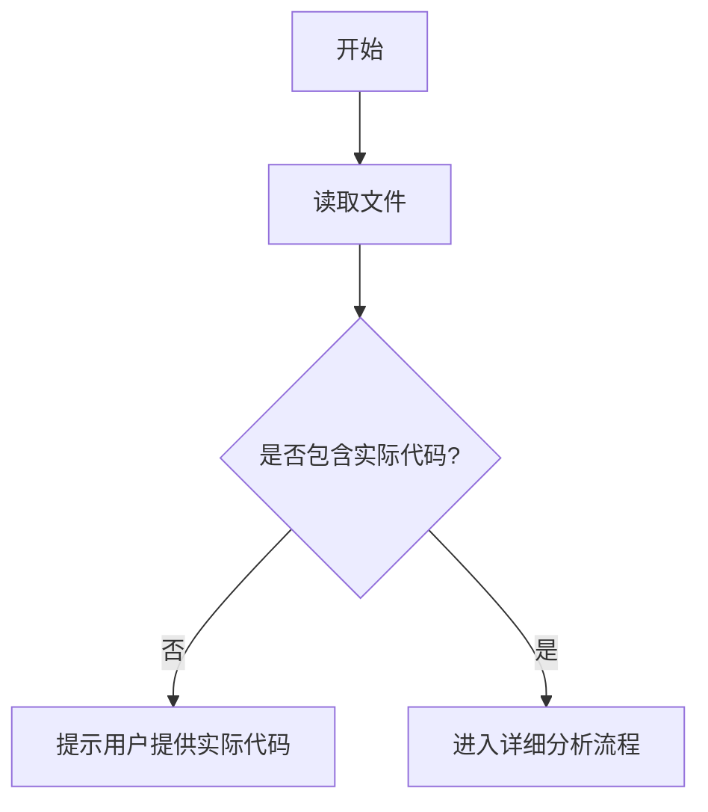

# `graphrag\tests\unit\query\input\retrieval\__init__.py` 详细设计文档

该文件仅包含版权声明信息，无实际代码功能可供分析。

## 整体流程



## 类结构

```

```

## 全局变量及字段


    

## 全局函数及方法


## 关键组件


由于提供的源代码仅包含版权声明（MIT License），未包含任何实际的功能代码实现，因此无法从中识别关键组件（如张量索引与惰性加载、反量化支持、量化策略等）。

如需生成详细设计文档，请提供完整的源代码文件内容。


## 问题及建议


### 已知问题

- 代码文件仅包含版权声明头，无实际实现代码，无法进行功能分析
- 缺少任何类、函数、变量或业务逻辑定义
- 无法评估技术债务或优化空间

### 优化建议

- 提供完整的代码实现内容，以便进行架构分析和设计文档生成
- 如为占位文件，建议添加项目结构说明或待实现功能的占位注释


## 其它


### 设计目标与约束

该代码文件目前仅包含版权声明，未实现任何功能代码。设计目标待后续功能模块填充后确定。

### 错误处理与异常设计

由于无实际代码实现，错误处理机制需在后续功能开发时定义。

### 数据流与状态机

无数据流或状态机设计，因代码中不存在任何功能逻辑。

### 外部依赖与接口契约

未定义外部依赖，当前文件为空文件，不提供任何接口。

### 性能要求与限制

无性能要求，因代码未实现任何功能。

### 安全考虑

无安全相关实现，需在后续功能开发中根据具体业务场景进行安全设计。

### 测试策略

由于无实际代码，无测试用例。后续应针对具体功能模块编写单元测试、集成测试。

### 部署与配置

无部署配置要求，该文件仅为版权声明文件。

### 版本兼容性

版权声明显示年份为2024年，需与后续代码功能一起考虑版本兼容性策略。

### 许可证信息

本代码受MIT许可证保护，详见文件头部版权声明。

### 关键组件信息

无关键组件，当前文件仅包含版权声明。

### 潜在的技术债务或优化空间

无技术债务，因无实际代码实现。

### 整体运行流程

该文件不包含任何可执行代码，无运行流程。

### 类的详细信息

无类定义，该文件仅包含版权声明。

### 全局变量和全局函数信息

无全局变量或全局函数，该文件仅包含版权声明。

    