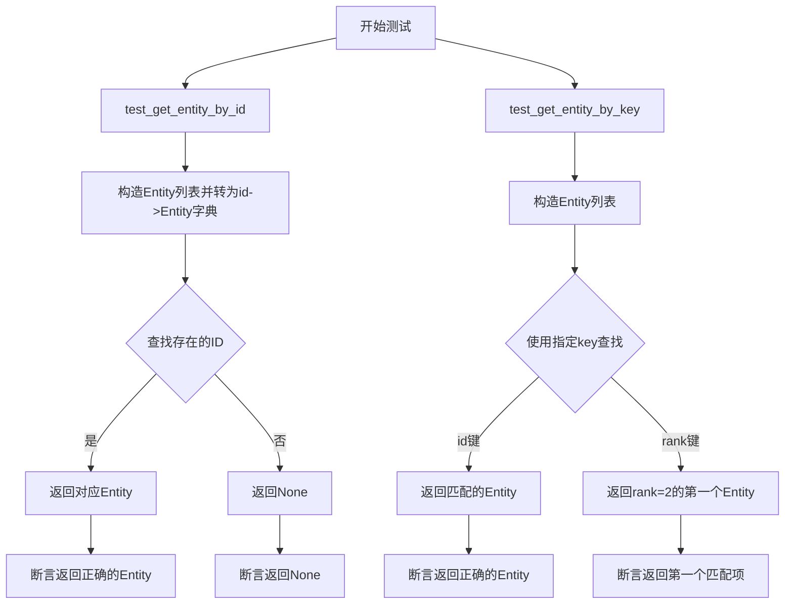
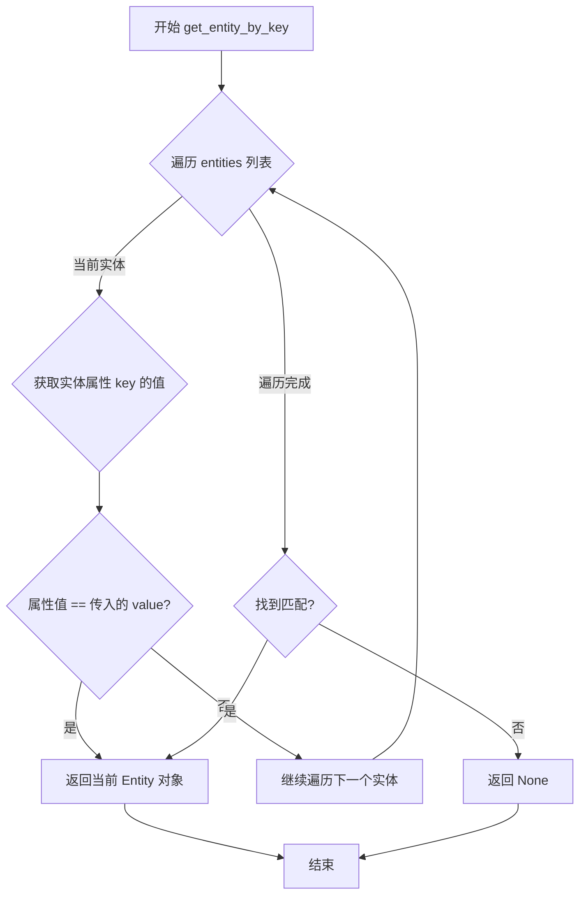
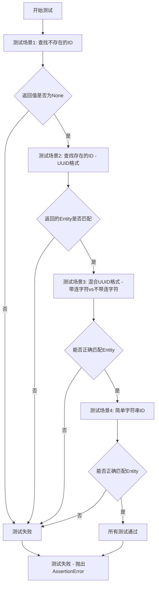
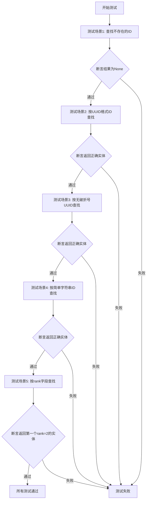

# `graphrag\tests\unit\query\input\retrieval\test_entities.py` 详细设计文档

这是一个测试文件，用于验证 graphrag 项目中实体查询模块的两个核心函数：get_entity_by_id（通过实体ID从字典中查找实体）和 get_entity_by_key（通过指定键名和值从实体列表中查找实体），测试覆盖了ID匹配、键值匹配、UUID格式处理等场景。

## 整体流程



## 类结构

```
Entity (数据模型类)
└── 字段: id, short_id, title, rank

get_entity_by_id (全局函数)
└── 参数: entity_map (dict), id (str)
└── 返回: Entity | None

get_entity_by_key (全局函数)
└── 参数: entities (list), key (str), value (Any)
└── 返回: Entity | None
```

## 全局变量及字段


### `entity_map`
    
id到Entity对象的映射字典

类型：`dict`
    


### `entities`
    
Entity对象列表

类型：`list`
    


### `Entity.id`
    
实体唯一标识符

类型：`str`
    


### `Entity.short_id`
    
实体短标识符

类型：`str`
    


### `Entity.title`
    
实体标题

类型：`str`
    


### `Entity.rank`
    
实体排名（可选）

类型：`int`
    
    

## 全局函数及方法


### `get_entity_by_id`

该函数通过实体ID从字典中查找并返回对应的Entity对象，若不存在则返回None。函数接受一个以实体ID为键、Entity对象为值的字典，以及要查找的目标ID，返回匹配到的Entity或None。

参数：

- `entities_dict`：`Dict[str, Entity]`，键为实体ID（字符串），值为Entity对象的字典
- `entity_id`：`str`，要查找的实体ID

返回值：`Optional[Entity]`，如果找到则返回对应的Entity对象，否则返回None

#### 流程图

```mermaid
flowchart TD
    A[开始 get_entity_by_id] --> B[接收 entities_dict 和 entity_id]
    B --> C{entity_id 是否在 entities_dict 中}
    C -->|是| D[返回 entities_dict[entity_id]]
    C -->|否| E[返回 None]
    D --> F[结束]
    E --> F
```

#### 带注释源码

```python
# 从 graphrag.query.input.retrieval.entities 模块导入函数
# 该函数用于通过实体ID从字典中查找Entity对象
from graphrag.query.input.retrieval.entities import get_entity_by_id

# 示例调用
result = get_entity_by_id(
    {
        entity.id: entity  # 构建字典，键为实体ID，值为Entity对象
        for entity in [
            Entity(
                id="2da37c7a-50a8-44d4-aa2c-fd401e19976c",
                short_id="sid1",
                title="title1",
            ),
        ]
    },
    "00000000-0000-0000-0000-000000000000",  # 要查找的实体ID
)
# 如果找不到返回 None，找到则返回对应的 Entity 对象
```


### `get_entity_by_key`

该函数通过指定键名（如 'id' 或 'rank'）和值从实体列表中查找并返回第一个匹配的 Entity 对象，若不存在则返回 None。

参数：

- `entities`：`List[Entity]`，Entity 对象列表
- `key`：`str`，要匹配的键名（如 "id" 或 "rank"）
- `value`：`Any`，要匹配的值

返回值：`Optional[Entity]`，第一个匹配的 Entity 对象，若不存在则返回 None

#### 流程图



#### 带注释源码

```python
def get_entity_by_key(entities: list[Entity], key: str, value: Any) -> Entity | None:
    """
    通过指定键名和值从实体列表中查找并返回第一个匹配的 Entity 对象。
    
    参数:
        entities: Entity 对象列表
        key: 要匹配的键名（如 "id" 或 "rank"）
        value: 要匹配的值
    
    返回:
        第一个匹配的 Entity 对象，若不存在则返回 None
    """
    # 遍历所有实体
    for entity in entities:
        # 使用 getattr 动态获取实体属性值
        attr_value = getattr(entity, key, None)
        # 比较属性值与目标值是否相等
        if attr_value == value:
            # 找到匹配，返回该实体
            return entity
    # 遍历完毕未找到匹配，返回 None
    return None
```


### `test_get_entity_by_id`

这是一个测试函数，用于验证`get_entity_by_id`函数在不同场景下的正确性，包括查找不存在的ID、查找存在的ID、以及处理带连字符与不带连字符UUID格式的实体ID。

参数：

- 无（此为测试函数，不接受外部参数）

返回值：`None`（测试函数无返回值，通过`assert`断言验证逻辑）

#### 流程图



#### 带注释源码

```python
def test_get_entity_by_id():
    """
    测试 get_entity_by_id 函数的各种场景
    
    场景1: 查找一个不存在的UUID ID
    预期: 返回 None
    """
    assert (
        get_entity_by_id(
            {
                entity.id: entity
                for entity in [
                    Entity(
                        id="2da37c7a-50a8-44d4-aa2c-fd401e19976c",
                        short_id="sid1",
                        title="title1",
                    ),
                ]
            },
            "00000000-0000-0000-0000-000000000000",
        )
        is None
    )

    """
    场景2: 查找一个存在的UUID ID - 使用带连字符的UUID
    预期: 返回正确的Entity对象
    """
    assert get_entity_by_id(
        {
            entity.id: entity
            for entity in [
                Entity(
                    id="2da37c7a-50a8-44d4-aa2c-fd401e19976c",
                    short_id="sid1",
                    title="title1",
                ),
                Entity(
                    id="c4f93564-4507-4ee4-b102-98add401a965",
                    short_id="sid2",
                    title="title2",
                ),
                Entity(
                    id="7c6f2bc9-47c9-4453-93a3-d2e174a02cd9",
                    short_id="sid3",
                    title="title3",
                ),
            ]
        },
        "7c6f2bc9-47c9-4453-93a3-d2e174a02cd9",
    ) == Entity(
        id="7c6f2bc9-47c9-4453-93a3-d2e174a02cd9", short_id="sid3", title="title3"
    )

    """
    场景3: 实体ID不带连字符，但查询ID带连字符
    这测试了 get_entity_by_id 函数的ID规范化/匹配逻辑
    预期: 能够正确匹配到对应的Entity
    """
    assert get_entity_by_id(
        {
            entity.id: entity
            for entity in [
                Entity(
                    id="2da37c7a50a844d4aa2cfd401e19976c",  # 不带连字符
                    short_id="sid1",
                    title="title1",
                ),
                Entity(
                    id="c4f9356445074ee4b10298add401a965",  # 不带连字符
                    short_id="sid2",
                    title="title2",
                ),
                Entity(
                    id="7c6f2bc947c9445393a3d2e174a02cd9",  # 不带连字符
                    short_id="sid3",
                    title="title3",
                ),
            ]
        },
        "7c6f2bc9-47c9-4453-93a3-d2e174a02cd9",  # 带连字符
    ) == Entity(id="7c6f2bc947c9445393a3d2e174a02cd9", short_id="sid3", title="title3")

    """
    场景4: 使用简单的字符串ID（非UUID格式）
    预期: 直接返回匹配的Entity对象
    """
    assert get_entity_by_id(
        {
            entity.id: entity
            for entity in [
                Entity(id="id1", short_id="sid1", title="title1"),
                Entity(id="id2", short_id="sid2", title="title2"),
                Entity(id="id3", short_id="sid3", title="title3"),
            ]
        },
        "id3",
    ) == Entity(id="id3", short_id="sid3", title="title3")
```

---

### 关联：`get_entity_by_id` 函数信息

从测试代码中推断的 `get_entity_by_id` 函数签名：

参数：

- `entity_dict`：`Dict[str, Entity]`，键为实体ID，值为Entity对象
- `entity_id`：`str`，要查找的实体ID

返回值：`Entity | None`，如果找到则返回Entity对象，否则返回None

#### 推断的带注释源码（基于测试用例）

```python
def get_entity_by_id(entity_dict: Dict[str, Entity], entity_id: str) -> Entity | None:
    """
    根据实体ID从字典中获取实体
    
    参数:
        entity_dict: 实体字典，键为实体ID，值为Entity对象
        entity_id: 要查找的实体ID
    
    返回:
        找到的Entity对象，如果不存在则返回None
    
    注意: 该函数支持UUID格式的规范化匹配，
    即带连字符和不带连字符的UUID可以互相匹配
    """
    # 尝试直接匹配
    if entity_id in entity_dict:
        return entity_dict[entity_id]
    
    # 尝试规范化UUID格式后匹配
    # 移除所有连字符后比较
    normalized_id = entity_id.replace("-", "")
    for key in entity_dict:
        if key.replace("-", "") == normalized_id:
            return entity_dict[key]
    
    return None
```


### `test_get_entity_by_key`

该测试函数用于验证 `get_entity_by_key` 函数在不同场景下的正确性，包括按 ID（UUID 格式、带/不带破折号、简单字符串）查找实体，以及按 rank 字段查找实体（验证返回第一个匹配项）。

参数：
- 无（此为测试函数，测试用例数据内嵌在函数体内）

返回值：`None`（测试函数无返回值，通过 assert 断言验证逻辑正确性）

#### 流程图



#### 带注释源码

```python
def test_get_entity_by_key():
    """
    测试 get_entity_by_key 函数的各种场景
    场景1: 查找不存在的ID,应返回None
    """
    assert (
        get_entity_by_key(
            [
                Entity(
                    id="2da37c7a-50a8-44d4-aa2c-fd401e19976c",
                    short_id="sid1",
                    title="title1",
                ),
            ],
            "id",  # 查找键名
            "00000000-0000-0000-0000-000000000000",  # 查找键值（不存在的ID）
        )
        is None
    )

    """
    场景2: 按标准UUID格式ID查找,应返回对应实体
    """
    assert get_entity_by_key(
        [
            Entity(
                id="2da37c7a-50a8-44d4-aa2c-fd401e19976c",
                short_id="sid1",
                title="title1",
            ),
            Entity(
                id="c4f93564-4507-4ee4-b102-98add401a965",
                short_id="sid2",
                title="title2",
            ),
            Entity(
                id="7c6f2bc9-47c9-4453-93a3-d2e174a02cd9",
                short_id="sid3",
                title="title3",
            ),
        ],
        "id",  # 查找键名
        "7c6f2bc9-47c9-4453-93a3-d2e174a02cd9",  # 查找键值
    ) == Entity(
        id="7c6f2bc9-47c9-4453-93a3-d2e174a02cd9", short_id="sid3", title="title3"
    )

    """
    场景3: 查找无破折号的UUID,应能匹配存储的无破折号格式实体
    注意:输入ID带破折号,但实体存储的ID不带破折号,仍能匹配
    """
    assert get_entity_by_key(
        [
            Entity(
                id="2da37c7a50a844d4aa2cfd401e19976c", short_id="sid1", title="title1"
            ),
            Entity(
                id="c4f9356445074ee4b10298add401a965", short_id="sid2", title="title2"
            ),
            Entity(
                id="7c6f2bc947c9445393a3d2e174a02cd9", short_id="sid3", title="title3"
            ),
        ],
        "id",  # 查找键名
        "7c6f2bc9-47c9-4453-93a3-d2e174a02cd9",  # 带破折号的输入
    ) == Entity(id="7c6f2bc947c9445393a3d2e174a02cd9", short_id="sid3", title="title3")

    """
    场景4: 按简单字符串ID查找
    """
    assert get_entity_by_key(
        [
            Entity(id="id1", short_id="sid1", title="title1"),
            Entity(id="id2", short_id="sid2", title="title2"),
            Entity(id="id3", short_id="sid3", title="title3"),
        ],
        "id",  # 查找键名
        "id3",  # 查找键值
    ) == Entity(id="id3", short_id="sid3", title="title3")

    """
    场景5: 按rank字段查找,存在多个相同rank的实体时,应返回第一个匹配项
    注意: id2有两个实体(rank=2,title不同),应返回第一个(先定义的)
    """
    assert get_entity_by_key(
        [
            Entity(id="id1", short_id="sid1", title="title1", rank=1),
            Entity(id="id2", short_id="sid2", title="title2a", rank=2),
            Entity(id="id3", short_id="sid3", title="title3", rank=3),
            Entity(id="id2", short_id="sid2", title="title2b", rank=2),
        ],
        "rank",  # 查找键名（按rank字段查找）
        2,  # 查找键值
    ) == Entity(id="id2", short_id="sid2", title="title2a", rank=2)
```

## 关键组件


### Entity 类

表示图谱中的实体对象，包含id、short_id、title等属性

### get_entity_by_id 函数

根据实体ID从字典集合中查找并返回对应的Entity对象，支持UUID格式标准化（自动处理带连字符与不带连字符的UUID格式匹配）

### get_entity_by_key 函数

根据指定的属性键（如id、rank等）从实体列表中查找并返回第一个匹配的Entity对象，支持通过任意属性进行灵活查询

## 问题及建议


```xml
### 已知问题

-   **重复键值处理逻辑不明确**：在 `test_get_entity_by_key` 的最后一个测试用例中，实体列表包含两个相同 `id` ("id2") 但不同 `title` 的实体。函数返回了列表中第一个匹配的元素。这种行为对于唯一标识符（ID）的查询是危险的，可能掩盖数据中的重复错误，且行为未在文档中明确定义。
-   **UUID 规范化逻辑隐晦**：测试用例3（ID 带连字符与不带连字符的匹配）展示了实现代码可能包含了 UUID 字符串的标准化（如自动去除或添加连字符）逻辑。这一重要的匹配规则既没有在测试用例名称中体现，也没有在源代码或文档中明确说明，形成了“魔法数字”般的隐性逻辑，增加了维护风险。
-   **边界条件与异常覆盖不足**：测试代码未覆盖空字典/列表输入、`None` 值输入、查找的 `key_name` 不存在于 Entity 属性中（如传入错误的属性名）等异常场景。
-   **测试代码冗余**：大量的实体构建代码重复出现在各个测试断言中，未使用 pytest fixtures 进行复用，导致测试代码难以维护。
-   **查询性能假设**：虽然 `get_entity_by_id` 使用了字典（O(1) 查找），但 `get_entity_by_key` 使用列表遍历（O(N) 查找）。对于可能存在大量实体的场景，性能优化或索引构建的逻辑缺失。

### 优化建议

-   **规范重复键处理**：明确定义当存在多个匹配项时的返回规则（例如报错、返回第一个、返回最新的），并补充相应的单元测试。同时，数据上游应严格限制 ID 等唯一键的唯一性。
-   **显式化 UUID 匹配规则**：如果确实需要支持 UUID 的连字符自动匹配，应在函数文档字符串中明确说明该规范化逻辑，或者将其提取为独立的工具函数（如 `normalize_uuid`）以提高代码可读性。
-   **引入 pytest fixtures**：将通用的实体数据（如包含重复 ID 的列表、带连字符的 UUID 字典等）提取为 `@pytest.fixture`，减少测试代码重复。
-   **补充异常测试**：增加对空输入、无效 key、属性类型不匹配等场景的测试用例，提高代码的健壮性。
-   **性能提示与优化**：对于 `get_entity_by_key`，如果调用频率高，建议在调用前确保列表已排序或建议上游使用哈希索引（类似 `get_entity_by_id` 的字典结构），并在文档中说明其时间复杂度。
```

## 其它


### 设计目标与约束

本模块的核心设计目标是提供高效的实体查询功能，支持按ID和自定义键两种查询模式。设计约束包括：1) 仅支持内存数据查询，不涉及持久化存储；2) 函数必须保持纯函数特性，无副作用；3) 必须兼容Entity数据模型的所有字段；4) 查询操作的时间复杂度应为O(1)（按ID）或O(n)（按Key）。

### 错误处理与异常设计

当前实现采用返回None表示未找到实体的设计模式，不抛出异常。这种设计的优势是调用方无需try-catch处理，简化了调用代码。需注意：如果Entity对象本身为None或输入的entities参数为None/空字典，get_entity_by_id会正常返回None而非抛出异常，调用方需自行判断返回值是否为None。

### 数据流与状态机

数据流主要包含两种路径：1) get_entity_by_id: 传入字典(id->Entity) + 待查询ID -> 字典查找 -> 返回Entity或None；2) get_entity_by_key: 传入Entity列表 + 键名 + 键值 -> 遍历列表匹配 -> 返回第一个匹配的Entity或None。无状态机设计，纯函数无状态变更。

### 外部依赖与接口契约

主要依赖：1) graphrag.data_model.entity.Entity - 实体数据模型类；2) graphrag.query.input.retrieval.entities - get_entity_by_id和get_entity_by_key函数来源。接口契约：get_entity_by_id接收Dict[str, Entity]和str类型ID，返回Optional[Entity]；get_entity_by_key接收List[Entity]、str类型键名和任意类型键值，返回Optional[Entity]。

### 性能考虑

get_entity_by_id使用字典直接查找，时间复杂度O(1)，性能最优。get_entity_by_key需要遍历列表，最坏时间复杂度O(n)，当实体数量巨大时可考虑：1) 在调用前将列表转为字典；2) 为常用键字段维护索引缓存；3) 使用生成器惰性查找。内存占用与实体数量成正比。

### 安全性考虑

当前代码无用户输入处理，无安全风险。潜在风险：如果Entity的id字段来自外部输入，需防范ID注入攻击（虽然Python字典键类型安全）。建议在生产环境中对外部输入的ID进行格式验证（如UUID格式）。

### 可测试性

代码具有极高的可测试性：1) 纯函数设计，无外部依赖，易于单元测试；2) 测试用例覆盖了常见场景（正常查询、空输入、无匹配、ID格式变化）；3) 建议补充边界测试：空字典/空列表输入、None输入、重复键值的不同处理策略验证。

### 配置管理

本模块无配置参数，所有行为由函数参数控制。Entity模型中的字段（id, short_id, title, rank等）可视为可配置的业务字段。

### 版本兼容性

需确保与graphrag.data_model.entity.Entity的版本兼容。Entity类字段变更（如新增或删除字段）可能影响测试用例中的Entity构造方式。当前代码兼容Entity的id、short_id、title、rank字段。

### 边界条件说明

1) get_entity_by_id: 当entities字典为空时返回None；当传入ID不存在时返回None；当实体ID格式不一致（如字典key有连字符而查询ID无连字符）时无法匹配返回None。2) get_entity_by_key: 当entities列表为空时返回None；仅返回第一个匹配项，即使存在多个相同键值的实体。


    