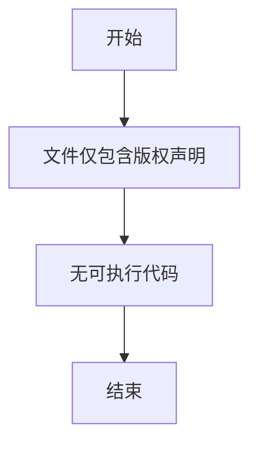

# `graphrag\tests\unit\storage\__init__.py` 详细设计文档

该文件仅包含版权声明和MIT许可证声明，没有实际的可执行代码功能可供分析。

## 整体流程



## 类结构

```
无类结构（代码中未定义任何类）
```

## 全局变量及字段


    

## 全局函数及方法


## 关键组件


### 概述

由于提供的源代码仅包含版权声明和许可证信息（MIT License），无实际实现代码，无法识别具体的架构组件、张量索引逻辑、反量化支持或量化策略等关键要素。

### 文件运行流程

无实际代码可供分析运行流程。

### 类与全局变量/函数详情

无类或函数实现可供分析。

### 关键组件信息

由于代码中未包含实现细节，无法识别具体的张量索引、惰性加载、反量化或量化策略等组件。

### 技术债务与优化空间

无代码实现可供评估技术债务或优化空间。

### 其它项目

无实现代码，无法提供设计目标、错误处理、数据流、外部依赖等相关信息。


## 问题及建议


### 已知问题

-   该代码文件仅包含版权声明和许可证头部信息，不包含任何实际的功能实现代码，无法进行详细的技术债务或优化空间分析

### 优化建议

-   由于代码文件为空或仅包含注释，建议等待实际功能代码实现后再进行技术债务评估和优化建议


## 其它


### 设计目标与约束

由于提供的代码仅为版权声明文件（License Header），未包含实际功能实现代码，因此无法确定具体的设计目标与约束。通常情况下，详细设计文档应包含项目的核心设计目标（如性能、可扩展性、安全性等）、技术约束（如编程语言版本、依赖库限制）、业务约束（如并发要求、数据一致性要求）以及非功能性需求（如可用性、可维护性指标）。

### 错误处理与异常设计

由于代码中未包含实际业务逻辑，无从分析具体的异常处理机制。详细设计文档应包含异常分类体系（业务异常 vs 系统异常）、异常传播策略、错误码定义规范、异常日志记录要求、降级策略以及故障恢复机制等内容。

### 数据流与状态机

代码中未包含任何数据处理逻辑，因此无数据流或状态机可供分析。详细设计文档应包含数据输入来源、数据处理流程、数据输出目的地、状态转换条件、状态存储方式以及状态一致性保证机制等设计内容。

### 外部依赖与接口契约

由于代码仅包含版权声明，无实际依赖关系或接口定义。详细设计文档应列出所有外部依赖库及其版本要求、API接口规范（包括请求/响应格式、错误响应结构）、第三方服务集成方案、版本兼容性策略以及接口变更管理机制。

### 性能要求与指标

代码中未包含性能相关的实现逻辑。详细设计文档应包含响应时间要求（RT阈值）、吞吐量指标（QPS/TPS）、资源利用率要求（CPU/内存/网络）、性能测试场景定义、性能基准线以及性能优化策略等内容。

### 安全考虑

代码中未包含安全相关的实现。详细设计文档应包含身份认证机制、授权策略、数据加密要求、输入验证规则、SQL注入防护、XSS防护、会话管理安全以及敏感数据保护等安全设计内容。

### 兼容性设计

代码中未包含兼容性相关逻辑。详细设计文档应包含向前/向后兼容性策略、API版本管理方案、数据格式版本演进、多平台支持要求、浏览器/环境兼容性以及降级处理机制等内容。

### 配置管理

代码中未包含配置相关逻辑。详细设计文档应包含配置项定义、配置来源（环境变量/配置文件/配置中心）、配置生效策略、配置验证规则、敏感配置加密存储以及配置变更审计等内容。

### 测试策略

代码中未包含测试代码。详细设计文档应包含单元测试覆盖率要求、集成测试场景、端到端测试策略、性能测试方法、安全测试要求、测试数据管理、Mock/Stub策略以及测试环境定义等内容。

### 部署架构

代码中未包含部署相关配置。详细设计文档应包含部署架构图（单机/集群/分布式）、容器化方案（Docker/K8s）、负载均衡策略、高可用设计、灾备方案、环境分离（开发/测试/生产）以及部署流程等内容。

### 监控与日志

代码中未包含监控或日志实现。详细设计文档应包含监控指标定义（系统指标/业务指标）、日志级别规范、日志格式标准、日志采集方案、告警规则定义、链路追踪方案以及可观测性设计等内容。

### 扩展性设计

代码中未包含扩展性设计。详细设计文档应包含水平扩展方案、垂直扩展策略、插件化架构设计、模块化设计原则、功能开关配置、热更新方案以及技术演进路线等内容。

### 代码规范与约定

由于缺乏实际代码，详细设计文档应包含编码规范（如命名约定、代码结构、注释要求）、提交规范（Commit Message格式）、Code Review检查清单、静态分析规则配置、代码复杂度控制以及重构策略等内容。

### 技术债务与改进建议

代码中未包含可分析的技术债务。但详细设计文档应记录已知技术债务列表、改进优先级排序、改进计划与时间表、重构风险评估以及技术决策记录（ADR）等内容。


    