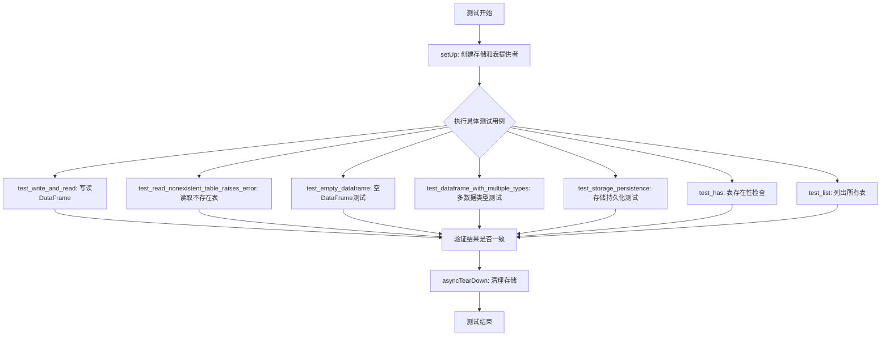
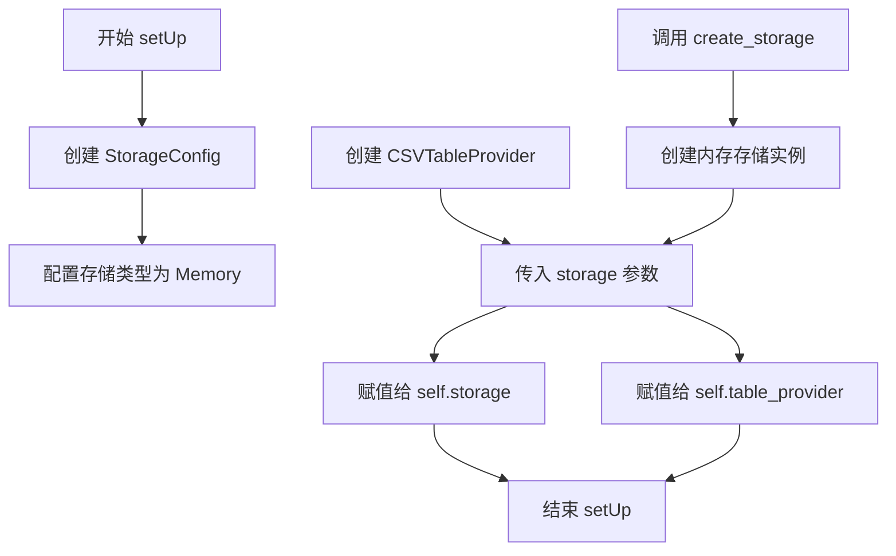
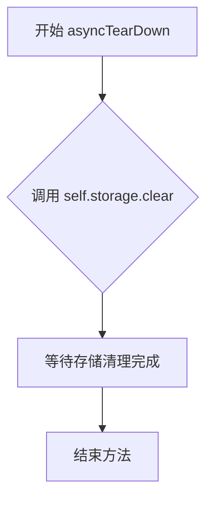
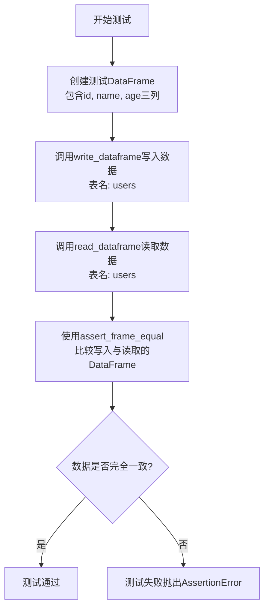
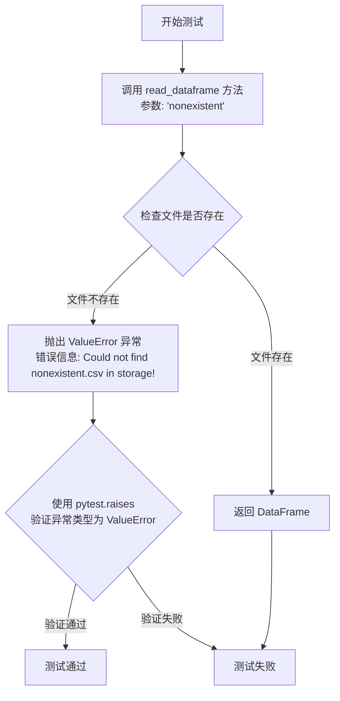
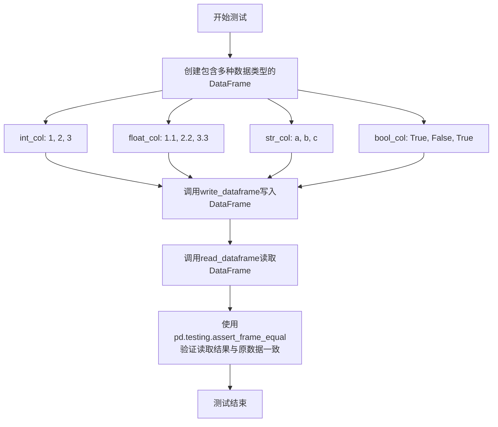
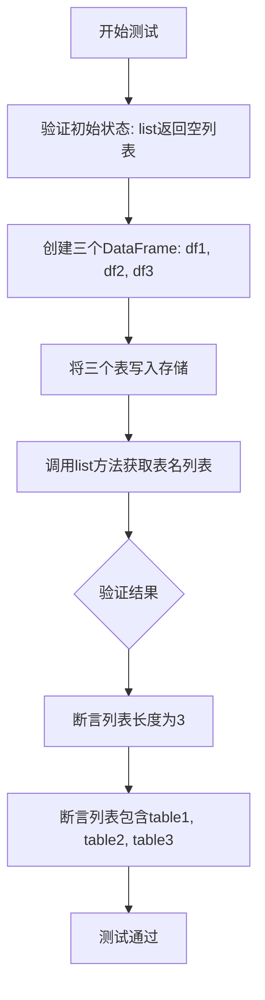

# `graphrag\tests\unit\storage\test_csv_table_provider.py` 详细设计文档

这是一个测试套件，用于验证 CSVTableProvider 类的功能。该测试类通过异步测试方法验证了 DataFrame 的读写操作、不存在的表错误处理、空 DataFrame、多数据类型、存储持久化、表存在性检查以及表列表获取等核心功能。

## 整体流程



## 类结构

```
unittest.IsolatedAsyncioTestCase (Python标准库)
└── TestCSVTableProvider (被测测试类)
    ├── setUp (测试前置设置)
    ├── asyncTearDown (测试后置清理)
    ├── test_write_and_read (读写测试)
    ├── test_read_nonexistent_table_raises_error (异常测试)
    ├── test_empty_dataframe (空数据测试)
    ├── test_dataframe_with_multiple_types (多类型测试)
    ├── test_storage_persistence (持久化测试)
    ├── test_has (存在性检查测试)
    └── test_list (列表测试)
```

## 全局变量及字段


### `TestCSVTableProvider.storage`
    
内存存储实例，用于在测试中存储CSV数据

类型：`Storage`
    


### `TestCSVTableProvider.table_provider`
    
CSV表提供者实例，用于测试CSV表格的读写操作

类型：`CSVTableProvider`
    
    

## 全局函数及方法


### `TestCSVTableProvider.setUp`

初始化测试环境，创建内存存储实例和 CSV 表提供者实例，供测试用例使用。

参数：

- `self`：隐式参数，`TestCSVTableProvider` 实例的引用

返回值：`None`，该方法为测试初始化方法，不返回任何值

#### 流程图



#### 带注释源码

```python
def setUp(self):
    """Set up test fixtures."""
    # 创建内存类型的存储配置
    self.storage = create_storage(
        StorageConfig(
            type=StorageType.Memory,  # 使用内存存储，便于测试隔离
        )
    )
    # 创建 CSV 表提供者，传入上面创建的存储实例
    self.table_provider = CSVTableProvider(storage=self.storage)
```


### `TestCSVTableProvider.asyncTearDown`

异步清理测试环境的方法，在每个测试方法执行完毕后自动调用，用于清空底层存储中的所有数据，确保测试之间的隔离性。

参数：

- `self`：`TestCSVTableProvider`，测试类实例本身，包含测试所需的存储和表提供者

返回值：`None`，无返回值，执行清理操作后直接结束

#### 流程图



#### 带注释源码

```python
async def asyncTearDown(self):
    """Clean up after tests."""
    # 异步调用存储的 clear 方法，清空所有已存储的数据
    # 确保每个测试用例执行完毕后，存储状态被重置
    # 防止测试之间的数据污染
    await self.storage.clear()
```


### `TestCSVTableProvider.test_write_and_read`

该测试方法用于验证 CSVTableProvider 的核心功能：创建包含用户信息的 DataFrame，通过 `write_dataframe` 方法将其写入存储，再通过 `read_dataframe` 方法读取数据，最后使用 `pd.testing.assert_frame_equal` 验证写入与读取的数据一致性。

参数：

- `self`：隐式参数，`TestCSVTableProvider` 类型，表示测试类实例本身

返回值：`None`，测试方法无返回值，通过测试框架的断言来验证功能正确性

#### 流程图



#### 带注释源码

```python
async def test_write_and_read(self):
    """Test writing and reading a DataFrame."""
    # Step 1: 创建测试用的DataFrame，包含用户数据
    # 列: id (整数), name (字符串), age (整数)
    df = pd.DataFrame({
        "id": [1, 2, 3],
        "name": ["Alice", "Bob", "Charlie"],
        "age": [30, 25, 35],
    })

    # Step 2: 异步调用write_dataframe方法
    # 将DataFrame写入存储，存储为users.csv文件
    await self.table_provider.write_dataframe("users", df)
    
    # Step 3: 异步调用read_dataframe方法
    # 从存储中读取users表对应的DataFrame
    result = await self.table_provider.read_dataframe("users")

    # Step 4: 断言验证
    # 使用pandas测试工具比较原始DataFrame和读取的DataFrame
    # 确保两者完全一致（包括索引、列名、数据类型和值）
    pd.testing.assert_frame_equal(result, df)
```


### `TestCSVTableProvider.test_read_nonexistent_table_raises_error`

测试读取不存在的表时是否正确抛出 ValueError 异常，验证 CSVTableProvider 在尝试读取不存在的表时的错误处理能力。

参数：

- `self`：无参数类型，TestCase 实例本身，无需显式传递

返回值：`None`，无返回值描述（测试方法不返回任何值，仅验证异常行为）

#### 流程图



#### 带注释源码

```python
async def test_read_nonexistent_table_raises_error(self):
    """Test that reading a nonexistent table raises ValueError."""
    # 使用 pytest.raises 上下文管理器来捕获并验证异常
    with pytest.raises(
        ValueError, match=r"Could not find nonexistent\.csv in storage!"
    ):
        # 尝试读取一个不存在的表 'nonexistent'
        # 预期行为：CSVTableProvider.read_dataframe 方法应该检查文件是否存在
        # 如果文件不存在，应抛出 ValueError 并包含特定错误信息
        await self.table_provider.read_dataframe("nonexistent")
```


### `TestCSVTableProvider.test_empty_dataframe`

测试空 DataFrame 的写入和读取功能，验证 CSVTableProvider 能够正确处理空表格数据。

参数：
- 无（仅使用 `self` 实例属性）

返回值：`None`，通过断言验证写入和读取的 DataFrame 相等

#### 流程图

```mermaid
flowchart TD
    A[开始测试] --> B[创建空 DataFrame<br/>pd.DataFrame()]
    B --> C[调用 write_dataframe<br/>写入空表格 'empty']
    C --> D[调用 read_dataframe<br/>读取空表格 'empty']
    D --> E[断言比较<br/>pd.testing.assert_frame_equal]
    E --> F{相等?}
    F -->|是| G[测试通过]
    F -->|否| H[测试失败]
```

#### 带注释源码

```python
async def test_empty_dataframe(self):
    """Test writing and reading an empty DataFrame."""
    # 步骤1: 创建一个空的 DataFrame（无列也无数据）
    df = pd.DataFrame()

    # 步骤2: 调用 CSVTableProvider 的 write_dataframe 方法
    # 将空表格写入存储，键名为 "empty"
    await self.table_provider.write_dataframe("empty", df)
    
    # 步骤3: 调用 CSVTableProvider 的 read_dataframe 方法
    # 从存储中读取键名为 "empty" 的表格
    result = await self.table_provider.read_dataframe("empty")

    # 步骤4: 使用 pandas 测试框架断言写入和读取的 DataFrame 相等
    # 这会验证空表格的数据一致性
    pd.testing.assert_frame_equal(result, df)
```


### `TestCSVTableProvider.test_dataframe_with_multiple_types`

测试 DataFrame 包含多种列类型（int、float、string、bool）时的写入和读取功能是否正常。

参数：

- `self`：`TestCSVTableProvider`，测试类实例本身

返回值：`None`，异步测试方法无返回值，通过 `pd.testing.assert_frame_equal` 验证数据一致性

#### 流程图



#### 带注释源码

```python
async def test_dataframe_with_multiple_types(self):
    """Test DataFrame with multiple column types."""
    # 创建一个包含多种数据类型的 DataFrame
    # 包含整数、浮点数、字符串和布尔类型列
    df = pd.DataFrame({
        "int_col": [1, 2, 3],      # 整数类型列
        "float_col": [1.1, 2.2, 3.3],  # 浮点数类型列
        "str_col": ["a", "b", "c"],    # 字符串类型列
        "bool_col": [True, False, True],  # 布尔类型列
    })

    # 使用 table_provider 将 DataFrame 写入存储，键名为 "mixed"
    await self.table_provider.write_dataframe("mixed", df)
    
    # 从存储中读取键名为 "mixed" 的 DataFrame
    result = await self.table_provider.read_dataframe("mixed")

    # 验证读取的 DataFrame 与原始 DataFrame 完全一致
    # 包括数据类型和数值都应相同
    pd.testing.assert_frame_equal(result, df)
```


### `TestCSVTableProvider.test_storage_persistence`

测试数据在底层存储中的持久化，验证写入的 DataFrame 是否正确保存到存储层，并能正确读取恢复。

参数：

- `self`：无显式参数（隐式传递的测试类实例），包含测试所需的 `table_provider` 和 `storage` 实例

返回值：`None`，该方法为异步测试方法，通过 `assert` 语句进行断言验证，无显式返回值

#### 流程图

```mermaid
flowchart TD
    A[开始测试] --> B[创建测试DataFrame<br/>df = pd.DataFrame({'x': [1, 2, 3]})]
    B --> C[调用write_dataframe写入数据<br/>write_dataframe('test', df)]
    C --> D[断言存储中存在test.csv<br/>storage.has('test.csv')]
    D --> E{断言通过?}
    E -->|是| F[从存储获取CSV数据<br/>storage.get('test.csv', as_bytes=False)]
    E -->|否| G[测试失败 - 抛出AssertionError]
    F --> H[使用StringIO解析CSV字符串<br/>pd.read_csv(StringIO(csv_data))]
    H --> I[断言加载的DataFrame与原始DataFrame相等<br/>pd.testing.assert_frame_equal]
    I --> J[结束测试]
```

#### 带注释源码

```python
async def test_storage_persistence(self):
    """Test that data is persisted in underlying storage."""
    # 创建一个简单的测试DataFrame，包含列'x'和值[1, 2, 3]
    df = pd.DataFrame({"x": [1, 2, 3]})

    # 调用table_provider的write_dataframe方法将DataFrame写入存储
    # 存储时会将DataFrame转换为CSV文件，文件名格式为 {table_name}.csv
    await self.table_provider.write_dataframe("test", df)

    # 验证底层存储中确实存在对应的CSV文件
    # 通过storage.has()方法检查'test.csv'是否存在于存储中
    assert await self.storage.has("test.csv")

    # 从底层存储获取CSV文件的内容
    # as_bytes=False 表示以字符串形式返回（而非字节形式）
    # 这样可以直接使用StringIO进行解析
    csv_data = await self.storage.get("test.csv", as_bytes=False)
    
    # 使用pandas的read_csv将CSV字符串解析为DataFrame
    # StringIO将字符串模拟为文件对象供pandas读取
    loaded_df = pd.read_csv(StringIO(csv_data))

    # 验证从存储中加载的DataFrame与原始写入的DataFrame完全一致
    # 使用pd.testing.assert_frame_equal进行深度比较（列名、索引、数据类型、数据值）
    pd.testing.assert_frame_equal(loaded_df, df)
```


### `TestCSVTableProvider.test_has`

测试 has() 方法用于检查表是否存在于存储中，验证在写入数据前后 has() 方法能正确返回表的存活状态。

参数：

-  `self`：`TestCSVTableProvider`，测试类实例，包含测试所需的 table_provider 和 storage 对象

返回值：`bool`，测试断言结果，验证 has() 方法对不存在和已存在表的返回值的正确性

#### 流程图

```mermaid
flowchart TD
    A[开始测试 test_has] --> B[创建测试数据 DataFrame df]
    B --> C[断言 table_provider.has('test_table') 返回 False]
    C --> D[调用 write_dataframe 写入表]
    D --> E[断言 table_provider.has('test_table') 返回 True]
    E --> F[测试通过]
```

#### 带注释源码

```python
async def test_has(self):
    """Test has() method for checking table existence."""
    # 创建测试用的 DataFrame，包含列 'a' 和三行数据
    df = pd.DataFrame({"a": [1, 2, 3]})

    # 步骤1: 表尚未写入，验证 has() 返回 False（表不存在）
    assert not await self.table_provider.has("test_table")

    # 步骤2: 将 DataFrame 写入存储，创建表 'test_table'
    await self.table_provider.write_dataframe("test_table", df)

    # 步骤3: 表已写入后，验证 has() 返回 True（表存在）
    assert await self.table_provider.has("test_table")
```


### `TestCSVTableProvider.test_list`

该测试方法用于验证CSVTableProvider类的list()方法能够正确列出存储中的所有表。测试首先验证空存储返回空列表，然后创建三个表并写入存储，最后断言list()方法返回的表名集合与预期一致。

参数：无（仅包含self参数）

返回值：`None`，该测试方法不返回任何值，仅执行断言验证

#### 流程图



#### 带注释源码

```python
async def test_list(self):
    """Test listing all tables in storage."""
    # 验证初始状态下，存储为空，list方法返回空列表
    assert self.table_provider.list() == []

    # 创建三个测试用的DataFrame对象
    df1 = pd.DataFrame({"a": [1, 2, 3]})
    df2 = pd.DataFrame({"b": [4, 5, 6]})
    df3 = pd.DataFrame({"c": [7, 8, 9]})

    # 异步写入三个表到存储中
    await self.table_provider.write_dataframe("table1", df1)
    await self.table_provider.write_dataframe("table2", df2)
    await self.table_provider.write_dataframe("table3", df3)

    # 调用list方法获取所有表的名称
    tables = self.table_provider.list()
    
    # 验证返回的表数量为3
    assert len(tables) == 3
    
    # 验证返回的表名集合与预期一致
    assert set(tables) == {"table1", "table2", "table3"}
```

## 关键组件


### CSVTableProvider

核心表格读写Provider，支持将DataFrame写入CSV文件并从存储中读取，支持异步操作。

### Storage 抽象层

底层存储抽象，通过 create_storage 创建，支持 Memory 等多种存储类型，负责数据的持久化。

### DataFrame 序列化/反序列化

将 pandas DataFrame 转换为 CSV 格式存储，以及从 CSV 字符串还原为 DataFrame 的数据转换能力。

### 异步测试框架

使用 unittest.IsolatedAsyncioTestCase 实现异步测试用例，支持 async/await 语法的测试方法。

### 表存在性检查

has() 方法用于检查指定名称的表是否存在于存储中。

### 表列表查询

list() 方法返回存储中所有已存在表的名称列表。


## 问题及建议


### 已知问题

-   **测试隔离不足**：`test_list` 测试依赖于之前测试写入的数据（"table1", "table2", "table3"），如果测试执行顺序改变或前面测试失败，该测试可能产生不确定结果
-   **测试覆盖不全面**：缺少对边界情况的测试，如空表名、None DataFrame、大数据集写入、写入后覆盖数据等场景
-   **测试实现细节**：`test_storage_persistence` 直接访问底层存储（`self.storage.has()` 和 `self.storage.get()`），测试的是实现细节而非公共接口，削弱了测试的可维护性
-   **缺少异常处理测试**：未测试写入失败、存储不可用等异常情况
-   **CSV 配置参数未测试**：CSV 格式参数（分隔符、编码、索引列等）未被测试覆盖

### 优化建议

-   **增强测试隔离**：在每个测试前清理存储或使用唯一的表名（如添加时间戳或 UUID 后缀），确保测试之间互不干扰
-   **补充边界测试用例**：添加空表名、None DataFrame、大数据集、超长字符串、特殊字符等边界场景的测试
-   **重构存储持久化测试**：通过重新读取验证数据而非直接访问存储层，或将此测试移至单元测试套件
-   **添加负向测试**：测试写入不存在的目录、磁盘空间不足、权限错误等异常场景
-   **考虑使用 pytest-asyncio**：如项目支持，可改用 pytest 生态的异步测试支持，获得更清晰的测试输出和更好的集成

## 其它


### 设计目标与约束

**设计目标**：为graphrag_storage库提供CSV格式的表格数据读写能力，支持将DataFrame以CSV格式存储到多种存储后端，并支持读取、列表、存在性检查等操作。

**约束条件**：
- 依赖pandas库进行DataFrame与CSV的相互转换
- 依赖graphrag_storage的存储抽象层
- 仅支持异步操作（async/await）
- CSV文件名自动添加.csv后缀

### 错误处理与异常设计

**主要异常场景**：
1. 读取不存在的表：抛出`ValueError`，匹配信息"Could not find {table_name}.csv in storage!"
2. 存储后端异常：由底层storage实现决定

**异常传播机制**：底层存储异常直接向上传播，测试中使用pytest.raises捕获ValueError进行验证

### 数据流与状态机

**写操作流程**：
1. 接收表名和DataFrame
2. 将DataFrame转换为CSV字符串
3. 添加.csv后缀到表名
4. 调用storage.write()写入存储
5. 返回完成

**读操作流程**：
1. 接收表名
2. 检查表是否存在（has方法）
3. 如不存在，抛出ValueError
4. 从storage读取CSV内容
5. 使用pandas.read_csv解析为DataFrame
6. 返回DataFrame

### 外部依赖与接口契约

**直接依赖**：
- `pandas`：DataFrame操作和CSV序列化/反序列化
- `graphrag_storage`：存储抽象层（StorageConfig, StorageType, create_storage）
- `io.StringIO`：CSV字符串流式读取
- `pytest`：测试框架和异常捕获

**接口契约**：
- `write_dataframe(table_name: str, df: pd.DataFrame) -> None`：异步写入
- `read_dataframe(table_name: str) -> pd.DataFrame`：异步读取
- `has(table_name: str) -> bool`：同步检查存在性
- `list() -> List[str]`：同步列出所有表

### 性能考虑

**当前实现特点**：
- 使用StringIO进行内存中CSV转换，避免临时文件
- 所有操作均为单次IO，无批量优化
- 内存存储适合小数据量场景

**潜在优化点**：
- 大DataFrame可考虑分块写入
- 可添加缓存机制减少重复解析
- 可支持流式读取大CSV文件

### 安全性考虑

**当前实现**：
- 无用户输入验证（依赖上游调用方）
- 无敏感数据处理
- 无访问控制

**建议**：
- 表名应进行安全校验，防止路径遍历攻击
- 敏感数据应考虑加密存储

### 兼容性考虑

**Python版本**：支持Python 3.8+（基于unittest.IsolatedAsyncioTestCase）

**依赖版本约束**：
- pandas：需支持DataFrame和read_csv/to_csv
- graphrag_storage：需实现Storage接口
- pytest：需支持pytest.raises上下文管理器

### 测试策略

**测试覆盖**：
- 基本读写功能验证（test_write_and_read）
- 异常情况验证（test_read_nonexistent_table_raises_error）
- 边界情况：空DataFrame（test_empty_dataframe）
- 数据类型多样性（test_dataframe_with_multiple_types）
- 存储持久化验证（test_storage_persistence）
- 存在性检查（test_has）
- 列表功能（test_list）

**测试隔离**：使用IsolatedAsyncioTestCase确保异步测试隔离，setUp创建新存储实例，asyncTearDown清理

### 资源管理

**资源生命周期**：
- Storage在setUp创建，asyncTearDown清理
- CSVTableProvider持有storage引用
- 无显式资源泄漏风险

**内存考虑**：
- StringIO用于CSV字符串转换
- 大数据量时需注意内存占用

### 并发考虑

**当前实现**：
- 无显式并发控制
- 依赖底层storage的线程安全实现
- Memory Storage在单进程内共享状态

**建议**：如需多线程/多协程并发访问，需确保底层storage支持并发操作

    