# `graphrag\tests\unit\storage\test_parquet_table_provider.py` 详细设计文档

这是一个针对 ParquetTableProvider 类的单元测试文件，用于验证 Parquet 格式数据的读写功能、错误处理、存储持久化等核心功能。

## 整体流程

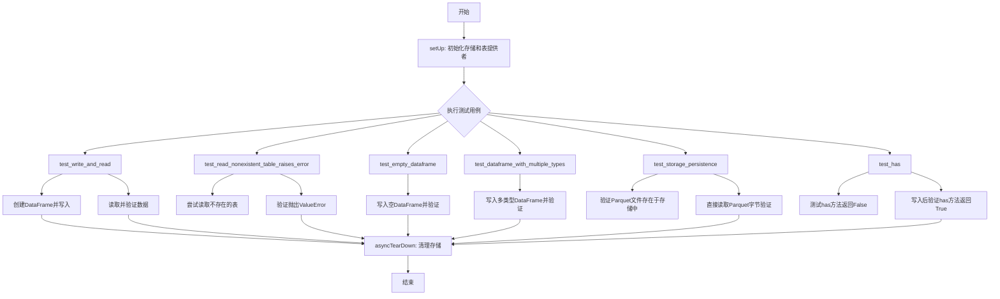

## 类结构

```
TestParquetTableProvider (测试类)
├── setUp (初始化方法)
├── asyncTearDown (清理方法)
├── test_write_and_read (测试写入读取)
├── test_read_nonexistent_table_raises_error (测试错误处理)
├── test_empty_dataframe (测试空DataFrame)
├── test_dataframe_with_multiple_types (测试多类型)
├── test_storage_persistence (测试持久化)
└── test_has (测试has方法)
```

## 全局变量及字段


### `TestParquetTableProvider.storage`
    
存储实例，用于测试的内存存储

类型：`Storage`
    


### `TestParquetTableProvider.table_provider`
    
ParquetTableProvider实例，用于测试读写DataFrame功能

类型：`ParquetTableProvider`
    
    

## 全局函数及方法


### `create_storage`

该函数用于根据提供的存储配置创建一个存储实例，支持不同类型的存储后端（如内存存储、文件系统存储等）。

参数：

- `config`：`StorageConfig`，存储配置对象，包含存储类型等配置信息

返回值：`Storage`，存储实例，提供数据的读写和管理能力（如 clear、has、get 等方法）

#### 流程图

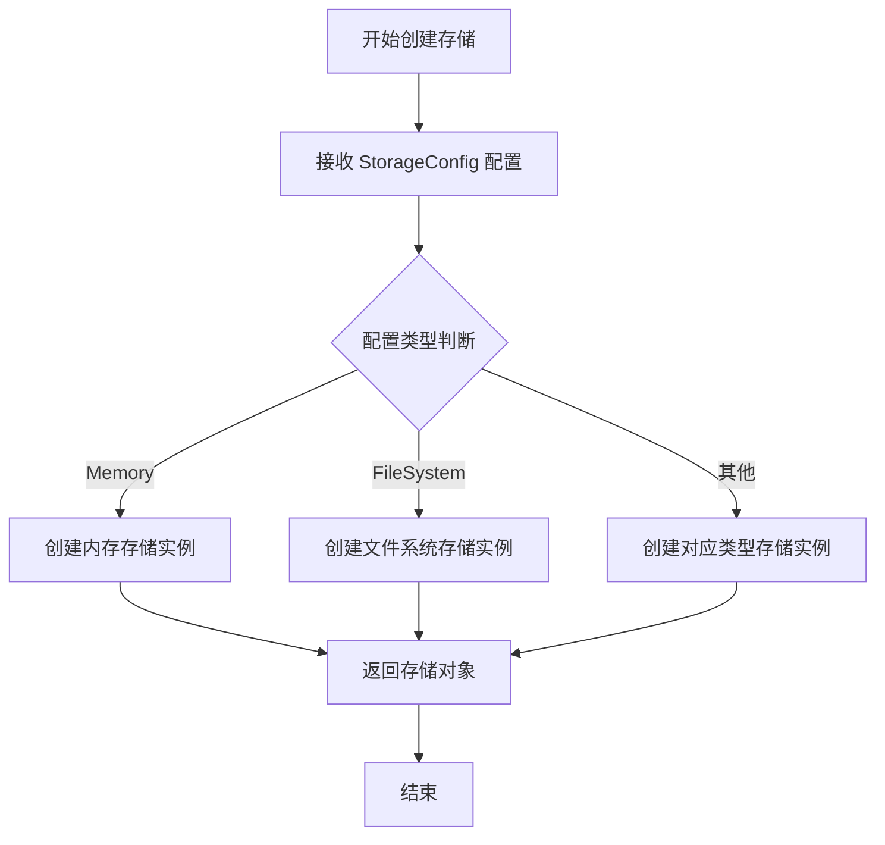

#### 带注释源码

```python
# 导入 create_storage 函数
# 从 graphrag_storage 模块导入存储配置和创建函数
from graphrag_storage import (
    StorageConfig,
    StorageType,
    create_storage,
)

# 在测试的 setUp 方法中调用 create_storage
# 创建了一个内存类型的存储实例
self.storage = create_storage(
    StorageConfig(
        type=StorageType.Memory,  # 指定存储类型为内存存储
    )
)

# 存储对象的使用方式（从测试用例推断）
# 1. 清空存储
await self.storage.clear()

# 2. 检查文件是否存在
await self.storage.has("test.parquet")

# 3. 获取文件内容（字节流）
parquet_bytes = await self.storage.get("test.parquet", as_bytes=True)
```


### `pd.DataFrame`

`pd.DataFrame` 是 Pandas 库中的核心数据结构，用于表示二维表格数据。在本测试文件中用于创建各种测试数据，验证 ParquetTableProvider 的读写功能。

参数：

- `data`：`dict | None`，用于构造 DataFrame 的数据，可以是字典、数组或其他 DataFrame
- `index`：`Index | array-like | None`，行索引标签
- `columns`：`Index | array-like | None`，列索引标签
- `dtype`：`dtype | None`，指定数据类型
- `copy`：`bool | None`，是否复制数据

返回值：`pd.DataFrame`，返回创建的二维表格数据对象

#### 流程图

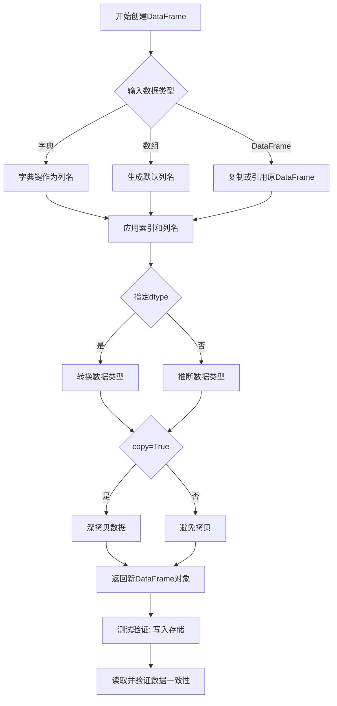

#### 带注释源码

```python
# 测试用例1: 创建包含用户信息的DataFrame
df = pd.DataFrame({
    "id": [1, 2, 3],           # 整数类型的ID列
    "name": ["Alice", "Bob", "Charlie"],  # 字符串类型的姓名列
    "age": [30, 25, 35],       # 整数类型的年龄列
})
# 生成的DataFrame结构:
#    id     name  age
# 0   1    Alice   30
# 1   2      Bob   25
# 2   3  Charlie   35

# 测试用例2: 创建空DataFrame
df = pd.DataFrame()
# 创建一个没有任何列和行的空DataFrame
#    Empty DataFrame
#    Columns: []
#    Index: []

# 测试用例3: 创建包含多种数据类型的DataFrame
df = pd.DataFrame({
    "int_col": [1, 2, 3],      # 整数列
    "float_col": [1.1, 2.2, 3.3],  # 浮点数列
    "str_col": ["a", "b", "c"],    # 字符串列
    "bool_col": [True, False, True],  # 布尔列
})

# 测试用例4: 创建简单DataFrame用于持久化测试
df = pd.DataFrame({"x": [1, 2, 3]})
# 用于测试Parquet格式的存储和读取

# 测试用例5: 创建用于has方法测试的DataFrame
df = pd.DataFrame({"a": [1, 2, 3]})
# 用于验证表是否存在的方法
```

### `TestParquetTableProvider`

测试类，用于验证 ParquetTableProvider 的各项功能，包括 DataFrame 的读写操作、错误处理、持久化存储等。

参数：

- `unittest.IsolatedAsyncioTestCase`：异步测试用例基类

返回值：N/A（测试类）

#### 流程图

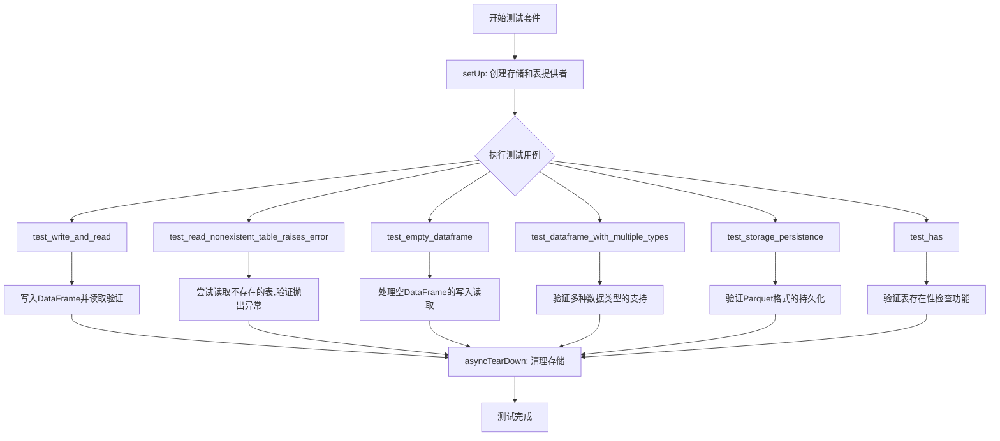

#### 带注释源码

```python
class TestParquetTableProvider(unittest.IsolatedAsyncioTestCase):
    """ParquetTableProvider功能测试类"""
    
    def setUp(self):
        """测试前置设置: 初始化内存存储和表提供者"""
        # 创建内存存储配置
        self.storage = create_storage(
            StorageConfig(
                type=StorageType.Memory,  # 使用内存存储
            )
        )
        # 创建Parquet表提供者实例
        self.table_provider = ParquetTableProvider(storage=self.storage)

    async def asyncTearDown(self):
        """测试后置清理: 清空存储"""
        await self.storage.clear()

    async def test_write_and_read(self):
        """测试基本的DataFrame写入和读取功能"""
        # 创建包含用户信息的DataFrame
        df = pd.DataFrame({
            "id": [1, 2, 3],
            "name": ["Alice", "Bob", "Charlie"],
            "age": [30, 25, 35],
        })
        # 写入名为"users"的表
        await self.table_provider.write_dataframe("users", df)
        # 读取并验证数据一致性
        result = await self.table_provider.read_dataframe("users")
        # 使用Pandas测试框架验证DataFrame相等
        pd.testing.assert_frame_equal(result, df)

    async def test_read_nonexistent_table_raises_error(self):
        """测试读取不存在的表时抛出正确的错误"""
        # 使用pytest验证抛出ValueError异常
        with pytest.raises(
            ValueError, match=r"Could not find nonexistent\.parquet in storage!"
        ):
            # 尝试读取不存在的表
            await self.table_provider.read_dataframe("nonexistent")

    async def test_empty_dataframe(self):
        """测试处理空DataFrame的能力"""
        # 创建空DataFrame
        df = pd.DataFrame()
        # 写入空表
        await self.table_provider.write_dataframe("empty", df)
        # 读取并验证
        result = await self.table_provider.read_dataframe("empty")
        pd.testing.assert_frame_equal(result, df)

    async def test_dataframe_with_multiple_types(self):
        """测试支持多种数据类型的DataFrame"""
        # 创建包含多种数据类型的DataFrame
        df = pd.DataFrame({
            "int_col": [1, 2, 3],
            "float_col": [1.1, 2.2, 3.3],
            "str_col": ["a", "b", "c"],
            "bool_col": [True, False, True],
        })
        # 写入混合类型表
        await self.table_provider.write_dataframe("mixed", df)
        # 读取并验证数据类型保持一致
        result = await self.table_provider.read_dataframe("mixed")
        pd.testing.assert_frame_equal(result, df)

    async def test_storage_persistence(self):
        """测试Parquet格式的持久化存储"""
        df = pd.DataFrame({"x": [1, 2, 3]})
        # 写入DataFrame
        await self.table_provider.write_dataframe("test", df)
        # 验证文件已存储
        assert await self.storage.has("test.parquet")
        # 直接从存储获取Parquet字节数据
        parquet_bytes = await self.storage.get("test.parquet", as_bytes=True)
        # 使用Pandas读取Parquet并验证
        loaded_df = pd.read_parquet(BytesIO(parquet_bytes))
        pd.testing.assert_frame_equal(loaded_df, df)

    async def test_has(self):
        """测试表存在性检查功能"""
        df = pd.DataFrame({"a": [1, 2, 3]})
        # 表尚不存在
        assert not await self.table_provider.has("test_table")
        # 写入表
        await self.table_provider.write_dataframe("test_table", df)
        # 现在表应该存在
        assert await self.table_provider.has("test_table")
```


### `pd.read_parquet`

该函数是pandas库内置的函数，用于从Parquet文件、路径或文件-like对象中读取数据，并返回pandas DataFrame。在本代码中，它用于将从存储中获取的Parquet格式的字节数据反序列化为pandas DataFrame，以验证数据持久化的正确性。

参数：

- `source`：`BytesIO`，表示包含Parquet格式数据的字节流对象（类文件对象）

返回值：`pd.DataFrame`，返回从Parquet数据中解析出的DataFrame对象

#### 流程图

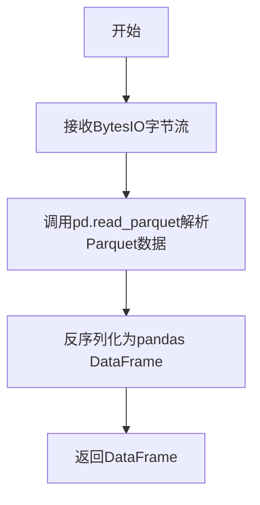

#### 带注释源码

```python
# 从存储中获取test.parquet文件的字节数据
parquet_bytes = await self.storage.get("test.parquet", as_bytes=True)

# 使用pd.read_parquet从BytesIO字节流中读取数据
# pd.read_parquet内部会:
# 1. 识别Parquet格式
# 2. 使用pyarrow或fastparquet引擎解码
# 3. 将列式存储的数据转换为pandas DataFrame的行格式
loaded_df = pd.read_parquet(BytesIO(parquet_bytes))

# 验证读取的数据与原始写入的DataFrame一致
pd.testing.assert_frame_equal(loaded_df, df)
```

---

**补充说明**

| 项目 | 说明 |
|------|------|
| **函数来源** | pandas 库内置函数，非本项目定义 |
| **实际调用位置** | `TestParquetTableProvider.test_storage_persistence` 测试方法 |
| **使用目的** | 验证 ParquetTableProvider 将 DataFrame 写入存储后，能够正确读取并还原数据 |
| **依赖引擎** | 默认为 'auto'，会自动选择 pyarrow 或 fastparquet 引擎进行解码 |


### `pd.testing.assert_frame_equal`

该函数是 pandas 库提供的测试工具函数，用于比较两个 DataFrame 是否相等。如果两个 DataFrame 在结构、索引、列名、数据类型和数值方面相同，则函数通过；否则会抛出详细的 AssertionError，列出所有差异。

参数：

-  `left`：`pd.DataFrame`，要比较的左侧 DataFrame
-  `right`：`pd.DataFrame`，要比较的右侧 DataFrame
-  `check_dtype`：`bool`，是否检查数据类型完全相同，默认为 True
-  `check_index_type`：`bool`，是否检查索引类型，默认为 False
-  `check_column_type`：`bool`，是否检查列类型，默认为 False
-  `check_names`：`bool`，是否检查索引和列的名称，默认为 True
-  `check_exact`：`bool`，是否进行精确数值比较（不考虑浮点误差），默认为 False
-  `check_datetimelike_compat`：`bool`，是否比较日期时间类型的兼容性，默认为 False
-  `check_categorical`：`bool`，是否检查分类数据类型，默认为 True
-  `check_freq`：`bool`，是否检查索引频率，默认为 False
-  `check_flags`：`bool`，是否检查标志属性，默认为 False
-  `rtol`：`float`，相对误差容限（配合 check_exact=False 使用），默认为 0.0
-  `atol`：`float`，绝对误差容限（配合 check_exact=False 使用），默认为 0.0
-  `obj`：`str`，用于错误消息中标识比较对象，默认为 'DataFrame'

返回值：`None`，如果比较通过则不返回任何内容，如果比较失败则抛出 `AssertionError`

#### 流程图

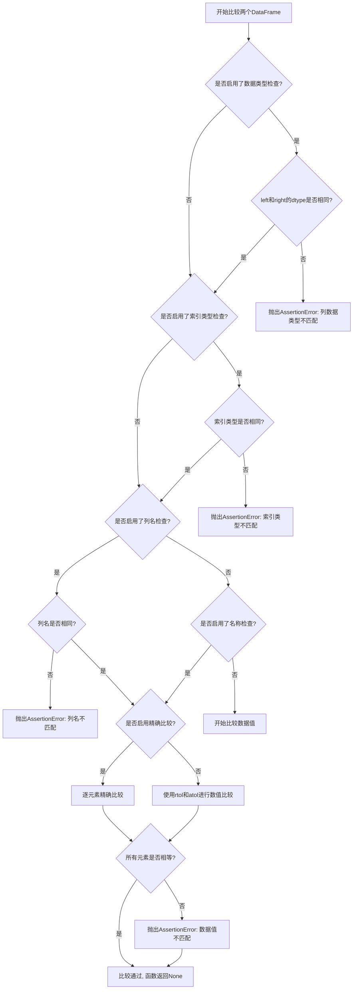

#### 带注释源码

```python
# 在本项目代码中的实际使用示例

# 示例1: test_write_and_read 方法中的使用
async def test_write_and_read(self):
    df = pd.DataFrame({
        "id": [1, 2, 3],
        "name": ["Alice", "Bob", "Charlie"],
        "age": [30, 25, 35],
    })

    # 将DataFrame写入存储
    await self.table_provider.write_dataframe("users", df)
    # 从存储中读取DataFrame
    result = await self.table_provider.read_dataframe("users")

    # 比较读取的result与原始df是否相等
    # 如果相等则测试通过，如果不等则抛出AssertionError
    pd.testing.assert_frame_equal(result, df)

# 示例2: test_empty_dataframe 方法中的使用
async def test_empty_dataframe(self):
    df = pd.DataFrame()

    await self.table_provider.write_dataframe("empty", df)
    result = await self.table_provider.read_dataframe("empty")

    # 比较两个空DataFrame是否相等
    pd.testing.assert_frame_equal(result, df)

# 示例3: test_storage_persistence 方法中的使用
async def test_storage_persistence(self):
    df = pd.DataFrame({"x": [1, 2, 3]})

    await self.table_provider.write_dataframe("test", df)

    assert await self.storage.has("test.parquet")

    # 从存储中获取parquet字节数据
    parquet_bytes = await self.storage.get("test.parquet", as_bytes=True)
    # 使用pandas将字节数据反序列化为DataFrame
    loaded_df = pd.read_parquet(BytesIO(parquet_bytes))

    # 比较从存储加载的DataFrame与原始DataFrame是否相等
    pd.testing.assert_frame_equal(loaded_df, df)
```


### `TestParquetTableProvider.setUp`

该方法为 `TestParquetTableProvider` 测试类的初始化方法，在每个测试方法执行前被调用，用于创建内存存储实例和 Parquet 表提供者，搭建测试环境。

参数：
- 无显式参数（隐式参数 `self` 为测试类实例）

返回值：`None`，无返回值（该方法为 setup 初始化方法）

#### 流程图

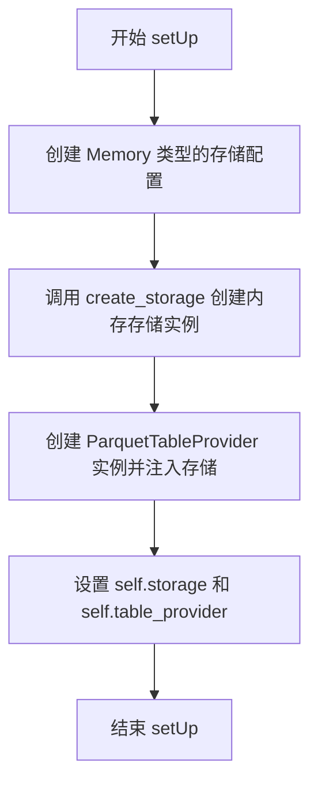

#### 带注释源码

```python
def setUp(self):
    """
    测试方法初始化钩子，在每个测试用例执行前被调用。
    初始化测试所需的存储和表提供程序。
    """
    # 创建内存类型的存储配置
    self.storage = create_storage(
        StorageConfig(
            type=StorageType.Memory,  # 使用内存存储，适合单元测试
        )
    )
    # 使用创建的存储实例初始化 Parquet 表提供者
    self.table_provider = ParquetTableProvider(storage=self.storage)
```


### `TestParquetTableProvider.asyncTearDown`

该方法是一个异步清理方法，在每个测试用例执行完成后自动调用，用于清理测试过程中创建的存储资源，防止测试之间的数据污染。

参数：

- `self`：`TestParquetTableProvider`，测试类实例本身，包含测试所需的存储和表提供者

返回值：`None`，无返回值，仅执行清理操作

#### 流程图

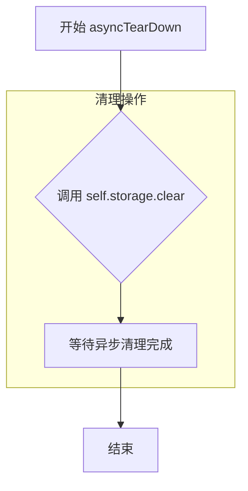

#### 带注释源码

```python
async def asyncTearDown(self):
    """
    异步清理方法，在每个测试用例完成后自动调用。
    用于清理测试过程中使用过的存储资源，确保测试隔离性。
    """
    # 调用存储对象的 clear 方法，清空所有存储的数据
    # 这里使用的是内存存储，因此 clear 操作会重置存储状态
    await self.storage.clear()
```


### `TestParquetTableProvider.test_write_and_read`

该测试方法用于验证 ParquetTableProvider 的数据写入与读取功能是否正常工作。首先创建一个包含用户信息的 DataFrame，通过 table_provider 写入存储，然后再读取出来，最后使用 pandas 的断言方法验证写入的数据与读取的数据是否完全一致。

参数：

- `self`：无需显式传递，实例方法隐含的调用者对象

返回值：`None`，该方法为异步测试方法，通过 pytest 框架执行，不返回具体值

#### 流程图

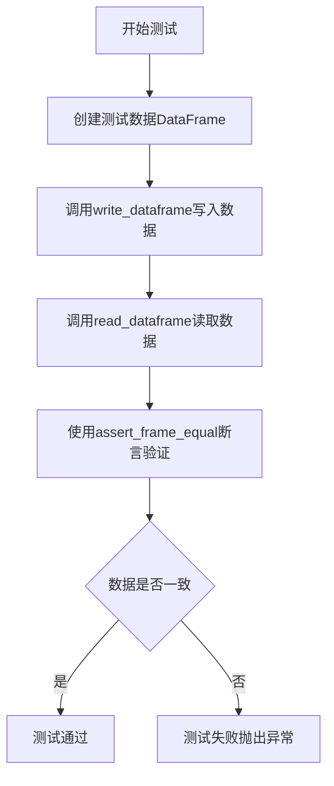

#### 带注释源码

```python
async def test_write_and_read(self):
    """
    测试 ParquetTableProvider 的写入和读取功能
    验证数据能够正确写入存储并完整读出
    """
    # 第一步：创建测试用的 DataFrame，包含三列数据
    # - id: 用户ID，整数类型
    # - name: 用户名称，字符串类型
    # - age: 用户年龄，整数类型
    df = pd.DataFrame({
        "id": [1, 2, 3],
        "name": ["Alice", "Bob", "Charlie"],
        "age": [30, 25, 35],
    })

    # 第二步：调用 ParquetTableProvider 的 write_dataframe 方法
    # 参数 "users" 表示表名，数据会被存储为 users.parquet 文件
    await self.table_provider.write_dataframe("users", df)
    
    # 第三步：调用 ParquetTableProvider 的 read_dataframe 方法
    # 读取之前写入的 "users" 表数据
    result = await self.table_provider.read_dataframe("users")

    # 第四步：使用 pandas 的 assert_frame_equal 断言方法
    # 验证读取的 DataFrame 与原始写入的 DataFrame 完全一致
    # 如果数据不一致，会抛出 AssertionError
    pd.testing.assert_frame_equal(result, df)
```

#### 关联的类和方法信息

| 组件名称 | 类型 | 描述 |
|---------|------|------|
| `TestParquetTableProvider` | 类 | 测试 ParquetTableProvider 功能的测试类，继承自 IsolatedAsyncioTestCase |
| `self.storage` | 实例变量 | Memory 类型的存储实例，由 create_storage 创建 |
| `self.table_provider` | 实例变量 | ParquetTableProvider 实例，用于读写 Parquet 格式的 DataFrame |
| `write_dataframe` | 实例方法 | 将 DataFrame 写入存储，参数：table_name(str), df(DataFrame) |
| `read_dataframe` | 实例方法 | 从存储读取 DataFrame，参数：table_name(str)，返回 DataFrame |

#### 关键组件信息

| 组件名称 | 一句话描述 |
|---------|-----------|
| `ParquetTableProvider` | 提供将 DataFrame 读写为 Parquet 格式文件的功能 |
| `StorageConfig` | 存储配置类，用于配置存储类型和参数 |
| `StorageType.Memory` | 内存存储类型，数据存储在内存中 |
| `create_storage` | 工厂函数，根据配置创建存储实例 |

#### 潜在的技术债务或优化空间

1. **测试数据硬编码**：测试中的 DataFrame 数据直接硬编码在测试方法中，建议提取为测试fixture或参数化
2. **缺少错误场景测试**：未测试写入空表名、写入非 DataFrame 对象等异常情况
3. **清理机制依赖 asyncTearDown**：如果测试中间失败，可能导致存储未及时清理，影响后续测试
4. **并行测试支持**：当前使用 IsolatedAsyncioTestCase 确保异步隔离，但未测试多表并发写入场景


### `TestParquetTableProvider.test_read_nonexistent_table_raises_error`

该测试方法用于验证 `ParquetTableProvider` 在尝试读取不存在的表时是否正确抛出 `ValueError` 异常，并确保错误消息包含预期的内容。

参数：

- 无（仅包含 `self` 隐式参数）

返回值：无（测试方法，使用 `async/await`）

#### 流程图

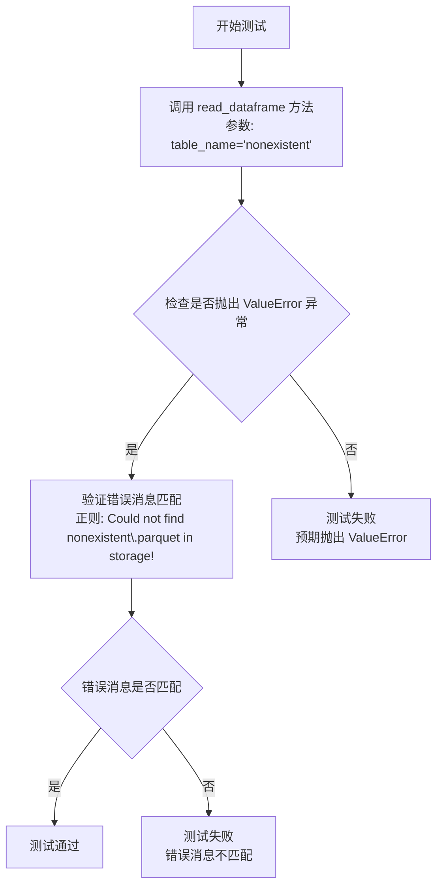

#### 带注释源码

```python
async def test_read_nonexistent_table_raises_error(self):
    """
    测试当读取不存在的表时是否抛出 ValueError 异常。
    
    该测试验证 ParquetTableProvider.read_dataframe() 方法在尝试读取
    一个不存在的表（'nonexistent'）时，能够正确地抛出 ValueError 异常，
    并且错误消息包含预期的内容。
    """
    # 使用 pytest.raises 上下文管理器来捕获预期的异常
    with pytest.raises(
        ValueError,  # 预期抛出的异常类型
        match=r"Could not find nonexistent\.parquet in storage!"  # 预期的错误消息模式
    ):
        # 尝试读取一个不存在的表 'nonexistent'
        # 预期行为：抛出 ValueError 异常
        await self.table_provider.read_dataframe("nonexistent")
```


### `TestParquetTableProvider.test_empty_dataframe`

该方法是一个异步单元测试，用于验证 `ParquetTableProvider` 能够正确处理空 DataFrame 的写入和读取操作。测试创建一个空的 DataFrame，将其写入存储，然后读取并验证读取结果与原始空 DataFrame 一致。

参数：

- `self`：`TestParquetTableProvider` 类型，测试类实例本身，包含 `storage` 和 `table_provider` 两个实例属性

返回值：`None`，因为这是异步测试方法，不返回有意义的值（测试结果通过断言表达）

#### 流程图

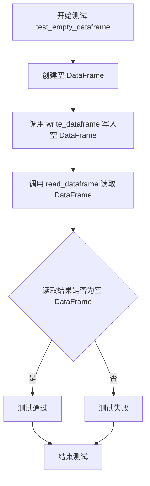

#### 带注释源码

```python
async def test_empty_dataframe(self):
    """
    测试 ParquetTableProvider 处理空 DataFrame 的能力。
    验证写入空表后能够正确读取并保持为空 DataFrame。
    """
    # 步骤1: 创建一个空的 DataFrame（无列无行）
    df = pd.DataFrame()

    # 步骤2: 将空 DataFrame 写入存储，键名为 "empty"
    await self.table_provider.write_dataframe("empty", df)
    
    # 步骤3: 从存储中读取键名为 "empty" 的 DataFrame
    result = await self.table_provider.read_dataframe("empty")

    # 步骤4: 断言读取结果与原始空 DataFrame 完全相等
    # 使用 pandas.testing.assert_frame_equal 进行深度比较
    pd.testing.assert_frame_equal(result, df)
```


### `TestParquetTableProvider.test_dataframe_with_multiple_types`

该测试方法用于验证 ParquetTableProvider 能够正确处理包含多种数据类型（整数、浮点数、字符串、布尔值）的 DataFrame 写入和读取操作。

参数：

- `self`：`TestParquetTableProvider`，测试类实例本身，无需显式传递

返回值：`None`，该方法为异步测试方法，通过 `pd.testing.assert_frame_equal` 断言验证数据完整性，不返回具体值

#### 流程图

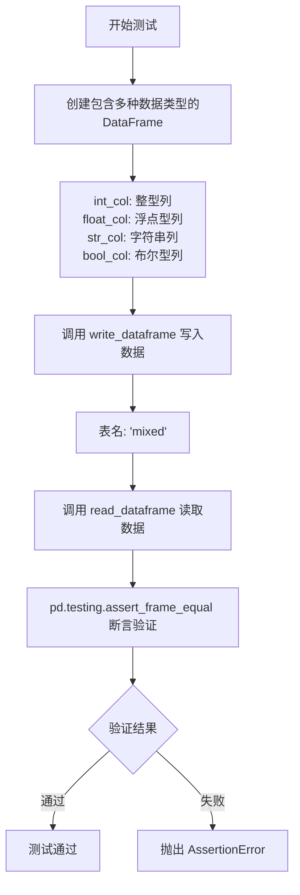

#### 带注释源码

```python
async def test_dataframe_with_multiple_types(self):
    """
    测试写入和读取包含多种数据类型的DataFrame
    
    验证 ParquetTableProvider 能够正确处理以下数据类型：
    - 整型 (int_col)
    - 浮点型 (float_col)
    - 字符串 (str_col)
    - 布尔型 (bool_col)
    """
    # 步骤1: 创建包含多种数据类型的测试DataFrame
    df = pd.DataFrame({
        "int_col": [1, 2, 3],      # 整型列
        "float_col": [1.1, 2.2, 3.3],  # 浮点型列
        "str_col": ["a", "b", "c"],    # 字符串列
        "bool_col": [True, False, True],  # 布尔型列
    })

    # 步骤2: 异步写入DataFrame到存储
    # 调用 ParquetTableProvider 的 write_dataframe 方法
    # 将DataFrame序列化为Parquet格式并存储
    await self.table_provider.write_dataframe("mixed", df)
    
    # 步骤3: 异步读取DataFrame从存储
    # 调用 ParquetTableProvider 的 read_dataframe 方法
    # 从存储中读取Parquet文件并反序列化为DataFrame
    result = await self.table_provider.read_dataframe("mixed")

    # 步骤4: 验证读取的数据与写入的数据一致
    # 使用 pandas 测试工具进行DataFrame相等性断言
    # 验证列名、数据类型和数值都完全匹配
    pd.testing.assert_frame_equal(result, df)
```


### `TestParquetTableProvider.test_storage_persistence`

该测试方法用于验证 ParquetTableProvider 能够正确地将 DataFrame 持久化到存储中，并能成功从存储中读取并恢复数据一致的内容。

参数：

- `self`：测试类实例，无需显式传递

返回值：`None`，测试方法无返回值

#### 流程图

```mermaid
flowchart TD
    A[开始] --> B[创建测试 DataFrame<br/>df = pd.DataFrame({'x': [1, 2, 3]})]
    B --> C[调用 write_dataframe 写入数据<br/>await self.table_provider.write_dataframe]
    C --> D{检查文件是否存在<br/>await self.storage.has}
    D -->|是| E[从存储获取 Parquet 字节<br/>await self.storage.get]
    E --> F[使用 pd.read_parquet 解析字节<br/>pd.read_parquet]
    F --> G[断言读取的数据与原数据一致<br/>pd.testing.assert_frame_equal]
    G --> H[结束]
```

#### 带注释源码

```python
async def test_storage_persistence(self):
    """
    测试 ParquetTableProvider 的数据持久化功能。
    验证写入的 DataFrame 能够正确保存到存储，并在读取时恢复一致的数据。
    """
    # 步骤1: 创建测试用的 DataFrame，包含单列 'x' 和三行数据
    df = pd.DataFrame({"x": [1, 2, 3]})

    # 步骤2: 通过 table_provider 将 DataFrame 写入存储，文件名为 "test.parquet"
    await self.table_provider.write_dataframe("test", df)

    # 步骤3: 断言验证 parquet 文件已成功写入存储
    assert await self.storage.has("test.parquet")

    # 步骤4: 从存储中读取 parquet 文件的原始字节数据
    parquet_bytes = await self.storage.get("test.parquet", as_bytes=True)

    # 步骤5: 将获取的字节流转换为 DataFrame
    loaded_df = pd.read_parquet(BytesIO(parquet_bytes))

    # 步骤6: 验证加载的 DataFrame 与原始 DataFrame 内容完全一致
    pd.testing.assert_frame_equal(loaded_df, df)
```


### `TestParquetTableProvider.test_has`

该测试方法用于验证 ParquetTableProvider 的 `has` 方法能正确检测表是否存在。测试流程为：先断言表不存在，写入数据后再断言表存在，从而验证 `has` 方法在表创建前返回 False、创建后返回 True 的正确性。

参数：无显式参数（测试方法使用 `self` 访问实例属性）

返回值：`None`（测试方法无返回值，通过 assert 断言验证）

#### 流程图

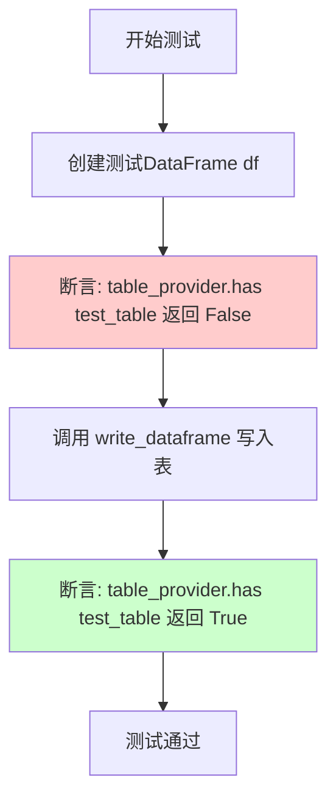

#### 带注释源码

```python
async def test_has(self):
    """
    测试 ParquetTableProvider.has() 方法能正确检测表是否存在
    
    测试步骤：
    1. 创建一个包含列 'a' 的 DataFrame
    2. 验证表不存在时 has() 返回 False
    3. 写入表数据
    4. 验证表存在时 has() 返回 True
    """
    # 创建测试数据：一个包含单列 'a' 的 DataFrame
    df = pd.DataFrame({"a": [1, 2, 3]})

    # 表尚未创建，验证 has() 方法返回 False
    # 预期行为：未写入的表应该被识别为不存在
    assert not await self.table_provider.has("test_table")

    # 调用 write_dataframe 将 DataFrame 写入存储
    # 这会在存储中创建 test_table.parquet 文件
    await self.table_provider.write_dataframe("test_table", df)

    # 表已创建，验证 has() 方法返回 True
    # 预期行为：已写入的表应该被识别为存在
    assert await self.table_provider.has("test_table")
```

---

### `ParquetTableProvider.has`（被测试方法）

虽然源代码中未直接提供 `ParquetTableProvider.has` 方法的实现，但根据测试代码可推断其接口和功能：

参数：

- `table_name`：`str`，要检查的表名（不带 .parquet 扩展名）

返回值：`bool`，如果表存在于存储中返回 True，否则返回 False

#### 流程图

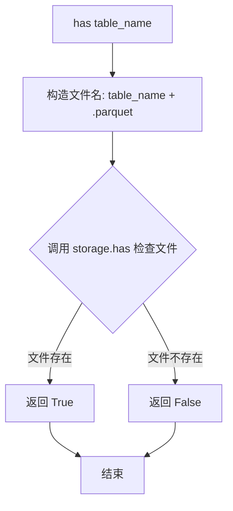

#### 推断源码

```python
async def has(self, table_name: str) -> bool:
    """
    检查指定的表是否存在于存储中
    
    参数:
        table_name: 表名（不含 .parquet 扩展名）
    
    返回:
        bool: 表存在返回 True，不存在返回 False
    """
    # 将表名转换为 Parquet 文件名
    file_name = f"{table_name}.parquet"
    
    # 委托给存储层检查文件是否存在
    return await self.storage.has(file_name)
```

## 关键组件


### ParquetTableProvider

ParquetTableProvider 是一个基于 Parquet 格式的 DataFrame 表提供者，支持将 pandas DataFrame 写入存储和从存储读取，支持内存存储类型。

### write_dataframe 方法

用于将 pandas DataFrame 写入存储的方法，接收表名和 DataFrame 对象，将数据序列化为 Parquet 格式并存储。

### read_dataframe 方法

用于从存储读取 Parquet 文件并转换为 pandas DataFrame 的方法，接收表名作为参数，读取不存在时会抛出 ValueError 异常。

### has 方法

用于检查指定表是否存在于存储中的方法，返回布尔值表示表是否存在。

### Storage 抽象层

graphrag_storage 提供的存储抽象，支持 Memory 类型存储，封装了 has、get、clear 等操作，支持字节流方式读取数据。

### StorageConfig 与 StorageType

存储配置类，用于指定存储类型（Memory 内存存储），通过 create_storage 工厂函数创建存储实例。

### 多种数据类型支持

测试覆盖了整数、浮点数、字符串、布尔值等多种 DataFrame 列类型的序列化和反序列化能力。

### 存储持久化验证

通过 get(as_bytes=True) 获取原始 Parquet 字节流，使用 pd.read_parquet 验证数据完整性，确保存储层正确保存了序列化数据。


## 问题及建议


### 已知问题

-   **测试覆盖不全面**：缺少对数据更新/覆盖场景、并发写入、大数据集性能、空表名边界情况、null值和复杂数据类型的测试
-   **测试隔离性潜在风险**：所有测试共享同一个`storage`实例，虽然使用了`IsolatedAsyncioTestCase`，但`setUp`在每个测试前执行，若测试顺序改变可能产生意外行为
-   **错误处理测试不够健壮**：正则表达式`match=r"Could not find nonexistent\.parquet in storage!"`对错误消息格式强耦合，如果错误消息国际化或格式调整会导致测试失败
-   **缺少异步资源清理验证**：`asyncTearDown`中调用`clear()`，但没有验证清理是否成功完成
-   **未测试Parquet配置选项**：没有测试压缩方式、分块、列式存储等Parquet特有配置的读写

### 优化建议

-   添加数据覆盖更新测试：`write_dataframe`两次相同表名，验证第二次覆盖第一次
-   增加并发写入测试：同时写入多个表或同时写入同一表，验证结果正确性
-   添加大数据集性能测试：验证数千上万行数据的写入和读取性能是否符合预期
-   增强边界测试：测试空表名`""`、特殊字符表名、超长表名等边界情况
-   改进错误消息验证方式：使用更灵活的匹配或验证异常类型而非硬编码消息内容
-   添加Parquet配置测试：测试不同压缩算法、不同分块大小的配置是否正确应用
-   添加数据类型深度测试：测试嵌套数据结构、日期时间类型、Category类型等的序列化与反序列化

## 其它


### 设计目标与约束

本测试套件旨在验证 ParquetTableProvider 类的核心功能，包括将 Pandas DataFrame 写入存储为 Parquet 格式以及从存储中读取 Parquet 文件为 DataFrame。测试约束包括：使用内存存储（StorageType.Memory）进行测试，不涉及文件系统持久化；测试数据仅包含基本的 Python 数据类型（int、float、str、bool）；所有操作均为异步操作。

### 错误处理与异常设计

测试覆盖了关键错误场景：当读取不存在的表时，read_dataframe 方法应抛出 ValueError，错误消息格式为 "Could not find {table_name}.parquet in storage!"。测试使用 pytest.raises 验证异常类型和错误消息匹配。正向测试场景包括空 DataFrame 写入和读取、多数据类型 DataFrame、存储持久化验证。

### 外部依赖与接口契约

本测试依赖以下外部组件：pandas（数据处理）、pytest（测试框架）、graphrag_storage（存储抽象层，包含 StorageConfig、StorageType、create_storage）、io.BytesIO（内存字节流处理）、pd.read_parquet（Parquet 文件解析）。核心接口契约包括：ParquetTableProvider 构造函数接受 storage 参数；write_dataframe(table_name, df) 接受表名字符串和 DataFrame，返回异步结果；read_dataframe(table_name) 返回 DataFrame；has(table_name) 返回布尔值；storage.has(key) 和 storage.get(key, as_bytes=True) 用于底层存储验证。

### 数据流与状态机

数据写入流程：DataFrame → ParquetTableProvider.write_dataframe() → 转换为 Parquet 字节流 → Storage 存储（键名为 {table_name}.parquet）。数据读取流程：Storage 获取 Parquet 字节流 → ParquetTableProvider.read_dataframe() → 解析为 DataFrame 返回。表存在性检查流程：ParquetTableProvider.has() → Storage.has() 查询对应 .parquet 文件键。

### 测试覆盖率分析

本测试套件覆盖了以下场景：基本写入和读取功能（test_write_and_read）、不存在的表错误处理（test_read_nonexistent_table_raises_error）、空 DataFrame 处理（test_empty_dataframe）、多数据类型支持（test_dataframe_with_multiple_types）、存储持久化验证（test_storage_persistence）、表存在性检查（test_has）。未覆盖场景包括：大规模数据性能测试、并发写入同一表、Parquet 压缩选项配置、嵌套数据结构支持、NULL/NaN 值处理。

### 性能考虑与基准

测试使用小规模数据集（3行记录），未包含性能基准测试。生产环境需关注：Parquet 写入/读取的内存占用、大规模 DataFrame 的流式处理、Parquet 压缩算法选择（snappy、gzip、brotli）、异步操作的并发限制。

### 安全考虑

测试代码不涉及敏感数据处理。生产部署需考虑：Storage 后端的安全性（若使用文件系统存储需控制文件权限）、Parquet 文件的 Schema 验证防止恶意构造的数据、输入验证（table_name 字符串校验防止路径遍历攻击）。

### 配置与初始化

测试初始化在 setUp 方法中完成：创建内存存储实例 create_storage(StorageConfig(type=StorageType.Memory))、实例化 ParquetTableProvider 传入 storage 参数。清理在 asyncTearDown 中执行 storage.clear() 清除所有存储数据。生产环境可能需要配置：不同的 Storage 后端、Parquet 写入选项（compression、engine、flavor 等）。

### 并发与异步处理

所有数据操作均为异步方法（async/await），测试类继承 IsolatedAsyncioTestCase 确保异步测试隔离。未测试并发场景：多个异步任务同时写入同一表、并发读写竞争条件。建议生产代码添加异步锁或事务机制保证数据一致性。

### 数据一致性验证

使用 pd.testing.assert_frame_equal() 进行精确的 DataFrame 相等性比较，包括索引、列名、数据类型和值。test_storage_persistence 额外验证了底层存储的原始 Parquet 字节流可独立解析，确保存储层数据完整性。

### 版本兼容性

代码依赖库的版本兼容性需关注：pandas 版本（影响 DataFrame API 和 Parquet 引擎）、graphrag_storage 接口稳定性、PyArrow 或 fastparquet 作为 Parquet 引擎的兼容性。建议在项目 CI 中添加依赖版本范围测试。

### 最佳实践与改进建议

当前测试采用 IsolatedAsyncioTestCase 实现异步测试隔离，符合 pytest-asyncio 最佳实践。改进建议：添加测试数据工厂方法减少重复代码、引入 pytest fixture 管理 storage 和 table_provider 生命周期、添加参数化测试（pytest.mark.parametrize）覆盖更多边界情况、增加集成测试验证不同 Storage 后端（文件系统、S3 等）的兼容性。


    