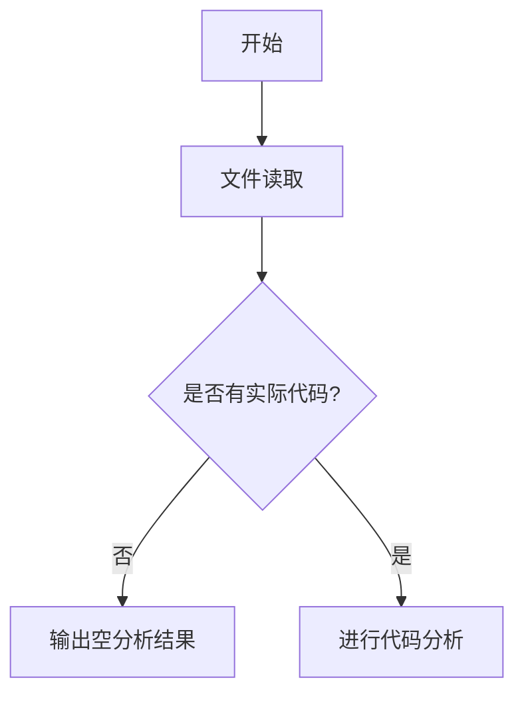

# `graphrag\tests\unit\utils\__init__.py` 详细设计文档

该文件仅包含版权声明和MIT许可证信息，没有实际代码可供分析。

## 整体流程



## 类结构

```
该文件没有类定义
```

## 全局变量及字段


    

## 全局函数及方法


## 关键组件


### 文件概述

该文件为微软公司2024年发布的开源项目的头部声明文件，仅包含版权信息和MIT许可证声明，尚未包含实际功能代码实现。

### 文件整体运行流程

由于该文件仅包含版权声明和许可证信息，不包含任何可执行代码，因此不存在实际的运行流程。该文件作为项目入口或模块文件的头部声明，预留了后续功能实现的位置。

### 类详细信息

由于代码中未包含任何类定义，因此不适用。

### 全局变量和全局函数

由于代码中未包含任何全局变量或全局函数，因此不适用。

### 关键组件信息

由于代码中未包含任何实际功能组件，因此不适用。

### 潜在的技术债务或优化空间

由于代码中未包含实际功能实现，无法评估技术债务或优化空间。

### 其它项目

#### 设计目标与约束

从文件头部信息可以推断：
- **设计目标**：该代码属于微软公司2024年发布的开源项目，可能涉及人工智能、机器学习或相关技术领域
- **许可证约束**：采用MIT许可证，允许自由使用、修改和商业应用

#### 错误处理与异常设计

由于代码中未包含任何功能实现，因此不涉及错误处理与异常设计。

#### 数据流与状态机

由于代码中未包含任何功能实现，因此不涉及数据流与状态机。

#### 外部依赖与接口契约

由于代码中未包含任何功能实现，因此不涉及外部依赖与接口契约。


## 问题及建议


### 已知问题

- 该代码片段仅包含版权声明和许可证信息，不包含任何功能代码实现，无法进行详细的技术分析
- 缺少代码上下文，无法评估架构设计、类结构或函数实现
- 无从判断业务逻辑、错误处理机制或数据流设计

### 优化建议

- 由于提供的代码仅是文件头部注释，需要提供完整的源代码以便进行全面的技术债务分析和优化建议
- 若该文件为项目模板，建议补充完整的模块化代码框架，包括必要的导入、基础类结构和接口定义
- 建议在项目中添加 README.md 或相关文档说明项目的整体架构和技术选型


## 其它


### 设计目标与约束

本代码库无具体功能实现代码，仅包含版权声明文件，无设计目标与约束信息。

### 错误处理与异常设计

本代码库无具体功能实现代码，无错误处理与异常设计相关内容。

### 数据流与状态机

本代码库无具体功能实现代码，无数据流与状态机设计。

### 外部依赖与接口契约

本代码库无具体功能实现代码，无外部依赖与接口契约定义。

### 性能要求与指标

本代码库无具体功能实现代码，无性能要求与指标定义。

### 安全考虑与权限控制

本代码库无具体功能实现代码，无安全考虑与权限控制设计。

### 配置管理与环境变量

本代码库无具体功能实现代码，无配置管理相关设计。

### 测试策略与测试用例

本代码库无具体功能实现代码，无测试策略与测试用例设计。

### 部署与运维相关

本代码库无具体功能实现代码，无部署与运维相关设计。

### 版本兼容性考虑

本代码库无具体功能实现代码，无版本兼容性设计。

### 监控与日志设计

本代码库无具体功能实现代码，无监控与日志设计。

### 国际化与本地化支持

本代码库无具体功能实现代码，无国际化与本地化支持设计。


    