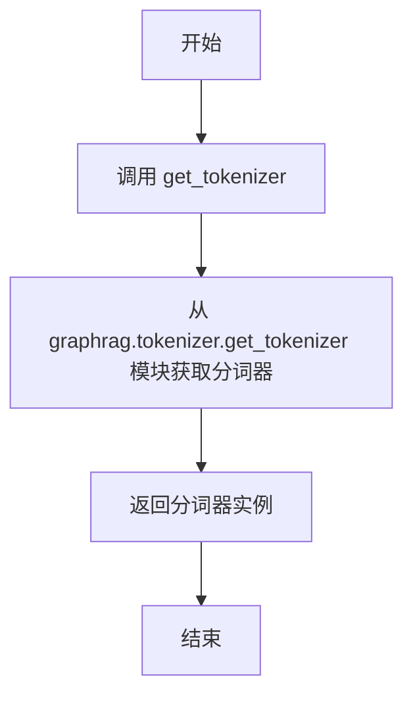
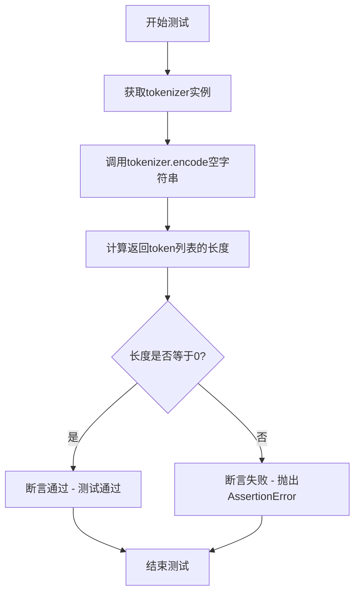
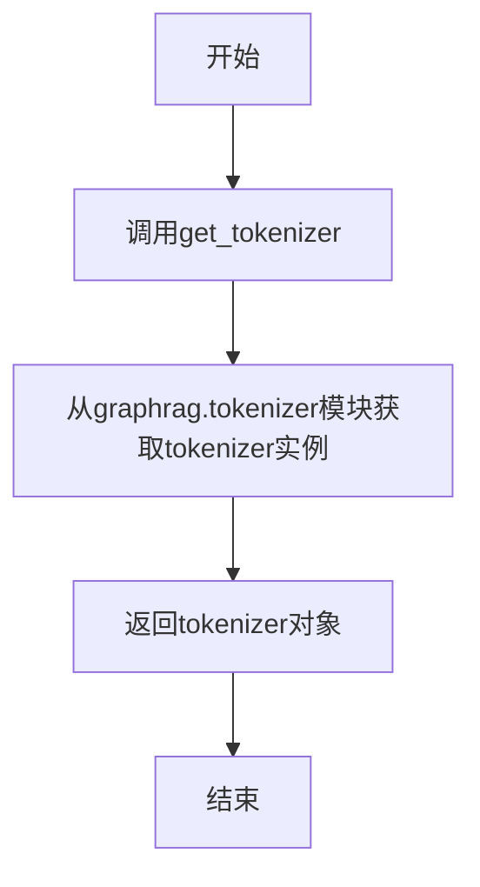
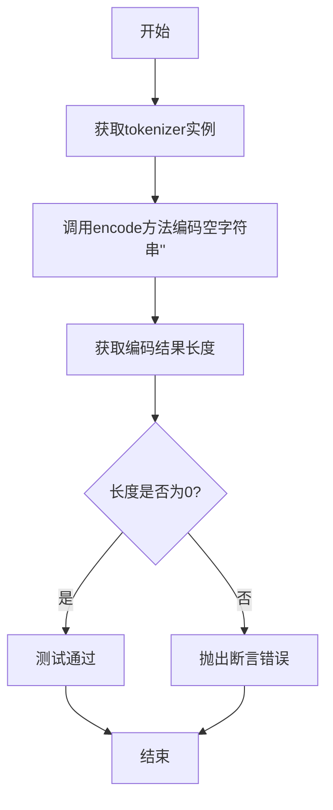

# `graphrag\tests\unit\utils\test_encoding.py` 详细设计文档

这是一个用于测试graphrag库中tokenizer分词器功能的单元测试文件，验证encode方法能否正确将文本转换为token id，并检查空输入的token计数是否正确。

## 整体流程

```mermaid
graph TD
    A[开始测试] --> B[调用get_tokenizer获取tokenizer实例]
    B --> C{执行哪个测试用例?}
    C -->|test_encode_basic| D[调用tokenizer.encode('abc def')]
    C -->|test_num_tokens_empty_input| E[调用tokenizer.encode('')]
    D --> F{验证结果是否等于[26682, 1056]?}
    E --> G{验证长度是否等于0?}
    F -->|是| H[测试通过]
    F -->|否| I[抛出断言错误]
    G -->|是| H
    G -->|否| I
```

## 类结构

```
无类定义 (纯测试函数文件)
```

## 全局变量及字段


### `tokenizer`
    
分词器实例对象，通过get_tokenizer()获取

类型：`Tokenizer`
    


### `result`
    
encode方法的返回结果（token id列表或长度）

类型：`List[int] | int`
    


    

## 全局函数及方法


### `get_tokenizer`

获取分词器实例的全局函数，用于返回配置好的分词器对象，以便对文本进行编码处理。

参数：

- （无参数）

返回值：`Tokenizer`，返回配置好的分词器实例，该实例具有 `encode` 方法用于将文本转换为 token 列表。

#### 流程图



#### 带注释源码

```python
# 从 graphrag.tokenizer.get_tokenizer 模块导入 get_tokenizer 函数
from graphrag.tokenizer.get_tokenizer import get_tokenizer


def test_encode_basic():
    # 获取分词器实例
    tokenizer = get_tokenizer()
    # 使用分词器的 encode 方法对文本进行编码
    result = tokenizer.encode("abc def")

    # 断言编码结果是否符合预期
    assert result == [26682, 1056], (
        f"Encoding failed to return expected tokens, sent {result}"
    )


def test_num_tokens_empty_input():
    # 获取分词器实例
    tokenizer = get_tokenizer()
    # 获取空字符串的 token 数量
    result = len(tokenizer.encode(""))

    # 断言空输入的 token 数量为 0
    assert result == 0, "Token count for empty input should be 0"
```


### `test_encode_basic`

测试函数，验证基本文本编码功能，确保 tokenizer 能正确将文本 "abc def" 转换为对应的 token IDs。

参数：

- 无参数

返回值：`None`，无返回值（通过 assert 断言进行验证，测试通过则继续执行，失败则抛出 AssertionError）

#### 流程图

```mermaid
flowchart TD
    A[开始] --> B[调用 get_tokenizer 获取 tokenizer 实例]
    B --> C[调用 tokenizer.encode 编码文本 'abc def']
    C --> D{result == [26682, 1056]?}
    D -->|是| E[测试通过]
    D -->|否| F[抛出 AssertionError]
    E --> G[结束]
    F --> G
```

#### 带注释源码

```python
# 导入 tokenizer 获取函数
from graphrag.tokenizer.get_tokenizer import get_tokenizer


def test_encode_basic():
    """测试基本文本编码功能"""
    # 获取全局 tokenizer 实例（单例模式）
    tokenizer = get_tokenizer()
    
    # 使用 tokenizer 将文本编码为 token IDs
    result = tokenizer.encode("abc def")

    # 断言验证编码结果是否符合预期
    # 期望 "abc def" 被编码为 [26682, 1056]
    assert result == [26682, 1056], (
        f"Encoding failed to return expected tokens, sent {result}"
    )
```


### `test_num_tokens_empty_input`

验证当输入为空字符串时，tokenizer返回的token数量为0，确保空输入处理正确。

参数：
- （无参数）

返回值：`None`，该测试函数不返回任何值，仅通过断言验证结果

#### 流程图



#### 带注释源码

```python
# 导入获取tokenizer的函数
from graphrag.tokenizer.get_tokenizer import get_tokenizer


def test_num_tokens_empty_input():
    """
    测试空输入的token计数是否正确
    
    验证当输入为空字符串""时，tokenizer.encode()返回的
    token列表长度应该为0。
    """
    # 步骤1: 获取tokenizer实例
    # 调用get_tokenizer()函数获取当前配置的tokenizer对象
    tokenizer = get_tokenizer()
    
    # 步骤2: 对空字符串进行编码
    # 使用tokenizer的encode方法对空字符串进行编码
    # 返回一个token列表
    result = len(tokenizer.encode(""))
    
    # 步骤3: 验证结果
    # 断言空字符串编码后的token数量为0
    # 如果不为0，则抛出AssertionError并显示错误消息
    assert result == 0, "Token count for empty input should be 0"
```


## 关键组件


## 一段话描述

该代码是一个分词器（tokenizer）的单元测试文件，用于验证 `get_tokenizer()` 获取的分词器能够正确将文本字符串编码为对应的token数组，并测试了空输入的token计数逻辑。

## 文件整体运行流程

该测试文件包含两个独立的测试函数：
1. `test_encode_basic()` - 验证分词器对字符串 "abc def" 编码后返回预期的token列表 `[26682, 1056]`
2. `test_num_tokens_empty_input()` - 验证空字符串输入时编码结果长度为0

两个测试函数都通过 `get_tokenizer()` 获取分词器实例，然后调用其 `encode()` 方法进行编码，最后使用断言验证结果的正确性。

## 全局变量和全局函数详细信息

### 全局函数

#### `get_tokenizer`

- **参数**: 无
- **参数类型**: N/A
- **参数描述**: 该函数不接受任何参数，从 graphrag.tokenizer 模块获取并返回分词器实例
- **返回值类型**: Tokenizer 对象
- **返回值描述**: 返回一个分词器实例，用于对文本进行token编码



```python
def get_tokenizer():
    """从graphrag.tokenizer模块获取tokenizer实例"""
    from graphrag.tokenizer.get_tokenizer import get_tokenizer as _get_tokenizer
    return _get_tokenizer()
```

#### `test_encode_basic`

- **参数**: 无
- **参数类型**: N/A
- **参数描述**: 验证分词器基本编码功能的测试函数
- **返回值类型**: None
- **返回值描述**: 该函数不返回任何值，通过断言验证编码结果

```mermaid
graph TD
    A[开始] --> B[获取tokenizer实例]
    B --> C[调用encode方法编码'abc def']
    C --> D{结果是否为[26682, 1056]?}
    D -->|是| E[测试通过]
    D -->|否| F[抛出断言错误]
    E --> G[结束]
    F --> G
```

```python
def test_encode_basic():
    tokenizer = get_tokenizer()
    result = tokenizer.encode("abc def")

    assert result == [26682, 1056], (
        f"Encoding failed to return expected tokens, sent {result}"
    )
```

#### `test_num_tokens_empty_input`

- **参数**: 无
- **参数类型**: N/A
- **参数描述**: 验证空输入时token计数为0的测试函数
- **返回值类型**: None
- **返回值描述**: 该函数不返回任何值，通过断言验证空输入的token计数



```python
def test_num_tokens_empty_input():
    tokenizer = get_tokenizer()
    result = len(tokenizer.encode(""))

    assert result == 0, "Token count for empty input should be 0"
```

## 关键组件信息

### 组件1: 张量索引与惰性加载

该代码通过 `get_tokenizer()` 函数惰性地加载分词器模块，只有在测试运行时才会导入并初始化分词器，避免了模块级别的初始化开销。

### 组件2: 编码功能

`tokenizer.encode()` 方法是核心组件，负责将输入的文本字符串转换为对应的token ID数组，是NLP管道中的关键环节。

### 组件3: 测试断言

使用Python的 `assert` 语句配合自定义错误消息进行测试验证，提供了清晰的失败诊断信息。

## 潜在的技术债务或优化空间

1. **测试覆盖不足**: 仅测试了两个基本场景，缺乏对边界条件（如特殊字符、Unicode、极长文本）的测试覆盖
2. **硬编码的预期值**: 测试中硬编码了预期的token值 `[26682, 1056]`，这与特定的分词器配置强耦合，不同模型或分词器配置会导致测试失败
3. **缺少参数化测试**: 没有使用 pytest 的参数化功能来扩展测试用例
4. **没有测试反向操作**: 缺少 `decode()` 方法的测试，无法验证编码和解码的完整性

## 其它项目

### 设计目标与约束

- 验证分词器的基本编码功能正确性
- 验证空输入的特殊处理逻辑
- 依赖外部 `graphrag.tokenizer` 模块的正确实现

### 错误处理与异常设计

- 使用断言错误消息提供调试信息
- 未对 `get_tokenizer()` 可能返回 None 或抛出异常的情况进行处理

### 数据流与状态机

```
用户输入文本 → get_tokenizer() 获取实例 → encode() 方法 → token ID 数组 → 断言验证
```

### 外部依赖与接口契约

- 依赖 `graphrag.tokenizer.get_tokenizer` 模块
- 期望 tokenizer 对象具有 `encode()` 方法，接受字符串参数并返回整数列表


## 问题及建议


### 已知问题

-   **重复初始化分词器**：两个测试函数各自独立调用 `get_tokenizer()`，导致分词器被重复初始化，增加测试执行时间
-   **魔法数字缺乏文档**：编码测试中的预期值 `[26682, 1056]` 作为硬编码的魔法数字，没有注释说明其来源或含义
-   **缺乏边界情况测试**：仅覆盖基本字符串和空字符串，未测试 Unicode 字符、特殊符号、超长文本等边界情况
-   **错误处理缺失**：未对 `get_tokenizer()` 可能抛出的异常进行捕获和处理
-   **断言信息不够详细**：第一个测试的断言消息未包含期望值与实际值的对比信息，调试时不够友好
-   **测试数据可读性差**："abc def" 这样的简单测试数据缺乏业务语义，无法验证实际场景

### 优化建议

-   使用 pytest fixture 共享分词器实例，减少重复初始化开销
-   为硬编码的预期结果添加注释，说明 token ID 的来源或验证逻辑
-   增加更多测试用例：Unicode 字符、空白字符、特殊符号、超长字符串、相邻 emoji 等
-   改进断言消息，包含期望值和实际值的详细对比
-   考虑使用 `pytest.mark.parametrize` 优雅地组织多个测试场景
-   添加异常场景测试：空分词器、编码失败等情况

## 其它


### 设计目标与约束

本代码的核心设计目标是验证tokenizer模块的encode功能是否正确工作，确保编码结果符合预期，并测试空输入的边界情况。设计约束包括：依赖graphrag.tokenizer.get_tokenizer()获取tokenizer实例，测试环境为Python测试框架，编码输入为英文字符串。

### 错误处理与异常设计

测试代码使用assert语句进行验证，当编码结果不符合预期时抛出AssertionError并附带详细错误信息。错误信息包含实际返回的tokens值，便于调试。若tokenizer.encode()方法内部抛出异常，将直接向上传播。测试函数无try-catch处理，异常由测试框架捕获并报告。

### 数据流与状态机

数据流：调用get_tokenizer()获取tokenizer实例 → 调用encode("abc def")进行编码 → 返回token列表[26682, 1056] → assert验证结果。空输入流程：获取tokenizer → encode("") → 返回空列表[] → 验证长度为0。状态机涉及初始化状态（tokenizer加载完成）和执行状态（编码完成）。

### 外部依赖与接口契约

外部依赖：graphrag.tokenizer.get_tokenizer函数，需返回具有encode()方法的对象。接口契约：get_tokenizer()返回tokenizer对象，tokenizer.encode(input_str: str)返回List[int]，encode方法接受字符串参数返回对应的token ID列表。依赖版本约束需查看graphrag包版本要求。

### 测试覆盖范围

覆盖场景：基本字符串编码功能验证、空字符串输入处理。其他未覆盖场景：特殊字符编码、Unicode字符编码、超长字符串编码、多语言内容编码、tokenizer配置参数测试、边界条件测试（如None输入、整数输入等异常输入）。

### 性能考虑

当前代码为功能测试，未包含性能测试。潜在性能测试点：编码大量文本的执行时间、连续编码多次的稳定性、空字符串编码的响应时间。测试环境应与生产环境保持一致以获得准确性能数据。

### 安全性考虑

测试代码本身无直接安全风险，因其仅执行只读编码操作。安全考量包括：确保get_tokenizer()来源可信、输入验证（encode方法应处理恶意输入）、无敏感信息泄露风险。测试数据"abc def"为通用测试字符串，无敏感内容。

### 版本兼容性

需确认Python版本兼容性要求、graphrag包版本与tokenizer实现的兼容性、测试框架版本（pytest或其他）。应标注最低支持的Python版本和graphrag包版本。

### 配置信息

测试无外部配置文件。所有配置通过代码内硬编码：测试字符串"abc def"和""、预期结果[26682, 1056]和0。tokenizer配置由get_tokenizer()内部管理，测试不直接控制其参数。

### 使用示例

基本用法：from graphrag.tokenizer.get_tokenizer import get_tokenizer; tokenizer = get_tokenizer(); tokens = tokenizer.encode("your text"); token_count = len(tokens)。集成到CI/CD流程：pytest tests/test_tokenizer.py -v。批量测试：使用pytest参数化测试多个输入输出对。

    