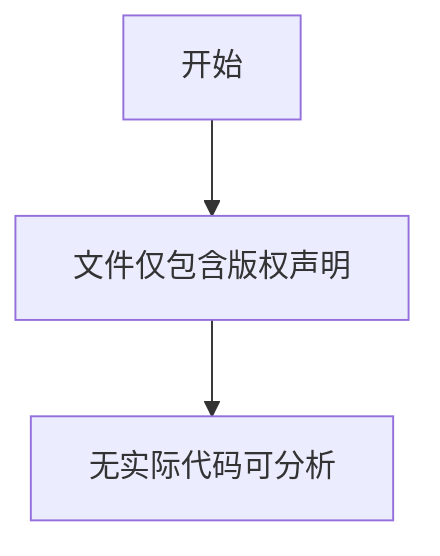

# `graphrag\tests\verbs\__init__.py` 详细设计文档

该文件仅包含版权声明信息（Copyright (c) 2024 Microsoft Corporation, Licensed under the MIT License），无实际代码实现，无法提取功能描述。

## 整体流程



## 类结构

```
该代码文件中不包含任何类定义
```

## 全局变量及字段


    

## 全局函数及方法


## 关键组件


### 代码概述

该代码文件仅包含版权声明和MIT许可证头，不包含任何实际功能实现代码，因此无法提取关键组件、类、方法或设计文档所需的任何技术信息。

### 关键组件信息

由于源代码不包含任何实现，仅有以下信息：

- **文件内容**: 版权声明与MIT许可证声明
- **实际代码**: 无
- **可识别组件**: 无

### 技术债务或优化空间

不适用 - 当前代码不包含任何可分析的实现。

### 结论

提供的代码片段不包含任何可分析的功能性代码，仅为项目头部版权声明。如需进行完整的架构设计和文档生成，请提供包含实际业务逻辑的源代码。


## 问题及建议


### 已知问题

- 该文件仅为版权声明和许可证头部，不包含任何实际功能代码，无法进行有意义的技术分析
- 缺少实际的业务逻辑、类定义或函数实现
- 文件内容不完整，可能是一个未完成的代码模板或占位文件

### 优化建议

- 补充完整的代码实现，包括核心业务逻辑、类定义和函数
- 添加必要的模块化设计和架构规划
- 建立完整的错误处理和数据验证机制
- 完善文档注释和接口契约定义


## 其它


### 设计目标与约束

本项目暂无明确的设计目标与约束，因代码仅包含版权声明文件头，缺少实际功能实现。

### 错误处理与异常设计

暂无错误处理与异常设计，因代码中未实现任何功能性逻辑。

### 数据流与状态机

暂无数据流与状态机设计，因代码中未实现任何数据处理逻辑。

### 外部依赖与接口契约

暂无外部依赖与接口契约，因代码中未实现任何功能模块。

### 性能要求

暂无性能要求，因代码中未实现任何计算密集型或I/O操作。

### 安全性考虑

暂无安全性设计考量，因代码中未涉及敏感数据处理或安全相关逻辑。

### 可维护性考虑

暂无可维护性设计考量，当前代码仅为版权声明文件。

### 版本兼容性

暂无版本兼容性要求，当前代码仅为版权声明文件。

### 部署与配置

暂无部署与配置需求，当前代码仅为版权声明文件。

### 测试计划

暂无测试计划，因代码中未实现任何可测试的功能模块。

### 监控与运维

暂无监控与运维设计，因代码中未实现任何运行时常量或后台服务。

    