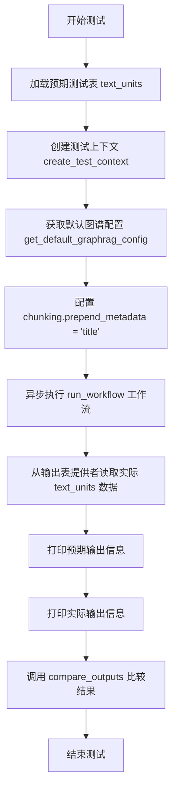
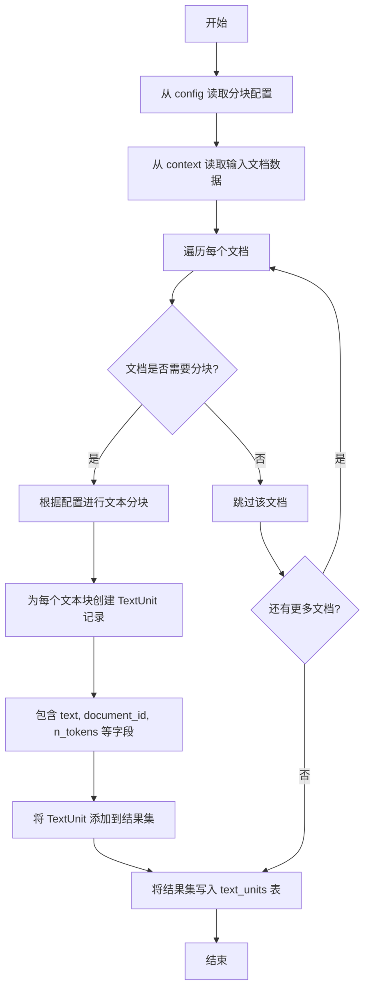
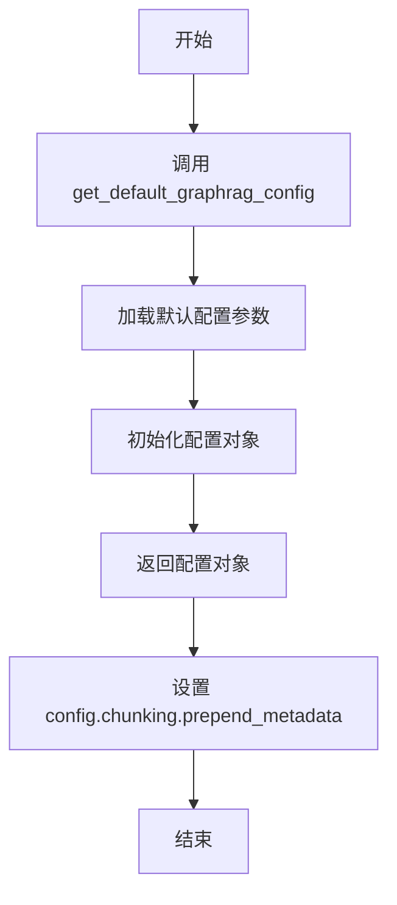
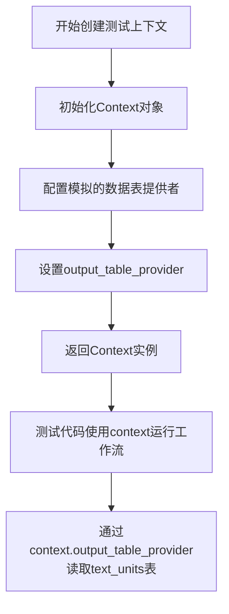
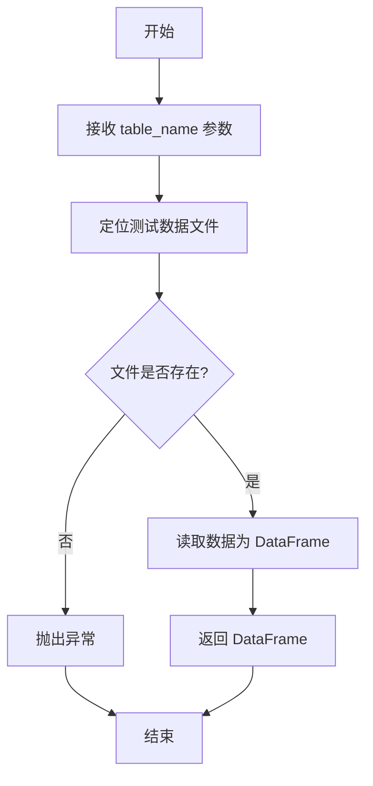
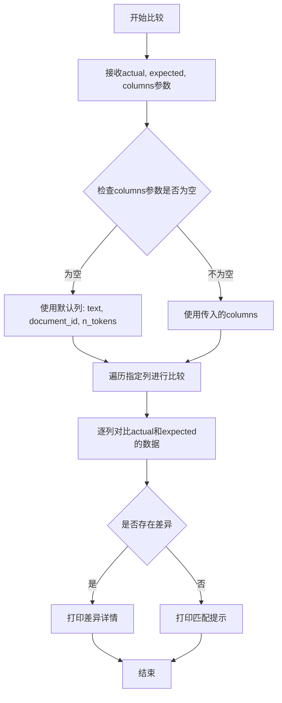

# `graphrag\tests\verbs\test_create_base_text_units.py` 详细设计文档

这是一个单元测试文件，用于验证 GraphRAG 索引工作流中 create_base_text_units 的功能是否正确创建文本单元，包括文本内容、文档ID和token数量等关键信息。

## 整体流程

```mermaid
graph TD
    A[开始测试] --> B[load_test_table 加载预期文本单元表]
    B --> C[create_test_context 创建测试上下文]
    C --> D[get_default_graphrag_config 获取默认配置]
    D --> E[配置 chunking.prepend_metadata = ['title']]
    E --> F[run_workflow 执行创建基础文本单元工作流]
    F --> G[context.output_table_provider.read_dataframe 读取实际输出]
    G --> H[compare_outputs 比较实际与预期输出]
    H --> I{比较结果一致?}
    I -- 是 --> J[测试通过]
    I -- 否 --> K[测试失败并抛出异常]
```

## 类结构

```
测试文件 (无类结构)
└── 模块级函数: test_create_base_text_units
```

## 全局变量及字段


### `expected`
    
预期输出的文本单元测试数据

类型：`pd.DataFrame`
    


### `context`
    
测试执行上下文对象

类型：`TestContext`
    


### `config`
    
GraphRAG 配置对象

类型：`GraphRagConfig`
    


### `actual`
    
实际输出的文本单元数据

类型：`pd.DataFrame`
    


    

## 全局函数及方法


### `test_create_base_text_units`

异步测试函数，作为核心测试入口，验证文本单元创建工作流的正确性。该测试通过加载预期数据、创建测试上下文、配置图谱配置、运行工作流，并比较实际输出与预期结果来确保工作流的正确实现。

参数： 无

返回值：`None`，该函数为异步测试函数，不返回具体值，主要通过断言和比较操作验证工作流输出是否符合预期。

#### 流程图



#### 带注释源码

```python
# 异步测试函数 test_create_base_text_units
# 用途：核心测试入口，验证文本单元创建工作流
async def test_create_base_text_units():
    # 步骤1: 从测试数据文件加载预期的text_units表数据
    expected = load_test_table("text_units")

    # 步骤2: 创建测试上下文，提供输入输出支持
    context = await create_test_context()

    # 步骤3: 获取默认的graphrag配置
    config = get_default_graphrag_config()
    # 配置分块选项，预置元数据字段"title"到文本中
    config.chunking.prepend_metadata = ["title"]

    # 步骤4: 运行文本单元创建工作流
    await run_workflow(config, context)

    # 步骤5: 从上下文输出提供者读取实际生成的text_units表
    actual = await context.output_table_provider.read_dataframe("text_units")

    # 调试输出：打印预期数据的列信息和内容
    print("EXPECTED")
    print(expected.columns)
    print(expected)

    # 调试输出：打印实际数据的列信息和内容
    print("ACTUAL")
    print(actual.columns)
    print(actual)

    # 步骤6: 比较实际输出与预期输出，验证正确性
    # 比较列：text文档内容、document_id文档ID、n_tokens令牌数
    compare_outputs(actual, expected, columns=["text", "document_id", "n_tokens"])
```

---

#### 关键组件信息

| 组件名称 | 一句话描述 |
|---------|-----------|
| `run_workflow` | 文本单元创建工作流的核心执行函数 |
| `create_test_context` | 创建测试用上下文环境，支持输入输出模拟 |
| `get_default_graphrag_config` | 获取默认的GraphRAG配置对象 |
| `load_test_table` | 从测试数据文件加载预期表数据 |
| `compare_outputs` | 比较实际输出与预期输出的差异 |
| `context.output_table_provider` | 输出表提供者，负责读取生成的数据表 |

#### 潜在技术债务与优化空间

1. **硬编码列名比较**: `compare_outputs`中硬编码了`columns=["text", "document_id", "n_tokens"]`，建议将其提取为测试配置常量
2. **调试打印语句**: 测试中包含大量`print`语句用于调试，建议使用专业的测试日志框架或移除
3. **元数据配置固定**: `config.chunking.prepend_metadata = ["title"]`是硬编码的测试配置，可考虑参数化以支持多种测试场景

#### 其它说明

- **设计目标**: 确保`create_base_text_units`工作流能够正确地将文档分割成文本单元，并附加必要的元数据
- **错误处理**: 测试依赖`compare_outputs`函数进行断言验证，未显式处理工作流执行异常
- **外部依赖**: 依赖`graphrag.index.workflows.create_base_text_units.run_workflow`模块和测试工具函数
- **数据流**: 输入为文档数据 → 经过run_workflow处理 → 输出为text_units表 → 与expected比较验证


### `run_workflow`

该函数是 GraphRAG 索引工作流中的核心业务逻辑函数，负责执行创建基础文本单元（Base Text Units）的操作。它从配置中读取分块参数，对输入文档进行文本分割，生成包含文本内容、文档 ID 和 token 数量的文本单元，并将其写入输出表。

参数：

- `config`：`GraphRagConfig` 类型，GraphRAG 全局配置对象，包含分块策略（如 `chunking.prepend_metadata`）和其他索引配置
- `context`：`WorkflowContext` 类型，工作流执行上下文，提供输入数据读取和输出数据写入的能力

返回值：`None`（无显式返回值），结果通过 `context.output_table_provider` 写入名为 "text_units" 的输出表

#### 流程图



#### 带注释源码

```python
# 伪代码展示可能的实现结构
async def run_workflow(config: GraphRagConfig, context: WorkflowContext):
    """
    执行创建基础文本单元的工作流
    
    Args:
        config: 包含 chunking.prepend_metadata 等分块配置
        context: 工作流上下文，用于读写数据
    """
    
    # 1. 从配置中读取分块参数
    chunk_config = config.chunking
    prepend_metadata = chunk_config.prepend_metadata  # 如 ["title"]
    
    # 2. 从输入表读取文档数据
    documents = await context.input_table_provider.read_dataframe("documents")
    
    # 3. 初始化输出列表
    text_units = []
    
    # 4. 遍历文档进行分块处理
    for doc in documents.iterrows():
        doc_id = doc['id']
        text = doc['text']
        metadata = doc.get('metadata', {})
        
        # 5. 准备分块参数
        if prepend_metadata:
            # 预置元数据到文本开头
            prepend_text = " ".join([metadata.get(k, "") for k in prepend_metadata])
            text = f"{prepend_text} {text}"
        
        # 6. 执行文本分块
        chunks = chunk_text(text, chunk_config)
        
        # 7. 为每个块创建文本单元记录
        for chunk in chunks:
            text_units.append({
                "text": chunk.text,
                "document_id": doc_id,
                "n_tokens": chunk.token_count
            })
    
    # 8. 写入输出表
    await context.output_table_provider.write_dataframe(
        pd.DataFrame(text_units),
        "text_units"
    )
```


### `get_default_graphrag_config`

获取默认的 GraphRAG 配置，用于初始化图谱检索增强生成系统的默认参数设置。该函数返回一个配置对象，允许调用者根据需要修改特定配置项（如 chunking 相关的元数据前置设置）。

参数：此函数无参数。

返回值：`GraphRAGConfig`（或类似配置对象），返回包含 GraphRAG 系统默认配置的 config 对象，其中包含 chunking、storage、input 等模块的默认设置。

#### 流程图



#### 带注释源码

```python
# 从测试配置工具模块导入获取默认 GraphRAG 配置的函数
from tests.unit.config.utils import get_default_graphrag_config

# ...

async def test_create_base_text_units():
    """测试创建基础文本单元的工作流程"""
    
    # 加载期望的测试数据（文本单元表）
    expected = load_test_table("text_units")

    # 创建异步测试上下文
    context = await create_test_context()

    # 调用 get_default_graphrag_config 获取默认配置对象
    # 该函数无参数，返回包含默认设置的配置对象
    config = get_default_graphrag_config()
    
    # 修改配置的 chunking.prepend_metadata 属性
    # 将 "title" 添加到需要前置的元数据列表中
    config.chunking.prepend_metadata = ["title"]

    # 使用修改后的配置运行工作流程
    await run_workflow(config, context)

    # 从上下文的输出表提供者读取实际生成的文本单元数据
    actual = await context.output_table_provider.read_dataframe("text_units")

    # 打印期望输出（列信息）
    print("EXPECTED")
    print(expected.columns)
    print(expected)

    # 打印实际输出（列信息）
    print("ACTUAL")
    print(actual.columns)
    print(actual)

    # 比较实际输出与期望输出，验证结果正确性
    compare_outputs(actual, expected, columns=["text", "document_id", "n_tokens"])
```

---

> **注意**：由于 `get_default_graphrag_config` 函数的完整源代码未在给定的代码片段中提供，以上信息是基于该函数在测试用例中的使用方式推断得出的。该函数由 `tests.unit.config.utils` 模块导出，返回一个配置对象，该对象具有可配置的 `chunking.prepend_metadata` 属性，用于指定在文本分块时需要前置的元数据字段。


### `create_test_context`

创建测试用的上下文环境，用于为单元测试提供模拟的图索引工作流执行上下文，包括配置、数据提供者和输出表提供者。

参数：

- 无参数

返回值：`Context`（或类似类型），返回一个异步上下文对象，包含 `output_table_provider` 属性，用于读取生成的表数据。

#### 流程图



#### 带注释源码

```python
# 从当前包的 util 模块导入
# 注意：实际实现未在此代码片段中显示
from .util import (
    compare_outputs,
    create_test_context,  # <-- 目标函数从此处导入
    load_test_table,
)

# 在测试函数中使用 create_test_context
async def test_create_base_text_units():
    # ... 加载期望数据 ...
    
    # 创建测试上下文环境
    # 返回的 context 包含:
    # - output_table_provider: 用于读取生成的表数据
    # - 其他工作流执行所需的模拟组件
    context = await create_test_context()
    
    # 获取配置
    config = get_default_graphrag_config()
    config.chunking.prepend_metadata = ["title"]
    
    # 运行工作流，传入配置和上下文
    await run_workflow(config, context)
    
    # 从上下文中读取生成的 text_units 表
    actual = await context.output_table_provider.read_dataframe("text_units")
    
    # 比较实际输出与期望输出
    compare_outputs(actual, expected, columns=["text", "document_id", "n_tokens"])
```


### `load_test_table`

从测试数据文件加载预期表数据的工具函数，用于在单元测试中读取预定义的测试数据，并将其作为 pandas DataFrame 返回，以便与实际运行工作流后生成的输出数据进行对比验证。

参数：

- `table_name`：`str`，要加载的测试表名称（如 "text_units"）

返回值：`pd.DataFrame`，包含测试预期数据的 pandas DataFrame 对象

#### 流程图



#### 带注释源码

```python
# 从当前包的 util 模块导入
# load_test_table: 工具函数，用于从测试数据文件加载预期表数据
from .util import (
    compare_outputs,
    create_test_context,
    load_test_table,  # <-- 目标函数：加载测试表格数据
)


async def test_create_base_text_units():
    # 调用 load_test_table 函数，传入 "text_units" 作为表名
    # 返回一个包含预期数据的 pandas DataFrame
    expected = load_test_table("text_units")

    # 创建测试上下文
    context = await create_test_context()

    # 获取默认的 graphrag 配置
    config = get_default_graphrag_config()
    # 设置配置：chunking 前置元数据包含 "title"
    config.chunking.prepend_metadata = ["title"]

    # 运行工作流
    await run_workflow(config, context)

    # 从上下文输出表提供者读取实际的 text_units 数据
    actual = await context.output_table_provider.read_dataframe("text_units")

    # 打印预期数据的列信息和内容
    print("EXPECTED")
    print(expected.columns)
    print(expected)

    # 打印实际数据的列信息和内容
    print("ACTUAL")
    print(actual.columns)
    print(actual)

    # 比较实际输出与预期输出
    compare_outputs(actual, expected, columns=["text", "document_id", "n_tokens"])
```


### `compare_outputs`

这是一个工具函数，用于比较实际输出与预期输出的差异，支持指定列的比较。

参数：

- `actual`：`DataFrame`，实际输出的数据表
- `expected`：`DataFrame`，预期输出的数据表
- `columns`：`List[str]`，可选参数，要比较的列名列表，默认为 `["text", "document_id", "n_tokens"]`

返回值：`None`，该函数直接打印比较结果到标准输出，不返回具体值

#### 流程图



#### 带注释源码

```python
# 从util模块导入的比较函数
# actual: 实际输出的DataFrame
# expected: 预期输出的DataFrame  
# columns: 可选的列名列表，用于指定只比较哪些列
compare_outputs(actual, expected, columns=["text", "document_id", "n_tokens"])

# 函数调用示例：
# 1. 加载预期数据表
# expected = load_test_table("text_units")
# 2. 运行工作流生成实际数据
# await run_workflow(config, context)
# 3. 读取实际输出
# actual = await context.output_table_provider.read_dataframe("text_units")
# 4. 调用compare_outputs进行比较
# compare_outputs(actual, expected, columns=["text", "document_id", "n_tokens"])
```

---

> **注意**：由于提供的代码片段中仅展示了 `compare_outputs` 函数的导入和使用方式，未包含该函数的具体实现定义，以上信息是基于函数调用方式的合理推断。完整的函数定义应在 `tests/unit/config/utils.py` 或同目录下的 `util.py` 模块中。

## 关键组件


### 测试函数 test_create_base_text_units

这是核心的异步测试函数，用于验证 create_base_text_units 工作流是否正确生成 text_units 表。函数首先加载预期结果，创建测试上下文和配置，设置 chunking.prepend_metadata 为 ["title"]，然后运行工作流并比较实际输出与预期输出。

### 工作流 run_workflow

从 graphrag.index.workflows.create_base_text_units 导入的异步函数，负责执行创建基础文本单元的工作流逻辑，接收配置和上下文作为参数。

### 配置对象 config

通过 get_default_graphrag_config() 获取的默认 graphrag 配置对象，代码中设置了 chunking.prepend_metadata = ["title"]，用于指定在文本块前添加的元数据字段。

### 测试上下文 context

通过 create_test_context() 异步创建的测试环境，包含输出表提供者和其他测试所需的上下文信息，用于工作流的输入和输出。

### 输出验证函数 compare_outputs

用于比较实际输出与预期输出的工具函数，验证 text_units 表的 text、document_id、n_tokens 字段是否匹配。

### 测试数据加载 load_test_table

从测试表中加载预期结果的工具函数，用于获取 "text_units" 测试表的预期数据。


## 问题及建议


### 已知问题

- **硬编码配置值**：将 `"title"` 直接硬编码在测试中，如果配置变更需要同步修改测试代码，缺乏配置参数化
- **调试用的 print 语句**：使用 `print` 输出 DataFrame 的列和数据而非使用正式的断言机制，这些调试代码不应存在于生产测试中
- **缺少错误处理**：整个测试流程没有 try/except 包装，若 `run_workflow` 或 `read_dataframe` 抛出异常，测试会直接崩溃且无法提供有意义的错误信息
- **魔法字符串重复**：表名 `"text_units"` 在代码中出现多次，若表名变更需要修改多处
- **缺乏异步超时控制**：`run_workflow` 异步执行没有设置超时限制，可能导致测试无限等待
- **测试隔离性问题**：直接修改 `config.chunking.prepend_metadata` 可能影响并行运行的其他测试
- **compare_outputs 函数实现不明**：仅导入但未展示实现，若比较逻辑过于简单可能遗漏边界情况
- **无资源清理机制**：`create_test_context` 创建的资源没有明确的 teardown 逻辑，可能导致测试泄漏

### 优化建议

- 将 `"title"` 等配置值提取为测试fixture或常量，必要时使用 pytest.mark.parametrize 实现参数化测试
- 移除或替换 print 语句为正式的断言，如使用 `pandas.testing.assert_frame_equal` 进行精确对比
- 添加 try/except/finally 结构，捕获并记录具体异常，确保测试失败时能提供清晰的诊断信息
- 定义常量 `TABLE_NAME = "text_units"` 统一管理表名，减少重复和拼写错误风险
- 为异步操作添加 `asyncio.wait_for` 超时机制，防止测试挂起
- 在测试开始前保存原始配置值或在测试结束后恢复，避免测试间的状态污染
- 考虑使用 pytest 的 fixture 管理测试上下文和清理逻辑
- 验证 `compare_outputs` 函数对空值、NaN、列顺序等边界情况的处理是否完善

## 其它


### 设计目标与约束

**设计目标**：将输入文档按照配置的块大小和规则进行分割，生成用于后续处理的文本单元（text_units），同时为每个文本单元关联对应的document_id和n_tokens元数据信息。

**约束条件**：
- 文本单元的分割需遵循配置的分块策略（如chunk_size、chunk_overlap等）
- 输出的text_units表必须包含text、document_id、n_tokens等必填字段
- 需要支持元数据预置（prepend_metadata）功能
- 必须在异步环境中运行

### 错误处理与异常设计

**输入验证错误**：
- 配置对象为空或格式不正确：抛出ConfigurationError
- 上下文对象未正确初始化：抛出ContextError

**处理过程中的错误**：
- 文档读取失败：捕获异常并记录日志，继续处理其他文档
- 文本分割失败：抛出TextSplittingError
- 输出表写入失败：抛出OutputWriteError

**异常传播机制**：
- 工作流级别的异常应向上传播，由调用方处理
- 测试中使用try-catch捕获并报告具体错误信息

### 数据流与状态机

**数据输入流**：
1. 外部文档 → 配置指定的数据源 → 文档加载器
2. 配置对象 → 分块策略参数 → 文本分割器

**处理状态机**：
- INITIAL：初始化状态，接收配置和上下文
- LOADING：从数据源加载文档
- PROCESSING：执行文本分割和元数据提取
- OUTPUTTING：将结果写入text_units表
- COMPLETED：完成状态，输出表可供读取
- ERROR：异常状态，记录错误信息

**数据输出流**：
- text_units表 → 输出表提供者 → 供下游工作流使用

### 外部依赖与接口契约

**核心依赖**：
- `graphrag.index.workflows.create_base_text_units.run_workflow`：被测工作流函数
- `graphrag.index.workflows.create_base_text_units`：工作流模块
- `tests.unit.config.utils.get_default_graphrag_config`：配置获取工具
- `tests.util`模块：测试上下文创建、输出比较、表加载工具

**接口契约**：
- `run_workflow(config, context)`：接收GraphRAG配置和执行上下文，异步执行
- `context.output_table_provider.read_dataframe("text_units")`：返回包含text、document_id、n_tokens列的DataFrame
- `compare_outputs(actual, expected, columns)`：比较实际输出与预期输出

### 配置参数说明

**关键配置项**（通过get_default_graphrag_config()获取）：
- `chunking.prepend_metadata`：字符串数组，指定在文本前预置的元数据字段（如["title"]）
- `chunking.chunk_size`：每个文本单元的最大token数
- `chunking.chunk_overlap`：相邻文本单元之间的重叠token数

**测试中的配置覆盖**：
- `config.chunking.prepend_metadata = ["title"]`：测试时预置title字段

### 测试策略

**测试方法**：基于输出的对比测试
- 加载预期结果表（text_units）
- 执行被测工作流
- 读取实际输出表
- 使用compare_outputs验证关键列（text、document_id、n_tokens）的一致性

**测试覆盖场景**：
- 正常分块流程
- 元数据预置功能
- 文本单元与文档的关联关系
- token计数准确性

### 性能考虑

**性能优化点**：
- 异步处理：使用async/await提高并发效率
- 批量处理：一次性处理多个文档
- 内存管理：流式处理大文档避免内存溢出

**性能指标**：
- 处理时间应与文档数量和分块大小成正比
- 输出表生成时间应在可接受范围内

### 版本兼容性

**依赖版本要求**：
- Python 3.8+（支持async功能）
- pandas库（用于DataFrame操作）
- graphrag框架版本需与测试代码兼容

**兼容性考虑**：
- 输出表结构需保持稳定
- 配置参数命名需保持向后兼容

### 日志和监控

**日志记录点**：
- 工作流开始和完成时的状态日志
- 错误和异常信息日志
- 配置参数日志（脱敏后）

**监控指标**：
- 处理的文档数量
- 生成的文本单元数量
- 处理耗时
- token总数

### 安全考虑

**数据安全**：
- 测试数据应为脱敏后的测试数据
- 不在日志中输出敏感信息
- 配置中的凭据信息需加密处理

**代码安全**：
- 使用参数化查询防止注入
- 验证输入配置的合法性

### 部署和运维

**部署要求**：
- 需要部署graphrag核心库
- 配置和上下文初始化需在应用启动时完成

**运维要点**：
- 监控text_units表的生成状态
- 定期验证输出质量
- 备份配置和输出数据


    