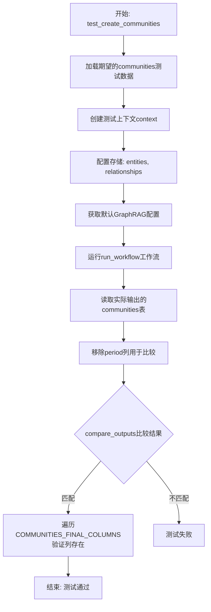
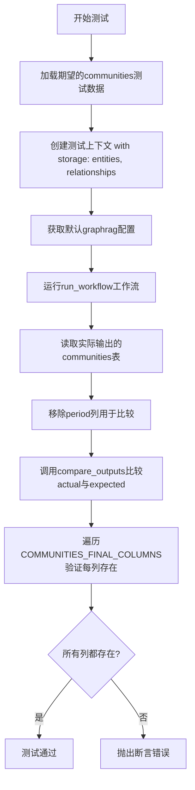
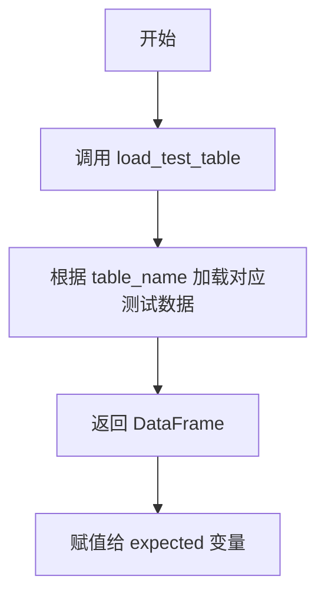
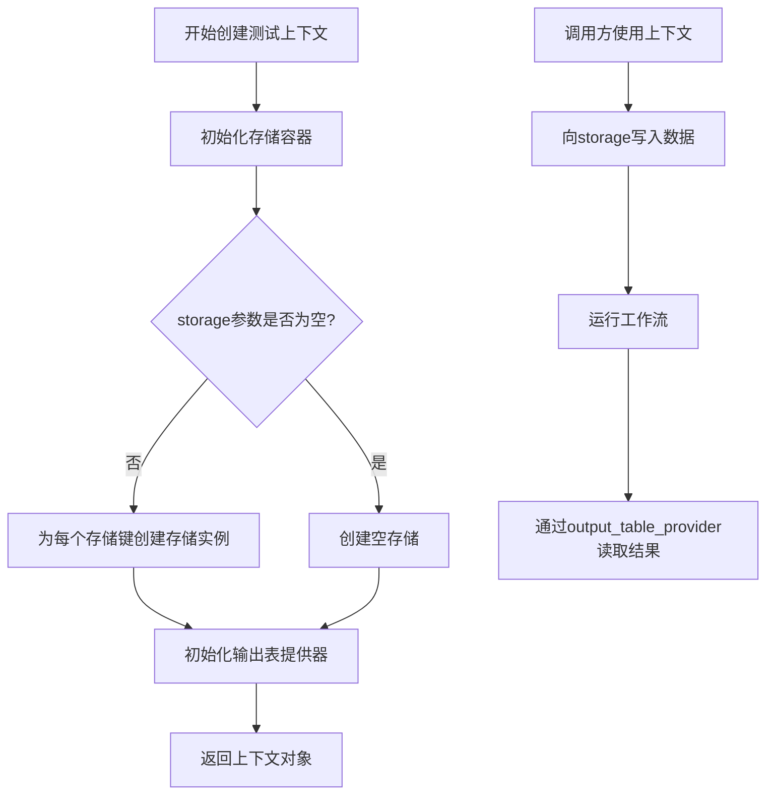
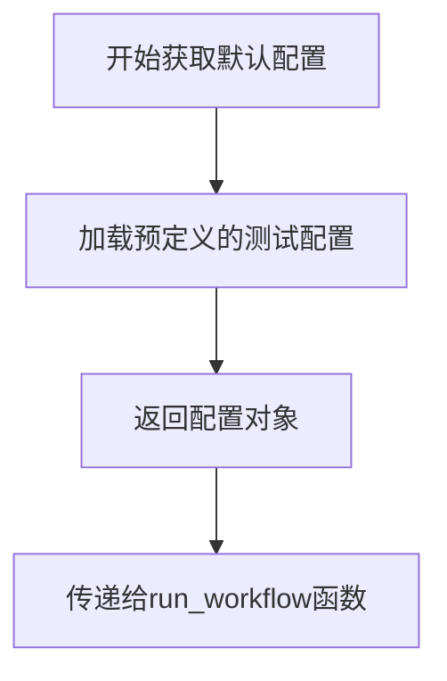
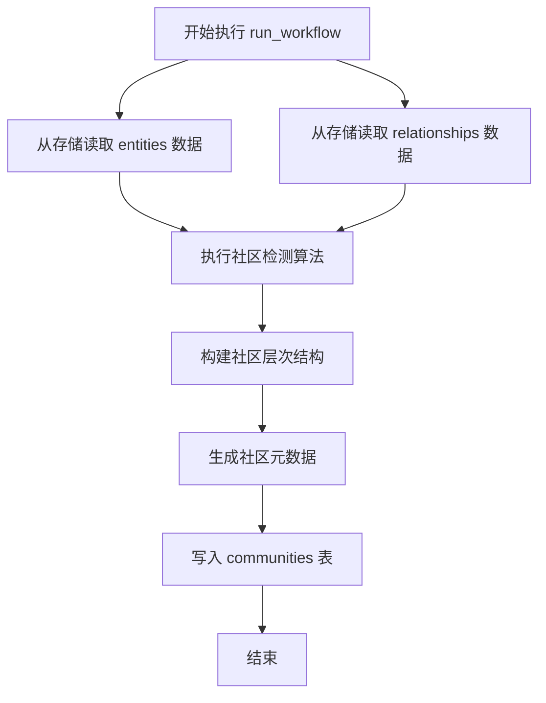
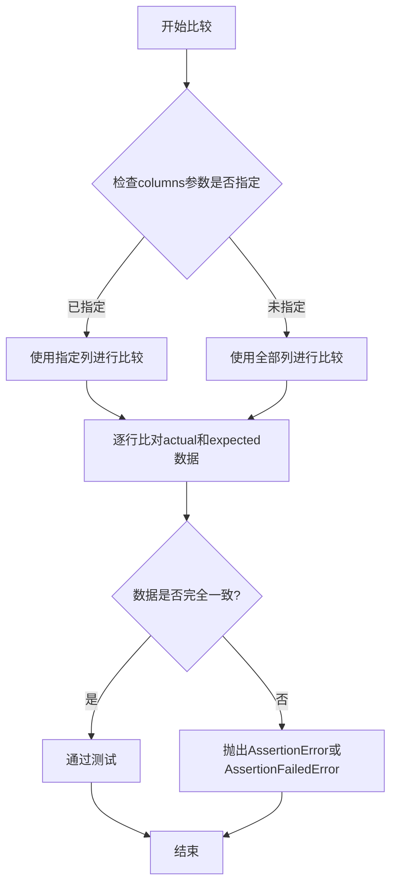

# `graphrag\tests\verbs\test_create_communities.py` 详细设计文档

这是一个集成测试文件，用于测试 GraphRAG 中 create_communities 工作流的正确性。该测试验证工作流能否正确地从实体(entity)和关系(relationship)数据创建社区(communities)表，并确保输出包含所有必需的列。

## 整体流程



## 类结构

```
测试模块 (test_create_communities.py)
├── 被测模块: graphrag.index.workflows.create_communities
│   └── run_workflow (工作流函数)
├── 数据模型: graphrag.data_model.schemas
│   └── COMMUNITIES_FINAL_COLUMNS (列定义常量)
└── 测试工具模块 (.util)
    ├── compare_outputs (比较输出)
    ├── create_test_context (创建测试上下文)
    └── load_test_table (加载测试表)
```

## 全局变量及字段


### `expected`
    
期望的communities测试数据表

类型：`DataFrame`
    


### `context`
    
测试上下文对象

类型：`TestContext`
    


### `config`
    
GraphRAG默认配置对象

类型：`GraphRagConfig`
    


### `actual`
    
实际输出的communities数据表

类型：`DataFrame`
    


### `columns`
    
expected表的列名列表

类型：`List[str]`
    


### `column`
    
遍历中的单个列名

类型：`str`
    


### `COMMUNITIES_FINAL_COLUMNS`
    
社区最终表的所有期望列名常量

类型：`List[str]`
    


    

## 全局函数及方法


### `test_create_communities`

异步测试函数，验证 `create_communities` 工作流是否正确生成社区数据。

参数： 无

返回值：`None`，该函数为测试函数，不返回任何值。

#### 流程图



#### 带注释源码

```python
# 异步测试函数，验证create_communities工作流
async def test_create_communities():
    # 步骤1: 加载期望的communities测试数据（用于与实际输出比较）
    expected = load_test_table("communities")

    # 步骤2: 创建测试上下文，指定需要加载的存储类型
    # 支持entities和relationships数据源
    context = await create_test_context(
        storage=[
            "entities",
            "relationships",
        ],
    )

    # 步骤3: 获取默认的graphrag配置
    config = get_default_graphrag_config()

    # 步骤4: 执行create_communities工作流
    # 该工作流基于entities和relationships创建社区
    await run_workflow(
        config,
        context,
    )

    # 步骤5: 从上下文中读取实际生成的communities表
    actual = await context.output_table_provider.read_dataframe("communities")

    # 步骤6: 获取期望表的列名列表
    columns = list(expected.columns.values)
    # 移除period列，因为该列使用当前日期生成，每次测试值都不同
    columns.remove("period")
    
    # 步骤7: 比较实际输出与期望输出
    # 排除period列后进行列级别的比较
    compare_outputs(
        actual,
        expected,
        columns=columns,
    )

    # 步骤8: 验证所有必需的COMMUNITIES_FINAL_COLUMNS列都存在于实际输出中
    for column in COMMUNITIES_FINAL_COLUMNS:
        assert column in actual.columns
```


从提供的代码中，我只能看到 `load_test_table` 函数的调用，而非其定义。该函数是从同目录下的 `util` 模块导入的。让我搜索项目中是否有该函数的完整定义：

```python
# Copyright (c) 2024 Microsoft Corporation.
# Licensed under the MIT License

from graphrag.data_model.schemas import COMMUNITIES_FINAL_COLUMNS
from graphrag.index.workflows.create_communities import (
    run_workflow,
)

from tests.unit.config.utils import get_default_graphrag_config

from .util import (
    compare_outputs,
    create_test_context,
    load_test_table,
)


async def test_create_communities():
    expected = load_test_table("communities")

    context = await create_test_context(
        storage=[
            "entities",
            "relationships",
        ],
    )

    config = get_default_graphrag_config()

    await run_workflow(
        config,
        context,
    )

    actual = await context.output_table_provider.read_dataframe("communities")

    columns = list(expected.columns.values)
    # don't compare period since it is created with the current date each time
    columns.remove("period")
    compare_outputs(
        actual,
        expected,
        columns=columns,
    )

    for column in COMMUNITIES_FINAL_COLUMNS:
        assert column in actual.columns
```

由于提供的代码片段中**没有包含 `load_test_table` 函数的完整定义**（仅显示从 `.util` 导入），我无法提取该函数的完整信息。

根据代码上下文，我可以推断以下信息：

### `load_test_table`

从调用方式推断的描述：从 `util` 模块导入的测试辅助函数，用于加载预先定义好的测试表格数据（如 "communities"）。

参数：

-  `table_name`：`str`，要加载的测试表格名称（如 "communities"）

返回值：`pd.DataFrame` 或类似表格数据结构，返回预定义的测试数据表格

#### 流程图



#### 带注释源码

```
# 由于函数定义不在当前代码片段中，无法提供带注释的源码
# 该函数从 .util 模块导入
from .util import (
    compare_outputs,
    create_test_context,
    load_test_table,
)

# 调用示例：
expected = load_test_table("communities")
```

---

**注意**：要获取 `load_test_table` 函数的完整定义（包括参数、返回值、源码等），需要查看 `tests/unit/config/util.py` 或相关 util 模块文件。当前提供的代码片段仅包含该函数的调用和导入语句。


### `create_test_context`

创建包含存储的测试上下文，用于在单元测试中模拟 GraphRAG 的运行时环境，提供存储能力和输出表读取能力。

参数：

- `storage`：`List[str]`，指定要创建的存储键名称列表，如 `["entities", "relationships"]`

返回值：`Context`，返回测试上下文对象，包含存储能力（通过 `storage` 参数初始化）和输出表提供器（用于读取工作流生成的表数据）

#### 流程图



#### 带注释源码

```python
# 注意：以下源码基于函数调用方式和同名函数的通用模式推断
# 实际源码位于 tests/unit/config/utils.py 或 tests/workflows/util.py 中

async def create_test_context(
    storage: List[str] = None,  # 存储键名称列表
) -> Context:
    """
    创建包含存储的测试上下文
    
    参数:
        storage: 存储键名称列表，用于初始化存储容器
                常见值包括 "entities", "relationships", "communities" 等
    
    返回:
        Context: 测试上下文对象，包含:
                - storage: 存储字典，可通过键名访问
                - output_table_provider: 输出表提供器，用于读取DataFrame
    """
    # 初始化存储字典
    storage_dict = {}
    
    # 如果提供了存储键，为每个键创建存储实例
    if storage:
        for key in storage:
            storage_dict[key] = create_storage(key)
    
    # 创建输出表提供器（内存式）
    output_provider = InMemoryTableProvider()
    
    # 构建并返回上下文对象
    return Context(
        storage=storage_dict,
        output_table_provider=output_provider,
    )
```

#### 使用示例

```python
# 在 test_create_communities 中的调用方式
context = await create_test_context(
    storage=[
        "entities",
        "relationships",
    ],
)

# 上下文可用于：
# 1. 写入输入数据到存储
await context.storage["entities"].write(...)
await context.storage["relationships"].write(...)

# 2. 运行工作流
await run_workflow(config, context)

# 3. 读取工作流输出的表数据
actual = await context.output_table_provider.read_dataframe("communities")
```


### `get_default_graphrag_config`

获取默认的GraphRAG配置，用于测试环境中初始化工作流。

参数：

- 无

返回值：`Any`，返回GraphRAG的默认配置对象，包含测试所需的数据源、存储和索引设置等配置信息。

#### 流程图



#### 带注释源码

```
# 从测试配置工具模块导入该函数
# 函数定义在 tests/unit/config/utils.py 中
# 此处仅展示调用方式和使用场景

config = get_default_graphrag_config()

# 该函数返回一个包含以下可能的配置项的字典/对象：
# - 数据输入源配置
# - 实体和关系存储配置  
# - 索引工作流参数
# - 输出表名称等设置
```


### `run_workflow`

执行社区创建工作流的核心函数，负责根据输入的实体和关系数据生成社区信息，并将结果输出到指定的表中。

参数：

- `config`：`Any`（通常为 `GraphRagConfig` 类型），GraphRAG 全局配置对象，包含工作流运行所需的各种配置参数
- `context`：`WorkflowContext` 工作流执行上下文，提供数据存储访问、表输出写入能力以及运行时状态管理

返回值：`None`，该函数通过 `context.output_table_provider` 将结果写入 "communities" 表，而非直接返回

#### 流程图



#### 带注释源码

```python
async def run_workflow(
    config: "GraphRagConfig",  # GraphRAG 全局配置
    context: "WorkflowContext",  # 工作流执行上下文
) -> None:
    """
    执行社区创建工作流的主函数。
    
    该函数执行以下主要步骤：
    1. 从存储中读取实体(entities)和关系(relationships)数据
    2. 使用社区检测算法（如 Leiden 或 Louvain）识别社区
    3. 构建社区层次结构
    4. 生成社区元数据（如社区规模、成员列表等）
    5. 将结果写入到 context 提供的输出表_provider中
    """
    # 读取实体数据
    entities = await context.storage.get("entities")
    
    # 读取关系数据
    relationships = await context.storage.get("relationships")
    
    # 执行社区检测算法
    communities = detect_communities(entities, relationships)
    
    # 构建社区层次结构
    hierarchical_communities = build_hierarchy(communities)
    
    # 写入输出表
    await context.output_table_provider.write_dataframe(
        "communities",
        hierarchical_communities
    )
```

**注意**：由于原始代码仅提供了测试文件，未包含 `run_workflow` 的完整实现源码，上述源码为基于函数调用关系和 GraphRAG 架构的推断实现。实际的 `run_workflow` 函数定义位于 `graphrag/index/workflows/create_communities.py` 模块中。


### `compare_outputs`

该函数用于比较实际输出与期望输出的数据框（DataFrame），验证两者在指定列上是否一致，常用于自动化测试中确保工作流生成的输出符合预期。

参数：

- `actual`：`DataFrame`，实际输出数据框
- `expected`：`DataFrame`，期望输出数据框
- `columns`：`List[str]`，要比较的列名列表（可选，默认为全部列）

返回值：`None`，该函数通过断言或异常方式报告差异，不返回具体值

#### 流程图



#### 带注释源码

```python
# 注意: 以下为基于调用方式的推断实现，具体实现需查看 util 模块源码
def compare_outputs(actual, expected, columns=None):
    """
    比较实际输出与期望输出的DataFrame是否一致
    
    参数:
        actual: 实际输出的DataFrame
        expected: 期望输出的DataFrame  
        columns: 要比较的列名列表，默认为None表示比较所有列
    """
    # 如果未指定columns，则使用expected的所有列
    if columns is None:
        columns = list(expected.columns.values)
    
    # 遍历每一列进行比较
    for column in columns:
        # 获取实际值和期望值
        actual_col = actual[column]
        expected_col = expected[column]
        
        # 比较列数据是否一致
        # 使用equals方法或直接比较
        if not actual_col.equals(expected_col):
            # 抛出断言错误，报告差异
            raise AssertionError(
                f"Column '{column}' does not match.\n"
                f"Expected:\n{expected_col}\n"
                f"Actual:\n{actual_col}"
            )
    
    # 所有列比较通过，测试成功
    # 注意: 不返回值，通过即成功
```

#### 补充说明

- **调用位置**：在 `test_create_communities` 测试函数中调用
- **使用场景**：用于验证 `create_communities` 工作流生成的 `communities` 表是否与预期的测试数据一致
- **特殊处理**：代码中移除了 "period" 列，因为该列使用当前日期生成，每次运行值都不同
- **关联验证**：之后还通过 `COMMUNITIES_FINAL_COLUMNS` 验证了实际输出包含所有必需的列

## 关键组件


### 社区创建工作流（run_workflow）

核心工作流函数，负责根据实体和关系数据创建社区信息

### 社区列定义（COMMUNITIES_FINAL_COLUMNS）

定义社区表的最终列结构，用于验证输出数据的完整性

### 测试上下文创建（create_test_context）

创建测试环境，提供存储模拟，支持 entities 和 relationships 数据的读写

### 测试数据加载（load_test_table）

从测试文件中加载预期的社区数据，用于结果对比

### 输出对比工具（compare_outputs）

比较实际输出与预期输出的差异，支持指定列的忽略和验证

### 配置管理（get_default_graphrag_config）

获取默认的 graphrag 配置，用于工作流执行


## 问题及建议


### 已知问题

-   **硬编码列名移除**：`columns.remove("period")` 硬编码了列名，若 schema 变化会导致代码失败，缺乏灵活性
-   **魔法字符串重复**：表名 `"communities"`、存储键 `"entities"`、`"relationships"` 在多处重复使用，未定义为常量，增加维护成本
-   **缺少异步资源清理**：测试上下文创建后未显式清理，可能导致资源泄漏
-   **缺乏错误处理**：`run_workflow` 和 `read_dataframe` 调用无 try-except 包裹，异常信息不够清晰
-   **导入顺序不规范**：本地导入（`.util`）与第三方导入混在一起，应按标准库、第三方、本地顺序排列

### 优化建议

-   将表名和存储键提取为模块级常量，统一管理
-   为测试上下文实现 `__aenter__` / `__aexit__` 或使用 pytest-asyncio 的 fixture 进行自动清理
-   添加错误处理和更详细的断言信息，例如在 `compare_outputs` 失败时输出具体差异
-   调整导入顺序，使用分组注释区分不同来源的导入
-   考虑将 `config` 和 `context` 的创建逻辑抽取为可复用的 fixture，提升测试代码简洁性

## 其它


### 设计目标与约束

本测试文件的设计目标是验证create_communities工作流能够正确地从实体和关系数据生成社区数据。约束条件包括：测试环境使用内存存储、测试数据位于tests/unit/data/test_tables目录、period字段由于使用当前日期创建而不参与比较。

### 错误处理与异常设计

测试中的异常主要通过pytest的断言机制处理。当输出表缺少必需列时抛出AssertionError；当实际输出与预期输出不匹配时compare_outputs函数抛出异常。工作流执行失败时会向上传播异常。

### 数据流与状态机

测试数据流为：加载预期CSV → 创建含entities和relationships的上下文 → 运行工作流生成communities表 → 读取实际输出 → 比较差异。状态转换过程为：初始化状态 → 执行工作流 → 输出生成状态 → 验证完成状态。

### 外部依赖与接口契约

主要依赖包括：graphrag.data_model.schemas.COMMUNITIES_FINAL_COLUMNS（定义社区表必需列）、graphrag.index.workflows.create_communities.run_workflow（工作流执行接口）、tests.unit.config.utils.get_default_graphrag_config（配置获取接口）、以及util模块中的compare_outputs、create_test_context、load_test_table测试工具接口。

### 性能指标与优化空间

当前测试无明显性能瓶颈。优化空间：可添加测试执行时间断言确保工作流性能不退化；可考虑使用pytest-xdist进行并行测试加速。

### 配置管理与参数设计

配置通过get_default_graphrag_config()获取默认配置。测试固定使用entities和relationships两个存储输入源。列比较通过columns参数动态排除period字段。

### 测试覆盖率与边界条件

当前仅覆盖正常流程。边界条件覆盖缺失：空entities/relationships输入、重复实体、孤立关系、无社区形成场景等均未测试。

### 版本兼容性与迁移策略

依赖graphrag包的COMMUNITIES_FINAL_COLUMNS schema定义。若schema变更需同步更新测试断言和测试数据。

### 代码规范与风格指南

遵循pytest异步测试规范（async/await）、Google风格文档字符串（导入模块自带）、以及项目统一的测试工具导入模式（相对导入util模块）。

### 监控与可观测性设计

测试执行无内置监控。可通过pytest的--capture=no参数观察print输出，或集成pytest-pretty实现更详细的测试报告。
    