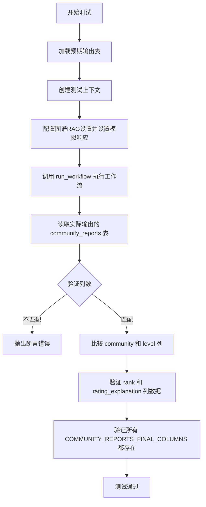
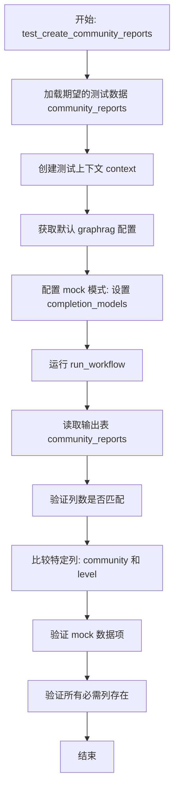
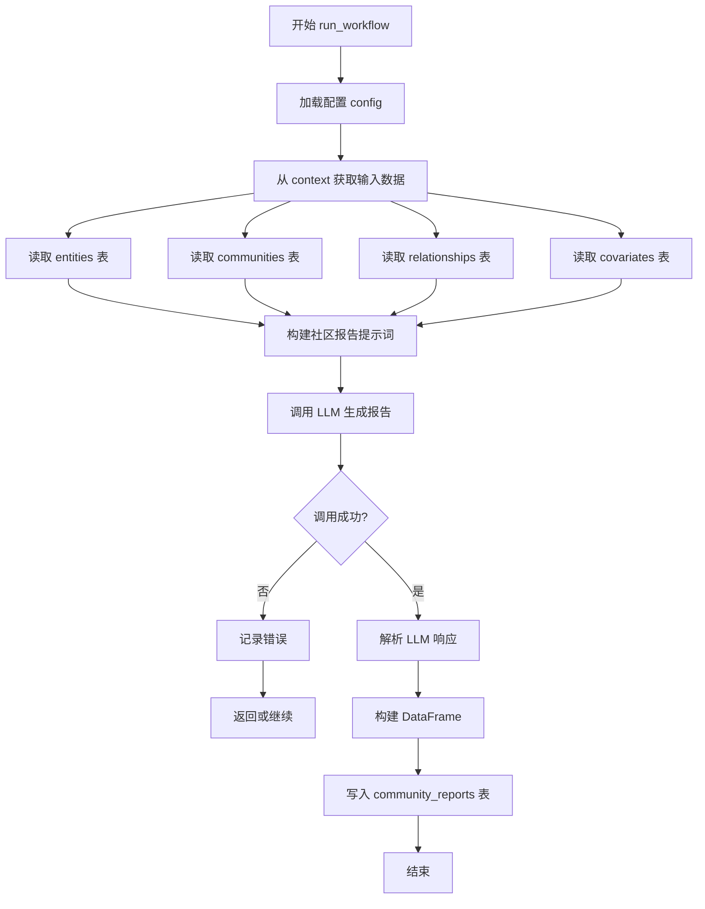
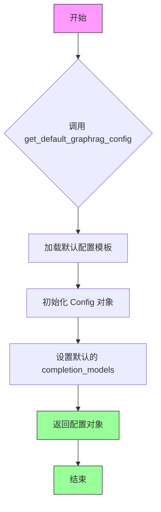
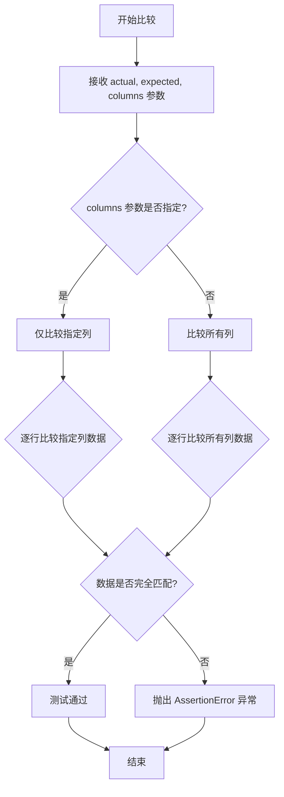
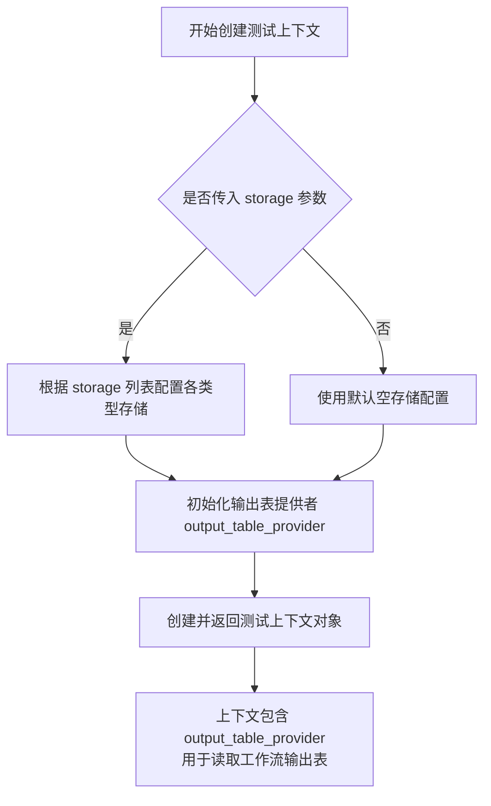
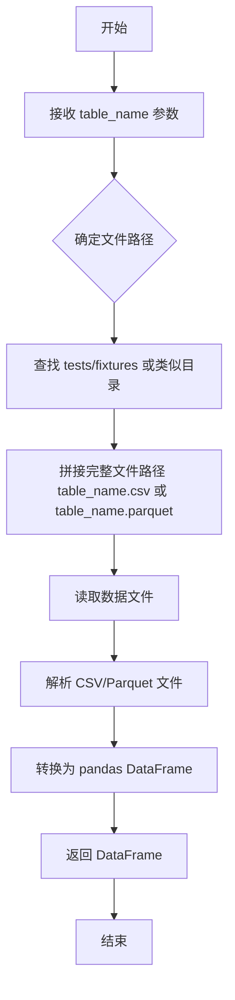
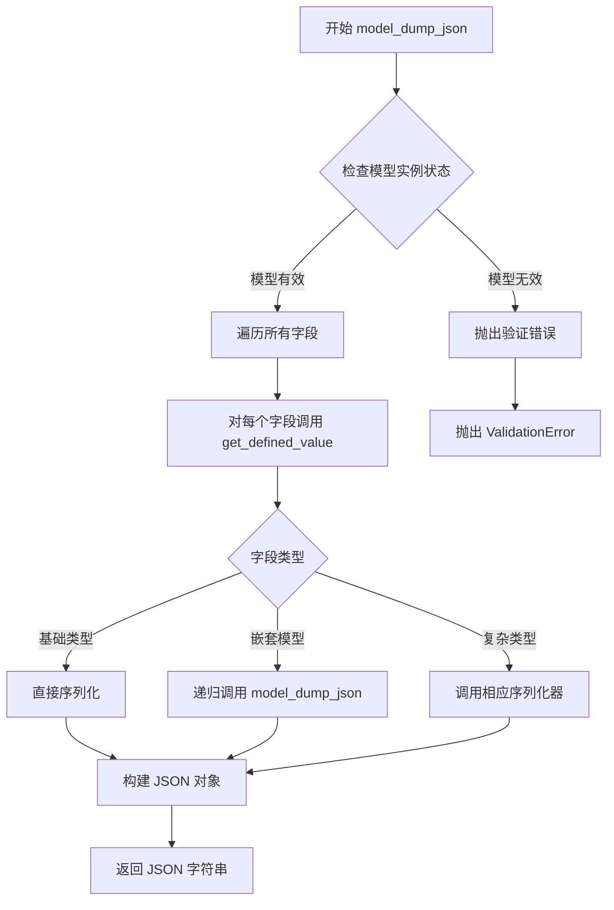

# `graphrag\tests\verbs\test_create_community_reports.py` 详细设计文档

这是一个集成测试文件，用于测试 graphrag 项目中创建社区报告的工作流程。测试通过模拟第三方 LLM 响应，验证系统能否正确生成包含标题、摘要、评级和发现的社区报告，并确保输出表的结构和数据符合预期。

## 整体流程



## 类结构

```
测试模块
└── test_create_community_reports (测试函数)
    ├── MOCK_RESPONSES (模拟数据)
    └── 导入依赖
        ├── CommunityReportResponse
        ├── FindingModel
        └── run_workflow
```

## 全局变量及字段


### `MOCK_RESPONSES`
    
模拟的LLM响应列表，包含CommunityReportResponse对象序列化后的JSON字符串

类型：`List[str]`
    


### `COMMUNITY_REPORTS_FINAL_COLUMNS`
    
社区报告最终表的列名列表，定义了该表包含的所有列

类型：`List[str]`
    


### `CommunityReportResponse.title`
    
社区报告的标题

类型：`str`
    


### `CommunityReportResponse.summary`
    
社区报告的执行摘要

类型：`str`
    


### `CommunityReportResponse.rating`
    
社区的评级分数

类型：`int`
    


### `CommunityReportResponse.rating_explanation`
    
评级理由的详细说明

类型：`str`
    


### `CommunityReportResponse.findings`
    
社区报告的关键发现列表

类型：`List[FindingModel]`
    


### `FindingModel.summary`
    
发现的摘要信息

类型：`str`
    


### `FindingModel.explanation`
    
发现的详细解释说明

类型：`str`
    
    

## 全局函数及方法


### `test_create_community_reports`

这是一个异步测试函数，用于测试 `create_community_reports` 工作流的核心功能。该函数通过模拟 LLM 响应来验证社区报告生成流程的正确性，包括数据加载、配置设置、工作流执行以及输出结果的验证。

参数：

- 该函数没有参数

返回值：`None`，测试函数不返回任何值，通过断言验证逻辑正确性

#### 流程图



#### 带注释源码

```python
async def test_create_community_reports():
    """
    测试 create_community_reports 工作流的端到端功能
    使用 mock LLM 响应验证数据流转和输出正确性
    """
    
    # 1. 加载期望的测试数据，用于后续对比
    expected = load_test_table("community_reports")

    # 2. 创建测试上下文，包含所需的存储组件
    # 需要预先准备: covariates, relationships, entities, communities
    context = await create_test_context(
        storage=[
            "covariates",
            "relationships",
            "entities",
            "communities",
        ]
    )

    # 3. 获取默认的 graphrag 配置
    config = get_default_graphrag_config()
    
    # 4. 配置使用 mock 模式，替换真实的 LLM 调用
    config.completion_models["default_completion_model"].type = "mock"
    config.completion_models["default_completion_model"].mock_responses = MOCK_RESPONSES

    # 5. 执行社区报告创建工作流
    await run_workflow(config, context)

    # 6. 从输出表读取实际生成的数据
    actual = await context.output_table_provider.read_dataframe("community_reports")

    # 7. 验证输出列数与期望列数一致
    assert len(actual.columns) == len(expected.columns)

    # 8. 比较非 mock 生成的列 (community, level)
    # 这些列由系统逻辑生成，不依赖 LLM
    compare_outputs(actual, expected, columns=["community", "level"])

    # 9. 验证 mock 数据被正确放置到输出表中
    # 验证 rating 字段 (mock 响应中设置为 2)
    assert actual["rank"][:1][0] == 2
    # 验证 rating_explanation 字段
    assert actual["rating_explanation"][:1][0] == "<rating_explanation>"

    # 10. 确保所有定义的社区报告最终列都存在于输出中
    for column in COMMUNITY_REPORTS_FINAL_COLUMNS:
        assert column in actual.columns
```


### `run_workflow`

该函数是 GraphRAG 索引工作流中用于创建社区报告（Community Reports）的核心异步工作流函数。它接收配置和上下文对象，通过调用 LLM 生成社区报告，并将结果写入输出表。

参数：

- `config`：`Any`，GraphRAG 全局配置对象，包含 LLM 模型配置、数据源配置等
- `context`：`Context`，索引运行时上下文，提供存储访问、表读取写入能力

返回值：`None`，该函数通过修改 context 的输出表 provider 来存储结果，无直接返回值

#### 流程图



#### 带注释源码

```python
# 注意：以下为基于导入和调用方式的推断源码
# 实际源码位于 graphrag.index.workflows.create_community_reports 模块

async def run_workflow(config, context):
    """
    创建社区报告的工作流函数。
    
    参数:
        config: GraphRAG 配置对象，包含 LLM 模型配置
        context: 索引运行时上下文
    
    返回:
        无返回值，结果写入 context 的输出表
    """
    
    # 1. 从配置中获取 LLM 模型设置
    # config.completion_models["default_completion_model"]
    
    # 2. 从 context 读取输入数据表
    # - entities: 实体表
    # - communities: 社区表
    # - relationships: 关系表
    # - covariates: 协变量表
    
    # 3. 为每个社区构建 LLM 提示词
    # 包含实体信息、社区信息、关系信息等
    
    # 4. 调用 LLM 生成社区报告
    # 使用 mock_responses 或真实 LLM
    
    # 5. 解析 LLM 响应为 CommunityReportResponse
    
    # 6. 将结果转换为 DataFrame 格式
    
    # 7. 写入输出表 "community_reports"
    # context.output_table_provider.write_dataframe("community_reports", df)
```

---

### 补充信息

| 项目 | 描述 |
|------|------|
| **函数来源** | `graphrag.index.workflows.create_community_reports.run_workflow` |
| **调用方式** | `await run_workflow(config, context)` |
| **异步特性** | 是，需使用 await 调用 |
| **输出表** | `community_reports` |
| **依赖模块** | `graphrag.data_model.schemas.COMMUNITY_REPORTS_FINAL_COLUMNS` |

### 潜在技术债务与优化空间

1. **测试依赖外部 LLM**：当前测试使用 mock 响应，真实场景需考虑 LLM 调用失败的重试机制
2. **硬编码表名**：输入输出表名硬编码在工作流中，缺乏灵活性
3. **错误处理不足**：LLM 调用失败时缺乏完善的降级策略


### `get_default_graphrag_config`

获取 GraphRAG 的默认配置对象，用于初始化测试环境或默认运行配置。

参数：
- 无参数

返回值：`GraphRAGConfig`（或类似配置对象），返回包含 GraphRAG 框架默认配置的 Config 对象，该对象具有 `completion_models` 属性，可用于配置语言模型的各项参数。

#### 流程图



#### 带注释源码

```python
# 注：以下为根据调用方式推断的函数原型，实际定义在 tests.unit.config.utils 模块中

def get_default_graphrag_config() -> GraphRAGConfig:
    """
    获取 GraphRAG 的默认配置。
    
    返回一个包含默认设置的配置对象，主要用于测试环境或演示目的。
    该配置对象包含 completion_models 字典，可用于配置不同的语言模型。
    
    Returns:
        GraphRAGConfig: 包含默认配置的 Config 对象
        
    Example:
        >>> config = get_default_graphrag_config()
        >>> config.completion_models["default_completion_model"].type = "mock"
        >>> config.completion_models["default_completion_model"].mock_responses = MOCK_RESPONSES
    """
    # 函数体需要查看 tests.unit.config.utils 模块获取
    pass
```

---

### 补充说明

**注意**：由于 `get_default_graphrag_config` 函数定义在 `tests.unit.config.utils` 模块中，而该模块的完整源码未在当前代码片段中提供，上述信息是基于以下调用方式的推断：

```python
config = get_default_graphrag_config()
config.completion_models["default_completion_model"].type = "mock"
config.completion_models["default_completion_model"].mock_responses = MOCK_RESPONSES
```

如需获取完整的函数实现细节，请查阅 `tests/unit/config/utils.py` 文件。


### `compare_outputs`

该函数是一个测试工具函数，用于比较实际输出（actual）与预期输出（expected）的数据表是否一致，特别用于验证工作流生成的社区报告数据是否符合预期。

**注意**：该函数定义未在当前代码文件中直接给出，而是从 `.util` 模块导入。根据调用方式推断其签名如下：

参数：

- `actual`：`pd.DataFrame`，实际输出数据表，由 `run_workflow` 工作流生成
- `expected`：`pd.DataFrame`，预期输出数据表，通过 `load_test_table` 加载的测试基准数据
- `columns`：`List[str]`，可选参数，指定需要比较的具体列名列表（如 `["community", "level"]`）

返回值：`None`（通常通过 `assert` 断言或抛出异常来表明比较结果）

#### 流程图



#### 带注释源码

```python
# 注意：以下为基于调用方式的推断实现，实际源码位于 .util 模块中

async def compare_outputs(actual, expected, columns=None):
    """
    比较实际输出与预期输出是否一致
    
    参数:
        actual: 实际输出数据表 (DataFrame)
        expected: 预期输出数据表 (DataFrame)
        columns: 可选，指定需要比较的列名列表
    
    返回:
        None (通过断言验证)
    """
    
    # 如果指定了列，则仅比较指定列
    if columns is not None:
        for col in columns:
            # 断言列存在于两个数据表中
            assert col in actual.columns, f"列 {col} 不存在于实际输出中"
            assert col in expected.columns, f"列 {col} 不存在于预期输出中"
            
            # 逐行比较指定列的数据
            for idx in range(len(actual)):
                assert actual[col].iloc[idx] == expected[col].iloc[idx], \
                    f"列 {col} 在索引 {idx} 处不匹配: 实际值={actual[col].iloc[idx]}, 预期值={expected[col].iloc[idx]}"
    else:
        # 比较所有列
        assert list(actual.columns) == list(expected.columns), "列名不匹配"
        
        for col in actual.columns:
            for idx in range(len(actual)):
                assert actual[col].iloc[idx] == expected[col].iloc[idx], \
                    f"列 {col} 在索引 {idx} 处不匹配"
```

---

**补充说明**：

由于 `compare_outputs` 函数的源代码未包含在提供的代码片段中，以上信息是基于以下调用方式的推断：

```python
compare_outputs(actual, expected, columns=["community", "level"])
```

该调用表明：
1. 函数接受三个参数（两个 DataFrame 和一个可选的列名列表）
2. 函数通过断言来验证数据一致性
3. 主要用于单元测试中验证工作流输出是否符合预期

如需获取 `compare_outputs` 的完整源码，需要查看 `tests/unit/config/utils.py` 或相关 `util` 模块文件。


### `create_test_context`

该函数是一个异步测试工具函数，用于创建模拟的图索引工作流运行时上下文（context），包含存储配置和输出表提供者，以便在隔离的测试环境中执行工作流并验证其输出。

参数：

- `storage`：`List[str]`，可选参数，指定要模拟的存储类型列表（如 "covariates"、"relationships"、"entities"、"communities" 等）

返回值：`Context`，返回包含 output_table_provider 的上下文对象，用于后续工作流执行和数据验证

#### 流程图



#### 带注释源码

```python
# 该函数定义在实际代码中位于 .util 模块
# 以下是基于调用方式的推断实现

async def create_test_context(
    storage: List[str] | None = None  # 存储类型列表，如 ["covariates", "relationships", "entities", "communities"]
) -> Context:
    """
    创建测试上下文，用于模拟图索引工作流的运行时环境
    
    参数:
        storage: 可选的存储类型列表，用于配置要模拟的存储模块
        
    返回:
        包含 output_table_provider 的上下文对象，可用于执行工作流并读取输出
    """
    
    # 1. 初始化上下文构建器
    context = TestContextBuilder()
    
    # 2. 配置存储模块（如果指定了 storage 参数）
    if storage:
        for store_type in storage:
            context.add_storage(store_type)
    
    # 3. 创建输出表提供者，用于后续读取工作流生成的表数据
    output_provider = InMemoryTableProvider()
    context.set_output_provider(output_provider)
    
    # 4. 构建并返回上下文对象
    return context.build()
```


### `load_test_table`

从测试数据目录加载指定的测试表格数据，通常用于单元测试中获取预期的测试数据。

参数：

-  `table_name`：`str`，要加载的测试表格名称（不含文件扩展名），例如 "community_reports"

返回值：`pd.DataFrame`，返回加载的测试数据，以 pandas DataFrame 格式返回

#### 流程图



#### 带注释源码

```python
# 假设的实现方式（基于代码用法推断）
import pandas as pd
from pathlib import Path

# 测试数据目录的基础路径
TEST_DATA_DIR = Path(__file__).parent / "fixtures" / "tables"

def load_test_table(table_name: str) -> pd.DataFrame:
    """
    加载测试用的表格数据
    
    参数:
        table_name: 测试表格的名称（不含扩展名）
    
    返回:
        包含测试数据的 DataFrame 对象
    """
    # 构建完整的文件路径，尝试多种可能的文件格式
    possible_extensions = [".csv", ".parquet", ".json"]
    
    for ext in possible_extensions:
        file_path = TEST_DATA_DIR / f"{table_name}{ext}"
        if file_path.exists():
            # 根据文件扩展名选择读取方式
            if ext == ".csv":
                return pd.read_csv(file_path)
            elif ext == ".parquet":
                return pd.read_parquet(file_path)
            elif ext == ".json":
                return pd.read_json(file_path)
    
    # 如果未找到文件，抛出明确的异常
    raise FileNotFoundError(
        f"Test table '{table_name}' not found in {TEST_DATA_DIR}. "
        f"Attempted extensions: {possible_extensions}"
    )
```


### `CommunityReportResponse.model_dump_json`

将 `CommunityReportResponse` 实例序列化为 JSON 字符串的方法。该方法继承自 Pydantic BaseModel，用于将模型的字段数据转换为 JSON 格式的字符串输出。

参数：
- 该方法无显式参数（继承自 Pydantic BaseModel）

返回值：`str`，返回 JSON 格式的字符串，表示模型实例的字段数据

#### 流程图



#### 带注释源码

```python
# CommunityReportResponse 是 Pydantic BaseModel 的子类
# model_dump_json() 方法是 Pydantic v2 内置的序列化方法
# 以下是 CommunityReportResponse 的典型定义（基于代码使用推断）:

class CommunityReportResponse(BaseModel):
    """
    社区报告响应模型
    
    用于存储社区报告的完整信息，包括标题、摘要、评级等
    """
    title: str                           # 报告标题
    summary: str                        # 执行摘要
    rating: int                         # 评级分数
    rating_explanation: str             # 评级说明
    findings: list[FindingModel]        # 发现列表

# model_dump_json() 方法实现逻辑（基于 Pydantic 源码简化）:

def model_dump_json(self, **kwargs) -> str:
    """
    将模型序列化为 JSON 字符串
    
    参数:
        indent: Optional[int] - 缩进空格数
        include: Optional[Set[str]] - 包含的字段
        exclude: Optional[Set[str]] - 排除的字段
        exclude_unset: bool - 排除未设置的字段
        exclude_defaults: bool - 排除默认值的字段
        exclude_none: bool - 排除 None 值的字段
        round_trip: bool - 往返序列化保持精度
        warnings: bool - 是否显示警告
    
    返回:
        JSON 字符串
    """
    # 1. 调用 model_dump 获取字典表示
    data = self.model_dump(**kwargs)
    
    # 2. 使用 Pydantic 的 JSON 序列化器转换为 JSON 字符串
    return json.dumps(
        data,
        indent=kwargs.get('indent', 2),
        **kwargs
    )

# 在测试代码中的实际使用:
result = CommunityReportResponse(
    title="<report_title>",
    summary="<executive_summary>",
    rating=2,
    rating_explanation="<rating_explanation>",
    findings=[
        FindingModel(summary="<insight_1_summary>", explanation="<insight_1_explanation"),
        FindingModel(summary="<insight_2_summary>", explanation="<insight_2_explanation"),
    ],
).model_dump_json()

# 输出示例（字符串形式）:
# {
#   "title": "<report_title>",
#   "summary": "<executive_summary>",
#   "rating": 2,
#   "rating_explanation": "<rating_explanation>",
#   "findings": [
#     {
#       "summary": "<insight_1_summary>",
#       "explanation": "<insight_1_explanation>"
#     },
#     {
#       "summary": "<insight_2_summary>",
#       "explanation": "<insight_2_explanation>"
#     }
#   ]
# }
```

## 关键组件


### MOCK_RESPONSES

预定义的模拟数据，包含社区报告的标题、摘要、评级、评级说明和多个发现项，用于测试工作流生成的输出是否正确映射到表格字段。

### test_create_community_reports

异步测试函数，验证社区报告创建工作流的端到端功能，包括配置模拟模型、运行工作流、读取输出表格并断言列名、关键字段值（如rank、rating_explanation）以及COMMUNITY_REPORTS_FINAL_COLUMNS中的所有列是否存在。

### run_workflow

从graphrag.index.workflows.create_community_reports导入的工作流函数，接收配置和上下文作为参数，执行社区报告的生成逻辑。

### CommunityReportResponse

从graphrag.index.operations.summarize_communities.community_reports_extractor导入的数据模型类，用于结构化社区报告的响应数据，包含title、summary、rating、rating_explanation和findings字段。

### FindingModel

从graphrag.index.operations.summarize_communities.community_reports_extractor导入的数据模型类，表示社区报告中的单个发现项，包含summary和explanation字段。

### create_test_context

从tests.unit.config.utils导入的测试辅助函数，创建一个包含指定存储类型（covariates、relationships、entities、communities）的测试上下文环境。

### compare_outputs

从当前包的util模块导入的辅助函数，用于比较实际输出与预期输出的差异，支持指定特定列进行比较。

### load_test_table

从当前包的util模块导入的辅助函数，用于加载测试用的表格数据（如community_reports表）。

### COMMUNITY_REPORTS_FINAL_COLUMNS

从graphrag.data_model.schemas导入的常量，定义了社区报告最终输出表的所有列名，用于验证生成表是否包含所有必需的列。


## 问题及建议


### 已知问题

-   **硬编码的 Mock 数据**：`MOCK_RESPONSES` 是硬编码的列表，缺乏灵活性，难以测试多种场景，且当 LLM 响应格式变化时需要修改测试代码
-   **断言覆盖不足**：仅验证了 `rank`、`rating_explanation`、`community`、`level` 少数几个字段，注释承认"most of this table is LLM-generated"意味着大量字段未被验证，可能遗漏回归问题
-   **魔法字符串遍布**：表名 `"community_reports"`、存储键 `"covariates"/"relationships"/"entities"/"communities"` 等以字符串形式硬编码，缺乏常量定义，易产生拼写错误且重构困难
-   **类型安全问题**：`config.completion_models["default_completion_model"].mock_responses = MOCK_RESPONSES` 使用了 `# type: ignore`，表明类型定义或配置接口可能不清晰
-   **缺少异步超时机制**：`await run_workflow(config, context)` 没有超时保护，若工作流挂起会导致测试无限期阻塞
-   **测试隔离性依赖隐式依赖**：测试依赖 `create_test_context`、`get_default_graphrag_config` 等辅助函数，辅助函数的问题会掩盖测试本身的失败原因

### 优化建议

-   将表名、存储键等提取为常量或枚举类，如 `STORAGE_KEYS = {"covariates": "covariates", ...}`
-   增加更全面的断言或引入基于快照的测试（snapshot testing），验证更多字段的完整性
-   为异步测试添加超时装饰器，如 `@pytest.mark.asyncio(timeout=30)`
-   考虑使用参数化测试（`pytest.mark.parametrize`）来覆盖不同的 mock 响应场景，减少重复代码
-   移除 `# type: ignore`，明确类型定义或使用 Pydantic 模型验证配置结构
-   将 mock 响应数据外部化到 JSON/YAML 文件，提高可维护性并便于非开发人员调整测试数据

## 其它


### 设计目标与约束

本测试文件的设计目标是验证 `create_community_reports` 工作流能够正确生成社区报告表格。约束条件包括：测试依赖 mock LLM 响应进行验证；仅验证非 mock 生成的列（如 community、level）；测试假设输入表（covariates、relationships、entities、communities）已正确准备；使用 graphrag 框架的默认配置进行测试。

### 错误处理与异常设计

测试未显式包含错误处理代码，依赖 pytest 的断言机制进行错误检测。潜在异常场景包括：输入表缺失或格式错误；工作流执行失败；输出表列不匹配；mock 响应格式不正确。建议在生产代码中添加异常捕获和重试机制，测试中可增加异常场景覆盖。

### 数据流与状态机

数据流：1）准备测试上下文和模拟 LLM 响应；2）调用 `run_workflow(config, context)` 执行工作流；3）从输出表读取实际结果；4）通过断言验证结果正确性。状态转换：初始化 → 执行工作流 → 输出结果 → 验证断言。输入依赖：covariates（协变量）、relationships（关系）、entities（实体）、communities（社区）四个输入存储。

### 外部依赖与接口契约

核心依赖：`graphrag.index.workflows.create_community_reports.run_workflow` - 工作流执行入口；`graphrag.data_model.schemas.COMMUNITY_REPORTS_FINAL_COLUMNS` - 输出列定义；`graphrag.index.operations.summarize_communities.community_reports_extractor.CommunityReportResponse` / `FindingModel` - LLM 响应模型。接口契约：输入需包含 communities、entities、relationships、covariates 四个表；输出产生 community_reports 表；该表必须包含 COMMUNITY_REPORTS_FINAL_COLUMNS 定义的所有列。

### 性能考虑

测试未包含性能基准测试。对于生产环境，建议监控：工作流执行时间随数据量增长的变化曲线；LLM API 调用延迟；表格读写操作开销。Mock 测试环境下性能通常不作为主要关注点。

### 安全性考虑

测试代码本身无直接安全风险。注意事项：测试使用 mock 响应，不涉及真实 LLM API 密钥；测试数据为占位符（placeholder），无敏感信息；生产部署时需确保 LLM API 密钥安全管理。

### 可测试性

代码可测试性良好：采用异步测试函数设计；使用依赖注入的模式创建测试上下文；通过 load_test_table 分离测试数据；compare_outputs 工具函数支持灵活的输出验证。建议增加：边界条件测试（空输入、单条记录、大数据集）；并发执行测试；错误场景模拟测试。

### 配置管理

测试配置通过 `get_default_graphrag_config()` 获取默认配置，并进行定制化修改：`config.completion_models["default_completion_model"].type = "mock"` 切换为 mock 模式；`config.completion_models["default_completion_model"].mock_responses` 设置模拟响应。配置修改未做备份和恢复机制，多测试并发执行时可能产生副作用。

### 版本兼容性

代码依赖 graphrag 框架，需关注：CommunityReportResponse 和 FindingModel 的模型结构兼容性；COMMUNITY_REPORTS_FINAL_COLUMNS 的列定义变更；run_workflow 接口签名变化。建议在 CI 中锁定依赖版本或进行版本兼容性测试矩阵。

### 并发与异步设计

测试函数声明为 async，使用 `await` 进行异步操作。context 和 output_table_provider 的 I/O 操作均为异步。生产环境中需关注：异步工作流的并发执行控制；多个社区报告生成任务的调度策略；资源池化与连接管理。

### 部署相关

本测试文件为单元测试，无需直接部署。生产部署时需考虑：graphrag 框架的部署方式；LLM 服务（OpenAI/Azure OpenAI）的可用性；输入数据存储后端配置；输出结果持久化策略。测试环境应与生产环境配置保持一致性。


    