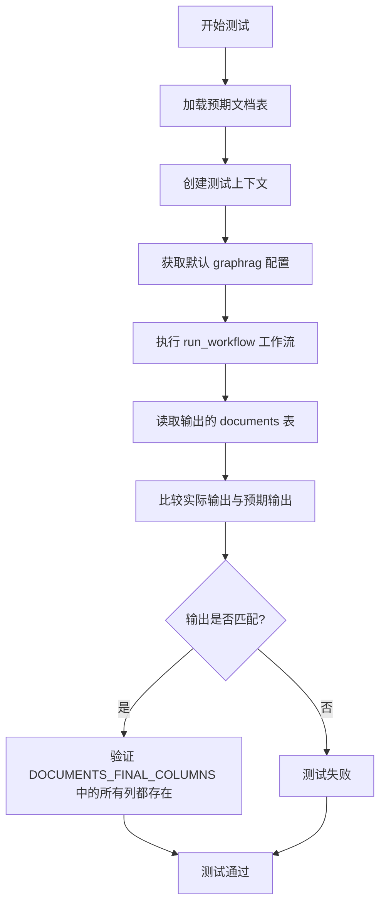
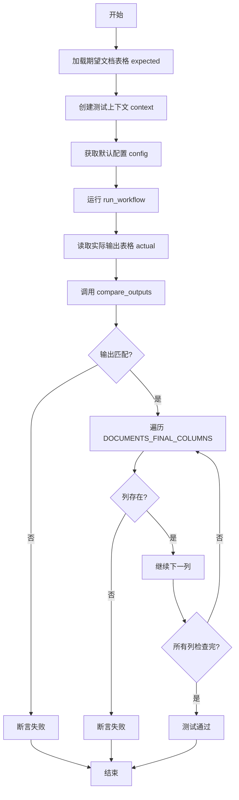
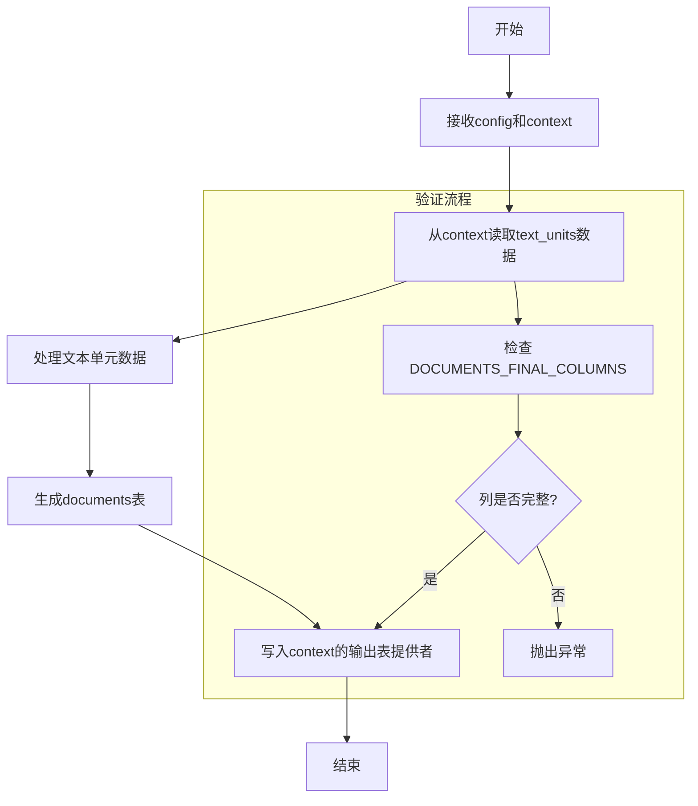
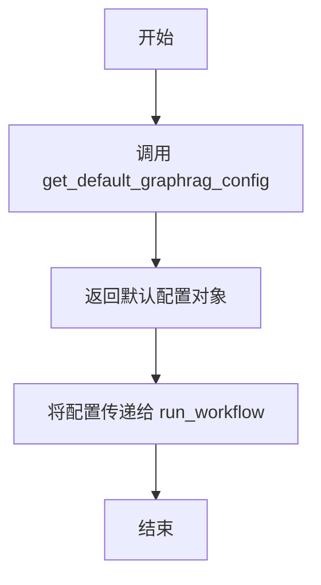
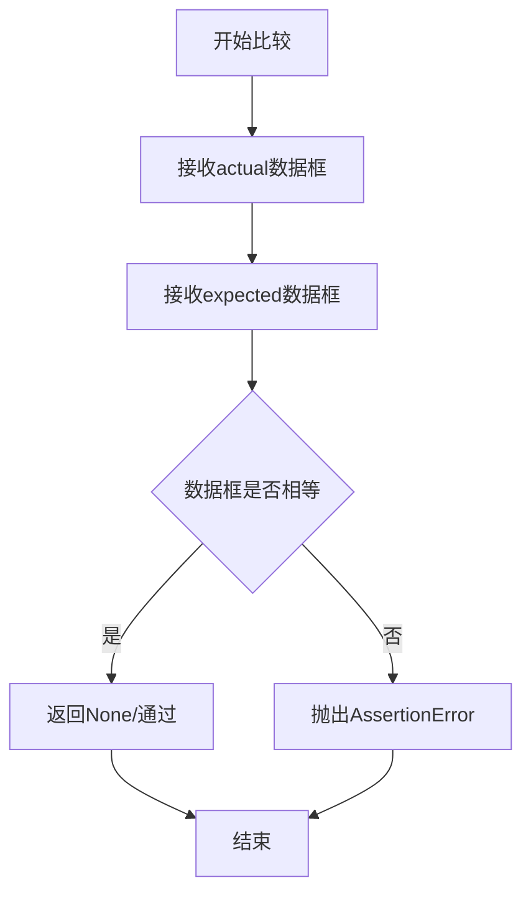
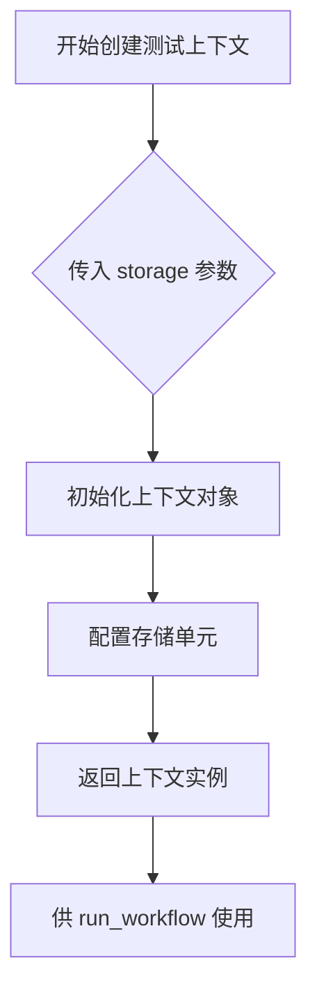
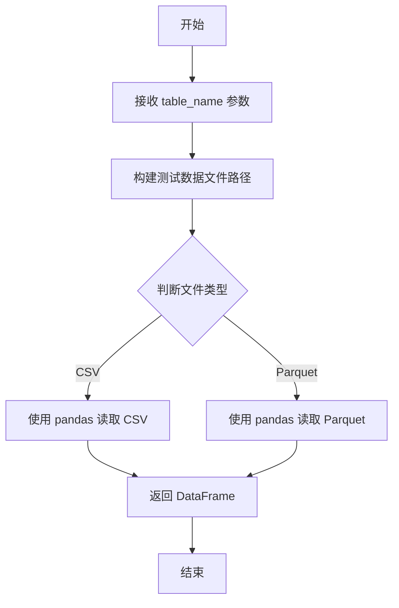

# `graphrag\tests\verbs\test_create_final_documents.py` 详细设计文档

这是一个异步单元测试文件，用于测试 graphrag 索引工作流中的 create_final_documents 功能，验证文档创建流程是否正确生成最终文档表，并确保输出包含所有必需的列。

## 整体流程



## 类结构

```
测试模块 (无类定义)
└── test_create_final_documents (异步测试函数)
```

## 全局变量及字段


### `DOCUMENTS_FINAL_COLUMNS`
    
从 graphrag.data_model.schemas 导入，定义文档表必需列的元组

类型：`tuple`
    


    

## 全局函数及方法


### `test_create_final_documents`

这是一个异步测试函数，用于验证 `create_final_documents` 工作流能否正确生成最终的文档表格，并确保输出包含所有必需的列。

参数：无

返回值：`None`，测试函数无返回值，通过断言验证正确性

#### 流程图



#### 带注释源码

```python
# 异步测试函数：test_create_final_documents
# 用于验证文档创建工作流的正确性
async def test_create_final_documents():
    # 步骤1: 从测试数据文件加载期望的文档表格
    # 类型: DataFrame
    # 说明: 作为基准数据用于比对实际输出
    expected = load_test_table("documents")

    # 步骤2: 创建测试上下文环境
    # 类型: AsyncContext
    # 参数: storage 指定存储类型为 ["text_units"]
    # 说明: 模拟图索引的运行时环境
    context = await create_test_context(
        storage=["text_units"],
    )

    # 步骤3: 获取默认的 graphrag 配置
    # 类型: GraphRagConfig
    # 说明: 包含文档处理的所有默认配置参数
    config = get_default_graphrag_config()

    # 步骤4: 执行文档创建工作流
    # 参数: config 配置文件, context 运行时上下文
    # 返回: None (异步操作)
    # 说明: 核心业务逻辑，生成文档表格
    await run_workflow(config, context)

    # 步骤5: 从输出提供者读取实际生成的文档表格
    # 类型: DataFrame
    # 说明: 读取工作流生成的 "documents" 表
    actual = await context.output_table_provider.read_dataframe("documents")

    # 步骤6: 比较实际输出与期望输出
    # 参数: actual 实际数据, expected 期望数据
    # 说明: 验证数据内容是否一致
    compare_outputs(actual, expected)

    # 步骤7: 验证输出表格包含所有必需的列
    # 类型: list
    # 说明: DOCUMENTS_FINAL_COLUMNS 定义了文档表的必需列结构
    for column in DOCUMENTS_FINAL_COLUMNS:
        assert column in actual.columns
```


# 详细设计文档

## 1. 一段话描述

`run_workflow` 是一个异步工作流函数，负责从图索引上下文中读取文本单元数据，处理并生成最终的文档表（documents），同时验证输出列是否符合预定义的 `DOCUMENTS_FINAL_COLUMNS` 模式。

## 2. 文件的整体运行流程

该代码是一个测试文件，用于验证 `create_final_documents` 工作流的正确性。运行流程如下：

1. 加载预期输出表（documents）作为基准数据
2. 创建包含文本单元（text_units）的测试上下文
3. 获取默认的 GraphRAG 配置
4. 调用 `run_workflow` 异步执行文档生成工作流
5. 从输出表提供者读取实际生成的 documents 表
6. 比对实际输出与预期输出是否一致
7. 验证 documents 表包含所有必需的列

## 3. 类的详细信息

### 3.1 测试类信息

由于提供的代码是测试函数而非完整类定义，以下是相关模块和函数的详细信息：

| 名称 | 类型 | 描述 |
|------|------|------|
| `run_workflow` | 全局函数 | 异步工作流函数，负责生成最终文档表 |
| `DOCUMENTS_FINAL_COLUMNS` | 全局常量 | 预定义的文档最终列模式列表 |
| `get_default_graphrag_config` | 全局函数 | 获取默认的 GraphRAG 配置对象 |
| `create_test_context` | 全局函数 | 创建包含指定存储的测试上下文 |
| `load_test_table` | 全局函数 | 加载测试用的表格数据 |
| `compare_outputs` | 全局函数 | 比对实际输出与预期输出 |

## 4. 函数详细信息

### `run_workflow`

异步工作流函数，执行文档生成的核心逻辑。

参数：

- `config`：`GraphRagConfig` 类型，GraphRAG 系统的配置对象，包含索引相关的各种配置参数
- `context`：`IndexContext` 类型，图索引操作的上下文对象，提供输入数据访问和输出存储能力

返回值：`None`（根据测试代码推断，该函数直接操作上下文中的输出表，无显式返回值）

#### 流程图



#### 带注释源码

```python
# 导入文档最终列模式定义
from graphrag.data_model.schemas import DOCUMENTS_FINAL_COLUMNS
# 从工作流模块导入待分析的run_workflow函数
from graphrag.index.workflows.create_final_documents import (
    run_workflow,
)

# 导入测试配置和工具函数
from tests.unit.config.utils import get_default_graphrag_config
from .util import (
    compare_outputs,          # 比对输出结果
    create_test_context,      # 创建测试上下文
    load_test_table,          # 加载测试表格
)

# 异步测试函数：验证create_final_documents工作流
async def test_create_final_documents():
    # 第一步：加载预期的documents表作为基准
    expected = load_test_table("documents")

    # 第二步：创建测试上下文，包含text_units存储
    # 这里的text_units是工作流的输入数据源
    context = await create_test_context(
        storage=["text_units"],
    )

    # 第三步：获取默认的GraphRAG配置
    config = get_default_graphrag_config()

    # 第四步：执行工作流，生成documents表
    # run_workflow会处理text_units并输出documents
    await run_workflow(config, context)

    # 第五步：从上下文的输出表提供者读取实际生成的documents
    actual = await context.output_table_provider.read_dataframe("documents")

    # 第六步：比对实际输出与预期输出
    compare_outputs(actual, expected)

    # 第七步：验证所有必需的列都存在于输出表中
    for column in DOCUMENTS_FINAL_COLUMNS:
        assert column in actual.columns
```

## 5. 关键组件信息

| 组件名称 | 一句话描述 |
|----------|------------|
| `DOCUMENTS_FINAL_COLUMNS` | 定义最终文档表应包含的所有列名常量 |
| `GraphRagConfig` | 包含 GraphRAG 索引流程的所有配置参数 |
| `IndexContext` | 提供数据读写能力的索引执行上下文 |
| `output_table_provider` | 负责读取和写入输出数据表的提供者 |

## 6. 潜在的技术债务或优化空间

1. **缺少错误处理**：测试代码中没有对 `run_workflow` 可能的异常情况进行测试
2. **测试数据依赖**：依赖 `load_test_table("documents")` 预先准备好的数据，测试独立性较弱
3. **配置透明度**：从测试代码无法直观看出 `run_workflow` 具体使用了哪些配置项
4. **验证不完整**：仅验证列存在性，未验证列的数据类型和数据质量

## 7. 其它项目

### 设计目标与约束

- **目标**：验证 `run_workflow` 能够正确地将 text_units 转换为 documents 表
- **约束**：输出必须包含 `DOCUMENTS_FINAL_COLUMNS` 中定义的所有列

### 错误处理与异常设计

- 测试中使用 `assert` 验证列的存在性，如果列缺失会抛出 `AssertionError`
- `compare_outputs` 函数应该会处理数据比对中的差异

### 数据流与状态机

```
text_units (输入) --> run_workflow (处理) --> documents (输出)
                              |
                              v
                    DOCUMENTS_FINAL_COLUMNS (验证)
```

### 外部依赖与接口契约

- **输入依赖**：
  - `config`: GraphRagConfig 实例
  - `context`: 包含 text_units 数据的 IndexContext
- **输出依赖**：
  - context.output_table_provider 中的 "documents" 表
- **接口契约**：
  - 函数为异步函数（async）
  - 直接修改 context 中的输出表，无返回值


# 函数文档提取结果

### `get_default_graphrag_config`

该函数用于获取 GraphRAG 的默认配置对象，为工作流运行提供必要的配置参数。

参数：

- 该函数无显式参数

返回值：`config`，类型推断为配置字典或配置对象，用于传递给 `run_workflow` 函数

#### 流程图



#### 带注释源码

```
# 该函数定义在 tests.unit.config.utils 模块中
# 从导入语句可见：
from tests.unit.config.utils import get_default_graphrag_config

# 函数调用方式：
config = get_default_graphrag_config()

# 使用场景：
# 在异步测试函数 test_create_final_documents 中
# 该配置对象被传递给 run_workflow 函数用于创建最终文档
await run_workflow(config, context)
```

---

## 重要说明

⚠️ **信息不完整**：用户提供的代码片段**未包含** `get_default_graphrag_config` 函数的实际实现代码。该函数是从 `tests.unit.config.utils` 模块导入的，但该模块的源代码并未在提供的代码片段中展示。

### 基于调用上下文的推断

1. **函数位置**：`tests.unit.config.utils` 模块
2. **返回值用途**：作为配置参数传递给 `run_workflow` 函数
3. **返回值类型**：推断为字典类型（可能为 `dict` 或自定义配置类）

### 建议

如需获取完整的函数文档（包括函数体、参数、详细流程图），请提供 `tests.unit.config.utils` 模块中 `get_default_graphrag_config` 函数的实际实现代码。


# 详细设计文档

## 1. 代码概述

该代码是一个测试文件，用于测试 `create_final_documents` 工作流，验证其生成的文档数据框（DataFrame）是否符合预期的模式和数据。

---

## 2. 文件整体运行流程

1. 加载预期的测试数据表（documents）
2. 创建测试上下文，包含文本单元存储
3. 获取默认的 GraphRAG 配置
4. 执行 `run_workflow` 工作流
5. 从输出表提供者读取实际生成的 documents 表
6. 使用 `compare_outputs` 比较实际输出与预期输出
7. 验证所有必需的列都存在于输出中

---

## 3. 详细信息

### `compare_outputs` 函数

#### 描述

该函数用于比较两个数据框（DataFrame）的输出是否一致，通常用于测试框架中验证实际结果与预期结果是否匹配。

#### 参数

- `actual`：`pandas.DataFrame`，实际生成的数据框（从工作流输出获取）
- `expected`：`pandas.DataFrame`，预期应生成的数据框（从测试表加载）

#### 返回值

- `None`，该函数通常为断言函数，通过抛出异常来表示比较失败

#### 流程图



#### 带注释源码

```python
# 源码未在提供的内容中，以下为基于使用方式的推断

def compare_outputs(actual, expected):
    """
    比较实际输出与预期输出是否一致
    
    参数:
        actual: 实际生成的数据框
        expected: 预期应该生成的数据框
    
    返回:
        None
    
    异常:
        AssertionError: 当两者不相等时抛出
    """
    # 1. 检查列名是否一致
    assert list(actual.columns) == list(expected.columns), \
        f"列名不匹配: {list(actual.columns)} vs {list(expected.columns)}"
    
    # 2. 检查行数是否一致
    assert len(actual) == len(expected), \
        f"行数不匹配: {len(actual)} vs {len(expected)}"
    
    # 3. 检查数据是否一致（可能按某列排序后比较）
    # pd.testing.assert_frame_equal(actual, expected)
```

> **注意**：由于 `compare_outputs` 函数的实际源码位于 `.util` 模块中，而该模块的代码未在提供的代码片段中显示，因此以上源码为基于函数调用方式的合理推断。实际的函数实现可能包含更多细节，如数值容差比较、排序选项等。

---

## 4. 关键组件信息

| 组件名称 | 描述 |
|---------|------|
| `test_create_final_documents` | 主测试函数，验证文档工作流的正确性 |
| `run_workflow` | 执行文档创建工作流的核心函数 |
| `context.output_table_provider.read_dataframe` | 从存储中读取生成的数据框 |
| `DOCUMENTS_FINAL_COLUMNS` | 定义文档最终输出的必需列集合 |

---

## 5. 潜在的技术债务或优化空间

1. **缺少错误信息详细性**：当 `compare_outputs` 失败时，可能需要更详细的差异报告
2. **测试数据硬编码**：测试数据依赖于外部加载，可能缺乏版本控制
3. **异步测试复杂度**：使用 `async/await` 增加了测试复杂度，需确保正确的测试运行器

---

## 6. 其它项目

### 设计目标与约束
- 确保生成的 documents 表包含所有 `DOCUMENTS_FINAL_COLUMNS` 中定义的列
- 验证工作流输出的数据与预期测试数据一致

### 错误处理与异常设计
- `compare_outputs` 在比较失败时抛出 `AssertionError`
- 显式断言列存在性

### 数据流与状态机
- 测试流程：加载预期 → 执行工作流 → 读取实际 → 比较差异 → 验证列

### 外部依赖与接口契约
- 依赖 `graphrag.index.workflows.create_final_documents.run_workflow`
- 依赖 `graphrag.data_model.schemas.DOCUMENTS_FINAL_COLUMNS`
- 依赖测试工具函数 `create_test_context`, `load_test_table`, `compare_outputs`


# 分析结果

根据提供的代码，我只能看到 `create_test_context` 函数的**调用方式**，而非其**完整实现**。该函数是 从 `.util` 模块导入的（`tests/unit/config/utils.py`），但该源文件未在当前代码片段中提供。

---

### `create_test_context`

测试上下文的创建函数，用于构建测试所需的运行时环境。

#### 参数

- `storage`：`List[str]`，指定要加载的存储类型列表（如 `["text_units"]`）

#### 返回值

- `context`：`TestContext`（或类似上下文对象），包含输出表提供者、存储管理等能力，供后续工作流使用

#### 流程图



> ⚠️ **注意**：由于未提供 `create_test_context` 的实际源代码，上述流程图是基于调用模式的**推测**，实际实现可能有所不同。

#### 带注释源码

```python
# 源码未在当前代码片段中提供
# 该函数定义于 tests/unit/config/utils.py 或类似路径
# 基于调用推断的伪代码结构：

async def create_test_context(
    storage: Optional[List[str]] = None,
    # ... 其他可能的参数
) -> TestContext:
    """
    创建测试上下文
    
    Args:
        storage: 要加载的存储单元列表
        
    Returns:
        包含表提供者和存储管理的测试上下文对象
    """
    # ... 函数实现未提供
```

---

## 补充说明

要获取完整的 `create_test_context` 函数详细信息（包括精确的参数列表、完整源码和准确流程图），需要提供以下任一内容：

1. `tests/unit/config/utils.py` 文件的完整源码
2. 或者确认该函数在其他模块中的实际位置

---

## 其他项目信息（基于上下文推断）

| 项目 | 描述 |
|------|------|
| **设计目标** | 为 GraphRAG 单元测试提供隔离的、可复现的运行时环境 |
| **约束** | 需支持异步调用（`async def`） |
| **错误处理** | 可能抛出配置错误或存储加载失败异常 |
| **外部依赖** | 依赖 `graphrag.index.workflows.create_final_documents` 模块 |


### `load_test_table`

该函数是测试工具模块中的数据加载辅助函数，用于根据指定的表名从测试数据目录中加载对应的预期结果表格数据（通常为 CSV 或 Parquet 格式），以便在单元测试中与实际输出进行对比验证。

参数：

- `table_name`：`str`，要加载的测试表名称（如 "documents"、"text_units" 等）

返回值：`pd.DataFrame` 或类似的表格数据结构，返回包含预期测试数据的表格对象，供测试对比使用

#### 流程图



#### 带注释源码

```python
# 从当前模块的父包中的 .util 模块导入
# load_test_table 函数用于加载测试用的参考数据表
from .util import (
    compare_outputs,
    create_test_context,
    load_test_table,
)

# 在测试函数中使用 load_test_table
async def test_create_final_documents():
    # 加载名为 "documents" 的预期测试数据表
    # 该数据包含预期的文档字段和数据，用于与实际工作流输出进行对比
    expected = load_test_table("documents")

    # 创建测试上下文环境，包含文本单元存储
    context = await create_test_context(
        storage=["text_units"],
    )

    # 获取默认的 GraphRAG 配置
    config = get_default_graphrag_config()

    # 执行创建最终文档的工作流
    await run_workflow(config, context)

    # 从上下文的输出表提供者读取实际的 documents 表数据
    actual = await context.output_table_provider.read_dataframe("documents")

    # 对比实际输出与预期数据是否一致
    compare_outputs(actual, expected)

    # 验证输出表包含所有必需的最终文档列
    for column in DOCUMENTS_FINAL_COLUMNS:
        assert column in actual.columns
```

## 关键组件


### 文档工作流测试组件

验证 create_final_documents 工作流正确生成最终文档表，测试加载期望数据、创建上下文、执行工作流、读取输出并比较结果的完整流程。

### run_workflow 全局函数

执行文档创建工作流的核心函数，接收配置和上下文作为参数，将文本单元数据转换为最终文档格式并输出到指定表。

### context 测试上下文

异步测试上下文容器，提供输出表提供者和存储访问能力，用于在测试中模拟真实运行环境并获取工作流输出结果。

### DOCUMENTS_FINAL_COLUMNS 全局变量

定义最终文档表应包含的列名集合，用于验证输出表格的结构完整性，确保所有必要字段都被正确生成。

### compare_outputs 工具函数

比较实际输出与期望输出是否一致，验证工作流生成的文档数据符合预期的模式和内容。

### load_test_table 工具函数

从测试数据目录加载预期的表格数据，用于作为测试中的基准参考数据进行输出比对。

### get_default_graphrag_config 全局函数

获取默认的 graphrag 配置对象，为工作流提供必要的运行时参数和设置。

### 异步测试框架

使用 async/await 模式实现异步测试，支持在测试环境中运行图谱索引工作流并验证其输出结果。


## 问题及建议


### 已知问题

-   **缺少异常处理**：`run_workflow` 和 `context.output_table_provider.read_dataframe` 调用缺少 try-except 包裹，测试失败时难以定位根因
-   **异步操作无超时控制**：异步测试没有设置超时限制，可能导致测试永久挂起
-   **硬编码的存储依赖**：创建 context 时硬编码 `storage=["text_units"]`，如果上游数据源变化测试会失败，缺乏灵活性
-   **断言粒度不足**：仅检查列名是否存在，未验证数据类型、数据完整性或空值情况
-   **测试数据紧耦合**：`load_test_table("documents")` 依赖外部测试数据文件，数据格式变化会导致测试无声失败
-   **配置验证缺失**：直接使用 `get_default_graphrag_config()` 返回的配置，未校验配置有效性

### 优化建议

-   为异步操作添加 `pytest.mark.asyncio(timeout=30)` 超时控制，防止测试挂起
-   在关键调用处添加异常捕获和详细的断言信息，例如 `assert actual is not None, "工作流输出为空"`
-   将 `storage=["text_units"]` 参数化为 fixture 或环境变量，提高测试可配置性
-   增加数据类型和业务规则校验，例如 `assert actual["id"].dtype == object` 和 `assert not actual["id"].isna().any()`
-   考虑使用 `pytest.param` 或 `@pytest.mark.parametrize` 分离测试数据来源，提高测试可维护性
-   在测试开始前添加配置校验逻辑，例如 `assert config.embedding_dim is not None`

## 其它


### 设计目标与约束

本测试文件的核心设计目标是验证 `create_final_documents` 工作流能够正确生成符合预期的文档输出表。测试需要确保输出数据与预期数据一致，且包含所有必需的列。约束条件包括：必须使用异步测试框架、依赖特定的测试配置和测试数据、必须在存在 `text_units` 存储的情况下运行。

### 错误处理与异常设计

测试过程中的错误处理主要通过以下方式实现：使用 pytest 的断言机制验证数据一致性，当列名不匹配或数据不一致时抛出 AssertionError。异步操作通过 await 关键字等待结果，若工作流执行失败会向上传播异常。测试数据加载失败会抛出 FileNotFoundError 或数据解析异常。测试框架本身会捕获并报告任何未处理的异常。

### 数据流与状态机

测试数据流如下：首先加载预期数据（load_test_table） → 创建测试上下文（create_test_context） → 获取配置（get_default_graphrag_config） → 执行工作流（run_workflow） → 读取实际输出（read_dataframe） → 比较输出与预期（compare_outputs） → 验证列名（assert column in actual.columns）。状态机涉及：初始化状态 → 执行状态 → 验证状态 → 完成状态。

### 外部依赖与接口契约

主要外部依赖包括：graphrag.data_model.schemas 中的 DOCUMENTS_FINAL_COLUMNS 常量定义了文档输出的列名规范；graphrag.index.workflows.create_final_documents 中的 run_workflow 函数是核心执行接口；tests.unit.config.utils 中的 get_default_graphrag_config 提供测试配置；.util 模块中的 compare_outputs、create_test_context、load_test_table 提供测试工具函数。接口契约要求：run_workflow 接受 config 和 context 两个参数并返回异步操作；output_table_provider.read_dataframe 返回 DataFrame 对象；DOCUMENTS_FINAL_COLUMNS 是列名列表。

### 性能考虑

由于测试需要执行完整的工作流，可能存在性能开销。测试数据量应保持在合理范围内以确保快速执行。异步测试框架的使用有利于并发测试场景。测试隔离性良好，每个测试独立运行不共享状态。

### 安全考虑

测试代码不涉及敏感数据处理，主要验证数据处理逻辑。测试环境使用模拟的配置和数据，不连接真实的生产系统。文件路径操作使用相对路径和测试目录，安全性可控。

### 测试覆盖范围

当前测试覆盖了以下场景：输出表的基本结构和列名验证、输出数据与预期数据的一致性验证、工作流的基本执行流程。潜在覆盖缺口包括：边界情况（如空输入、极端数据量）、并发执行场景、错误恢复能力等。

    