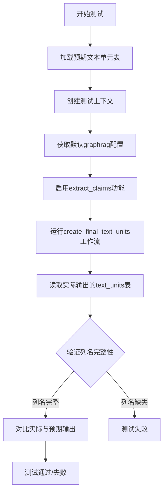
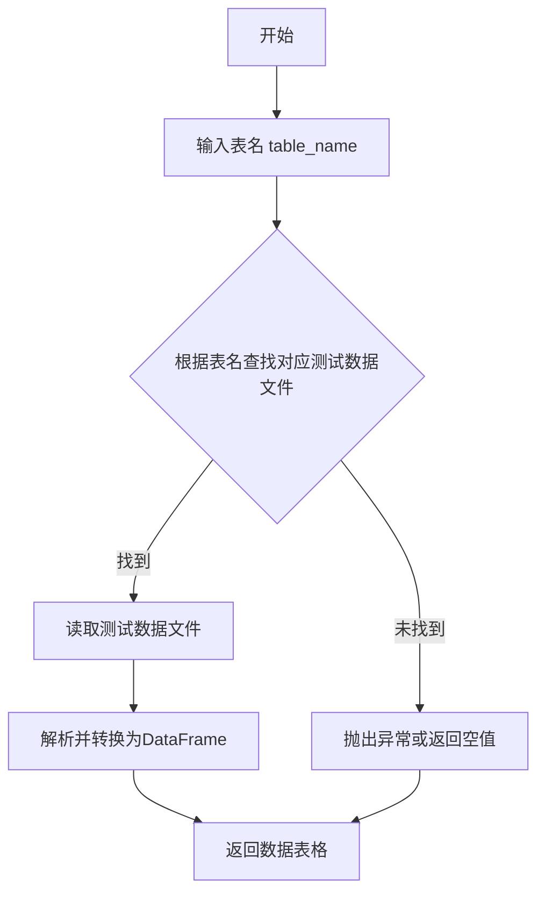
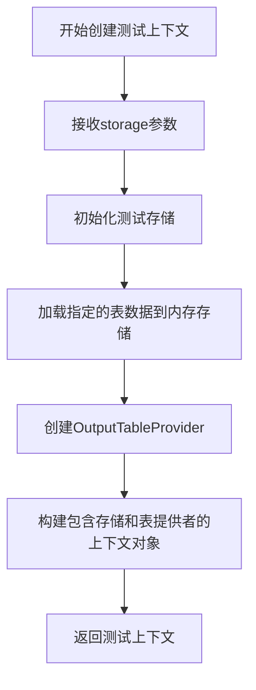
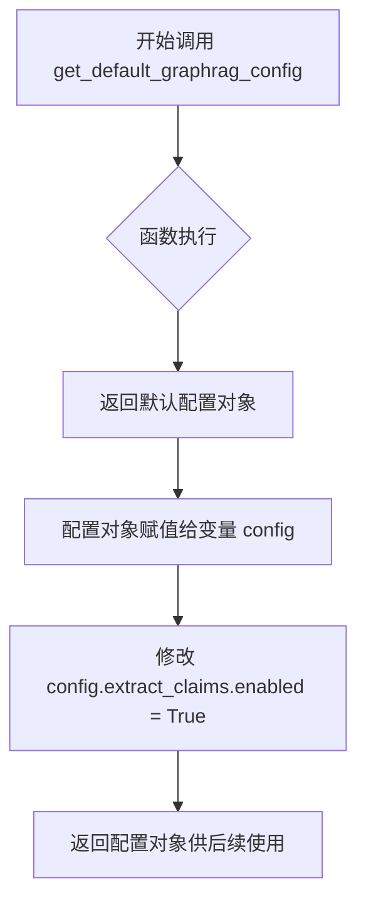
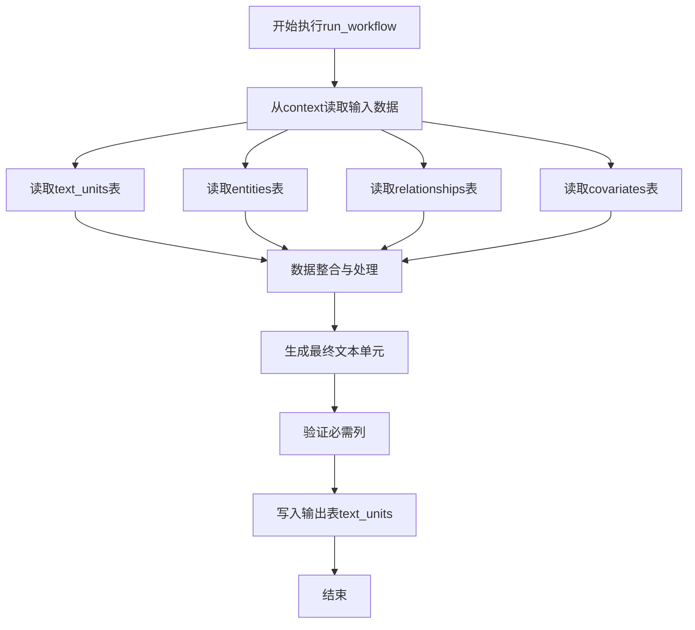
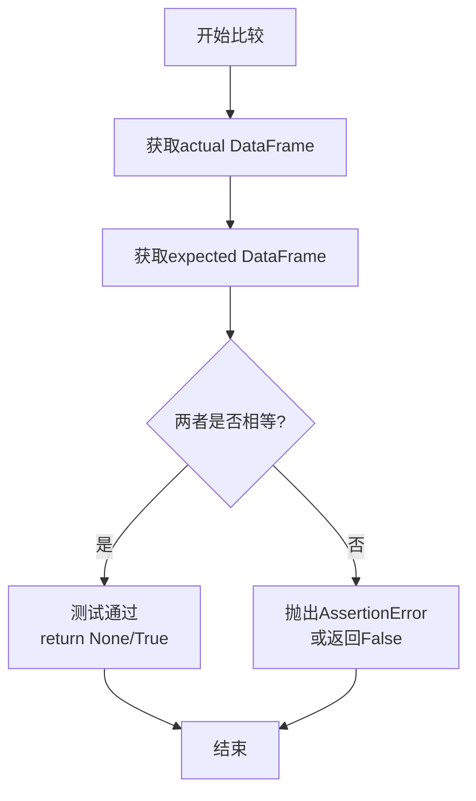
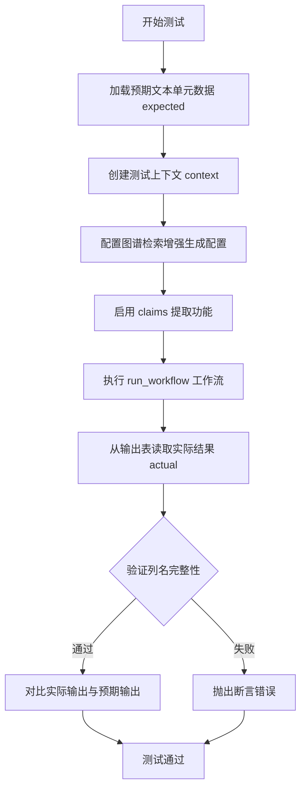
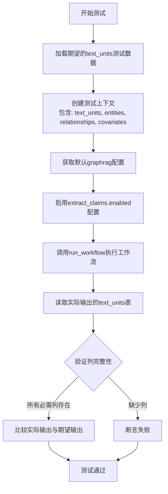

# `graphrag\tests\verbs\test_create_final_text_units.py` 详细设计文档

这是一个异步单元测试文件，用于测试graphrag项目中create_final_text_units工作流的正确性，验证文本单元创建流程能够正确生成包含所有必需列的输出表，并与预期结果进行对比。

## 整体流程



## 类结构

```
测试模块
└── test_create_final_text_units (异步测试函数)
```

## 全局变量及字段


### `expected`
    
从测试数据文件加载的期望输出数据，用于与工作流实际生成的结果进行对比验证

类型：`pandas.DataFrame`
    


### `context`
    
测试运行时上下文对象，提供存储配置和输出表读取能力，用于执行和验证工作流结果

类型：`TestContext`
    


### `config`
    
GraphRag配置对象，通过启用extract_claims来控制数据提取流程中的实体关系抽取功能

类型：`GraphRagConfig`
    


### `actual`
    
工作流实际执行后输出的文本单元数据表，包含从原始文档中提取的文本块及其关联元数据

类型：`pandas.DataFrame`
    


### `column`
    
循环迭代变量，用于遍历TEXT_UNITS_FINAL_COLUMNS中的标准列名，验证实际输出是否包含所有必需字段

类型：`str`
    


    

## 全局函数及方法


### `load_test_table`

从测试代码的使用方式来看，`load_test_table` 是一个用于加载测试数据表格的辅助函数，主要功能是根据传入的表名参数加载对应的预期测试数据，以便与实际运行结果进行对比验证。

参数：

-  `table_name`：`str`，要加载的测试表名称（如 "text_units"）

返回值：`pd.DataFrame` 或类似数据结构，返回指定名称的测试表格数据，用于测试中的预期结果对比

#### 流程图



#### 带注释源码

```
# 从当前包的 util 模块导入 load_test_table 函数
from .util import (
    compare_outputs,
    create_test_context,
    load_test_table,
)

# 在测试函数中使用 load_test_table
# 加载名为 "text_units" 的预期测试数据
expected = load_test_table("text_units")

# ... 后续代码运行工作流并比较实际输出与预期输出 ...
```

> **注意**：由于提供的代码片段仅包含 `load_test_table` 函数的导入和使用部分，未包含该函数的具体实现代码，因此无法提供完整的带注释源码。以上信息是基于函数调用方式的合理推断。如需获取完整的函数实现，建议查看 `tests/unit/config/utils.py` 或 `tests/util.py` 文件中的函数定义。


### `create_test_context`

该函数是一个测试工具函数，用于创建测试所需的上下文环境，模拟存储中的数据以便进行工作流测试。

参数：

- `storage`：`List[str]`，需要加载到测试上下文中的存储表名称列表（如 "text_units"、"entities"、"relationships"、"covariates"）

返回值：`Any`，测试上下文对象，包含输出表提供者等，用于支持工作流执行和结果验证

#### 流程图



#### 带注释源码

```python
# 由于 create_test_context 函数定义在 tests/unit/config/utils 模块中，
# 以下是根据其使用方式推断的典型实现模式

from typing import List, Any
import pandas as pd

class TestContext:
    """测试上下文类，用于存储模拟的数据和表提供者"""
    
    def __init__(self, storage: List[str]):
        self.storage = storage  # 存储表名列表
        self.data = {}  # 存储模拟数据
        self.output_table_provider = None  # 输出表提供者
    
    async def __aenter__(self):
        """异步上下文管理器入口"""
        return self
    
    async def __aexit__(self, exc_type, exc_val, exc_tb):
        """异步上下文管理器退出"""
        pass


async def create_test_context(storage: List[str]) -> TestContext:
    """
    创建测试上下文环境
    
    参数:
        storage: 需要加载的存储表名称列表
        
    返回:
        包含模拟数据和表提供者的测试上下文对象
    """
    # 创建上下文对象
    context = TestContext(storage=storage)
    
    # 初始化模拟数据存储
    for table_name in storage:
        # 从测试数据文件加载表数据
        context.data[table_name] = load_test_table(table_name)
    
    # 创建输出表提供者，用于工作流输出结果
    context.output_table_provider = InMemoryTableProvider(context.data)
    
    return context
```

> **注意**：由于原始代码仅展示了 `create_test_context` 的使用方式而未提供其完整定义，以上源码为基于典型测试工具函数模式的合理推断。实际实现可能略有差异。


### `get_default_graphrag_config`

获取默认的 GraphRAG 配置对象，用于初始化测试或运行工作流所需的配置参数。

参数：此函数无参数。

返回值：`Any`（配置对象），返回一个包含 GraphRAG 各项配置的命名空间对象，其中包含 `extract_claims.enabled` 等配置属性，可通过该对象修改配置以满足测试或运行需求。

#### 流程图



#### 带注释源码

```python
# 从测试配置工具模块导入获取默认 GraphRAG 配置的函数
from tests.unit.config.utils import get_default_graphrag_config

# ... 其他导入 ...

async def test_create_final_text_units():
    """测试创建最终文本单元的工作流"""
    
    # 加载预期的测试表数据
    expected = load_test_table("text_units")

    # 创建测试上下文，包含指定的存储表
    context = await create_test_context(
        storage=[
            "text_units",
            "entities",
            "relationships",
            "covariates",
        ],
    )

    # 获取默认的 GraphRAG 配置对象
    # 该函数返回一个包含默认配置的命名空间对象
    config = get_default_graphrag_config()
    
    # 启用提取声明(claims)功能
    # 通过修改配置对象的 extract_claims.enabled 属性
    config.extract_claims.enabled = True

    # 使用配置和上下文运行工作流
    await run_workflow(config, context)

    # 从输出表提供者读取实际的文本单元数据
    actual = await context.output_table_provider.read_dataframe("text_units")

    # 验证所有必需的列都存在于输出表中
    for column in TEXT_UNITS_FINAL_COLUMNS:
        assert column in actual.columns

    # 比较实际输出与预期输出
    compare_outputs(actual, expected)
```


### `run_workflow`

该函数是GraphRAG索引工作流中用于创建最终文本单元（text units）的核心异步函数。它从输入的文本单元、实体、关系和协变量数据中提取信息，整合并生成标准化的最终文本单元表，同时确保输出包含所有必需的列。

参数：

- `config`：GraphRagConfig类型，GraphRAG的全局配置对象，包含各种工作流参数（本例中启用了extract_claims.enabled）
- `context`：IndexingContext类型，索引上下文对象，提供输入数据存储读取和输出数据写入的能力

返回值：`None`（异步函数无显式返回值），通过context的output_table_provider将结果写入"text_units"表

#### 流程图



#### 带注释源码

```python
# 由于实际源码未提供，以下为基于测试代码和导入路径推断的函数签名
async def run_workflow(config: GraphRagConfig, context: IndexingContext) -> None:
    """
    执行创建最终文本单元的工作流
    
    参数:
        config: GraphRAG配置对象，包含各种工作流配置参数
        context: 索引上下文，提供数据存储访问能力
    
    返回:
        无返回值，结果通过context写入输出表
    """
    
    # 1. 从输入存储中读取原始数据
    # - text_units: 原始文本单元
    # - entities: 提取的实体
    # - relationships: 实体间关系
    # - covariates: 协变量/ Claims信息
    
    # 2. 根据config配置（如extract_claims.enabled）决定是否包含协变量
    
    # 3. 整合数据并生成标准化的text_units表
    
    # 4. 验证输出包含TEXT_UNITS_FINAL_COLUMNS中的所有列
    
    # 5. 通过context.output_table_provider将结果写入"text_units"表
```


# 分析结果

根据提供的代码，`compare_outputs` 函数是从 `.util` 模块导入的，但该模块的实现代码并未在给定的代码片段中提供。我将基于代码上下文来推断该函数的信息。

### `compare_outputs`

该函数是一个测试工具函数，用于比较实际输出（DataFrame）与预期输出（DataFrame）是否一致，通常用于自动化测试中断言数据处理结果的正确性。

参数：

-  `actual`：`DataFrame`，实际输出的数据表，由 `context.output_table_provider.read_dataframe("text_units")` 生成
-  `expected`：`DataFrame`，期望的基准数据，由 `load_test_table("text_units")` 加载

返回值：`None` 或 `bool`，通常在测试框架中通过断言比较，若不一致则抛出异常

#### 流程图



#### 带注释源码

```python
# 注意：此为基于上下文的推断实现，实际实现可能在 .util 模块中
def compare_outputs(actual, expected):
    """
    比较实际输出与预期输出是否一致
    
    参数:
        actual: DataFrame - 实际输出的数据表
        expected: DataFrame - 期望的基准数据表
    
    返回:
        None 或 bool - 测试通过返回None或True，不一致则抛出异常
    """
    # 验证列名一致性
    assert list(actual.columns) == list(expected.columns), \
        f"列名不匹配: {list(actual.columns)} vs {list(expected.columns)}"
    
    # 验证行数一致性
    assert len(actual) == len(expected), \
        f"行数不匹配: {len(actual)} vs {len(expected)}"
    
    # 逐列比较数据值
    for col in expected.columns:
        # 比较每列的数据，处理可能的数据类型差异
        if not actual[col].equals(expected[col]):
            # 如果精确比较失败，尝试宽松比较（如数值容差）
            raise AssertionError(
                f"列 '{col}' 数据不一致\n"
                f"实际值: {actual[col].tolist()}\n"
                f"期望值: {expected[col].tolist()}"
            )
    
    # 所有检查通过
    return None
```

---

### 补充说明

由于 `compare_outputs` 函数的实际源码未在给定代码中提供，以上为基于测试上下文的合理推断。该函数应当由 `graphrag` 项目的测试工具模块 `.util` 提供，建议查看 `tests/unit/config/utils.py` 或 `tests/util.py` 文件获取完整实现。


### `test_create_final_text_units`

这是一个异步测试函数，用于验证文本单元（text units）创建工作流的正确性，通过对比实际输出与预期测试数据来确保工作流生成的文本单元符合预期的列结构和数据内容。

参数：

- 该函数无参数

返回值：`None`，测试函数执行完成后不返回任何值

#### 流程图



#### 带注释源码

```python
# 导入必要的模块和函数
from graphrag.data_model.schemas import TEXT_UNITS_FINAL_COLUMNS  # 文本单元最终列定义
from graphrag.index.workflows.create_final_text_units import (
    run_workflow,  # 创建最终文本单元的工作流函数
)

from tests.unit.config.utils import get_default_graphrag_config  # 获取默认配置

from .util import (
    compare_outputs,  # 比较输出结果的工具函数
    create_test_context,  # 创建测试上下文的工具函数
    load_test_table,  # 加载测试表的工具函数
)


# 异步测试函数：测试创建最终文本单元的完整流程
async def test_create_final_text_units():
    # 步骤1: 从测试数据目录加载预期的文本单元数据
    expected = load_test_table("text_units")

    # 步骤2: 创建包含所需存储的测试上下文
    # 包含: text_units, entities, relationships, covariates 四种数据存储
    context = await create_test_context(
        storage=[
            "text_units",
            "entities",
            "relationships",
            "covariates",
        ],
    )

    # 步骤3: 获取默认的图谱检索增强生成配置
    config = get_default_graphrag_config()
    
    # 步骤4: 启用 claims（断言/声明）提取功能
    config.extract_claims.enabled = True

    # 步骤5: 执行工作流，生成文本单元数据
    await run_workflow(config, context)

    # 步骤6: 从输出表提供器读取实际生成的文本单元数据
    actual = await context.output_table_provider.read_dataframe("text_units")

    # 步骤7: 验证实际输出的列名是否包含所有必需的最终列
    for column in TEXT_UNITS_FINAL_COLUMNS:
        assert column in actual.columns

    # 步骤8: 对比实际输出与预期输出是否一致
    compare_outputs(actual, expected)
```


### `test_create_final_text_units`

这是一个异步测试函数，用于验证 `create_final_text_units` 工作流能否正确生成包含所有必需列的文本单元数据表，并通过对比实际输出与期望输出来确保数据处理的正确性。

参数：无参数

返回值：`None`，该函数为测试函数，不返回任何值

#### 流程图



#### 带注释源码

```python
# 异步测试函数：验证create_final_text_units工作流的正确性
async def test_create_final_text_units():
    # 步骤1: 加载期望的测试数据表（text_units）
    # 这个表包含了测试用例预期的正确输出结果
    expected = load_test_table("text_units")

    # 步骤2: 创建测试上下文环境
    # 同时初始化多个存储：文本单元、实体、关系、协变量
    # 这些存储模拟了工作流执行所需的前置数据
    context = await create_test_context(
        storage=[
            "text_units",
            "entities",
            "relationships",
            "covariates",
        ],
    )

    # 步骤3: 获取默认的graphrag配置
    config = get_default_graphrag_config()

    # 步骤4: 启用claims提取功能
    # 这是一个重要的配置项，影响工作流的数据处理逻辑
    config.extract_claims.enabled = True

    # 步骤5: 执行create_final_text_units工作流
    # 根据配置和上下文数据生成最终的text_units表
    await run_workflow(config, context)

    # 步骤6: 从上下文读取实际输出的text_units表
    actual = await context.output_table_provider.read_dataframe("text_units")

    # 步骤7: 验证输出表的列完整性
    # 确保生成的text_units表包含所有必需的列
    for column in TEXT_UNITS_FINAL_COLUMNS:
        assert column in actual.columns

    # 步骤8: 对比实际输出与期望输出
    # 使用专门的比较函数验证数据的一致性
    compare_outputs(actual, expected)
```

## 关键组件


### TEXT_UNITS_FINAL_COLUMNS

从 graphrag.data_model.schemas 导入的列定义常量，用于验证生成的 text_units 表是否包含所有必需的列。

### run_workflow

工作流执行函数，接收配置和上下文作为参数，运行 create_final_text_units 工作流生成最终的 text_units 表。

### get_default_graphrag_config

获取默认的 graphrag 配置对象，用于初始化工作流配置。

### create_test_context

异步测试上下文创建函数，接收存储列表参数 ["text_units", "entities", "relationships", "covariates"]，创建包含这些表的测试环境。

### load_test_table

从测试数据目录加载预期的 text_units 表数据，用于与实际输出进行对比验证。

### compare_outputs

测试工具函数，比较实际输出表与预期表是否一致，验证工作流生成的文本单元是否符合预期格式。

### config.extract_claims.enabled

配置中的 claims 提取开关，设置为 True 以启用从文本中提取 claims/主张的功能。

### context.output_table_provider.read_dataframe

数据输出读取方法，用于从测试上下文中读取生成的 text_units DataFrame 进行验证。

### test_create_final_text_units

异步测试函数，验证 create_final_text_units 工作流能否正确生成包含所有必需列的 text_units 表。


## 问题及建议


### 已知问题

-   **硬编码配置**：在测试中直接修改 `config.extract_claims.enabled = True`，这种硬编码方式可能导致配置与生产环境混淆，且不便于测试不同配置场景
-   **缺少空值检查**：在读取 `actual` 数据后，没有检查数据框是否为空或为 None，可能导致后续比较操作失败
-   **断言信息不足**：`assert column in actual.columns` 这样的断言在失败时仅显示布尔值，缺少列名等上下文信息，不利于快速定位问题
-   **缺乏异常处理**：`run_workflow` 和 `compare_outputs` 调用没有 try-except 包装，测试失败时难以区分是业务逻辑错误还是测试本身的问题
-   **魔法字符串**：存储列表 `["text_units", "entities", "relationships", "covariates"]` 以硬编码字符串形式多次出现，容易产生拼写错误且不易维护

### 优化建议

-   **使用 fixture 管理配置**：通过 pytest fixture 或参数化方式管理配置，提高配置的可复用性和可读性
-   **增加前置条件验证**：在比较数据前添加数据框有效性检查，如 `assert not actual.empty` 和 `assert actual is not None`
-   **改进断言消息**：使用 `assert column in actual.columns, f"Missing column: {column}"` 提供更详细的错误信息
-   **提取常量或枚举**：将存储键名提取为常量或枚举类，避免重复字符串和潜在的拼写错误
-   **添加超时机制**：为异步工作流添加超时控制，防止测试因死循环或网络问题无限等待
-   **考虑测试隔离**：评估是否需要在测试后清理 context 资源，避免测试间的状态污染

## 其它


### 设计目标与约束

该测试文件旨在验证 GraphRAG 索引工作流中 `create_final_text_units` 的正确性，确保文本单元生成流程能够正确处理entities、relationships、covariates等关联数据，并输出符合 TEXT_UNITS_FINAL_COLUMNS 定义的最终表结构。约束条件包括：需要确保 GraphRAG 配置中启用了 claims 提取功能，测试上下文必须包含指定的四个存储表，且输出表必须包含所有预期的列。

### 错误处理与异常设计

测试过程中主要关注以下错误场景：配置无效导致的工作流执行失败、存储表缺失导致的数据读取错误、输出表结构不符合预期导致的列验证失败、以及实际输出与预期输出不匹配时的断言错误。测试使用 pytest 的 assert 语句进行显式验证，任何列缺失或数据不一致都会导致测试失败并提供明确的错误信息。

### 数据流与状态机

测试数据流如下：1) 加载预期表数据作为基准；2) 创建包含空存储的测试上下文；3) 配置 GraphRAG 参数；4) 执行 run_workflow 生成实际输出；5) 从输出提供者读取生成的 text_units 表；6) 验证列完整性；7) 比对实际与预期数据一致性。状态转换从初始上下文状态经过工作流执行转换为包含输出表的状态。

### 外部依赖与接口契约

主要外部依赖包括：graphrag.data_model.schemas 中的 TEXT_UNITS_FINAL_COLUMNS 定义输出列规范；graphrag.index.workflows.create_final_text_units 中的 run_workflow 函数作为被测工作流；tests.unit.config.utils 中的 get_default_graphrag_config 提供默认配置；测试工具模块 util 中的辅助函数。接口契约要求 run_workflow 接受 config 和 context 两个参数，返回异步操作，context.output_table_provider.read_dataframe 返回包含指定列的 DataFrame。

### 性能考虑

该测试为单元测试，主要关注功能正确性而非性能。实际工作流执行可能涉及大量数据处理，但在测试环境中使用模拟数据，规模可控。测试顺序执行，无并行化需求。关键性能关注点为工作流执行的异步特性和数据帧读写操作的效率。

### 安全考虑

测试代码本身不涉及敏感数据处理，使用测试数据和模拟环境。主要安全考量在于测试数据隔离确保测试间无状态污染，以及配置文件的安全传递（测试使用默认配置，不涉及真实凭证）。

### 测试策略

采用黑盒功能测试策略，通过验证输出结果是否符合预期来判断功能正确性。测试覆盖场景包括：基本工作流执行、列完整性验证、数据一致性比对。测试数据来源于预先构建的测试表，确保测试的可重复性和确定性。

### 配置管理

测试使用 get_default_graphrag_config() 获取默认配置，并通过 config.extract_claims.enabled = True 动态修改配置以满足测试需求。这种方式允许测试在受控的配置环境下运行，同时保持配置的灵活性和可测试性。TEXT_UNITS_FINAL_COLUMNS 作为常量定义，提供了列规范的集中管理。

### 并发与异步设计

测试函数声明为 async，采用 pytest-asyncio 框架支持异步测试执行。工作流 run_workflow 为异步函数，测试通过 await 调用并等待其完成。这种设计确保了 I/O 密集型操作（如文件读写、工作流执行）不会阻塞测试执行，提高了测试效率。

### 可维护性与扩展性

测试代码结构清晰，使用辅助函数 load_test_table、create_test_context、compare_outputs 封装重复逻辑。测试数据与测试逻辑分离，便于维护和扩展。当需要测试新的列或新的数据场景时，只需更新测试数据文件和验证逻辑，无需修改核心测试代码。

    