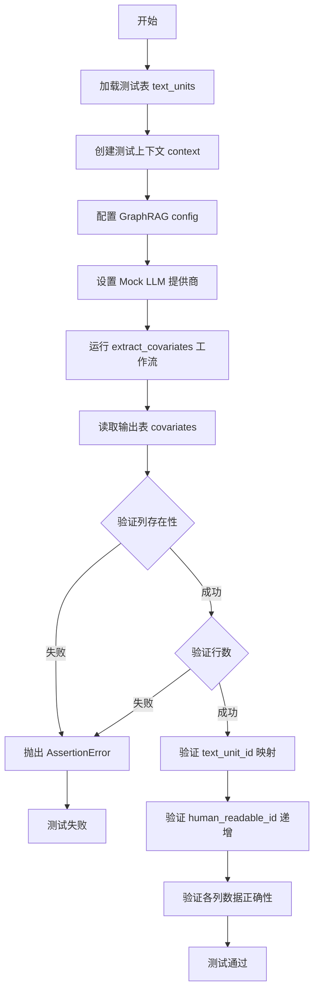

# `graphrag\tests\verbs\test_extract_covariates.py` 详细设计文档

这是一个异步单元测试文件，用于测试从文本单元中提取协变量（covariates）的功能。该测试使用模拟的LLM响应来验证协变量提取工作流的正确性，包括数据解析、列映射和输出验证。

## 整体流程



## 类结构

```
测试文件 (无类定义)
└── test_extract_covariates (异步测试函数)

被测模块 (imported from graphrag)
├── run_workflow (协变量提取工作流)
├── COVARIATES_FINAL_COLUMNS (输出列定义)
└── LLMProviderType (LLM提供商枚举)
```

## 全局变量及字段


### `MOCK_LLM_RESPONSES`
    
包含模拟LLM响应结果的字符串列表，用于测试协变量提取工作流，其中每个字符串包含用<|>分隔符分隔的模拟结构化数据

类型：`list[str]`
    


    

## 全局函数及方法


### `test_extract_covariates`

这是一个异步单元测试函数，用于验证从文本单元（text_units）中提取协变量（covariates）的工作流是否正确执行，并检查提取的数据是否按预期写入到输出表中。

参数：

- 无参数

返回值：`None`，该函数为异步测试函数，不返回任何值

#### 流程图

```mermaid
flowchart TD
    A[开始] --> B[加载测试表 text_units]
    B --> C[创建测试上下文 storage=['text_units']]
    C --> D[获取默认 GraphRAG 配置]
    D --> E[启用 extract_claims 并设置描述]
    E --> F[获取 LLM 配置并设置为 MockLLM]
    F --> G[设置 mock 响应数据]
    G --> H[await run_workflow 执行协变量提取工作流]
    H --> I[从输出表读取 covariates 数据]
    I --> J{验证结果}
    J --> K1[检查列名包含所有 COVARIATES_FINAL_COLUMNS]
    J --> K2[检查记录数与输入文本单元数相同]
    J --> K3[检查 text_unit_id 与输入 id 一致]
    J --> K4[检查 human_readable_id 从 0 开始递增]
    J --> K5[检查各字段解析的 Mock 数据正确]
    K1 --> L[结束]
    K2 --> L
    K3 --> L
    K4 --> L
    K5 --> L
```

#### 带注释源码

```python
# 导入协变量列定义常量
from graphrag.data_model.schemas import COVARIATES_FINAL_COLUMNS
# 导入协变量提取工作流运行函数
from graphrag.index.workflows.extract_covariates import (
    run_workflow,
)
# 导入 LLM 提供商类型枚举
from graphrag_llm.config import LLMProviderType
# 导入 pandas 测试工具
from pandas.testing import assert_series_equal

# 导入测试配置和工具函数
from tests.unit.config.utils import get_default_graphrag_config
from .util import (
    create_test_context,
    load_test_table,
)

# 定义 Mock LLM 响应数据，包含模拟提取的协变量信息
MOCK_LLM_RESPONSES = [
    """
(COMPANY A<|>GOVERNMENT AGENCY B<|>ANTI-COMPETITIVE PRACTICES<|>TRUE<|>2022-01-10T00:00:00<|>2022-01-10T00:00:00<|>Company A was found to engage in anti-competitive practices because it was fined for bid rigging in multiple public tenders published by Government Agency B according to an article published on 2022/01/10<|>According to an article published on 2022/01/10, Company A was fined for bid rigging while participating in multiple public tenders published by Government Agency B.)
    """.strip()
]


async def test_extract_covariates():
    """测试从文本单元中提取协变量的工作流"""
    
    # 步骤1: 加载测试用的文本单元数据
    input = load_test_table("text_units")

    # 步骤2: 创建测试上下文，指定存储中有 text_units 表
    context = await create_test_context(
        storage=["text_units"],
    )

    # 步骤3: 获取默认的 GraphRAG 配置
    config = get_default_graphrag_config()
    
    # 启用 claims 提取功能并设置描述
    config.extract_claims.enabled = True
    config.extract_claims.description = "description"
    
    # 获取 completion model 配置
    llm_settings = config.get_completion_model_config(
        config.extract_claims.completion_model_id
    )
    
    # 将 LLM 类型设置为 MockLLM，用于测试
    llm_settings.type = LLMProviderType.MockLLM
    
    # 设置 Mock 响应数据
    llm_settings.mock_responses = MOCK_LLM_RESPONSES  # type: ignore

    # 步骤4: 运行协变量提取工作流
    await run_workflow(config, context)

    # 步骤5: 从输出表读取提取的 covariates 数据
    actual = await context.output_table_provider.read_dataframe("covariates")

    # 验证1: 检查输出表包含所有必需的列
    for column in COVARIATES_FINAL_COLUMNS:
        assert column in actual.columns

    # 验证2: 由于每个文本单元只返回一个协变量，检查记录数与输入文本单元数相同
    assert len(actual) == len(input)

    # 验证3: 检查协变量表中的 text_unit_id 与输入表的 id 一致
    assert_series_equal(actual["text_unit_id"], input["id"], check_names=False)

    # 验证4: 检查 human_readable_id 从 0 开始递增
    assert actual["human_readable_id"][0] == 0
    assert actual["human_readable_id"][1] == 1

    # 验证5: 检查 Mock 数据被正确解析到各字段
    assert actual["covariate_type"][0] == "claim"
    assert actual["subject_id"][0] == "COMPANY A"
    assert actual["object_id"][0] == "GOVERNMENT AGENCY B"
    assert actual["type"][0] == "ANTI-COMPETITIVE PRACTICES"
    assert actual["status"][0] == "TRUE"
    assert actual["start_date"][0] == "2022-01-10T00:00:00"
    assert actual["end_date"][0] == "2022-01-10T00:00:00"
    
    # 验证描述字段
    assert (
        actual["description"][0]
        == "Company A was found to engage in anti-competitive practices because it was fined for bid rigging in multiple public tenders published by Government Agency B according to an article published on 2022/01/10"
    )
    
    # 验证源文本字段
    assert (
        actual["source_text"][0]
        == "According to an article published on 2022/01/10, Company A was fined for bid rigging while participating in multiple public tenders published by Government Agency B."
    )
```

## 关键组件


### 协变量提取工作流 (run_workflow)

从文本单元中提取claim/事实性信息，调用LLM解析并生成结构化的协变量数据，输出到"covariates"表

### 模拟LLM响应解析器 (MOCK_LLM_RESPONSES)

使用特殊分隔符格式`<|>`解析LLM输出，包含：subject_id、object_id、type、status、start_date、end_date、description、source_text等8个字段

### 协变量数据模式 (COVARIATES_FINAL_COLUMNS)

定义协变量表的最终列结构，包含：id、text_unit_id、human_readable_id、covariate_type、subject_id、object_id、type、status、start_date、end_date、description、source_text等字段

### 测试上下文创建器 (create_test_context)

创建测试用的执行上下文，包含存储适配器和表提供者，用于支撑工作流运行和结果读写

### 配置管理系统 (get_default_graphrag_config)

获取默认的graphrag配置，通过config.extract_claims启用claim提取功能，并配置completion model参数

### Mock LLM提供者 (LLMProviderType.MockLLM)

模拟LLM provider，预先注入MOCK_LLM_RESPONSES用于测试，避免真实API调用

### 输出验证模块

验证提取结果：检查列存在性、记录数量匹配、text_unit_id映射正确性、human_readable_id自增、字段值正确解析

### 测试数据加载器 (load_test_table)

从测试数据目录加载text_units表，作为协变量提取的输入数据源


## 问题及建议


### 已知问题

- **硬编码的测试数据**：MOCK_LLM_RESPONSES 是硬编码在代码中的字符串，如果需要测试多种不同类型的协变量提取场景，需要修改测试代码本身，缺乏参数化测试能力
- **假设性断言**：断言假设 human_readable_id 必须从0开始递增、每个文本单元只对应一个协变量（1:1映射），这些假设在数据量变化时会导致测试失败
- **缺乏错误处理**：测试函数没有 try-except 块，如果 run_workflow 抛出异常，测试会直接崩溃而非给出有意义的错误信息
- **测试隔离性不足**：测试依赖于全局的 get_default_graphrag_config() 和共享的 context 创建逻辑，可能存在测试顺序依赖问题
- **魔法数字和字符串**：代码中存在多个硬编码的字符串值（如 "claim"、"TRUE"）和数值，没有提取为常量，降低了可维护性
- **数据验证不充分**：仅验证列是否存在和部分字段值，没有验证数据类型、日期格式合规性、NULL值处理等边界情况
- **缺少测试清理**：测试执行后没有显式的资源清理逻辑，可能导致测试间的副作用累积

### 优化建议

- 引入 pytest 参数化或 fixture 来管理不同的测试场景，避免硬编码
- 使用动态断言或配置文件来管理期望值，减少代码修改
- 添加异常处理和详细的失败信息，提高测试的可调试性
- 提取魔法字符串和数字为常量或配置文件
- 增加更多边界情况测试：空输入、NULL值、日期格式异常等
- 考虑使用 pytest 的 autouse fixture 进行测试前后的数据清理
- 添加测试执行时间的断言，防止性能退化

## 其它


### 设计目标与约束

本测试旨在验证从文本单元（text_units）中提取协变量（covariates）的功能是否正常工作。测试使用mock LLM来模拟LLM响应，确保协变量提取工作流的端到端功能正常，包括数据解析、转换和存储到输出表中。测试约束包括：只测试单次提取场景，mock LLM每个文本单元只返回一个协变量，不涉及真实的LLM API调用。

### 错误处理与异常设计

测试主要通过断言来验证结果的正确性。当协变量列不存在、数据行数不匹配、列值不符合预期时，测试会抛出AssertionError。对于异步操作，使用await确保工作流完成后再进行验证。配置文件缺失或LLM设置不当会导致运行时错误。

### 数据流与状态机

数据流从输入表text_units开始，经过run_workflow处理，使用LLM提取协变量信息，解析mock响应中的字段（subject_id、object_id、type、status、start_date、end_date、description、source_text），最终输出到covariates表。状态转换包括：初始化 -> 配置加载 -> LLM调用 -> 响应解析 -> 数据存储 -> 结果验证。

### 外部依赖与接口契约

主要依赖包括：graphrag.data_model.schemas.COVARIATES_FINAL_COLUMNS（协变量列定义）、graphrag.index.workflows.extract_covariates.run_workflow（提取工作流）、graphrag_llm.config.LLMProviderType（LLM提供者类型）、pandas.testing.assert_series_equal（数据断言）。接口契约要求输入表text_units必须包含id列，输出表covariates必须包含COVARIATES_FINAL_COLUMNS中定义的所有列。

### 测试数据说明

测试使用load_test_table加载text_units作为输入数据。MOCK_LLM_RESPONSES包含一个模拟的LLM响应字符串，使用特定的分隔符格式（<|>）编码协变量信息，包括：公司名称、政府机构、反竞争行为类型、状态、开始日期、结束日期、描述和源文本。测试数据模拟了企业因串通投标被政府机构罚款的场景。

### 性能考虑

由于使用mock LLM，不涉及真实的LLM API延迟。测试性能主要取决于工作流的处理速度和DataFrame操作效率。在实际生产环境中，需要考虑大规模文本单元的批处理能力和LLM API调用速率限制。

### 安全与隐私考虑

测试数据使用的是模拟的公司名称（COMPANY A）和政府机构（GOVERNMENT AGENCY B），不涉及真实的个人或企业敏感信息。在实际生产环境中，协变量提取可能涉及商业敏感信息，需要确保数据存储和传输的安全性，符合相关隐私保护法规。

### 配置说明

测试通过get_default_graphrag_config()获取默认配置，启用extract_claims功能并设置描述。LLM设置通过get_completion_model_config获取，将类型设置为MockLLM，并传入mock_responses。配置修改通过直接属性赋值完成，配置的作用域仅限于当前测试上下文。

### 验收标准

协变量提取工作流成功执行且无异常；输出表covariates包含所有COVARIATES_FINAL_COLUMNS定义的列；输出行数与输入text_units行数一致；text_unit_id与输入的id列一致；human_readable_id从0开始递增；mock数据正确解析到对应字段（covariate_type、subject_id、object_id、type、status、start_date、end_date、description、source_text）。

### 已知限制

该测试仅验证单个协变量提取场景，不支持一个文本单元对应多个协变量的情况。测试使用硬编码的mock响应，无法覆盖所有可能的LLM输出格式。日期格式假定为ISO 8601格式，不支持其他日期格式的解析验证。


    