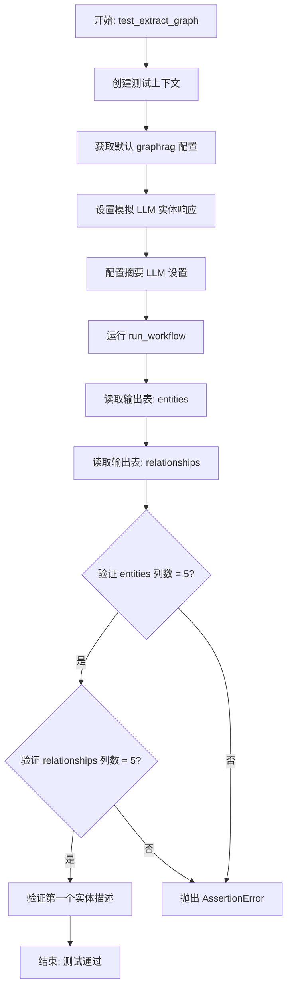

# `graphrag\tests\verbs\test_extract_graph.py` 详细设计文档

这是一个单元测试文件，用于测试 graphrag 索引工作流中的图谱提取功能（extract_graph）。测试通过模拟 LLM 响应来验证实体和关系提取的正确性，并检查输出表（entities 和 relationships）的列结构是否符合预期。

## 整体流程



## 类结构

```
测试模块 (test_extract_graph.py)
├── 全局变量
│   ├── MOCK_LLM_ENTITY_RESPONSES (模拟实体响应)
│   └── MOCK_LLM_SUMMARIZATION_RESPONSES (模拟摘要响应)
└── 测试函数
    └── test_extract_graph (异步集成测试)
```

## 全局变量及字段


### `MOCK_LLM_ENTITY_RESPONSES`
    
模拟的LLM实体提取响应，包含公司、人物及其关系描述的字符串列表

类型：`list[str]`
    


### `MOCK_LLM_SUMMARIZATION_RESPONSES`
    
模拟的LLM摘要响应，用于测试描述摘要功能的字符串列表

类型：`list[str]`
    


    

## 全局函数及方法


### `test_extract_graph`

这是一个异步测试函数，用于验证 GraphRAG 的实体和关系图提取工作流。它创建测试上下文和模拟 LLM 响应，运行提取图的工作流，然后通过断言验证输出表（entities 和 relationships）是否包含预期的 5 列，并且实体描述与模拟响应一致。

参数：

- 无

返回值：无返回值（测试函数，通过断言进行验证）

#### 流程图

```mermaid
flowchart TD
    A[开始测试] --> B[创建测试上下文<br/>storage=['text_units']]
    B --> C[获取默认GraphRAG配置]
    C --> D[配置completion_model为mock类型]
    D --> E[设置MOCK_LLM_ENTITY_RESPONSES]
    E --> F[获取summarize_llm_settings]
    F --> G[配置summarize模型为mock]
    G --> H[设置MOCK_LLM_SUMMARIZATION_RESPONSES]
    H --> I[配置max_input_tokens=1000<br/>max_length=100]
    I --> J[运行run_workflow<br/>config, context]
    J --> K[读取entities表数据]
    K --> L[读取relationships表数据]
    L --> M[断言: nodes_actual列数==5]
    M --> N[断言: edges_actual列数==5]
    N --> O[断言: 第一个实体描述<br/>=='Company_A is a test company']
    O --> P[测试通过]
```

#### 带注释源码

```python
# 异步测试函数：test_extract_graph
# 用途：测试GraphRAG的实体和关系图提取工作流
async def test_extract_graph():
    # 步骤1: 创建测试上下文，设置存储类型为["text_units"]
    # 上下文包含输入输出表提供者、存储等测试环境
    context = await create_test_context(
        storage=["text_units"],
    )

    # 步骤2: 获取默认的GraphRAG配置
    config = get_default_graphrag_config()

    # 步骤3: 配置主completion模型为mock类型
    # 用于模拟LLM生成实体提取响应
    config.completion_models["default_completion_model"].type = "mock"
    # 设置mock响应，包含实体和关系数据
    # 格式: ("entity"<|>名称<|>类型<|>描述) 或 ("relationship"<|>源<|>目标<|>描述<|>权重)
    config.completion_models[
        "default_completion_model"
    ].mock_responses = MOCK_LLM_ENTITY_RESPONSES

    # 步骤4: 获取summarize描述的LLM配置
    # 用于模拟实体描述摘要生成
    summarize_llm_settings = config.get_completion_model_config(
        config.summarize_descriptions.completion_model_id
    ).model_dump()
    # 配置summarize模型为mock类型
    summarize_llm_settings["type"] = "mock"
    # 设置summarize的mock响应
    summarize_llm_settings["mock_responses"] = MOCK_LLM_SUMMARIZATION_RESPONSES

    # 步骤5: 配置summarize相关参数
    # max_input_tokens: 最大输入token数
    # max_length: 生成描述的最大长度
    config.summarize_descriptions.max_input_tokens = 1000
    config.summarize_descriptions.max_length = 100

    # 步骤6: 运行提取图的工作流
    # 执行实体识别、关系提取、描述摘要等完整流程
    await run_workflow(config, context)

    # 步骤7: 从输出表读取结果
    # 读取提取的实体数据
    nodes_actual = await context.output_table_provider.read_dataframe("entities")
    # 读取提取的关系数据
    edges_actual = await context.output_table_provider.read_dataframe("relationships")

    # 步骤8: 断言验证
    # 验证entities表包含5列
    assert len(nodes_actual.columns) == 5
    # 验证relationships表包含5列
    assert len(edges_actual.columns) == 5

    # 步骤9: 验证实体描述内容
    # 注意: TODO注释指出当前mock无法真正触发摘要合并
    # 因为mock响应总是返回单一描述，直接返回而非合并
    # 断言第一个实体的描述等于mock数据中的描述
    assert nodes_actual["description"].to_numpy()[0] == "Company_A is a test company"
```

## 关键组件


### 一段话描述

该代码是一个单元测试文件，用于测试 `graphrag` 项目中图提取工作流的功能，通过模拟 LLM 响应来验证实体和关系提取的正确性，并检查输出表中节点和边的列数是否符合预期。

### 文件运行流程

1. 定义模拟的 LLM 实体和关系响应数据
2. 定义模拟的 LLM 摘要响应数据
3. 调用 `create_test_context` 创建测试上下文
4. 调用 `get_default_graphrag_config` 获取默认配置
5. 将配置中的 completion_model 设置为 mock 模式，并注入模拟响应
6. 配置摘要描述的最大输入令牌和最大长度参数
7. 调用 `run_workflow` 执行图提取工作流
8. 从输出表提供者读取实体和关系数据
9. 断言实体表和关系表的列数均为 5
10. 断言第一个实体的描述与模拟数据一致

### 类详细信息

该文件为纯测试模块，无类定义。

### 全局变量详细信息

| 名称 | 类型 | 描述 |
|------|------|------|
| MOCK_LLM_ENTITY_RESPONSES | List[str] | 模拟的 LLM 实体和关系提取响应，包含公司、人物及其关系的结构化数据 |
| MOCK_LLM_SUMMARIZATION_RESPONSES | List[str] | 模拟的 LLM 摘要响应，用于测试描述摘要功能 |

### 全局函数详细信息

| 名称 | 参数 | 返回类型 | 描述 |
|------|------|----------|------|
| test_extract_graph | 无 | AsyncFunction | 异步测试函数，验证图提取工作流的端到端功能，包括实体识别、关系提取和输出验证 |

### 关键组件信息

### run_workflow

工作流执行函数，负责协调图提取的完整流程，包括实体识别、关系提取和描述摘要。

### create_test_context

测试上下文创建工具，用于构建测试所需的存储和数据提供者环境。

### get_default_graphrag_config

配置获取工具，返回图rag系统的默认配置对象。

### context.output_table_provider

输出表提供者组件，负责将提取的实体和关系写入数据表，并提供读取接口。

### MOCK_LLM_ENTITY_RESPONSES

包含结构化实体和关系数据的模拟LLM响应，使用特定分隔符格式定义实体类型、名称和描述，以及关系源、目标、描述和权重。

### config.summarize_descriptions

摘要描述配置对象，控制描述摘要的最大输入令牌数和最大输出长度。

### 潜在的技术债务或优化空间

1. **TODO注释指出的问题**：当前使用 combined verb 无法强制执行摘要，因为模拟响应总是返回单一描述，导致无法触发真正的合并逻辑
2. **测试数据不够多样化**：模拟响应生成的是静态图数据，无法验证不同场景下的实体合并和去重逻辑
3. **断言不够完整**：仅验证了列数，未充分验证实体和关系的具体内容正确性

### 其它项目

**设计目标**：通过模拟LLM响应实现图提取工作流的单元测试，确保在无真实LLM调用的情况下验证核心逻辑。

**约束条件**：依赖 graphrag 项目的内部模块和配置系统，需要与 tests/unit/config/utils 和 .util 模块配合使用。

**错误处理**：测试未显式处理异常情况，假设工作流执行和输出读取均会成功。

**数据流**：配置 → 模拟LLM响应 → 工作流执行 → 输出表 → 断言验证。

**外部依赖**：依赖 graphrag.index.workflows.extract_graph 模块、tests.unit.config.utils 和本地 util 模块。


## 问题及建议


### 已知问题

- **TODO 注释揭示的测试覆盖不足**：代码中的 TODO 注释表明测试无法真正验证摘要功能，因为 mock 响应总是返回单一描述，导致无法触发真正的合并逻辑，测试断言也只检查了原始描述而非摘要后的描述。
- **硬编码的列数断言**：`len(nodes_actual.columns) == 5` 和 `len(edges_actual.columns) == 5` 是硬编码的，如果 schema 演进，测试会不必要的失败，缺乏灵活性。
- **测试数据顺序依赖**：断言 `nodes_actual["description"].to_numpy()[0]` 假设第一个节点是 COMPANY_A，但没有对结果进行排序或唯一性验证，可能导致测试不稳定（flaky test）。
- **配置修改方式冗长且容易出错**：通过多次字典访问和 `.model_dump()` 修改配置，代码冗长且容易因为配置结构变化而失效。
- **缺少错误处理和边界条件测试**：只测试了成功路径，没有测试工作流失败、LLM 调用超时、输出格式异常等情况。
- **Magic Numbers**：如 `max_input_tokens = 1000`、`max_length = 100` 等硬编码值缺乏解释，且应该可以通过配置或常量统一管理。
- **Mock 数据与测试逻辑紧耦合**：MOCK_LLM_ENTITY_RESPONSES 和 MOCK_LLM_SUMMARIZATION_RESPONSES 直接定义在测试文件顶部，难以复用和扩展。

### 优化建议

- **重构 TODO 场景**：更新 mock 数据以提供具有多个描述的实体，触发真正的摘要/合并逻辑，并修改断言验证摘要后的内容而非原始描述。
- **使用动态列数验证或配置文件**：将预期的列数定义为常量或从配置读取，或者仅验证关键列的存在而非精确计数。
- **消除顺序依赖**：对输出数据进行排序（如按实体名称），或使用更具确定性的查询方式来获取特定实体，而不是依赖返回顺序。
- **封装配置构建逻辑**：创建辅助函数或 fixture 来简化 mock 配置的创建过程，提高可读性和可维护性。
- **增加负面测试用例**：添加测试场景验证错误处理，如无效配置、LLM 返回格式错误等情况。
- **提取 Magic Numbers**：定义具名常量或配置类来管理阈值和参数值，并添加注释说明其业务意义。
- **分离 Mock 数据**：将 mock 数据移至独立的 fixture 或 mock 模块，便于管理和在多个测试间共享。

## 其它


### 设计目标与约束

本测试文件的核心目标是验证图谱提取工作流（run_workflow）的功能正确性，确保从文本中正确提取实体和关系。约束条件包括：必须使用模拟的 LLM 响应来隔离外部依赖；测试数据必须是可预测的确定性问题；需要验证输出表（entities 和 relationships）的结构完整性。

### 错误处理与异常设计

测试中未显式处理异常，主要依赖 pytest 的断言机制。当工作流执行失败或输出数据结构不符合预期时，测试将自动失败。TODO 注释表明当前测试存在已知限制：模拟响应总是返回单一描述，导致无法强制执行摘要合并逻辑。

### 数据流与状态机

数据流从测试上下文创建开始，经过配置初始化（设置模拟 LLM），执行 run_workflow 工作流，最终通过 output_table_provider 读取输出表。状态转换包括：初始化状态 → 配置状态 → 执行状态 → 验证状态。工作流内部状态由 extract_graph 模块管理，测试仅验证最终输出。

### 外部依赖与接口契约

主要外部依赖包括：graphrag.index.workflows.extract_graph.run_workflow（被测函数）、tests.unit.config.utils.get_default_graphrag_config（配置获取）、.util.create_test_context（测试上下文创建）。接口契约要求 run_workflow 接受 config 和 context 两个参数，返回异步操作，输出 entities 和 relationships 两个 DataFrame 表。

### 性能考虑

当前测试未包含性能基准测试。由于使用模拟 LLM，测试执行速度较快。潜在优化点：可以添加超时机制防止测试无限等待；考虑并行执行独立测试用例以提高测试套件效率。

### 安全性考虑

测试代码本身不涉及敏感数据处理。配置中使用 mock 类型替代真实 LLM，避免外部 API 调用。TODO 注释揭示了安全相关考虑：当前模拟机制无法真实验证摘要逻辑，可能导致生产环境中的描述合并行为与测试预期不符。

### 测试策略

采用单元测试策略，使用 mock 对象隔离外部依赖。测试覆盖范围：工作流执行成功性、输出表结构正确性（列数验证）、实体描述内容正确性。存在测试缺口：关系验证不够全面（仅验证列数）、缺少边界条件测试（如空输入、异常输入）。

### 配置管理

配置通过 get_default_graphrag_config() 获取基础配置，然后动态修改 completion_models 和 summarize_descriptions 相关设置。配置修改包括：设置 LLM 类型为 mock、注入 mock_responses、调整 max_input_tokens 和 max_length 参数。这种方式支持不同测试场景的配置隔离。

### 版本兼容性

代码包含版权声明 MIT License，版本为 2024。依赖模块 graphrag.index.workflows.extract_graph 需要与当前测试代码版本匹配。测试代码使用了 Python 3.10+ 的类型注解语法（PEP 604 联合类型语法）。

### 部署相关

本测试文件属于项目测试套件，不直接参与生产部署。部署时需确保测试环境与生产环境的依赖版本一致性。建议在 CI/CD 流程中优先运行此类核心功能测试。

### 已知问题与改进建议

TODO 注释明确指出两个改进方向：一是使用 combined verb 时无法强制执行摘要，需要提供更独特的图结构以触发真正的合并操作；二是需要更新 mock 机制以提供多样化图数据，从而验证描述内容的正确合并逻辑而非简单回显。建议：增加多个不同的 mock 响应数据以测试不同场景；添加关系数据的具体内容验证；增加边界条件测试用例。


    