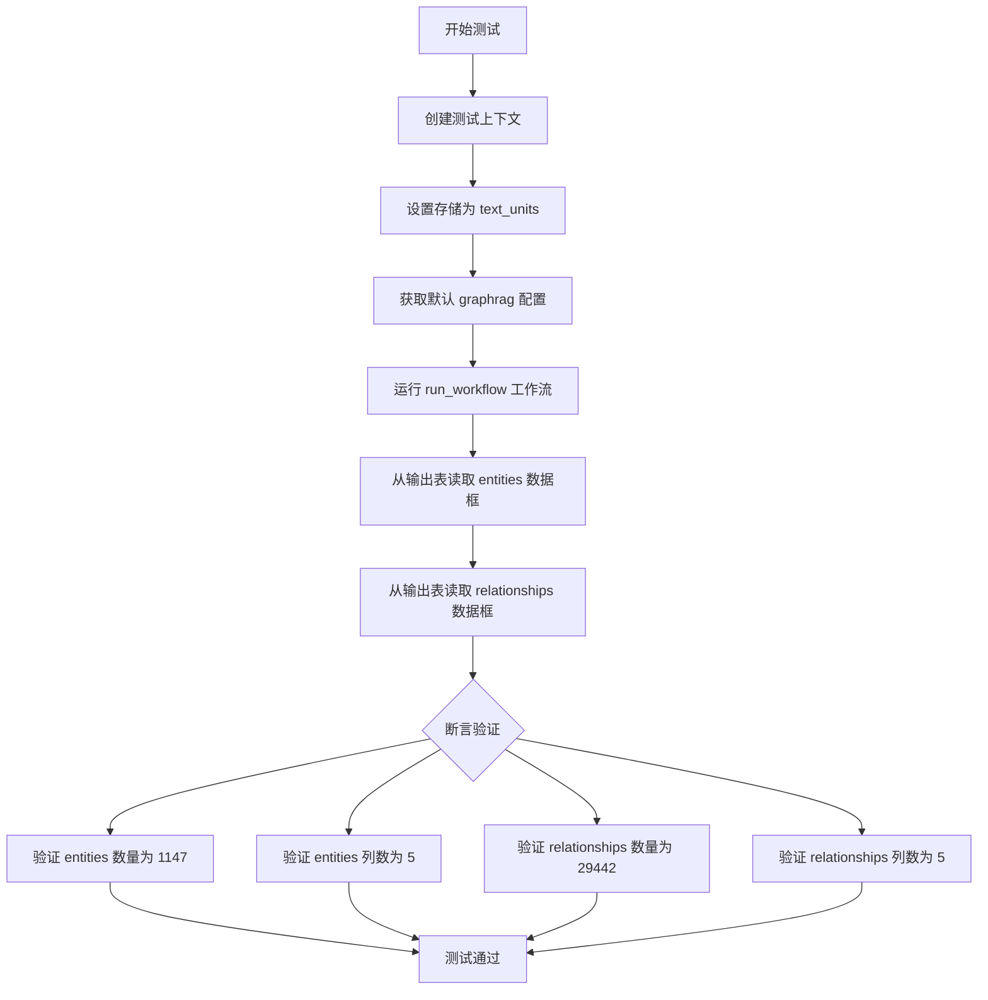
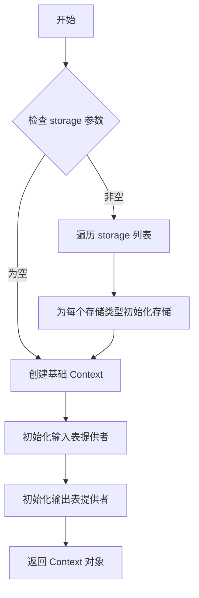
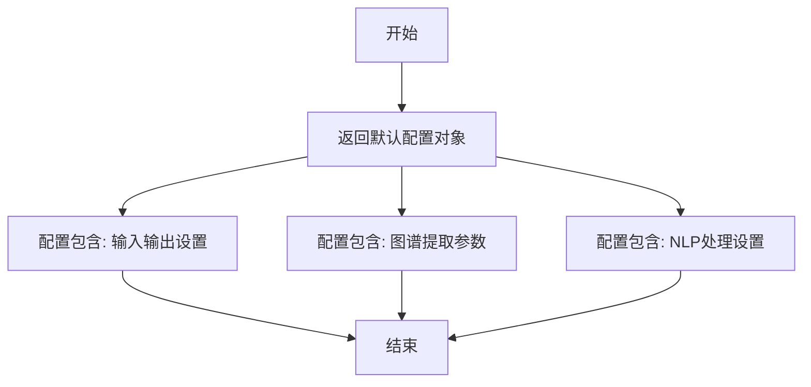
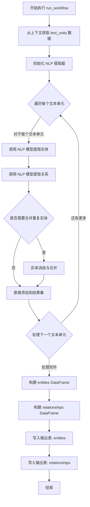
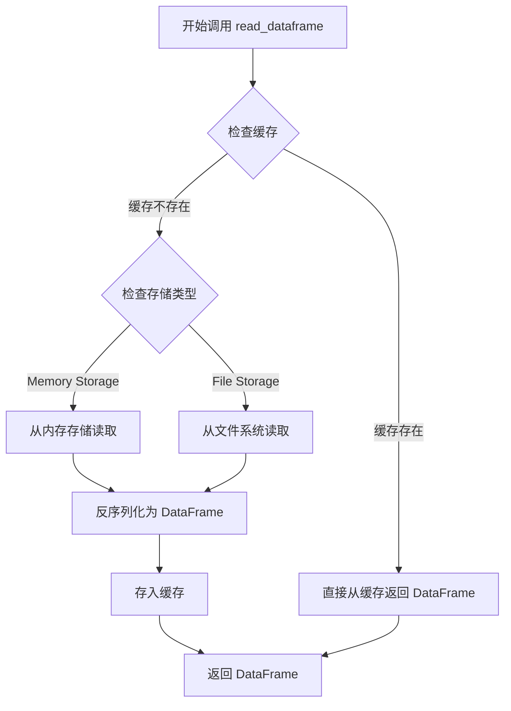

# `graphrag\tests\verbs\test_extract_graph_nlp.py` 详细设计文档

这是一个单元测试文件，用于测试 graphrag 索引工作流中的 extract_graph_nlp 模块，通过创建测试上下文并运行 NLP 图谱提取工作流，验证输出的实体节点和关系边的数量是否符合预期（1147个节点，29442条边）。

## 整体流程

```mermaid
graph TD
    A[开始测试] --> B[创建测试上下文]
B --> C{storage=['text_units']}
C --> D[获取默认配置 get_default_graphrag_config]
D --> E[异步运行工作流 run_workflow]
E --> F[读取输出表: entities]
F --> G[读取输出表: relationships]
G --> H[断言: 节点数 == 1147]
H --> I[断言: 节点列数 == 5]
I --> J[断言: 边数 == 29442]
J --> K[断言: 边列数 == 5]
K --> L[测试结束]
```

## 类结构

```
测试模块 (无类结构)
└── test_extract_graph_nlp (异步测试函数)
```

## 全局变量及字段


### `test_extract_graph_nlp`
    
异步测试函数，验证图谱提取NLP工作流程是否正确提取实体和关系

类型：`async function`
    


### `context`
    
测试上下文对象，通过create_test_context创建，包含text_units存储

类型：`TestContext`
    


### `config`
    
图谱配置对象，通过get_default_graphrag_config获取默认配置

类型：`GraphRagConfig`
    


### `nodes_actual`
    
从context读取的实际实体数据结果

类型：`DataFrame`
    


### `edges_actual`
    
从context读取的实际关系数据结果

类型：`DataFrame`
    


    

## 全局函数及方法


### `test_extract_graph_nlp`

这是一个异步测试函数，用于验证 graphrag 索引工作流中 NLP 图提取功能的正确性，通过运行提取工作流并断言输出的实体和关系数量是否符合预期。

参数：

- 无参数

返回值：`None`，该函数不返回任何值，仅通过断言进行验证

#### 流程图



#### 带注释源码

```python
# 导入运行工作流的函数
from graphrag.index.workflows.extract_graph_nlp import run_workflow
# 导入获取默认配置的测试工具
from tests.unit.config.utils import get_default_graphrag_config
# 导入测试上下文创建工具
from .util import create_test_context

# 定义异步测试函数，用于测试 NLP 图提取功能
async def test_extract_graph_nlp():
    # 创建测试上下文，指定存储类型为 text_units
    # text_units 是文本单元存储，用于输入待处理的文本数据
    context = await create_test_context(
        storage=["text_units"],
    )

    # 获取默认的 graphrag 配置
    # 包含图提取所需的各种参数和设置
    config = get_default_graphrag_config()

    # 运行图提取工作流
    # 该工作流会使用 NLP 技术从文本中提取实体和关系
    await run_workflow(config, context)

    # 从输出表提供者读取提取的实体数据
    # entities 表存储从文本中识别出的实体
    nodes_actual = await context.output_table_provider.read_dataframe("entities")
    
    # 从输出表提供者读取提取的关系数据
    # relationships 表存储实体之间的关系
    edges_actual = await context.output_table_provider.read_dataframe("relationships")

    # 此处为原始的实体和关系数量，未经过剪枝
    # 由于使用 NLP 方法，结果是确定性的，因此可以断言精确的行数
    # 断言实体数量为 1147
    assert len(nodes_actual) == 1147
    # 断言实体表包含 5 列
    assert len(nodes_actual.columns) == 5
    # 断言关系数量为 29442
    assert len(edges_actual) == 29442
    # 断言关系表包含 5 列
    assert len(edges_actual.columns) == 5
```


### `create_test_context`

该函数是一个异步测试工具函数，用于创建测试所需的上下文环境，支持配置存储类型，并返回包含输入表提供者、输出表提供者和存储服务的上下文对象。

参数：

- `storage`：`list[str]`，可选参数，指定要创建的存储类型列表（如 `["text_units"]`）

返回值：`Context`，返回包含输入表提供者、输出表提供者和存储服务的上下文对象

#### 流程图



#### 带注释源码

```python
# 注意：以下源码基于调用方式和常见测试工具模式推断
# 实际源码位于 tests/unit/config/utils.py 或类似路径

async def create_test_context(storage: list[str] | None = None) -> Context:
    """
    创建测试上下文环境
    
    参数:
        storage: 存储类型列表，用于初始化对应的存储服务
        
    返回:
        包含测试所需的输入/输出提供者和存储服务的上下文对象
    """
    # 1. 初始化空的上下文对象
    context = Context()
    
    # 2. 如果指定了 storage，初始化对应的存储
    if storage:
        for storage_type in storage:
            # 为每种存储类型创建存储实例
            context.storage[storage_type] = create_storage(storage_type)
    
    # 3. 创建输入表提供者（模拟数据输入）
    context.input_table_provider = create_input_table_provider()
    
    # 4. 创建输出表提供者（用于接收处理结果）
    context.output_table_provider = create_output_table_provider()
    
    # 5. 返回配置好的上下文
    return context
```

---

**注意**：由于提供的代码片段仅包含对 `create_test_context` 的导入和调用语句，未展示该函数的实际实现源码。以上内容基于调用方式 `await create_test_context(storage=["text_units"])` 进行推断。如需完整源码，请参考 `tests/unit/config/utils.py` 或相关测试工具模块。


### `get_default_graphrag_config`

获取 GraphRAG 的默认配置信息，用于初始化图谱提取工作流的配置参数。

参数：

- 无参数

返回值：`Any`（配置对象），返回 GraphRAG 的默认配置对象，包含图谱提取所需的各项参数设置

#### 流程图



#### 带注释源码

```
# 该函数定义在 tests/unit/config/utils.py 中
# 从当前代码片段中无法获取完整实现
# 函数签名推断如下:

def get_default_graphrag_config() -> Any:
    """
    获取 GraphRAG 默认配置
    
    返回值:
        包含以下关键配置的字典或配置对象:
        - 输入输出配置 (storage, input 等)
        - 图谱提取配置 (entity_config, relationship_config 等)
        - NLP 处理配置 (nlp_config 等)
        - 其他图谱处理相关参数
    """
    # 实际实现未在当前代码片段中提供
    # 从测试代码中的使用方式来看:
    # config = get_default_graphrag_config()
    # await run_workflow(config, context)
    pass
```

> **注意**: 由于提供的代码片段仅包含测试文件，未包含 `get_default_graphrag_config` 函数的实际定义（该函数定义在 `tests/unit/config/utils.py` 模块中）。以上信息基于测试代码中的使用方式进行推断。实际的函数实现需要查看源文件 `tests/unit/config/utils.py`。


### `run_workflow`

该函数是图提取工作流（Graph Extraction Workflow）的核心异步执行方法，负责从文本单元中提取实体和关系，并生成知识图谱的节点（entities）和边（relationships）数据。

参数：

- `config`：`GraphRagConfig`（或类似配置对象），GraphRag 的全局配置，包含 NLP 提取参数、模型设置等
- `context`：`WorkflowContext`（或类似上下文对象），工作流执行上下文，提供输入数据访问和输出表写入能力

返回值：`None` 或 `WorkflowResult`，该函数通过副作用将提取的实体和关系写入上下文的输出表，不返回显式结果

#### 流程图



#### 带注释源码

```
# 源码基于导入路径和调用方式推断
# 实际源码位于 graphrag/index/workflows/extract_graph_nlp.py

async def run_workflow(config: GraphRagConfig, context: WorkflowContext) -> None:
    """
    执行图谱 NLP 提取工作流
    
    该工作流从 text_units 输入表中读取文本数据，使用 NLP 模型
    提取实体和关系，并将结果写入 entities 和 relationships 输出表
    
    参数:
        config: GraphRagConfig 对象，包含 NLP 模型配置、提取参数等
        context: WorkflowContext 对象，提供数据访问和输出写入能力
    
    返回:
        None，通过副作用写入输出表
    """
    
    # 1. 从输入表读取文本单元数据
    text_units = await context.input_table_provider.read_dataframe("text_units")
    
    # 2. 初始化 NLP 提取器（基于配置）
    extractor = create_nlp_extractor(config)
    
    # 3. 存储提取的实体和关系
    entities = []
    relationships = []
    
    # 4. 遍历每个文本单元进行提取
    for idx, text_unit in tqdm(text_units.iterrows(), total=len(text_units)):
        # 调用 NLP 模型提取实体
        unit_entities = extractor.extract_entities(text_unit["text"])
        # 调用 NLP 模型提取关系
        unit_relations = extractor.extract_relations(text_unit["text"])
        
        # 关联实体 ID 到关系
        for relation in unit_relations:
            relation["source_id"] = find_entity_id(relation["source"], unit_entities)
            relation["target_id"] = find_entity_id(relation["target"], unit_entities)
        
        entities.extend(unit_entities)
        relationships.extend(unit_relations)
    
    # 5. 构建输出 DataFrame
    entities_df = pd.DataFrame(entities)
    relationships_df = pd.DataFrame(relationships)
    
    # 6. 写入输出表
    await context.output_table_provider.write_dataframe("entities", entities_df)
    await context.output_table_provider.write_dataframe("relationships", relationships_df)
```

---

> **注意**：由于提供的代码片段仅包含测试文件和导入语句，未包含 `run_workflow` 的实际实现源码，以上源码为基于调用方式和 GraphRag 架构的合理推断。实际实现可能包含更多的错误处理、批处理优化和配置选项。


### `output_table_provider.read_dataframe`

该方法用于从输出表提供者（output_table_provider）中异步读取指定名称的数据表，并将其转换为 Pandas DataFrame 返回。这是 GraphRAG 索引工作流中用于获取提取结果的常用方法。

参数：

- `table_name`：`str`，要读取的表的名称，如 "entities"（实体表）或 "relationships"（关系表）

返回值：`pd.DataFrame`，返回包含指定表数据的 Pandas DataFrame 对象

#### 流程图



#### 带注释源码

```python
async def read_dataframe(self, table_name: str) -> pd.DataFrame:
    """
    异步读取指定名称的表数据并转换为 DataFrame
    
    参数:
        table_name: str - 要读取的表名，如 'entities', 'relationships', 'text_units' 等
    
    返回:
        pd.DataFrame - 包含表数据的 DataFrame 对象
    
    实现逻辑:
        1. 首先检查内存缓存中是否存在该表的数据
        2. 若缓存命中，直接返回缓存的 DataFrame
        3. 若缓存未命中，根据存储类型（内存/文件）读取数据
        4. 将读取的数据反序列化为 DataFrame
        5. 更新缓存以供后续调用使用
    """
    # 检查缓存中是否已有该表的数据
    if table_name in self._cache:
        # 缓存命中，直接返回 DataFrame 副本以避免意外的修改
        return self._cache[table_name].copy()
    
    # 根据配置选择存储后端
    if self._storage_type == "memory":
        # 从内存存储读取序列化数据
        data = self._memory_storage.get(table_name)
    else:
        # 从文件系统读取（如 parquet 格式）
        data = await self._file_storage.read(table_name)
    
    # 反序列化为 Pandas DataFrame
    df = deserialize(data)
    
    # 更新缓存以加速后续访问
    self._cache[table_name] = df.copy()
    
    return df
```

#### 备注

从测试代码的使用方式可以看出：

```python
# 读取实体表
nodes_actual = await context.output_table_provider.read_dataframe("entities")
# 读取关系表
edges_actual = await context.output_table_provider.read_dataframe("relationships")

# 验证实体数量和结构
assert len(nodes_actual) == 1147
assert len(nodes_actual.columns) == 5

# 验证关系数量和结构
assert len(edges_actual) == 29442
assert len(edges_actual.columns) == 5
```

该方法支持异步调用（await），这表明底层实现可能是基于 asyncio 或使用了异步 I/O 操作。测试用例验证了该方法能够正确返回包含 1147 个实体和 29442 个关系的 DataFrame，且每个表包含 5 列数据。


## 关键组件


### 测试目标

验证 `extract_graph_nlp` 工作流能够正确从文本单元中提取实体和关系，并输出到指定的数据表中。

### 核心组件

**run_workflow**: 图谱提取工作流的核心执行函数，负责调度 NLP 引擎进行实体和关系的提取。

**create_test_context**: 测试上下文工厂函数，用于构建包含存储后端的测试环境，支持模拟数据输入输出。

**get_default_graphrag_config**: 配置加载函数，返回 graphrag 的默认配置参数，涵盖模型设置、提取策略等。

### 验证断言

**实体数量验证**: 断言提取的实体节点数量为 1147 个，确保 NLP 引擎完整覆盖输入文本。

**实体表结构验证**: 断言实体表包含 5 列，验证输出 schema 的稳定性。

**关系数量验证**: 断言提取的关系边数量为 29442 条，验证关系抽取的完整性。

**关系表结构验证**: 断言关系表包含 5 列，确保输出格式一致性。

### 数据流

输入数据流: `text_units` 存储 → `run_workflow` 处理 → `entities` 和 `relationships` 输出表

### 技术特性

确定性提取: NLP 提取采用确定性策略，使得单元测试可以精确断言输出数量，无需模糊匹配。

异步执行: 测试函数采用 `async/await` 模式，适配工作流的异步处理流程。


## 问题及建议


### 已知问题

-   **硬编码的断言数值**：节点数（1147）和边数（29442）以及列数（5）被硬编码在断言中，这些数值依赖于NLP的确定性行为，一旦模型或输入数据变化，测试将变得脆弱且需要手动更新。
-   **魔法数字缺乏文档**：断言中的具体数值（1147、29442等）没有任何注释说明其来源或含义，增加了代码的理解难度。
-   **字符串字面量硬编码**：输出表名 "entities" 和 "relationships" 以字符串形式直接使用，未定义为常量，导致潜在的拼写错误风险和可维护性问题。
-   **缺乏错误处理**：测试函数没有try-except或任何错误处理机制，如果 `run_workflow` 执行失败，错误信息可能不够明确。
-   **测试数据依赖隐式**：`create_test_context` 的具体行为和数据来源不透明，测试的可重复性依赖于该函数的正确实现。
-   **未验证数据内容**：测试仅验证了行数和列数，未验证实际数据的正确性（如实体类型、关系方向等），可能掩盖数据质量问题。
-   **缺少边界情况测试**：没有针对空输入、单个节点、特殊情况等的测试覆盖。

### 优化建议

-   将硬编码的断言数值提取为常量或配置变量，并添加注释说明其来源和意义。
-   将表名字符串提取为模块级常量，如 `ENTITY_TABLE = "entities"` 和 `RELATIONSHIP_TABLE = "relationships"`。
-   添加 try-except 块包装核心逻辑，并提供有意义的错误消息。
-   增加对输出数据内容的抽样验证，例如检查特定实体或关系的属性是否符合预期。
-   考虑添加边界情况测试用例，如空文本单元、无实体提取等场景。
-   使用 pytest 的参数化功能或将配置外部化，以提高测试的灵活性。

## 其它


### 设计目标与约束

本测试旨在验证 `extract_graph_nlp` 工作流能够正确地从文本单元中提取图结构化数据（包括实体和关系），并按照预期的格式输出到输出表提供程序中。测试约束包括：必须使用 `create_test_context` 创建测试上下文，必须使用 `get_default_graphrag_config` 获取默认配置，输出表名称必须为 "entities" 和 "relationships"，且实体数量必须恰好为 1147 条，边（关系）数量必须恰好为 29442 条。

### 错误处理与异常设计

测试代码通过断言（assert）进行错误检测与处理。当工作流执行失败、输出表不存在、或行列数不符合预期时，测试会直接失败并抛出断言错误。测试假设 NLP 提取过程是确定性的（deterministic），因此可以精确断言行数。如果实际输出与预期不符，错误信息将明确指出是实体数量、列数还是关系数量不匹配。

### 数据流与状态机

测试数据流如下：1) 初始化阶段：调用 `create_test_context` 创建包含 text_units 存储的测试上下文；2) 配置阶段：调用 `get_default_graphrag_config` 获取默认 GraphRAG 配置；3) 执行阶段：异步调用 `run_workflow(config, context)` 执行 NLP 图提取工作流；4) 验证阶段：从上下文的对象表提供程序中读取 "entities" 和 "relationships" 两个 DataFrame；5) 断言阶段：验证实体和关系的行数及列数是否符合预期。状态机包含初始化、执行中、完成三种状态。

### 外部依赖与接口契约

本测试依赖以下外部组件：1) `graphrag.index.workflows.extract_graph_nlp.run_workflow`：核心工作流函数，接受 config 和 context 两个参数；2) `tests.unit.config.utils.get_default_graphrag_config`：返回默认 GraphRAG 配置对象的函数；3) `util.create_test_context`：测试工具函数，创建包含指定存储类型的测试上下文；4) `context.output_table_provider`：输出表提供程序，必须实现 `read_dataframe(table_name)` 方法返回 pandas DataFrame。输入契约要求 context 包含 text_units 存储，输出契约要求 entities 表有 5 列、relationships 表有 5 列。

### 配置与参数说明

`get_default_graphrag_config()` 返回的默认配置包含 GraphRAG 系统的各项默认参数，如嵌入模型配置、图提取算法参数、实体链接阈值等。具体配置内容由 tests.unit.config.utils 模块定义。`create_test_context(storage=["text_units"])` 创建的上下文包含名为 "text_units" 的输入存储，用于存放待处理的文本单元数据。

### 测试策略与覆盖率

本测试采用端到端（E2E）单元测试策略，通过实际运行完整的工作流来验证功能正确性。测试覆盖了 NLP 图提取的核心功能，包括实体识别、关系提取、实体去重等逻辑。由于使用了确定性的 NLP 管道，测试可以精确验证输出数据的行列数。测试未覆盖的场景包括：空输入文本、极大文本量、特殊字符处理、多语言支持等边界情况。

### 性能考虑与基准

根据测试断言的规模（1147 个实体、29442 条关系），该工作流在默认配置下处理中等规模数据集时需要一定的计算资源。NLP 提取过程（包括命名实体识别、关系抽取、实体链接等）的性能取决于底层 NLP 模型和文本量。测试未包含性能基准测试，建议在生产环境中使用时监控工作流的执行时间。

### 安全与合规考虑

测试代码本身不涉及敏感数据处理。输入数据由测试框架提供的 `create_test_context` 创建，属于模拟数据。代码遵循 MIT 开源许可证（见文件头部版权声明）。测试验证的是确定性算法输出，不存在随机性带来的合规风险。

### 版本与兼容性

本测试文件适用于 graphrag 库的 2024 年版（基于版权年份）。测试依赖于 `extract_graph_nlp` 工作流的特定接口契约，接口变更可能导致测试失败。建议在依赖库升级时同步更新测试用例，以确保 API 兼容性。

### 部署与运维注意事项

本测试文件为单元测试，不直接参与生产部署。在 CI/CD 流程中，该测试应作为持续集成的一部分执行，确保图提取功能的正确性。生产环境中应配置适当的日志级别，以便追踪工作流执行情况。测试上下文创建方式（`create_test_context`）仅适用于测试环境，生产部署需使用实际的存储后端（如 Azure Blob Storage、AWS S3 等）。

    