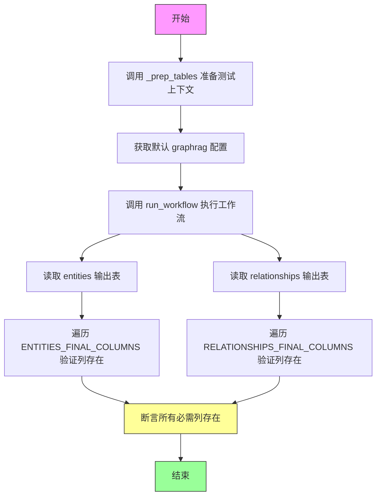
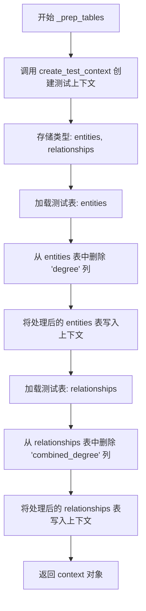
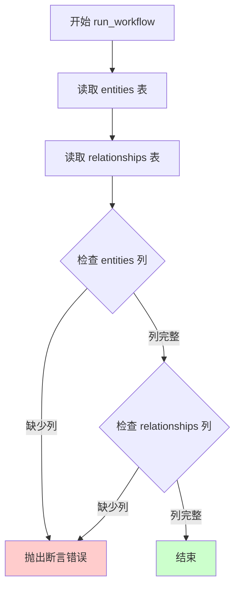
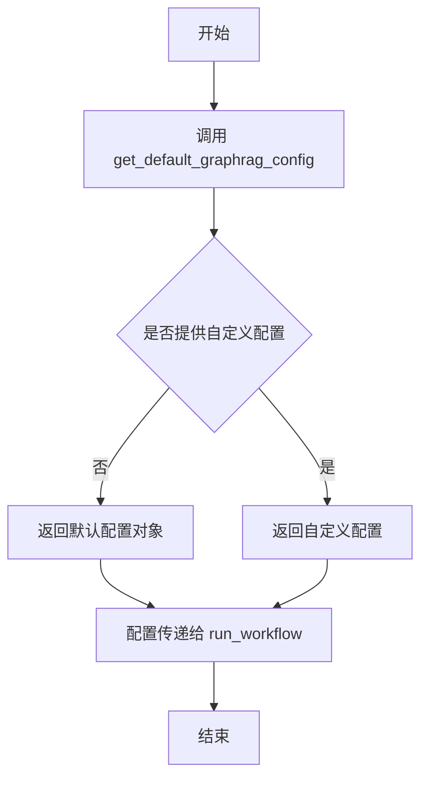
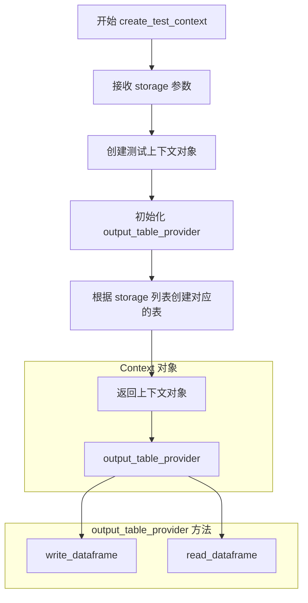
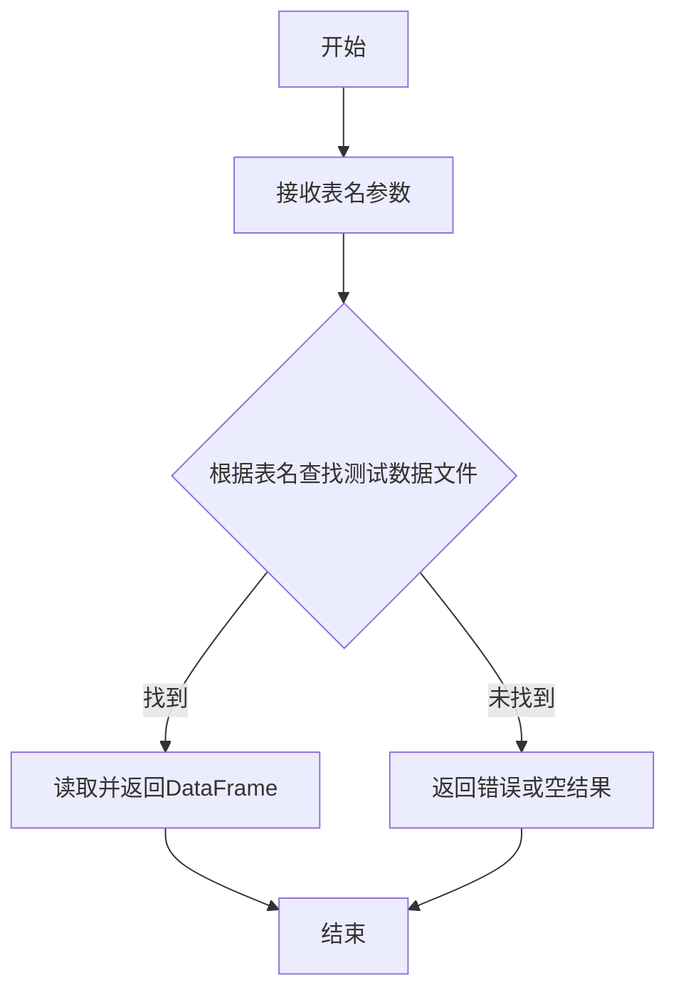

# `graphrag\tests\verbs\test_finalize_graph.py` 详细设计文档

这是一个用于测试graphrag项目中finalize_graph工作流的单元测试文件。它通过创建测试上下文、准备测试数据、执行工作流，然后验证输出表（entities和relationships）是否包含所有必需的最终列来确保图数据处理流程的正确性。

## 整体流程

```mermaid
graph TD
    A[开始] --> B[调用 _prep_tables 创建测试上下文]
B --> C[调用 get_default_graphrag_config 获取配置]
C --> D[调用 run_workflow 执行图工作流]
D --> E[读取 entities 表数据]
E --> F[读取 relationships 表数据]
F --> G{验证 ENTITIES_FINAL_COLUMNS}
G --> H{验证 RELATIONSHIPS_FINAL_COLUMNS}
H --> I[结束测试]
B --> J[创建测试上下文 storage=['entities', 'relationships']]
J --> K[加载测试表 entities]
K --> L[删除 degree 列]
L --> M[写入 entities 表]
M --> N[加载测试表 relationships]
N --> O[删除 combined_degree 列]
O --> P[写入 relationships 表]
P --> C
```

## 类结构

```
测试模块 (test_finalize_graph.py)
└── 主要测试函数
    ├── test_finalize_graph (主测试函数)
    └── _prep_tables (辅助准备函数)
```

## 全局变量及字段


### `ENTITIES_FINAL_COLUMNS`
    
从 graphrag.data_model.schemas 导入的实体表最终列名列表，用于验证实体数据框包含所有必需的列

类型：`List[str]`
    


### `RELATIONSHIPS_FINAL_COLUMNS`
    
从 graphrag.data_model.schemas 导入的关系表最终列名列表，用于验证关系数据框包含所有必需的列

类型：`List[str]`
    


    

## 全局函数及方法


### `test_finalize_graph`

这是一个异步测试函数，用于测试 `run_workflow` 完成后实体和关系表是否包含所有必需的最终列（ENTITIES_FINAL_COLUMNS 和 RELATIONSHIPS_FINAL_COLUMNS）。

参数：

- 无

返回值：`None`，无返回值

#### 流程图



#### 带注释源码

```python
# 异步测试函数：验证 finalize_graph 工作流的输出
# 测试 run_workflow 执行后，实体和关系表是否包含所有最终列
async def test_finalize_graph():
    # 步骤1: 准备测试所需的表格数据
    # 调用内部函数 _prep_tables 创建测试上下文，并写入初始数据
    context = await _prep_tables()

    # 步骤2: 获取默认的 graphrag 配置
    # 从测试配置工具获取预配置的设置
    config = get_default_graphrag_config()

    # 步骤3: 执行 finalize_graph 工作流
    # 传入配置和上下文，运行图最终化工作流，生成最终输出
    await run_workflow(config, context)

    # 步骤4: 读取工作流输出的实体表
    # 从输出表提供者读取生成的 entities 表
    nodes_actual = await context.output_table_provider.read_dataframe("entities")
    
    # 步骤5: 读取工作流输出的关系表
    # 从输出表提供者读取生成的 relationships 表
    edges_actual = await context.output_table_provider.read_dataframe("relationships")

    # 步骤6: 验证实体表包含所有必需的最终列
    # 遍历 ENTITIES_FINAL_COLUMNS 中的每个列名，断言其存在于输出表中
    for column in ENTITIES_FINAL_COLUMNS:
        assert column in nodes_actual.columns
    
    # 步骤7: 验证关系表包含所有必需的最终列
    # 遍历 RELATIONSHIPS_FINAL_COLUMNS 中的每个列名，断言其存在于输出表中
    for column in RELATIONSHIPS_FINAL_COLUMNS:
        assert column in edges_actual.columns
```


### `_prep_tables`

这是一个异步辅助准备函数，用于创建测试环境并准备测试数据。它首先创建一个包含实体和关系存储的测试上下文，然后加载测试数据表并移除特定列（这些列属于最终输出阶段才存在的数据），最后将处理后的数据写入上下文并返回。

参数：

- （无参数）

返回值：`context`，测试上下文对象，包含用于工作流测试的实体和关系数据

#### 流程图



#### 带注释源码

```python
async def _prep_tables():
    """
    异步辅助准备函数，用于准备测试环境所需的上下文和数据。
    
    该函数执行以下操作：
    1. 创建测试上下文，包含 entities 和 relationships 两个存储
    2. 加载测试用的实体和关系数据表
    3. 删除某些列（这些列是最终输出阶段才有的字段，不应作为输入）
    4. 将处理后的数据写入上下文以供测试使用
    """
    # 创建测试上下文，指定需要两个存储：entities 和 relationships
    # create_test_context 是测试工具函数，用于模拟图谱工作流的运行环境
    context = await create_test_context(
        storage=["entities", "relationships"],
    )

    # 加载测试用的实体数据表
    # load_test_table 从测试数据目录加载预定义的测试数据
    entities = load_test_table("entities")
    # 删除 'degree' 列，该列是图谱处理流程最终阶段计算得出的字段
    # 在测试输入中不应包含此列，以模拟真实的输入数据场景
    entities.drop(columns=["degree"], inplace=True)
    # 将处理后的实体数据写入上下文的输出表提供者
    await context.output_table_provider.write_dataframe("entities", entities)
    
    # 加载测试用的关系数据表
    relationships = load_test_table("relationships")
    # 删除 'combined_degree' 列，同样是最终阶段计算的字段
    relationships.drop(columns=["combined_degree"], inplace=True)
    # 将处理后的关系数据写入上下文的输出表提供者
    await context.output_table_provider.write_dataframe("relationships", relationships)
    
    # 返回准备好的测试上下文，供 run_workflow 测试使用
    return context
```


### `run_workflow`

该函数是 GraphRAG 索引工作流中的最终图谱完成步骤，负责验证并确保实体和关系输出表包含所有必需的最终列，以确保图谱数据的完整性和一致性。

参数：

- `config`：配置对象（类型未知，从 `get_default_graphrag_config()` 获取），包含 GraphRAG 的全局配置参数
- `context`：执行上下文（类型未知，从 `create_test_context()` 获取），提供输出表提供者（`output_table_provider`）用于读写数据

返回值：无返回值（`None`），通过副作用（写入输出表）完成工作

#### 流程图



#### 带注释源码

```
# 该函数源码未在提供的测试文件中展示
# 以下为基于测试代码的推断实现

async def run_workflow(config, context):
    """
    最终化图谱工作流
    
    参数:
        config: GraphRAG配置对象
        context: 包含output_table_provider的上下文对象
    
    返回:
        None
    
    验证实体和关系表是否包含所有最终列
    """
    # 从上下文获取输出表提供者
    output_provider = context.output_table_provider
    
    # 读取实体表
    nodes = await output_provider.read_dataframe("entities")
    
    # 读取关系表  
    edges = await output_provider.read_dataframe("relationships")
    
    # 验证实体表包含所有必需列
    for column in ENTITIES_FINAL_COLUMNS:
        assert column in nodes.columns
    
    # 验证关系表包含所有必需列
    for column in RELATIONSHIPS_FINAL_COLUMNS:
        assert column in edges.columns
```

---

> **注意**：提供的测试代码未包含 `run_workflow` 函数的实际实现源码。上方源码为基于测试调用方式的合理推断。实际实现可能包含更多逻辑，如数据转换、列填充默认值等。要获取准确的函数实现，建议查看 `graphrag/index/workflows/finalize_graph.py` 源文件。


### `get_default_graphrag_config`

获取 GraphRAG 的默认配置，用于初始化图谱工作流。

参数：
- 无

返回值：`Any`（配置对象），返回 GraphRAG 系统的默认配置，包含工作流运行所需的各种参数。

#### 流程图



#### 带注释源码

```
# 源码位于 tests.unit.config.utils 模块中
# 以下为基于使用方式的推断

def get_default_graphrag_config():
    """
    获取 GraphRAG 的默认配置。
    
    该函数通常用于测试场景，提供一个包含所有必要默认值的配置对象，
    用于初始化图谱索引工作流。
    
    Returns:
        Config: 包含默认配置的 Config 对象，包含如下可能的配置项：
            - 输入数据相关配置
            - 图构建相关配置
            - 输出表相关配置
            - 并行处理配置等
    """
    # 返回默认配置对象
    # 实际实现需要查看 tests.unit.config.utils 模块
    return config  # 配置对象，包含工作流运行所需的所有参数
```


### `create_test_context`

这是一个从 `.util` 模块导入的异步测试工具函数，用于创建一个测试上下文对象，该对象包含用于模拟图形生成管道的输出表提供者。

参数：

-  `storage`：`List[str]`，指定要创建的存储表名称列表（如 "entities", "relationships"）

返回值：`Context`，返回一个测试上下文对象，该对象包含 `output_table_provider` 属性，用于模拟索引工作流的输出表读写操作

#### 流程图



#### 带注释源码

```python
# 注：以下源码基于该函数的使用方式推断，具体实现需参考 tests/unit/util 模块
# 由于给定代码片段中未包含 util 模块的定义，此处为逻辑推断

async def create_test_context(storage: List[str]) -> Context:
    """
    创建一个测试上下文，用于模拟图形生成管道的执行环境。
    
    参数:
        storage: 要创建的输出表名称列表
        
    返回:
        包含输出表提供者的上下文对象
    """
    # 1. 初始化上下文对象
    context = TestContext()
    
    # 2. 创建输出表提供者，传入所需的存储表名称
    context.output_table_provider = MockOutputTableProvider(storage=storage)
    
    # 3. 返回配置好的上下文
    return context
```


### `load_test_table`

该函数是测试工具模块中的一个数据加载函数，用于根据传入的表名加载对应的测试数据表（DataFrame格式），通常在测试初始化阶段使用，为单元测试提供预设的测试数据集。

参数：

-  `table_name`：`str`，要加载的测试表名称（如"entities"或"relationships"）

返回值：`pd.DataFrame`，返回加载的测试数据表

#### 流程图



#### 带注释源码

```
# 伪代码 - 实际定义未在提供代码中显示
def load_test_table(table_name: str) -> pd.DataFrame:
    """
    加载测试数据表
    
    参数:
        table_name: 测试表名称，用于指定要加载的表
        
    返回:
        加载的DataFrame对象
    """
    # 根据table_name加载对应的测试数据文件
    # 返回pandas DataFrame格式的数据
    pass
```

> **注意**：由于`load_test_table`函数是从`.util`模块导入的，其完整源代码定义未包含在提供的代码片段中。上述信息是基于函数的使用方式进行推断的：
> - 参数：`"entities"` 或 `"relationships"`（字符串类型）
> - 返回值：DataFrame对象（因为调用了`.drop(columns=...)`方法）
> - 功能：根据表名加载对应的测试数据表

## 关键组件


### test_finalize_graph

异步测试函数，验证 finalize_graph 工作流是否正确生成包含所有最终列的 entities 和 relationships 表

### _prep_tables

异步辅助函数，准备测试环境并创建符合输入要求的测试数据表，移除最终字段以模拟工作流输入

### run_workflow

被测试的工作流函数，负责将 entities 和 relationships 表处理成最终格式

### ENTITIES_FINAL_COLUMNS

全局常量，定义 entity 表的最终列集合，用于验证输出表结构

### RELATIONSHIPS_FINAL_COLUMNS

全局常量，定义 relationship 表的最终列集合，用于验证输出表结构

### context.output_table_provider

关键组件，提供读写数据表的能力，用于验证工作流输出结果


## 问题及建议


### 已知问题

- **数据准备与生产环境不一致**：在 `_prep_tables` 中手动删除 "degree" 和 "combined_degree" 列来模拟输入数据，但这种处理方式与实际生产环境的数据流可能不一致，可能导致测试无法真实反映生产行为
- **缺乏错误处理**：代码中没有 try-except 块，如果 `run_workflow` 或数据读写操作失败，测试会直接抛出异常而非提供有意义的错误信息
- **硬编码的表名**：表名 "entities" 和 "relationships" 硬编码在代码中，降低了代码的可维护性和可配置性
- **缺少空值检查**：调用 `load_test_table` 时未检查文件是否存在或加载失败的情况
- **断言信息缺失**：所有 assert 语句都没有自定义错误消息，测试失败时难以快速定位问题
- **变量复用**：`context` 变量在多个位置使用且无注释说明其生命周期和作用域

### 优化建议

- 提取通用的表处理逻辑为独立函数，减少重复代码
- 为关键函数添加文档字符串说明其目的
- 使用 pytest 的参数化或其他机制管理测试数据
- 添加具体的 assert 错误消息，如 `assert column in nodes_actual.columns, f"Missing column: {column}"`
- 考虑使用 fixture 管理测试上下文和配置
- 添加对异常输入的测试用例（如空表、无效配置等）
- 将表名提取为常量或配置项

## 其它


### 设计目标与约束

本测试代码的设计目标是验证 `finalize_graph` 工作流能够正确处理实体和关系表，并将输入数据转换为符合最终模式的输出。测试通过检查输出表中是否包含预期的列来验证数据结构的完整性。约束条件包括：测试依赖特定的列定义（ENTITIES_FINAL_COLUMNS 和 RELATIONSHIPS_FINAL_COLUMNS），且输入表需要预先处理以移除最终输出中不应包含的字段（如 degree 和 combined_degree）。

### 错误处理与异常设计

测试代码本身的错误处理较为基础，主要依赖 pytest 断言来验证结果。潜在的异常情况包括：1) 输入表不存在或格式不正确；2) run_workflow 执行失败；3) 输出表缺少预期列；4) 数据类型不匹配。当断言失败时，pytest 会明确指出缺少的列名，便于快速定位问题。

### 数据流与状态机

数据流主要分为三个阶段：准备阶段（`_prep_tables`）创建测试上下文并写入预处理后的实体和关系表；执行阶段（`run_workflow`）调用 finalize_graph 工作流处理数据；验证阶段通过检查输出表列名确认数据结构正确。状态转换路径：空上下文 → 写入输入表 → 执行工作流 → 生成输出表 → 验证列完整性。

### 外部依赖与接口契约

本测试依赖以下外部组件：1) `graphrag.data_model.schemas` 提供的 ENTITIES_FINAL_COLUMNS 和 RELATIONSHIPS_FINAL_COLUMNS 列定义；2) `graphrag.index.workflows.finalize_graph` 的 run_workflow 函数；3) tests.unit.config.utils 的 get_default_graphrag_config 配置；4) .util 模块的 create_test_context 和 load_test_table 工具函数。接口契约要求 run_workflow 接受 config 和 context 参数并生成包含 entities 和 relationships 表的输出。

### 性能考虑与优化建议

当前测试在每次运行时都需要写入测试数据表，可能带来 I/O 开销。优化方向包括：1) 使用内存数据集减少磁盘 I/O；2) 考虑并行执行独立测试用例；3) 添加性能基准测试监控工作流执行时间。当前代码已通过异步函数优化了 I/O 操作效率。

### 测试策略与覆盖率

测试采用端到端方式验证工作流功能，覆盖范围包括：数据结构完整性（列存在性验证）和数据处理流程（完整的工作流执行）。覆盖率盲点包括：空输入处理、异常数据格式、边界条件（如空表、单条记录）以及数据内容正确性验证，仅验证了结构而非数据值。

    