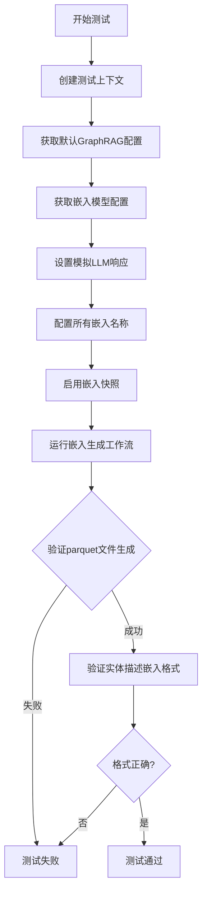
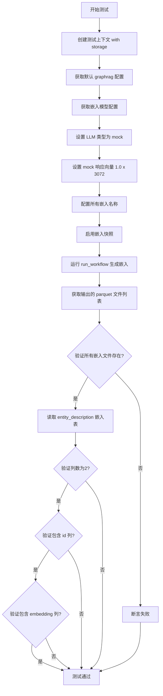

# `graphrag\tests\verbs\test_generate_text_embeddings.py` 详细设计文档

这是一个用于测试文本嵌入生成工作流的单元测试文件，通过创建测试上下文、配置模拟LLM设置、运行嵌入工作流，并验证生成的嵌入文件（parquet格式）是否符合预期。

## 整体流程



## 类结构

```
测试模块 (test module)
└── test_generate_text_embeddings (测试函数)
```

## 全局变量及字段


### `all_embeddings`
    
所有可用嵌入类型列表，从graphrag配置模块中获取

类型：`List[str]`
    


### `test_generate_text_embeddings.context`
    
测试上下文对象，用于存储测试数据和输出存储

类型：`TestContext`
    


### `test_generate_text_embeddings.config`
    
GraphRAG配置对象，包含系统运行所需的各种配置参数

类型：`GraphRagConfig`
    


### `test_generate_text_embeddings.llm_settings`
    
嵌入模型设置，用于配置文本嵌入模型的相关参数

类型：`EmbeddingModelSettings`
    


### `test_generate_text_embeddings.parquet_files`
    
输出的parquet文件集合，包含所有生成的数据文件键名

类型：`KeysView[str]`
    


### `test_generate_text_embeddings.entity_description_embeddings`
    
实体描述嵌入数据框，包含实体描述的向量表示

类型：`DataFrame`
    


### `test_generate_text_embeddings.field`
    
嵌入字段迭代变量，用于遍历所有嵌入类型

类型：`str`
    
    

## 全局函数及方法


### `test_generate_text_embeddings`

异步测试函数，负责完整测试生成文本嵌入的工作流流程，验证嵌入文件是否正确生成并检查 entity_description 嵌入的格式是否符合预期（包含 id 和 embedding 两列）。

参数：无

返回值：`None`，无返回值（测试函数）

#### 流程图



#### 带注释源码

```python
# Copyright (c) 2024 Microsoft Corporation.
# Licensed under the MIT License

# 导入嵌入配置相关的 all_embeddings 函数
from graphrag.config.embeddings import (
    all_embeddings,
)
# 导入生成文本嵌入的工作流运行函数
from graphrag.index.workflows.generate_text_embeddings import (
    run_workflow,
)

# 导入测试工具：获取默认 graphrag 配置
from tests.unit.config.utils import get_default_graphrag_config

# 导入测试工具：创建测试上下文
from .util import (
    create_test_context,
)


# 异步测试函数：测试生成文本嵌入的完整流程
async def test_generate_text_embeddings():
    # 步骤1: 创建测试上下文，初始化所需的存储集合
    # 包含：documents, relationships, text_units, entities, community_reports
    context = await create_test_context(
        storage=[
            "documents",
            "relationships",
            "text_units",
            "entities",
            "community_reports",
        ]
    )

    # 步骤2: 获取默认的 graphrag 配置
    config = get_default_graphrag_config()
    
    # 步骤3: 获取嵌入模型配置，通过 embed_text.embedding_model_id 获取
    llm_settings = config.get_embedding_model_config(
        config.embed_text.embedding_model_id
    )
    
    # 步骤4: 将 LLM 类型设置为 mock（模拟模式，不调用真实模型）
    llm_settings.type = "mock"
    
    # 步骤5: 设置 mock 响应为 3072 维的向量（全部为 1.0）
    # 这是模拟嵌入向量的输出
    llm_settings.mock_responses = [1.0] * 3072

    # 步骤6: 配置嵌入文本的名称列表为所有嵌入类型
    config.embed_text.names = list(all_embeddings)
    
    # 步骤7: 启用嵌入快照功能，保存嵌入文件
    config.snapshots.embeddings = True

    # 步骤8: 运行工作流，生成所有文本嵌入
    await run_workflow(config, context)

    # 步骤9: 获取输出存储中的所有 parquet 文件
    parquet_files = context.output_storage.keys()

    # 步骤10: 遍历所有嵌入字段，验证对应的 parquet 文件是否生成
    for field in all_embeddings:
        assert f"embeddings.{field}.parquet" in parquet_files

    # 步骤11: 读取 entity_description 嵌入表（这个字段总是存在）
    entity_description_embeddings = await context.output_table_provider.read_dataframe(
        "embeddings.entity_description"
    )

    # 步骤12: 验证嵌入表的列数是否为 2
    assert len(entity_description_embeddings.columns) == 2
    
    # 步骤13: 验证是否包含 id 列
    assert "id" in entity_description_embeddings.columns
    
    # 步骤14: 验证是否包含 embedding 列
    assert "embedding" in entity_description_embeddings.columns
```

## 关键组件


### 核心功能概述

该代码是一个集成测试文件，用于验证图检索增强生成（GraphRAG）系统中文本嵌入生成工作流的正确性，通过创建测试上下文、配置模拟嵌入模型、执行工作流并验证输出 parquet 文件的格式和内容。

### 文件整体运行流程

1. **测试准备阶段**：创建包含多种存储类型的测试上下文（documents, relationships, text_units, entities, community_reports）
2. **配置初始化**：获取默认GraphRAG配置，设置嵌入模型为mock模式，配置模拟响应向量
3. **工作流执行**：运行嵌入生成工作流，生成所有类型的嵌入文件
4. **结果验证**：检查parquet文件是否存在，验证entity_description嵌入文件的结构（包含id和embedding两列）

### 关键组件信息

### test_generate_text_embeddings

异步测试函数，协调整个嵌入生成测试流程

### create_test_context

测试工具函数，创建包含指定存储类型的测试上下文环境

### get_default_graphrag_config

配置获取函数，返回GraphRAG系统的默认配置对象

### run_workflow

工作流执行函数，负责运行嵌入生成的实际逻辑

### all_embeddings

全局变量，包含所有支持的嵌入类型名称列表

### config.embed_text

配置组件，定义文本嵌入的模型ID和嵌入名称列表

### config.snapshots.embeddings

配置组件，控制嵌入快照的保存开关

### 潜在的技术债务或优化空间

1. **硬编码向量维度**：mock_responses使用固定3072维度，与实际模型可能不匹配
2. **测试数据单一**：仅使用单个全1向量作为mock响应，缺乏多样性验证
3. **缺乏错误场景测试**：未测试嵌入生成失败或部分失败的情况
4. **配置耦合**：测试与get_default_graphrag_config紧密耦合，配置变更可能影响测试

### 其它项目

#### 设计目标与约束

- 验证嵌入工作流能够生成所有配置的嵌入类型
- 确保输出parquet文件格式符合预期（id, embedding两列）
- 使用mock模式避免外部API依赖

#### 错误处理与异常设计

- 依赖assert语句进行基本验证
- 缺少对工作流执行异常的捕获处理

#### 数据流与状态机

- 输入：配置对象 + 存储数据
- 处理：嵌入模型生成向量
- 输出：parquet格式的嵌入文件

#### 外部依赖与接口契约

- 依赖graphrag.config模块获取配置
- 依赖graphrag.index.workflows执行工作流
- 依赖tests.unit.config.utils获取测试配置


## 问题及建议


### 已知问题

- **硬编码的魔法数字**: `3072` 作为嵌入维度被硬编码在 `llm_settings.mock_responses = [1.0] * 3072` 中，缺乏明确的解释和常量定义，可读性和可维护性较差
- **配置对象直接修改**: 测试直接修改 `llm_settings.type`、`llm_settings.mock_responses` 和 `config.snapshots.embeddings` 等配置属性，可能产生副作用，影响同一测试会话中的其他测试
- **缺少异步错误处理**: `await run_workflow(config, context)` 和文件读取操作缺乏异常捕获，测试失败时难以定位根因
- **嵌入值正确性未验证**: 测试仅验证了 parquet 文件的存在和列结构（id、embedding），未验证嵌入向量的实际值是否符合预期（如 `1.0` 的填充值）
- **导入名称潜在混淆**: 从 `graphrag.config.embeddings` 模块导入 `all_embeddings`，模块名与变量名可能在大型项目中造成命名空间混乱

### 优化建议

- **提取魔法数字为常量**: 定义 `EMBEDDING_DIMENSION = 3072` 常量，并在注释中说明该值的来源或配置依据
- **使用配置副本或模拟对象**: 在测试前创建配置的深拷贝，或使用 mock 框架动态构建配置，避免修改全局配置对象
- **添加 try-except 包装异步调用**: 为关键异步操作添加异常处理和详细的失败信息输出
- **增强断言验证嵌入值**: 在读取 DataFrame 后，添加对 `embedding` 列值的断言，如验证向量维度、值范围或是否为预期的填充值
- **重构导入路径**: 考虑使用别名导入（如 `from graphrag.config.embeddings import all_embeddings as all_embedding_names`）以提高代码清晰度
- **抽取重复断言逻辑**: 将 `for field in all_embeddings` 的断言逻辑封装为辅助函数，减少代码重复

## 其它


### 设计目标与约束

该测试文件旨在验证 graphrag 系统中文本嵌入生成工作流的正确性，确保所有类型的嵌入（实体描述、关系、文本单元等）能够正确生成并存储为 parquet 格式文件。约束条件包括：必须使用 mock LLM 设置以避免外部依赖、输入数据必须包含指定的存储表（documents, relationships, text_units, entities, community_reports）、输出必须包含所有预设嵌入类型的 parquet 文件。

### 错误处理与异常设计

测试中主要通过断言进行错误检测。关键错误处理点包括：1) 配置获取失败时 `config.get_embedding_model_config()` 会返回 None 或抛出异常；2) 工作流执行失败时 `run_workflow()` 会抛出异常导致测试失败；3) 输出文件缺失时 `assert` 语句会捕获并报告；4) DataFrame 读取失败时 `read_dataframe()` 异常会被测试框架捕获。

### 数据流与状态机

测试数据流如下：创建测试上下文（初始化存储）→ 配置 LLM mock 响应→ 设置嵌入名称列表→ 启用嵌入快照→ 执行工作流→ 验证输出文件存在→ 读取实体描述嵌入→ 验证 DataFrame 结构。工作流内部状态机：初始化→ 加载文档数据→ 调用嵌入模型→ 生成各类嵌入→ 存储为 parquet 文件→ 完成。

### 外部依赖与接口契约

主要外部依赖包括：graphrag.config 模块（配置管理）、graphrag.index.workflows.generate_text_embeddings（嵌入生成工作流）、tests.unit.config.utils（测试配置工具）、.util（测试上下文创建工具）。接口契约：run_workflow(config, context) 接受配置对象和上下文对象，返回异步完成；context.output_storage 返回键值存储，键为文件名；context.output_table_provider.read_dataframe(table_name) 返回 pandas DataFrame。

### 性能基准与资源消耗

由于使用 mock LLM，性能测试主要关注 I/O 操作。预期资源消耗：内存占用与输入数据规模成正比，主要消耗在 pandas DataFrame 操作和 parquet 文件读写；CPU 占用较低，主要用于数据序列化；磁盘 I/O 取决于输出文件大小。建议：对于大规模测试，应分批处理嵌入生成以控制内存峰值。

### 测试策略与覆盖率

测试策略采用单元测试+集成测试混合模式，覆盖场景：1) 正常流程验证；2) 多嵌入类型生成验证；3) 输出格式验证（parquet 结构）；4) DataFrame 列结构验证。覆盖盲点：未测试部分嵌入失败的情况、未测试并发执行、未测试配置边界值（如空嵌入名称列表）。

### 安全与隐私考虑

该测试文件本身不涉及敏感数据处理，但需注意：测试数据可能包含模拟的文档内容；mock 响应固定为 [1.0] * 3072 向量，不涉及真实隐私；测试环境应与生产环境隔离。建议：若测试数据来自真实文档，需进行脱敏处理后再用于测试。

### 版本兼容性信息

该代码依赖 graphrag 框架的内部 API，具体版本约束需参考项目根目录的 requirements.txt 或 pyproject.toml。当前代码使用了 `all_embeddings` 函数和 `run_workflow` 异步函数，这些接口可能在不同版本间存在变化。建议：在 CI/CD 中锁定 graphrag 版本，或使用版本兼容性测试。

### 配置示例与使用指南

关键配置项说明：config.embed_text.embedding_model_id - 嵌入模型标识符；config.embed_text.names - 要生成的嵌入类型列表；config.snapshots.embeddings - 是否保存嵌入快照。示例配置：
```python
config = get_default_graphrag_config()
llm_settings = config.get_embedding_model_config(config.embed_text.embedding_model_id)
llm_settings.type = "mock"
llm_settings.mock_responses = [1.0] * 3072  # 3072维向量
config.embed_text.names = list(all_embeddings)
config.snapshots.embeddings = True
```

### 已知限制与未来改进

当前测试的局限性：1) 使用固定 mock 响应，无法验证不同嵌入模型的差异；2) 仅验证输出文件存在性，未验证嵌入向量内容正确性；3) 缺少对大规模数据集的压力测试；4) 未覆盖嵌入缓存机制测试。未来改进方向：增加嵌入内容一致性校验、添加性能基准测试、引入真实 LLM 的集成测试选项、完善错误场景测试覆盖率。


    