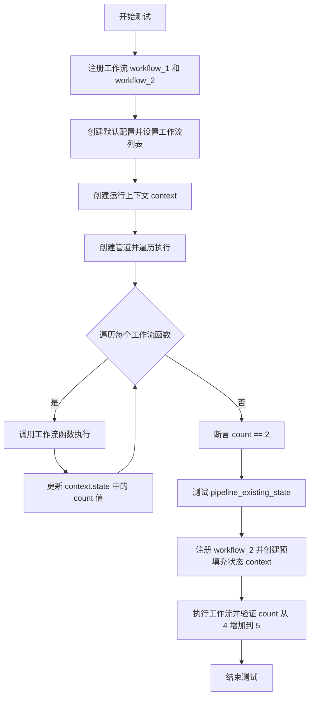
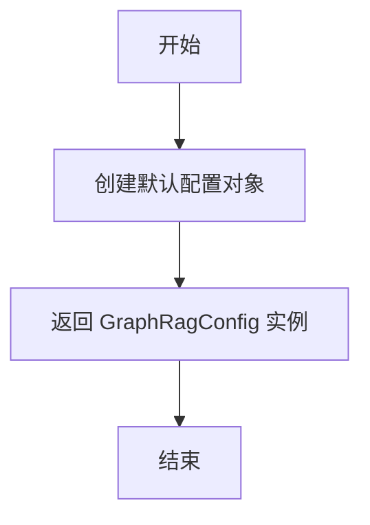
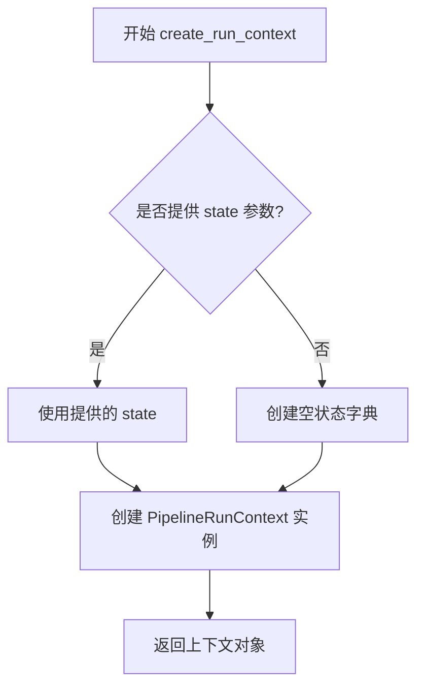
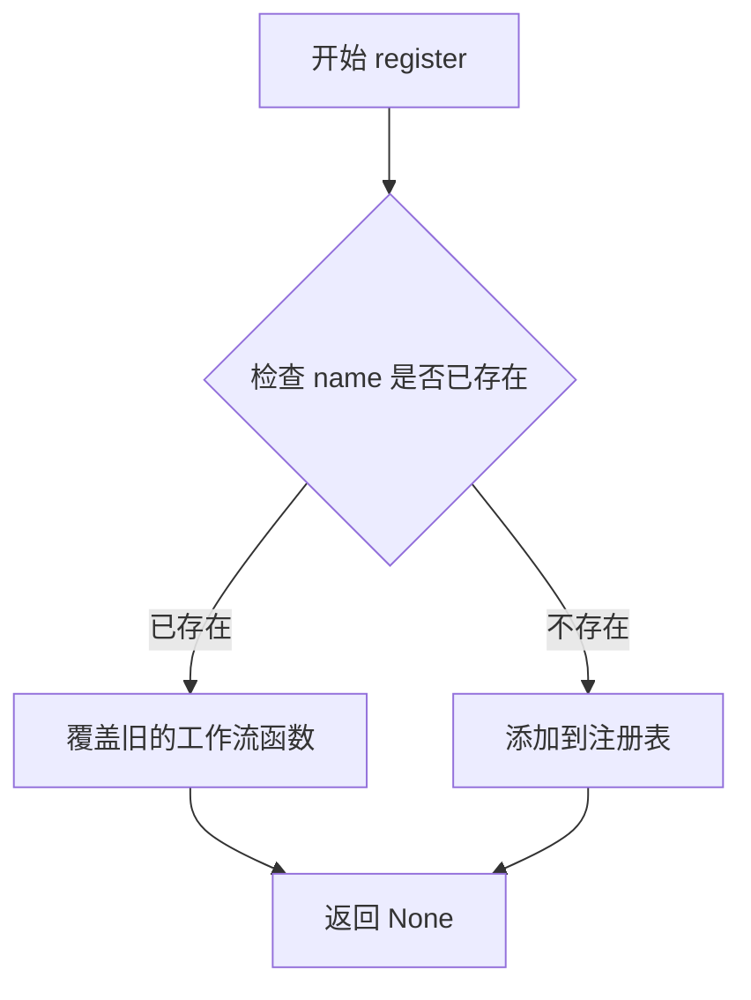
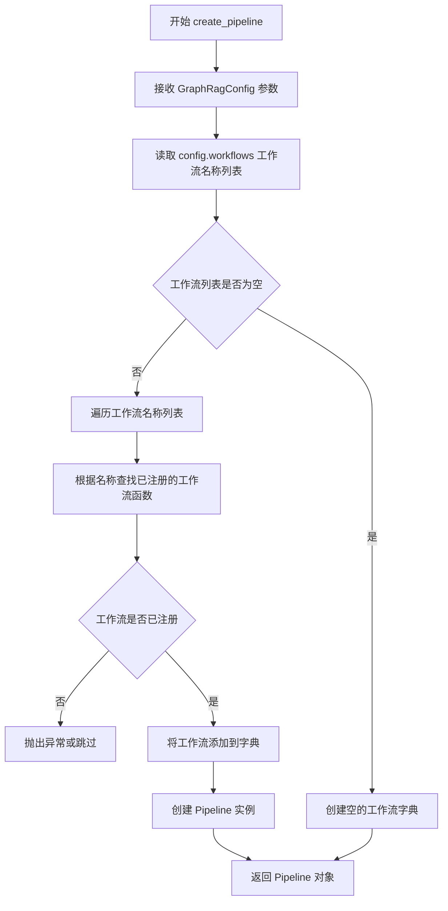
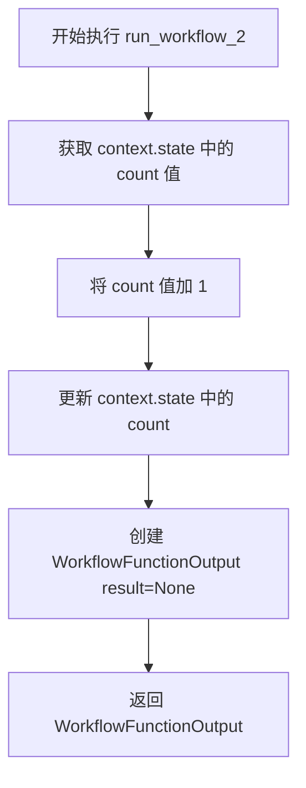

# `graphrag\tests\verbs\test_pipeline_state.py` 详细设计文档

这是一个集成测试文件，用于验证GraphRag管道(pipeline)的状态传递机制。测试确保了多个工作流(workflow)能够在共享的运行上下文(PipelineRunContext)中正确更新和传递状态(state)，包括初始状态为空的场景和预填充状态的场景。

## 整体流程



## 类结构

```
测试模块
├── test_pipeline_state (测试函数)
│   ├── run_workflow_1 (工作流函数)
│   └── run_workflow_2 (工作流函数)
└── test_pipeline_existing_state (测试函数)
    └── run_workflow_2 (工作流函数)

依赖模块
├── GraphRagConfig (配置模型)
├── PipelineRunContext (管道运行上下文)
├── WorkflowFunctionOutput (工作流输出)
└── PipelineFactory (管道工厂)
```

## 全局变量及字段


### `config`
    
图检索增强生成管道的配置对象，包含工作流列表等设置

类型：`GraphRagConfig`
    


### `context`
    
管道运行上下文，包含可传递的任意状态字典

类型：`PipelineRunContext`
    


### `GraphRagConfig.workflows`
    
管道配置中要执行的工作流名称列表

类型：`list[str]`
    


### `PipelineRunContext.state`
    
管道运行时的任意状态字典，可在工作流间共享和传递

类型：`dict`
    


### `WorkflowFunctionOutput.result`
    
工作流函数的输出结果

类型：`Any`
    
    

## 全局函数及方法


### `get_default_graphrag_config`

该函数用于获取一个默认配置的 GraphRagConfig 对象，通常在测试场景中用于初始化管道配置，无需任何参数即可返回一个包含默认设置的配置实例。

参数：此函数无参数

返回值：`GraphRagConfig`，返回一个默认配置的 GraphRagConfig 对象，用于配置图检索增强生成管道的各项参数

#### 流程图



#### 带注释源码

```python
def get_default_graphrag_config() -> GraphRagConfig:
    """
    获取默认的 GraphRagConfig 配置对象。
    
    该函数创建一个包含默认配置的 GraphRagConfig 实例，
    用于测试环境中快速初始化管道配置。配置对象包含
    预设的工作流、索引策略、输出目录等默认设置。
    
    Returns:
        GraphRagConfig: 包含所有默认配置的图检索增强生成配置对象
    """
    # 创建并返回默认配置实例
    # 具体实现位于 tests.unit.config.utils 模块中
    return GraphRagConfig()
```


# 函数分析

由于提供的代码是测试文件，`create_run_context` 函数的实际定义位于 `graphrag.index.run.utils` 模块中。以下是基于代码导入路径和实际使用方式推断出的信息：

### `create_run_context`

创建管道运行上下文，用于在索引管道中传递状态和数据。

参数：

- `state`：`Dict[str, Any]`，可选参数，初始状态字典，默认为空字典
- `config`：`GraphRagConfig | None`，可选参数，图形 RAG 配置对象，默认为 None

返回值：`PipelineRunContext`，管道运行上下文对象，包含状态管理和配置信息

#### 流程图



#### 带注释源码

```python
# 从 graphrag.index.run.utils 模块导入
# 位置: graphrag/index/run/utils.py

async def create_run_context(
    state: dict[str, Any] | None = None,  # 初始状态字典，可选
    config: GraphRagConfig | None = None  # 配置对象，可选
) -> PipelineRunContext:
    """
    创建管道运行上下文。
    
    上下文用于在索引管道的工作流之间共享状态和数据。
    状态可以通过 context.state 字典访问和修改。
    
    参数:
        state: 初始状态字典，用于预填充上下文状态
        config: GraphRagConfig 配置对象
        
    返回:
        PipelineRunContext: 包含状态和配置的上下文对象
    """
    # 创建默认空状态
    if state is None:
        state = {}
    
    # 初始化上下文，传入配置和状态
    context = PipelineRunContext(
        config=config or get_default_config(),  # 使用提供的配置或默认配置
        state=state  # 初始状态
    )
    
    return context
```

#### 关键组件信息

- **PipelineRunContext**：管道运行上下文类，用于在索引管道的工作流之间传递状态
- **GraphRagConfig**：图形 RAG 配置模型，包含管道配置信息
- **WorkflowFunctionOutput**：工作流函数输出类型

#### 潜在技术债务

1. **类型注解不完整**：源码中的类型注解是基于推断的，实际实现可能有更精确的类型
2. **缺少错误处理**：函数可能需要验证输入参数的有效性
3. **文档注释缺失**：需要补充详细的 API 文档

> **注意**：由于提供的代码片段未包含 `create_run_context` 的实际实现，以上信息是基于代码导入路径 `graphrag.index.run.utils` 和使用方式推断得出的。


### `PipelineFactory.register`

该方法是一个类方法，用于将自定义工作流函数注册到 PipelineFactory 的内部注册表中，使得后续可以通过名称来创建和运行这些工作流。

参数：

- `name`：`str`，要注册的工作流的名称标识符
- `func`：`Callable`，要注册的工作流函数，通常是一个异步函数，接受 `GraphRagConfig` 和 `PipelineRunContext` 作为参数

返回值：`None`，该方法直接修改内部注册表，不返回任何值

#### 流程图



#### 带注释源码

```python
# 该方法是类方法，使用 @classmethod 装饰器
# 第一个参数 cls 代表类本身
@classmethod
def register(cls, name: str, func: Callable) -> None:
    """
    注册一个新的工作流函数到工厂的注册表中
    
    参数:
        name: 工作流的唯一标识名称
        func: 工作流函数对象,通常是一个 async 函数
        
    返回:
        None: 直接修改内部状态,不返回任何值
    """
    # 将工作流名称和函数映射存储到类属性 _workflows 中
    # _workflows 应该是一个类级别的字典,如: {'workflow_name': workflow_func}
    cls._workflows[name] = func
```


### `PipelineFactory.create_pipeline`

该方法接受一个 `GraphRagConfig` 配置对象作为参数，根据配置中的工作流列表创建一个可执行的 Pipeline 实例，该实例包含按顺序排列的工作流函数，并可通过 `run()` 方法迭代执行这些工作流。

参数：

- `config`：`GraphRagConfig`，全局配置对象，包含工作流列表（`config.workflows`）和其他配置信息

返回值：`Pipeline`，返回一个 Pipeline 实例对象，该对象包含配置的工作流函数列表，可通过 `run()` 方法迭代获取各工作流函数进行执行

#### 流程图



#### 带注释源码

```python
# 位于 graphrag/index/workflows/factory.py 中的 PipelineFactory 类方法
# 注意：以下为基于测试代码和使用方式推断的源码结构

class PipelineFactory:
    """工厂类，用于创建和管理工作流 Pipeline"""
    
    _workflows: Dict[str, Callable] = {}  # 类级别注册的工作流函数字典
    
    @classmethod
    def register(cls, name: str, workflow: Callable):
        """注册工作流函数"""
        cls._workflows[name] = workflow
    
    @classmethod
    def create_pipeline(cls, config: GraphRagConfig) -> "Pipeline":
        """
        根据配置创建 Pipeline 实例
        
        参数:
            config: GraphRagConfig 配置对象，包含 workflows 列表等配置
            
        返回:
            Pipeline 实例，包含已注册的工作流函数
        """
        # 从配置中获取工作流名称列表
        workflow_names = config.workflows or []
        
        # 构建工作流函数列表
        pipeline_workflows = []
        for name in workflow_names:
            if name in cls._workflows:
                pipeline_workflows.append((name, cls._workflows[name]))
        
        # 返回 Pipeline 实例
        return Pipeline(pipeline_workflows)


class Pipeline:
    """执行工作流的 Pipeline 类"""
    
    def __init__(self, workflows: List[Tuple[str, Callable]]):
        """
        初始化 Pipeline
        
        参数:
            workflows: 工作流名称和函数组成的元组列表
        """
        self._workflows = workflows
    
    def run(self):
        """
        迭代执行所有工作流
        
        返回:
            迭代器，产生 (工作流名称, 工作流函数) 元组
        """
        return iter(self._workflows)
```


### `run_workflow_1`

这是一个测试用的异步工作流函数，用于在流水线运行上下文中设置初始计数器值。它将上下文状态中的 "count" 字段设置为 1，作为流水线状态传递测试的一部分。

参数：

- `_config`：`GraphRagConfig`，图形RAG配置对象（参数名以下划线开头表示在函数内部未使用）
- `context`：`PipelineRunContext`，流水线运行上下文，用于在多个工作流之间共享状态

返回值：`WorkflowFunctionOutput`，返回一个结果为 None 的工作流函数输出对象，表示该工作流执行完成但不产生具体结果数据

#### 流程图

```mermaid
flowchart TD
    A[开始执行 run_workflow_1] --> B[设置 context.state['count'] = 1]
    B --> C[创建 WorkflowFunctionOutput result=None]
    C --> D[返回 WorkflowFunctionOutput]
    D --> E[结束]
```

#### 带注释源码

```python
async def run_workflow_1(  # noqa: RUF029
    _config: GraphRagConfig,  # GraphRagConfig: 配置对象（当前函数未使用）
    context: PipelineRunContext  # PipelineRunContext: 流水线运行上下文，用于存储状态
):
    """
    测试用工作流函数 - 设置初始计数器值
    
    该函数是流水线状态传递测试的一部分，用于验证
    可以在多个工作流之间传递和更新共享状态
    """
    context.state["count"] = 1  # 将上下文状态中的 count 字段设置为 1
    return WorkflowFunctionOutput(result=None)  # 返回空结果的工作流输出
```


### `run_workflow_2`

该函数是 GraphRAG 管道工作流中的状态更新函数，用于将上下文状态中的计数器值加 1，实现管道状态传递的测试。

参数：

-  `_config`：`GraphRagConfig`，配置对象（下划线前缀表明该参数在函数内未使用）
-  `context`：`PipelineRunContext`，管道运行时上下文，用于访问和修改状态

返回值：`WorkflowFunctionOutput`，返回结果对象，此处 result 设为 None

#### 流程图



#### 带注释源码

```python
async def run_workflow_2(  # noqa: RUF029
    _config: GraphRagConfig, context: PipelineRunContext
):
    """
    工作流函数：增加管道运行上下文中计数器状态的值
    
    该函数用于测试管道状态的传递功能，将上下文中存储的 count 字段值加 1
    
    参数:
        _config: GraphRagConfig - 配置对象（当前函数未使用）
        context: PipelineRunContext - 管道运行时上下文，包含可共享的状态字典
    
    返回:
        WorkflowFunctionOutput - 结果对象，result 字段为 None
    """
    # 读取上下文状态中的 count 字段并加 1
    # 假设该字段已由前序工作流（如 run_workflow_1）初始化
    context.state["count"] += 1
    
    # 返回工作流函数输出结果
    # result=None 表示该工作流不返回具体数据，仅修改状态
    return WorkflowFunctionOutput(result=None)
```


### `test_pipeline_state`

该测试函数用于验证 GraphRAG 管道中的状态传递功能，通过注册两个工作流并执行它们，确保可以在管道运行上下文中更新和传递任意状态块。

参数：该函数无参数

返回值：`None`，由于是异步测试函数且无显式返回值

#### 流程图

```mermaid
flowchart TD
    A[开始 test_pipeline_state] --> B[注册 workflow_1: run_workflow_1]
    B --> C[注册 workflow_2: run_workflow_2]
    C --> D[获取默认 GraphRagConfig]
    D --> E[设置 config.workflows = ['workflow_1', 'workflow_2']]
    E --> F[创建 PipelineRunContext]
    F --> G[通过 PipelineFactory 创建管道并执行]
    G --> H{遍历管道中的每个工作流函数}
    H -->|是| I[await fn执行工作流]
    I --> H
    H -->|否| J[断言 context.state['count'] == 2]
    J --> K[测试通过]
```

#### 带注释源码

```python
async def test_pipeline_state():
    # 检查我们可以在管道运行上下文中更新任意状态块
    # 注册第一个工作流：将 state["count"] 设置为 1
    PipelineFactory.register("workflow_1", run_workflow_1)
    # 注册第二个工作流：将 state["count"] 加 1
    PipelineFactory.register("workflow_2", run_workflow_2)

    # 获取默认的 GraphRagConfig 配置
    config = get_default_graphrag_config()
    # 配置要执行的工作流列表顺序
    config.workflows = ["workflow_1", "workflow_2"]
    # 创建新的管道运行上下文，初始状态为空字典
    context = create_run_context()

    # 遍历创建的工作流管道并依次执行每个工作流函数
    for _, fn in PipelineFactory.create_pipeline(config).run():
        # 传入配置和上下文执行工作流
        await fn(config, context)

    # 断言验证：workflow_1 设置 count=1，workflow_2 执行 count+=1，最终 count 应为 2
    assert context.state["count"] == 2
```


### `test_pipeline_existing_state`

该函数是一个异步测试函数，用于验证管道运行上下文能够正确保留和修改预先存在的状态数据。它通过注册一个递增计数器的工作流，验证在初始状态为 `{"count": 4}` 的情况下，运行后状态能够正确更新为 `{"count": 5}`。

参数： 无

返回值：`None`，该函数为测试函数，不返回任何有意义的值，主要通过 assert 语句进行断言验证

#### 流程图

```mermaid
flowchart TD
    A[开始] --> B[注册 workflow_2 到 PipelineFactory]
    B --> C[获取默认 GraphRagConfig]
    C --> D[设置 config.workflows = ['workflow_2']]
    D --> E[创建运行上下文, 初始状态为 {count: 4}]
    E --> F[创建管道并遍历执行]
    F --> G[执行 run_workflow_2: context.state['count'] += 1]
    G --> H[断言 context.state['count'] == 5]
    H --> I[结束]
```

#### 带注释源码

```python
async def test_pipeline_existing_state():
    # 注册 workflow_2 到 PipelineFactory，该工作流会将 state 中的 count 值加 1
    PipelineFactory.register("workflow_2", run_workflow_2)

    # 获取默认的 GraphRagConfig 配置对象
    config = get_default_graphrag_config()
    
    # 设置配置的工作流列表为 ["workflow_2"]，即只执行 workflow_2
    config.workflows = ["workflow_2"]
    
    # 创建运行上下文，传入初始状态字典 {"count": 4}
    # 这模拟了从之前阶段传递过来的已有状态
    context = create_run_context(state={"count": 4})

    # 遍历管道创建器返回的迭代器，执行每个工作流函数
    # run_workflow_2 会将 context.state["count"] 从 4 增加到 5
    for _, fn in PipelineFactory.create_pipeline(config).run():
        await fn(config, context)

    # 断言最终状态中的 count 值为 5，验证状态能够正确保留和更新
    assert context.state["count"] == 5
```

## 关键组件


### 一段话描述

该代码是一个测试文件，用于验证GraphRag框架中Pipeline运行上下文的state状态块在多个工作流之间的传递和更新能力，确保pipeline能够正确维护和更新任意状态数据。

### 文件整体运行流程

1. 测试文件导入必要的GraphRag配置、上下文和工作流工厂类
2. 定义两个异步工作流函数`run_workflow_1`和`run_workflow_2`，分别用于初始化状态和递增状态值
3. 通过`PipelineFactory.register()`注册两个工作流
4. 使用`get_default_graphrag_config()`创建默认配置并设置工作流列表
5. 通过`create_run_context()`创建pipeline运行上下文
6. 遍历pipeline创建的工作流函数并依次执行
7. 验证context.state中的count值是否符合预期

### 类详细信息

该文件为测试文件，无自定义类定义，主要使用以下外部类：

**PipelineRunContext**
- 类字段：
  - state: dict - 存储pipeline运行时的任意状态数据

**WorkflowFunctionOutput**
- 类字段：
  - result: Any - 工作流函数的返回结果

### 全局函数详细信息

#### run_workflow_1

- 参数：
  - _config: GraphRagConfig - GraphRag配置对象
  - context: PipelineRunContext - pipeline运行上下文
- 参数描述：接收配置和上下文对象，用于初始化状态
- 返回值类型：WorkflowFunctionOutput
- 返回值描述：返回空的WorkflowFunctionOutput，表示工作流执行成功但无具体结果

```python
async def run_workflow_1(  # noqa: RUF029
    _config: GraphRagConfig, context: PipelineRunContext
):
    context.state["count"] = 1
    return WorkflowFunctionOutput(result=None)
```

#### run_workflow_2

- 参数：
  - _config: GraphRagConfig - GraphRag配置对象
  - context: PipelineRunContext - pipeline运行上下文
- 参数描述：接收配置和上下文对象，用于递增状态值
- 返回值类型：WorkflowFunctionOutput
- 返回值描述：返回空的WorkflowFunctionOutput，表示工作流执行成功但无具体结果

```python
async def run_workflow_2(  # noqa: RUF029
    _config: GraphRagConfig, context: PipelineRunContext
):
    context.state["count"] += 1
    return WorkflowFunctionOutput(result=None)
```

#### test_pipeline_state

- 参数：无
- 参数描述：测试函数，验证state在多个工作流间的传递
- 返回值类型：None
- 返回值描述：使用assert断言验证状态值，不返回任何内容

```python
async def test_pipeline_state():
    # checks that we can update the arbitrary state block within the pipeline run context
    PipelineFactory.register("workflow_1", run_workflow_1)
    PipelineFactory.register("workflow_2", run_workflow_2)

    config = get_default_graphrag_config()
    config.workflows = ["workflow_1", "workflow_2"]
    context = create_run_context()

    for _, fn in PipelineFactory.create_pipeline(config).run():
        await fn(config, context)

    assert context.state["count"] == 2
```

#### test_pipeline_existing_state

- 参数：无
- 参数描述：测试函数，验证初始状态的正确传递和更新
- 返回值类型：None
- 返回值描述：使用assert断言验证初始状态被正确更新，不返回任何内容

```python
async def test_pipeline_existing_state():
    PipelineFactory.register("workflow_2", run_workflow_2)

    config = get_default_graphrag_config()
    config.workflows = ["workflow_2"]
    context = create_run_context(state={"count": 4})

    for _, fn in PipelineFactory.create_pipeline(config).run():
        await fn(config, context)

    assert context.state["count"] == 5
```

### 关键组件信息

### Pipeline状态传递机制

该组件负责在多个工作流之间传递和共享状态数据，通过PipelineRunContext的state字典实现任意类型数据的持久化

### 工作流注册与工厂模式

该组件使用PipelineFactory工厂类实现工作流的动态注册和创建，支持运行时添加新的工作流类型

### 上下文状态初始化

该组件通过create_run_context函数支持在创建上下文时传入初始状态，实现预置状态的测试场景

### 异步工作流执行

该组件使用Python异步编程模式，通过async/await实现工作流的非阻塞执行

### 潜在的技术债务或优化空间

1. **测试隔离性问题**：多个测试共享同一个PipelineFactory命名空间，测试之间可能产生副作用，建议在每个测试前清理已注册的工作流
2. **错误处理缺失**：工作流执行过程中没有异常捕获机制，如果单个工作流失败可能导致整个pipeline崩溃
3. **类型注解不完整**：部分参数如result使用Any类型，缺少更精确的类型定义
4. **测试覆盖率**：仅覆盖了基础的状态更新场景，未测试并发执行、状态冲突等边界情况
5. **硬编码的state键**：使用字符串"count"作为状态键，缺乏枚举或常量定义，容易产生拼写错误

### 其它项目

**设计目标与约束**
- 目标：验证GraphRag pipeline能够在多个工作流之间正确传递和更新任意状态数据
- 约束：工作流必须是异步函数，遵循WorkflowFunctionOutput返回格式

**错误处理与异常设计**
- 当前实现未包含显式的错误处理机制
- 工作流执行失败时将直接抛出异常
- 建议添加try-catch块和重试机制以提高健壮性

**数据流与状态机**
- 状态数据通过PipelineRunContext.state字典在线程/任务间传递
- 状态变更遵循线性递增模式（初始化 -> 递增 -> 验证）
- 不存在复杂的状态转换逻辑

**外部依赖与接口契约**
- 依赖graphrag.config.models.graph_rag_config.GraphRagConfig配置类
- 依赖graphrag.index.run.utils.create_run_context上下文创建函数
- 依赖graphrag.index.typing.context.PipelineRunContext运行时上下文类
- 依赖graphrag.index.typing.workflow.WorkflowFunctionOutput输出结构类
- 依赖graphrag.index.workflows.factory.PipelineFactory工作流工厂类


## 问题及建议


### 已知问题

-   **测试隔离性问题**：测试直接向全局 `PipelineFactory` 注册工作流（`workflow_1`、`workflow_2`），但测试完成后没有注销这些工作流，可能导致测试之间的状态污染，影响测试执行顺序或并行运行时的结果。
-   **缺少资源清理**：测试注册工作流后没有对应的清理逻辑（unregister），如果测试失败或被中断，注册的钩子将残留在全局工厂中。
-   **缺乏错误处理**：测试代码没有对工作流执行过程中可能出现的异常进行捕获和验证，无法确认失败场景下的行为是否符合预期。
-   **状态竞争风险**：`context.state` 直接进行字典修改操作，在并发或异步场景下可能存在线程安全问题，缺乏对状态更新的同步机制验证。
-   **硬编码工作流名称**：使用字符串字面量注册和引用工作流，容易因拼写错误导致运行时错误，且 IDE 无法提供类型安全的自动补全。
-   **配置修改未隔离**：直接修改 `config.workflows` 列表，可能影响同一配置对象在其他测试中的使用，违背测试独立性原则。

### 优化建议

-   **使用 fixture 管理注册生命周期**：利用 pytest 的 fixture 机制，在测试前注册工作流，在测试后自动注销，确保每个测试的工作流注册状态独立。
-   **添加异常测试用例**：补充测试工作流执行抛出异常时的状态行为，验证错误处理逻辑的正确性。
-   **考虑状态快照与回滚**：在测试开始前保存 `context.state` 的副本，测试结束后验证或恢复原始状态，避免状态污染。
-   **使用枚举或常量替代字符串**：定义工作流名称的枚举或常量类，减少硬编码字符串带来的维护风险。
-   **为配置对象创建副本**：在测试中深拷贝或重新创建配置对象，避免修改原始配置影响其他测试单元。
-   **添加异步测试清理逻辑**：使用 `pytest-asyncio` 的 fixture 清理机制，确保即使测试失败也能正确注销已注册的工作流。


## 其它


### 设计目标与约束

本测试文件旨在验证GraphRag管道在多个工作流（workflow）之间传递和更新状态（state）的能力。设计目标包括：1）确保PipelineRunContext的state属性可以在不同workflow之间共享和持久化；2）验证WorkflowFunctionOutput的结果处理机制；3）测试预置状态（existing state）能否正确继承和累加。约束条件包括：必须使用异步函数（async/await）、依赖GraphRagConfig配置模型、需通过PipelineFactory注册自定义workflow。

### 错误处理与异常设计

测试场景涵盖以下错误处理：1）配置错误处理：get_default_graphrag_config()可能返回无效配置导致workflow创建失败；2）注册冲突处理：重复注册同名workflow可能导致覆盖或异常；3）状态访问错误：context.state["count"]若不存在则抛出KeyError；4）异步执行异常：await fn(config, context)执行失败会导致测试失败。当前测试未显式捕获异常，属于快速失败（fail-fast）模式。

### 数据流与状态机

数据流路径：config对象 → PipelineFactory.create_pipeline(config) → 生成pipeline实例 → pipeline.run()迭代返回workflow函数 → await fn(config, context)执行。状态机转换：初始状态（context.state为空或包含预置值）→ workflow_1执行（state["count"]=1）→ workflow_2执行（state["count"]+=1）→ 最终状态（assert验证）。状态更新是单向累加的，无回滚机制。

### 外部依赖与接口契约

核心依赖接口：1）GraphRagConfig：提供workflows列表配置，必须包含有效workflow名称；2）PipelineRunContext：包含state字典属性，支持任意键值存储；3）PipelineFactory：静态方法register(name, fn)注册workflow，create_pipeline(config)创建管道实例；4）WorkflowFunctionOutput：result属性存储工作流输出，必须包含result=None。合约约束：register的fn必须是async函数签名(config, context)，返回WorkflowFunctionOutput；context.state必须支持字典操作。

### 测试覆盖范围

测试覆盖两种场景：1）空状态初始化：验证从零开始的状态累加（count从1到2）；2）预置状态继承：验证已有状态的累加（count从4到5）。边界条件未覆盖：空workflows列表、重复执行同一workflow、状态类型不一致（字符串vs整数）、多线程并发访问state。

    