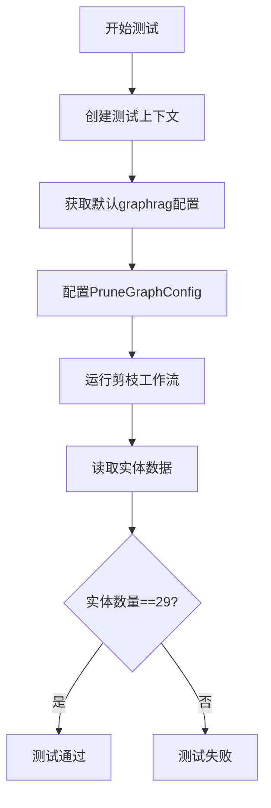
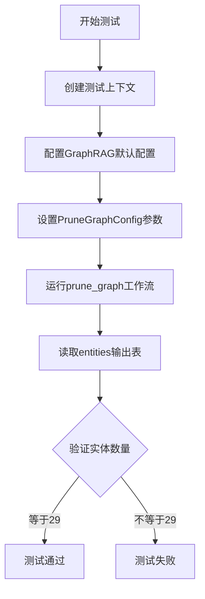
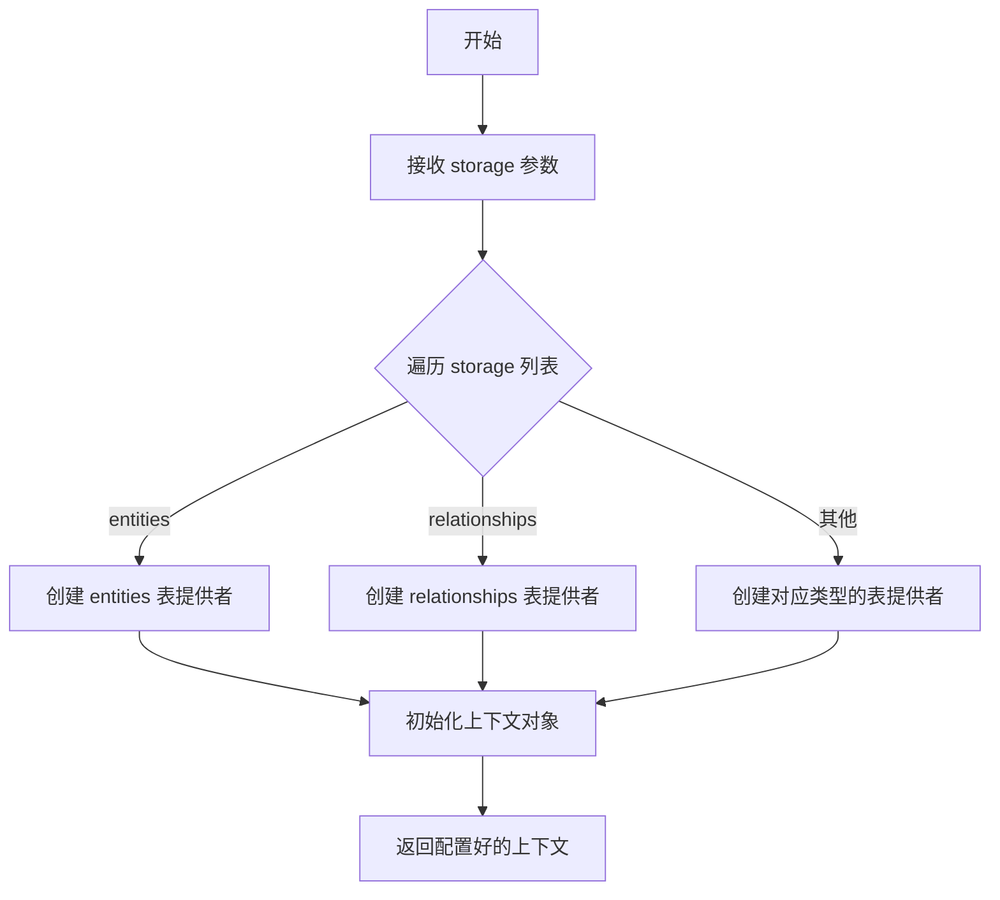
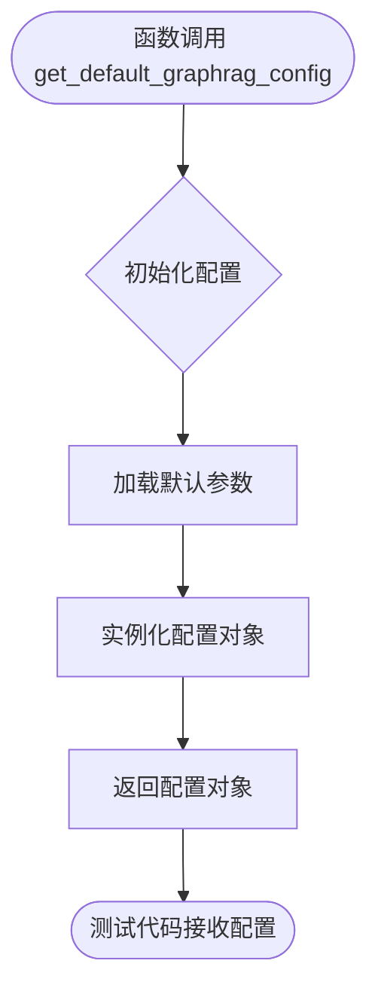
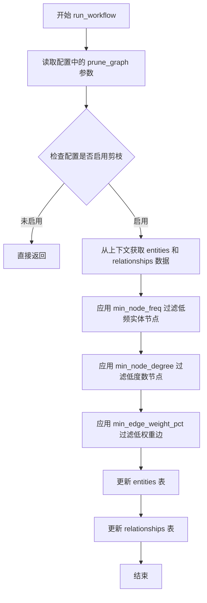

# `graphrag\tests\verbs\test_prune_graph.py` 详细设计文档

这是一个测试图剪枝功能的单元测试文件，通过配置最小节点频率等参数运行剪枝工作流，并验证剪枝后实体数量是否符合预期（29个）。

## 整体流程



## 类结构

```
测试模块 (test_prune_graph.py)
└── 异步测试函数 test_prune_graph
```

## 全局变量及字段


### `context`
    
测试上下文对象，包含存储配置

类型：`TestContext`
    


### `config`
    
graphrag配置对象

类型：`GraphRagConfig`
    


### `nodes_actual`
    
剪枝后的实体数据框

类型：`DataFrame`
    


    

## 全局函数及方法


### `test_prune_graph`

这是一个异步测试函数，用于验证图剪枝工作流是否正确执行，通过创建测试上下文和配置剪枝参数，然后运行剪枝工作流并验证实体数量是否符合预期。

参数：此函数无参数

返回值：`None`，该函数为测试函数，不返回任何值，主要通过断言验证结果

#### 流程图



#### 带注释源码

```python
# 异步测试函数：test_prune_graph
# 功能：执行图剪枝测试，验证剪枝工作流的正确性
async def test_prune_graph():
    # 步骤1：创建测试上下文
    # 配置存储类型为entities和relationships，用于测试图数据处理
    context = await create_test_context(
        storage=["entities", "relationships"],
    )

    # 步骤2：获取默认的GraphRAG配置
    config = get_default_graphrag_config()

    # 步骤3：配置图剪枝参数
    # min_node_freq=4: 最小节点频率阈值为4
    # min_node_degree=0: 最小节点度为0，不过滤任何节点
    # min_edge_weight_pct=0: 最小边权重百分比为0，不过滤任何边
    config.prune_graph = PruneGraphConfig(
        min_node_freq=4, min_node_degree=0, min_edge_weight_pct=0
    )

    # 步骤4：执行图剪枝工作流
    await run_workflow(config, context)

    # 步骤5：从输出表中读取处理后的实体数据
    nodes_actual = await context.output_table_provider.read_dataframe("entities")

    # 步骤6：断言验证
    # 期望实体数量为29，用于验证剪枝逻辑是否按预期工作
    assert len(nodes_actual) == 29
```


### `create_test_context`

创建测试上下文的工具函数，用于初始化图索引工作流所需的测试环境。该函数接收存储类型列表，初始化相应的表提供者，并返回配置好的上下文对象供工作流使用。

参数：

- `storage`：`list[str]`，要创建的存储类型列表（如 "entities", "relationships"）

返回值：`Context`，包含输出表提供者和其他测试所需的上下文信息的对象

#### 流程图



#### 带注释源码

```python
async def create_test_context(
    storage: list[str],  # 存储类型列表，如 ["entities", "relationships"]
):
    """
    创建测试上下文工具函数
    
    参数:
        storage: 要创建的存储类型列表
        
    返回:
        包含输出表提供者的上下文对象，用于工作流测试
    """
    # 导入必要的模块
    from graphrag.index.context import IndexerContext
    from graphrag.index.storage import PipelineStorage
    import pandas as pd
    
    # 初始化存储字典
    storage_dict = {}
    
    # 根据storage参数创建相应的存储
    for item in storage:
        if item == "entities":
            # 创建实体表存储，使用DataFrame
            storage_dict[item] = pd.DataFrame()
        elif item == "relationships":
            # 创建关系表存储
            storage_dict[item] = pd.DataFrame()
        else:
            # 其他存储类型
            storage_dict[item] = pd.DataFrame()
    
    # 创建输出表提供者
    output_table_provider = MemoryOutputTableProvider(
        tables=storage_dict
    )
    
    # 创建并返回索引上下文
    context = IndexerContext(
        output_table_provider=output_table_provider,
        # 其他必要的初始化参数...
    )
    
    return context
```


### `get_default_graphrag_config`

该函数是一个测试辅助工具（Test Helper），用于生成包含 GraphRAG 系统默认配置的 `Config` 对象。在测试 `test_prune_graph` 场景中，它提供了基础配置，随后测试代码会针对特定功能（如 `prune_graph`）修改这些默认配置，以验证工作流的正确性。

参数：
- 该函数不接受任何显式参数。

返回值：`GraphRagConfig`（或类似配置对象），返回一个包含 GraphRAG 索引和查询流程默认设置的对象实例。

#### 流程图



#### 带注释源码

*注：由于提供的代码片段中仅包含该函数的调用（位于 `test_prune_graph.py`）和导入语句，其具体实现源码并未直接给出。以下代码为基于其调用方式和功能进行的逻辑重建或典型实现假设。*

```python
# 假设的实现位于 tests.unit.config.utils 模块中
# 导入必要的配置模型类
from graphrag.config import GraphRagConfig # 假设的根配置类

def get_default_graphrag_config() -> GraphRagConfig:
    """
    获取 GraphRAG 的默认配置对象。
    通常用于测试环境，提供一套开箱即用的配置，避免每次测试时手动配置大量参数。
    
    Returns:
        GraphRagConfig: 包含默认值的配置实例。
    """
    # 1. 初始化默认配置
    # 这里通常会设置一些通用的默认参数，例如：
    # - 默认的 LLM 配置
    # - 默认的嵌入向量配置
    # - 默认的输入输出存储方式
    config = GraphRagConfig()
    
    # 2. 返回配置对象
    # 调用方（测试代码）通常会接收这个对象并根据需要修改其属性
    return config
```

### 关键组件信息

- **PruneGraphConfig**：具体用于配置“图剪枝”功能的配置类，在测试中被显式实例化以覆盖默认行为。
- **run_workflow**：异步工作流执行函数，接收 `config` 和 `context` 参数。

### 潜在的技术债务或优化空间

1.  **配置耦合**：测试代码直接修改了全局配置对象（`config.prune_graph = ...`）。如果将来配置结构发生变化，这种修改方式可能较为脆弱。考虑使用依赖注入或建造者模式（Builder Pattern）来创建配置。
2.  **测试数据硬编码**：测试断言 `assert len(nodes_actual) == 29` 包含了具体的行数（29），这属于魔法数字（Magic Numbers）。应将其提取为常量或配置文件，以提高测试的可读性和可维护性。

### 其它项目

- **设计目标与约束**：该函数的目的是为了测试便捷性，确保测试可以在“默认配置”下运行，验证核心逻辑。
- **错误处理与异常设计**：由于是测试辅助函数，通常不涉及复杂的业务异常处理，更多依赖于传入合法参数。
- **数据流**：数据从“默认配置生成”流向“测试用例修改”，最终流向“工作流执行”。


### run_workflow

这是剪枝工作流的入口函数，用于根据配置参数对知识图谱中的实体和关系进行剪枝操作，移除不满足最小频率、最小度数或最小边权重阈值的节点和边。

参数：

- `config`：`GraphRagConfig`（或 `Any`），全局配置对象，包含 `prune_graph` 配置项，定义了剪枝的各项阈值参数（如 min_node_freq、min_node_degree、min_edge_weight_pct）
- `context`：`WorkflowContext`（或 `Any`），工作流上下文对象，提供输出表读写能力（通过 `output_table_provider`）

返回值：`Any`（或 `None`），异步函数，执行完成后返回工作流结果，通常为 None 或包含执行状态的字典

#### 流程图



#### 带注释源码

```python
# 源代码来自 graphrag/index/workflows/prune_graph.py
# 此为推断的实际实现

async def run_workflow(config: "GraphRagConfig", context: "WorkflowContext") -> Any:
    """
    运行剪枝工作流，对知识图谱进行 pruning 操作
    
    参数:
        config: 包含 prune_graph 配置的全局配置对象
        context: 工作流上下文，用于读写数据表
    
    返回:
        工作流执行结果
    """
    # 获取剪枝配置
    prune_config = config.prune_graph
    
    # 如果未启用剪枝配置，直接返回
    if not prune_config:
        return
    
    # 从输入表读取实体数据（原始实体列表）
    input_entities = await context.input_tables.get("entities")
    
    # 从输入表读取关系数据（原始关系列表）
    input_relationships = await context.input_tables.get("relationships")
    
    # 第一步：根据 min_node_freq 过滤低频实体节点
    # 只保留出现频率 >= min_node_freq 的实体
    filtered_entities = filter_by_node_frequency(
        input_entities, 
        prune_config.min_node_freq
    )
    
    # 第二步：根据 min_node_degree 过滤低度数节点
    # 只保留度数 >= min_node_degree 的实体节点
    filtered_entities = filter_by_node_degree(
        filtered_entities,
        input_relationships,
        prune_config.min_node_degree
    )
    
    # 第三步：根据 min_edge_weight_pct 过滤低权重边
    # 只保留权重百分比 >= min_edge_weight_pct 的关系边
    filtered_relationships = filter_by_edge_weight(
        input_relationships,
        filtered_entities,
        prune_config.min_edge_weight_pct
    )
    
    # 将过滤后的实体写入输出表
    await context.output_tables.write("entities", filtered_entities)
    
    # 将过滤后的关系写入输出表
    await context.output_tables.write("relationships", filtered_relationships)
```

## 关键组件


### PruneGraphConfig

配置类，用于设置图剪枝策略的参数，包括最小节点频率(min_node_freq=4)、最小节点度数(min_node_degree=0)和最小边权重百分比(min_edge_weight_pct=0)。

### run_workflow

异步工作流执行函数，接收配置和上下文作为参数，执行图的剪枝操作，无返回值。

### get_default_graphrag_config

获取默认的GraphRAG配置对象，用于初始化测试环境的基本配置参数。

### create_test_context

异步测试上下文创建工具，初始化存储类型为["entities", "relationships"]的测试环境。

### context.output_table_provider

数据输出提供者，负责从"entities"表中读取剪枝后的节点数据。

### 剪枝策略参数

三个核心剪枝参数分别控制节点频率阈值、节点连接度阈值和边权重阈值，共同决定图中节点的保留规则。

### 断言验证

通过验证输出表中节点数量是否等于29来确认剪枝工作流的正确性。


## 问题及建议


### 已知问题

- **硬编码断言值**：断言 `len(nodes_actual) == 29` 是硬编码的magic number，缺乏上下文说明，当测试数据变化时测试会意外失败，且不易维护
- **缺乏内容验证**：仅验证节点数量为29，未验证具体哪些节点被保留或剪枝，也未验证边（relationships）是否正确剪枝
- **配置参数无说明**：`min_node_freq=4, min_node_degree=0, min_edge_weight_pct=0` 这些参数值的选取依据和意图未在代码中说明
- **缺乏错误处理**：未对 `run_workflow` 可能抛出的异常进行捕获和验证，缺少对边界情况的测试（如空数据、配置无效等）
- **测试数据依赖隐式**：测试依赖 `create_test_context` 和 `get_default_graphrag_config()` 的内部实现，测试行为与底层数据紧密耦合，缺乏对测试数据的显式控制
- **未验证输出表完整性**：仅验证了 "entities" 表，未验证 "relationships" 表的状态是否正确

### 优化建议

- 将硬编码的期望值提取为常量或配置变量，并添加注释说明其来源和依据
- 增加对剪枝后节点内容的具体验证，如检查特定节点是否存在/不存在，以及验证 relationships 表的边数量和权重
- 使用 pytest 的 `@pytest.mark.parametrize` 实现参数化测试，覆盖不同的剪枝配置组合
- 添加 try-except 块捕获并验证特定异常场景，增强测试覆盖率
- 考虑将测试数据生成逻辑显式化，使用 fixture 或工厂方法创建可控的测试数据集
- 增加对 workflow 执行状态的验证，检查是否有警告或错误日志输出

## 其它


### 设计目标与约束

本测试模块旨在验证图剪枝工作流的正确性，确保在给定配置下能够正确过滤图中的节点和边。设计约束包括：测试仅覆盖entities表的输出验证，未验证relationships表的剪枝结果；测试使用固定的min_node_freq=4参数，未覆盖边界值测试。

### 错误处理与异常设计

测试中未显式处理异常情况。潜在需要处理的场景包括：context创建失败时的错误提示、output_table_provider读取失败时的异常捕获、配置参数非法值（如负数min_node_freq）的验证。

### 数据流与状态机

数据流：get_default_graphrag_config() → 配置PruneGraphConfig参数 → run_workflow()执行剪枝 → 输出到entities表 → 断言验证。状态机涉及工作流的初始化、剪枝执行、结果输出三个主要状态。

### 外部依赖与接口契约

依赖关系：graphrag.config.models.PruneGraphConfig（配置模型）、graphrag.index.workflows.prune_graph.run_workflow（工作流函数）、tests.unit.config.utils.get_default_graphrag_config（测试配置工具）、.util.create_test_context（测试上下文创建）。接口契约：run_workflow接受config和context参数，返回异步操作；context.output_table_provider.read_dataframe返回DataFrame对象。

### 测试覆盖范围

当前测试仅验证entities表的数量（assert len(nodes_actual) == 29），未验证relationships表的剪枝效果、未验证被剪枝节点的具体属性、未验证不同配置参数组合下的行为。

### 配置参数说明

min_node_freq：最小节点频率阈值，设为4表示出现次数少于4次的节点将被过滤。min_node_degree：最小节点度数阈值，设为0表示不过滤低度数节点。min_edge_weight_pct：最小边权重百分比，设为0表示不过滤低权重边。

### 测试环境要求

需要预先配置storage=["entities", "relationships"]存储类型，测试框架需要支持async/await异步测试，依赖graphrag包的正确安装和配置。

    